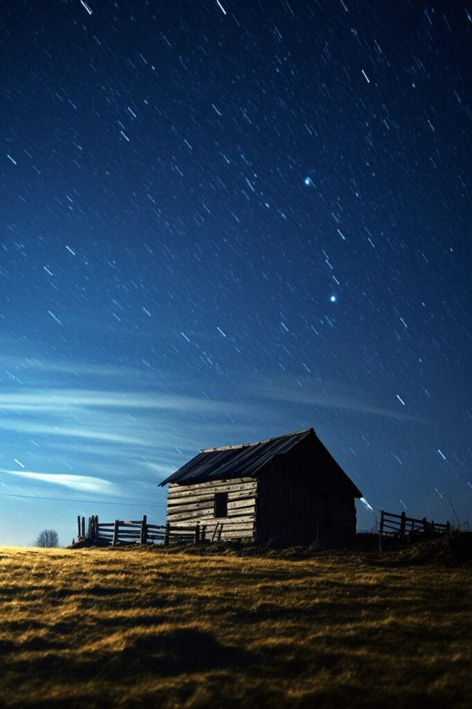
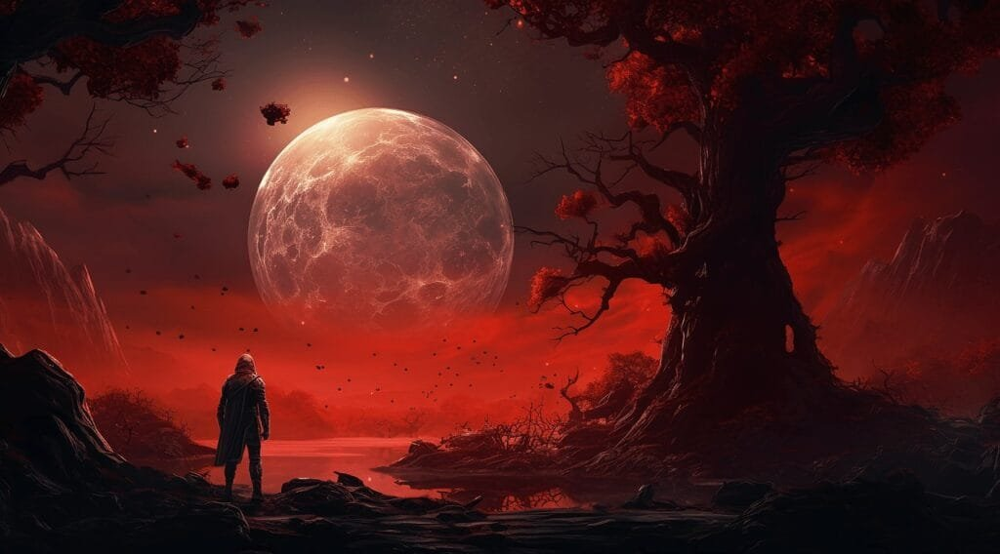

Have you ever wondered why dwarf planets have volcanoes? It may seem surprising, considering their small size compared to planets like Earth or Mars. However, the relationship between dwarf planets and volcanoes is fascinating. Volcanoes are not exclusive to large planets; they can also be found on smaller celestial bodies like dwarf planets. In this article, we will explore the reasons behind the presence of volcanoes on these tiny worlds and the implications it has on our understanding of celestial bodies. From the formation of volcanoes to the unique characteristics of dwarf planets, we will delve into the intriguing connection between these two phenomena. So, let's embark on a journey of discovery and explore the captivating relationship between dwarf planets and volcanoes.

This image is property of pixabay.com.

## Understanding Volcanoes

Volcanoes are fascinating geological features that have captivated humans for centuries. Understanding the nature and behavior of volcanoes is not only of scientific interest but also vital for the safety and well-being of communities living in their vicinity. In this article, we will explore various aspects of volcanoes, including their definition, formation, types, eruption patterns, causes, hazards, and benefits.

### Definition and Formation of Volcanoes

Volcanoes are the result of molten rock, gases, and debris escaping to the Earth's surface, leading to eruptions of lava and ash. These geological formations can be found in locations such as plate boundaries, hotspots under the Earth's crust, and rift zones where the tectonic plates are moving apart. The process of volcano formation begins deep within the Earth, where heat and pressure can melt rock and create magma chambers. When the pressure becomes too great, the magma rises to the surface, forming a volcano.

### Various Types of Volcanoes

Volcanoes come in different shapes and sizes, each with its unique characteristics. Some of the most common types include shield volcanoes, stratovolcanoes, and [cinder cone](https://magmamatters.com/the-birth-of-new-land-understanding-cinder-cones/) volcanoes. Shield volcanoes, like those found in the Hawaiian Islands, have a broad and gently sloping profile. They are characterized by low viscosity lava, which flows easily and forms wide, flattened cones. Stratovolcanoes, also known as composite volcanoes, have steep sides and a conical shape. These volcanoes are made up of alternating layers of lava, pyroclastic materials, and volcanic ash. Lastly, cinder cone volcanoes are the simplest in structure, typically forming from ash and cinder deposits that accumulate around a vent.

### Geographic Distribution of Volcanoes

Volcanoes are not evenly distributed across the Earth's surface but are concentrated in specific regions. One such area is the "Ring of Fire," encircling the Pacific Ocean, where the majority of the world's volcanic activity occurs. This region is characterized by its volcanic arcs, volcanic belts, and tectonic plate boundaries. Other volcanic hotspots can be found in places like Iceland, the Canary Islands, and areas along the Mid-Atlantic Ridge. Understanding the geographic distribution of [volcanoes](https://magmamatters.com/understanding-volcanic-formation-a-comprehensive-guide/ "Understanding Volcanic Formation: A Comprehensive Guide") helps scientists monitor and predict volcanic activity in these susceptible areas.

### Eruption Patterns

Volcanic eruptions can display a wide range of patterns, depending on factors such as lava viscosity, gas content, and the type of volcano. Eruptions can range from gentle effusions of lava to explosive events that release enormous ash plumes and pyroclastic flows. Some volcanoes may exhibit a regular pattern of eruptions, occurring at predictable intervals, while others may have erratic activity. Scientists use various monitoring techniques, including seismology and gas measurements, to detect pre-eruptive signals, helping in the prediction and mitigation of volcanic hazards.

### Causes of Eruptions

The causes of volcanic eruptions are complex and varied, involving a combination of factors and processes. The primary driving force behind eruptions is the existence of magma beneath the Earth's surface. When the pressure within a magma chamber exceeds the strength of the surrounding rocks, an eruption can occur. This pressure build-up can be caused by factors such as tectonic plate motions, the injection of new magma into an existing chamber, or the release of volatile gases from the magma. Understanding the causes of eruptions is crucial for assessing volcanic hazards and implementing effective mitigation strategies.

### Hazards and Benefits of Volcanoes

Volcanic eruptions pose significant hazards to both human and natural environments. The release of ash, gases, and pyroclastic flows can cause immediate dangers, such as air pollution, respiratory problems, and destruction of infrastructure. Additionally, volcanic eruptions can trigger secondary hazards such as landslides, tsunamis, and lahars (mudflows). However, volcanoes also provide several benefits. Volcanic soils are highly fertile and contribute to agricultural productivity. Furthermore, [geothermal energy harnessed from volcanic](https://magmamatters.com/geothermal-energy-and-its-volcanic-origins/ "Geothermal Energy and Its Volcanic Origins") zones offers a sustainable and renewable source of power. By understanding the hazards and benefits of volcanoes, communities can make informed decisions and take appropriate measures to mitigate risks and maximize benefits.

Now that we have covered the essential aspects of understanding volcanoes, let's shift our focus to a fascinating topic - the existence of volcanoes on dwarf planets.

## What are Dwarf Planets?

Dwarf planets are a category of celestial bodies that share some characteristics with planets but do not fully meet the criteria to be classified as such. According to the International Astronomical Union's definition, a dwarf planet must orbit the Sun, be spherical in shape, and have cleared its orbit of debris. These celestial objects are smaller than planets and have less gravitational influence on their surroundings.

### Definition and Characteristics of Dwarf Planets

Dwarf planets are defined by their physical properties and orbital characteristics. Unlike planets, they have not cleared their orbital path of debris, resulting in several dwarf planets sharing their orbit with other objects. These celestial bodies are spherical in shape, as their gravity pulls them into a roughly spherical form. Dwarf planets, like regular planets, can have moons orbiting them and may be composed of various materials such as rock, ice, and gas.

### Known Dwarf Planets in the Universe

As our understanding of the solar system and beyond has expanded, astronomers have identified several dwarf planets in our universe. One of the most famous and well-known dwarf planets is Pluto, which was reclassified as a dwarf planet in 2006. Other dwarf planets discovered in our solar system include Eris, Haumea, Makemake, and Ceres. These celestial bodies offer insights into the diversity and complexity of our cosmic neighborhood.

Now that we have a basic understanding of what dwarf planets are, let's explore the intriguing possibility of volcanoes existing on these celestial objects.

<iframe width="560" height="315" src="https://www.youtube.com/embed/-Mlh4qBZJmU" frameborder="0" allow="accelerometer; autoplay; encrypted-media; gyroscope; picture-in-picture" allowfullscreen></iframe>

  

## Existence of Volcanoes on Dwarf Planets

The existence of volcanoes on dwarf planets has been a subject of scientific curiosity and exploration. While volcanoes are commonly associated with Earth's geological activity, recent discoveries have suggested that they may also be present on some dwarf planets. In this section, we will delve into the discovery of volcanic activity on dwarf planets and examine the evidence supporting their existence.

### Discovery of Volcanic Activity on Dwarf Planets

The detection and confirmation of volcanic activity on dwarf planets have been made possible through various technological advancements and space missions. One significant mission was NASA's New Horizons spacecraft, which captured essential data and images of Pluto during its flyby in 2015. The data collected by New Horizons revealed intriguing features on Pluto's surface, including evidence of past and possibly ongoing volcanic activity. Similar discoveries have been made regarding dwarf planets such as Ceres and its intriguing volcanic structure known as Ahuna Mons.

### Evidences Supporting Volcanic Activity on Dwarf Planets

The evidence supporting volcanic activity on dwarf planets is derived from a combination of geological features and chemical compositions analyzed through telescopic observations and spacecraft missions. On Pluto, for example, the presence of smooth plains and mountain ranges with apparent volcanic origins suggests recent geological activity. The presence of cryovolcanoes, which release volatile materials such as water and ammonia instead of molten rock, has been detected on both Pluto and Ceres. These observations indicate that volcanic processes can occur on dwarf planets, although the mechanisms may differ from those on Earth.

Now that we have established the existence of volcanoes on dwarf planets, let's delve into a comparative study that explores their similarities and differences to volcanoes on our own planet.

## Comparative Study of Volcanoes on Earth and Dwarf Planets

Comparing and contrasting volcanic activity on Earth and dwarf planets offers valuable insights into the geological processes shaping these diverse celestial bodies. In this section, we will explore the scale and intensity of eruptions, the variation in lava composition and structure, and the potential connection between tectonic activities and volcanoes on dwarf planets.

### Scale and Intensity of Eruptions

Volcanic eruptions on Earth range from gentle effusions of lava to explosive events that can have far-reaching impacts. The size and intensity of eruptions are influenced by factors such as magma composition, volatile gas content, and the tectonic setting. Shield volcanoes, such as those in Hawaii, tend to have more fluid lava and less explosive eruptions compared to stratovolcanoes like Mount St. Helens. In contrast, dwarf planets with volcanic activity, such as Pluto, may exhibit cryovolcanism, where the eruptions involve materials like water ice and ammonia. The scale and intensity of eruptions on dwarf planets are determined by the unique composition and physical properties of these celestial bodies.

### Variation in Lava Composition and Structure

Lava composition and structure play a crucial role in shaping the characteristics of volcanic activity. On Earth, the dominant type of lava is basalt, which is rich in iron and magnesium. This type of lava forms shield volcanoes known for their broad shape and gentle slopes. In contrast, dwarf planets may have different compositions, including the presence of ices such as water and ammonia. The volcanic activity on these celestial bodies, known as cryovolcanism, involves the eruption of icy materials instead of molten rock. The composition and structure of lava on dwarf planets are likely to be distinct from those on Earth, resulting in contrasting volcanic features.

### Tectonic Activities and Volcanoes on Dwarf Planets

Tectonic activities, such as the movement of tectonic plates, are intimately linked to volcanic activity on Earth. Plate boundaries, where tectonic plates interact, are often hotspots for volcanic eruptions. On dwarf planets, however, the tectonic processes may differ. While the exact nature of tectonic activities on dwarf planets is still being studied, it is postulated that the gravitational interactions between these celestial bodies and their moons, as well as the cooling and contraction of icy crusts, could play a role in triggering volcanic activity. Further research and exploration will help unravel the connection between tectonics and volcanoes in the realm of dwarf planets.

Now that we have examined the general characteristics of volcanoes on dwarf planets, let's take a closer look at specific examples to gain a better understanding of their unique features.

This image is property of pixabay.com.

## Specific Examples of Volcanoes on Dwarf Planets

Cryovolcanoes on Pluto and Ahuna Mons on Ceres are two prominent and intriguing examples of volcanic activity on dwarf planets. These specific instances offer valuable insights into the geological processes occurring on these celestial bodies and the distinct features they exhibit.

### Cryovolcanoes on Pluto

The discovery of cryovolcanism on Pluto has revolutionized our understanding of dwarf planet geology. Pluto's cryovolcanoes, also known as ice volcanoes, are thought to erupt icy materials such as water, ammonia, and nitrogen. These substances freeze at the extremely cold temperatures found on Pluto's surface, allowing for the formation of unique geological structures. The presence of these cryovolcanoes suggests that geological activity is not exclusive to planets and may occur in other reaches of the universe.

### Ahuna Mons on Ceres

Ahuna Mons, a mountain-like structure on the dwarf planet Ceres, has captivated scientists since its discovery by the Dawn spacecraft in 2015. The formation and appearance of Ahuna Mons resemble a volcanic dome, suggesting that it may be a cryovolcano. The relatively smooth and featureless surroundings of Ahuna Mons further support this hypothesis. The study of Ahuna Mons provides valuable evidence of cryovolcanism on Ceres, expanding our knowledge of volcanic processes beyond Earth.

By studying specific examples of volcanoes on dwarf planets, scientists can gain deeper insights into their unique geological features and expand our understanding of the universe.

Now that we have explored specific examples of volcanoes on dwarf planets, let us consider the influence of the environment on volcanic activity in the context of these celestial bodies.

## The Influence of Dwarf Planets' Environment on Volcanic Activity

The environment in which dwarf planets exist plays a crucial role in shaping their volcanic activity. Factors such as temperature, gravity, and atmospheric conditions can influence the type, scale, and characteristics of volcanic eruptions. In this section, we will explore the effects of these environmental factors on volcanic activity on dwarf planets.

### Temperature and Gravity Effects

The extremely low temperatures experienced on dwarf planets can have a significant impact on volcanic activity. The presence of ices, such as water and ammonia, in the crust and subsurface of these celestial bodies can affect the behavior of the erupting materials. The low temperatures cause the volcanic materials to freeze quickly, altering their flow and changing the physical appearance of the volcanic structures. Additionally, the strength of gravity on dwarf planets is much lower than on Earth, affecting how volcanic materials move and shape the landscape.

### Atmospheric Conditions and Volcanoes on Dwarf Planets

The presence or absence of an atmosphere on a dwarf planet can have important implications for volcanic activity. An atmosphere can affect the behavior of [volcanic gases](https://magmamatters.com/the-art-and-science-of-volcano-monitoring/ "The Art and Science of Volcano Monitoring"), the dynamics of eruptions, and the subsequent dispersion of volcanic ash. Pluto, for example, has a thin atmosphere that can influence the behavior of erupted materials. The lack of a substantial atmosphere on other dwarf planets, such as Ceres, may result in different volcanic processes and characteristics. The study of how atmospheric conditions interact with volcanic activity on dwarf planets offers valuable insights into their unique geological systems.

Now that we have explored the influence of the environment on volcanic activity on dwarf planets, let us delve into the underlying reasons why these celestial bodies have volcanoes.

This image is property of pixabay.com.

## Why Do Dwarf Planets Have Volcanoes?

The presence of volcanoes on dwarf planets raises intriguing questions about the processes that drive their formation and eruption. Several factors contribute to the existence of volcanoes on dwarf planets, including geological heat sourced from the interior and tectonic activity. Additionally, impacts from external bodies and radiogenic heating can influence volcanic activity on these celestial objects.

### Sourced Geological Heat and Tectonic Activity

Dwarf planets, like their larger planetary counterparts, possess internal heat generated through various mechanisms. Gravitational interactions, radioactive decay, and tidal forces can all contribute to heating the interiors of these celestial bodies. The presence of geological heat allows for the partial melting of rock or icy materials, creating the necessary conditions for volcanic activity. Tectonic activity, resulting from the movement and interaction of the dwarf planet's crust, can further influence the location and characteristics of volcanic eruptions.

### Impacts and Radiogenic Heating

External events, such as impacts from asteroids or comets, can also trigger volcanic activity on dwarf planets. The tremendous energy released during an impact can cause the melting of subsurface materials and initiate volcanic processes. Additionally, radiogenic heating, which occurs as a result of the decay of radioactive isotopes within a dwarf planet, can contribute to the generation of heat and drive volcanic activity.

The factors contributing to volcanic activity on dwarf planets are multi-faceted and interconnected. By further studying these intricate processes, scientists can deepen their understanding of how dwarf planets evolve and transform.

## The Role of Volcanoes in Dwarf Planets' Evolution

Volcanic activity plays a significant role in shaping the evolution of dwarf planets. The materials released during volcanic eruptions contribute to various geologic processes, including planetesimal growth and atmosphere development. In this section, we will explore how volcanoes influence the evolutionary trajectory of these celestial bodies.

### Volcanic Contributions to Planetesimal Growth

Volcanic eruptions on dwarf planets can release materials that contribute to the growth of planetesimals, which are the building blocks of larger celestial bodies. During eruptions, volatile materials and fine particles are expelled into space. These materials can condense and accumulate, eventually forming asteroids or comets. The continuous eruption and expulsion of these materials from volcanic vents contribute to the growth and diversity of planetesimals within the dwarf planet's surroundings.

### Volcanic Role in Atmosphere Development

Volcanic outgassing, the release of gases during eruptions, also influences the atmosphere of dwarf planets. The expelled gases, such as water vapor, carbon dioxide, and sulfur dioxide, can contribute to the formation and modification of the atmosphere surrounding these celestial bodies. Understanding the composition and dynamics of these atmospheres is key to comprehending the overall evolution and habitability of the dwarf planet.

By studying the role of volcanoes in dwarf planets' evolution, scientists can unravel the complex processes that have shaped these celestial bodies throughout cosmic history.

## Future Research Directions and Unanswered Questions

While significant progress has been made in understanding the volcanoes on dwarf planets, numerous unanswered questions remain. Future research endeavors will focus on the following areas to further our knowledge:

### Unknowns about Volcanoes on Dwarf Planets

There are still many uncertainties surrounding the volcanoes on dwarf planets. Scientists are keen to understand the specific mechanisms that drive volcanic eruptions on these celestial bodies, the long-term implications of volcanic activity, and how environmental factors influence volcanic processes. Further investigations and data collection from ongoing and future space missions will shed light on these unknowns.

### Future Technologies and Missions for Exploration

Advancements in technology and space exploration allow for more comprehensive investigations of dwarf planets and their volcanic activity. Improved imaging capabilities, remote sensing techniques, and sophisticated instrumentation will enable scientists to study volcanic structures and volcanic gases in greater detail. Furthermore, planned missions, such as the European Space Agency's JUICE mission to Jupiter's moon Ganymede, will provide invaluable insights into the volcanic activity of icy celestial bodies.

By focusing on these research directions and leveraging emerging technologies, scientists will be able to address existing gaps in knowledge and unravel the mysteries of volcanoes on dwarf planets.

## Implications for the Search for Extraterrestrial Life

The presence of volcanoes on dwarf planets has significant implications for the search for extraterrestrial life. Volcanic activity can serve as an indicator of a dwarf planet's habitability and offer insights into potential ecosystems. In this section, we will explore how volcanoes can influence the search for life beyond Earth.

### Volcanoes as Indicators of Planetary Habitability

Volcanic activity can create a range of environmental conditions that may be conducive to the development and sustenance of life. For instance, volcanic gases can contribute to the formation of a protective atmosphere and regulate a dwarf planet's surface temperature. Additionally, volcanic processes can release nutrients and minerals into the environment, providing essential elements for potential life forms. By studying the volcanoes on dwarf planets, scientists can identify habitable conditions and focus their search for extraterrestrial life accordingly.

### Speculations on Life on Volcano-bearing Dwarf Planets

While the existence of life on volcano-bearing dwarf planets is purely speculative, studying their volcanic activity can provide insights into the potential habitability of these celestial bodies. The presence of cryovolcanism, for example, suggests the presence of volatiles that could serve as energy and nutrient sources for hypothetical organisms. Understanding the range of environments that volcanoes on dwarf planets can create expands our understanding of the conditions under which life could arise and provides valuable clues for future exploration.

In conclusion, volcanoes on dwarf planets offer a captivating area of scientific exploration and understanding. By comprehending the formation, characteristics, and implications of volcanic activity on these celestial bodies, scientists can unlock the secrets of our universe and expand our understanding of both the Earth and beyond. Through ongoing research, future missions, and technological advancements, we are poised to unravel the mysteries surrounding volcanoes and their profound impact on dwarf planets.

