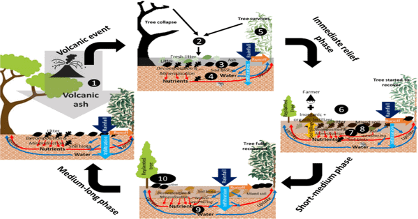
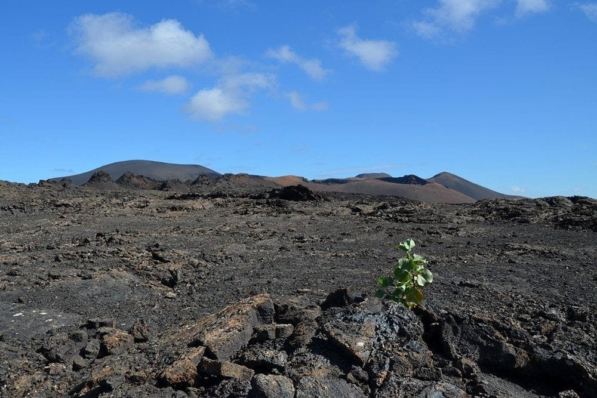
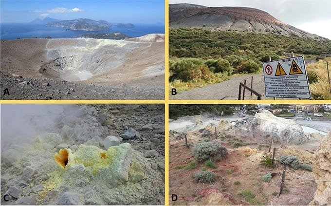
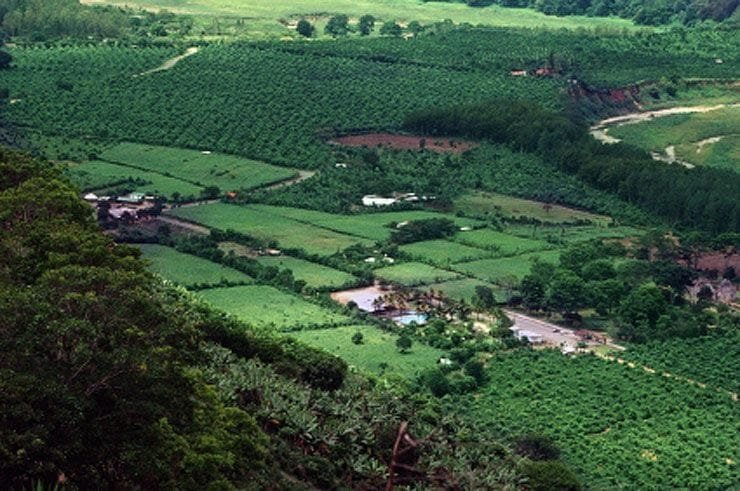

Volcanoes and their eruptions have long been a topic of fascination and awe. But did you know that these fiery natural wonders also play a crucial role in enriching the soil with nutrients? Volcanic soil, often referred to as volcanic ash or tephra, is known for its incredible fertility and ability to support abundant plant growth. In this article, we will explore the relationship between volcanic soil and nutrient enrichment, delving into the reasons behind its nutrient-rich properties and the benefits it brings to ecosystems and agriculture. So, get ready to unearth the secrets of volcanic soil and discover how it contributes to the flourishing of life on Earth.

This image is property of fairgaze.com.

## Formation of Volcanoes

Volcanoes are formed when molten rock, gases, and debris escape to the Earth's surface, causing eruptions of lava and ash. This molten rock, known as magma, is created when the Earth's mantle, which lies beneath the crust, melts due to high temperatures and pressures. The magma rises to the surface through cracks and weaknesses in the Earth's crust, forming a volcano.

Volcanoes can form in different locations. One common location is at plate boundaries, where tectonic plates are moving apart or colliding. When plates move apart, magma rises to fill the gap, leading to the formation of volcanoes. This is seen in areas such as the Mid-Atlantic Ridge.

Hotspots are another location where volcanoes form. These are areas deep within the Earth where a plume of hot mantle material rises towards the surface. As the mantle material reaches the surface, it forms a volcano. One well-known example of a hotspot volcano is the Hawaiian Islands, which are formed by the movement of the Pacific tectonic plate over a hotspot.

Rift zones, where the Earth's crust is being stretched and pulled apart, can also result in the formation of volcanoes. This stretching and pulling apart creates fractures in the Earth's surface through which magma can reach the surface, causing eruptions.

The eruption patterns of volcanoes can vary depending on factors such as the viscosity of the lava and the amount of gas in the magma. Viscosity refers to how easily a substance flows. Lava with low viscosity flows more easily, resulting in gentle eruptions. On the other hand, lava with high viscosity flows more slowly, leading to explosive eruptions. The gas content in magma can also affect eruption patterns. Higher gas content can lead to more explosive eruptions, while lower gas content results in less explosive eruptions.

Understanding the formation and eruption patterns of [volcanoes is essential for predicting future volcanic](https://magmamatters.com/geothermal-energy-and-its-volcanic-origins/ "Geothermal Energy and Its Volcanic Origins") activity and mitigating risks to surrounding communities. By studying the types of volcanoes and their characteristics, scientists can develop strategies to better prepare for and respond to volcanic eruptions.

## Geographical Distribution of Volcanoes

Volcanoes are not evenly distributed across the globe but are instead concentrated in specific areas. One of the most well-known volcanic regions is the "Ring of Fire." The Ring of Fire is a major area in the basin of the Pacific Ocean where many earthquakes and volcanic eruptions occur. It is a direct result of plate tectonics and the movement and collision of lithospheric plates. This area is prone to volcanic activity due to the occurrence of subduction zones, where one tectonic plate is forced beneath another. The subduction zones create intense heat and pressure, leading to the formation of volcanoes.

Hawaii is another region with a significant concentration of volcanoes. The Hawaiian Islands are formed by shield volcanoes, which are generally large, broad structures with gentle slopes. These volcanoes form over hotspots, which are areas of intense volcanic activity deep within the Earth's mantle. As the Pacific plate moves over the hotspot, a chain of volcanoes is formed, with the youngest volcano being the most active and the oldest volcano eroding away.

Volcanoes are also commonly found in areas where tectonic plates meet. This includes regions such as the Andes in South America, the Aleutian Islands in Alaska, and the Kamchatka Peninsula in Russia. These areas experience volcanic activity due to the collision or subduction of tectonic plates, creating ideal conditions for the formation of volcanoes.

<iframe width="560" height="315" src="https://www.youtube.com/embed/wWheTgkbsiY" frameborder="0" allow="accelerometer; autoplay; encrypted-media; gyroscope; picture-in-picture" allowfullscreen></iframe>

  

## Volcanic Hazards and Benefits

While [volcanoes can be fascinating natural phenomena](https://magmamatters.com/the-art-and-science-of-volcano-monitoring/ "The Art and Science of Volcano Monitoring"), they also pose significant hazards. Volcanic eruptions can result in natural disasters that have the potential to cause widespread destruction and loss of life. [Eruptions can release pyroclastic flows](https://magmamatters.com/the-environmental-impact-of-volcanic-eruptions-2/ "The Environmental Impact of Volcanic Eruptions"), which are fast-moving currents of hot gas, ash, and other volcanic materials. These pyroclastic flows can devastate everything in their path, including buildings, vegetation, and infrastructure.

Volcanic ash, another hazard of eruptions, can also pose risks to human health and the environment. Fine ash particles can be carried long distances by the wind, affecting air quality and posing respiratory risks. Ash fall can disrupt transportation, damage crops, and contaminate water sources, leading to a range of economic and environmental consequences.

Despite the hazards they pose, volcanic eruptions also bring benefits to the surrounding areas. Volcanic eruptions contribute to the creation of fertile soil through the deposition of volcanic ash and other materials. These volcanic materials contain essential nutrients needed for plant growth, such as nitrogen, phosphorus, and potassium. Over time, this nutrient-rich volcanic soil can support robust plant growth and increase agricultural productivity.

## Properties of Volcanic Soil

Volcanic soil, also known as volcanic ash soil or Andisol, possesses unique physical attributes and mineral composition that set it apart from other types of soil. The physical attributes of volcanic soil include its high porosity, which allows for excellent water retention and drainage. This porosity is due to the small and irregular particles found in volcanic ash, which create air pockets and allow for the movement of water.

Another physical attribute of volcanic soil is its dark color. The dark color is a result of the presence of organic matter, such as decomposed vegetation and microbial activity. This dark color allows the soil to absorb more sunlight, increasing the temperature and promoting microbial activity.

The mineral composition of volcanic soil is another significant characteristic. Volcanic soil is rich in minerals, including silica, iron, magnesium, calcium, and potassium. These minerals contribute to the fertility of the soil and provide essential nutrients for plant growth. The presence of these minerals in volcanic soil makes it an ideal medium for supporting the growth of various crops and plants.

The combination of the physical attributes and mineral composition of volcanic soil creates a highly fertile and productive environment for agriculture. The unique properties of volcanic soil make it an attractive option for farmers and gardeners looking to maximize their yields and cultivate healthy plants.

This image is property of www.scienceabc.com.

## Why Is Volcanic Soil Rich in Nutrients?

Volcanic soil owes its richness in nutrients to the volcanic materials deposited during eruptions. When a volcano erupts, it releases not only lava and ash but also gases and other volcanic materials. These materials contain essential nutrients needed for plant growth, such as nitrogen, phosphorus, and potassium.

One reason volcanic soil is rich in nutrients is the rapid breakdown of volcanic ash into available nutrients. Volcanic ash has a fine particle size, which allows for increased surface area and greater contact with water and soil microorganisms. This increased surface area speeds up the weathering process, enabling the release of nutrients from the ash. As the ash breaks down, it releases these nutrients into the soil, making them available for plants to absorb.

The nutrient content of volcanic [soil can also vary depending on the type of volcano](https://magmamatters.com/understanding-volcanic-formation-a-comprehensive-guide/ "Understanding Volcanic Formation: A Comprehensive Guide"). Different types of volcanoes produce different compositions of volcanic materials, which can impact nutrient availability. For example, shield volcanoes, like those in Hawaii, produce basaltic lava, which is low in nitrogen but high in other minerals. In contrast, stratovolcanoes, such as Mount Vesuvius, produce andesitic lava, which is rich in potassium but lower in other nutrients. The variation in nutrient content due to different volcano types adds to the uniqueness and diversity of volcanic soil.

## Nutrients Found in Volcanic Soil

Volcanic soil is known for its abundance of nutrients, both macronutrients, and micronutrients. Macronutrients are essential elements needed in relatively large quantities for plant growth, while micronutrients are required in smaller amounts.

Some of the macronutrients found in volcanic soil include:

- Nitrogen: Nitrogen is a vital component of proteins and is crucial for plant growth and development. It plays a role in photosynthesis, promotes leafy growth, and enhances the overall vigor of plants.
- Phosphorus: Phosphorus is essential for energy transfer and storage in plants. It is involved in photosynthesis, respiration, and the formation of DNA and RNA. Phosphorus also promotes root development and flowering.
- Potassium: Potassium is important for overall plant health and is involved in several physiological processes. It helps regulate water balance, improves disease resistance, and enhances fruit quality.

In addition to macronutrients, volcanic soil also contains various micronutrients that are essential for plant growth. These micronutrients include:

- Iron: Iron is necessary for chlorophyll production and photosynthesis. It also plays a role in enzyme activities within the plant.
- Magnesium: Magnesium is a central component of chlorophyll, which is responsible for capturing light energy during photosynthesis.
- Calcium: Calcium is vital for cell wall structure and helps regulate many plant processes, including nutrient uptake.

Each nutrient found in volcanic soil plays a specific role in the growth and development of plants. The combination of these nutrients in volcanic soil creates an ideal environment for maximizing plant growth and ensuring healthy, productive crops.

This image is property of www.frontiersin.org.

## Benefits of Volcanic Soil for Plant Growth

Volcanic soil provides numerous benefits for plant growth, making it highly desirable for agriculture and gardening purposes. Some of the key benefits include promoting healthier and robust growth, increasing resistance to pests and diseases, and improving the yield and quality of produce.

One of the significant advantages of volcanic soil is its ability to promote healthier and more robust growth in plants. The abundance of nutrients in volcanic soil provides plants with the essential elements they need for optimal growth and development. The macronutrients and micronutrients present in volcanic soil play crucial roles in various plant processes, such as photosynthesis, root development, and overall plant vigor. This nutrient-rich environment allows plants to thrive and reach their full potential, resulting in healthy and robust growth.

Volcanic soil also contributes to increased resistance to pests and diseases. The presence of nutrients in the soil strengthens plant immune systems, making them less susceptible to pest infestations and diseases. Additionally, the physical properties of volcanic soil, such as its porosity and water-draining capabilities, discourage the breeding and growth of harmful organisms. This natural defense mechanism reduces the need for synthetic pesticides and promotes environmentally friendly practices.

Furthermore, the use of volcanic soil can lead to improved yield and quality of produce. The nutrient-rich environment created by volcanic soil allows plants to absorb the necessary elements for growth, resulting in increased productivity. The use of volcanic soil in agricultural practices has been shown to enhance crop yields, boost fruit quality, and improve overall plant health. This benefits both farmers and consumers by providing a higher quantity and quality of agricultural products.

## Advantages to Agriculture

The advantages of volcanic soil extend beyond the benefits to plant growth and include several factors that make it an attractive option for agriculture. These advantages include benefits to crops, increased soil fertility, and improved drainage and water-holding capacity.

Volcanic soil provides significant advantages to crops, allowing them to thrive and produce high-quality yields. The nutrient-rich environment of volcanic soil ensures that crops have access to the essential elements needed for growth and development. This nutrient availability enhances the productivity of crops and can lead to higher yields compared to other types of soil.

Additionally, volcanic soil possesses high fertility due to its mineral composition and organic matter content. The presence of essential nutrients, such as nitrogen, phosphorus, and potassium, makes volcanic soil highly fertile and conducive to plant growth. The high fertility of volcanic soil reduces the need for synthetic fertilizers, resulting in cost savings for farmers and environmentally friendly agricultural practices.

Another advantage of volcanic soil is its excellent drainage and water-holding capacity. The physical attributes of volcanic soil, including its porosity and high water-retention capabilities, allow for the efficient movement of water throughout the soil profile. This prevents waterlogging and ensures that plants receive adequate moisture without the risk of excess water causing root damage or disease. The superior drainage and water-holding capacity of volcanic soil contribute to optimal plant growth and reduce the risk of water-related crop losses.

This image is property of 4.bp.blogspot.com.

## Potential Risks and Disadvantages of Volcanic Soil

While volcanic soil offers numerous benefits for plant growth, there are also potential risks and disadvantages associated with its use. These risks include issues with specific crop types, challenges in managing soil pH and nutrient balance, and potential environmental concerns.

One of the risks associated with volcanic soil is its suitability for specific crop types. While volcanic soil may be ideal for some crops, it may not be suitable for others due to its unique characteristics. Certain crops may require specific soil conditions, such as specific pH levels or drainage capabilities, that may not be met by volcanic soil. Farmers must consider these factors when choosing which crops to grow in volcanic soil to ensure optimal plant growth and yield.

Managing soil pH and nutrient balance can also pose challenges when using volcanic soil. Volcanic soil is naturally acidic due to the high levels of minerals present. While some crops thrive in acidic conditions, others may require a more neutral or alkaline pH. Adjusting and maintaining the pH of volcanic soil can require additional resources and careful monitoring to prevent imbalances that can be detrimental to plant health.

Furthermore, the high nutrient content in volcanic soil can result in nutrient imbalances if not properly managed. While the abundance of nutrients is beneficial for most crops, excessive amounts of certain nutrients can harm plants and disrupt nutrient uptake. Maintaining a proper nutrient balance in volcanic soil often requires regular soil testing and the careful application of fertilizers or amendments to meet the specific needs of the crops being cultivated.

Lastly, the use of volcanic soil in agriculture may raise potential environmental concerns. Volcanic soil has the potential to leach nutrients and minerals into water sources, which can lead to water pollution. Additionally, the extraction of volcanic soil from volcanic areas may disrupt natural ecosystems and contribute to habitat destruction. It is crucial to implement sustainable agricultural practices, proper soil management, and conservation strategies to minimize the environmental impact associated with volcanic soil use.

## Case Studies of Crops Grown in Volcanic Soil

The unique properties of volcanic soil have been harnessed in various regions, resulting in the successful cultivation of specific crops. Two notable case studies of crops grown in volcanic soil are coffee in Central America and wine in Italy. Additionally, the Hawaiian Islands serve as an example of the wide range of crops that thrive in volcanic soil.

Central America is renowned for its coffee production, which is primarily grown in volcanic regions such as Costa Rica, Guatemala, and El Salvador. The volcanic soil in these regions provides the ideal conditions for coffee cultivation. The nutrient-rich volcanic soil enhances the flavor and quality of the coffee beans, creating a unique and sought-after taste profile. The volcanic soil also ensures optimal growth of coffee plants, contributing to the region's reputation as a premier coffee-growing destination.

Italy, particularly the region of Tuscany, is known for its wine production. The volcanic soil in this region is rich in minerals, ideal for grape cultivation. The volcanic ash and other materials contribute to the unique character and flavor profiles of Tuscan wines, such as Chianti and Brunello di Montalcino. The volcanic soil's ability to retain water and provide essential nutrients plays a crucial role in the success of grapevines, resulting in high-quality wines that are recognized worldwide.

The Hawaiian Islands serve as an example of the diverse range of crops that thrive in volcanic soil. In addition to coffee, crops such as pineapple, macadamia nuts, taro, and tropical fruits flourish in the volcanic soil of Hawaii. The nutrient-rich environment created by volcanic soil supports the growth of diverse agricultural products, contributing to the agricultural success of the islands.

These case studies highlight the significant role that volcanic soil plays in agriculture and the successful cultivation of specific crops. The unique properties of volcanic soil contribute to the distinct characteristics and flavors found in coffee, wine, and other crops grown in volcanic regions. These examples demonstrate the potential of volcanic soil to support various agricultural endeavors and provide exceptional produce.

