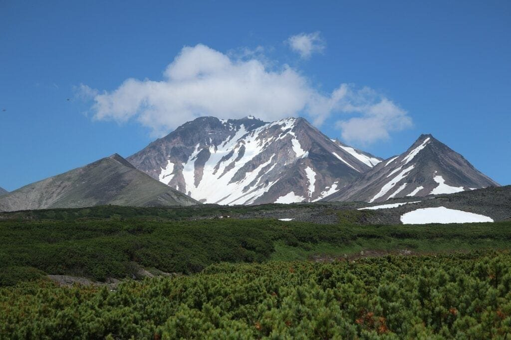

Living near active volcanoes can be an exhilarating experience, with the magnificent views and the unique environment that surrounds you. However, it is important to be aware of the risks that come with this prime real estate. From the constant possibility of volcanic eruptions to the release of toxic gases, there are several hazards that can pose a threat to those who call these areas home. In this article, we will delve into the top five risks of residing near volcanoes, providing you with valuable information to help you make an informed decision about where to live. So, grab a cup of coffee, sit back, and prepare to be educated on the potential dangers that come with living near these natural wonders.

This image is property of pixabay.com.

## Understanding Volcanoes

Volcanoes are fascinating geological features that have captivated human curiosity for centuries. In order to fully comprehend the risks associated with residing near active volcanoes, it is crucial to first understand the basics of volcanoes themselves.

### Definition and formation of volcanoes

Volcanoes are formed when molten rock, gases, and debris escape to the earth's surface, causing eruptions of lava and ash. This molten rock, known as magma, originates from the Earth's mantle. When there is enough pressure and the magma finds a pathway to the surface, it erupts through a vent, forming a volcano. The shape and structure of a volcano are determined by various factors such as the type of magma, the composition of the volcanic materials, and the eruption patterns.

### Types of volcanoes

Volcanoes come in different forms and sizes, each with its own unique characteristics. The three main [types of volcanoes are shield](https://magmamatters.com/understanding-volcanic-formation-a-comprehensive-guide/ "Understanding Volcanic Formation: A Comprehensive Guide") volcanoes, stratovolcanoes (also known as composite volcanoes), and cinder cone volcanoes. Shield volcanoes are broad and gently sloping, with lava flows that can travel long distances. Stratovolcanoes are tall and symmetrical, composed of alternating layers of lava, ash, and other volcanic materials. Cinder cone volcanoes, on the other hand, are small and steep, formed by explosive eruptions that eject volcanic ash and cinders into the air.

### Geographic distribution of volcanoes

Volcanoes are not evenly distributed across the globe and are often concentrated in specific regions. One prominent volcanic region is the "Ring of Fire," encircling the Pacific Ocean. This area is a result of the collision and subduction of tectonic plates, leading to volcanic activity. Other volcanic hotspots include Iceland, Italy's Mount Etna and Stromboli, and Hawaii's Mauna Loa and Kilauea.

### Causes of volcanic eruptions

Volcanic eruptions can be triggered by a variety of factors, including the movement of tectonic plates, the accumulation of magma beneath the Earth's surface, and the release of built-up gases. When two tectonic plates collide or diverge, it creates immense pressure, forcing magma to rise to the surface and causing volcanic activity. Additionally, the composition of the magma, including its viscosity and gas content, can influence the explosiveness of an eruption. Understanding these causes is essential in assessing the risks posed by volcanic eruptions.

## Exposure to Volcanic Gases

Living near an active volcano not only exposes you to the immediate dangers of lava flows and pyroclastic flows, but it also puts you at risk of exposure to volcanic gases. These gases can have detrimental effects on both human health and the environment.

### Types of volcanic gases

Volcanic gases are primarily composed of water vapor, carbon dioxide, sulfur dioxide, and various other gases. Water vapor is the most abundant gas released during volcanic eruptions, contributing to the formation of volcanic clouds. Carbon dioxide and carbon monoxide are also released in significant quantities and can pose serious threats to human health. Additionally, sulfur dioxide, hydrogen sulfide, and hydrogen chloride are commonly emitted gases that can have harmful effects on both respiratory systems and the environment.

### Harmful effects of sulfur dioxide

Sulfur dioxide is a corrosive gas that can cause respiratory problems, particularly for individuals with pre-existing respiratory conditions such as asthma. In high concentrations, sulfur dioxide can lead to irritation of the eyes, nose, and throat. Prolonged exposure to sulfur dioxide can result in chronic respiratory issues and even contribute to cardiovascular problems.

### Impact of carbon dioxide and carbon monoxide

Carbon dioxide and carbon monoxide are both odorless and colorless gases that can be lethal in high concentrations. Carbon dioxide is heavier than air, which means it can displace oxygen in low-lying areas, leading to suffocation. Carbon monoxide, on the other hand, interferes with the blood's ability to carry oxygen, leading to oxygen deprivation and potentially fatal consequences. Exposure to these gases can result in asphyxiation and have severe health implications.

### Risks of hydrogen sulfide and hydrogen chloride

Hydrogen sulfide is a toxic gas with a characteristic rotten egg smell. It can cause respiratory irritation, headaches, nausea, and even death in high concentrations. Likewise, hydrogen chloride is a corrosive gas that can lead to severe irritation of the respiratory system. Both gases can have a profound impact on human health and require careful monitoring and mitigation strategies.

  

## Risk of Pyroclastic Flows

Pyroclastic flows are one of the most serious hazards associated with volcanic eruptions. Understanding their nature, causes, and potential impact is crucial for assessing the risks faced by those living near active volcanoes.

### Understanding pyroclastic flows

Pyroclastic flows are fast-moving, high-temperature mixtures of volcanic materials that descend down the slopes of a volcano. These flows can reach speeds of over 100 kilometers per hour and temperatures exceeding 700 degrees Celsius. Comprised of ash, lava fragments, and hot gases, pyroclastic flows can travel for several kilometers, destroying everything in their path.

### Causes and speed of pyroclastic flows

Pyroclastic flows are primarily caused by explosive volcanic eruptions. When a volcano erupts violently, it can create a vertical column of volcanic material that rapidly collapses under its weight. This collapse results in a pyroclastic flow that cascades down the volcano's slopes, following the path of least resistance. The speed of these flows makes them extremely dangerous, leaving little time for evacuation or escape.

### Impact on humans and property

Pyroclastic flows pose a significant risk to human life and can cause extensive damage to property. The extreme heat and velocity of these flows can result in severe burns, as well as asphyxiation from the hot gases and lack of breathable air. In addition to the immediate danger, pyroclastic flows can bury entire communities under layers of ash and volcanic debris, making recovery and reconstruction challenging and time-consuming.

## Lava Flow Inundation

Lava flows are a characteristic feature of volcanic eruptions, and their impact on nearby communities cannot be overlooked. Understanding the behavior of lava flows and their interaction with the surrounding environment is crucial for assessing the [risks associated with residing near active volcanoes](https://magmamatters.com/geothermal-energy-and-its-volcanic-origins/ "Geothermal Energy and Its Volcanic Origins").

### Characteristics of lava flows

Lava flows consist of molten rock that slowly moves downslope, spreading out and engulfing everything in its path. The speed of lava flows can vary significantly, ranging from a few meters per hour to several kilometers per hour, depending on the viscosity of the lava and the steepness of the terrain. The temperature of lava can exceed 1,000 degrees Celsius, posing a significant threat to human life and infrastructure.

### Influence of topography

The topography of the surrounding terrain plays a crucial role in determining the behavior of lava flows. Steep slopes can accelerate the speed of lava flows, making them more difficult to predict and control. Conversely, flat or gently sloping terrain can slow down the advance of lava flows, giving communities more time to evacuate and mitigate the potential damage.

### Risks to homes and infrastructure

Lava flows can engulf and destroy homes, buildings, and infrastructure in their path. The intense heat of the lava can cause structures to collapse or ignite, leading to widespread destruction. Additionally, the sheer weight and volume of the flowing lava can result in the deformation of roads, bridges, and other crucial infrastructure, further impeding evacuation efforts and hindering recovery.

### Disruption to transportation

The movement of lava flows can disrupt transportation networks and isolate communities. As the lava engulfs roads, railways, and other transportation routes, it renders them impassable, cutting off access to essential services and supplies. The restoration of transportation infrastructure in the aftermath of a lava flow can be a lengthy and costly process, further exacerbating the challenges faced by affected communities.

This image is property of pixabay.com.

## Air Quality and Ashfall

Volcanic eruptions not only pose immediate dangers in the form of lava flows and pyroclastic flows, but they also have significant impacts on air quality. The release of gases and the deposition of volcanic ash can have far-reaching consequences for human health, infrastructure, and the environment.

### Effects on air quality

Volcanic eruptions release a plume of gases and particles into the atmosphere, which can have severe implications for air quality. The high concentration of gases such as [sulfur dioxide and carbon](https://magmamatters.com/the-art-and-science-of-volcano-monitoring/ "The Art and Science of Volcano Monitoring") dioxide can lead to the formation of volcanic smog, or vog, which can irritate the respiratory system and exacerbate existing respiratory conditions. Additionally, the release of fine ash particles into the air can pose a significant health risk through inhalation.

### Risks to respiratory health

Exposure to volcanic ash can lead to a range of respiratory issues, including shortness of breath, coughing, and wheezing. The fine particles in the ash can penetrate deep into the lungs, causing inflammation and damage to lung tissues. Individuals with pre-existing respiratory conditions, the elderly, and children are especially vulnerable to the adverse effects of volcanic ash on respiratory health.

### Hazards from ashfall

Ashfall resulting from volcanic eruptions can have a multitude of hazards. The weight of the ash can cause roofs to collapse, disrupt power lines, and damage crops and vegetation, impacting both human infrastructure and agricultural productivity. Additionally, the abrasive nature of ash can damage machinery and vehicles, further hindering recovery efforts and exacerbating the economic impact.

### Damage to homes, infrastructure, and vehicles

The deposition of volcanic ash on buildings, roads, and vehicles can cause significant damage. Ash can corrode metal structures, degrade the integrity of roofs, clog drainage systems, and infiltrate electrical equipment, resulting in both immediate and long-term consequences. The removal and cleanup of ash can be a complex and costly process, requiring specialized equipment and expertise.

## Volcanic Eruptions and Tsunami

The interaction between volcanic eruptions and oceanic environments can lead to the generation of tsunamis, posing additional risks to coastal communities near active volcanoes.

### How volcanic eruptions cause tsunami

Volcanic eruptions can generate tsunamis through various mechanisms. One common process is when a volcanic eruption occurs beneath the ocean's surface, leading to the rapid displacement of water and the formation of a tsunami wave. Another scenario is when an explosive eruption triggers a landslide into the ocean, displacing large volumes of water and generating a tsunami.

### Risks of tsunami in coastal areas near volcanoes

Communities residing in coastal areas near active volcanoes face the dual threat of volcanic eruptions and tsunamis. The combination of these hazards can have devastating consequences, leading to the loss of life, destruction of infrastructure, and long-term displacement. Early warning systems and efficient evacuation plans are crucial for mitigating the risks associated with combined volcanic and tsunami hazards.

This image is property of pixabay.com.

## Effects on Agriculture and Wildlife

The impacts of volcanic eruptions extend far beyond human settlements and can have profound effects on agriculture and local wildlife. These effects can disrupt ecosystems, agricultural practices, and the overall biodiversity of an area.

### Impacts on farming and livestock

Volcanic eruptions can cause extensive damage to farmland and disrupt agricultural practices. The deposition of ash and the release of toxic gases can harm crops, rendering them unsuitable for consumption. Additionally, the destruction of irrigation systems, soil fertility loss, and the displacement of livestock can have significant economic consequences for farmers and agricultural communities.

### Effects on local wildlife

Volcanic eruptions can result in the loss of habitats and food sources for local wildlife. The deposition of ash and other volcanic materials can suffocate plants, disrupt ecosystems, and force wildlife to seek alternative habitats. The loss of biodiversity and the potential for long-term population decline in affected areas are significant concerns.

### Long-term environmental impact

The environmental impact of volcanic eruptions can persist long after the initial event has occurred. The release of gases and the deposition of ash can contribute to soil degradation and erosion, altering the ecological balance of an area. Restoration efforts and environmental monitoring are necessary to mitigate the long-term effects on ecosystems and ensure the recovery and sustainability of the affected areas.

## Psychological Impacts of Living Near Active Volcanoes

Residing near active volcanoes can take a toll on the psychological well-being of individuals and communities. The constant threat of eruptions, regular evacuations, and the uncertainty surrounding volcanic activity can lead to stress, anxiety, and other psychological issues.

### Stress and anxiety associated with potential eruptions

Living in constant proximity to an active volcano can be a source of ongoing stress and anxiety. The looming threat of an eruption, coupled with the uncertainty of when it might occur, can create a persistent state of unease and fear. Individuals may experience heightened levels of stress, sleeping difficulties, and a constant sense of vigilance.

### Impact on mental health of regular evacuations

Communities near active volcanoes may face the need for regular evacuations, sometimes without knowing when they can return to their homes. These repeated displacements can have a profound impact on mental health, causing feelings of displacement, loss of security, and a sense of being uprooted from familiar surroundings. The disruption and uncertainty can lead to increased rates of depression, anxiety, and post-traumatic stress disorder (PTSD) among affected individuals.

### Effects on community cohesion

The collective stress and trauma experienced by communities can strain social networks and community cohesion. The shared experience of living near an active volcano can either unite communities, as they come together to support one another, or it can create divisions due to differing opinions on how to navigate the risks and challenges posed by volcanic activity. Maintaining open lines of communication, providing psychological support, and fostering a sense of community resilience are crucial in addressing and mitigating these psychological impacts.

## Volcanic Eruption Preparedness

Living near an active volcano requires careful planning and preparedness to ensure the safety and well-being of individuals and communities. Establishing robust evacuation plans, implementing effective communication systems, and equipping individuals with necessary survival tools are key elements of volcanic eruption preparedness.

### Importance of evacuation plans

Evacuation plans are vital in ensuring the safe and orderly evacuation of individuals in the event of a volcanic eruption. These plans should include designated evacuation routes, assembly points, and emergency shelters. Regular drills and exercises should be conducted to familiarize residents with the evacuation procedures and to test the effectiveness of the plans.

### Communication and alert systems for eruptions

Timely and accurate information during volcanic eruptions can save lives and minimize the impact on communities. Establishing comprehensive communication and alert systems is crucial for informing residents about volcanic activity, evacuation orders, and other relevant information. These systems can include sirens, text alerts, social media updates, and dedicated emergency hotlines.

### Survival equipment and supplies

Having the necessary survival equipment and supplies can make a significant difference during volcanic eruptions and subsequent evacuations. Individuals should have emergency kits ready, including essentials such as food, water, first aid supplies, flashlights, batteries, and personal protective equipment. Additionally, having a plan in place for the care and evacuation of vulnerable populations, such as the elderly, children, and individuals with disabilities, is essential.

## Risk Mitigation Strategies

While it is impossible to completely eliminate the risks associated with residing near active volcanoes, various strategies can be employed to mitigate these risks. These strategies encompass advancements in volcanic prediction technology, government regulations, and community awareness and education programs.

### Advancements in volcanic prediction technology

The development of advanced monitoring systems and prediction models has significantly improved our ability to forecast volcanic eruptions. Seismic monitoring, gas measurements, thermal imaging, and satellite observation can provide valuable insights into volcanic activity and lead to early warnings. Continual investment in research and technological advancements in this field is crucial for enhancing our understanding of volcanoes and improving the accuracy of eruption predictions.

### Government regulations for construction near active volcanoes

Governments play a vital role in ensuring the safety of individuals residing near active volcanoes through the implementation and enforcement of regulations. These regulations may include zoning laws that restrict construction in high-risk areas, building codes to withstand volcanic hazards, and land-use planning that takes into account the potential risks associated with volcanic eruptions. Additionally, governments should support the development of emergency response agencies and provide funding for volcano monitoring and research.

### Community awareness and education programs

Raising awareness and educating communities about the risks and hazards of living near active volcanoes is essential for fostering resilience and preparedness. Community outreach programs, public awareness campaigns, and educational initiatives can provide individuals with the knowledge and skills necessary to respond effectively during eruptions. Early education in schools, targeted workshops, and the dissemination of relevant information through various media channels can significantly contribute to the safety and well-being of those living near active volcanoes.

In conclusion, residing near active volcanoes presents a unique set of risks and challenges. Understanding the formation, behaviors, and impacts of volcanoes is crucial for assessing and mitigating these risks. From exposure to [volcanic gases and the threat of pyroclastic flows](https://magmamatters.com/the-environmental-impact-of-volcanic-eruptions-2/ "The Environmental Impact of Volcanic Eruptions") to the risks posed by lava flow inundation, ashfall, and tsunamis, individuals and communities must be prepared and equipped to navigate the potential hazards. Through a combination of advanced prediction technology, government regulations, and community education, we can strive to minimize the dangers associated with living near active volcanoes and foster resilient communities that can better withstand the impact of volcanic eruptions.

Related Posts: [Mitigating Risks: Forecasting Volcanic Activity in Prone Areas](https://magmamatters.com/mitigating-risks-forecasting-volcanic-activity-in-prone-areas/), [The Formation and Eruption Patterns of Volcanoes](https://magmamatters.com/the-formation-and-eruption-patterns-of-volcanoes-4/), [The Pyroclastic Phenomena of Pompeii: 7 Insights to Explore](https://magmamatters.com/the-pyroclastic-phenomena-of-pompeii-7-insights-to-explore/), [Tips for Capturing Volcano Pyroclastic Flow Photos](https://magmamatters.com/tips-for-capturing-volcano-pyroclastic-flow-photos/), [Understanding Volcanoes and Their Eruption Patterns](https://magmamatters.com/understanding-volcanoes-and-their-eruption-patterns/)

Related Posts: [Mitigating Risks: Forecasting Volcanic Activity in Prone Areas](https://magmamatters.com/mitigating-risks-forecasting-volcanic-activity-in-prone-areas/), [The Formation and Eruption Patterns of Volcanoes](https://magmamatters.com/the-formation-and-eruption-patterns-of-volcanoes-4/), [The Pyroclastic Phenomena of Pompeii: 7 Insights to Explore](https://magmamatters.com/the-pyroclastic-phenomena-of-pompeii-7-insights-to-explore/), [Tips for Capturing Volcano Pyroclastic Flow Photos](https://magmamatters.com/tips-for-capturing-volcano-pyroclastic-flow-photos/), [Understanding Volcanoes and Their Eruption Patterns](https://magmamatters.com/understanding-volcanoes-and-their-eruption-patterns/)
