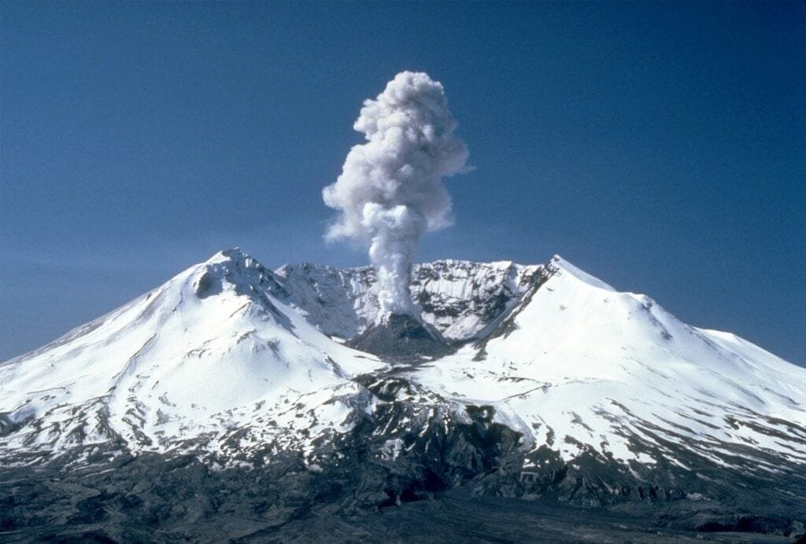

Volcanic eruptions can have catastrophic effects on surrounding communities, making it crucial to develop effective prediction methods. This is where technology plays a significant role. By utilizing advanced tools and techniques, scientists can collect and analyze data that provide valuable insights into the behavior of volcanoes. From monitoring ground deformation to detecting gas emissions, these technological advancements enable experts to detect subtle changes in volcanic activity, allowing them to make accurate predictions and take necessary precautions. In this article, we will explore the role of technology in predicting volcanic eruptions and how it contributes to the safety and well-being of communities living in volcanic regions.

This image is property of pixabay.com.

## Why Does Technology Aid in Predicting Volcanic Eruptions?

Volcanic eruptions are [natural phenomena](https://magmamatters.com/understanding-volcanic-formation-a-comprehensive-guide/ "Understanding Volcanic Formation: A Comprehensive Guide") that can have severe impacts on both human populations and the environment. Being able to predict when an eruption might occur is of crucial importance in order to minimize the potential risks and plan appropriate responses. Over the years, technological advancements have significantly improved our ability to predict volcanic eruptions, providing us with valuable tools and resources to monitor and understand these complex geological events.

### Reasons behind reliance on tech for prediction

The reliance on [technology for predicting volcanic eruptions](https://magmamatters.com/the-art-and-science-of-volcano-monitoring/ "The Art and Science of Volcano Monitoring") stems from the inherent challenges associated with these natural occurrences. Volcanic eruptions are complex and dynamic events that are influenced by numerous factors, including the geological characteristics of the volcano, the composition of magma, and the pressure build-up within the volcano. Due to the intricate nature of volcanic activities, traditional methods of prediction, such as visual observations and historical records, have proven to be insufficient in providing accurate and timely information.

### Understanding the complexity of volcanic activities

Volcanic activities are incredibly complex processes that involve the interaction of various physical and chemical phenomena. To accurately predict volcanic eruptions, it is essential to have a comprehensive understanding of the underlying mechanisms driving these events. This understanding is rooted in geological studies that explore the deep-earth processes and dynamics that lead to the formation and eruption of volcanoes.

### The need for precise and timely prediction

The need for precise and timely prediction of volcanic eruptions cannot be overstated. Early detection of volcanic unrest allows for the appropriate deployment of resources, implementation of evacuation plans, and preparation of emergency response measures. By harnessing technology, scientists and researchers have been able to improve prediction models and provide crucial information to communities, enabling them to take necessary precautions and mitigate the potential risks associated with volcanic eruptions.

## Geological Understanding as the Basis

### Importance of deep-earth knowledge for prediction

Geological knowledge is fundamental to predicting volcanic eruptions. It involves studying the processes occurring deep within the Earth's interior, such as plate tectonics, magma generation, and ascent. These geological processes provide valuable insights into the behavior and characteristics of volcanic systems, allowing scientists to make informed predictions about when and how an eruption might occur.

### Evolution of geological studies

Over the years, geological studies have evolved significantly, thanks to technological advancements and improved scientific methodologies. Understanding the structure and behavior of volcanic systems requires the collection and analysis of various data, including seismic activity, gas emissions, and ground deformation. Technological tools have revolutionized data collection and analysis, enabling scientists to gather valuable information from remote and inaccessible volcanic regions.

### Impact of geological studies on technology development for prediction

The advancements in geological studies have played a pivotal [role in the development of technology](https://magmamatters.com/geothermal-energy-and-its-volcanic-origins/ "Geothermal Energy and Its Volcanic Origins") for predicting volcanic eruptions. By understanding the geological processes that underpin volcanic activities, scientists have been able to design and deploy a wide range of monitoring systems and instruments. These tools allow for real-time data collection and analysis, providing scientists with valuable insights into the internal workings of a volcano and facilitating more accurate eruption predictions.

This image is property of pixabay.com.

## Remote Sensing Technologies

### Use of satellite imagery in monitoring volcanoes

Satellite imagery has revolutionized the field of volcano monitoring. Satellites equipped with specialized sensors capture high-resolution images of volcanic regions, allowing scientists to monitor surface features and changes over time. By comparing infrared and visible images, scientists can identify changes in temperature, gas emissions, and volcanic plumes, providing valuable information about the current state of a volcano.

### Infrared Technology: Heat detection from erupting volcanoes

Infrared technology has proven to be an invaluable tool in monitoring erupting volcanoes. By measuring the thermal radiation emitted by volcanic vents and lava flows, scientists can estimate the heat flux and track the movement of magma within the volcano. This information is vital in predicting the intensity and direction of volcanic activity and can help anticipate potential hazards such as pyroclastic flows and lahars.

### Radar Interferometry: mapping physical changes

Radar interferometry, also known as InSAR, is a remote sensing technique used to measure ground deformation caused by volcanic activity. By measuring the changes in the distance between the satellite and the volcano's surface, scientists can create accurate maps of ground displacement. This information is crucial in understanding the movement of magma and can provide early warning signs of an impending eruption.

## Monitoring Systems in Volcanology

### Seismic monitoring: Detecting earthquakes within the volcano

Seismic monitoring is one of the most commonly used methods for predicting volcanic eruptions. By deploying networks of seismometers around a volcano, scientists can detect and analyze the seismic activity associated with magma movement and the fracturing of rocks within the volcano. Changes in seismic activity patterns can provide valuable insights into the likelihood and timing of an eruption.

### Geochemical monitoring: Checking changes in gas compositions

Monitoring changes in the composition of [volcanic gases is another important aspect of volcano](https://magmamatters.com/the-environmental-impact-of-volcanic-eruptions-2/ "The Environmental Impact of Volcanic Eruptions") prediction. Volcanoes release a variety of gases, including sulfur dioxide, carbon dioxide, and water vapor, before and during eruptions. By continuously monitoring the gas composition, scientists can identify significant changes that may indicate an increase in volcanic activity and the imminent eruption of a volcano.

### Geodesy: Changes in ground shape monitored by GPS

Geodesy, the science of measuring Earth's shape, has proven to be an effective method of monitoring ground deformation caused by volcanic activity. Global Positioning System (GPS) receivers placed around a volcano measure and track changes in ground shape, such as uplift or subsidence. These measurements are crucial in understanding the movement of magma within the volcano and are used to refine eruption prediction models.

This image is property of pixabay.com.

## The Role of Artificial Intelligence

### Use of AI in predicting volcanic eruptions

Artificial Intelligence (AI) has emerged as a powerful tool in predicting volcanic eruptions. By analyzing large volumes of data collected from monitoring systems, AI algorithms can identify patterns and correlations that may be indicative of an impending eruption. Machine learning techniques allow AI systems to continuously improve their predictive capabilities, making them valuable assets in volcano monitoring and prediction efforts.

### Machine learning in understanding patterns of volcanic activities

Machine learning algorithms are capable of recognizing patterns and anomalies in datasets that may not be immediately apparent to human observers. By training AI systems on historical eruption data and real-time monitoring data, machine learning models can identify patterns and relationships that can help understand the underlying mechanisms of volcanic activities. This knowledge can then be used to refine eruption prediction models and improve forecasting accuracy.

### Development of AI-based software for prediction

The development of AI-based software has further enhanced our ability to predict volcanic eruptions. These software systems combine real-time data from various monitoring systems with AI algorithms to generate eruption forecasts and risk assessments. By integrating multiple sources of information, AI-based software offers more comprehensive and accurate predictions, enabling communities to take appropriate measures to ensure public safety.

## Computer Modelling in Volcano Prediction

### Importance of computer simulations in understanding volcanoes

Computer simulations play a crucial role in understanding the complex processes occurring inside volcanoes. By creating virtual models that simulate the behavior of magma, gases, and the surrounding rocks, scientists can analyze the impact of various factors on the eruption process. These simulations provide valuable insights into the dynamics and behavior of volcanoes, helping improve eruption prediction models and hazard assessment.

### Detailed analysis of volcanic materials through computer modeling

Computer modeling allows scientists to perform detailed analysis of volcanic materials, such as ash particles and pyroclastic flows. By simulating the behavior of these materials under different conditions, researchers can better understand their dispersion patterns, transport mechanisms, and potential hazards. This information is vital in developing accurate hazard maps and evacuation plans, ensuring the safety of communities at risk.

### Limitations of current computer modeling techniques

While computer modeling has significantly advanced our understanding of volcanic processes, there are still limitations to its predictive capabilities. Modeling volcanic eruptions involves simulating complex and dynamic systems, which require high computational power and accurate input parameters. Additionally, uncertainties associated with input data and model assumptions can affect the accuracy of predictions. Despite these challenges, ongoing advancements in computer modeling techniques hold promise for improving eruption forecasting accuracy.

## Challenges Faced in Technological Prediction

### Explanation of why eruption prediction is complicated

Predicting volcanic eruptions is a complex task due to the intricate nature of volcanic processes and the multitude of factors influencing eruptions. The behavior of volcanoes can vary greatly from one event to another, making it challenging to establish consistent patterns and reliable prediction models. Additionally, volcanoes can exhibit periods of heightened activity followed by long periods of dormancy, further complicating the prediction process.

### Common issues faced by scientists in predicting eruptions

One of the significant challenges faced by scientists in predicting volcanic eruptions is the limited available data. Volcanoes are often located in remote or inaccessible regions, making it difficult to gather real-time data. Additionally, volcanic activities can change rapidly, requiring continuous monitoring and data collection. The high costs associated with monitoring systems and the difficulties in coordinating international efforts pose additional challenges to eruption prediction.

### Ways technology could overcome these challenges

Technology has the potential to overcome many of the challenges faced in predicting volcanic eruptions. Advances in remote sensing technologies, such as satellite imagery and radar interferometry, allow scientists to monitor volcanoes from afar, providing valuable data for prediction models. Improved data sharing initiatives and collaboration among countries can help address the issue of limited data, enabling scientists to pool resources and expertise to enhance eruption prediction capabilities.

## Future of Technology in Volcanic Prediction

### Emerging technologies applicable in volcanic prediction

The future of technology in volcanic prediction holds great promise, with emerging technologies continuously being developed to improve our capabilities in this field. For example, drone technology is being increasingly utilized to conduct aerial surveys and collect high-resolution data in real-time. LiDAR (Light Detection and Ranging) technology is also gaining popularity, offering detailed 3D mapping of volcanic landscapes and facilitating more accurate hazard assessments.

### Potential impact of these advancements on volcanic prediction

The advancements in technology have the potential to significantly enhance our ability to predict volcanic eruptions. The availability of high-resolution data, collected through remote sensing technologies and monitoring systems, allows for more accurate and timely eruption forecasts. Improved computer modeling techniques, combined with AI algorithms, can further refine prediction models, providing valuable insights into the behavior and potential hazards associated with volcanoes.

### Challenges in adopting emerging technologies

Despite the potential benefits, there are challenges in adopting emerging technologies for volcanic prediction. Implementing new technologies often requires substantial financial investments, infrastructure development, and training programs for scientists and technicians. Ensuring global accessibility and affordability of these technologies is crucial to facilitate widespread adoption and maximize their impact on eruption prediction efforts.

## Importance of Collaboration and Data Sharing

### Significance of global cooperation in volcanology

Volcanic eruptions are global phenomena that can have far-reaching effects beyond national boundaries. It is therefore imperative for countries and scientific institutions to collaborate and share data to improve our understanding and prediction of volcanic activities. International cooperation fosters knowledge exchange, enables access to diverse datasets, and promotes the development of standardized methodologies, resulting in more robust and accurate eruption prediction models.

### Role of data sharing in improving prediction models

Data sharing plays a vital role in improving eruption prediction models. By pooling together data from multiple sources, such as seismic networks, gas analysis stations, and satellite imagery, scientists can develop more comprehensive and accurate models. Sharing data allows for a larger sample size, enabling the identification of patterns and trends that may be missed when working with limited datasets. It also promotes transparency and accountability, ensuring the reproducibility and validation of scientific findings.

### Implications of technological advancements on data sharing

Technological advancements have revolutionized the way data can be collected, stored, and shared. Real-time monitoring systems and remote sensing technologies provide a wealth of data that can be shared instantly across different platforms and institutions. This enhanced data accessibility and sharing potential have transformative implications for volcano research and prediction, enabling global collaboration and fostering a more integrated and coordinated approach to volcano monitoring.

## The Impact of Technological Prediction on Communities

### How prediction aids mitigation strategies for communities

The ability to predict volcanic eruptions has a direct impact on the implementation of effective mitigation strategies for communities at risk. Early warning systems, based on accurate prediction models, enable authorities to issue timely alerts and evacuation orders, allowing residents to move to safer locations. This proactive approach can save lives, minimize property damage, and facilitate the allocation of resources for disaster response and recovery.

### Interlink between technology, prediction, and emergency planning

Technology, prediction, and emergency planning are interconnected elements in mitigating the impacts of volcanic eruptions. Technological advancements provide the tools and resources necessary for accurate eruption prediction. The predictions, in turn, inform emergency planners and authorities to develop response strategies tailored to the specific risks and hazards associated with an active volcano. This collaborative approach ensures that communities are well-prepared and equipped to respond effectively to volcanic emergencies.

### Case studies of effective technological prediction of eruptions

Several case studies demonstrate the effectiveness of technological prediction in mitigating the impacts of volcanic eruptions. For example, the eruption of Mount Pinatubo in 1991 in the Philippines was accurately predicted, allowing for the evacuation of over 50,000 people and saving countless lives. Similarly, the eruption of Eyjafjallajökull in Iceland in 2010 resulted in minimal casualties and disruption due to timely evacuation and air traffic management based on accurate eruption forecasts.

In conclusion, technology plays a vital role in predicting volcanic eruptions, enabling scientists to monitor and understand the complex processes occurring within volcanoes. Remote sensing technologies, monitoring systems, artificial intelligence, and computer simulations have all contributed to improving eruption prediction models. The future of technology in volcanic prediction looks promising, with emerging technologies offering enhanced data collection and analysis capabilities. Collaboration and data sharing among scientists and institutions are crucial for advancing eruption prediction and minimizing the risks posed by volcanic activities. Ultimately, the impact of technological prediction on communities is significant, facilitating the development of effective mitigation strategies and saving lives in the face of volcanic emergencies.

