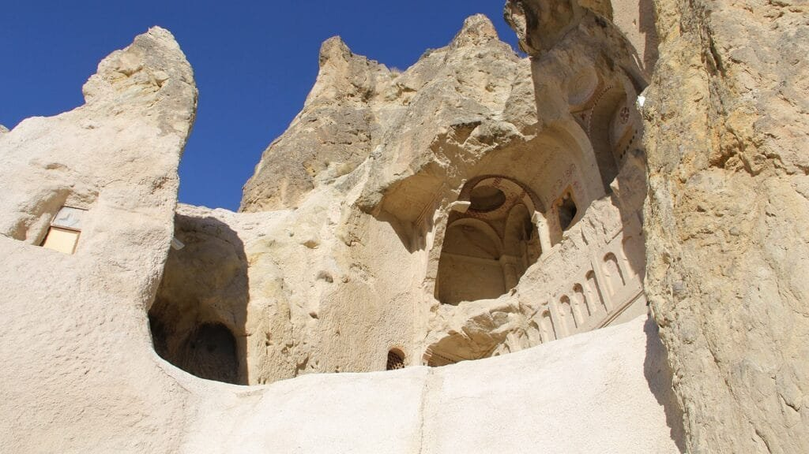
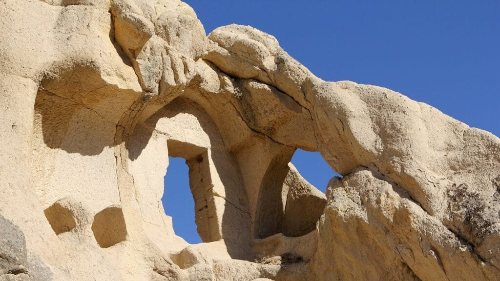
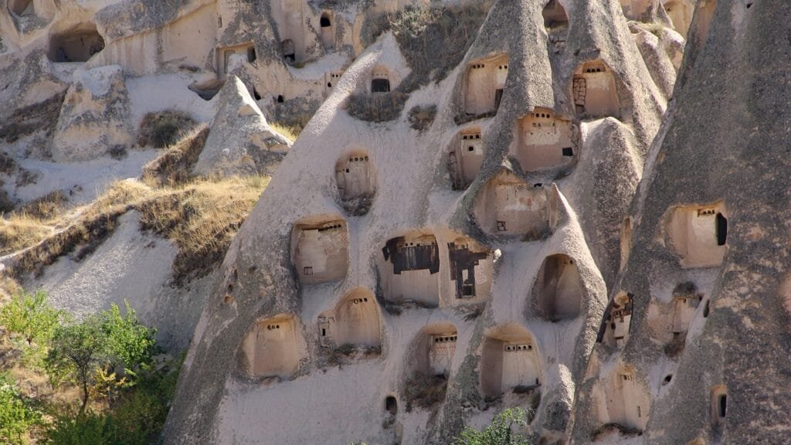

Discover the fascinating role volcanic activities play in shaping our geological history. Volcanoes, formed by the escape of molten rock, gases, and debris, create spectacular eruptions of lava and ash. These awe-inspiring natural wonders are situated along plate boundaries, hotspots, or rift zones where tectonic plates are in motion. Some volcanoes, such as those found in the "Ring of Fire," are prone to frequent eruptions due to their location atop plate boundaries. On the other hand, shield volcanoes in Hawaii form gradually over hotspots beneath the Earth's surface and erupt less explosively. By examining different eruption patterns, lava viscosity, gas content, and the effects of volcanic activity on soil fertility, we can not only understand the hazards associated with volcanic eruptions but also predict and mitigate future risks to surrounding communities. Let's delve into the captivating world of volcanoes and explore how they have shaped our planet's geological history.

This image is property of pixabay.com.

## Understanding Volcanic Activities

Volcanic activities are a fascinating natural phenomenon that have played a significant role in shaping the geological history of our planet. In order to fully comprehend the impact of volcanic activities, it is important to explore the definition and types of volcanoes, as well as the eruption process and influencing factors. Additionally, understanding the distribution of volcanoes globally provides valuable insights into their prevalence and significance.

### Definition and types of volcanoes

A volcano is formed when molten rock, gases, and debris, known as magma, escape to the earth's surface through a vent or opening. The eruption of lava and ash from these vents characterizes volcanic activities. There are various types of volcanoes, each possessing distinct characteristics.

One common type is the stratovolcano, which is known for its steep slopes and cone-shaped appearance. These volcanoes are formed through repeated eruptions of viscous lava and alternating layers of ash and rock.

Shield volcanoes, on the other hand, have a more gentle sloping profile and are characterized by their broad, shield-like shape. These volcanoes form gradually over hot spots deep underground and typically have less explosive eruptions that result in the release of fluid lava.

Another type of volcano is the volcanic dome, which is formed when highly viscous lava accumulates near the vent, forming a steep-sided mound. Volcanic domes often pose significant hazards due to their tendency to collapse and generate pyroclastic flows.

### Eruption process and influencing factors

The eruption process of a volcano involves a series of events that occur before, during, and after an eruption. It begins with the accumulation of magma beneath the Earth's surface, which leads to increased pressure within the volcano. Over time, this pressure can cause the volcano to erupt, releasing lava, gases, and ash into the surrounding environment.

Several factors influence the eruption process of a volcano. The composition and viscosity of the magma play a crucial role in determining the explosiveness of an eruption. Magma with higher silica content tends to be more viscous and can result in explosive eruptions, while magma with lower silica content and a higher temperature tends to flow more easily.

The presence of gases, such as water vapor, carbon dioxide, and sulfur compounds, within the magma also plays a significant role in volcanic eruptions. As the magma rises to the surface, the decreasing pressure allows the gases to escape, leading to the explosive release of volcanic material.

Other factors that influence volcanic eruptions include the tectonic setting of the volcano, the availability of magma, and the presence of structural weaknesses in the volcano's cone or vent.

### Distribution of volcanoes globally

Volcanoes are not evenly distributed across the globe but are instead concentrated in specific regions. The distribution of volcanoes is closely linked to tectonic plate boundaries and hotspots, which are areas of intense volcanic activity.

Along plate boundaries, such as the "Ring of Fire" encircling the Pacific Ocean, volcanoes are formed due to the interaction of tectonic plates. When two plates converge, one plate is typically forced beneath the other, leading to the formation of volcanic arcs and chains. The Pacific Ring of Fire is notorious for its high concentration of volcanoes, which are a result of the subduction of the Pacific Plate beneath other surrounding plates.

Hotspots, on the other hand, are areas beneath the Earth's crust where mantle plumes transport heat towards the surface. These hotspots can lead to the formation of long-lived volcanic systems, such as the Hawaiian Islands. The motion of tectonic plates over these hotspots creates a chain of volcanic islands and seamounts.

Understanding the global distribution of volcanoes provides valuable insights into the geological processes occurring beneath the Earth's surface and aids in predicting future volcanic activities in specific regions.

## Mechanisms of Volcanic Activities

Volcanic activities are driven by various mechanisms, including plate tectonics and hotspots, as well as the formation of magma and eruption patterns. Exploring these mechanisms provides a deeper understanding of the processes involved in volcanic activities.

### Plate tectonics and hotspots

The movement of tectonic plates is a primary driver of volcanic activities. Volcanoes most commonly occur at plate boundaries, where the interaction between plates leads to the release of magma. Convergent boundaries, where two plates collide, often result in the formation of volcanoes through subduction or the melting of the Earth's crust.

Hotspots, on the other hand, are areas where mantle plumes rise towards the Earth's surface. These plumes are thought to originate deep within the Earth's mantle and generate a zone of intense heat. As tectonic plates move over these hotspots, magma can be generated, leading to the formation of volcanic islands and chains.

The relationship between plate tectonics and hotspots is complex, and their interplay contributes significantly to the diversity and distribution of volcanoes across the globe.

### Formation of magma

Magma is a molten mixture of rock, gases, and other substances that is responsible for volcanic activities. It is formed through a process known as melting, which occurs under specific conditions within the Earth's mantle and crust.

There are three primary mechanisms through which magma can be generated: decompression melting, flux melting, and heat transfer melting.

Decompression melting commonly occurs at divergent plate boundaries, where the upward movement of mantle material causes a decrease in pressure. As the pressure decreases, the mantle rocks begin to melt, forming magma. This type of melting is responsible for the creation of mid-ocean ridges and the associated volcanic activities.

Flux melting occurs at subduction zones, where an oceanic plate is forced beneath a continental plate. The water-rich sediments and rocks on the subducting plate act as a flux, lowering the melting temperature of the mantle rocks and causing them to melt. This process contributes to the formation of explosive volcanoes located along subduction zones.

Heat transfer melting involves the transfer of heat from a hotter source to a cooler region of the mantle or crust. This mechanism occurs at hotspot locations and is responsible for the formation of volcanic chains and islands, such as the Hawaiian Islands.

Understanding the processes involved in the formation of magma provides valuable insights into the conditions necessary for volcanic activities to occur.

### Eruption patterns

Volcanic eruptions can exhibit a wide range of patterns, varying in intensity, duration, and the type of volcanic material released. These eruption patterns are influenced by several factors, including the composition of the magma, gas content, and the geometry of the volcanic conduit.

Explosive eruptions occur when highly viscous magma, rich in gas, is released from the volcano. The pressure build-up within the magma chamber results in a violent eruption, characterized by the ejection of pyroclastic material, ash clouds, and gas emissions. These explosive eruptions can have devastating effects, posing significant risks to human life and infrastructure.

Effusive eruptions, on the other hand, involve the relatively gentle flow of less viscous magma onto the earth's surface. These eruptions often result in the formation of lava flows, which can slowly spread outwards, shaping the surrounding landscape over time. Effusive eruptions are typically less hazardous compared to explosive eruptions, allowing for the relatively safe observation and study of volcanic activities.

The eruption patterns of a [volcano can greatly impact the surrounding environment](https://magmamatters.com/the-environmental-impact-of-volcanic-eruptions-2/ "The Environmental Impact of Volcanic Eruptions") and influence the long-term geological history of a region. Monitoring and understanding these patterns are essential for predicting future eruptions and mitigating the associated risks.

<iframe width="560" height="315" src="https://www.youtube.com/embed/Fq8NtkPOzfA" frameborder="0" allow="accelerometer; autoplay; encrypted-media; gyroscope; picture-in-picture" allowfullscreen></iframe>

  

## Mountain Formation through Volcanic Activities

Volcanic activities play a vital role in the formation of mountains, as different types of volcanoes contribute to the creation of distinct landforms. Understanding the processes involved in mountain formation through volcanic activities provides valuable insights into the geological history of our planet.

### Strato-volcanoes and their build-up

Strato-volcanoes, also known as composite volcanoes, are formed through repeated eruptions of viscous lava and alternating layers of ash and rock. These eruptions result in the gradual build-up of the volcano, with layer upon layer of volcanic material being deposited over time.

The process of strato-volcano formation begins with explosive eruptions, where ash, rock fragments, and pyroclastic materials are ejected from the volcano. These materials accumulate around the vent, forming layers that gradually build the steep slopes of the volcano.

As the volcano continues to erupt, the lava emitted during effusive eruptions flows down the slopes, further contributing to the growth of the volcano. Over time, the alternating layers of lava and pyroclastic material create the distinctive cone-shaped appearance characteristic of strato-volcanoes.

Strato-volcanoes can reach significant heights and are often associated with prominent mountains, such as Mount St. Helens in the United States and Mount Fuji in Japan. The build-up of these volcanoes contributes to the formation of impressive mountain ranges, shaping the landscape over millions of years.

### Shield volcanoes and landmass creation

Shield volcanoes, in contrast to strato-volcanoes, are formed through the accumulation of fluid lava, resulting in broad, shield-like structures. These volcanoes are typically characterized by gentle slopes and vast areas of volcanic rock.

The formation of shield volcanoes begins with effusive eruptions of low-viscosity lava, which flows easily and quickly over the surrounding landscape. The lava spreads out in all directions, creating a wide, shield-shaped structure.

Over time, the repeated eruptions of lava gradually build up the shield volcano, expanding its size and contributing to the creation of new landmasses. Shield volcanoes are often associated with significant volcanic hot spots, such as those in Hawaii and the Galapagos Islands.

The formation of shield volcanoes and the resulting landmass creation have an enduring impact on the geography of a region. These volcanoes are responsible for the development of unique ecosystems and provide valuable insights into the processes at work beneath the Earth's surface.

### Volcanic domes and scarps

Volcanic domes are formed when highly viscous lava accumulates near the vent of a volcano, resulting in the creation of a steep-sided mound. These formations often exhibit a dome-shaped appearance and can vary in size, ranging from a few meters to several kilometers in diameter.

The process of volcanic dome formation begins with the eruption of viscous lava that does not flow as easily as other types of lava. As the lava accumulates near the vent, it forms a steep-sided mound due to its high viscosity.

Volcanic domes are typically associated with explosive eruptions that release gas-rich magma. The high gas content causes the magma to be highly explosive, resulting in the ejection of pyroclastic materials and the formation of a volcanic dome.

Volcanic scarps, on the other hand, are formed when the walls of a volcano collapse, exposing the underlying layers of volcanic material. These scarps can range in size from small gullies to large, dramatic cliffs, revealing the internal structure of the volcano.

The formation of volcanic domes and scarps provides valuable insights into the complex processes occurring within a volcano. These landforms are essential in understanding the geological history of a region and the impact of volcanic activities on the surrounding landscape.

## Volcanic Activities and Seafloor Spreading

Volcanic activities play a crucial role in seafloor spreading, a process that contributes to the creation and growth of the Earth's oceanic crust. Understanding the relationship between volcanoes and seafloor spreading provides valuable insights into the dynamic nature of our planet's geology.

### Sea-floor spreading explained

Sea-floor spreading is a process that occurs at mid-ocean ridges, where the Earth's tectonic plates are moving apart. It involves the creation of new crustal material and the expansion of the ocean floor. As tectonic plates diverge, magma rises from the mantle and fills the gap between the separating plates.

The upwelling of magma creates a volcanic ridge along the divergent plate boundary. The magma solidifies and forms new oceanic crust, pushing the existing crust away from the ridge. This continuous process of magma upwelling and solidification leads to the spreading of the sea floor and the creation of new oceanic crust.

Sea-floor spreading plays a significant role in the geological history of our planet and has contributed to the formation of vast ocean basins. By understanding the processes involved in sea-floor spreading, scientists gain insights into the dynamics of plate tectonics and the evolution of the Earth's crust.

### Role of volcanoes in seafloor spreading

Volcanoes are closely associated with seafloor spreading and are instrumental in the creation of new oceanic crust. As magma rises to the surface at mid-ocean ridges, it solidifies and forms new crustal material. This process occurs through a series of volcanic eruptions that contribute to the expansion of the sea floor.

The magma that erupts at mid-ocean ridges is often basaltic in composition, which leads to the formation of submarine volcanoes. These volcanoes are known as seamounts and play a crucial role in the growth of the oceanic crust.

Seamounts can emerge as individual volcanic features or form chains that follow the direction of the spreading ridge. As the seafloor spreads, new seamounts are created, and older ones become more distant from the spreading ridge. These volcanic activities contribute to the continuous expansion of the ocean floor.

The role of volcanoes in seafloor spreading demonstrates the dynamic nature of the Earth's crust and provides valuable insights into the processes that shape the oceanic landscape.

### Impact on continental drift

Seafloor spreading and the associated volcanic activities have significant implications for the larger process of continental drift. As tectonic plates diverge at mid-ocean ridges, new oceanic crust is created and spreads away from the ridge.

The newly formed oceanic crust pushes against older crust and can ultimately interact with continental plates. This interaction between oceanic and continental plates can lead to various geological phenomena, such as subduction zones, where one plate is forced beneath another.

Volcanic activities that occur along subduction zones contribute to the creation of volcanic arcs and chains, such as those found in the Pacific Ring of Fire. These volcanic features are often associated with the convergence of oceanic and continental plates, highlighting the interplay between seafloor spreading, subduction, and continental drift.

Understanding the impact of volcanic activities on continental drift helps in deciphering the complex geological history of continents and their interactions with the surrounding oceanic crust.

This image is property of pixabay.com.

## Creation of Volcanic Islands and Archipelagos

Volcanic activities have played a significant role in the creation of volcanic islands and archipelagos across the globe. The formation and evolution of these unique landforms provide valuable insights into the dynamic processes occurring beneath the Earth's surface.

### Origin of volcanic islands

Volcanic islands are formed through the eruption of lava and the subsequent accumulation of volcanic materials. The process begins with the upwelling of magma from the mantle, which rises to the surface and creates volcanic eruptions.

As magma reaches the Earth's surface, it solidifies and forms layers of volcanic rock. Over time, repeated eruptions and the accumulation of volcanic material lead to the growth and expansion of the volcanic island.

The formation of volcanic islands is closely associated with the presence of hotspots or volcanic vents beneath the Earth's crust. As tectonic plates move over these hotspots, volcano formation occurs, resulting in the creation of islands.

Examples of volcanic islands include the Hawaiian Islands, which have been formed by a hotspot in the Pacific Ocean, and the Canary Islands off the coast of Northwest Africa, which are associated with hotspot activity.

### Formation of archipelagos

Archipelagos are a group of islands that are closely situated together, often following a specific geographic pattern. Volcanic activities have played a significant role in the formation of archipelagos, shaping their distinct characteristics and geological history.

The formation of archipelagos is closely linked to the presence of volcanic hotspots and plate tectonics. As tectonic plates move over a hotspot, chains of volcanic islands are formed. Over time, these volcanic islands can become part of an archipelago.

The specific arrangement and pattern of islands within an archipelago depend on factors such as the movement of tectonic plates, the duration and intensity of volcanic activity, and the influence of underwater volcanic structures.

Notable archipelagos that have been shaped by volcanic activities include the Galapagos Islands in the Pacific Ocean and the Aeolian Islands off the coast of Italy.

The formation of volcanic islands and archipelagos provides a remarkable insight into the geological processes occurring beneath the Earth's surface. Understanding these dynamic landforms contributes to our knowledge of the Earth's history and the mechanisms involved in the creation of unique ecosystems.

## Volcanic Activities and Soil Fertility

Volcanic activities have a profound impact on soil fertility, as the volcanic ash and minerals released during eruptions contribute important nutrients to the surrounding environment. This leads to the stimulation of nutrient cycles and provides substantial benefits to plant growth and agriculture.

### Volcanic ash and minerals

Volcanic eruptions release large amounts of ash, which consists of small volcanic rock particles and glass fragments. The ash is rich in essential minerals and nutrients, including phosphorous, potassium, and trace elements like iron and magnesium.

The volcanic ash and minerals settle on the soils surrounding the volcanic eruption, creating a layer that enriches the fertility of the land. These minerals are readily available for uptake by plants, providing essential nutrients for growth.

Furthermore, volcanic ash has unique properties that contribute to soil fertility. It is lightweight and porous, allowing for excellent water and nutrient retention. The porous nature of volcanic ash also creates a favorable habitat for beneficial soil microorganisms, which further support plant growth.

### Stimulation of nutrient cycles

The deposition of volcanic ash on the soil stimulates nutrient cycles, enhancing the availability and cycling of essential nutrients. The ash provides a source of soluble minerals that can be readily accessed by plants and microorganisms.

Microorganisms play a crucial role in breaking down organic matter and nutrients, making them accessible to plants. The presence of volcanic ash provides an abundant source of nutrients, stimulating microbial activity and promoting nutrient cycling.

Additionally, volcanic ash can increase the cation exchange capacity of soils, which refers to the soil's ability to retain and exchange nutrients with plants. This increased capacity enhances the availability of essential nutrients to plants and supports their growth and development.

### Benefits to plant growth and agriculture

The volcanic ash and minerals released during volcanic activities have profound benefits for plant growth and agriculture. The enrichment of soils with essential nutrients provides a fertile ground for plants, promoting healthy growth and increased productivity.

The abundant availability of nutrients in volcanic soils contributes to the establishment of diverse plant communities. These ecosystems often exhibit high levels of biodiversity and support the growth of a wide range of plant species.

In agricultural settings, volcanic soils are highly valued for their fertility and productivity. Farmers often cultivate crops in areas surrounding volcanic eruptions, taking advantage of the rich soil and abundant nutrients. The volcanic soils provide an excellent foundation for sustainable agriculture and contribute to food security in volcanic regions.

The impact of volcanic activities on soil fertility showcases the intricate relationship between geological processes and the natural world. By understanding these interactions, scientists and farmers can harness the benefits of volcanic soils and enhance sustainable agriculture practices.

This image is property of pixabay.com.

## Volcanic Impacts on Atmosphere and Climate

Volcanic activities have the potential to significantly impact the atmosphere and climate, as the release of gases during eruptions can alter global temperatures and contribute to historical climatic changes. Understanding these impacts provides valuable insights into the dynamic relationship between volcanoes and the Earth's climate system.

### Release of gases during eruptions

Volcanic eruptions release large quantities of gases into the atmosphere, including water vapor, carbon dioxide, sulfur dioxide, and other sulfur compounds. These gases are often trapped within the magma and are released as the pressure decreases during an eruption.

Water vapor and carbon dioxide are the two primary gases released during volcanic eruptions. Water vapor is the most abundant gas emitted, contributing to the formation of volcanic clouds and ash plumes. Carbon dioxide, on the other hand, is a greenhouse gas that can contribute to the warming of the Earth's atmosphere.

Sulfur dioxide and other sulfur compounds released during volcanic eruptions can react with atmospheric gases to form sulfate aerosols. These aerosols can remain in the stratosphere for an extended period, reflecting sunlight back into space and resulting in a cooling effect on the Earth's surface.

### Impact on global temperatures

The release of gases during volcanic eruptions can have both warming and cooling effects on global temperatures, depending on the type and amount of gases released. Greenhouse gases like carbon dioxide and water vapor have a warming effect, trapping heat within the Earth's atmosphere.

However, the cooling effect of volcanic gases, particularly sulfate aerosols, can offset the warming caused by greenhouse gases. Sulfate aerosols reflect sunlight back into space, reducing the amount of solar radiation reaching the Earth's surface and resulting in a cooling effect.

The magnitude and duration of these temperature impacts depend on the size and intensity of the volcanic eruption. Large volcanic eruptions can release significant amounts of gases and aerosols, leading to short-term cooling effects on global temperatures.

### Historical climatic changes linked to volcanic activities

Volcanic activities have played a significant role in shaping historical climatic changes. Large volcanic eruptions can inject massive amounts of aerosols into the stratosphere, resulting in global cooling effects.

One notable example is the eruption of Mount Tambora in 1815, which resulted in the "Year Without a Summer" in 1816. The eruption injected significant amounts of sulfur dioxide into the atmosphere, leading to a global cooling effect that resulted in cold temperatures and crop failures in many regions.

The impact of volcanic activities on historical [climatic changes highlights the delicate balance between Earth's geological](https://magmamatters.com/geothermal-energy-and-its-volcanic-origins/ "Geothermal Energy and Its Volcanic Origins") processes and the Earth's climate system. Studying these past events provides valuable insights into the potential climate effects of future volcanic eruptions, aiding in the development of strategies to mitigate and adapt to these changes.

## Volcanoes and Biodiversity

Volcanic activities have a significant impact on biodiversity, playing a crucial role in the creation of emerging ecosystems, promoting endemism in volcanic islands, and influencing evolution and speciation processes.

### Emerging ecosystems after eruptions

Volcanic eruptions can create harsh and barren landscapes in the immediate aftermath of the eruption. However, over time, these landscapes can become the foundation for the establishment of unique and emerging ecosystems.

Volcanic ash and lava contribute essential nutrients to the barren soil, facilitating the establishment of pioneer plant species. These plants, known as colonizers, are specially adapted to harsh and nutrient-poor conditions. As these colonizers take hold, they gradually enrich the soil and create a favorable environment for other plant and animal species.

The emergence of these pioneer species initiates a process known as primary succession, where the ecosystem begins to recover and develop. Over time, more complex plant communities take root, attracting a diverse array of animal species. These emerging ecosystems showcase the resilience and adaptability of life in the face of volcanic disturbances.

### Endemism in volcanic islands

Volcanic islands are often characterized by high levels of endemism, meaning that they harbor many species that are found nowhere else on Earth. The isolation of volcanic islands, coupled with unique environmental conditions, allows for the evolution of distinct flora and fauna.

Volcanic islands provide a relatively closed system, limiting the dispersal of species and resulting in the evolution of unique lineages. The isolation of these islands creates a favorable environment for the occurrence of adaptive radiation, where species rapidly diversify to fill ecological niches.

The Galapagos Islands, for example, are renowned for their high levels of endemism. The unique environmental conditions and isolation of the islands played a vital role in the development of Darwin's theory of evolution by natural selection.

### Impact on evolution and speciation

Volcanic activities have a profound impact on the process of evolution and speciation. Volcanic eruptions can create barriers, isolating populations and promoting genetic divergence. Over time, these isolated populations can evolve into distinct species through the process of speciation.

Island environments created by volcanic activities are particularly prone to speciation events. The limited size and resources of volcanic islands, combined with the isolation of populations, create ideal conditions for rapid adaptive radiation and the formation of new species.

Additionally, volcanic disturbances, such as lava flows and pyroclastic flows, can selectively remove certain species, creating opportunities for new colonizers and promoting evolutionary change.

The study of volcanoes and their impact on biodiversity provides valuable insights into the mechanisms of evolution and the ecological processes shaping the diversity of life on Earth. Understanding these relationships is crucial for the preservation and conservation of volcanic ecosystems and their unique species.

## Hazards and Risks of Volcanic Activities

As awe-inspiring as volcanic activities can be, they also pose significant hazards and risks to human life, property, and the environment. Understanding these risks is crucial for effective disaster preparedness, risk reduction strategies, and the protection of vulnerable communities.

### Damage to property and human lives

Volcanic eruptions can result in the destruction of property, infrastructure, and pose significant risks to human lives. The pyroclastic flows and ash clouds associated with explosive eruptions can travel at great speeds, engulfing and burying everything in their path.

Lava flows, although slower-moving, can cause extensive damage by engulfing structures and obstructing transportation routes. The intense heat and toxic gases emitted during eruptions also pose immediate threats to human health.

Communities living in close proximity to volcanoes are particularly vulnerable to these hazards. Population centers located on or near volcanic slopes are at risk of being directly affected by eruptive activities, and communities downstream can be impacted by volcanic mudflows, known as lahars, and ashfall.

### Health hazards from volcanic gases and ashes

Volcanic gases and ashes pose significant health hazards to both humans and animals. The release of sulfur dioxide, hydrogen sulfide, and carbon dioxide during volcanic eruptions can cause respiratory problems, eye irritation, and damage to crops and livestock.

Ashfall from volcanic eruptions can contaminate air and water supplies, posing risks to human health and agriculture. Fine ash particles can be inhaled, causing respiratory issues, and large amounts of accumulated ash can lead to structural collapse, damage to infrastructure, and interruption of essential services.

The long-term effects of exposure to volcanic gases and ashes can have significant impacts on public health, particularly in communities living near active volcanoes. Monitoring and understanding the composition and concentration of these gases and particles aid in the development of measures to mitigate health risks.

### Environmental damage and recovery

Volcanic eruptions can cause severe environmental damage, altering ecosystems and leaving long-lasting impacts on the affected areas. The direct destruction of habitats and the deposition of volcanic materials can lead to the loss of biodiversity and the disruption of ecosystem services.

Lava flows can destroy vegetation and disrupt natural drainage systems, leading to changes in soil composition and hydrological patterns. The deposition of ash and other volcanic materials can smother vegetation and result in reduced light availability, hindering plant growth.

However, volcanic ecosystems are also remarkably resilient, and over time, they can recover and rebuild. Pioneer plant species quickly colonize the barren landscapes, kickstarting the process of primary succession. Animal species gradually return, taking advantage of the newly established habitats.

Restoration efforts can also contribute to the recovery of affected ecosystems, including the rehabilitation of degraded areas, the reintroduction of native species, and the implementation of conservation measures.

Understanding the environmental impacts of volcanic activities and implementing effective measures for ecosystem recovery are vital for the long-term preservation and conservation of affected areas.

## Predicting and Mitigating Volcanic Risks

Predicting and mitigating the risks associated with volcanic activities is essential for protecting vulnerable communities and minimizing the potential impacts of eruptions. Through monitoring techniques, predictive models, and disaster risk reduction strategies, the risks can be better understood and managed.

### Monitoring of volcanic activities

Monitoring volcanic activities involves the continuous observation of key parameters to detect and track changes that may indicate an imminent eruption. These parameters include patterns of volcanic gas emissions, ground deformation, seismic activity, and changes in temperature and pressure.

Sophisticated monitoring systems, such as seismometers, gas analyzers, and remote sensing technologies, enable scientists to obtain real-time data on volcanic behavior. This data provides valuable insights into the internal processes of a volcano and helps in assessing the likelihood and intensity of future eruptions.

Continuous monitoring allows for early warning systems to be established, providing crucial time for communities to evacuate and take necessary precautions ahead of an eruption. Monitoring also facilitates the collection of data for scientific research and the development of predictive models.

### Techniques used in predicting eruptions

Predicting volcanic eruptions is a complex and challenging task, as volcanic systems can exhibit various signs and behaviors leading up to an eruption. Scientists use a combination of techniques and models to assess the potential for eruptions and their likely impacts.

Seismic monitoring involves the measurement of seismic activity associated with volcanic processes, such as the movement of magma and the fracturing of rocks. Changes in seismic patterns can indicate the buildup of pressure and the movement of magma within a volcano.

Gas monitoring measures the composition and quantity of gases released by a volcano. Changes in gas emissions, such as an increase in [sulfur dioxide or carbon](https://magmamatters.com/the-art-and-science-of-volcano-monitoring/ "The Art and Science of Volcano Monitoring") dioxide, can indicate an impending eruption.

Ground deformation monitoring uses geodetic techniques to track changes in the shape and elevation of a volcano. Simultaneous measurements of uplift or subsidence can suggest the movement or accumulation of magma beneath the volcano.

Integrated models that combine data from multiple monitoring techniques provide a more comprehensive understanding of the internal processes of a volcano. These models allow scientists to make more accurate predictions about volcanic activities and the potential risks they pose.

### Community preparedness and disaster risk reduction strategies

Community preparedness and the implementation of disaster risk reduction strategies are crucial for minimizing the impacts of volcanic eruptions. By adopting proactive measures, governments, communities, and individuals can effectively respond to volcanic hazards and mitigate their risks.

Education and awareness programs play a vital role in enhancing community preparedness. Training residents on the signs and risks associated with volcanic activities empowers them to make well-informed decisions about evacuation and safety measures.

The establishment of early warning systems enables timely dissemination of information and instructions to at-risk communities. This allows residents to evacuate or take suitable protective actions before an eruption occurs.

Land-use planning and zoning regulations help mitigate the risks associated with volcanic activities. Identifying hazard-prone areas and restricting development in these zones can reduce exposure to volcanic hazards and protect lives and property.

Infrastructure resilience measures, such as the design and construction of buildings that can withstand volcanic impacts, contribute to disaster risk reduction. Additionally, updating emergency response plans and regularly conducting drills ensures that communities are well-prepared to respond to volcanic emergencies.

By implementing these preparedness and risk reduction strategies, communities can enhance their resilience to volcanic hazards and minimize the potential impacts of eruptions.

In conclusion, understanding volcanic activities is essential in comprehending the dynamic processes occurring within the Earth's crust and their impact on our planet. From the formation of different types of volcanoes to the consequences [of volcanic activities](https://magmamatters.com/understanding-volcanic-formation-a-comprehensive-guide/ "Understanding Volcanic Formation: A Comprehensive Guide") on the environment and climate, exploring these topics provides valuable insights into the geological history and the interconnectedness of Earth's systems. Through continued research, monitoring, and mitigation measures, the risks associated with volcanic activities can be better understood and managed, ensuring the safety and well-being of communities living in volcanic regions.

