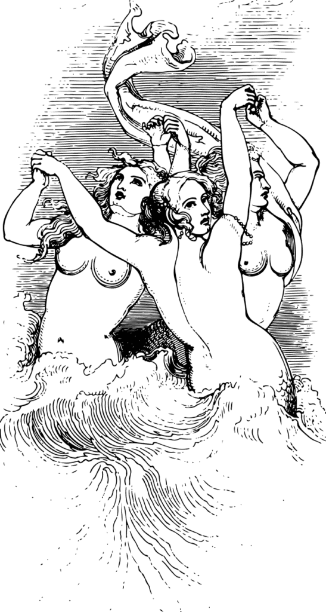
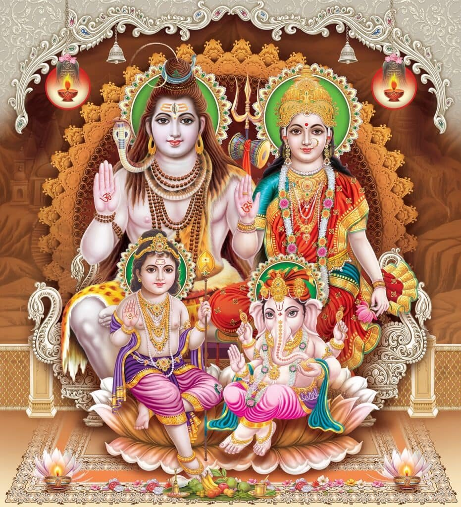

Volcanic eruptions have played a significant role in mythology across cultures for centuries. These powerful and awe-inspiring events have captured the imaginations of people worldwide, leading to the creation of captivating stories and legends. From the ancient Greeks who believed that volcanoes were the workshop of Hephaestus, the god of fire and blacksmithing, to the Polynesians who saw volcanoes as the abode of Pele, the goddess of fire and volcanoes, these fiery displays of nature have been deeply intertwined with religious beliefs and cultural narratives. The immense power and destruction caused by volcanic eruptions have led people to seek explanations and meaning in these natural phenomena, attributing them to supernatural beings and divine forces. Join us as we explore the fascinating connection between volcanic eruptions and mythology, unraveling the stories and beliefs that have been shaped by these explosive forces of nature.

<iframe width="560" height="315" src="https://www.youtube.com/embed/LQwZwKS9RPs" frameborder="0" allow="accelerometer; autoplay; encrypted-media; gyroscope; picture-in-picture" allowfullscreen></iframe>

  

## Why Do Volcanic Eruptions Feature in Mythology?

Volcanic eruptions have always captivated the imagination of humanity. From the earliest civilizations to modern times, these awe-inspiring [natural phenomena](https://magmamatters.com/the-art-and-science-of-volcano-monitoring/ "The Art and Science of Volcano Monitoring") have been a source of wonder, fear, and fascination. It is no surprise then, that volcanic eruptions have found their way into the rich tapestry of mythology across different cultures and time periods. In this article, we will explore the meaning behind volcanic eruptions in ancient cultures, the symbolism associated with them, and the psychological impact they have had on society.

### Meaning behind Volcanic Eruptions in ancient cultures

Ancient cultures often sought to understand and explain the world around them through mythology. Volcanic eruptions, with their powerful displays of fire, smoke, and destruction, were seen as supernatural events that demanded an explanation. In many mythologies, [volcanoes were associated with deities or powerful forces of nature](https://magmamatters.com/the-environmental-impact-of-volcanic-eruptions-2/ "The Environmental Impact of Volcanic Eruptions"). They were often seen as portals connecting the earthly realm to the divine, serving as a bridge between the mortal and the divine.

### The symbolism of eruptions

Volcanic eruptions held immense symbolic significance in ancient cultures. They were often perceived as expressions of the gods' emotions or as divine messages. Eruptions represented the power and volatility of the gods, reminding humanity of their place in the larger cosmic order. The destructive force of volcanic eruptions also symbolized both creation and destruction – the birth of new land and the annihilation of life. Volcanoes were considered to be the source of elemental forces such as fire, which held deep symbolism related to purification, transformation, and renewal.

### The psychological impact of volcanic eruptions on society

Volcanic eruptions were not just physical events; they also had profound psychological effects on the societies living in their shadows. The unpredictability and destructive nature of eruptions often led to fear and anxiety among ancient communities. These events could cause widespread devastation, loss of life, and displacement, leaving a lasting impact on the collective psyche of the people. As a result, volcanoes became ingrained in cultural narratives as symbols of power, danger, and the precarious balance between human existence and the forces of nature.

## Greek Mythology and Volcanic Eruptions

Greek mythology is rich with tales that feature volcanic eruptions and their significance. Mount Etna, located in Sicily, was believed to be the forge of Hephaestus, the god of blacksmiths and craftsmen. The intense heat and flames associated with volcanic activity resonated with Hephaestus' role as the divine blacksmith, forging weapons for the gods and creating beautiful artifacts.

Typhon, a monstrous creature born from Gaia, the Earth goddess, was another prominent figure in Greek mythology linked to volcanic eruptions. Typhon was said to have fought against the gods, causing havoc and destruction. His fiery nature and ability to spew forth scorching flames were likened to the destructive power of volcanic eruptions.

The creation myths of ancient Greece also incorporated volcanic themes. According to some accounts, volcanoes were seen as the result of the Titans' failed attempt to overthrow the gods. As punishment, Zeus buried them beneath the Earth, causing volcanic activity as they struggled in their eternal imprisonment.

This image is property of pixabay.com.

## Roman Mythology and Volcanoes

Like their Greek counterparts, the Romans also associated volcanoes with powerful deities and divine punishment. The most famous example is Mount Etna in Sicily, believed to be the forge of Vulcan, the Roman god of fire, metalworking, and craftsmanship. Vulcan's forge was situated deep within the volcano, where he labored to create magnificent weapons and armor for the gods.

The eruption of Mount Vesuvius in 79 AD, which destroyed the city of Pompeii, became a significant event in Roman mythology. The eruption was interpreted as a manifestation of divine wrath, with the gods unleashing their fury upon the sinful city. This catastrophic event forever etched in the collective memory of the Roman people, serving as a warning and a reminder of the gods' power.

Volcanic eruptions were often seen as divine punishments in Roman narratives. They served as a means to maintain cosmic order and punish those who had angered the gods. This belief reinforced the idea that human actions had consequences and that the gods were actively involved in the affairs of mortals.

## Hawaiian Mythology and Volcano Pele

In Hawaiian mythology, Volcano Pele holds a significant place as the goddess of fire, lightnings, dance, volcanoes, and violence. Pele's origins are the subject of various legends, but she is most commonly believed to have arrived in Hawaii from Tahiti. With her fiery temperament and close association with volcanic activity, Pele became an integral part of Hawaiian folklore.

Pele's curse, known as "Pele's mana'o," is a belief rooted in Hawaiian culture. It is said that anyone who takes lava rocks or other elements from her domain will be cursed with bad luck until the objects are returned. This belief serves as a cautionary tale about the consequences of disrespecting nature and the powerful forces it encompasses.

Pele's role in Hawaiian mythology is not limited to destruction. She is also revered as a deity of transformation and creation. The volcanic landscapes shaped by her eruptions are seen as sacred sites and places of rebirth, representing the cyclical nature of life and the interconnectedness of all things.

This image is property of pixabay.com.

## Myths and Legends in Mesoamerican Cultures

The ancient civilizations of the Aztecs and Mayans in Mesoamerica also incorporated volcanoes into their rich mythology. The legend of Popocatepetl and Iztaccihuatl is one of the most well-known stories. These two volcanoes, located in modern-day Mexico, were believed to be two lovers turned into mountains, forever separated by a tragic fate. Popocatepetl, an active volcano, continues to emit smoke and eruptions, serving as a reminder of their eternal love and the endurance of their spirits.

In Mesoamerican cultures, volcanoes were closely associated with the rain god Tlaloc. Volcanic activity was seen as a sign of Tlaloc's presence and favor. The belief in this association reinforced the importance of volcanoes as sources of fertility and life-sustaining water in a region where agriculture heavily depended on rainfall.

Volcanic symbology also found its way into Aztec and Mayan creation myths. In these stories, the earth was seen as a product of the primordial clash between volcanoes and water, representing the delicate balance between creation and destruction, life and death.

## Japanese Mythology and Mount Fuji

Mount Fuji, an iconic volcano in Japan, holds immense cultural and spiritual significance. It is deeply ingrained in Japanese folklore and is considered a sacred place. Mount Fuji features prominently in Japanese folktales, where it is often depicted as a gateway to the heavens or the dwelling place of gods and spirits.

Volcanic eruptions in Japan have influenced the shinto beliefs, an indigenous religion that reveres natural phenomena and ancestral spirits. Eruptions were interpreted as the presence of kami, or deities, manifesting through the volcano. Shinto rituals and practices often involved offerings and prayers to appease these divine forces and bring about peace and harmony.

Mount Fuji's role in Japanese society extends beyond mythology and religion. It has become a symbol of national identity, appearing in art, literature, and popular culture. The mountain's majestic beauty and imposing presence have inspired countless artists, writers, and filmmakers, who often depict it as a symbol of strength, resilience, and the indomitable spirit of the Japanese people.

This image is property of pixabay.com.

## Nordic Mythology and Volcanoes

Nordic mythology, with its tales of gods, giants, and cosmic battles, also features volcanic imagery. In Norse myths, Surt and the fire giants stood at the center of volcanic symbolism. Surt, the fiery ruler of Muspelheim, was said to wield a flaming sword and was destined to unleash chaos and destruction during Ragnarok, the cataclysmic end of the cosmos.

Volcanic eruptions were believed to be tied to the creation of new land in Norse sagas. The fiery realm of Muspelheim was seen as the source of volcanic activity, spewing forth molten rock and forging new land. The volatile power of volcanoes represented the ever-changing nature of the world and the cyclical patterns of destruction and renewal.

Ragnarok, the final battle between the gods and giants, was said to be accompanied by violent volcanic eruptions, earthquakes, and other cataclysmic events. The destruction of the old world paved the way for a new beginning, where life could emerge from the ashes and the cycle of creation and destruction could continue.

## African Myths related to Volcanic Eruptions

African mythology also encompasses stories and beliefs related to volcanic eruptions. In Cameroon, Mount Cameroon is often referred to as the "Chariot of the Gods." The active volcano is believed to be the dwelling place of powerful deities, linking it to the spiritual realm and divine intervention. Its eruptions were interpreted as signs of the gods' presence and their involvement in the lives of the people.

In African folktales, volcanoes were associated with ancestral spirits and regarded as places of spiritual significance. The raw power and transformative nature of volcanic eruptions were seen as a reflection of the spirits' influence on the earthly realm. Volcanoes became sites of pilgrimage, where people sought spiritual connection, guidance, and protection.

The association of volcanic activities with gods and spirits in African mythology speaks to the deep-rooted reverence for the natural world and the belief in unseen forces that shape human existence. Volcanoes serve as reminders of the interconnectedness between the physical and spiritual realms and the need to maintain balance and harmony.

## Volcanoes in Indigenous Australian Myths

Indigenous Australian myths and legends also contain references to volcanic eruptions. The legend of Budj Bim, a volcano located in the southwest of Victoria, recounts the story of its creation through the actions of the ancestral creator, Budj Bim, who shaped the landscape and formed the lava flows. This story explains the [geological features of the volcano](https://magmamatters.com/geothermal-energy-and-its-volcanic-origins/ "Geothermal Energy and Its Volcanic Origins") and its surrounding areas, emphasizing the deep connection between the land and the indigenous people.

Volcanoes were seen as more than just geological phenomena; they were considered Dreamtime creatures, with their eruptions representing the movements and actions of these spiritual beings. The Dreamtime is a fundamental concept in indigenous Australian culture, referring to the time of creation when ancestral spirits shaped the land, animals, and humans. The volcanic landscapes were regarded as sacred sites, where the presence of the Dreamtime creatures was felt and respected.

The indigenous relationship with volcanic landscapes extends beyond mythology. These sites are often regarded as repositories of traditional knowledge, cultural heritage, and spiritual significance. They serve as physical manifestations of the beliefs, stories, and connections that indigenous communities have with their ancestral past and the natural world.

## Influence of Volcanic Eruptions on Contemporary Myths

While ancient mythologies provide a fascinating insight into the role of volcanic eruptions in cultural narratives, their influence can also be seen in contemporary myths and legends. Volcanic eruptions continue to capture the imagination and serve as a source of inspiration for storytellers across various mediums.

In modern folklore and urban legends, there are numerous accounts of individuals encountering supernatural beings or witnessing strange phenomena during volcanic eruptions. These stories often combine elements of real-world events with the mysterious and supernatural, blurring the line between fact and fiction and fueling the human fascination with the unknown.

Volcanoes also play a significant role in modern literature and film, particularly in genres like science fiction and fantasy. These narratives often leverage the symbolism of volcanic eruptions to explore themes of destruction, transformation, and the struggle between opposing forces. Volcanoes serve as powerful metaphors for human emotions, desires, and the transformative power of nature.

In conclusion, volcanic eruptions have held a prominent place in mythology across cultures throughout history. From Greek and Roman mythology to Hawaiian, Mesoamerican, Japanese, Nordic, African, and indigenous Australian folklore, volcanoes have symbolized power, creation, destruction, and the interplay between the human and divine realms. The captivating imagery and deep symbolism associated with volcanic eruptions continue to resonate with humanity, inspiring stories that reflect our enduring fascination with the natural world and our place within it.

