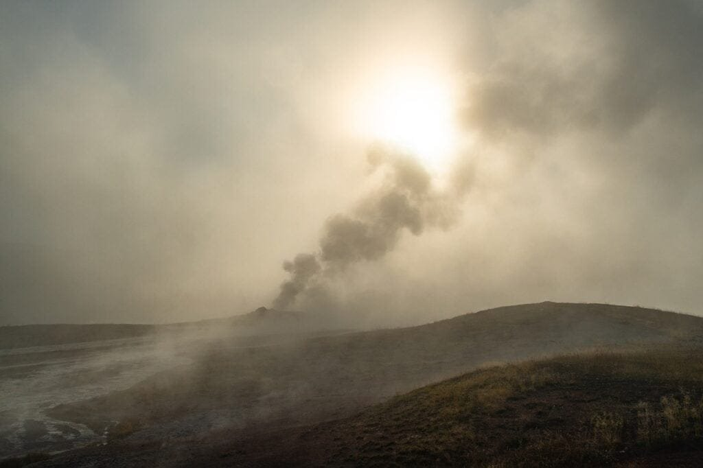
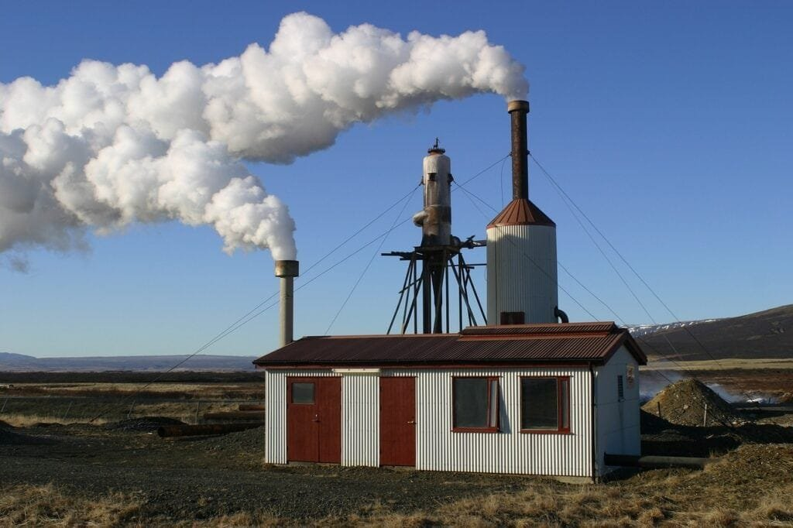
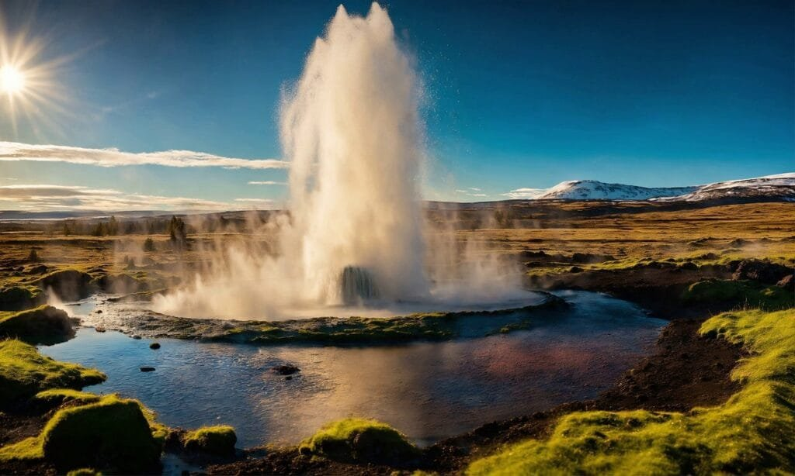

In the future, volcanic geothermal energy is expected to play a significant role in meeting our energy needs. Volcanoes, with their immense heat and constant release of steam, offer a renewable and sustainable source of power. By harnessing the energy stored deep beneath the Earth's surface, we can generate electricity and heat homes and buildings without relying on fossil fuels. Volcanic geothermal energy has the potential to provide clean and reliable power, reduce greenhouse gas emissions, and contribute to a more sustainable future. With its abundance and untapped potential, it's clear that volcanic geothermal energy will be a key player in the transition towards a greener energy landscape.

This image is property of pixabay.com.

## Overview of Volcanic Geothermal Energy

### Definition of geothermal energy

Geothermal energy refers to the heat energy that is trapped beneath the Earth's surface. This energy is derived from the [natural](https://magmamatters.com/the-art-and-science-of-volcano-monitoring/ "The Art and Science of Volcano Monitoring") heat of the Earth's core and mantle, which is continuously being generated by the decay of radioactive elements. Geothermal energy can be harnessed and utilized in various ways for different purposes, including heating and electricity generation.

### How volcanic geothermal energy is created

Volcanic geothermal energy is specifically associated with volcanic regions, where there is a high concentration of geothermal resources. This type of geothermal energy is created due to the proximity of active volcanoes and the heat generated from them. As magma rises to the surface, it heats the surrounding rocks and groundwater, creating geothermal reservoirs that can be tapped into for energy extraction.

### The process of harnessing volcanic geothermal energy

Harnessing volcanic geothermal energy involves several steps. First, exploration and drilling are conducted to identify and access the geothermal reservoirs. Once a reservoir is found, a well is drilled into it to extract the hot water or steam. This hot fluid is then directed to a power plant, where it is used to heat working fluids, such as water or an organic compound, to generate electricity. The steam or hot water can also be directly used for heating purposes in homes, buildings, or industrial processes.

## Historic Utilization of Geothermal Energy

### Historical use of geothermal energy globally

Historically, geothermal energy has been utilized for thousands of years by various civilizations around the world. In ancient times, civilizations such as the Romans, Greeks, and Chinese used geothermal hot springs for bathing and heating purposes. Indigenous cultures in regions of the Americas also used geothermal hot springs for medicinal and therapeutic purposes. The utilization of geothermal energy for electricity generation, however, is a more recent development.

### Volcanic regions that have exploited geothermal energy

Volcanic regions with abundant geothermal resources have been at the forefront of harnessing geothermal energy. These include countries such as Iceland, New Zealand, the Philippines, and the United States, particularly in geothermal-rich areas such as the Geysers Geothermal Complex in California. These regions benefit from the proximity of active volcanoes and the availability of high-temperature geothermal reservoirs, making them ideal for geothermal energy exploitation.

### The progress of geothermal energy exploitation

Over the years, there has been significant progress in the exploitation of geothermal energy, particularly in volcanic regions. Advances in drilling [technology and improved understanding](https://magmamatters.com/understanding-volcanic-formation-a-comprehensive-guide/ "Understanding Volcanic Formation: A Comprehensive Guide") of geothermal reservoirs have facilitated the development of more efficient and cost-effective geothermal power plants. The installation capacity of geothermal power plants has been steadily increasing, and geothermal energy has become an important part of the renewable energy mix in many countries.

<iframe width="560" height="315" src="https://www.youtube.com/embed/hhpq2bitCog" frameborder="0" allow="accelerometer; autoplay; encrypted-media; gyroscope; picture-in-picture" allowfullscreen></iframe>

  

## Types of Volcanic Geothermal Systems

### Definition and explanation of high-temperature geothermal systems

High-temperature geothermal systems are characterized by reservoirs with temperatures exceeding 150°C (300°F). These systems are typically found in volcanic regions and are associated with magmatic activity. The high temperatures allow for efficient electricity generation using steam turbines. The heat energy is extracted through wells drilled into the reservoirs, and the steam produced is used to drive turbines, which generate electricity.

### Definition and explanation of low-temperature geothermal systems

Low-temperature geothermal systems, also known as direct-use geothermal systems, have reservoir temperatures ranging from 30°C to 150°C (86°F to 300°F). These systems are primarily utilized for heating applications, as the temperatures are not high enough to generate electricity efficiently. The hot water or steam extracted from the reservoirs is directly used for space heating, district heating, greenhouse heating, and various industrial processes.

### Examples of active volcanic geothermal systems

Examples of active volcanic geothermal systems include the Krafla geothermal field in Iceland, the Wairakei geothermal power station in New Zealand, and the Salton Sea geothermal field in California, USA. These regions have abundant geothermal resources due to their proximity to active volcanoes and geothermal reservoirs with high temperatures. They serve as successful examples of harnessing volcanic geothermal energy for electricity generation and direct use applications.

## Technologies for Harnessing Volcanic Geothermal Energy

### Geothermal heat pumps

Geothermal heat pumps, also known as ground-source heat pumps, are a technology used for heating and cooling purposes in residential and commercial buildings. These systems utilize the relatively constant temperature of the Earth's subsurface to transfer heat between the ground and the building. In winter, the heat pump extracts heat from the ground and transfers it indoors, while in summer, it removes heat from the building and transfers it back into the ground.

### Direct-use applications

Direct-use applications of geothermal energy involve utilizing the heat directly from the geothermal reservoirs for various purposes. As mentioned earlier, low-temperature geothermal systems are particularly suitable for direct-use applications. The hot water or steam can be used for heating buildings, greenhouses, aquaculture, and industrial processes such as food drying and timber processing. Direct-use applications offer a more localized and decentralized approach to utilizing geothermal energy.

### Electric power generation

Electric power generation from volcanic geothermal energy is achieved through the use of geothermal power plants. The most common type of geothermal power plant is the binary cycle power plant, which utilizes the heat of geothermal fluid to vaporize a working fluid with a lower boiling point. The vapor then drives a turbine, which generates electricity. Other types of geothermal power plants include dry steam power plants, flash steam power plants, and hybrid power plants.

### Emerging technologies

Emerging technologies in the field of geothermal energy focus on improving the efficiency and cost-effectiveness of geothermal power generation. Enhanced geothermal systems (EGS) involve the creation of artificial reservoirs by injecting water into hot and dry rock formations, stimulating fracture networks, and creating a heat exchange system. Deep drilling technology advancements are also being explored to access deeper and hotter geothermal reservoirs, expanding the potential for volcanic geothermal energy utilization.

This image is property of pixabay.com.

## Benefits of Volcanic Geothermal Energy

### Environmental benefits

Volcanic geothermal energy offers several environmental benefits compared to conventional energy sources. It produces minimal greenhouse gas emissions, helping to mitigate [climate change](https://magmamatters.com/geothermal-energy-and-its-volcanic-origins/ "Geothermal Energy and Its Volcanic Origins") and reduce air pollution. Geothermal power plants have a small land footprint and generate significantly less solid waste compared to fossil fuel-based power plants. Additionally, the use of geothermal heat pumps for heating and cooling purposes reduces the reliance on fossil fuels and contributes to energy efficiency.

### Economic benefits

The utilization of volcanic geothermal energy can have significant economic benefits. It provides a reliable source of energy, reducing dependence on imported fuels and enhancing energy security. Geothermal projects also create employment opportunities, both in the construction and operation phases. In rural areas, where many geothermal resources are located, geothermal development can stimulate local economies and contribute to regional development.

### Social benefits

The use of geothermal energy can have positive social impacts on local communities. Access to affordable and reliable electricity and heating can improve the quality of life for individuals and communities. Geothermal development often involves community engagement and consultation, allowing local stakeholders to participate in decision-making processes. Moreover, geothermal power plants have a relatively low visual impact compared to other energy infrastructure, minimizing the disturbance to scenic landscapes.

### Resilience and reliability of geothermal energy

One of the key advantages of volcanic geothermal energy is its resilience and reliability. Geothermal power plants can provide a constant and stable supply of electricity, as they are not subject to weather conditions like solar and wind power. This stability makes geothermal energy an ideal baseload power source, complementing intermittent renewable energy sources. In regions prone to natural disasters or remote areas with limited access to electricity grids, geothermal energy can provide a secure and independent energy supply.

## Challenges in Harnessing Volcanic Geothermal Energy

### Environmental concerns

While geothermal energy is generally considered a clean and renewable energy source, there are potential environmental concerns associated with its exploitation. The release of geothermal fluids, if not properly managed, can lead to the contamination of groundwater and surface water bodies. Geothermal development may also disrupt local ecosystems and habitats. It is crucial to implement effective environmental management practices and monitoring systems to mitigate these impacts.

### Resource availability and exploration

Although volcanic regions have a high potential for geothermal energy, resource availability can still be a challenge. The identification and exploration of geothermal reservoirs require significant investment in exploration drilling, which carries risks of geological uncertainties. Additionally, not all volcanic regions have accessible high-temperature reservoirs suitable for electricity generation. Expanding the resource base and improving exploration techniques are key areas of focus for the development of volcanic geothermal energy.

### Technology and infrastructure

The development and deployment of geothermal technologies require specialized knowledge and expertise. The drilling and operation of geothermal wells can be technically challenging, especially in high-temperature reservoirs. The costs associated with drilling and constructing geothermal power plants can also be significant. Furthermore, the integration of geothermal power plants into existing electricity grids and the transmission of electricity to end consumers may require upgrades and investments in infrastructure.

### Economic factors and market penetration

The upfront costs of geothermal energy projects can be higher compared to some other forms of renewable energy. This can be a barrier to investment and market penetration, especially in regions with lower energy prices or limited access to financing. Additionally, establishing favorable regulatory frameworks and supportive policies for geothermal energy is crucial to attract investments and create a competitive market. Addressing economic factors and market barriers is essential for the wider adoption of volcanic geothermal energy.

This image is property of pixabay.com.

## Comparative Analysis of Volcanic Geothermal Energy with Other Energy Sources

### Comparison with fossil fuels

In terms of environmental impact, volcanic geothermal energy has significant advantages over fossil fuels. Unlike fossil fuel combustion, geothermal energy does not release greenhouse gases or air pollutants. Geothermal power plants also have a longer lifespan and require less maintenance compared to fossil fuel power plants. However, geothermal energy faces challenges in terms of scalability and cost competitiveness when compared to well-established fossil fuel technologies.

### Comparison with other renewable energy sources

Volcanic geothermal energy has unique advantages compared to other renewable energy sources. Unlike solar and wind energy, which are intermittent and dependent on weather conditions, geothermal energy provides a constant and reliable baseload power supply. Geothermal power plants also have a smaller land footprint compared to large-scale solar and wind farms. However, the resource availability and development potential of geothermal energy are limited to specific volcanic regions, unlike solar and wind energy, which can be harnessed in a broader range of geographical locations.

### Potential of volcanic geothermal energy

Volcanic geothermal energy has significant untapped potential that can contribute to the global energy transition. With advancements in technology and exploration techniques, it is expected that more high-temperature geothermal resources will be discovered and utilized. The integration of volcanic geothermal energy into the energy mix can help reduce greenhouse gas emissions, increase energy security, and promote sustainable development. Continued research and development efforts are necessary to unlock the full potential of volcanic geothermal energy.

## Role of Policy and Regulation in Advancing Volcanic Geothermal Energy

### Current policies impacting geothermal energy

The advancement of volcanic geothermal energy is influenced by policies and regulations at the national and international levels. Many countries have implemented renewable energy targets and incentives to promote the development of geothermal energy. Feed-in tariffs, tax incentives, and grants are examples of policy mechanisms used to support geothermal projects. Governments also play a role in streamlining permitting processes, providing long-term power purchase agreements, and ensuring a stable investment environment for geothermal developers.

### Legislation needs for promoting geothermal development

To further advance the utilization of volcanic geothermal energy, specific legislation and regulations targeting geothermal energy can be implemented. These may include measures to streamline the permitting and licensing processes for geothermal projects, ensure the protection and sustainable management of geothermal resources, and establish clear guidelines for environmental impact assessments. Incentives and financial mechanisms can also be introduced to attract private investments and support the deployment of geothermal technologies.

### Role of international cooperation in expanding geothermal usage

International cooperation plays a crucial role in expanding the usage of volcanic geothermal energy. Sharing best practices, knowledge, and technical expertise among countries can accelerate the development and deployment of geothermal projects. International organizations and initiatives, such as the International Renewable Energy Agency (IRENA) and the Global Geothermal Alliance, facilitate collaboration and support capacity building efforts in geothermal energy. Through international cooperation, innovative financing models and technology transfer can be promoted, enabling geothermal energy to become a globally accessible energy source.

## Future Prospects of Volcanic Geothermal Energy

### Predicted growth of geothermal industry

The geothermal industry is expected to experience significant growth in the coming years, driven by the increasing demand for clean and renewable energy sources. Technological advancements, such as enhanced geothermal systems and deep drilling technologies, will expand the resource base and access to geothermal reservoirs. The integration of geothermal energy into smart grids and the development of energy storage solutions will further enhance its market penetration. As awareness of the environmental and economic benefits of geothermal energy grows, its role in the future energy landscape is expected to become more prominent.

### Areas for technological advancements

[Technological advancements will continue to play a crucial role](https://magmamatters.com/the-environmental-impact-of-volcanic-eruptions-2/ "The Environmental Impact of Volcanic Eruptions") in the development of volcanic geothermal energy. Research efforts are focused on improving drilling techniques to access deeper and hotter resources. Exploring innovative materials and fluids for heat exchange systems, as well as developing advanced power plant designs, can improve energy conversion efficiency. Advancements in data analytics and modeling can also optimize the exploration and operation of geothermal reservoirs. Continued investment in research and development will drive technological advancements and unlock the full potential of volcanic geothermal energy.

### Potential impact on energy grid and energy security

The widespread adoption of volcanic geothermal energy can have multiple impacts on the energy grid and enhance energy security. Geothermal power plants can provide stable and reliable baseload power, helping to balance intermittent renewable energy sources like solar and wind. The dispatchability of geothermal power plants can support grid stability and reduce the need for conventional backup power generation. Furthermore, decentralized direct-use applications of geothermal energy can enhance energy resilience in remote areas and contribute to decentralized energy systems.

## Case Studies of Harnessing Volcanic Geothermal Energy

### Case study of Iceland's geothermal utilization

Iceland is a prime example of successful geothermal utilization in a volcanic region. The country has abundant volcanic geothermal resources that have been harnessed for both electricity generation and direct-use applications. Geothermal power plants in Iceland contribute a significant portion of the country's electricity supply, and geothermal heating is widely used for residential, commercial, and industrial purposes. Iceland's geothermal success story showcases the potential of volcanic geothermal energy and serves as a model for other geothermal-rich countries.

### Case study of Geysers Geothermal Complex in California

The Geysers Geothermal Complex in California, USA, is the largest geothermal power producing site in the world. Located in an active volcanic region, the complex has been operating since the 1960s and utilizes high-temperature geothermal resources for electricity generation. Multiple power plants in the complex harness the steam from the geothermal reservoirs, contributing to the state's renewable energy portfolio. The Geysers Geothermal Complex demonstrates the long-term viability and sustainability of volcanic geothermal energy for large-scale electricity generation.

### Case study of development in Indonesia's geothermal reserves

Indonesia has a vast potential for geothermal energy due to its location along the Pacific Ring of Fire, characterized by active volcanic activity. The government of Indonesia has been actively promoting the development of geothermal resources to diversify its energy mix and reduce reliance on fossil fuels. Several geothermal power plants have been built in the country, such as the Sarulla Geothermal Power Plant, contributing to clean electricity generation. Indonesia's geothermal development showcases the importance of policy support and international cooperation in harnessing volcanic geothermal energy.

