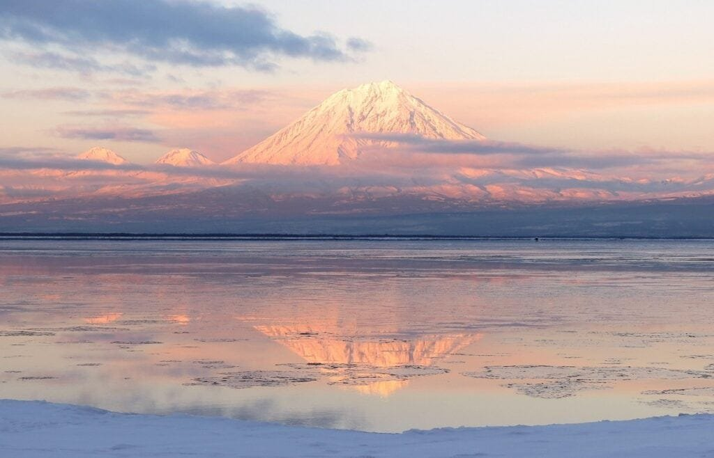

Volcanoes play a crucial role in shaping our planet's geology. These majestic phenomena are formed when molten rock, gases, and debris escape to the earth's surface, causing powerful eruptions of lava and ash. Whether they occur at plate boundaries, hotspots, or rift zones, volcanoes have a profound impact on the Earth's landscape. Some volcanoes, like those found along the "Ring of Fire," occur at plate boundaries where tectonic plates meet, resulting in frequent eruptions. On the other hand, shield volcanoes in Hawaii form gradually over hot spots and erupt less explosively. By understanding the different types of volcanoes, their eruption patterns, and the hazards they can pose, scientists are better equipped to predict future volcanic activity and ensure the safety of surrounding communities.

This image is property of pixabay.com.

## Volcano Formation

### Process of Volcano Formation

Volcanoes are formed when molten rock, gases, and debris escape to the earth's surface through openings in the Earth's crust, leading to eruptions of lava and ash. The process begins deep within the Earth's mantle, where intense heat and pressure cause rocks to melt and form magma. As the magma rises towards the surface, it accumulates in magma chambers, which are pockets of underground reservoirs.

When the pressure builds up in the magma chambers, it eventually overcomes the strength of the surrounding rocks, leading to a volcanic eruption. The magma is then expelled through a vent, which is a narrow opening in the Earth's crust. This eruption results in the release of lava, volcanic gases, and volcanic ash.

### Types of Volcanoes Based on Formation

There are three main types of volcanoes based on their formation: shield volcanoes, composite volcanoes (also known as stratovolcanoes), and [cinder cone](https://magmamatters.com/the-birth-of-new-land-understanding-cinder-cones/) volcanoes.

Shield volcanoes are characterized by their broad, gently sloping sides and are formed by the eruption of low-viscosity lava, which flows easily over long distances. These volcanoes are usually found in hotspot regions, such as the Hawaiian Islands. They have a relatively low explosive potential and are known for their effusive eruptions.

Composite volcanoes are tall and steep mountains that are composed of alternating layers of lava and volcanic ash. They are formed by eruptions of both thick and runny lava, which results in alternating explosive and effusive eruptions. Composite volcanoes are typically found along subduction zones, where one tectonic plate is forced beneath another.

Cinder cone volcanoes are the simplest type of volcanoes and have steep, conical shapes. They are formed by the eruption of gas-rich magma, which leads to the splattering of lava into the air. The lava droplets solidify in mid-air and fall back to the ground, forming the characteristic cone shape. Cinder cone volcanoes are usually small in size and can form as standalone volcanoes or as secondary vents on larger volcanoes.

### Influence of Tectonic Activity on Volcano Formation

Tectonic activity, which involves the movement and interaction of the Earth's tectonic plates, plays a significant role in volcano formation. The majority of volcanoes are located along plate boundaries, where tectonic plates meet and interact. There are three main types of plate boundaries where volcanoes are commonly found:

1. Convergent Boundaries: These are areas where two tectonic plates collide. Depending on the type of plates involved, convergent plate boundaries can result in subduction zones, where one plate is forced beneath another. Subduction zones are known for their composite volcanoes, which are formed by the melting of the subducting plate.
    
2. Divergent Boundaries: These are areas where two tectonic plates move away from each other, creating a gap. Magma rises to the surface through these gaps, leading to the formation of shield volcanoes. The Mid-Atlantic Ridge is an example of a divergent boundary where volcanic activity occurs.
    
3. Transform Boundaries: These are areas where two tectonic plates slide past each other horizontally. While transform boundaries are not known for extensive volcanic activity, localized volcanic features can still occur in some cases.
    

The movement and collision of tectonic plates also contribute to the formation of hotspot volcanoes. Hotspots are areas where plumes of hot material rise towards the Earth's surface, leading to the formation of volcanic activity. These hotspots are thought to be caused by mantle plumes, which are upwellings of abnormally hot and buoyant material within the Earth's mantle. Hotspot volcanoes, such as those in Hawaii, can form shield volcanoes over a long period as the tectonic plate moves over the stationary hotspot.

In conclusion, the formation of volcanoes is influenced by various factors, including the type of plate boundary and the presence of hotspot regions. Understanding these processes is essential in studying and predicting volcanic activity.

## Geographic Distribution of Volcanoes

### Common Locations of Volcanoes

Volcanoes can be found in different geographical locations, with common areas of volcanic activity being plate boundaries, hotspots, and rift zones.

Plate boundaries are areas where tectonic plates interact, and volcanic activity is prevalent. The most prominent examples of these plate boundaries are the Pacific Ring of Fire and the mid-oceanic ridges. The Pacific Ring of Fire, a 40,000-kilometer horseshoe-shaped area encircling the Pacific Ocean, is one of the most active volcanic regions globally. It encompasses several subduction zones, where oceanic plates are forced beneath continental plates or other oceanic plates, resulting in intense volcanic activity.

Hotspots are areas where plumes of magma rise from deep within the mantle to the Earth's surface, creating volcanic activity. These hotspots are thought to be fixed relative to the moving tectonic plates. Examples of hotspots include the Hawaiian Islands and Yellowstone National Park. Hotspot volcanoes often form shield volcanoes due to the continuous eruption of basaltic lava.

Rift zones occur where tectonic plates are moving apart, creating a gap or a rift. Along these zones, magma rises from the mantle and fills the gap, resulting in volcanic eruptions. The East African Rift Valley is a prominent example of a rift zone, where the African Plate is slowly splitting apart, leading to the formation of volcanoes such as Mount Kilimanjaro and Mount Nyiragongo.

### The 'Ring of Fire' and Its Significance

The Pacific Ring of Fire is an arc of intense volcanic and seismic activity that encircles the Pacific Ocean. It extends from the west coast of South America, through North America and across the Bering Strait, down through Japan, the Philippines, and Southeast Asia, then across to New Zealand and the islands of the South Pacific. The Ring of Fire is home to approximately 75% of the world's active volcanoes and is associated with a large percentage of the Earth's earthquakes.

The significance of the 'Ring of Fire' lies in its relation to tectonic plate boundaries. It is predominantly located along subduction zones, where one tectonic plate is forced beneath another. As the subducting plate sinks deeper into the Earth's mantle, the increasing temperature and pressure cause the release of water and other volatile substances, which trigger the melting of the subducting crust and overlying mantle. This process leads to the formation of magma, resulting in volcanic activity along the Ring of Fire.

The 'Ring of Fire' is also associated with the formation of oceanic trenches, mountain ranges, and geothermal activity. The intense volcanic and seismic activity in this region contributes to the formation of new landmasses, as well as the recycling and redistribution of Earth's crustal material.

### Distribution of Different Types of Volcanoes Across the World

The distribution of different [types of volcanoes](https://magmamatters.com/understanding-volcanic-formation-a-comprehensive-guide/ "Understanding Volcanic Formation: A Comprehensive Guide") across the world varies depending on the tectonic settings and geological history of each region.

Shield volcanoes are commonly found in hotspot regions, such as Hawaii, Iceland, and the Galapagos Islands. These regions have experienced consistent volcanic activity over millions of years, resulting in the gradual formation of broad and gently sloping shield volcanoes. Examples of shield volcanoes include Mauna Loa in Hawaii, Eyjafjallajökull in Iceland, and Sierra Negra in the Galapagos Islands.

Composite volcanoes are often associated with subduction zones and occur in areas like the Pacific Northwest, the Andes mountain range in South America, and Japan. These regions experience the collision of tectonic plates, resulting in the formation of composite volcanoes. Examples of composite volcanoes include Mount St. Helens in the United States, Mount Fuji in Japan, and Mount Cotopaxi in Ecuador.

Cinder cone volcanoes can be found in various parts of the world, both as standalone volcanic features and as secondary vents on larger volcanoes. They are often smaller in size compared to shield and composite volcanoes. Examples of cinder cone volcanoes include Paricutin in Mexico and Sunset Crater in the United States.

In summary, the distribution of different types of volcanoes across the world is closely linked to tectonic activity and geological processes specific to each region. Each type of volcano provides unique insights into the geological history and dynamics of the Earth's crust.

<iframe width="560" height="315" src="https://www.youtube.com/embed/R_pDKyg5YKY" frameborder="0" allow="accelerometer; autoplay; encrypted-media; gyroscope; picture-in-picture" allowfullscreen></iframe>

  

## Volcanic Eruption Patterns

### Eruption Styles: Explosive vs. Effusive

Volcanic eruptions can be classified into two main styles: explosive and effusive.

Explosive eruptions occur when highly viscous magma, with a high gas content, is released from a volcano. The magma becomes trapped in the volcano's conduit, causing pressure to build up until it is released explosively. This type of eruption is characterized by violent explosions that fragment the magma into ash, gas, and pyroclastic materials. The ash and volcanic gases can be propelled into the atmosphere, posing significant hazards to human health and aviation.

Effusive eruptions, on the other hand, occur when low-viscosity magma, with a low gas content, is released from a volcano. This type of eruption is typically less violent and results in the slow and steady flow of lava from the volcano's vent. The lava spreads out across the surrounding landscape, creating extensive lava flows. Effusive eruptions are often associated with shield volcanoes and can last for extended periods or even years.

### Factors Affecting Eruption Style: Magma Viscosity, Gas Content

Several factors influence the style of a volcanic eruption, including magma viscosity and gas content.

Magma viscosity refers to a magma's resistance to flow and is primarily determined by its composition and temperature. Magma with high silica content, such as rhyolitic magma, tends to be highly viscous. The high silica content promotes the formation of strong chemical bonds within the magma, making it resistant to flow. As a result, eruptions of highly viscous magma are more explosive in nature, as the pressure builds up due to the magma's inability to escape easily.

On the other hand, magma with low silica content, such as basaltic magma, is less viscous. The low silica content allows the magma to flow more freely, leading to effusive eruptions characterized by the steady flow of lava. The less viscous magma allows gas bubbles within the magma to rise and escape more easily, reducing the explosive potential of the eruption.

Gas content is another crucial factor in determining eruption style. Magma contains various volatile gases, such as water vapor, carbon dioxide, and sulfur dioxide, which are released during volcanic eruptions. The presence of these gases can significantly impact the eruption style. Higher gas content increases the explosiveness of the eruption, as gas bubbles trapped within the magma expand rapidly and fragment the magma into smaller pieces.

Therefore, the combination of magma viscosity and gas content plays a vital role in shaping the eruption style and intensity of a volcano.

### Famous Examples of Different Eruption Patterns

Throughout history, there have been several famous volcanic eruptions that illustrate the different eruption patterns and their associated hazards.

One of the most iconic explosive eruptions occurred in 79 AD at Mount Vesuvius in Italy. This eruption buried the Roman cities of Pompeii and Herculaneum under a thick layer of volcanic ash and pyroclastic flows. The highly explosive nature of the eruption was due to the high gas content and high viscosity of the magma. This event served as a stark reminder of the destructive power of explosive volcanic eruptions.

In contrast, the eruption of Kilauea volcano in Hawaii between 1983 and 2018 provided an example of an effusive eruption. Over this period, the volcano continuously released lava flows that slowly advanced across the landscape, destroying homes and infrastructure in their path. The low viscosity and low gas content of the basaltic lava allowed for relatively steady and predictable lava flows, providing valuable insights into the behavior of effusive eruptions.

These examples highlight the diverse nature of volcanic eruptions and the importance of understanding eruption patterns to mitigate risks and protect vulnerable communities.

## Volcanic Hazards

### Immediate Hazards: Pyroclastic Flows, Lava Flows, Ash Fall

Volcanic eruptions pose immediate hazards that can endanger human lives and property. These hazards include pyroclastic flows, lava flows, and ash fall.

Pyroclastic flows are highly destructive and deadly currents of hot gas, ash, and volcanic debris that surge down the slopes of a volcano during explosive eruptions. These flows can reach speeds of hundreds of kilometers per hour, and their high temperatures can incinerate everything in their path. Pyroclastic flows are associated with explosive eruptions, where highly viscous magma rapidly fragments into small particles that are ejected forcefully from the volcano.

Lava flows are another immediate hazard associated with volcanic eruptions. They occur when magma reaches the surface and flows downslope, often following pre-existing channels or creating new paths. The temperature of the lava can range from several hundred to over a thousand degrees Celsius, posing a significant threat to anything in its path. While lava flows generally move slowly, they can engulf structures, farmland, and infrastructure, causing extensive damage.

Ash fall is a common occurrence during volcanic eruptions and can cover vast areas with a layer of fine volcanic ash. Volcanic ash is composed of small glass fragments and rock particles that can cause respiratory problems, damage infrastructure, and disrupt transportation systems. The weight of accumulated ash can also cause roofs to collapse and disrupt power lines.

### Long-term Hazards: Land Displacement, Climate Change

In addition to immediate hazards, volcanic eruptions can also have long-term impacts on the environment and society.

During large volcanic eruptions, significant amounts of magma are expelled from the volcano, resulting in a decrease in pressure within the underlying magma chamber. This decrease in pressure can cause the land above the chamber to collapse, leading to land displacement and the formation of calderas or sinkholes. These geological features can have long-lasting effects on the landscape and can further exacerbate hazards such as flooding and landslides.

Volcanic eruptions can also have an impact on global climate patterns. Volcanoes emit gases and particles into the atmosphere, including sulfur dioxide and volcanic aerosols. These aerosols can remain suspended in the stratosphere for an extended period, forming a layer that reflects sunlight back into space. This can result in a temporary cooling effect on the Earth's surface, leading to a decrease in global temperatures. On the other hand, volcanic eruptions can also release significant amounts of carbon dioxide, a greenhouse gas that contributes to climate change.

### Case Studies of Major Volcanic Disasters

Several major volcanic disasters throughout history serve as poignant reminders of the destructive power of volcanoes and the importance of effective hazard mitigation.

One notable case study is the eruption of Mount Vesuvius in 79 AD, which buried the cities of Pompeii and Herculaneum under volcanic ash and pyroclastic flows. This catastrophic event resulted in the loss of thousands of lives and the preservation of the cities under layers of volcanic material. The excavation and study of Pompeii and Herculaneum have provided invaluable insights into the daily lives of ancient civilizations and the impact of volcanic disasters.

Another significant case study is the eruption of Mount Pinatubo in the Philippines in 1991. This eruption was one of the most powerful eruptions of the 20th century, releasing vast amounts of ash and gas into the atmosphere. The eruption resulted in the evacuation of tens of thousands of people and had a significant impact on global climate patterns. The release of volcanic aerosols into the atmosphere led to a temporary cooling effect, which reduced global temperatures by approximately 0.5 degrees Celsius for several years.

These case studies highlight the importance of understanding volcanic hazards, implementing effective evacuation procedures, and developing strategies to mitigate the long-term impacts of volcanic disasters.

This image is property of pixabay.com.

## Benefits of Volcanoes

### Volcanic Soil and Agriculture

Although volcanic eruptions can be devastating, they also have significant benefits, particularly for agriculture.

Volcanic soil, known as volcanic ash or tephra, is highly fertile and rich in essential nutrients for plant growth. When volcanic ash settles on the ground, it weathers and breaks down, releasing minerals such as calcium, potassium, and phosphorus. These minerals, combined with the fine texture of volcanic soil, create favorable conditions for plant root development and nutrient absorption.

Volcanic regions, such as the fertile volcanic plains of Central Java in Indonesia, have long been utilized for agriculture due to the abundance of volcanic soil. The volcanic soils in these areas support the cultivation of a wide range of crops, including coffee, rice, vegetables, and fruits. The fertile soil resulting from volcanic eruptions contributes to increased agricultural productivity and supports local economies.

### Geothermal Energy

Volcanoes also provide a valuable source of renewable energy in the form of geothermal energy. Geothermal energy harnesses the heat generated by volcanic activity within the Earth's crust to generate electricity and heat.

In regions with active volcanoes, such as Iceland, the Philippines, and New Zealand, geothermal power plants utilize the heat from underground volcanic reservoirs to generate electricity. Wells are drilled deep into the Earth's crust to access the hot water and steam trapped within geothermal reservoirs. The steam is then used to drive turbines, which produce electricity. Geothermal energy provides a clean and renewable alternative to fossil fuels, reducing greenhouse gas emissions and contributing to sustainable energy sources.

### Tourism and Economic Advantage

Volcanoes, with their awe-inspiring landscapes and unique geological features, attract millions of tourists each year. Volcanic regions offer opportunities for adventure tourism, such as hiking, rock climbing, and volcano exploration. In destinations like Hawaii, Iceland, and Italy, tourists flock to witness volcanic eruptions, explore lava caves, and relax in natural hot springs.

The tourism industry in volcanic regions provides significant economic benefits, supporting local communities and creating employment opportunities. The revenue generated from tourism can be utilized for conservation efforts, infrastructure development, and the preservation of cultural heritage.

In conclusion, volcanoes offer several benefits, including fertile volcanic soil for agriculture, a renewable source of geothermal energy, and tourist attractions that boost local economies. These benefits contribute to the overall understanding of the complex relationship between volcanic activity and its impact on society.

## Volcanoes and Climate

### Volcanic Aerosols and Global Cooling

Volcanic eruptions can have a significant impact on global climate patterns, primarily through the release of volcanic aerosols into the atmosphere.

During explosive volcanic eruptions, large quantities of volcanic ash, fine particles, and gas are ejected into the atmosphere. These particles can rise to the stratosphere and remain suspended for an extended period. The reflective properties of the volcanic aerosols cause them to scatter and reflect incoming sunlight back into space, resulting in a cooling effect on the Earth's surface.

One of the most well-known examples of global cooling caused by volcanic aerosols is the 1815 eruption of Mount Tambora in Indonesia. The eruption injected a massive amount of volcanic aerosols into the atmosphere, leading to a significant decrease in global temperatures the following year. The year 1816, known as the "Year Without a Summer," was marked by abnormal cold temperatures, failed harvests, and widespread famine in many regions of the Northern Hemisphere.

Volcanic aerosols' impact on global climate is temporary and typically lasts for a few years until the particles settle out of the atmosphere. However, major volcanic eruptions can have short-term climatic consequences, affecting weather patterns and agricultural productivity on a global scale.

### Carbon Dioxide Emissions from Volcanoes

While volcanic eruptions release large quantities of gases into the atmosphere, including carbon dioxide (CO2), the contribution of volcanoes to global CO2 emissions is relatively small compared to human activities.

Volcanic CO2 emissions are mainly the result of degassing, where dissolved gases in magma are released during volcanic eruptions. The amount of CO2 emitted by volcanoes varies depending on the eruption size and the composition of the volcanic gases. On a global scale, the estimated annual CO2 emissions from volcanic activity range from 200 to 300 million metric tons, which is less than 1% of the CO2 emissions caused by human activities, such as the burning of fossil fuels.

While volcanic CO2 emissions are relatively minor contributors to atmospheric CO2 levels, they can have localized impacts on air quality and the health of nearby populations. In volcanic regions, elevated levels of volcanic gases, including sulfur dioxide (SO2) and hydrogen sulfide (H2S), can pose respiratory health risks and contribute to acid rain formation.

### Historical Incidents of Volcanoes Affecting Climate

Throughout history, several volcanic eruptions have had a significant impact on global climate, leaving traces in historical records and scientific research.

One of the most famous examples is the 1815 eruption of Mount Tambora in Indonesia, as mentioned earlier. The eruption produced an enormous amount of volcanic ash and gas, which were injected high into the stratosphere. The resulting decrease in global temperatures led to widespread crop failures and famine in many parts of the world.

Another notable example is the 1883 eruption of Krakatoa, also in Indonesia. The eruption released massive amounts of volcanic ash and gas into the atmosphere, leading to dramatic sunsets observed across the globe due to the scattering of sunlight by the volcanic particles. The explosion was also accompanied by a series of tsunamis that caused widespread destruction in the surrounding coastal regions.

More recently, the 1991 eruption of Mount Pinatubo in the Philippines had a significant impact on global climate patterns. The eruption injected massive amounts of volcanic aerosols into the stratosphere, resulting in a measurable decrease in global temperatures for several years.

These examples demonstrate the historical incidents of volcanic eruptions affecting climate patterns and the need for ongoing research and monitoring to better understand the complex interactions between volcanoes and the Earth's climate system.

This image is property of pixabay.com.

## Predicting Volcanic Activity

### Methods and Tools Used to Predict Eruptions

Predicting volcanic eruptions is an ongoing challenge, but advancements in technology and scientific research have provided valuable tools and methods to monitor and forecast volcanic activity.

The most common methods used in predicting volcanic eruptions include seismic monitoring, ground deformation measurements, volcanic gas monitoring, and thermal monitoring.

Seismic monitoring involves the continuous recording and analysis of seismic waves generated by volcanic activity. Monitoring networks of seismometers can detect changes in seismic activity, such as increased earthquake frequency, that may indicate magma movement and potential volcano unrest.

Ground deformation measurements utilize techniques such as GPS (Global Positioning System) and satellite imagery to monitor changes in the Earth's surface around volcanoes. These measurements can detect ground uplift or subsidence, indicating the movement of magma and the potential for an impending eruption.

Volcanic gas monitoring involves the collection and analysis of gases emitted from volcanic vents. Changes in the composition and quantity of volcanic gases, such as an increase in sulfur dioxide (SO2) emissions, can provide valuable insights into the dynamics of magma beneath the surface.

Thermal monitoring involves the use of infrared sensors and satellite imagery to detect changes in volcanic surface temperatures. An increase in surface temperature may indicate the presence of fresh magma near the surface and the potential for an eruption.

### Examples of Successful and Unsuccessful Predictions

Predicting volcanic eruptions accurately is challenging, and not all predictions are successful. However, there have been notable cases of successful volcano predictions based on careful monitoring and analysis.

One example of a successful prediction is the 1991 eruption of Mount Pinatubo in the Philippines. Scientists closely [monitored the volcano's seismic activity](https://magmamatters.com/the-art-and-science-of-volcano-monitoring/ "The Art and Science of Volcano Monitoring"), ground deformation, and gas emissions, which provided clear indications of increased volcanic unrest. These warning signs enabled the successful evacuation of tens of thousands of people, resulting in minimal loss of life despite the eruption's magnitude.

In contrast, there have been cases where volcanic eruptions occurred without clear prior indications, leading to unsuccessful predictions. The eruption of Mount Ontake in Japan in 2014 is one such example. The volcano erupted suddenly, catching hikers and tourists by surprise. Despite some monitoring efforts, the eruption occurred without significant warning, resulting in a tragic loss of life.

These examples highlight the inherent complexity and uncertainties associated with predicting volcanic eruptions. While advancements in monitoring techniques and scientific understanding have improved the ability to forecast volcanic activity, the unpredictability of these natural events remains a challenge.

### Role of Technology in Improving Predictability

Advancements in technology have played a vital role in improving the predictability of volcanic eruptions, enhancing the accuracy and timeliness of eruption forecasts.

Remote sensing technologies, such as satellite-based sensors and ground-based radar systems, have significantly improved the monitoring capabilities of volcanologists. These technologies allow for the continuous collection of data over wide areas, providing a more comprehensive understanding of volcanic activity.

High-resolution satellite imagery can capture detailed surface changes around volcanoes, such as ground deformation and thermal anomalies, with greater accuracy and frequency. This data is essential in detecting and tracking potentially hazardous volcanic activity.

Seismic monitoring networks have also improved with advances in technology, enabling real-time data transmission and analysis. The development of sophisticated algorithms and computer models has enhanced the ability to detect subtle changes in seismic activity and distinguish between volcanic and non-volcanic events.

Furthermore, the development of unmanned aerial vehicles (UAVs), commonly known as drones, has opened up new possibilities for collecting high-resolution data in hazardous volcanic environments. Drones equipped with various sensors can not only capture visual images but also measure gas concentrations, temperatures, and other relevant parameters in real-time.

The integration of multiple data sources and the use of advanced data analysis techniques, such as machine learning and artificial intelligence, hold great promise for improving the accuracy and timeliness of volcanic eruption predictions in the future.

## Mitigating Risk from Volcanoes

### Evacuation Procedures

Mitigating the risks associated with volcanic eruptions requires effective evacuation procedures that prioritize the safety and well-being of communities living near active volcanoes.

Early warning systems are essential in providing timely alerts to at-risk populations. These systems utilize a combination of seismic monitoring, ground deformation measurements, gas monitoring, and thermal monitoring to detect warning signs of volcanic unrest. Once an eruption is deemed imminent or highly likely, evacuation orders can be issued to residents in the affected areas.

Preparing evacuation plans and conducting drills help familiarize communities with evacuation routes, assembly points, and emergency shelters. Education and awareness campaigns play a crucial role in ensuring that residents understand the potential hazards and the importance of following evacuation procedures.

Regular communication and coordination between relevant authorities, including volcanologists, emergency management agencies, and local governments, are essential for effective evacuation planning and response. This collaboration ensures that the latest scientific information is shared promptly, enabling informed decision-making that prioritizes public safety.

### Infrastructure Designed to Withstand Eruptions

Developing resilient infrastructure in volcanic regions is essential for mitigating the impacts of eruptions on human lives and property.

Building codes and regulations should consider the potential hazards associated with volcanic eruptions, including the design and location of critical infrastructure such as hospitals, schools, and transportation networks. Structures can be designed to withstand ash fall, ground deformation, and other volcanic hazards.

In volcanic regions prone to lahars, which are mudflows or debris flows triggered by volcanic activity, effective engineering measures such as barriers, diversion channels, and sediment traps can help mitigate the impacts of lahars on inhabited areas. These measures aim to divert and contain the flow of volcanic materials, minimizing damage to infrastructure and reducing the risk to human lives.

Protective measures, such as ash removal systems for critical infrastructure, can help prevent the accumulation of volcanic ash, which can cause structural damage and disrupt essential services. The development of advanced filtration systems in ventilation and air conditioning systems can also ensure that indoor air quality is maintained during ash fall events.

### Educational Campaigns about Volcanic Hazards

Raising public awareness and understanding of volcanic hazards is paramount in reducing the risks associated with volcanic eruptions.

Educational campaigns should be targeted at communities living in volcanic regions, as well as tourists and visitors who may be unaware of the potential hazards. These campaigns should provide information on evacuation procedures, emergency preparedness, and the importance of staying informed during volcanic unrest.

Schools, universities, and local community organizations can play a crucial role in educating the public about volcanoes and their associated hazards. Volcano observatories and research institutions can collaborate with educators to develop age-appropriate educational materials and conduct workshops and outreach programs.

Engaging with local communities through interactive workshops, public lectures, and exhibitions can foster a culture of preparedness and resilience, empowering communities to take an active role in mitigating the risks associated with volcanic eruptions.

## Volcano Study in Geology

### Methods and Tools in Studying Volcanoes

The study of volcanoes, known as volcanology, involves various methods and tools to understand the processes and hazards associated with volcanic activity.

Seismic monitoring is a fundamental technique in volcanology, as it provides insights into the movement of magma beneath the Earth's surface. Seismometers measure the vibrations caused by earthquakes, volcanic tremors, and other seismic events. Analyzing these seismic signals helps characterize volcanic activity and identify potential eruption precursors.

Ground deformation monitoring employs a range of techniques, including GPS, satellite interferometry, and inclinometers, to measure changes in the Earth's surface caused by magma movement. These measurements can reveal volcanic subsidence, uplift, and lateral movements, contributing to the understanding of volcanic behavior.

Gas monitoring involves the collection and analysis of volcanic gases emitted from volcanoes. Volcanologists use gas analyzers, remote sensing techniques, and gas sampling methods to study the composition, quantity, and spatial distribution of volcanic gases. This information is critical for volcano monitoring and eruption prediction, as changes in gas emissions can indicate volcanic unrest.

Volcanic ash sampling and analysis are important in understanding the physical and chemical characteristics of volcanic ash and its impact on the environment. Techniques such as scanning electron microscopy and chemical analysis help determine ash particle size, shape, composition, and potential health hazards.

Remote sensing technologies, including satellite imagery and aerial photography, provide valuable data for monitoring volcanic activity over large areas. These techniques allow for the detection of surface temperature anomalies, ground deformation, and changes in vegetation cover associated with volcanic activity.

### Notable Discoveries in Volcano Research

Over the years, volcano research has led to several notable discoveries that have advanced our understanding of volcanic processes and hazards.

One significant discovery is [the role of volcanic](https://magmamatters.com/the-role-of-volcanoes-in-earths-carbon-cycle-5/ "The Role Of Volcanoes In Earth’s Carbon Cycle") gases in eruption dynamics. By analyzing gas samples, volcanologists have identified specific gas signatures associated with different stages of volcanic activity. These gas signatures can help predict eruption styles and provide insights into the movement of magma beneath the Earth's surface.

Another significant discovery is the importance of ground deformation monitoring in assessing volcanic hazards. By measuring ground uplift or subsidence using GPS and satellite techniques, scientists can detect changes in the shape of a volcano and identify potential eruption precursors. This information is crucial for assessing the likelihood and timing of volcanic eruptions.

The use of remote sensing technologies, such as satellite imagery and aerial photography, has also revolutionized volcano research. These tools have allowed scientists to monitor volcanic activity over large areas and track changes in volcanic features, such as lava flows, ash plumes, and ground deformat

Lastly, advances in computer modeling and simulation have contributed to our understanding of volcanic processes and hazard assessment. Numerical models can simulate the behavior of magma ascent, eruption dynamics, and the dispersion of volcanic ash and gases. These models help scientists predict eruption scenarios and assess potential hazards, assisting in decision-making and emergency planning.

### Ongoing Research Projects and Missions about Volcanoes

Volcano research is an ongoing endeavor, with numerous projects and missions focused on studying volcanic activity and associated hazards.

One ongoing research project is the Deep Earth Carbon Degassing (DECADE) initiative. DECADE aims to enhance understanding of volcanic degassing processes and the role of volatile elements in global geochemical cycles. The project involves the monitoring of volcanic emissions, collection of gas samples, and the development of models to predict future volcanic activity.

Another notable research initiative is the Deep Earth Carbon Storage (DECS) project, which aims to investigate the potential for carbon capture and storage within volcanic rocks. The project focuses on the use of [carbon dioxide](https://magmamatters.com/geothermal-energy-and-its-volcanic-origins/ "Geothermal Energy and Its Volcanic Origins") injection into volcanic reservoirs to reduce greenhouse gas emissions and mitigate climate change.

In terms of volcano monitoring and hazard assessment, the Volcano Disaster Assistance Program (VDAP) led by the United States Geological Survey (USGS) provides support and technical assistance to countries susceptible to volcanic hazards. VDAP collaborates with international partners to improve volcano monitoring networks, develop eruption response plans, and enhance public awareness.

Space agencies, such as NASA and the European Space Agency (ESA), have also launched missions specifically targeting volcanic environments. NASA's Earth Observing System (EOS) satellites provide valuable data on volcanic activity, including thermal anomalies, gas emissions, and ash plumes. The ESA's Sentinel satellites, equipped with advanced radar and optical sensors, contribute to the monitoring and management of volcanic hazards globally.

These ongoing research projects and missions are vital in expanding our knowledge of volcanoes, improving eruption prediction capabilities, and mitigating the risks associated with volcanic eruptions.

## Future of Volcano Study in Geology

### Anticipated Advancements in Technology and Methodology

The future of volcano study in geology holds promising advancements in technology and methodology that will further enhance our understanding of volcanic processes and improve eruption prediction.

Advancements in remote sensing technologies will continue to play a crucial role in volcano research. High-resolution satellite imagery, improved radar systems, and the use of drones equipped with various sensors will provide more detailed and frequent data on volcanic activity. This data will aid in monitoring and analyzing changes in volcanic deformation, gas emissions, and surface temperature anomalies.

The integration of multiple data sources, such as seismic, deformation, gas monitoring, and satellite data, will further improve eruption forecasting. The development of advanced data analysis techniques, including machine learning and artificial intelligence, will allow for more accurate and timely eruption predictions based on complex data sets.

In addition to technological advancements, interdisciplinary research collaboration will also be a key focus in volcano study. Collaboration between geologists, geochemists, physicists, engineers, and computer scientists will facilitate a comprehensive and holistic approach to understanding volcanic systems. This interdisciplinary approach will provide valuable insights into the behavior and dynamics of volcanoes, as well as their interaction with the environment.

Furthermore, public engagement and citizen science initiatives will continue to grow, allowing communities living near volcanoes to contribute to volcano monitoring and research efforts. Utilizing crowdsourced data collection and citizen scientists' expertise can provide real-time observations and enhance monitoring capabilities.

### Emerging Trends in Volcano Research

Emerging trends in volcano research are centered around improving real-time monitoring, forecasting eruptions, and understanding volcanic hazards in a changing climate.

Real-time monitoring networks will expand to cover more volcanic regions, providing continuous and comprehensive data on volcanic activity. This will facilitate a more thorough understanding of eruption dynamics and aid in the recognition of early warning signs.

Advancements in numerical modeling and simulation will allow for more accurate prediction of eruption scenarios and hazard assessments. High-resolution computational models will be able to capture the complex interactions between magma, gas, and the surrounding environment, improving the accuracy of eruption forecasts.

Climate change is also becoming an increasingly important factor in volcano research. As the Earth's climate evolves, the impact of volcanic eruptions and their interaction with the climate system need to be further explored. Understanding the mechanisms through which volcanoes influence climate patterns and the potential feedback loops between volcanic activity and climate change will be a key area of future research.

Lastly, public outreach and education will continue to be essential components of volcano research. Increasing public awareness of volcanic hazards and fostering collaboration between scientists, local communities, and policymakers will enhance volcano preparedness and resilience.

### Potential Areas of Emphasis for Future Volcano Studies

Future volcano studies will likely place emphasis on several key areas to enhance our knowledge of volcanic processes and improve hazard assessment.

Monitoring and understanding the behavior of submarine volcanoes will be an important area of focus. Submarine volcanoes, also known as underwater volcanoes, are prevalent in the world's oceans and play a significant role in the formation of new oceanic crust. Investigating the dynamics of these volcanoes and their impacts on marine ecosystems will further our understanding of Earth's geologic processes.

Expanding our knowledge of volcanic interactions with the cryosphere, including glaciers and ice caps, will also be a priority. Volcanic activity underneath ice can have unique effects due to the meltwater generated and the potential for explosive interactions. Investigating these interactions will contribute to our understanding of glaciovolcanism and its impact on ice dynamics and sea-level rise.

Studying the long-term effects of volcanic eruptions on ecosystems and biogeochemical cycles will provide insights into post-eruption recovery processes. Understanding the resilience of ecosystems in volcanic environments and the potential long-term consequences of volcanic activity on biodiversity will be critical for conservation efforts and land management strategies.

Lastly, developing innovative approaches for volcano hazard communication and risk assessment will facilitate effective preparedness and response measures. Utilizing advances in communication technologies, geospatial information systems, and risk analysis tools will enhance the ability of policymakers and communities to make informed decisions and reduce the impacts of volcanic disasters.

In summary, the future of volcano study in geology holds exciting opportunities for technological advancements, interdisciplinary collaboration, and a deeper understanding of the complex processes and hazards associated with volcanoes. These efforts will contribute to the protection of vulnerable communities, the advancement of scientific knowledge, and the promotion of sustainable coexistence with volcanic environments.

