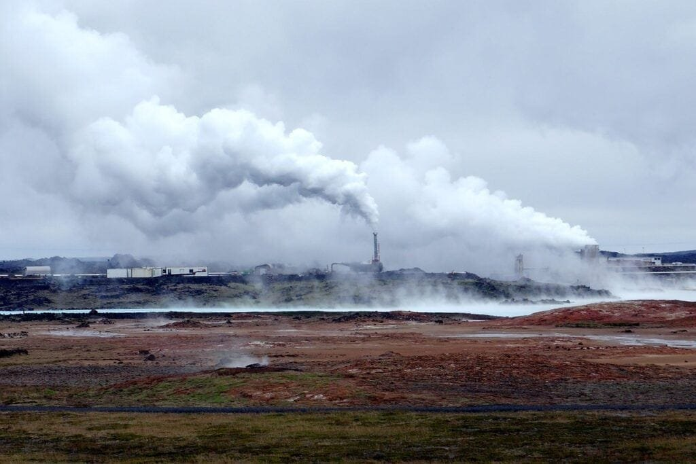
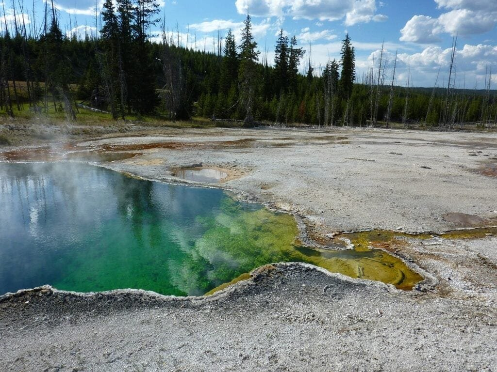
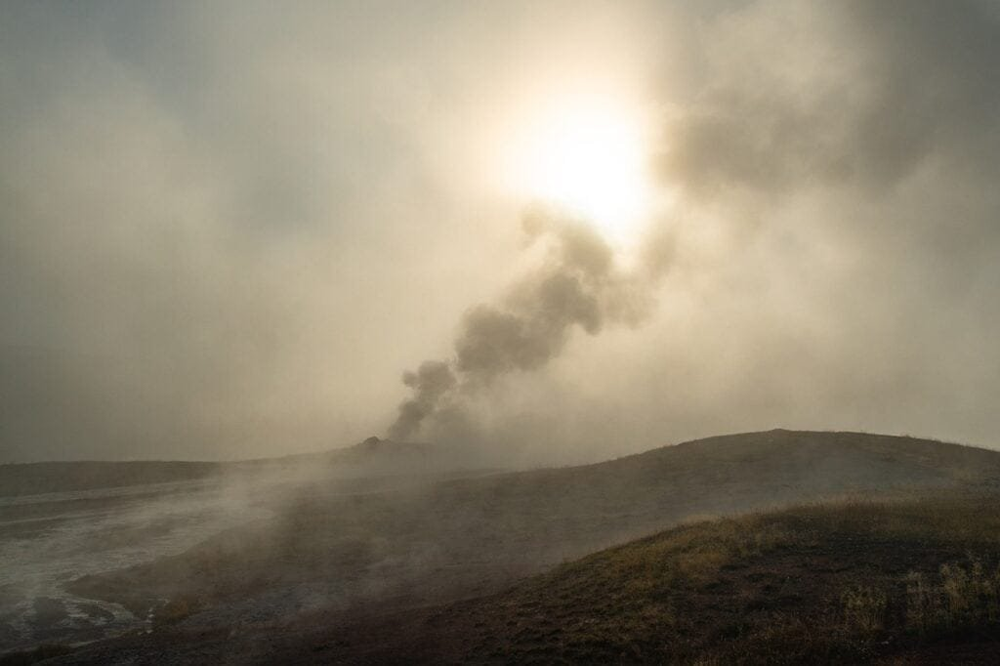

Volcanoes play a significant role in geothermal energy due to their unique characteristics and location. Volcanic activity allows magma and hot water to reach the Earth's surface, creating an abundant source of heat. This heat can be harnessed and converted into electricity, providing a renewable and sustainable energy alternative. Geothermal power plants harness this energy by drilling deep into the Earth's crust, tapping into the hot rocks and water reservoirs below. By understanding the role of volcanoes in geothermal energy, we can explore the potential of this clean energy source and its benefits for the future.

<iframe width="560" height="315" src="https://www.youtube.com/embed/wXR6Vi_dHUY" frameborder="0" allow="accelerometer; autoplay; encrypted-media; gyroscope; picture-in-picture" allowfullscreen></iframe>

  

## Understanding Volcanoes: Basics and Formation

### Defining volcanoes: Molten rock, gases, and debris

Volcanoes are natural features on the Earth's surface that result from the escape of molten rock, gases, and debris from beneath the Earth's crust. When these substances rise to the surface, they cause eruptions of lava and ash. Volcanoes can take various forms, from gentle slopes to mountains with steep sides.

### Geographic distribution of volcanoes

Volcanoes are found all over the world, but they are not evenly distributed. The majority of volcanoes are located along plate boundaries, where the Earth's tectonic plates meet. The "Ring of Fire," which encircles the Pacific Ocean, is a prime example of an area with a high concentration of volcanoes. There are also volcanoes that form over hotspots, which are areas of intense heat below the Earth's crust. Additionally, volcanic activity can occur in rift zones, where tectonic plates are moving apart.

### Volcanoes and tectonic plate boundaries

The relationship between volcanoes and tectonic plate boundaries is crucial to understanding their formation and activity. Volcanoes often occur where there is subduction, which is when one tectonic plate moves beneath another. This movement causes intense heat and pressure, leading to the melting of rocks and the creation of magma. As the magma rises to the surface, it forms a volcano. In areas with divergent plate boundaries, such as rift zones, magma can also reach the surface and create volcanoes.

### How are volcanoes formed?

Volcanoes are formed through intricate geological processes that involve the movement of tectonic plates and the release of molten rock. To begin with, intense heat and pressure deep beneath the Earth's crust cause rocks to melt, forming magma. As the magma rises through the Earth's mantle, it can accumulate in chambers beneath the surface. When the pressure becomes too great, the magma is forced upward, resulting in a volcanic eruption. Over time, repeated eruptions can build up layers of solidified magma and volcanic ash, leading to the formation of a volcano.

## Types of Volcanoes: From Shield to Composite

### Shield volcanoes and their characteristics

Shield volcanoes are characterized by their broad, gently sloping sides and large size. They are typically formed from layers of basaltic lava flows, which have low viscosity and can travel long distances before solidifying. This [type of volcano](https://magmamatters.com/understanding-volcanic-formation-a-comprehensive-guide/ "Understanding Volcanic Formation: A Comprehensive Guide") gets its name from its resemblance to a warrior's shield lying flat on the ground. Shield volcanoes are often associated with hotspots, like the ones in Hawaii, and they tend to have relatively calm and non-explosive eruptions.

### Composite or Stratovolcanoes and associated features

Composite or stratovolcanoes are tall, steep-sided mountains with layered structures composed of alternating layers of lava, ash, and volcanic debris. These volcanoes are formed by alternating eruptions of both lava and pyroclastic material and are associated with subduction zones. Stratovolcanoes are known for their explosive eruptions, which can release large quantities of ash, gas, and pyroclastic flows. They can pose significant hazards to surrounding areas.

### Other types of volcanoes: Lava domes, cinder cones, and more

In addition to shield and composite volcanoes, there are several other types of volcanoes. Lava domes, for example, are formed when thick, viscous lava accumulates near the vent and solidifies, creating a dome-shaped structure. Cinder cones, on the other hand, are small, steep-sided volcanoes that form from ash and cinders ejected during explosive eruptions. There are also complex volcanoes that combine characteristics of multiple types, and submarine volcanoes that form underwater.

This image is property of pixabay.com.

## Eruption Patterns of Volcanoes

### Factors affecting eruption patterns

Several factors can influence the eruption patterns of volcanoes. One important factor is the viscosity of the magma. Magma with low viscosity flows more easily and tends to result in effusive eruptions, where lava slowly flows out of the volcano. In contrast, magma with high viscosity is more sticky and can trap gas bubbles, leading to explosive eruptions. Other factors include the gas content of the magma, the pressure building up beneath the surface, and the presence of water.

### Different eruption styles: Effusive vs explosive

Volcanic eruptions can be classified into two main styles: effusive and explosive. Effusive eruptions involve the steady flow of lava, with relatively low levels of explosiveness. These eruptions tend to occur in volcanoes with low-viscosity magma, such as shield volcanoes. Explosive eruptions, on the other hand, involve the ejection of volcanic ash, gases, and pyroclastic material at high velocities. These eruptions are more common in volcanoes with high-viscosity magma, such as stratovolcanoes.

### Visualizing eruption patterns

Understanding eruption patterns is crucial for volcanic hazard assessment and mitigation. Scientists use various methods to visualize and analyze eruption patterns, including monitoring volcanic activity using seismographs, infrared cameras, and gas sensors. Additionally, satellite imagery and remote sensing techniques are employed to track volcanic plumes and ash clouds. By studying and interpreting these data, scientists can gain insights into the behavior and potential hazards associated with volcanic eruptions.

## Negative Aspects of Volcanoes: Hazards

### Volcanic hazards: Explosions, ash fall, and more

Volcanic eruptions can pose numerous hazards to both human and natural environments. Explosions during eruptions can produce shockwaves, ballistic projectiles, and volcanic gases that can cause damage and harm. Ash fall is another common hazard, as ash can accumulate on the ground, roofs, and vegetation, weighing them down and potentially causing structural damage. Volcanic mudflows, known as lahars, can also be triggered by eruptions, posing a threat to communities near volcanoes. Additionally, pyroclastic flows, which are fast-moving currents of hot gas and volcanic debris, can be extremely destructive.

### Volcanic natural disasters

The hazards associated with volcanic eruptions can result in natural disasters of significant magnitude. The impacts of these disasters can include loss of human life, destruction of property and infrastructure, disruption of transportation systems, and environmental damage. One notable example of a volcanic natural disaster is the eruption of Mount Vesuvius in 79 AD, which buried the ancient Roman cities of Pompeii and Herculaneum under layers of ash and pyroclastic material.

### Mitigation measures for volcanic risks

While volcanic hazards cannot be prevented, there are measures that can be taken to mitigate the risks associated with volcanic eruptions. One key aspect is the development of early warning systems, which detect and monitor volcanic activity to provide timely alerts to at-risk communities. Evacuation plans, emergency shelters, and the establishment of exclusion zones around active volcanoes are also crucial for protecting people from volcanic hazards. Additionally, educating communities about the risks and safety measures can help reduce the potential impacts of volcanic eruptions.

This image is property of pixabay.com.

## Positive Aspects of Volcanoes: Benefits

### Nutrient-rich volcanic soil

One of the benefits of volcanoes is the creation of nutrient-rich soil that supports fertile agricultural lands. Volcanic ash and lava contain essential minerals and nutrients that enhance soil fertility, making it ideal for growing crops. The nutrients released by volcanic eruptions, such as nitrogen, phosphorus, and potassium, can promote plant growth and increase agricultural productivity. Volcanic soil is highly valued by farmers and is often used for cultivating crops such as coffee, grapes, and various fruits and vegetables.

### Aesthetic and tourism value of Volcanoes

Volcanoes also hold significant aesthetic and tourism value. Their majestic presence and unique landscapes attract visitors from around the world. Volcanic regions often offer opportunities for hiking, sightseeing, and experiencing natural hot springs. Many volcanic areas have become popular tourist destinations, providing economic benefits to local communities through tourism-related activities such as accommodations, guided tours, and souvenir sales. The aesthetic appeal and natural beauty of volcanoes contribute to their positive aspects.

### Volcanoes and climate

Volcanoes can have a significant impact on the climate. When a volcano erupts, large amounts of gases, dust, and aerosols are released into the atmosphere. These particles can reflect sunlight back into space, leading to a temporary cooling effect on the planet. Additionally, volcanic eruptions can release large quantities of greenhouse gases, such as [carbon dioxide and sulfur](https://magmamatters.com/the-art-and-science-of-volcano-monitoring/ "The Art and Science of Volcano Monitoring") dioxide, which can contribute to the greenhouse effect and climate change over longer periods. Understanding the role of volcanoes in the climate system is important for studying and predicting climate patterns and their potential impacts.

## Introduction to Geothermal Energy

### Defining Geothermal Energy

Geothermal energy refers to the heat energy stored beneath the Earth's surface in the form of hot water, steam, or rock. It is a renewable energy source that can be harnessed to generate electricity and heat. Geothermal energy is derived from the natural heat of the Earth's interior, primarily the heat generated by the radioactive decay of minerals and the residual heat from the Earth's formation.

### How is geothermal energy generated?

Geothermal energy is generated through the utilization of the Earth's internal heat. Deep beneath the Earth's surface, there are reservoirs of hot water and steam, as well as hot rock formations called geothermal reservoirs. To harness this energy, wells are drilled into the reservoirs, and the hot water or steam is brought to the surface. The steam can then be used to drive turbines and generate electricity, while the hot water can be used directly for heating purposes.

### Benefits of geothermal energy

Geothermal energy offers several benefits as a sustainable energy source. Firstly, it is a renewable resource, as the Earth's internal heat is continuously replenished. This means that geothermal energy can provide a consistent and reliable source of power. Additionally, geothermal energy production has a minimal carbon footprint compared to fossil fuel-based power generation. It emits very low levels of greenhouse gases and air pollutants, reducing environmental impacts. Geothermal energy also has the potential to provide localized power and heating solutions, reducing dependence on external energy sources.

This image is property of pixabay.com.

## Volcanoes and Geothermal Energy

### Understanding the role of Volcanoes in geothermal energy generation

Volcanoes play a vital role in the generation of geothermal energy. The intense heat generated by volcanic activity contributes to the formation of geothermal reservoirs, which are essential for harnessing geothermal energy. Volcanoes help to create the necessary conditions for geothermal energy by maintaining high temperatures beneath the Earth's surface, ensuring the presence of hot water and steam. Thus, areas with active or recently active volcanoes often have great potential for geothermal energy production.

### How do volcanic activities contribute to geothermal energy?

Volcanic activities contribute to geothermal energy in multiple ways. Firstly, volcanic heat helps to maintain the high temperatures required for geothermal reservoirs to exist. The magma within a volcano acts as a heat source, heating the surrounding rocks and fluids. As the magma and hot fluids move towards the surface of the Earth, they create a zone of intense heat, providing the energy needed for geothermal systems. Additionally, volcanic activity can create fractures and pathways within the Earth's crust, allowing the hot water and steam to flow towards the surface and be harnessed for energy production.

### Utilizing volcanic heat for geothermal energy

The heat generated by volcanoes is a valuable resource that can be utilized for geothermal energy production. Geothermal power plants harness the heat energy from the Earth's interior by drilling deep wells into geothermal reservoirs. The hot water or steam extracted from these wells is used to drive turbines, which generate electricity. The excess heat from geothermal power plants can also be utilized for various heating applications, such as district heating or industrial processes. By utilizing volcanic heat, geothermal energy provides a sustainable and reliable source of electricity and heat.

## Geographical Significance of Volcanoes for Geothermal Energy

### The 'Ring of Fire' and geothermal energy

The 'Ring of Fire,' which is characterized by active volcanoes encircling the Pacific Ocean, holds significant geographical significance for geothermal energy. This region is associated with intense tectonic activity, making it highly prone to volcanic eruptions. The volcanic activity in the 'Ring of Fire' creates ideal conditions for the formation of geothermal reservoirs. As a result, countries located within the 'Ring of Fire' have vast geothermal resources and are actively harnessing this energy source to meet their electricity and heating needs.

### Geothermal energy in places with active volcanoes

Areas with active volcanoes often have great potential for geothermal energy production. The continuous volcanic activity contributes to the presence of high temperatures and abundant hot water and steam reservoirs. Countries such as Iceland, New Zealand, and Indonesia, which have active volcanoes, are at the forefront of geothermal energy development. These regions benefit from the proximity of geothermal resources to population centers, allowing for the efficient utilization of this renewable energy source.

### Dependence of geothermal power generation on volcanic activities

Geothermal power generation is dependent on the presence of heat sources, such as volcanic activity. While active volcanoes provide a readily available and abundant source of heat, other areas with dormant or extinct volcanoes can still have geothermal potential. In these regions, the residual heat from past volcanic activity can sustain geothermal reservoirs for thousands of years. Although volcanic activity is not a prerequisite for geothermal energy, it greatly enhances the accessibility and productivity of geothermal resources.

## Practical Examples of Volcano-Based Geothermal Energy Production

### Case study: Iceland and Geothermal energy

Iceland is renowned for its extensive use of geothermal energy and serves as a notable example of successful volcano-based geothermal energy production. The country sits atop the Mid-Atlantic Ridge, a divergent plate boundary, and experiences frequent volcanic activity. Iceland utilizes its abundant geothermal resources to generate a significant portion of its electricity and provide heating to its population. Geothermal power plants harness the heat from volcanic reservoirs, contributing to Iceland's sustainable energy portfolio and reducing its reliance on fossil fuels.

### Example: Hawaii and Volcano-based geothermal power

Hawaii is another prime example of a region where volcanic activity is harnessed for geothermal energy production. The state's volcanic islands, particularly the Big Island, have numerous active volcanoes and geothermal resources. Geothermal power plants in Hawaii tap into these resources, using the heat from volcanic reservoirs to produce electricity. The utilization of volcano-based geothermal power has helped diversify Hawaii's energy mix and reduce its dependence on imported fossil fuels, leading to a more sustainable and resilient energy system.

### Other countries utilizing volcanic geothermal energy

Several other countries around the world are utilizing volcanic geothermal energy to meet their energy needs. New Zealand, with its active geothermal fields and volcanoes, has a significant geothermal capacity and generates a substantial portion of its electricity from geothermal sources. Indonesia, located within the 'Ring of Fire,' also extensively utilizes geothermal energy, with volcanic activity contributing to the presence of high-temperature reservoirs. Other countries, such as the Philippines and Costa Rica, are also actively harnessing geothermal energy from their volcanic regions.

## Future Prospects of Volcano-Based Geothermal Energy

### Potential to harness geothermal energy from volcanoes

The future prospects of volcano-based geothermal energy are promising. With ongoing advancements in drilling techniques and geothermal power plant technologies, it is becoming easier to access and utilize geothermal resources. The presence of active or dormant volcanoes provides a reliable and abundant heat source for geothermal systems. As countries strive to reduce greenhouse gas emissions and transition to more sustainable energy sources, volcano-based [geothermal energy offers a viable and environmentally](https://magmamatters.com/geothermal-energy-and-its-volcanic-origins/ "Geothermal Energy and Its Volcanic Origins") friendly solution.

### Challenges and risks involved in volcano-based geothermal energy

While volcano-based geothermal energy has numerous advantages, it also presents challenges and risks. Drilling deep into the Earth's crust to access geothermal reservoirs can be technically complex and costly. Additionally, volcanic environments can be unpredictable and pose hazards to both people and equipment. The release of volcanic gases during drilling and power generation processes can also present health and safety concerns. Mitigating these risks and ensuring the sustainable development of volcano-based geothermal energy require careful planning, monitoring, and adherence to strict safety protocols.

### Technological advancements facilitating volcano-based geothermal energy use

Technological advancements are playing a significant role in facilitating the use of volcano-based geothermal energy. Improved drilling techniques enable access to deeper and hotter geothermal reservoirs, expanding the potential for energy generation. Enhanced geothermal systems (EGS), which involve artificially creating reservoirs in hot rocks with low permeability, offer opportunities for utilizing geothermal energy in areas with limited natural reservoirs. Advanced power plant technologies, such as binary cycle and combined heat and power systems, enhance the efficiency and flexibility of geothermal energy conversion.

### Implications for sustainable development and green energy

The development of volcano-based geothermal energy has significant implications for sustainable development and the promotion of green energy. By harnessing the Earth's natural heat, geothermal energy reduces reliance on fossil fuels and contributes to the reduction of greenhouse gas emissions. It provides a reliable and cost-effective energy source, enhancing energy security and reducing dependence on external energy imports. The utilization of geothermal energy can also stimulate local economies, create jobs, and foster the transition to a more sustainable and resilient energy future.

