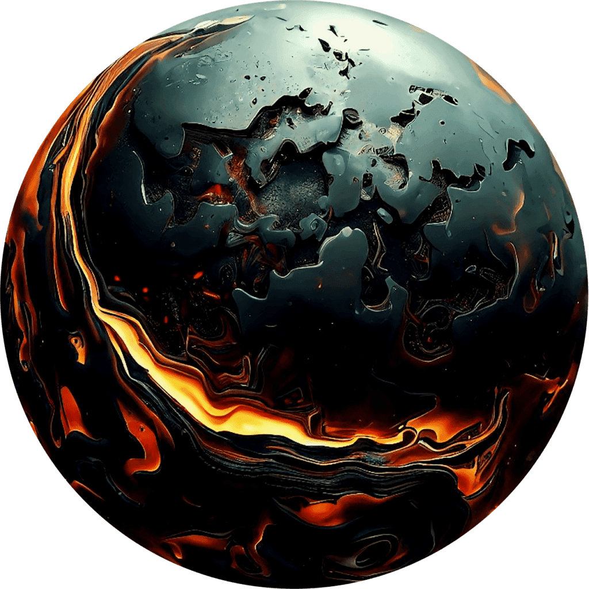

In the world of science fiction, volcanoes have often been depicted as powerful and mysterious forces of nature. From ancient legends to futuristic tales, volcanoes have captivated our imagination with their awe-inspiring eruptions and dramatic landscapes. They have been portrayed as gateways to other worlds, as sources of energy and power, and even as the birthplaces of mythical creatures. In this article, we will explore the role of volcanoes in science fiction and uncover the ways in which they have shaped the narratives and themes of our favorite sci-fi stories. So buckle up and get ready to embark on a volcanic journey through the realms of imagination.

<iframe width="560" height="315" src="https://www.youtube.com/embed/VNGUdObDoLk" frameborder="0" allow="accelerometer; autoplay; encrypted-media; gyroscope; picture-in-picture" allowfullscreen></iframe>

  

## Symbolism of Volcanoes in Science Fiction

Volcanoes often serve as powerful symbols in science fiction, representing various themes and concepts. One common symbol associated with volcanoes is destruction and mayhem. The violent eruptions and explosive [nature of volcanoes](https://magmamatters.com/the-art-and-science-of-volcano-monitoring/ "The Art and Science of Volcano Monitoring") embody chaos and disaster, reflecting the potential destruction that can occur in science fiction narratives. Volcanoes can also be seen as a representation of alien landscapes. Their otherworldly appearance and the unique environments they create make them ideal for depicting fictional alien worlds. Additionally, volcanoes can symbolize renewal and creation. The process of [volcanic eruption and the subsequent formation](https://magmamatters.com/understanding-volcanic-formation-a-comprehensive-guide/ "Understanding Volcanic Formation: A Comprehensive Guide") of new land can be seen as a metaphor for rebirth and the cycle of life.

## Popular Science Fiction Stories Featuring Volcanoes

Jules Verne’s 'Journey to the Center of the Earth' is a classic science fiction story that prominently features volcanoes. The protagonists descend into the depths of the Earth, encountering a vast underground realm filled with volcanic activity. James Cameron’s 'Avatar' also incorporates volcanoes into its fictional world of Pandora. The lush and vibrant planet is depicted with towering mountains and active volcanoes, highlighting the dynamic and alien nature of the setting. In the Star Trek episode 'Amok Time', the volcanic planet Vulcan plays a significant role in the story, reflecting the intense and volcanic emotions of the characters.

## The Role of Volcanoes in Science Fiction Filmography

Volcanoes play a crucial role in science fiction filmography, particularly in creating compelling visual effects. The explosive eruptions, flowing lava, and billowing ash clouds make for visually stunning scenes that captivate the audience. Filmmakers often use advanced special effects and CGI to realistically depict volcanic activity, adding a sense of awe and wonder to their films. Beyond visual effects, volcanoes also contribute to the incorporation of geological realness in science fiction films. The inclusion of accurate geological features and processes adds authenticity to the fictional worlds and enhances the overall immersion of the audience. Additionally, volcanoes are often utilized as settings for climactic scenes in science fiction films. The intense and unpredictable nature of volcanic eruptions provides a dramatic backdrop for pivotal moments in the story, heightening tension and creating a sense of urgency.

This image is property of pixabay.com.

## Utilizing Volcanoes in Science Fiction Literature

In science fiction literature, volcanoes serve multiple purposes in enriching narrative descriptions. Through vivid and detailed descriptions of volcanic landscapes and eruptions, authors can transport readers to fantastical worlds and immerse them in the story. Volcanoes are also effective in building up dramatic tension. The threat of an impending eruption or the uncertainty surrounding volcanic activity can create a sense of suspense and anticipation, keeping readers engaged. Furthermore, volcanoes provide an opportunity for authors to explore scientific theories and volcanic phenomena. By incorporating accurate scientific information and theories in their narratives, authors can educate and entertain readers simultaneously.

## Influence of Actual Volcanic Activity on Science Fiction

Actual volcanic activity has a significant influence on science fiction, both in terms of recent eruptions and geological research. Incorporating recent volcanic eruptions into science fiction narratives allows authors and filmmakers to depict realistic and timely disaster scenarios. The impact and aftermath of volcanic disasters can be explored in depth, shedding light on the human response and the challenges faced by affected communities. Additionally, ongoing geological research on [volcanoes and volcanic phenomena can inspire and inform science](https://magmamatters.com/geothermal-energy-and-its-volcanic-origins/ "Geothermal Energy and Its Volcanic Origins") fiction storytelling. New discoveries and scientific knowledge can be incorporated into narratives to enhance the authenticity and believability of fictional volcanic worlds.

## Impact of Volcanoes on Alien Worlds in Science Fiction

Volcanoes are powerful tools for creating unique extraterrestrial environments in science fiction. By featuring volcanoes on alien worlds, authors and filmmakers can depict unfamiliar and awe-inspiring landscapes that capture the imagination. The presence of volcanoes on alien planets also allows for the exploration of alien life adaptation. Volcanic environments can serve as catalysts for the development of exotic and otherworldly life forms, showcasing the diversity of possibilities in the universe. Moreover, extraterrestrial volcanic eruptions can be depicted to convey the intense and destructive nature of the alien world, further emphasizing its exotic and dangerous qualities.

## Science Fiction Games and the Usage of Volcanoes

Volcanoes find their place in science fiction games, enhancing the game environment and providing unique challenges. Developers often include volcanoes as part of the game world's geography, adding depth and realism to the game environment. Players can navigate volcanic landscapes, climb volcanic mountains, or even witness volcanic eruptions. Volcanoes can also be utilized as challenges or obstacles within the game. Players may need to avoid eruptions, navigate lava flows, or find creative ways to overcome volcanic hazards. In some cases, games may even simulate in-game volcanic disasters, adding an extra layer of excitement and danger.

## Volcanoes as Metaphorical Elements in Science Fiction

In addition to their physical presence, volcanoes can also serve as metaphorical elements in science fiction. They can be used to illustrate inner turmoil or emotions within characters. The explosive nature of volcanoes can mirror the internal struggles of individuals, representing the eruption of repressed feelings or pent-up emotions. Volcanoes can also represent social upheaval, symbolizing the potential for societal change or revolution. The volcanic eruption can serve as a catalyst for transformation and the overthrowing of established systems. Furthermore, volcanoes can signify impending danger or disaster in science fiction narratives. The looming threat of a volcano can create a sense of impending doom and heighten tension throughout the story.

## Role of Volcanoes in Predicting Future Planetary Conditions in Science Fiction

Volcanoes can play a significant role in predicting future planetary conditions in science fiction. By imagining a future Earth with increased volcanic activity, authors can examine the potential consequences and challenges faced by society. The impact of heightened volcanic eruptions on climate, ecosystems, and human civilization can be explored, providing insights into the potential effects of environmental changes. Furthermore, authors can envision scenarios where humans colonize planets with active volcanoes. This allows for the exploration of the unique risks and opportunities presented by volcanic worlds and the ways in which humans adapt to such environments.

## Significance of Volcanoes in Political Narratives within Science Fiction

Volcanoes can also hold significance in political narratives within science fiction. They can be used to display turmoil or conflict within societies or nations. The presence of a volcanic threat can amplify existing tensions and lead to political unrest or power struggles. Volcanoes can also represent power dynamics, with individuals or factions vying for control over volcanic resources or using volcanic activity as a tool of manipulation. Furthermore, the consequences of the misuse of volcanic power can be explored, highlighting the ethical dilemmas and consequences of exploiting natural resources for political or personal gain.

In conclusion, volcanoes play a multifaceted role in science fiction. They serve as powerful symbols, enhance both visual and literary storytelling, and provide opportunities for exploration of various themes and concepts. From representing destruction and renewal to serving as metaphors and predictors of future conditions, volcanoes continue to be a captivating and versatile element in the realm of science fiction.

