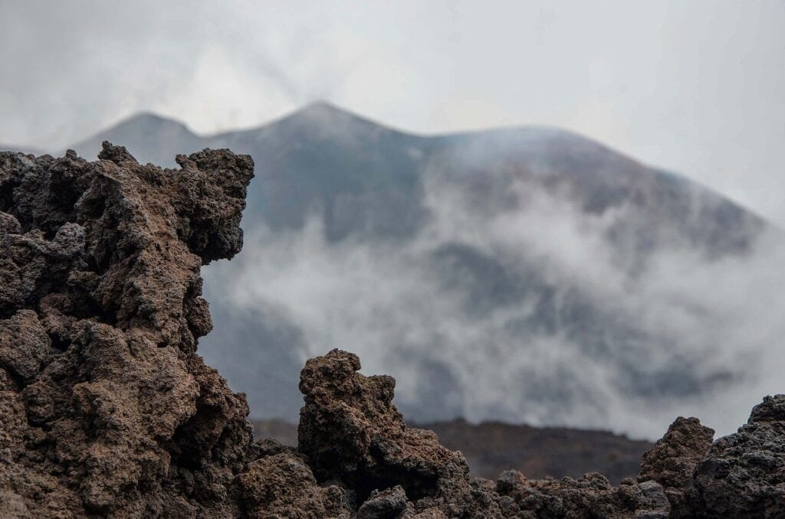

Volcanoes, those awe-inspiring natural wonders, have played a pivotal role in shaping the Earth's crust. From their formations to their eruption patterns, these fiery giants have left their mark on the planet we call home. By belching out molten rock, gases, and debris, volcanoes have sculpted landscapes and influenced the distribution of continents. They have left behind a trail of destruction and devastation, but they have also provided fertile soil and natural resources. In this article, we will explore the different types of volcanoes, their geographic distribution, the causes of eruptions, and the hazards and benefits they bring. By understanding the [role of volcanoes](https://magmamatters.com/the-role-of-volcanoes-in-earths-carbon-cycle-5/ "The Role Of Volcanoes In Earth’s Carbon Cycle"), we can better predict future activity and safeguard the communities living in their shadows. So, let's embark on this journey to uncover the remarkable impacts volcanoes have had on our world.

<iframe width="560" height="315" src="https://www.youtube.com/embed/R_pDKyg5YKY" frameborder="0" allow="accelerometer; autoplay; encrypted-media; gyroscope; picture-in-picture" allowfullscreen></iframe>

  

## Volcanic Formation and Activity

### The process of volcanic formation

Volcanoes are formed when molten rock, gases, and debris, collectively known as magma, escape to the earth's surface. The formation of volcanoes involves several stages. It begins with the accumulation of magma deep within the earth's mantle. As the magma rises towards the surface, it can create cracks and fissures in the earth's crust. Eventually, the pressure from the magma becomes so intense that it causes an eruption, releasing lava, ash, and gases.

During an eruption, the magma forces its way through the opening, resulting in the formation of a volcano. The shape and structure of the volcano depend on various factors, including the type of magma and the frequency and intensity of eruptions. Over time, through repeated eruptions and the deposition of lava and volcanic debris, volcanoes can grow in size and shape.

### Different types of volcanic activity

Volcanic activity can take various forms, each leading to distinct types of volcanoes. The most common types include stratovolcanoes, shield volcanoes, and [cinder cone](https://magmamatters.com/the-birth-of-new-land-understanding-cinder-cones/) volcanoes.

Stratovolcanoes, also known as composite volcanoes, are characterized by steep slopes and alternating layers of lava, ash, and rock. These volcanoes often have explosive eruptions due to the high viscosity of the magma. Examples of stratovolcanoes include Mount Vesuvius in Italy and Mount St. Helens in the United States.

Shield volcanoes, on the other hand, have gentle slopes and are formed by the gradual accumulation of fluid lava. These volcanoes have low-viscosity magma, which allows the lava to flow easily over long distances. The Hawaiian Islands are a prime example of shield volcanoes formed over a hot spot in the Earth's mantle.

Cinder cone volcanoes are smaller in size and are characterized by a steep cone-shaped hill. They are formed by the accumulation of volcanic ash, cinders, and small rocks ejected during explosive volcanic eruptions. These volcanoes are typically short-lived and can be found in various volcanic regions worldwide.

## Volcanoes and Earth's Tectonic Plates

### Correlation between tectonic plates and volcanic location

One of the key factors influencing the location of volcanoes is the movement of the Earth's tectonic plates. Tectonic plates are large, rigid pieces of the Earth's lithosphere that float on the semi-fluid asthenosphere beneath them. These plates are constantly moving due to convection currents in the mantle.

Volcanoes are often found at plate boundaries, where the tectonic plates interact. There are three main types of plate boundaries: convergent, divergent, and transform. Convergent boundaries occur when two plates collide, resulting in intense volcanic activity. Divergent boundaries, on the other hand, are characterized by plates moving apart, leading to the formation of new crust and volcanic activity. Transform boundaries involve plates sliding past each other horizontally, but they can also generate volcanic activity in some cases.

### Role of tectonic plate movement in volcanic activity

The movement of tectonic plates plays a crucial role in volcanic activity. At convergent plate boundaries, where one plate is forced beneath another in a process known as subduction, magma is generated as the subducting plate melts due to the intense temperature and pressure. This magma rises through the overlying plate, leading to the formation of volcanic arcs, such as the Andes in South America.

At divergent plate boundaries, magma rises from the mantle and erupts to create new crust. This process, known as seafloor spreading, forms mid-oceanic ridges and volcanic activity along the ridge, such as the Mid-Atlantic Ridge.

Transform plate boundaries may also experience volcanic activity, although it is less common. As plates slide past each other, they can generate friction and heat, resulting in localized volcanic activity. The volcanic activity along the transform boundary between the Pacific and North American plates in California is an example of this kind of volcanic activity.

This image is property of pixabay.com.

## Volcanoes in the 'Ring of Fire'

### Nature and distribution of volcanoes in the 'Ring of Fire'

The "Ring of Fire" is a highly active volcanic and seismic region located around the Pacific Ocean. It is an arc-shaped chain of volcanoes and tectonic plate boundaries that stretches from the western coast of North and South America, through the Aleutian Islands, and down through Japan, the Philippines, and Indonesia. This region is responsible for 75% of the world's active volcanoes and is known for its frequent volcanic eruptions and earthquakes.

The volcanic activity in the "Ring of Fire" is primarily caused by subduction zones, where oceanic plates are forced beneath continental plates. These subduction zones create intense pressure and heat, leading to the formation of magma chambers and volcanic eruptions. Additionally, the presence of hotspots, areas in the Earth's mantle where high-temperature plumes of magma rise towards the surface, contributes to the volcanic activity in the region.

### How these volcanoes affect the crust in the Pacific region

The volcanic activity within the "Ring of Fire" has a significant impact on the Earth's crust in the Pacific region. Eruptions from these volcanoes release vast amounts of lava, ash, and gases, which shape the surrounding landscape and contribute to the formation of new land.

Over time, the repeated eruptions can build up layers of volcanic materials, forming volcanic islands and mountain ranges. For example, the Hawaiian Islands, located in the central Pacific within the "Ring of Fire," are a result of the continuous volcanic activity over millions of years.

However, the volcanic activity in this region also poses risks to the surrounding areas. The eruptions can cause destruction and loss of life, as seen in historical eruptions such as Mount Pinatubo in the Philippines in 1991 and Mount Fuji in Japan in 1707. These volcanic eruptions can trigger tsunamis, landslides, and pyroclastic flows, endangering both human populations and ecosystems.

## Gradual Formation of Shield Volcanoes

### How shield volcanoes are formed

Shield volcanoes are formed through the gradual accumulation of fluid lava over a long period. These volcanoes are typically composed of basaltic lava, which has low viscosity and high fluidity.

When a volcano forms, the repeated eruptions release lava that flows easily across the landscape due to its low viscosity. Over time, the lava cools and solidifies, creating layers of solidified lava known as basalt. These layers build up, forming the gentle, shield-like shape characteristic of shield volcanoes.

The eruptions of shield volcanoes tend to be non-explosive, with the lava flowing out of vents or fissures instead of violently ejecting ash and debris. As a result, shield volcanoes often have a broad, flattened summit and gentle slopes.

### Differences between shield volcanoes and other types

[Shield volcanoes differ from other types of](https://magmamatters.com/understanding-volcanic-formation-a-comprehensive-guide/ "Understanding Volcanic Formation: A Comprehensive Guide") volcanoes in various ways. One key difference is their shape and structure. While stratovolcanoes have steep slopes and cinder cone volcanoes have a distinctive cone shape, shield volcanoes have a wide, dome-like structure with gentle slopes.

Additionally, shield volcanoes are characterized by their non-explosive eruptions. The lava that erupts from shield volcanoes is highly fluid and can flow for long distances. This is in contrast to stratovolcanoes, which have highly viscous magma that can cause violent and explosive eruptions.

Shield volcanoes also tend to have longer lifespans compared to other types of volcanoes. Due to their less explosive nature, shield volcanoes can continue erupting for extended periods, leading to the gradual accumulation of lava and the growth of the volcano over time.

This image is property of pixabay.com.

## Eruption Patterns and Underlying Factors

### Variations in volcanic eruption patterns

Volcanic eruptions can exhibit different patterns based on various factors, including the type of volcano and the composition of magma.

Some volcanoes have frequent, effusive eruptions, characterized by the continuous flow of lava without significant explosive activity. These eruptions can last for months or even years, gradually building up the volcano. Shield volcanoes, like those found in Hawaii, often display this type of eruption pattern.

Other volcanoes have infrequent, explosive eruptions that release a large amount of ash, rock fragments, and gas. These eruptions can be highly destructive and can cause significant damage to the surrounding areas. Stratovolcanoes, such as Mount St. Helens in the United States, often have this type of eruption pattern due to the high viscosity of their magma.

### How lava viscosity and gas content influence eruptions

The viscosity of magma, or its resistance to flow, plays a crucial role in determining the eruption style of a volcano. Magma with low viscosity, such as basaltic lava, can flow easily, resulting in effusive eruptions. The low gas content in these types of magma allows the lava to flow smoothly. This is why shield volcanoes, formed from basaltic magma, often have non-explosive eruptions with continuous lava flows.

In contrast, magma with high viscosity, such as andesitic or rhyolitic lava, is more resistant to flow. These types of magma have a higher gas content, which makes them more prone to explosive eruptions. The high gas content creates pressure within the magma chamber, leading to violent eruptions that can eject ash, rocks, and gases into the atmosphere.

The viscosity and gas content of magma are influenced by various factors, including the chemical composition of the magma, the temperature, and the amount of dissolved gases. Understanding these factors can help scientists predict the behavior and eruption style of a volcano, providing valuable information for risk assessment and mitigation.

## Influence of Volcanoes on Soil Fertility

### Role of volcanoes in contributing nutrients to the soil

Volcanic eruptions play a crucial role in contributing essential nutrients to the soil. During eruptions, volcanoes release a combination of volcanic ash, gases, and other materials that enrich the surrounding soil.

Volcanic ash, being highly porous and rich in minerals, acts as a natural fertilizer. It contains various nutrients vital for plant growth, including phosphorus, potassium, and trace elements like iron and magnesium. These nutrients are essential for the development of healthy plants and crops.

The ash also improves soil structure by increasing its water-holding capacity and reducing erosion. This can benefit agriculture by providing a fertile and resilient environment for crops to thrive.

### Impact of volcanic activities on agriculture

The impact of volcanic activities on agriculture can be both positive and negative. The fertile soils formed by volcanic ash can support abundant plant growth and lead to high agricultural productivity. Many volcanic regions, such as the volcanic islands of Hawaii and the fertile slopes of Mount Etna in Italy, have a long history of successful agriculture due to the nutrient-rich volcanic soils.

However, volcanic eruptions can also have adverse effects on agriculture. The immediate aftermath of an eruption can cause destruction of crops, livestock, and infrastructure, displacing local populations and disrupting food production. Volcanic ash, when deposited in large amounts, can bury crops, affect water supplies, and damage buildings and machinery.

Furthermore, the release of volcanic gases, such as sulfur dioxide, can have a negative impact on plant growth. These gases can cause acid rain and damage vegetation, leading to reduced crop yields and forest decline.

Understanding the dynamic relationship between volcanic activities and agriculture is crucial for implementing appropriate strategies to mitigate and adapt to the impacts of volcanic eruptions on food security and livelihoods.

This image is property of pixabay.com.

## Impact of Volcanic Eruptions on the Natural Environment

### Short-term and long-term effects of eruptions on the environment

Volcanic eruptions can have both short-term and long-term effects on the natural environment. Immediately after an eruption, the release of volcanic ash, gases, and other materials can cause significant changes to the surrounding ecosystem.

In the short term, volcanic ash can blanket the landscape, smothering vegetation and disrupting ecosystems. The deposition of ash can lead to the loss of plant and animal species, as well as changes in the composition of soil and water bodies. The physical destruction caused by volcanic eruptions, such as landslides and pyroclastic flows, can also devastate the natural environment, altering landscapes and habitats.

In the long term, however, volcanic eruptions can also support the development of new ecosystems. The deposition of volcanic materials, particularly ash and lava, creates fertile soil, providing a foundation for the colonization of plant life. Over time, new habitats and ecosystems can emerge, supporting a diverse array of plant and animal species.

### Influence of volcanic ash on climate and weather patterns

Volcanic ash can have a significant influence on climate and weather patterns, both regionally and globally. The release of ash into the atmosphere during volcanic eruptions can affect sunlight, temperature, and precipitation.

The fine ash particles can reflect and scatter sunlight, leading to a temporary cooling effect on the Earth's surface. This phenomenon, known as volcanic cooling, can result in lower temperatures in the affected regions and even impact global climate patterns. Large volcanic eruptions, such as the eruption of Mount Pinatubo in 1991, can cause a noticeable drop in global temperatures for several years.

However, volcanic ash can also have indirect effects on precipitation. The presence of ash particles in the atmosphere can act as nuclei for cloud formation, potentially leading to increased rainfall. Conversely, the release of [sulfur dioxide and other volcanic gases](https://magmamatters.com/the-art-and-science-of-volcano-monitoring/ "The Art and Science of Volcano Monitoring") can contribute to the formation of acid rain, which can have detrimental effects on ecosystems and water bodies.

The impact of volcanic ash on climate and weather patterns is complex and depends on various factors, including the size and composition of the ash particles, altitude, and atmospheric conditions. Understanding these interactions is crucial for predicting the short-term and long-term effects of volcanic eruptions on climate and weather systems.

## Hazardous Effects of Volcanic Activity

### Potential disaster impacts from volcanic eruptions

Volcanic eruptions can have a range of hazardous effects, posing significant risks to human populations and the surrounding environment. Some of the potential impacts include:

1. **Pyroclastic flows and Lahars:** These fast-moving flows of hot gas, ash, and volcanic debris can cause widespread destruction, burying or burning everything in their path. Lahars, which are volcanic mudflows triggered by the mixing of volcanic ash and water, can travel long distances and devastate communities.
    
2. **Ashfall and Tephra:** The deposition of volcanic ash and tephra can disrupt transportation, damage infrastructure, and pose health risks. Fine ash particles can penetrate buildings and machinery, causing mechanical failures and respiratory problems when inhaled. Ash can also contaminate water supplies, further exacerbating the impact on communities.
    
3. **Volcanic Gases:** Toxic gases, such as sulfur dioxide, carbon dioxide, and hydrogen sulfide, released during eruptions can pose severe health risks to humans and animals. These gases can cause respiratory problems, asphyxiation, and even death. Volcanic gases can also contribute to air pollution and acid rain, affecting regional and global ecosystems.
    
4. **Tsunamis:** Underwater volcanic eruptions, particularly those occurring near the coast, can trigger tsunamis. These large ocean waves can cause extensive damage to coastal areas and threaten human lives.
    
5. **Climate Impact:** Volcanic eruptions can release large amounts of greenhouse gases and aerosols, which can affect climate patterns globally. The injection of gases and particles into the stratosphere can cause temporary cooling and alterations in precipitation patterns, potentially impacting agriculture and natural systems.
    

### Impact of volcanic gases on human health and the atmosphere

Volcanic gases emitted during eruptions can have significant impacts on human health and the atmosphere. The composition and concentration of volcanic gases vary depending on factors such as magma composition, eruption style, and proximity to populated areas.

Sulfur dioxide (SO2) is one of the most common volcanic gases released during eruptions. It can have short-term and long-term effects on human health, depending on the exposure levels. Short-term exposure to high concentrations of sulfur dioxide can cause respiratory problems, eye irritation, and throat irritation. Prolonged exposure can lead to chronic respiratory conditions, cardiovascular issues, and even premature death.

Carbon dioxide (CO2) is another important volcanic gas. In high concentrations, carbon dioxide is toxic and can cause asphyxiation. In areas where volcanic gases accumulate in low-lying and poorly-ventilated locations, such as volcanic craters and low-lying valleys, carbon dioxide can pose a significant risk to humans and animals.

Volcanic gases can also have significant atmospheric impacts. The release of sulfur dioxide during eruptions can contribute to the formation of sulfuric acid, leading to the development of acid rain. This can have detrimental effects on vegetation, bodies of water, and ecosystems. Additionally, volcanic emissions can contribute to air pollution and the depletion of ozone in the stratosphere.

Understanding the composition and behavior of volcanic gases is crucial for implementing appropriate measures to protect human health and minimize the environmental impacts of volcanic eruptions.

## Risk Mitigation and Prediction of Volcanic Activity

### Steps for predicting eruptions

Predicting volcanic eruptions is a challenging task but essential for mitigating the risks associated with volcanic activity. Scientists employ various techniques and monitoring systems to gather data and make predictions about volcanic eruptions. Some of the steps involved in predicting eruptions include:

1. **Monitoring Ground Deformation:** Scientists use GPS instruments and ground-based sensors to measure changes in the shape and size of volcanoes. Ground deformation can indicate the movement of magma beneath the surface and provide insights into volcanic activity.
    
2. **Gas Monitoring:** Monitoring the composition and emission rates of volcanic gases, such as sulfur dioxide and carbon dioxide, provides valuable information about the state of a volcano. Changes in gas emissions can be indicative of increasing volcanic activity.
    
3. **Seismic Monitoring:** Volcanoes generate seismic activity due to the movement of magma and the fracturing of rock. Seismometers and other seismic monitoring devices are used to detect and analyze the seismic signals associated with volcanic activity. Monitoring changes in seismicity patterns can help in predicting eruptions.
    
4. **Thermal Monitoring:** Monitoring the temperature of the volcano and changes in heat flow can provide insights into the movement of magma beneath the surface. Thermal cameras and satellite-based sensors are used to detect variations in volcanic heat signatures.
    
5. **Groundwater Monitoring:** The interaction between magma and groundwater can lead to the production of steam and changes in groundwater chemistry. Monitoring changes in groundwater levels, temperature, and composition can help in predicting volcanic activity.
    

By integrating data from these monitoring techniques and analyzing trends and patterns, scientists can make informed predictions about the likelihood and timing of volcanic eruptions. This information is vital for issuing timely warnings and implementing appropriate measures to protect local communities.

### Mitigation strategies for communities near volcanoes

Communities located in proximity to volcanoes face unique risks and challenges. Implementing effective mitigation strategies is crucial for reducing the impacts of volcanic eruptions and ensuring the safety of residents. Some key strategies for communities near volcanoes include:

1. **Volcano Hazard Zoning:** Establishing hazard zones based on the potential risks associated with volcanic eruptions is essential. These zones should incorporate knowledge of historical eruptions, monitoring data, and scientific modeling. Informing residents and enforcing land-use restrictions in high-risk areas can help minimize exposure.
    
2. **Early Warning Systems:** Developing robust early warning systems is crucial for alerting communities about impending volcanic eruptions. These systems should incorporate real-time monitoring data, communication channels, and clear protocols for issuing warnings and evacuation orders.
    
3. **Community Preparedness:** Promoting community preparedness through education and training is vital. Providing residents with knowledge about volcanic hazards, evacuation routes, and emergency procedures can empower them to take appropriate actions during volcanic crises.
    
4. **Infrastructure Resilience:** Designing and constructing infrastructure, such as buildings and transportation networks, with volcanic hazards in mind can help enhance their resilience. Using volcanic-resistant materials, reinforcing structures, and ensuring robust emergency response systems are valuable measures.
    
5. **Collaboration and Communication:** Strengthening collaboration between scientists, local authorities, and communities is crucial for effective volcanic hazard management. Enhancing communication channels, sharing information, and involving local communities in decision-making can lead to more successful mitigation efforts.
    

By implementing these strategies, communities can enhance their resilience to volcanic hazards and minimize the potential impacts of future eruptions.

## Role of Volcanoes in Shaping and Modifying Earth's Crust

### Processes by which volcanoes shape the earth's crust

Volcanoes play a crucial role in shaping and modifying the Earth's crust through various processes. Some of the key ways in which volcanoes shape the earth's crust include:

1. **Eruption and Lava Deposition:** Volcanic eruptions release lava, ash, and other volcanic materials onto the Earth's surface. The deposition of these materials over time can result in the formation of new landmasses, such as volcanic islands and mountain ranges.
    
2. **Tectonic Plate Interactions:** Volcanoes often form at plate boundaries, where tectonic plates interact. The movement and collision of these plates can lead to volcanic activity, as one plate is forced beneath another or when plates move apart, allowing magma to reach the surface.
    
3. **Transportation and Redistribution of Materials:** Volcanoes can transport materials from the deep Earth's interior to the surface. Magma, as it rises through the crust, carries minerals and gases that may have otherwise remained inaccessible. This transportation and redistribution of materials by volcanic activity contribute to the overall composition of the Earth's crust.
    
4. **Erosion and Weathering:** Volcanoes are subject to erosion and weathering processes, which can shape and modify their physical characteristics. Water, wind, and other natural agents can erode volcanic structures, carving valleys, canyons, and other landforms.
    
5. **Volcanic Landforms:** The accumulation of lava, ash, and other volcanic materials over time can result in the formation of various landforms. These include shield volcanoes, stratovolcanoes, volcanic cones, calderas, and lava plateaus. The presence of these distinct volcanic landforms contributes to the overall topography of the Earth's crust.
    

### Impacts of continuous volcanic activity on Earth's topography over geologic time

The continuous volcanic activity over geologic time has had a profound impact on the Earth's topography. Volcanic eruptions and the resulting deposition of lava and volcanic materials have contributed to the formation of diverse landforms and shaped the overall landscape.

Volcanic activity has led to the creation of mountain ranges, such as the Cascade Range in the United States and the Andes in South America. The repeated eruptions and accumulation of volcanic materials have built up these ranges over millions of years.

Additionally, volcanic activity has formed various island chains and archipelagos, such as the Hawaiian Islands, the Canary Islands, and the Galapagos Islands. These volcanic islands are evidence of the continuous activity of hotspots, which generate magma that rises to form new landmasses.

Volcanic activity has also resulted in the formation of vast lava plateaus, like the Deccan Plateau in India and the Columbia River Plateau in the United States. These plateaus are the remnants of massive volcanic eruptions that occurred over millions of years.

Over geologic time, continuous volcanic activity has shaped and modified the Earth's crust, contributing to its overall topography and creating diverse landscapes with unique geological features.

In conclusion, volcanoes play a significant role in shaping the Earth's crust through their formation, activity, and interaction with tectonic plates. From the gradual formation of shield volcanoes to the varied eruption patterns and influences on soil fertility, volcanoes have both positive and hazardous effects on the natural environment. Understanding the processes and impacts of volcanic activity is essential for predicting eruptions, implementing effective risk mitigation strategies, and appreciating the dynamic forces that have shaped the Earth's crust over geologic time.

