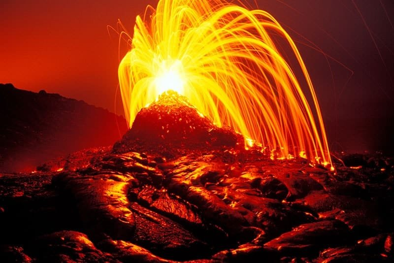
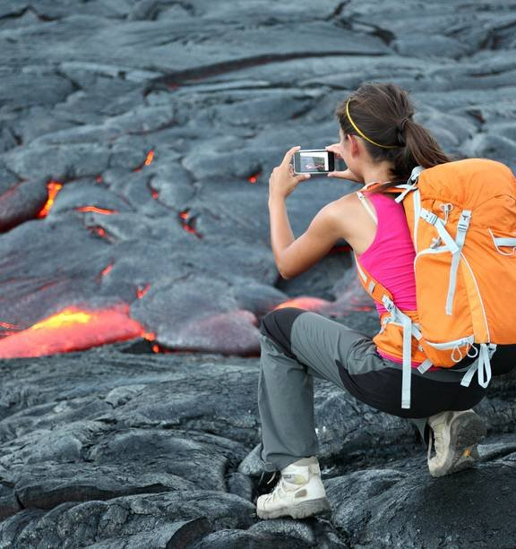
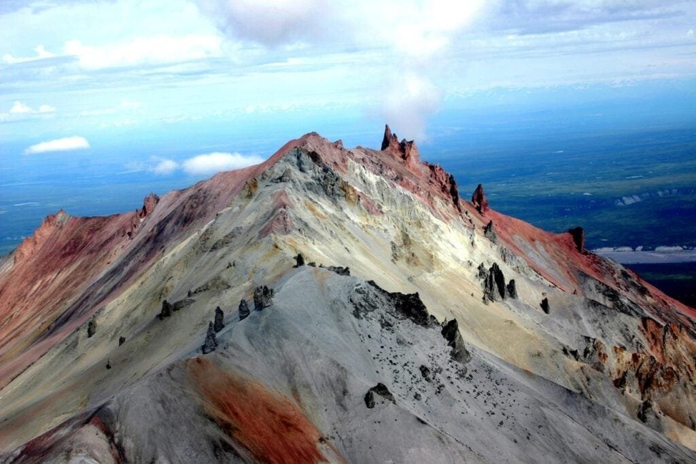
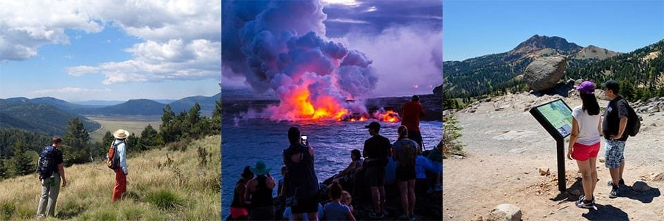

Get ready for an unforgettable adventure as you embark on the top educational tours that will take you up close and personal with volcanic landforms. Volcanoes are fascinating natural wonders that are formed when molten rock and gases escape to the Earth's surface, resulting in eruptions of lava and ash. These incredible geological formations can be found along plate boundaries, hotspots under the Earth's crust, or rift zones where tectonic plates are moving apart. From the volatile volcanoes of the "Ring of Fire" to the gradual and less explosive shield volcanoes of Hawaii, each one offers a unique learning experience. By exploring these incredible formations, you'll gain a deeper understanding of their eruption patterns, causes, and the benefits and hazards they bring. So gear up and get ready to explore the captivating world of volcanic landforms on these extraordinary educational tours.

<iframe width="560" height="315" src="https://www.youtube.com/embed/3Jxeh-yAXek" frameborder="0" allow="accelerometer; autoplay; encrypted-media; gyroscope; picture-in-picture" allowfullscreen></iframe>

  

## Hawaii Volcanoes National Park, USA

### Learn about the world's most active volcanoes

If you're fascinated by volcanoes and want to witness the power of nature up close, a visit to Hawaii Volcanoes National Park is a must. This park is home to some of the world's most active volcanoes, including Kīlauea and Mauna Loa.

At the park, you'll have the opportunity to learn about these incredible volcanic formations and the science behind their eruptions. The park offers a range of educational programs and guided tours that cater to all ages and interests. You can attend informative talks by park rangers, participate in hands-on activities, and even take part in guided hikes to explore the volcanic landscapes.

### Watch live lava flows and volcanic steam vents

One of the most awe-inspiring experiences at Hawaii Volcanoes National Park is witnessing the live lava flows. Depending on the current activity levels, you may have the chance to see molten lava streaming down the sides of the volcanoes and into the ocean. It's a mesmerizing sight that will leave you in awe of the Earth's powerful forces.

Additionally, the park is dotted with volcanic steam vents, known as fumaroles, where you can witness hot gases being released from deep within the Earth. These vents are a testament to the ongoing volcanic activity in the area and provide a unique opportunity to observe the Earth's processes in action.

### Explore the impact of eruptions on local ecosystems

With its constant volcanic activity, Hawaii [Volcanoes National Park offers a unique environment](https://magmamatters.com/geothermal-energy-and-its-volcanic-origins/ "Geothermal Energy and Its Volcanic Origins") for studying the impact of eruptions on local ecosystems. From barren lava fields to lush rainforests that have emerged from volcanic ash, the park showcases the astonishing resilience of nature.

You can explore the diverse landscapes and witness how life adapts to and thrives in volcanic environments. The park is home to unique plant species, such as the 'ōhi'a lehua tree, which are specially adapted to survive in the harsh conditions of volcanic soil. By studying these ecosystems, scientists gain valuable insights into how life can withstand and recover from volcanic disruptions.

## Mount Vesuvius and Pompeii, Italy

### Trace the history of the iconic 79 AD eruption

Imagine stepping back in time to the year 79 AD when Mount Vesuvius unleashed a catastrophic eruption that buried the ancient city of Pompeii under layers of ash and pumice. A visit to Mount Vesuvius and Pompeii allows you to delve into this captivating historical event and its impact on the region.

Learn about the eruption that preserved Pompeii for centuries, freezing it in time until its rediscovery in the 18th century. Explore the archaeological site of Pompeii and witness the remarkably preserved remnants of an ancient Roman city, including houses, temples, theaters, and even the iconic casts of the volcano's victims.

### Discover the preserved Ancient Roman city of Pompeii

Pompeii offers a unique glimpse into daily life in ancient Rome. As you wander through the streets, you can see the remains of luxurious villas, bustling marketplaces, and intricate frescoes that once adorned the city's walls. The city's tragic fate provides an unparalleled opportunity to understand the customs, architecture, and culture of ancient civilization.

Guided tours of Pompeii provide in-depth explanations of the historical context and significance of each site, ensuring a rich and educational experience. You can also visit the onsite museum, which houses artifacts recovered from Pompeii, giving you a deeper appreciation for the daily lives of its inhabitants.

### Peer into the active crater of Mount Vesuvius

No trip to Mount Vesuvius would be complete without a hike up to its crater. As you ascend the slopes of the volcano, you'll be treated to panoramic views of the Bay of Naples and the surrounding countryside. The hike is moderately challenging, but the reward is well worth it.

Reaching the crater, you can peer into its depths and witness the steam and volcanic gases rising from within. Standing on the edge of an active volcano is an exhilarating experience that allows you to appreciate the raw power and beauty of nature. Expert guides are available to provide geological insights and ensure your safety during the hike.

This image is property of volcanodiscovery.de.

## Krakatoa, Indonesia

### Discover the site of the most violent eruption in recorded history

Krakatoa, located in Indonesia, is infamous for the most violent eruption in recorded history. In 1883, the volcano erupted with such force that it generated a series of tsunamis and caused an immense loss of life. Today, visiting Krakatoa allows you to witness the aftermath of this devastating event and learn about its global impacts.

Guided tours to Krakatoa provide a comprehensive understanding of the eruption and its effects. You'll explore the volcanic island of Anak Krakatau, which emerged from the seabed following the 1883 eruption. Walk along the volcanic landscapes and see firsthand the remnants of the catastrophic event.

### Study the regrowth of life on the Anak Krakatau island post-eruption

Despite its destructive power, nature has slowly reclaimed Anak Krakatau. The barren landscapes have started to regenerate, providing a unique opportunity to study the process of ecological succession. Witnessing the regrowth of life on the island is a testament to the resiliency of nature and its ability to rebound after catastrophic events.

On guided tours, you'll have the chance to learn about the ongoing scientific research conducted on Anak Krakatau. Discover how scientists are monitoring the volcanic activity and studying the complex interactions between the environment and the regenerating ecosystems.

### Learn about local myths and legends surrounding Krakatoa

Krakatoa holds a significant place in local Indonesian mythology and folklore. During your visit, you'll have the chance to learn about these myths and legends that have been passed down through generations. From stories of mythical creatures dwelling in the depths of the volcano to tales of gods and goddesses controlling the volcanic eruptions, these narratives add another layer of fascination to your experience.

Local guides and experts will share these captivating stories, providing insight into the cultural significance of Krakatoa and its enduring impact on the people of Indonesia.

## Yellowstone National Park, USA

### Explore the world's first National Park with its numerous volcanic features

Welcome to Yellowstone National Park, the world's first National Park and a geothermal wonderland. This vast park is home to numerous volcanic features, including hot springs, geysers, mud pots, and fumaroles. Exploring Yellowstone allows you to witness the raw power of volcanic activity and marvel at the unique landscapes it has created.

Yellowstone offers a wide range of educational opportunities, whether you prefer self-guided exploration or joining ranger-led programs. You can hike along the boardwalks that wind through the park's geothermal areas, getting up close to colorful hot springs like the iconic Grand Prismatic Spring. Stop by the informative visitor centers to learn about the geology and ecology of the park.

### Learn about Yellowstone's volcanic past and geothermal features

Yellowstone's volcanic history dates back millions of years, with its most recent eruption occurring roughly 640,000 years ago. By studying the park's geology, scientists have gained valuable insights into the processes that shape our planet and the potential risks associated with volcanic activity.

Over the years, Yellowstone has also become a hub for geothermal research. The park's geysers, including the famous Old Faithful, provide a natural laboratory for studying the behavior of geothermal systems. Take part in educational programs that delve into the science behind geothermal features and their role in the Earth's ecosystem.

### Visit the iconic Old Faithful geyser and Grand Prismatic Spring

No visit to Yellowstone would be complete without witnessing the eruption of the iconic Old Faithful geyser. This predictable geyser erupts roughly every 90 minutes, shooting water high into the air and captivating visitors from around the world. Find a spot on the viewing platform and watch in awe as nature puts on a mesmerizing display.

Another must-see attraction is the Grand Prismatic Spring, renowned for its vibrant colors and immense size. This hot spring is the largest in the United States and one of the most stunning natural wonders. Stroll along the boardwalks that surround the spring, taking in the breathtaking hues and the steam rising from the water's surface.

This image is property of www.nzherald.co.nz.

## Eyjafjallajökull, Iceland

### Understand the impacts of volcanic ash on air travel

Eyjafjallajökull, a glacier-capped volcano in Iceland, gained worldwide attention in 2010 when its eruption disrupted air travel across Europe. The volcanic ash released into the atmosphere posed a significant risk to aircraft, leading to flight cancellations and widespread travel chaos. Exploring Eyjafjallajökull allows you to understand the impacts of volcanic eruptions on the aviation industry and the measures taken to mitigate these risks.

Guided tours provide insights into the 2010 eruption and its consequences. You'll learn about the monitoring systems in place to detect volcanic activity and the protocols for managing airspace during volcanic eruptions. Gain a deeper understanding of the challenges faced by aviation authorities and the ongoing efforts to improve volcano monitoring and ash detection technology.

### Explore the ice-capped volcano and surrounding landscapes

Eyjafjallajökull is a magnificent sight to behold, with its towering ice cap and rugged volcanic landscapes. Guided tours allow you to explore the region surrounding the volcano, giving you a firsthand look at the geological formations shaped by both ice and fire.

Hiking alongside the glacier and through the volcanic terrain offers a thrilling experience, providing stunning vistas of the surrounding valleys and mountains. Expert guides accompany you on these excursions, sharing their knowledge of the geology, history, and ecology of the area.

### Learn about Icelandic volcanic activity and geology

Iceland is known as the "Land of Fire and Ice" due to its abundant volcanoes and glaciers. By visiting Eyjafjallajökull, you gain insights into the broader context of Icelandic volcanic activity and the geological forces that have shaped the island.

Educational programs and exhibits at visitor centers explore the unique geology of Iceland and the connection between its volcanic landscape and tectonic activity. Discover how Iceland's volcanic history has influenced its culture, traditions, and even its renewable energy sector. Gain a deep appreciation for the power of volcanoes and the resilience of the Icelandic people living in their shadow.

## Mount Fuji, Japan

### Climb the iconic volcano and Japan's tallest peak

Mount Fuji, an iconic symbol of Japan, stands at an impressive height of 12,389 feet (3,776 meters). Climbing this majestic volcano is a popular adventure for both locals and tourists alike. Embark on the unforgettable journey to the summit and conquer Japan's tallest peak.

Ascending Mount Fuji is a challenging yet rewarding experience. The mountain is divided into ten stations, each offering facilities for rest and refreshments. Hikers can choose from several routes of varying difficulty, catering to different skill levels and preferences.

Once you reach the summit, you'll be rewarded with unparalleled views of the surrounding landscapes and the breathtaking sunrise. Revel in the sense of accomplishment and the opportunity to see firsthand the volcanic forces that have shaped Japan.

### Learn about the volcano's spiritual significance in Japanese culture

Mount Fuji holds immense spiritual significance in Japanese culture and has been a source of inspiration for artists, poets, and pilgrims throughout history. It is considered a sacred site, and its symmetrical form is often depicted in traditional Japanese art forms, such as ukiyo-e prints and haiku poetry.

During your visit, immerse yourself in the cultural aspects of Mount Fuji. Explore the shrines and temples that dot the mountainside, discover the rituals associated with the volcano, and learn about the legends and folklore that surround this iconic landmark. Gain a deeper appreciation for the harmonious relationship between nature, spirituality, and Japanese society.

### Explore the Five Lakes area at the base of the mountain

The base of Mount Fuji is surrounded by the picturesque Five Lakes region, providing a breathtaking backdrop for your visit. These five scenic lakes, named Kawaguchiko, Saiko, Yamanakako, Shojiko, and Motosuko, offer a tranquil retreat from the bustling cities of Japan.

Take leisurely walks along the lake shores, rent a traditional rowboat, or bask in the beauty of the cherry blossoms in spring or the vibrant autumn foliage. The Five Lakes area is also home to hot springs, museums, and traditional Japanese inns where you can experience local hospitality and cuisine. It's the perfect place to relax and reflect on your Mount Fuji adventure.

This image is property of www.nps.gov.

## Mount Etna, Italy

### Explore one of the world's most active volcanoes

Located on the island of Sicily, Mount Etna is one of the world's most active and accessible volcanoes. Its constant eruptions and evolving landscapes make it a fascinating destination for volcanic enthusiasts and nature lovers alike.

Exploring Mount Etna allows you to witness the ongoing geological processes that shape the volcano. Guided tours take you to the different craters, allowing you to see firsthand the lava flows, ash deposits, and other volcanic features. Expert guides provide insights into the volcano's behavior, history, and the ongoing scientific research conducted on-site.

### See diverse volcanic features, from craters to lava tubes

Mount Etna boasts a variety of volcanic features that showcase its complexity and dynamism. Trekking across the volcano's slopes, you'll encounter craters of various sizes, some of which are actively emitting steam and gas. These craters offer a glimpse into Etna's inner workings and provide an opportunity to study volcanic activity up close.

Another highlight of exploring Mount Etna is the chance to visit lava tubes. These underground tunnels are formed by molten lava flowing beneath the surface during eruptions. Walking through these ancient lava tubes is a surreal experience, allowing you to imagine the sheer power and force that created them millions of years ago.

### Learn about ongoing scientific research at Mount Etna

Mount Etna serves as a living laboratory for scientists studying volcanoes and the processes that drive their eruptions. On guided tours, you'll interact with researchers and learn about their ongoing studies, which span a wide range of disciplines, including geology, seismology, and atmospheric science.

Discover how advanced monitoring systems, such as seismometers and gas sensors, provide valuable data on the volcano's behavior. Gain insight into the cutting-edge techniques used to predict eruptions and the challenges faced by scientists in understanding the complex dynamics of Mount Etna. By immersing yourself in the world of scientific research, you'll gain a deeper appreciation for the significance of volcanoes in our understanding of the Earth.

## Galapagos Islands, Ecuador

### Visit an archipelago shaped by volcanic activity

The Galapagos Islands, located in the Pacific Ocean, are a haven for nature enthusiasts and wildlife lovers. These volcanic islands were formed through millions of years of volcanic activity and provide a unique opportunity to witness the ongoing geological processes that shape our planet.

During your visit to the Galapagos Islands, you'll have the chance to explore the different islands and encounter a remarkable diversity of plants and animals. From the iconic giant tortoises to the unique marine life, such as Galapagos penguins and marine iguanas, the islands showcase the interplay between volcanic landscapes and evolution.

### Discover unique volcanic landforms and endemic wildlife

The Galapagos Islands are renowned for their unique volcanic landforms, such as volcanic cones, lava fields, and cinder cones. These formations offer a fascinating glimpse into the Earth's geological history and provide a stunning backdrop for wildlife encounters.

Guided tours of the islands take you to various sites where you can observe endemic species in their natural habitats. Snorkel alongside sea turtles, swim with playful sea lions, and marvel at the incredible diversity of bird species. Each island has its own distinct environment and species, making every excursion a new and exciting adventure.

### Learn about the role of volcanism in evolution and island formation

The Galapagos Islands played a pivotal role in shaping Charles Darwin's theory of evolution. During his famous voyage on the HMS Beagle, Darwin observed the unique adaptations of Galapagos wildlife, which contributed to his groundbreaking ideas about natural selection.

Visiting the Galapagos Islands allows you to understand the importance of volcanism in the evolution of species and the formation of islands. Guided tours and educational programs delve into the ecological and geological processes that have shaped the islands over millions of years. Gain a deeper understanding of the delicate balance between volcanic activity, island formation, and the evolution of life.

This image is property of www.nps.gov.

## Ring of Fire Volcano Tour, Pacific Ocean

### Embark on a multi-country adventure along the Pacific Ring of Fire

For those seeking the ultimate volcano exploration experience, a Ring of Fire Volcano Tour is the perfect choice. Embark on an adventure that takes you through multiple countries along the Pacific Ring of Fire, a region known for its intense volcanic activity.

The tour offers a unique opportunity to visit a diverse range of volcanoes, each with its own geological characteristics and cultural significance. From the explosive stratovolcanoes of Indonesia to the shield volcanoes of Hawaii, you'll witness the immense variety of volcanic formations and eruptions.

### Understand the link between tectonic plate boundaries and volcanic activity

The Pacific Ring of Fire is located along tectonic plate boundaries, where the Earth's immense forces create a fertile ground for volcanic activity. Joining a Ring of Fire Volcano Tour allows you to understand the connection between plate tectonics and volcanic eruptions.

Educational programs and expert guides provide insights into the [geologic processes that fuel the volcanoes](https://magmamatters.com/the-environmental-impact-of-volcanic-eruptions-2/ "The Environmental Impact of Volcanic Eruptions") along the Ring of Fire. Learn about subduction zones, where one tectonic plate slides beneath another, and the resulting volcanic arcs that form. Gain an [understanding of the different types of volcanoes](https://magmamatters.com/understanding-volcanic-formation-a-comprehensive-guide/ "Understanding Volcanic Formation: A Comprehensive Guide") and eruption styles that occur along the Ring of Fire.

### Visit a diverse range of volcanoes, from explosive stratovolcanoes to shield volcanoes

During your Ring of Fire Volcano Tour, you'll encounter a diverse array of volcanoes, each with its own distinct characteristics. From the explosive stratovolcanoes, such as Krakatoa in Indonesia, to the shield volcanoes of Hawaii, you'll witness the immense power and beauty of these natural wonders.

Explore the unique landscapes shaped by volcanic activity, including calderas, lava flows, and ash-covered fields. Witness the different eruption styles, from violent explosions to gentle effusive flows. The tour provides a comprehensive overview of volcanism along the Pacific Ring of Fire and allows you to appreciate the Earth's awe-inspiring volcanic diversity.

## Santorini, Greece

### Discover the remnants of a massive volcanic eruption

Santorini, a picturesque island in Greece, is the result of a massive volcanic eruption that occurred thousands of years ago. Exploring Santorini allows you to witness the remnants of this cataclysmic event and learn about its lasting impact.

Guided tours of Santorini take you to the archaeological site of Akrotiri, where you can witness the remarkably well-preserved ruins of an ancient Minoan city. This city, buried under thick layers of volcanic ash, offers a unique glimpse into the life and culture of the ancient civilization. Learn about the theories linking the eruption with the fall of the Minoan civilization and its potential influence on the mythical story of Atlantis.

### Explore the unique architecture and landscapes shaped by volcanism

The volcanic eruption that formed Santorini left behind a stunning landscape, characterized by dramatic cliffs, breathtaking sunsets, and iconic whitewashed buildings. As you wander through the island's villages, such as Oia and Fira, you'll be captivated by the unique architecture and the panoramic views of the Aegean Sea.

Explore the volcanic beaches, such as the famous Red Beach or the black sands of Perissa. Take a boat tour to the nearby volcanic islands, including Nea Kameni, where you can walk on the hardened lava flows. Santorini's landscapes serve as a constant reminder of the island's volcanic origins and provide a beautiful backdrop for your exploration.

### Learn about the theory linking Santorini's eruption with the fall of the Minoan civilization

Scientists and archaeologists have long studied the connection between Santorini's eruption and the decline of the Minoan civilization on the nearby island of Crete. Guided tours provide insights into the theories surrounding this historical event and its potential impacts on the ancient world.

Learn about the evidence found in archaeological excavations and geological studies that support the link between the eruption and the fall of the Minoans. Marvel at the scale of the volcanic eruption and its potential consequences, shaping not only the physical landscapes but also the course of human history.

In conclusion, embarking on [educational tours to explore volcanic landforms](https://magmamatters.com/the-art-and-science-of-volcano-monitoring/ "The Art and Science of Volcano Monitoring") offers a unique opportunity to witness the raw power of nature, delve into geological processes, and understand the impact of volcanic activity on ecosystems and human civilizations. Whether you choose to visit live volcanoes in Hawaii or witness the remnants of ancient eruptions in Italy and Greece, each destination provides a captivating and educational experience. By immersing yourself in the world of volcanoes, you'll gain a deeper appreciation for the Earth's dynamic nature and the delicate balance between destruction and creation.

