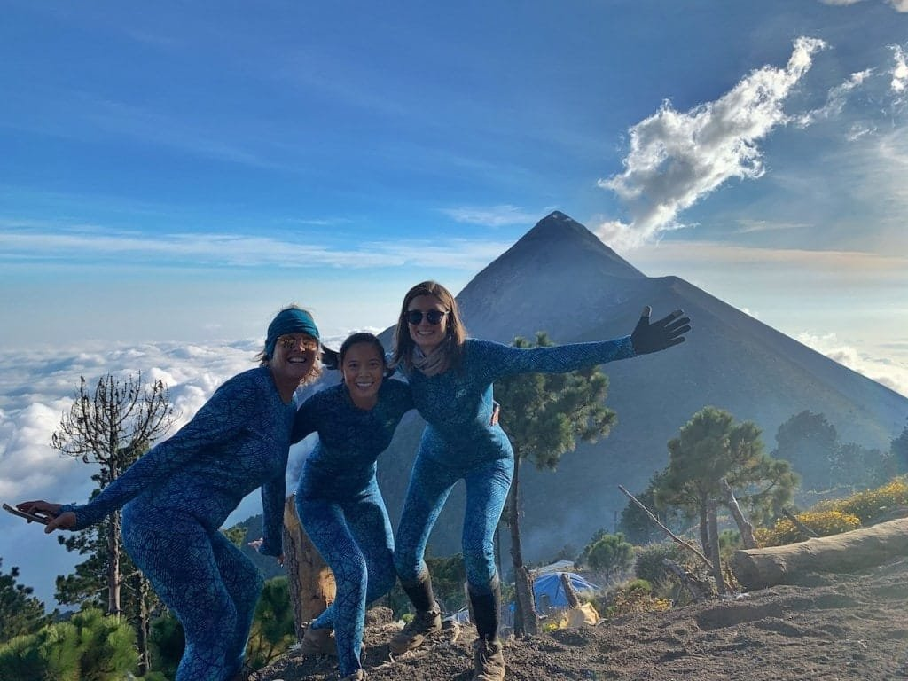
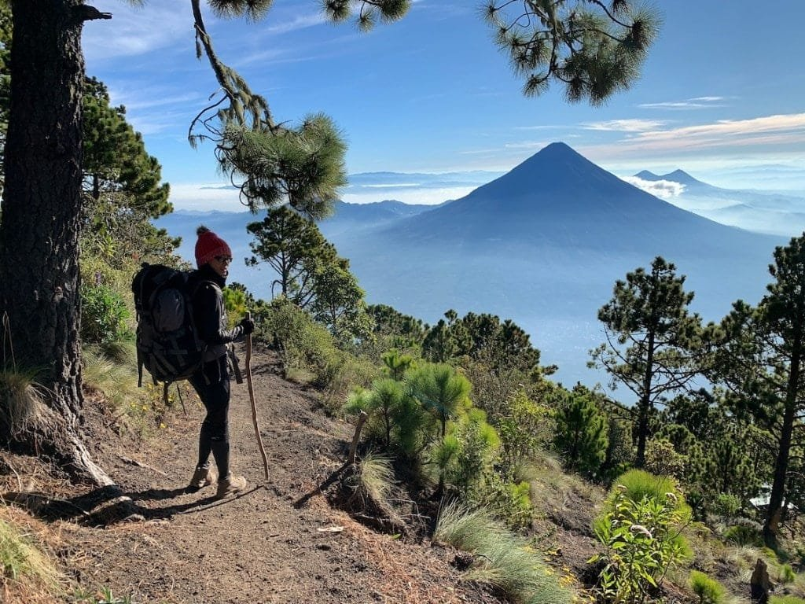
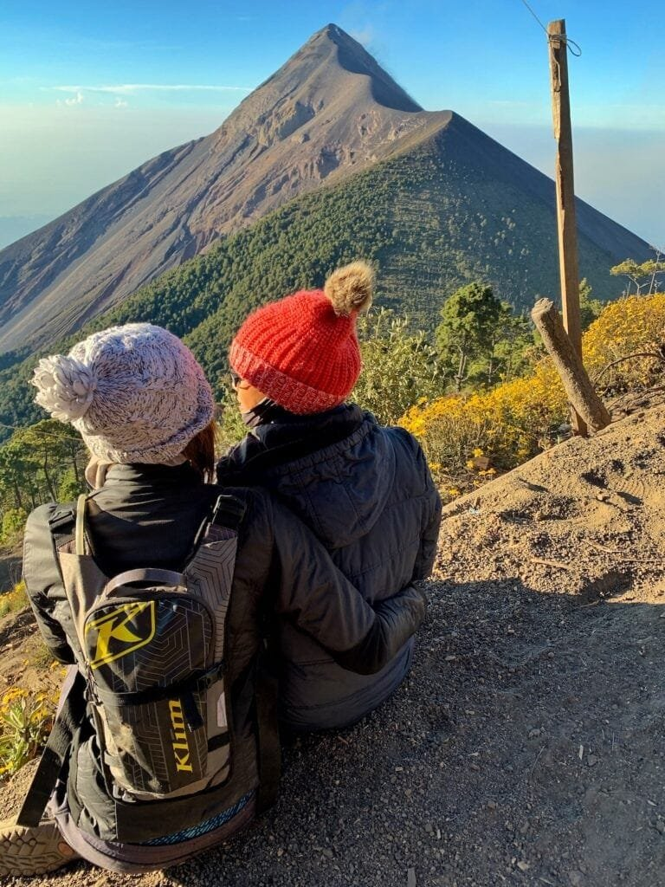
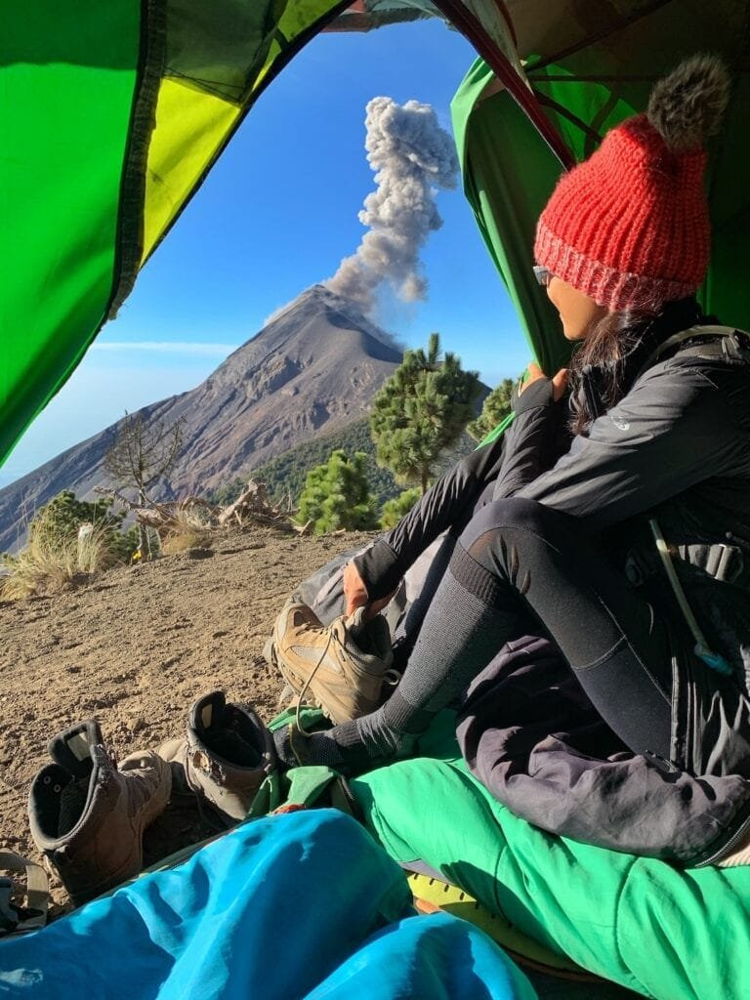
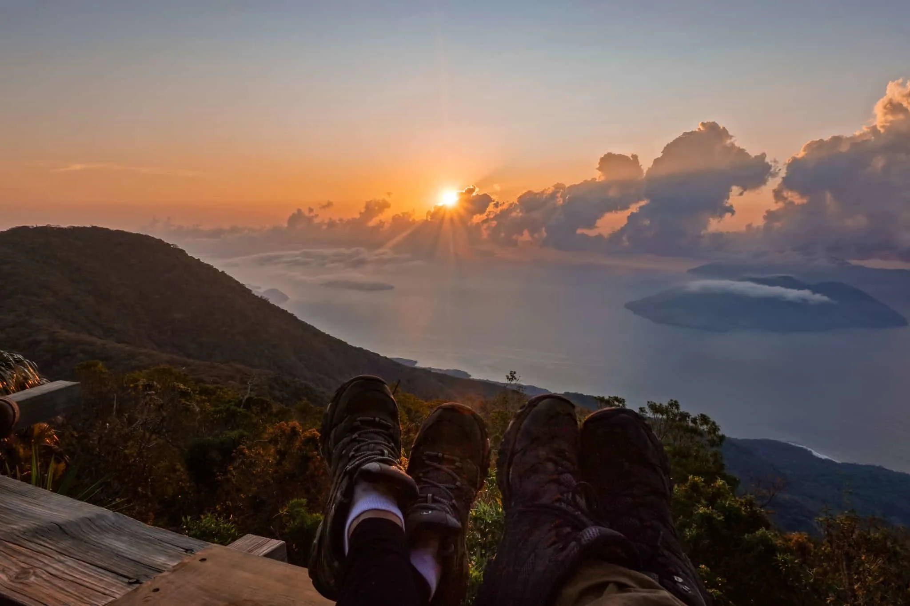

If you're an adventure seeker looking for a thrilling and unique experience, then volcano hiking and camping might just be the perfect activity for you. Imagine standing at the edge of a crater, witnessing the raw power and beauty of molten lava flowing down the mountainside. Or spending the night under a starry sky, surrounded by the otherworldly landscape created by volcanic eruptions. In this ultimate guide, we will delve into the fascinating world of volcanoes, exploring their different types, eruption patterns, and geographic distribution. We will also discuss the benefits and hazards associated with volcanic activity, providing you with the knowledge you need to safely explore and appreciate these remarkable natural wonders. So grab your hiking boots and get ready for an unforgettable adventure into the heart of the Earth.

This image is property of i0.wp.com.

## Understanding Different Types of Volcanoes

Volcanoes come in various types, each with its own unique characteristics and eruption styles. The four common [types of volcanoes are stratovolcanoes](https://magmamatters.com/understanding-volcanic-formation-a-comprehensive-guide/ "Understanding Volcanic Formation: A Comprehensive Guide"), shield volcanoes, cinder cones, and lava domes.

### Stratovolcanoes

Stratovolcanoes, also known as composite volcanoes, are steep, symmetrical cones with layers of lava, volcanic ash, and pyroclastic materials. These volcanoes are characterized by explosive eruptions due to their high viscosity magma, which traps gases. Famous examples include Mount Vesuvius in Italy and Mount St. Helens in the United States.

### Shield Volcanoes

Shield volcanoes, like those found in Hawaii, have a broad, gently sloping shape resembling a warrior's shield. They are formed by the eruption of low viscosity lava that flows easily across the surface, resulting in gradual, non-explosive eruptions. Shield volcanoes are typically large and can reach enormous sizes. Mauna Loa in Hawaii is the world's largest shield volcano.

### Cinder Cones

Cinder cones are the simplest type of volcano, consisting of a steep conical hill formed by the accumulation of loose volcanic debris called cinders or scoria. These volcanoes have short eruption durations and often occur in groups. They are characterized by explosive eruptions that eject mostly solid particles. The Paricutin volcano in Mexico is a notable example of a cinder cone.

### Lava Domes

Lava domes are formed by the slow extrusion of highly viscous lava, which piles up over a volcanic vent. These structures are characterized by their bulbous, dome-like shape. Lava domes can be quite unstable and prone to collapse, leading to pyroclastic flows. The Soufriere Hills volcano in Montserrat showcases the destructive potential of lava dome eruptions.

Understanding the different types of volcanoes is crucial in predicting their behavior and potential hazards.

## Geographic Distribution of Volcanoes

Volcanoes are not randomly scattered across the globe but instead tend to concentrate in specific regions. The most active volcanoes are found in areas such as the Ring of Fire, Hawaii, and other volcanic hotspots.

### The Ring of Fire

The Ring of Fire is a major area in the basin of the Pacific Ocean where a large number of earthquakes and volcanic eruptions occur. It is a direct result of plate tectonics and the movement of several tectonic plates. This region stretches from the west coast of the Americas to the east coast of Asia, passing through the Pacific islands. The Ring of Fire is home to many of the world's most active volcanoes, including Mount Fuji in Japan and Mount Rainier in the United States.

### Hawaii

Hawaii is famous for its shield volcanoes, which are formed by hotspots deep beneath the Earth's surface. A hotspot is an area of high volcanic activity caused by a plume of hot material rising from deep within the mantle. The Hawaiian Islands were formed by a hotspot, with each island representing a different stage in the volcanic activity. The Big Island of Hawaii is home to some of the world's most active volcanoes, such as Kilauea and Mauna Loa.

### Other Volcanic Hotspots

In addition to the Ring of Fire and Hawaii, there are other volcanic hotspots around the world. These hotspots are areas where mantle plumes have caused volcanic activity to occur on the Earth's surface. Examples include the Yellowstone hotspot in the United States, which has given rise to the famous Yellowstone National Park, and the Afar Triangle in East Africa, which is believed to be the location of the next continental rift.

Understanding the geographic distribution of volcanoes helps us understand the underlying geological processes that create these magnificent and sometimes destructive features.

This image is property of i0.wp.com.

## Recognizing the Signs of a Volcano's Activity

Volcanoes can display various signs of activity that indicate when an eruption may be imminent. It is essential to be aware of these signs to ensure the safety of those living near or exploring volcanic areas.

### Ground Deformation

One common sign of volcanic activity is ground deformation. As magma rises beneath the surface, it can cause the ground to bulge or swell. This deformation can be detected using GPS measurements and other monitoring techniques. Monitoring these changes in the shape of the land helps scientists track the movement of magma and predict potential eruptions.

### Gas Emissions

Volcanoes release various gases, including water vapor, [carbon dioxide](https://magmamatters.com/the-art-and-science-of-volcano-monitoring/ "The Art and Science of Volcano Monitoring"), sulfur dioxide, and hydrogen sulfide. Monitoring the composition and quantity of these gases can provide valuable information about the state of a volcano. Changes in gas emissions can indicate an increase in volcanic activity and the potential for an imminent eruption. Gas monitoring stations are often set up around active volcanoes to measure and analyze these emissions.

### Monitoring Equipment

Scientists use a range of specialized equipment to monitor volcanoes and predict eruptions. Seismometers measure the vibrations in the Earth's crust caused by volcanic activity, helping to identify and locate volcanic earthquakes. Infrasound sensors detect low-frequency sound waves produced by volcanic eruptions. Thermal cameras monitor changes in temperature near the volcano's vent, which can signal the movement of magma. These and other monitoring techniques provide valuable data for volcano research and eruption forecasting.

### Staying Informed

To ensure your safety while exploring volcanic areas, it is essential to stay updated on the current activity of volcanoes. Local monitoring agencies and volcano observatories regularly release information about volcanic activity and potential hazards. You can access this information through their websites, social media channels, or mobile apps. Additionally, it is a good idea to check the weather conditions before embarking on any volcano-related activities, as visibility and other factors can greatly affect safety.

By understanding the signs of volcanic activity and staying informed, you can make educated decisions when visiting or living near volcanoes.

## Necessary Gear and Equipment for Volcano Hiking

Volcano hiking requires specific gear and equipment to ensure your safety, comfort, and enjoyment during your expedition. Here are some essential items to consider packing before heading out on a volcano adventure.

### Essential Hiking Gear

Comfortable hiking boots are crucial for traversing the uneven and rugged volcanic terrain. Look for boots that provide ankle support and have a durable, non-slip sole. Additionally, wearing moisture-wicking socks will help keep your feet dry and prevent blisters.

Protective clothing is essential to shield yourself from the elements and potential hazards. Dress in layers, as weather conditions on volcanoes can vary greatly. A lightweight, breathable base layer will help regulate body temperature, while a waterproof and windproof outer layer will protect against rain and strong winds. Don't forget a hat, sunglasses, and sunscreen to shield yourself from the sun's rays.

### Safety Equipment

When hiking near active volcanoes, it is important to carry safety equipment to protect against volcanic hazards. Masks or respirators can filter out harmful gases and particulate matter in the air. Goggles will shield your eyes from flying volcanic debris and ash particles, while gloves will protect your hands from sharp volcanic rocks.

### Climbing Tools

Depending on the terrain, climbing tools such as crampons, ice axes, and trekking poles may be necessary for navigating steep and slippery slopes. These tools provide additional stability and grip, especially on icy or loose volcanic surfaces.

Having the right gear and equipment will enhance your volcano hiking experience and ensure your safety and comfort throughout your journey.

This image is property of i1.wp.com.

## Planning Your Route

Before embarking on a volcano hiking adventure, it is crucial to plan your route carefully to ensure your safety and enjoyment. Here are some factors to consider when planning your hiking route.

### Research Safe Hiking Routes

Research safe hiking routes on active or dormant volcanoes to avoid potential hazards. Check with local authorities, national park websites, or experienced guides to identify established trails that are suitable for hikers. Take note of any specific regulations or restrictions that may be in place, such as trail closures or limited access.

### Importance of Guides and Local Knowledge

Engaging the services of a knowledgeable guide can greatly enhance your volcano hiking experience. Guides are familiar with the terrain, weather conditions, and potential hazards, and can provide valuable insights and interpretive information about the volcano you are exploring. Their expertise ensures your safety and helps you make the most of your adventure.

### Assessing Difficulty and Accessibility

Consider the difficulty level and accessibility of your chosen hiking route. Volcanoes present diverse challenges, ranging from moderate to difficult terrain. Evaluate your hiking abilities and fitness level to choose a route that suits your capabilities. Some routes may require technical skills or experience with mountaineering, so be sure to assess the route's requirements before setting out.

By thoroughly researching and planning your route, you can have a safe and enjoyable volcano hiking experience.

## Camping Near Volcanoes

For those seeking an immersive volcano experience, camping near a volcano allows you to truly connect with the raw power of nature. However, it is essential to camp in a safe location and be prepared for the unique conditions that come with volcano environments.

### Selecting a Safe Camping Spot

When camping near a volcano, it is crucial to choose a safe location that minimizes the risk of volcanic hazards. Avoid camping in valleys or near streambeds, as these areas can be prone to lahars (mudflows) during volcanic eruptions. Look for high ground away from potential lava flow paths and pyroclastic flow channels. Additionally, be mindful of any warning signs or advisories issued by local authorities, which may indicate areas to avoid for camping.

### Preparing for Weather Conditions

Volcano campsites can be exposed to a range of weather conditions, including strong winds, heavy rain, and extreme temperatures. Make sure to bring appropriate gear to protect yourself from these elements. A sturdy tent that can withstand high winds and heavy rain is essential. Pack warm clothing for chilly nights and layering options for changing weather. Stay informed about weather forecasts when planning your camping trip, and be prepared to adjust your plans if necessary.

### Essential Camping Gear

In addition to the standard camping gear such as a tent, sleeping bag, and cooking supplies, there are a few items specific to volcano environments that you should consider bringing. A headlamp or flashlight is crucial for navigating in the dark, especially if you plan on exploring the volcano during sunrise or sunset. A reliable water filtration system or purification tablets will ensure a safe drinking water supply, as potable water may not always be readily available near volcanoes. Finally, don't forget to pack a sturdy backpack to carry your essentials while hiking and exploring the volcano.

Camping near a volcano can provide a unique and awe-inspiring experience, but it is essential to prioritize safety and be prepared for the challenges that come with it.

This image is property of i2.wp.com.

## Safety Precautions for Volcano Hiking and Camping

While volcano hiking and camping can be exciting and rewarding experiences, it is crucial to prioritize safety and take necessary precautions to mitigate potential risks. Here are some essential safety tips to keep in mind.

### Identifying and Avoiding Risk Areas

Familiarize yourself with the potential hazards associated with the volcano you plan to hike or camp near. Some areas may be prone to landslides, rockfalls, or lahars during volcanic activity. Stay informed about any recent volcanic activity reports and pay attention to warning signs or advisories issued by local authorities. Avoid venturing into restricted or dangerous zones, and always follow the guidance of experienced guides or park rangers.

### Proper Hydration and Nutrition

Volcano hiking and camping can be physically demanding activities, so it is vital to stay hydrated and properly nourished. Carry an adequate supply of water and electrolyte-rich beverages to replenish lost fluids. Pack lightweight and nutrient-rich snacks that provide sustained energy throughout your hiking or camping trip. Listen to your body, take regular breaks, and consume enough calories to avoid fatigue and dehydration.

### Emergency Procedures and Evacuation Plans

Be familiar with the emergency procedures and evacuation plans in place for the volcano you are exploring. Take the time to understand the designated evacuation routes and assembly points. Carry a fully charged mobile phone or satellite communication device for emergencies, and make sure to have a first aid kit readily available. Inform a trusted individual about your itinerary and estimated return time, so they can raise the alarm if necessary.

By following these safety precautions, you can minimize the risks associated with volcano hiking and camping and ensure a safe and enjoyable experience.

## Impact of Volcano Activity on the Surrounding Environment

Volcanic eruptions have both immediate and long-term effects on the surrounding environment. These impacts can range from devastating to beneficial, shaping the landscapes and ecosystems in unique ways.

### Effects on Climate and Local Environment

Volcanic eruptions release large quantities of gases, ash, and aerosols into the atmosphere. This volcanic material can have significant effects on the climate, leading to short-term cooling due to the reflection of sunlight and the formation of sulfuric acid aerosols. Depending on the magnitude of the eruption, these climatic impacts can persist for months or even years. Volcanic ash, when deposited on land, can enrich the soil and provide essential nutrients for plant growth. However, ash can also smother vegetation and cause respiratory problems for humans and animals.

### Risk of Volcanic Emissions to Human Health

Volcanic emissions, such as sulfur dioxide and ash particles, can pose risks to human health. Breathing in high concentrations of volcanic gases can result in respiratory problems, eye irritation, and other health issues. Fine ash particles can cause respiratory distress and damage to the lungs if inhaled. Physical contact with volcanic ash or gases can also irritate the skin and eyes. It is essential to follow safety guidelines and heed evacuation warnings during volcanic eruptions to protect yourself from these hazards.

### Beneficial Aspects of Volcanoes

Despite the potential dangers, volcanoes play a vital role in shaping the Earth's landscapes and supporting ecosystems. Volcanic eruptions enrich the soil with essential minerals and nutrients, making the land fertile for agriculture and plant growth. Volcanic islands are often home to unique and diverse ecosystems, including endemic species found nowhere else on Earth. These volcanic islands also contribute to the biodiversity of the oceans, providing habitats for a wide range of marine life.

Understanding the impact of volcanoes on the environment helps us appreciate their role in the natural world while also recognizing the risks they can pose.

This image is property of travelmademedoit.com.

## Experiencing the Unique Aspects of Volcano Hiking

[Volcano hiking](https://magmamatters.com/geothermal-energy-and-its-volcanic-origins/ "Geothermal Energy and Its Volcanic Origins") offers the opportunity to witness the raw power and beauty of these geological wonders. Here are some unique experiences you can have while exploring volcanoes.

### Watching Live Lava Flows and Volcano Eruptions

Witnessing a live lava flow or volcano eruption is a truly awe-inspiring experience. The glowing, molten lava flowing down the volcano's slopes or the explosive eruption of ash and steam are unforgettable sights. However, it is crucial to prioritize safety when observing volcanic activity. Keep a safe distance and follow any guidelines or restrictions in place. Experienced guides can help lead you to vantage points that offer spectacular views while ensuring your safety.

### Stunning Views from Volcano Peaks

Climbing to the summit of a volcano rewards you with panoramic views of the surrounding landscape. From the top, you can see the vast expanse of the volcano's crater, the sprawling lava fields, and the distant horizons. The unique topography and geological formations create a visually captivating scene that can only be experienced by reaching the peak.

### Potential Wildlife Encounters in Volcano Regions

Volcanic regions often support unique ecosystems that are home to extraordinary wildlife. From rare plant species that thrive in volcanic soils to birds and insects adapted to the harsh conditions, exploring these environments can provide opportunities to encounter fascinating wildlife. Keep a respectful distance from animals, avoid disturbing their habitats, and make sure to adhere to any guidelines about wildlife interaction.

Experiencing these unique aspects of [volcano hiking](https://magmamatters.com/the-environmental-impact-of-volcanic-eruptions-2/ "The Environmental Impact of Volcanic Eruptions") allows you to connect with the power of nature and gain a deeper appreciation for the Earth's geological processes.

## Ethics of Volcano Hiking and Camping

While volcano hiking and camping offer incredible experiences, it is crucial to approach these activities with a mindset of respect for nature and the local communities. Here are some ethical considerations to keep in mind.

### Importance of Respecting Nature and Avoiding Disturbance

When exploring volcanic areas, it is crucial to minimize your impact on the environment. Stay on designated trails to avoid damaging delicate vegetation or disrupting wildlife habitats. Avoid picking or damaging rocks, minerals, or artifacts, as these serve as important geological records. Dispose of waste properly and leave no trace of your visit.

### Understanding Local Community Sentiments toward Volcano Tourism

Volcanoes hold cultural significance for many communities living near them. It is important to respect the local traditions, beliefs, and customs associated with volcanoes. Engage with local communities in a respectful and culturally sensitive manner. Support local businesses and tourism initiatives to contribute positively to the local economy.

### Remaining Mindful of Conservation While Exploring

Conservation efforts play a crucial role in protecting and preserving volcanic areas. Stay informed about the conservation initiatives in the region you are visiting and adhere to any guidelines or regulations in place. Consider supporting organizations or projects dedicated to volcano conservation and research. By being responsible and mindful travelers, we can ensure that future generations can also experience the beauty and wonder of volcanoes.

By embracing these ethical considerations, we can foster a sustainable approach to volcano hiking and camping, leaving a positive impact on both the natural environment and the local communities.

