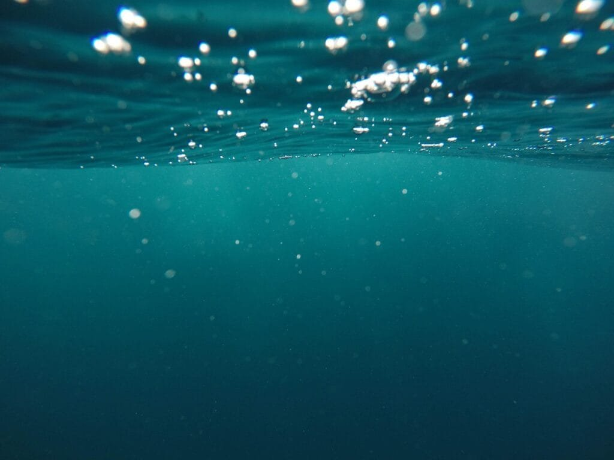
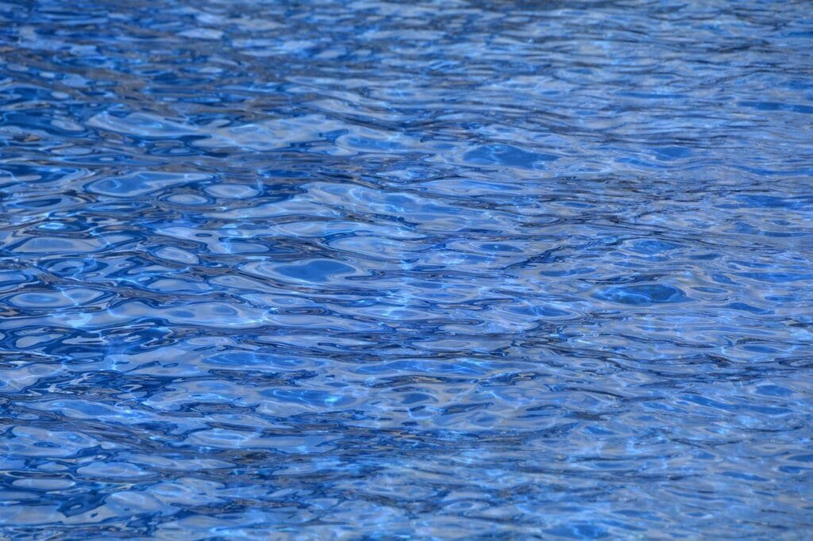

If you've ever wondered how underwater volcanoes form, look no further. This article will take you through the three key steps in their formation. Volcanoes are created when molten rock, gas, and debris rise to the Earth's surface, triggering explosive eruptions of lava and ash. Understanding the process of underwater volcano formation is important not only for scientific curiosity but also for predicting future volcanic activity and minimizing risks to surrounding communities. So, let's dive into the fascinating world of underwater volcanoes and discover the three steps that lead to their creation.

<iframe width="560" height="315" src="https://www.youtube.com/embed/hoJHvYm2mXY" frameborder="0" allow="accelerometer; autoplay; encrypted-media; gyroscope; picture-in-picture" allowfullscreen></iframe>

  

## Understanding the Basics of Volcanoes

### Defining a volcano

A volcano is a geological landform that is formed when molten rock, known as magma, rises to the surface of the Earth. This magma, along with gases and debris, escapes through openings in the Earth's crust, resulting in volcanic eruptions. Volcanoes can take different forms and shapes, but they all share the common characteristic of being outlets for the Earth's internal heat and energy.

### Explaining the role of molten rock and gases

Molten rock, or magma, plays a crucial role in the formation and eruption of volcanoes. Magma is formed deep within the Earth's mantle, where intense heat and pressure cause rocks to melt. As the magma rises to the surface, it carries with it gases, such as water vapor, carbon dioxide, and sulfur dioxide. These gases contribute to the explosive nature of volcanic eruptions by creating pressure within the volcano.

### Understanding how a volcano erupts

The eruption of a volcano occurs when the pressure from the accumulated magma and gases becomes too great to be contained within the volcano. The magma is expelled through the volcano's vent, often accompanied by ash, gas, and volcanic debris. The type of eruption can vary depending on factors such as the viscosity of the magma, the presence of gases, and the shape of the volcano. Eruptions can range from gentle flows of lava to explosive eruptions that send ash and pyroclastic material high into the atmosphere.

## Plates Tectonics and Volcanoes

### The relationship between tectonic plates and volcanoes

Volcanoes are closely linked to the movements of the Earth's tectonic plates. The Earth's surface is divided into several large and small plates that are constantly moving. At plate boundaries, where two plates meet, there is a higher likelihood of volcanic activity. There are three main types of plate boundaries: convergent, divergent, and transform. Each type of plate boundary can contribute to the formation of volcanoes in different ways.

### Discussing the 'Ring of Fire' and its significance

The 'Ring of Fire' is a major area in the basin of the Pacific Ocean where a large number of earthquakes and volcanic eruptions occur. This area is highly significant in terms of volcanic activity because it represents a major fault line where several tectonic plates converge. As a result, the 'Ring of Fire' is home to a significant number of active volcanoes, making it one of the most volcanically active regions in the world.

### Exploring other regions prone to volcanic activity

While the 'Ring of Fire' is the most well-known region for volcanic activity, there are other areas around the world that are prone to volcanoes. These regions include the Mediterranean and Aegean region, where the Eurasian and African plates converge, as well as the East African Rift, where the African plate is splitting apart. Additionally, hotspot volcanism, such as the volcanoes of Hawaii, occurs in areas where plumes of hot material rise from deep within the mantle.

This image is property of pixabay.com.

## Types of Volcanoes

### Introduction to different types of volcanoes

Volcanoes can be classified into different types based on their shape, composition, and eruption style. The three main types of volcanoes are shield volcanoes, composite or stratovolcanoes, and [cinder cone](https://magmamatters.com/the-birth-of-new-land-understanding-cinder-cones/) volcanoes. Each type has unique characteristics and eruption patterns.

### Focus on shield volcanoes

Shield volcanoes are characterized by their broad, gently sloping sides and low eruption intensity. They are typically formed by the eruption of highly fluid lava, which spreads out in thin layers, creating a shield-like shape. Shield volcanoes are commonly found in areas with hotspot activity, such as the Hawaiian Islands. These volcanoes have a relatively low risk of explosive eruptions and are known for their spectacular lava flows.

### Highlighting the key features of underwater volcanoes

Underwater volcanoes, also known as submarine volcanoes, are another type of volcanic landform that exists beneath the surface of the ocean. These volcanoes exhibit similar characteristics to their terrestrial counterparts but are adapted to the unique environment of the underwater realm. Underwater volcanoes can form seamounts, volcanic islands, or even hydrothermal vent systems, which release heated fluids and minerals into the surrounding water.

## Underwater Volcanoes

### Difference between land and underwater volcanoes

The main difference between land volcanoes and underwater volcanoes is their location. Land volcanoes are found on the Earth's surface, while underwater volcanoes are located beneath the ocean's surface. Underwater volcanoes can be more challenging to study and observe due to the difficulties in accessing these remote underwater environments.

### Exploration of the natural environment of undersea volcanoes

Despite the challenges, scientists have made significant progress in exploring the natural environment of underwater volcanoes. They use various tools and technologies, such as submersibles and remote-operated vehicles (ROVs), to study these volcanoes and their surrounding ecosystems. By mapping the topography, collecting samples, and monitoring volcanic activities, researchers can gain valuable insights into the geological processes and life forms associated with underwater volcanoes.

This image is property of pixabay.com.

## Primary Stage: Seafloor Spreading

### Explanation of seafloor spreading

Seafloor spreading is a fundamental process in plate tectonics that occurs at divergent plate boundaries. It involves the creation of new oceanic crust as two tectonic plates move apart. As the plates separate, magma from the mantle rises to fill the gap, solidifies, and forms new oceanic crust. This continuous process of seafloor spreading contributes to the formation of underwater volcanoes.

### Understanding oceanic crust and mantle materials

Oceanic crust is the portion of the Earth's solid surface that underlies the ocean basins. It is mainly composed of basalt, a type of volcanic rock, which is rich in minerals such as iron and magnesium. The mantle, on the other hand, is the layer between the Earth's crust and core and consists of solid but flowing material. The interaction between the mantle and oceanic crust is crucial for the formation of magma and the subsequent rise of it towards the surface.

### Role of seafloor spreading in volcano formation

Seafloor spreading plays a significant role in the formation of underwater volcanoes. As the tectonic plates move apart, the pressure release allows magma to rise from the mantle and fill the gap between the plates. This upward movement of magma leads to volcanic eruptions, resulting in the creation of new underwater volcanic landforms. Over time, repeated eruptions and the accumulation of lava and volcanic debris contribute to the growth and development of underwater volcanoes.

## Secondary Stage: Magma Formation and Rise

### Understanding the concept of magma

Magma is a molten mixture of rock-forming substances, such as silica, iron, and magnesium, along with dissolved gases. It forms beneath the Earth's surface when the temperature and pressure conditions allow the rocks to melt. Magma has different compositions, ranging from basaltic, which is low in silica and more fluid, to felsic, which is high in silica and more viscous.

### Explanation of the pressure and heat needed for magma formation

The formation of magma requires specific pressure and heat conditions. As the mantle material rises towards the Earth's surface during seafloor spreading, the decrease in pressure allows the rocks to melt and form magma. Additionally, the heat from the Earth's internal energy contributes to the increase in temperature, promoting the melting of rocks and the formation of magma.

### Discussing magma chambers and conduits

Magma chambers are underground reservoirs or chambers that store magma beneath the Earth's surface. These chambers can be located deep within the crust or closer to the surface, depending on the specific volcanic system. Conduits, on the other hand, are pathways that allow magma to travel from the magma chamber to the surface. These conduits are often lined with solidified magma, known as volcanic pipes, which can be visible in the form of volcanic vents or craters.

This image is property of pixabay.com.

## Tertiary Stage: Volcanic Eruption

### Understanding the build-up to a volcanic eruption

Before a volcanic eruption occurs, there are several signs and processes that can indicate an imminent event. These include [increased seismic activity](https://magmamatters.com/the-art-and-science-of-volcano-monitoring/ "The Art and Science of Volcano Monitoring"), ground deformation, gas emissions, and changes in volcanic activity patterns. Monitoring these indicators can provide valuable information about the build-up of magma and the potential for an eruption.

### Outlining the eruption process of underwater volcanoes

The eruption process of underwater volcanoes is similar to that of land volcanoes. As the magma rises through the conduit and reaches the surface, it encounters the immense pressure of the overlying water column. This pressure can influence the eruption style, causing explosive reactions and the fragmentation of lava into smaller particles. These fragmented particles, along with volcanic gases and ash, are then released into the surrounding water, creating an underwater volcanic eruption.

### Discussing the effect of water pressure on underwater eruptions

Water pressure plays a significant role in underwater volcanic eruptions. The pressure exerted by the overlying water column can inhibit the expansion of gases within the magma, leading to explosive eruptions. The water also cools the magma more rapidly, solidifying it into volcanic glass or fragmented material known as tephra. Additionally, the water can disperse the volcanic products over a wider area, creating unique underwater volcanic landscapes and affecting marine ecosystems.

## Post Eruption: Formation of New Oceanic Crust

### Explaining what happens post eruption

After a volcanic eruption, the volcano enters a period of rest and inactivity, allowing the volcanic products to cool and solidify. The cooled lava and volcanic debris accumulate around the volcanic vent, forming new landforms. Over time, these accumulations can contribute to the growth of islands or seamounts, as well as the creation of new oceanic crust.

### Understanding how new oceanic crust is formed from cooled lava

As the lava cools and solidifies, it forms solid rock known as basalt. This basaltic rock accumulates around the volcanic vent and on the seafloor, layer by layer, over multiple eruptions. The successive layers of basalt build up and solidify, eventually forming new oceanic crust. This process is essential for seafloor spreading and the continuous renewal of the Earth's surface.

### Discussing the impact on ocean topography

The formation of new oceanic crust has a significant impact on the topography of the ocean floor. The accumulation of lava and volcanic debris can create underwater mountain chains, known as mid-ocean ridges, where seafloor spreading occurs. These ridges can extend for thousands of kilometers and play a crucial role in shaping the Earth's oceans. Additionally, the volcanic islands and seamounts formed from underwater volcanoes can create unique habitats for marine life and contribute to biodiversity.

## Hazards and Benefits of Underwater Volcanic Eruptions

### Outlining potential hazards of underwater volcanic eruptions

Underwater volcanic eruptions can pose various hazards to both marine life and human activities. These hazards include the release of toxic gases, the generation of tsunamis or tidal waves, the alteration of water chemistry, and the potential disruption of underwater ecosystems. Additionally, the accumulation of volcanic debris and sediments can impact marine navigation and infrastructure, such as underwater cables and pipelines.

### Discussing potential benefits of these eruptions

While underwater volcanic eruptions present risks, they also bring about certain benefits. These eruptions can release essential nutrients into the surrounding water, promoting the growth of plankton and other marine organisms. These organisms, in turn, support larger marine species and contribute to healthy ecosystems. Furthermore, the creation of new landforms through volcanic activity can result in the formation of unique habitats for marine life and offer opportunities for scientific research and exploration.

### Highlighting the importance of studying underwater volcanoes

Studying underwater volcanoes is of great importance for several reasons. Understanding the processes and dynamics of these volcanoes can help scientists and researchers better predict volcanic activity, assess associated hazards, and develop strategies for mitigating risks to coastal communities. Additionally, studying underwater volcanic ecosystems can provide valuable insights into the adaptation and resilience of marine life under extreme environmental conditions. Furthermore, the exploration of underwater volcanic environments can contribute to our knowledge of Earth's geology and the geological processes that shape our planet.

## Studying and Predicting Underwater Volcanic Activity

### The role of technology in studying underwater volcanoes

Technology has played a crucial role in advancing our understanding of [underwater volcanoes](https://magmamatters.com/geothermal-energy-and-its-volcanic-origins/ "Geothermal Energy and Its Volcanic Origins"). Instruments such as seismometers, hydrophones, and remotely-operated vehicles (ROVs) have allowed scientists to monitor and observe underwater volcanic activity in real-time. Sonar systems and bathymetric mapping have significantly improved our ability to map the seafloor and identify underwater volcanic structures. These technological advancements continue to contribute to our knowledge of underwater volcanism and aid in the prediction of future volcanic activity.

### Methods of predicting underwater volcanic activity

Predicting underwater volcanic activity remains a complex task due to the challenges of studying and monitoring these environments. However, scientists utilize multiple methods to assess the potential for eruptions, including the monitoring of seismic activity, gas emissions, ground deformation, and changes in temperature. By combining data from various sources and employing advanced analytical techniques, researchers can develop models and forecasts to predict the likelihood and intensity of underwater volcanic eruptions.

### Importance of understanding volcanoes for mitigating risks

Understanding the behavior of volcanoes, both on land and underwater, is crucial for mitigating risks and minimizing the impact of volcanic eruptions on nearby communities and ecosystems. By studying their various stages, eruption patterns, and associated hazards, scientists can develop strategies for early warning systems, evacuation plans, and land-use policies. Additionally, this knowledge can inform decision-making regarding infrastructure development in volcanic regions, ensuring the safety and resilience of nearby populations.

In conclusion, understanding the basics of volcanoes is crucial for comprehending the formation and dynamics of underwater volcanoes. The relationship between tectonic plates and volcanoes, as well as the significance of regions like the 'Ring of Fire,' helps to explain the distribution of volcanoes around the world. By exploring different types of volcanoes and the unique characteristics of underwater volcanic eruptions, we can gain valuable insights into the Earth's geological processes and the impact of these eruptions on the ocean environment. Studying and predicting underwater volcanic activity is imperative for mitigating the risks associated with volcanic eruptions and ensuring the safety of coastal communities.

