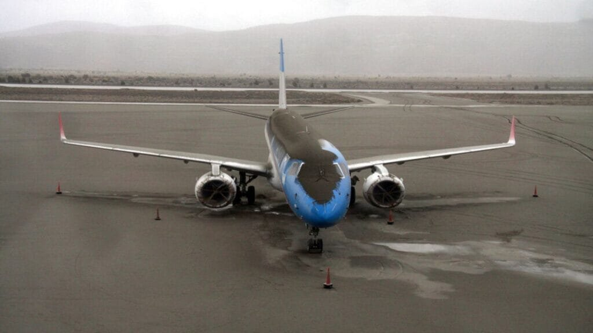
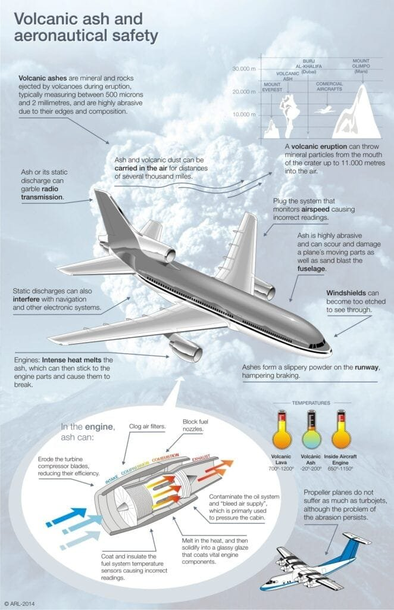
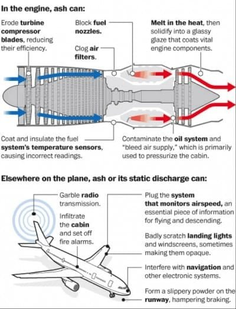
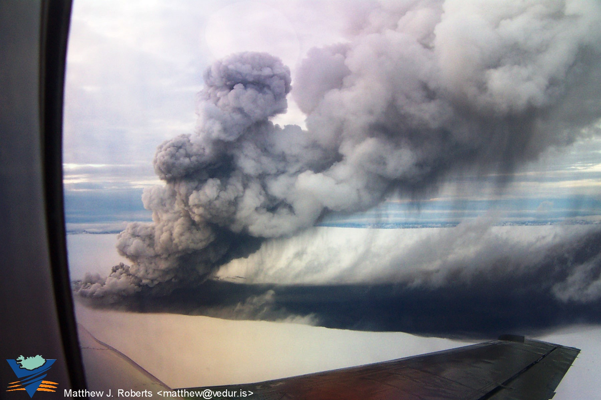
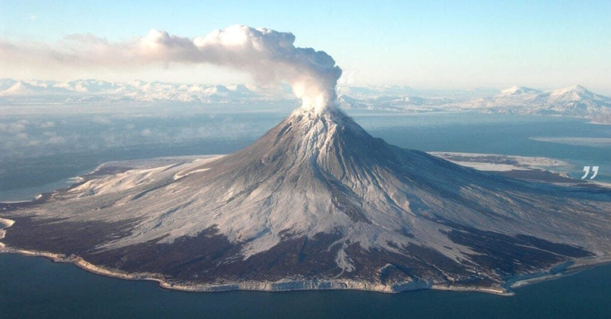

Flying during volcanic ash emergencies can be challenging and potentially dangerous. It is important to be informed and prepared in order to ensure your safety and the smooth functioning of flights. Volcanoes can release ash clouds into the atmosphere, which can pose serious risks to aircraft. In this article, we will provide you with essential tips on international flight rules during volcanic ash emergencies. By following these guidelines, you can navigate air travel during such situations with confidence and peace of mind.

This image is property of static.euronews.com.

## Understanding the Risks of Volcanic Ash to Aviation

### How volcanic ash affects aircraft functionality

Volcanic ash poses a significant risk to aviation due to its composition and properties. When volcanic eruptions occur, the ash plumes expelled can rise high into the atmosphere and be carried by air currents for long distances. Aircraft flying through these ash clouds can experience several issues.

Firstly, volcanic ash is made up of fine particles that are highly abrasive. These particles can cause damage to the aircraft's exterior surfaces, including the windshield, engines, and wings. The ash can erode various components, leading to reduced visibility, loss of engine power, and even structural damage.

Secondly, the high temperature of volcanic ash can pose a threat to aircraft engines. The ash can melt and fuse inside the engines, blocking air passages and potentially causing the engines to fail. This is known as volcanic ash ingestion and can be catastrophic if not addressed promptly.

### Risks to human health aboard flights during volcanic eruptions

In addition to the risks posed to aircraft functionality, volcanic ash can also pose [health](https://magmamatters.com/the-environmental-impact-of-volcanic-eruptions-2/ "The Environmental Impact of Volcanic Eruptions") risks to passengers and crew members aboard flights during volcanic eruptions. The fine particles of ash can irritate the respiratory system and, in some cases, cause respiratory distress. Prolonged exposure to volcanic ash can lead to lung diseases and other serious health conditions.

It is essential for airlines and passengers to be aware of the potential health risks and take necessary precautions during flights in volcanic ash-affected areas. This includes providing passengers with adequate respiratory protection and ensuring proper air filtration systems are in place on the aircraft.

## Monitoring Volcano Activity Before Flying

### Sources for real-time updates on volcano activity

Before embarking on a flight, it is crucial to stay informed about the current volcanic activity in the areas along your flight route. There are several reliable sources that provide real-time updates on volcano activity.

[Volcano observatories and monitoring](https://magmamatters.com/the-art-and-science-of-volcano-monitoring/ "The Art and Science of Volcano Monitoring") agencies, such as the United States Geological Survey (USGS), the International Volcanic Ash Advisory Centers (VAACs), and the Japan Meteorological Agency (JMA), regularly publish volcano bulletins and advisories. These sources offer detailed information about ongoing eruptions, ash dispersal forecasts, and any potential impact on aviation.

Additionally, many smartphone applications and websites provide volcano monitoring services. These platforms use data from reliable sources to provide users with up-to-date information on volcano activity, making it easier for travelers to assess the risks associated with their flight plans.

### Understanding aviation reports on volcanic activity

Aviation reports play a crucial role in providing accurate and timely information regarding volcanic eruptions and ash dispersal. The Volcanic Ash Advisory Center (VAAC) issues Volcanic Ash Advisories (VAAs) that contain critical information for pilots and airlines.

These reports include details such as the location of the volcanic ash cloud, its altitude, and the expected movement of the ash plume. They also provide information on the potential impact on air traffic, including the issuance of volcanic ash warnings and the recommendation of flight route deviations.

It is essential for both pilots and passengers to understand these reports and be able to interpret the information provided. This knowledge helps in making informed decisions regarding flight routes and potential risks.

### Assessing if your flight route is affected

Once you have access to real-time updates and aviation reports, you can assess if your flight route is affected by volcanic activity. Airlines closely monitor volcanic eruptions and their potential impact on flights, and they may adjust their routes accordingly.

Before your flight, check with your airline or travel agent to determine if there are any changes or disruptions to your planned route. Airlines have access to the latest information from meteorological and volcanic ash advisory centers, allowing them to make informed decisions about flight paths.

By staying informed and being proactive in checking for updates, you can ensure that you are aware of any potential disruptions caused by volcanic ash and make the necessary adjustments to your travel plans.

This image is property of aertecsolutions.com.

## Airline Policies in Volcanic Emergencies

### How airlines communicate about volcanic emergencies

During volcanic emergencies, airlines prioritize passenger safety and provide timely communication regarding any changes or disruptions to flights. Airlines have well-established protocols for communicating with passengers during such situations.

If there is a volcanic eruption or ash cloud affecting your flight, the airline will notify you through various channels, such as email, text messages, or phone calls. They will provide information about alternative flight options, including rescheduling, rebooking, or refunding options.

It is essential to keep your contact information up to date with the airline, ensuring that you receive timely notifications in case of any volcanic emergencies.

### Refund or re-booking policies

In the event of flight disruptions caused by volcanic emergencies, airlines generally offer options for refunds or rebooking. The specific policies may vary between airlines, so it is important to familiarize yourself with the terms and conditions provided by your airline.

Depending on the situation and the airline's policies, you may be eligible for a full refund of your ticket or the option to reschedule your flight without incurring any additional charges. Some airlines may also provide compensation for any additional expenses incurred due to the disruption.

It is advisable to contact your airline as soon as possible if your flight is affected by a volcanic emergency to understand the available options and to make necessary arrangements.

## Travel Insurance for Volcano-Related Flight Disruptions

### Coverage for flight cancellations or delays due to volcanic ash

When planning to travel during volcanic emergencies, it is recommended to have travel insurance that specifically covers flight cancellations or delays due to volcanic ash. This coverage can help protect you from financial losses in case your flight is disrupted.

Travel insurance policies vary in their coverage, so it is important to carefully review the terms and conditions before purchasing one. Look for policies that explicitly mention coverage for flight disruptions caused by volcanic ash, including flight cancellations, delays, and additional expenses.

Some insurance policies may also cover the costs of alternative transportation or accommodation during flight disruptions. Be sure to check the coverage limits and any deductible that may apply to ensure you have adequate protection.

### How to file a claim related to volcano disruptions

If your flight is canceled or delayed due to volcanic ash, you may need to file a claim with your travel insurance provider. Here are some steps to follow when filing a claim related to volcano disruptions:

1. Collect all relevant documents: Make sure to keep copies of your flight tickets, boarding passes, and any communication from the airline regarding the disruption.
    
2. Contact your travel insurance provider: Notify your insurance provider about the flight disruption and inquire about the claims process. They will provide you with the necessary forms and information to initiate your claim.
    
3. Complete the claim forms: Fill out the claim forms accurately and provide any supporting documentation required by your insurance provider. This may include proof of the flight cancellation or delay, receipts for additional expenses incurred, and any other relevant documents.
    
4. Submit the claim: Once you have completed the necessary forms and gathered all the required documents, submit your claim to the insurance provider. Ensure that you keep copies of all the submitted materials for your records.
    
5. Follow up on the claim: Stay in touch with the insurance provider and follow up on the progress of your claim. They may request additional information or documentation during the evaluation process.
    

By understanding the coverage provided by your travel insurance policy and following the proper steps when filing a claim, you can minimize the financial impact of flight disruptions caused by volcanic ash.

This image is property of volcanoes.usgs.gov.

## Emergency Preparedness for Flying During Volcanic Ash Emergencies

### Essential items to pack

When flying during volcanic ash emergencies, it is advisable to pack some essential items to ensure your comfort and safety. Here are some items to consider packing:

1. Disposable face masks: These masks can help protect you from inhaling volcanic ash particles and reduce the risk of respiratory issues.
    
2. Protective eyewear: To safeguard your eyes from ash particles, consider packing safety glasses or goggles.
    
3. Wet wipes: Ash particles can settle on surfaces inside the aircraft. Having wet wipes can help you clean and refresh yourself during the flight.
    
4. Extra medication: If you have any pre-existing respiratory conditions or allergies, ensure that you have an adequate supply of medication with you.
    
5. Non-perishable snacks: In case of flight delays or extended stays at airports, having non-perishable snacks can keep you nourished.
    
6. Drinking water: Staying hydrated is essential during travel, and having a water bottle with you is advisable, especially if you face any unexpected delays.
    
7. Spare clothes: In the event of a flight cancellation or an extended stay at an airport, having spare clothes can provide a sense of comfort and cleanliness.
    

By packing these essential items, you can better cope with any unexpected situations that may arise during your journey through volcanic ash-affected areas.

### Keeping emergency contact information accessible

During volcanic ash emergencies, it is crucial to keep emergency contact information easily accessible. Ensure that you have the following contact information readily available:

1. Airline contact: Have the customer service number of your airline saved on your phone or written down in case you need to reach them quickly.
    
2. Embassy or consulate contact: If you are traveling internationally, it is advisable to have the contact information of your country's embassy or consulate in the destination country. They can provide assistance and support if needed.
    
3. Travel insurance provider contact: Keep the contact information of your travel insurance provider accessible. They can provide guidance and support in case of any issues related to your coverage.
    

Having these contact details readily available can help you efficiently handle any unforeseen circumstances and ensure a smoother travel experience during volcanic ash emergencies.

## Health Precautions During Volcanic Ash Emergencies

### Protective gear for ash exposure

When flying during volcanic ash emergencies, it is essential to take necessary precautions to minimize your exposure to ash particles. Wearing appropriate protective gear can help safeguard your health. Here are some options to consider:

1. N95 respirator masks: These masks provide a high level of filtration and can effectively protect you from inhaling fine ash particles. Ensure that the mask fits properly and is worn correctly for optimal protection.
    
2. Safety glasses or goggles: Protect your eyes from ash particles by wearing safety glasses or goggles. This can prevent irritation and potential damage to your eyes.
    
3. Long-sleeved clothing and pants: Covering exposed skin with long-sleeved clothing and pants can minimize direct contact with volcanic ash.
    
4. Gloves: Wearing gloves can provide an additional layer of protection for your hands, preventing ash particles from coming into direct contact with your skin.
    

By using the appropriate protective gear, you can reduce the risks associated with ash exposure and protect your respiratory system and overall health.

### Health checks before flying amid volcanic ash

Before boarding a flight in areas affected by volcanic ash, it is advisable to prioritize your health and well-being. Consider the following health checks:

1. Assess your respiratory health: If you have pre-existing respiratory conditions, consult with your healthcare provider before flying in volcanic ash-affected areas. They can advise you on any necessary precautions or adjustments to your travel plans.
    
2. Stay informed about air quality: Monitor air quality information provided by local authorities or health agencies. If air quality is severely impacted by volcanic ash, it may be advisable to reconsider your travel plans.
    
3. Prioritize personal hygiene: Wash your hands regularly with soap and water to reduce contamination risks. Avoid touching your face, especially your eyes, nose, and mouth, to minimize the risk of ash particles entering your respiratory system.
    
4. Stay hydrated: Drinking plenty of water can help maintain the health of your respiratory system and mitigate the effects of ash exposure.
    

Prioritizing your health and following these health checks can help ensure your well-being while flying during volcanic ash emergencies.

This image is property of sacs.aeronomie.be.

## Strategies for Coping with Flight Delays or Cancellations

### Options for alternate transportation

Flight delays or cancellations due to volcanic ash emergencies can disrupt travel plans. In such situations, it is beneficial to explore alternative transportation options to reach your destination. Here are some options to consider:

1. Train or bus: Depending on the availability of train or bus services, consider using these modes of transportation to reach your destination. They may provide a viable alternative if flights are severely affected.
    
2. Car rental or rideshare services: If you have access to a valid driver's license, renting a car or using rideshare services can offer flexibility and convenience in reaching your destination. Check for the availability of rental cars or rideshare providers in the area.
    
3. Ferry or boat services: If you are traveling to an island or a coastal destination, explore the possibility of using ferry or boat services. These can often be reliable alternatives, especially during flight disruptions caused by volcanic ash.
    

It is important to consider the feasibility and availability of these alternative transportation options and to plan accordingly. Keep in mind that demand for alternative transportation may be high during volcanic emergencies, so it is advisable to make arrangements as soon as possible.

### Coping with extended stays at airports

Flight delays or cancellations due to volcanic ash emergencies can sometimes result in extended stays at airports. Here are some strategies for coping with these situations:

1. Stay informed: Stay updated on the latest information regarding your flight status and any alternative travel arrangements provided by the airline. Regularly check for announcements and communicate with airline staff for any updates or assistance.
    
2. Utilize airport amenities: Many airports have amenities such as lounges, restaurants, and shops. Take advantage of these facilities to make your stay more comfortable. Maintain awareness of any facilities specifically designed for passengers facing flight disruptions and make use of them if available.
    
3. Stay connected: Make sure your electronic devices are fully charged and have access to Wi-Fi or cellular data to stay connected with friends, family, or travel resources. This can help ease any anxiety or provide necessary information during extended stays at airports.
    
4. Rest and relax: Use this time to rest, read, watch movies, or engage in activities that help you relax. Carry a travel pillow and a blanket to make your waiting experience more comfortable.
    

Although extended stays at airports can be challenging, maintaining a positive mindset and being prepared with essential items can significantly improve your experience during flight disruptions.

## Understanding the International Flight Rules Amid Volcanic Ash

### Policies governing flight in volcanic ash-prone areas

International flight rules and regulations establish guidelines for flight operations in volcanic ash-prone areas. Aviation authorities and regulatory bodies collaborate to develop and implement necessary precautions to ensure flight safety. Some key policies include:

1. Avoidance of ash clouds: International flight rules require pilots to avoid volcanic ash clouds whenever possible. These rules mandate that flight paths be adjusted or diverted to minimize exposure to volcanic ash.
    
2. Reporting volcanic ash encounters: Pilots are required to report any encounters with volcanic ash to Air Traffic Control (ATC) and follow established procedures for communication and reporting. This information helps aviation authorities assess the extent of volcanic ash dispersal and take appropriate measures to protect other aircraft.
    
3. Risk assessment and decision-making: International flight rules require airlines and pilots to conduct risk assessments before operating flights in ash-prone areas. This involves evaluating the latest volcanic activity reports, ash dispersal forecasts, and other relevant data to make informed decisions regarding flight routes.
    

Compliance with these policies is crucial to ensure the safety of passengers, crew, and aircraft during volcanic ash emergencies. Pilots and airlines closely collaborate with meteorological services and follow established protocols to adhere to international flight rules.

### Roles and responsibilities of pilots and airlines during volcanic emergencies

Pilots and airlines have distinct roles and responsibilities during volcanic emergencies to ensure the safety and well-being of passengers and crew. Here are some key responsibilities:

1. Pilots: Pilots are responsible for monitoring real-time weather and volcanic ash information and incorporating it into their flight planning. They assess the risks associated with potential ash encounters and make decisions regarding flight routes and altitudes to minimize exposure. Pilots also collaborate with Air Traffic Control (ATC) to report volcanic ash encounters and provide information to aid other aircraft in their decision-making.
    
2. Airlines: Airlines play a crucial role in communicating with passengers and providing them with updates on flight disruptions caused by volcanic ash. They have established procedures for rebooking or refunding affected flights and ensuring passenger safety during volcanic emergencies. Airlines also collaborate with meteorological services and regulatory bodies to stay informed about the latest volcanic activity and maintain compliance with international flight rules.
    

By understanding the roles and responsibilities of pilots and airlines, passengers can have confidence in the measures taken to ensure their safety during volcanic ash emergencies.

This image is property of marvel-b1-cdn.bc0a.com.

## Role of Meteorological Services in Flight Safety During Volcanic Eruptions

### Predicting ash movement

Meteorological services play a vital role in flight safety during volcanic eruptions by predicting the movement of volcanic ash. Through sophisticated models and monitoring systems, meteorologists gather data on wind patterns, atmospheric conditions, and ash dispersion to forecast the movement of volcanic plumes.

These forecasts help aviation authorities and airline operators in making informed decisions regarding flight routes, altitudes, and potential diversions. By analyzing the forecasts provided by meteorological services, pilots can minimize the risk of encountering volcanic ash, ensuring the safety of their aircraft and passengers.

### Coordinating with airlines and airports

Meteorological services work in close coordination with airlines and airports during volcanic eruptions to provide real-time information and updates. They maintain constant communication with aviation authorities and airlines, sharing the latest observations and forecasts on volcanic ash dispersal.

This collaboration ensures that airlines and airports receive accurate and timely information about the movement, concentration, and potential impact of volcanic ash. This information enables them to make informed decisions regarding flight operations, including routing adjustments and issuing relevant advisories to pilots and passengers.

The role of meteorological services in flight safety during volcanic eruptions is crucial, as their accurate forecasts and coordination help mitigate the risks posed by volcanic ash to aviation.

## Case Studies of Past Aviation Incidents Involving Volcanic Ash

### Analyzing incidents for lessons learned

Analyzing past aviation incidents involving volcanic ash provides valuable insights and lessons learned that contribute to improving flight safety. These case studies help identify vulnerabilities and gaps in procedures, leading to the implementation of enhanced safety measures. Some notable incidents that have informed safety improvements include:

1. 1982 British Airways Flight 9: This incident involved a Boeing 747 flying through a volcanic ash cloud over Indonesia. The ash caused all four engines to flame out, resulting in a complete loss of power. The aircraft managed to glide to a lower altitude and eventually restart its engines. This incident highlighted the importance of avoiding volcanic ash clouds and led to improvements in engine design and ash avoidance procedures.
    
2. 2010 Eyjafjallajökull eruption: The eruption of Eyjafjallajökull in Iceland caused widespread disruption to air travel in Europe. This incident demonstrated the need for accurate volcanic ash forecasts and improved communication between meteorological services, aviation authorities, and airlines. As a result, the ash dispersion forecasting capabilities were enhanced, leading to more effective decision-making by airlines and regulatory bodies.
    

### Advancements in safety measures since past incidents

Past aviation incidents involving volcanic ash have led to significant advancements in safety measures. Here are some notable improvements:

1. Enhanced ash detection and monitoring systems: Advanced satellite imagery, ground-based monitoring networks, and remote sensing [technologies have improved the detection and monitoring of volcanic](https://magmamatters.com/geothermal-energy-and-its-volcanic-origins/ "Geothermal Energy and Its Volcanic Origins") ash clouds. These advancements provide more accurate and real-time information, enabling better decision-making by aviation authorities and airlines.
    
2. Improved engine resilience: Lessons learned from engine failures due to volcanic ash ingestion have led to the development of engines capable of withstanding higher levels of ash contamination. Engine manufacturers have improved engine design, including the use of more durable materials and enhanced filtration systems, ensuring safer operation in ash-contaminated environments.
    
3. Standardized procedures and guidelines: Past incidents have highlighted the importance of standardized procedures and guidelines for airlines, pilots, and air traffic control during volcanic emergencies. These incidents have led to the development and implementation of improved protocols, training programs, and communication frameworks to enhance collaboration and decision-making.
    

By analyzing past incidents and continuously improving safety measures, the aviation industry ensures that passengers and crew are better protected during volcanic ash emergencies.

In conclusion, understanding the risks of volcanic [ash to aviation is crucial for safe and informed travel](https://magmamatters.com/understanding-volcanic-formation-a-comprehensive-guide/ "Understanding Volcanic Formation: A Comprehensive Guide"). By monitoring volcano activity before flying, familiarizing yourself with airline policies, and being prepared for potential disruptions, you can mitigate the impact of volcanic ash on your journey. Travel insurance provides an additional layer of protection, while emergency preparedness and health precautions ensure your well-being during volcanic ash emergencies. Knowing the international flight rules, roles of meteorological services, and lessons learned from past incidents further contribute to flight safety. By following these guidelines and staying informed, you can confidently navigate through volcanic ash-affected areas and ensure a successful and secure travel experience.

