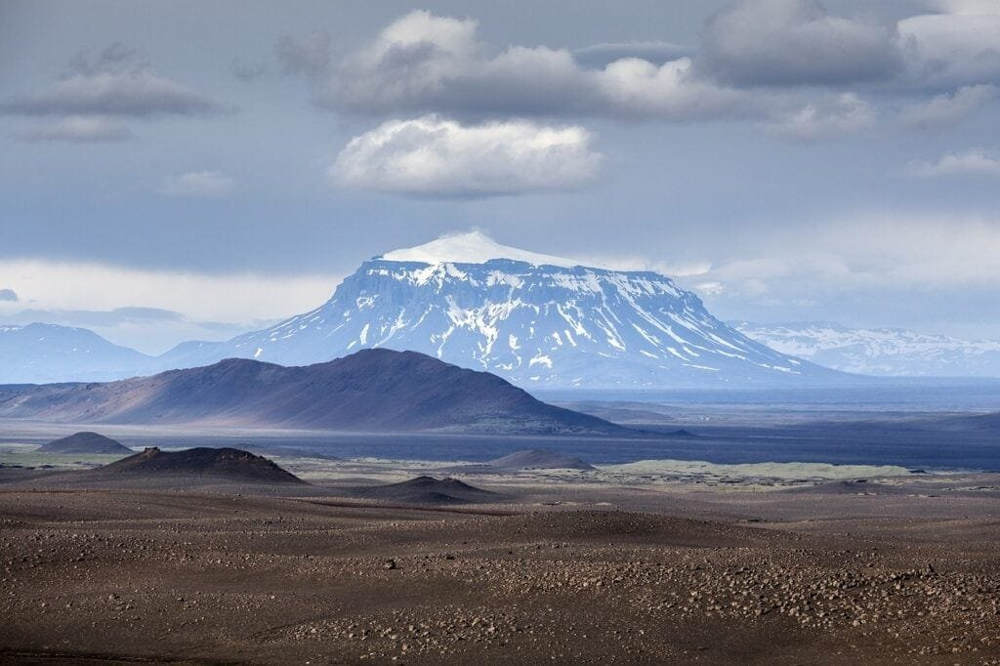

In "Tips for Improving Accuracy in Predicting Volcanic Activity," you will discover key tips to enhance the accuracy of predicting volcanic eruptions. Volcanoes, formed when molten rock and gases escape to the earth's surface, can cause catastrophic damage to surrounding communities. By understanding the different types of volcanoes, their eruption patterns, and the factors that influence volcanic activity, scientists and researchers can develop more effective prediction models to mitigate risks and ensure the safety of those living in volcano-prone areas. Join us as we explore the fascinating world of volcanoes and learn how we can improve our ability to forecast future volcanic events.

<iframe width="560" height="315" src="https://www.youtube.com/embed/VvLZmY7cicM" frameborder="0" allow="accelerometer; autoplay; encrypted-media; gyroscope; picture-in-picture" allowfullscreen></iframe>

  

## Understanding Volcano Types

Volcanoes come in various forms, each with its own unique characteristics and eruption patterns. By studying and understanding different volcano types, scientists can gain valuable insights into how volcanoes behave and predict their future activity more accurately.

One [type of volcano is the shield](https://magmamatters.com/understanding-volcanic-formation-a-comprehensive-guide/ "Understanding Volcanic Formation: A Comprehensive Guide") volcano, which is characterized by its broad, gently sloping sides and low profile. These volcanoes are primarily formed by the eruption of fluid basaltic lava, which flows easily due to its low viscosity. Shield volcanoes typically have non-explosive eruptions and are known for their long-lasting, effusive eruptions that can create extensive lava flows.

On the other end of the spectrum, stratovolcanoes, also known as composite volcanoes, are tall and steep. They are composed of alternating layers of solidified lava, volcanic ash, and other volcanic materials. Stratovolcanoes often have explosive eruptions due to the high viscosity of their lava, which traps gases and leads to pressure buildup. These eruptions can result in pyroclastic flows, ash clouds, and volcanic debris avalanches.

Another type of volcano is the cinder cone. These volcanoes are small and symmetrical, with steep sides and a bowl-shaped crater at the summit. Cinder cones are formed when explosive eruptions eject fragments of solidified magma, known as cinders or scoria, into the air. Due to their small size and short-lived eruptions, cinder cones do not typically pose significant hazards to surrounding areas.

By understanding the characteristics and eruption styles of these different volcano types, scientists can better assess the potential risks associated with each volcano and develop appropriate mitigation measures.

## Studying Volcanic Geography

When it comes to studying volcanoes, understanding their geographic distribution is crucial. Volcanoes are not randomly scattered across the Earth's surface but are concentrated in specific regions due to underlying geological processes.

One key aspect of volcanic geography is analyzing volcanic zones. These zones are areas where volcanic activity is concentrated, often along tectonic plate boundaries. The "Ring of Fire" is a prime example of a volcanic zone encircling the Pacific Ocean, where the movement and interaction of tectonic plates give rise to numerous volcanoes and seismic activity. By studying volcanic zones, scientists can identify patterns and trends in volcanic activity.

It is also essential to grasp the concept of plate tectonics to understand volcanic activity. The Earth's lithosphere is divided into several large plates that are constantly moving. Volcanoes can form at plate boundaries, such as convergent boundaries where plates collide or divergent boundaries where plates move apart. Subduction zones, where one plate is forced beneath another, are particularly prone to volcanic activity.

In addition to plate tectonics, hot spots play a significant role in volcanism. Hot spots are areas where molten rock, or magma, rises from deep within the Earth's mantle to the surface. These upwellings of magma can create chains of volcanoes, such as the Hawaiian Islands. Understanding the processes behind hot spots and their association with volcanic activity is crucial for accurately predicting volcanic eruptions.

This image is property of pixabay.com.

## Monitoring Seismic Activity

Seismic activity, including earthquakes, is often closely linked to volcanic eruptions. By monitoring and analyzing seismic data, scientists can gain valuable insights into the underlying processes occurring within a volcano and predict the likelihood of an eruption.

There is a correlation between earthquake activity and volcanic eruptions. As magma rises through the Earth's crust, it can generate seismic activity due to the movement and interaction of rock layers. This seismicity can manifest as small, low-energy tremors or larger, more energetic earthquakes. By tracking and analyzing earthquake patterns, scientists can determine where magma is moving and accumulating, providing important clues about the potential for an eruption.

Seismographs are invaluable tools for [monitoring seismic activity associated with volcanoes](https://magmamatters.com/the-art-and-science-of-volcano-monitoring/ "The Art and Science of Volcano Monitoring"). These instruments can detect and record even the smallest vibrations caused by seismic waves. By analyzing the data collected by seismographs, scientists can identify patterns in earthquake activity and discern any changes that may indicate an imminent eruption.

One key aspect in monitoring seismic activity prior to volcanic eruptions is understanding the earthquake patterns. Scientists have observed that there is often an increase in earthquake frequency, magnitude, or both in the period leading up to an eruption. This increase in seismic activity is known as a seismic swarm and can serve as a warning sign of volcanic unrest. By carefully analyzing earthquake patterns, scientists can make more accurate predictions about the timing and magnitude of future eruptions.

## Utilizing Satellite Imagery

Satellite imagery has revolutionized the field of volcano monitoring in recent years. Using remote sensing technologies, scientists can observe and analyze various volcanic parameters from space, providing valuable insights into the conditions within a volcano and the likelihood of an eruption.

One crucial application of satellite imagery is monitoring volcano conditions. Different sensors on satellites can capture data on various parameters, such as the temperature of the volcano's surface, the presence of volcanic gases, and changes in the topography. By analyzing these data, scientists can identify any unusual activity or changes that may precede an eruption.

Thermal activity change is a vital indicator of volcanic unrest. By analyzing thermal imagery captured by satellites, scientists can detect changes in the temperature of a volcano's surface. These changes can indicate the movement of magma beneath the surface or the release of volcanic gases. Monitoring thermal activity allows scientists to assess the evolving state of a volcano and predict the probability of an eruption.

Satellite imagery can also help identify surface deformations before eruptions. As magma rises within a volcano, it can cause the ground to deform, resulting in changes in the topography. By comparing satellite images taken at different times, scientists can detect and measure these surface deformations. These measurements provide valuable information about the accumulation and movement of magma, aiding in the prediction of volcanic eruptions.

This image is property of pixabay.com.

## Conducting Ground Deformation Studies

Ground deformation studies complement satellite imagery by providing more detailed and precise measurements of surface changes associated with volcanic activity. Advanced technologies, such as GPS (Global Positioning System) and InSAR (Interferometric Synthetic Aperture Radar), allow scientists to accurately monitor ground deformations and gain a deeper understanding of volcano behavior.

GPS technology plays a crucial role in detecting volcano bulging pre-eruption. By placing GPS stations around a volcano, scientists can continuously monitor ground movements. As magma accumulates beneath the surface, it causes the ground to bulge or uplift due to the increased pressure. GPS measurements can detect even slight changes in ground elevation, providing valuable insights into the build-up of magma and the potential for an eruption.

InSAR technology is another valuable tool for studying ground deformations. By utilizing radar signals emitted from satellites, InSAR can measure tiny changes in the distance between the satellite and the volcano's surface. These measurements are sensitive to ground movements, including deformations caused by volcanic activity. InSAR enables scientists to create detailed deformation maps, showing the subtle changes occurring over time. This information is vital for understanding the dynamics of magma movement and predicting volcanic eruptions.

Ground deformation data obtained through GPS and InSAR are crucial in volcano analysis. By combining these measurements with other data sources, such as seismic and satellite data, scientists can build a more comprehensive picture of a volcano's behavior and potential hazards. Ground deformation studies contribute significantly to improving accuracy in predicting volcanic activity.

## Studying Gas Emissions

Volcanic gases play a crucial role in monitoring and predicting volcanic activity. By studying the gases emitted by volcanoes, scientists can gain insights into the underlying processes occurring within a volcano and assess the potential for an eruption.

Volcanoes emit various gases during eruption, including water vapor (H2O), carbon dioxide (CO2), sulfur dioxide (SO2), and hydrogen sulfide (H2S), among others. Recognizing the types of gases typically emitted by volcanoes is essential for understanding their behavior. Each gas provides valuable information about the source and conditions of the magma, such as its depth and composition.

Analyzing gas composition and emission rate is a key aspect of volcano monitoring. By collecting gas samples directly from a volcano or using remote sensing techniques, scientists can determine the relative abundance of different gases. Changes in gas compositions can indicate variations in the magma's source, temperature, or volatile content, which are crucial factors in predicting volcanic eruptions.

Gas emission rate is also an important parameter to consider. By measuring the amount of gas being released by a volcano over time, scientists can assess the level of volcanic activity. A sudden increase in gas emission rate may indicate an impending eruption, while a decrease may suggest a decrease in volcanic activity. Monitoring gas emissions provides valuable real-time information about the state of a volcano and its potential hazards.

Predicting volcanic eruptions based on gas emissions is a complex process that requires careful analysis and interpretation of data. However, advancements in monitoring technologies and gas analysis techniques have improved scientists' ability to detect meaningful changes in gas emissions and make more accurate predictions about volcanic activity.

This image is property of pixabay.com.

## Understanding Volcanic History

Studying the history of past volcanic eruptions is essential for predicting future activity. By examining records of previous eruptions and identifying patterns, scientists can gain valuable insights into a volcano's behavior and the potential hazards associated with it.

Learning from past eruptions allows scientists to understand the sequence of events leading up to volcanic activity. By analyzing historical data, such as eyewitness accounts, geological records, and sediment deposits, scientists can reconstruct the eruption process and identify the warning signs that preceded it. This information is crucial for establishing eruption precursors and developing early warning systems.

Identifying patterns in previous eruptions is also valuable for predicting future activity. By comparing the characteristics of past eruptions, such as eruption style, eruption duration, and eruption frequency, scientists can recognize recurring patterns and trends. These patterns provide a basis for forecasting the likelihood and scale of future eruptions. Understanding volcanic history helps scientists make more informed predictions about the behavior of active and potentially active volcanoes.

Assessing how historical data can inform future predictions involves integrating various disciplines and data sources. By combining geological studies, historical records, satellite imagery, and other data, scientists can build a comprehensive picture of a volcano's past behavior. This interdisciplinary approach enhances the accuracy of predictions and contributes to better risk assessment and mitigation strategies.

## Promoting Interdisciplinary Collaboration

Interdisciplinary collaboration is crucial for advancing the field of volcano monitoring and prediction. Volcanology encompasses various scientific disciplines, and combining knowledge across these fields leads to a more comprehensive understanding of volcanic activity and improved accuracy in predictions.

Collaboration between geologists, geophysicists, volcanologists, atmospheric scientists, and other specialists is essential for interpreting and analyzing data from different sources. Each discipline brings unique perspectives and expertise, contributing to a holistic understanding of volcanic processes and behavior. By sharing information and working together, scientists can develop more accurate models and predictions of volcanic activity.

In addition to scientific collaboration, local people's historical knowledge and experience play a crucial role in volcano monitoring. Indigenous communities often have a rich oral history and traditional knowledge passed down through generations. Their observations and understanding of volcanic activity, such as changes in animal behavior, groundwater, or vegetation, can provide valuable insights into volcanic behavior. Engaging with local communities and incorporating their knowledge into volcano monitoring efforts strengthens the accuracy of predictions and promotes effective risk communication.

Working with emergency planners and authorities is another important aspect of interdisciplinary collaboration in volcano monitoring. By establishing effective communication channels and sharing information, scientists and emergency planners can work together to develop strategies for risk mitigation and response. This collaboration ensures that accurate and timely information reaches the communities at risk, enabling them to take appropriate actions in the event of volcanic unrest or eruption.

Promoting interdisciplinary collaboration is crucial for advancing the field of volcano monitoring and prediction. By bringing together expertise from different disciplines and engaging with local communities and authorities, scientists can enhance the accuracy of predictions and contribute to better risk management strategies.

## Enhancing Volcano Monitoring Infrastructure

An important aspect of improving accuracy in predicting volcanic activity is the enhancement of volcano monitoring infrastructure. Well-equipped monitoring stations, regular equipment maintenance, and investment in cutting-edge technologies are essential for collecting accurate and timely data on volcanic behavior.

Monitoring stations play a crucial role in collecting data on various parameters, such as seismicity, ground deformation, gas emissions, and thermal activity. These stations are strategically located around active volcanoes to provide comprehensive monitoring coverage. Well-designed monitoring networks ensure that scientists have access to real-time data, allowing them to make informed decisions and predictions.

Regular maintenance and calibration of monitoring equipment are vital to ensure the accuracy of collected data. Seismic instruments, GPS stations, gas analyzers, and thermal cameras all require periodic maintenance and calibration to ensure their reliability. Timely detection and repair of any malfunctions or anomalies are instrumental in maintaining the accuracy and integrity of volcano monitoring data.

Investment in cutting-edge technologies is crucial for advancing volcano monitoring capabilities. Rapid advancements in sensor technologies, data processing methods, and communication systems offer new opportunities for more accurate and timely monitoring. For example, the use of unmanned aerial vehicles (UAVs) equipped with advanced sensors can provide high-resolution data on volcanic activity in real-time. Investing in state-of-the-art [technologies ensures that volcano](https://magmamatters.com/geothermal-energy-and-its-volcanic-origins/ "Geothermal Energy and Its Volcanic Origins") monitoring infrastructure remains at the forefront of scientific advancements.

Continued enhancements in volcano monitoring infrastructure contribute significantly to improving the accuracy of predictions. By ensuring the availability of reliable and up-to-date data, scientists can make more informed decisions and provide timely warnings to communities at risk. The investment in monitoring infrastructure is crucial for mitigating the risks associated with volcanic activity.

## Implementing Machine Learning and Artificial Intelligence

The implementation of machine learning and artificial intelligence (AI) techniques has the potential to revolutionize volcano monitoring and prediction. By harnessing the power of advanced algorithms and geospatial technologies, scientists can improve the accuracy and speed of predictions.

Machine learning algorithms can analyze vast amounts of data and identify patterns and correlations that might not be immediately apparent to human analysts. By training algorithms on historical data and observations, scientists can develop models that can predict volcanic behavior based on various input parameters. These models can then be applied to real-time data for more accurate and timely predictions.

Artificial intelligence can also be applied in image analysis. By training AI algorithms to recognize and interpret satellite imagery and other visual data, scientists can automate the detection of volcanic features and changes. AI can quickly process large volumes of imagery and identify subtle changes in volcano conditions, helping scientists detect potential hazards and gather valuable information for prediction models.

Advances in AI and geospatial technology open up exciting possibilities for future predictions. By combining machine learning with data from various monitoring techniques, such as seismic, gas emission, and satellite data, scientists can develop robust predictive models that integrate multiple parameters. These models can provide more accurate and reliable forecasts, enabling better risk assessment and mitigation strategies.

In conclusion, understanding volcanoes and accurately predicting their activity are crucial for protecting communities living in volcanic regions. By studying different volcano types, analyzing volcanic geography, monitoring seismic activity, utilizing satellite imagery, conducting ground deformation studies, studying gas emissions, understanding volcanic history, promoting interdisciplinary collaboration, enhancing volcano monitoring infrastructure, and implementing machine learning and artificial intelligence techniques, scientists can improve the accuracy of volcano predictions and mitigate the risks associated with volcanic eruptions. The continuous advancement of scientific knowledge and monitoring technologies is vital for enhancing volcano prediction capabilities and ensuring the safety and well-being of communities living in the vicinity of volcanoes.

