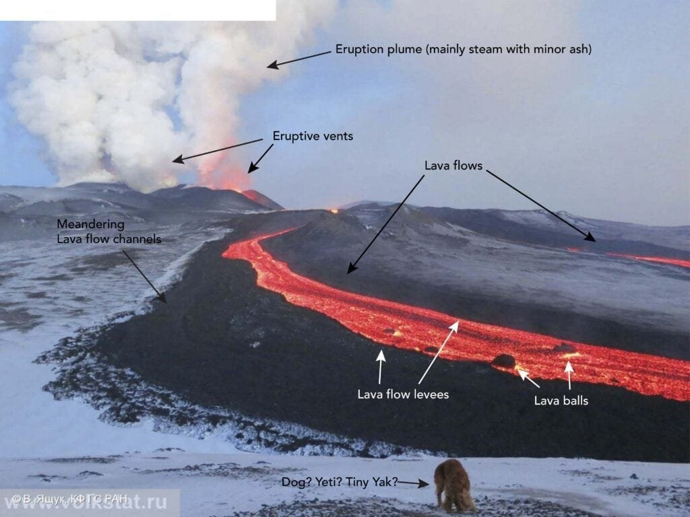
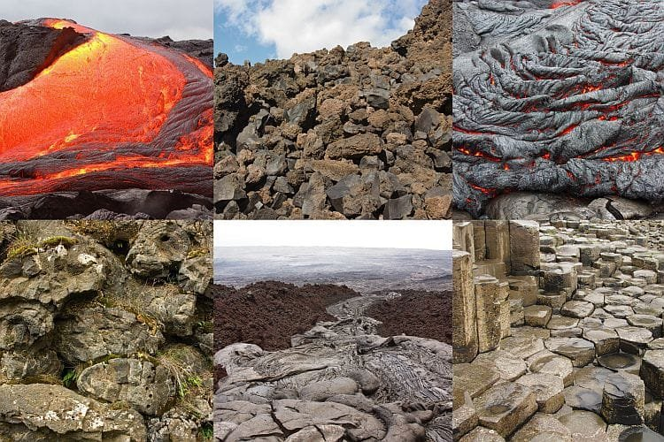
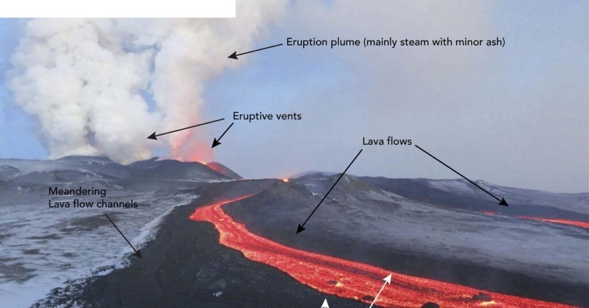

Volcanoes, with their awe-inspiring eruptions and fiery lava flows, have long captivated our imaginations. From the towering peaks of the Ring of Fire to the tranquil slopes of Hawaii's shield volcanoes, these natural wonders showcase a diverse range of eruption patterns and lava flow formations. In this article, we will explore the top 10 lava flow patterns in volcanology, delving into the fascinating world of volcanic activity and the breathtaking landscapes it creates. Whether you're an aspiring geologist or simply curious about the mysteries of the Earth, this exploration of lava flow patterns is sure to leave you in awe of the power and beauty of these geological phenomena. So, buckle up and get ready to embark on a thrilling journey through the captivating realm of volcanology.

## Pahoehoe Lava Flow

This image is property of media.wired.com.

### Characteristic features and formation condition

Pahoehoe lava flows are characterized by their smooth and ropey texture, resembling twisted braids of melted rock. This type of lava flow forms when low-viscosity basaltic lava erupts from a volcano. The lava is hot and fluid, allowing it to flow easily and create the distinctive rope-like structures. Pahoehoe lava flows typically have a relatively low gas content, which contributes to their smooth appearance.

The formation of pahoehoe lava flows is dependent on several conditions. Firstly, the lava must have a low viscosity, meaning it is less sticky and more fluid than other types of lava. This allows it to flow smoothly and spread out over the surrounding landscape. Secondly, the eruption temperature must be high enough to keep the lava in a molten state for an extended period. This allows the lava to flow for longer distances and form intricate patterns. Finally, the terrain over which the lava flows plays a role in shaping the pahoehoe formations. Steep slopes may cause the lava to flow more quickly, while flatter terrain can result in slower, more meandering flows.

This image is property of www.sandatlas.org.

### Examples of Pahoehoe lava flow

One striking example of pahoehoe lava flow is found in Hawaii's Kilauea volcano. The lava flows from Kilauea have created vast fields of pahoehoe formations, stretching for miles across the landscape. The lava spreads out in a smooth, rope-like manner, creating mesmerizing patterns that captivate both scientists and visitors alike. The Hawaiian Islands are renowned for their unique volcanic activity, and the pahoehoe lava flows are a testament to the power and beauty of [nature](https://magmamatters.com/the-art-and-science-of-volcano-monitoring/ "The Art and Science of Volcano Monitoring").

Another notable example of pahoehoe lava flow is the Eldfell eruption on the Icelandic island of Heimaey in 1973. As the eruption occurred on a residential area, efforts were made to divert the lava flow away from homes and infrastructure. However, despite these efforts, pahoehoe lava still made its way through the town, engulfing houses and vehicles in its path. This event showcased the destructive potential of pahoehoe lava flows and demonstrated the need for effective volcano monitoring and mitigation strategies.

This image is property of media.wired.com.

### Impact on the surrounding landscape

Pahoehoe lava flows have a significant impact on the surrounding landscape. As the lava spreads out, it covers the existing terrain, altering its appearance and composition. The smooth, rope-like formations create unique landforms that can be visually striking. These formations can also act as barriers, diverting the flow of subsequent lava and preventing it from reaching certain areas.

The heat from pahoehoe lava flows can also cause vegetation to ignite, leading to forest fires. The intense heat can devastate plant life, leaving behind scorched earth in its wake. However, pahoehoe lava flows can also have positive effects on the landscape. As the lava cools and solidifies, it creates new land that can be fertile and conducive to plant growth. The mineral-rich lava can also provide nutrients to the soil, promoting the growth of vegetation in the future.

It is important to note that while pahoehoe lava flows can be visually captivating, they also pose risks to human settlements and infrastructure. The rapid and unpredictable nature of lava flows can make it challenging to predict their paths accurately. Therefore, communities living near volcanoes must have robust monitoring systems in place and be prepared to evacuate if necessary to mitigate the potential dangers associated with pahoehoe lava flows.

