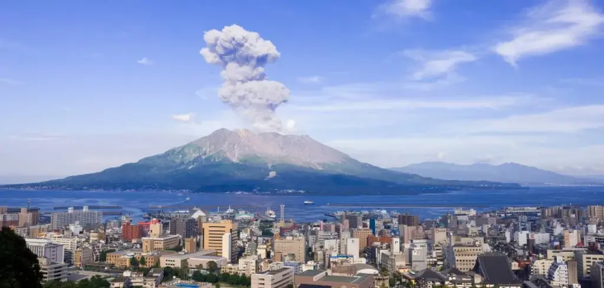
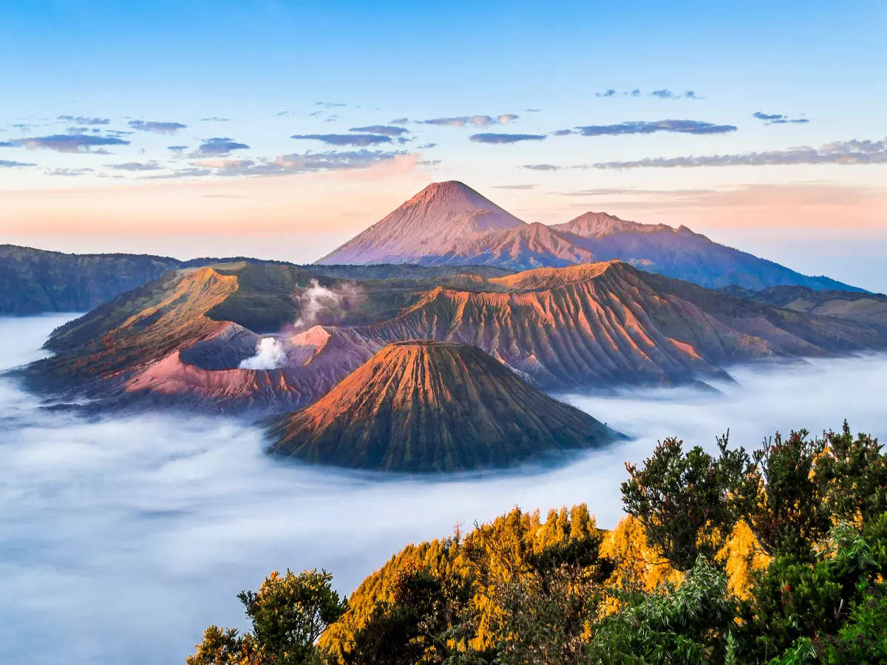

If you're an adventure seeker with a fascination for the natural wonders of the world, then volcano tourism is an experience that shouldn't be missed. Volcanoes, formed by the powerful forces beneath the Earth's surface, offer a thrilling and awe-inspiring opportunity to witness the raw beauty and destructive potential of these majestic wonders. Whether it's the explosive eruptions of the Ring of Fire or the gradual creation of shield volcanoes in Hawaii, each destination provides a unique and unforgettable experience. In this article, we will explore the different types of volcanoes, their locations, eruption causes, hazards, and benefits, providing you with the necessary context to appreciate the top volcano tourism destinations. So pack your bags and get ready for an adventure unlike any other!

<iframe width="560" height="315" src="https://www.youtube.com/embed/ZOvw883SG6A" frameborder="0" allow="accelerometer; autoplay; encrypted-media; gyroscope; picture-in-picture" allowfullscreen></iframe>

  

## Top Seasons for Optimal Volcano Tourism Experiences

If you're an adventure enthusiast seeking a unique travel experience, look no further than volcano tourism. Exploring these majestic natural wonders offers a thrilling and awe-inspiring journey into the heart of the Earth. However, like any other destination, timing is key when it comes to volcano tourism. Understanding the seasonal shifts, climate conditions, and location-driven changes can help you plan your trip for the best possible experience. In this comprehensive article, we will explore the top seasons for optimal volcano tourism experiences in various destinations around the world.

### Understanding the Seasonal Shifts on Volcanoes

Volcanoes, just like any other natural phenomenon, are subject to seasonal changes that can impact the overall experience for tourists. These shifts can vary depending on factors such as weather conditions, volcanic activity, accessibility, and tourist demand. It is essential to have a thorough understanding of these seasonal changes to make the most of your volcano tourism adventure. Let's dive into some of the best times to visit volcanoes based on climate.

### Best Time to Visit Based on Climate

Hawaii, known as the Volcanic Islands, boasts a remarkable geological landscape, making it a favorite destination for volcano tourism. The best time to visit Hawaii's volcanoes, such as Kilauea and Mauna Loa, is during the dry season, which typically runs from April to October. During this time, the weather conditions are more favorable, with less rainfall and cooler temperatures. It allows for better visibility and accessibility to the volcanic sites, ensuring a memorable experience for explorers.

Japan, the Land of Rising Volcanoes, offers a captivating blend of ancient culture and volcanic wonders. One of the prime attractions is Mount Fuji, Japan's iconic symbol, and a UNESCO World Heritage site. The best time to visit Mount Fuji is during the summer season from July to August. The weather is relatively warm and stable, providing clear skies and spectacular views of the majestic volcano.

Iceland, home to geysers and glaciers, offers a breathtaking showcase of volcanic landscapes. The optimal time to visit Iceland's volcanoes, such as Eyjafjallajokull, is during the summer months from June to August. This period offers milder temperatures, longer daylight hours, and increased accessibility to the remote volcanic sites. Additionally, it is an excellent time to explore the famous Blue Lagoon, a [geothermal spa formed as a result of volcanic](https://magmamatters.com/geothermal-energy-and-its-volcanic-origins/ "Geothermal Energy and Its Volcanic Origins") activity.

Indonesia, a volcano-studded archipelago, provides an immersive experience for volcano enthusiasts. Mount Bromo, renowned for its sunrise tours, is best visited during the dry season, which occurs from May to September. The clear skies during this time offer breathtaking views of the sunrise over the volcanic landscape, creating an unforgettable experience.

New Zealand, known for its stunning natural beauty, offers a diverse range of volcanic attractions. White Island, a submarine volcano, is best explored during the summer season from December to February. The pleasant weather conditions during this time enhance the experience, allowing visitors to witness the mesmerizing volcanic activity up close.

Italy, with its legacy of historical eruptions, presents a unique blend of history and volcanism. Vesuvius, infamous for its eruption that destroyed Pompeii, is best visited during the spring and autumn seasons. These transitional periods provide pleasant temperatures and fewer crowds, allowing visitors to explore the volcano and its historical significance comfortably.

Central America, with its rich volcanic landscapes, offers a plethora of options for volcano enthusiasts. Masaya Volcano in Nicaragua, Pacaya Volcano in Guatemala, and Arenal Volcano in Costa Rica are best visited during the dry season. This period, which typically occurs from December to April, provides optimum weather conditions for volcano exploration.

### Location-Driven Seasonal Changes for Tourists

Apart from climate considerations, location-driven seasonal changes can significantly impact the overall volcano tourism experience. Destinations such as Hawaii and Japan have volcanoes that are accessible year-round, allowing tourists to plan their visits based on personal preferences. Hawaii's Big Island, renowned for its active volcanoes Kilauea and Mauna Loa, offers ample accessibility options, including guided tours and hiking trails. Visitors can explore the unique [geology of the Hawaiian shield volcanoes](https://magmamatters.com/the-environmental-impact-of-volcanic-eruptions-2/ "The Environmental Impact of Volcanic Eruptions") and witness the raw power of these magnificent natural wonders.

Japan, with its vibrant volcanic landscape, provides numerous opportunities for volcano tourism. Besides Mount Fuji, Hokkaido offers a mix of active and dormant volcanoes that can be explored throughout the year. The picturesque surroundings, hot springs, and volcanic onsens make for an enriching experience for visitors.

Iceland, with its dramatic volcanic landscapes, allows tourists to witness the power of nature up close. Despite its unpredictable weather conditions, Iceland offers year-round accessibility to its volcanoes. Exploring the Eyjafjallajokull volcano, famous for its 2010 eruption, and taking a dip in the geothermal wonders of the Blue Lagoon are must-try experiences for volcano enthusiasts.

Indonesia, an archipelago comprising over 17,000 islands, offers a diverse range of volcanic adventures. From the stunning sunrise tours at Mount Bromo to the tricolor volcano lakes of Kelimutu, each destination provides a unique experience. However, it is crucial to consider the specific seasons for each location, as accessibility and weather conditions may vary.

New Zealand's volcanic landscapes are a testament to its geologically active history. From the striking White Island submarine volcano to the geothermal wonders of Rotorua, there is no shortage of captivating experiences for volcano tourists. The Tongariro Alpine Crossing, a multi-crater volcanic hike, showcases the stunning beauty of New Zealand's volcanic terrain and is best explored during the summer season.

Italy, with its volcanic legacy, offers a glimpse into history and geology. Vesuvius, infamous for the destruction of Pompeii, attracts visitors year-round. Etna, Europe's most active volcano, provides opportunities for guided tours and hikes. Stromboli, known for its nocturnal "fireworks," offers a unique experience for thrill-seekers.

Central America, nestled in the Pacific Ring of Fire, boasts a remarkable concentration of volcanoes. Masaya Volcano in Nicaragua, Pacaya Volcano in Guatemala, and Arenal Volcano in Costa Rica provide thrilling experiences for volcano enthusiasts. However, it is essential to consult local authorities and monitor volcanic activities during the specific seasons for each destination.

### Benefits of Volcano National Park Tours

When embarking on a volcano tourism adventure, exploring national parks with volcanic landscapes offers an array of benefits. In addition to experiencing the raw power and beauty of volcanoes, these parks often provide educational resources, guided tours, and safety precautions for visitors. Volcano National Park tours, such as those in Hawaii and Costa Rica, offer the opportunity to witness volcanic eruptions, learn about the geology, and explore the unique ecosystems that surround these volcanoes. These tours not only enhance the overall visitor experience but also contribute to the preservation of these natural wonders for future generations.

This image is property of www.kiwi.com.

## Safety Precautions for Volcano Tourism

While volcano tourism offers incredible experiences, it is essential to prioritize safety and be aware of potential hazards. [Understanding volcanic](https://magmamatters.com/understanding-volcanic-formation-a-comprehensive-guide/ "Understanding Volcanic Formation: A Comprehensive Guide") hazards is crucial before embarking on any volcano tourism adventure. Volcanic eruptions can lead to dangerous situations such as lava flows, ash clouds, and toxic gases. It is essential to stay informed about the current volcano activities and adhere to guidelines and warnings provided by local authorities and park rangers.

Preparation and safety gear play a vital role in ensuring a safe volcano tourism experience. It is recommended to wear appropriate clothing, including sturdy shoes, long pants, and a hat, to protect against heat, ash, and sharp volcanic rocks. Carrying a backpack with essential items such as water, food, a first aid kit, and a flashlight is also recommended. Additionally, it is crucial to have a means of communication, such as a fully charged mobile phone or a two-way radio.

Staying informed about current volcano activities is paramount to ensure the safety of yourself and those around you. Monitoring reports from local geological agencies or national park services can provide valuable information on volcanic activity, potential hazards, and any ongoing precautions. It is advisable to check for updates regularly and consult with experts or local guides who have extensive knowledge of the specific volcano and its surroundings.

This image is property of static.toiimg.com.

## The Eco-Ethics of Volcano Tourism

As with any form of tourism, it is essential to consider the environmental impact of volcano tourism and strive for sustainable practices. Volcanic landscapes are fragile ecosystems that require careful preservation to maintain their natural beauty and ecological balance. Understanding the environmental impact of volcano tourism is crucial for responsible travelers.

Practices for sustainable volcano tourism can include minimizing waste generation, using environmentally friendly transportation options, and supporting local communities. It is important to respect designated trails, refrain from littering, and avoid damaging vegetation and geological features. Engaging in responsible tourism can contribute to the overall conservation efforts and ensure that future generations can continue to enjoy the wonders of volcano tourism.

Volcano tourism, when approached as a form of geotourism, can provide valuable [educational](https://magmamatters.com/the-art-and-science-of-volcano-monitoring/ "The Art and Science of Volcano Monitoring") opportunities and foster a deeper appreciation for the Earth's natural wonders. By embracing sustainable practices, we can ensure the preservation of these unique landscapes and create a positive impact on the communities that rely on volcano tourism for their livelihoods.

In conclusion, volcano tourism offers an extraordinary opportunity to witness the awe-inspiring power of nature firsthand. By understanding the seasonal shifts, climate conditions, and location-driven changes, visitors can plan their trips for optimal volcano tourism experiences. Whether exploring the volcanic islands of Hawaii, the rising volcanoes of Japan, the geysers and glaciers of Iceland, the volcano-studded archipelago of Indonesia, the volcanic landscapes of New Zealand, the historical eruptions of Italy, or the volcanic wonders of Central America, a volcano tourism adventure promises thrills, education, and a deep connection with the Earth. Remember to prioritize safety, practice eco-ethics, and embrace the transformative power of volcano tourism. Happy exploring!

