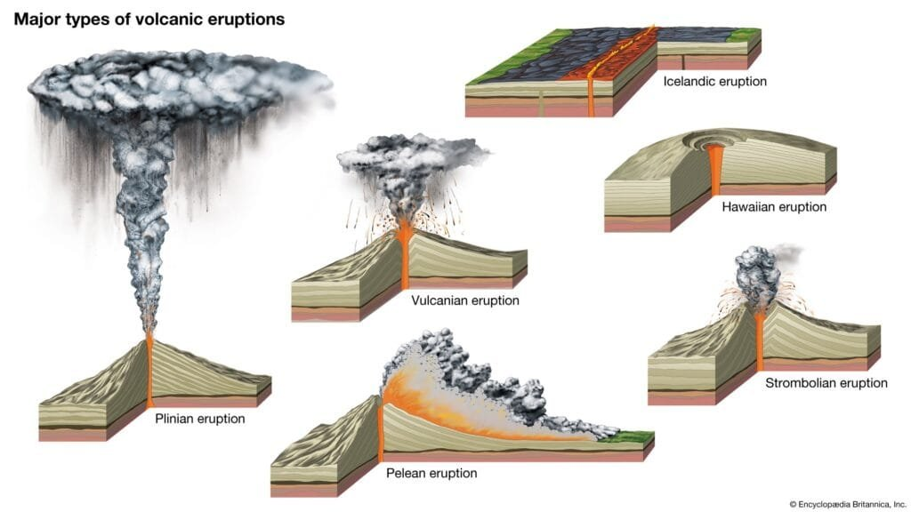
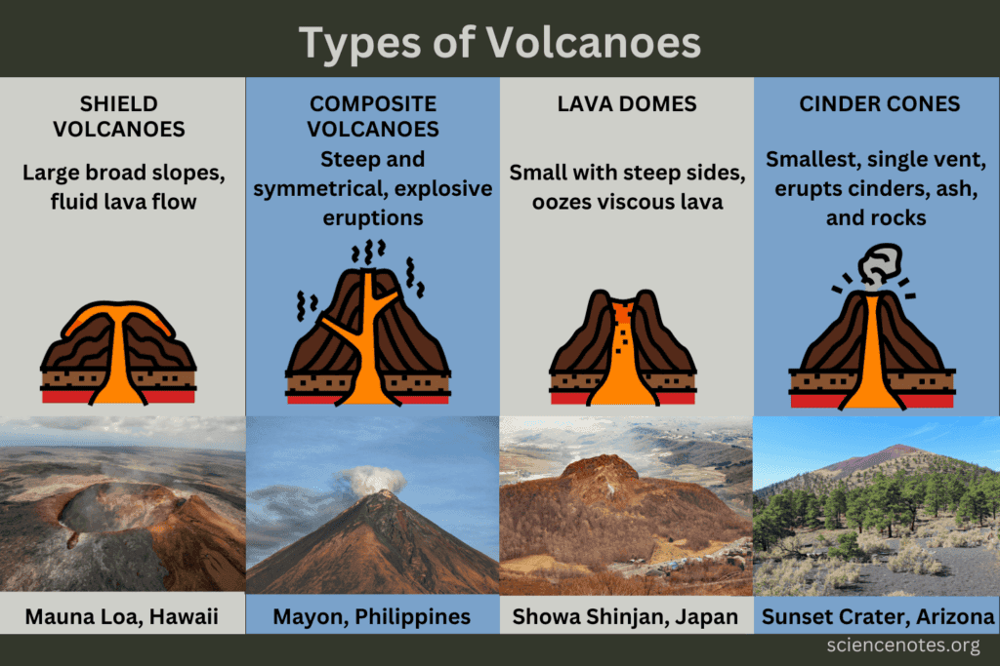
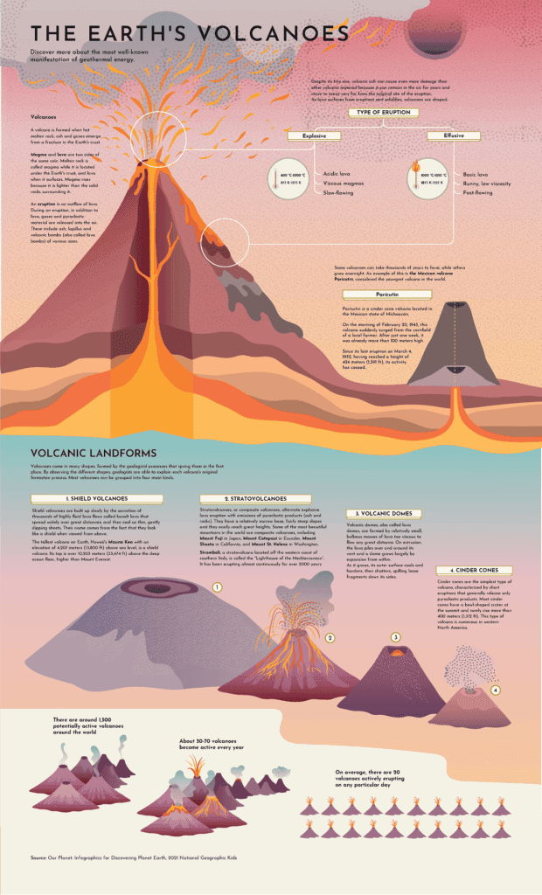
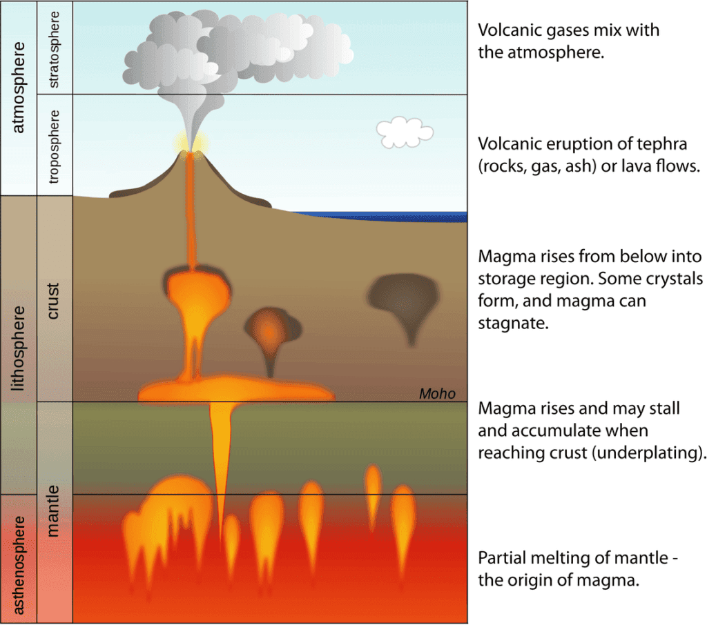
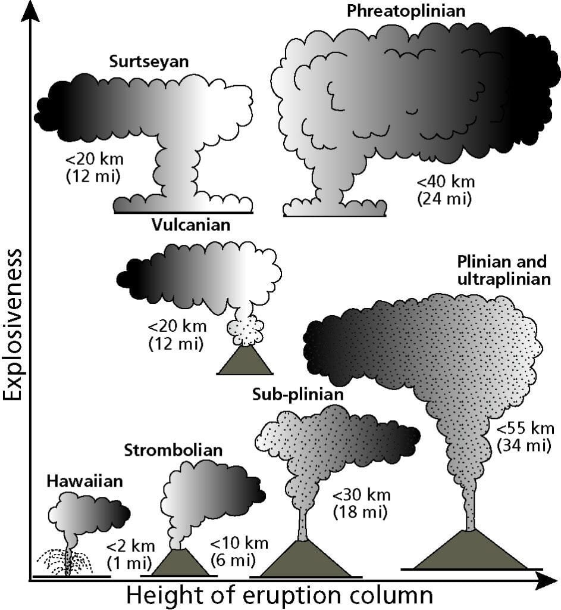

Volcanoes are an awe-inspiring force of nature, capable of both destructive and life-giving power. In this article, we will explore the different types and characteristics of volcanic eruptions, shedding light on the various factors that contribute to their formation and eruption patterns. From the explosive eruptions that can produce towering ash clouds and deadly pyroclastic flows to the more gradual, effusive eruptions that create vast lava flows, each type of eruption presents its own unique set of characteristics. By understanding these different eruption types, we can gain valuable insights into predicting future volcanic activity and mitigating the risks they pose to surrounding communities. So, let's dive into the world of volcanoes and compare the seven distinct types of volcanic eruptions.

# Understanding Volcanic Eruptions

Volcanic eruptions are powerful natural phenomena that have fascinated humans for centuries. These explosive events occur when molten rock, known as magma, rises to the Earth's surface, releasing gases and debris. In this article, we will explore the definition and causes of volcanic eruptions, as well as the effects they have on the environment.

This image is property of cdn.britannica.com.

## Definition of a volcanic eruption

A volcanic eruption can be described as the sudden and violent release of magma, gases, and particles from a volcano. This event can result in the expulsion of lava flows, ash clouds, and pyroclastic materials. Volcanic eruptions are typically accompanied by seismic activity, such as earthquakes and tremors.

## Causes of volcanic eruptions

There are several factors that contribute to the occurrence of volcanic eruptions. One of the primary causes is the movement of tectonic plates. When these massive slabs of the Earth's crust shift and collide, they can create weak points or fractures in the Earth's crust, allowing magma to rise to the surface.

Volcanic eruptions can also be triggered by the presence of hotspots beneath the Earth's crust. These hotspots are localized areas of intense heat that result from the interaction between the Earth's mantle and the lithosphere. As the mantle plume rises towards the surface, it melts rocks and creates magma chambers, leading to volcanic activity.

  

## Effects of volcanic eruptions on the environment

Volcanic [eruptions have both immediate and long-term effects on the environment](https://magmamatters.com/geothermal-energy-and-its-volcanic-origins/ "Geothermal Energy and Its Volcanic Origins"). In the short term, volcanic eruptions can release enormous amounts of ash and gases into the atmosphere. Ash clouds can block sunlight, leading to decreased visibility and potentially disrupting air travel. The gases released during eruptions, such as [sulfur dioxide and carbon](https://magmamatters.com/the-art-and-science-of-volcano-monitoring/ "The Art and Science of Volcano Monitoring") dioxide, can contribute to air pollution and have detrimental effects on human health.

Volcanic eruptions also have significant impacts on ecosystems. Lava flows can destroy vegetation and habitats, displacing wildlife and altering the landscape. However, volcanic ash can also have positive effects on the environment. The ash contains essential nutrients that can enrich the soil, promoting plant growth and increasing agricultural productivity in the long run.

## Types of Volcanic Eruptions

Volcanic eruptions can vary in intensity and eruption style, depending on various factors such as magma viscosity, gas content, and eruption rate. Let's explore some of the most common types of volcanic eruptions.

### Hawaiian eruptions

Hawaiian eruptions are characterized by relatively low explosivity and the effusion of highly fluid basaltic lava. These eruptions often occur at shield volcanoes, such as those found in Hawaii. The lava flows during Hawaiian eruptions are typically slow-moving and can extend for long distances, creating vast volcanic fields. These eruptions are considered relatively gentle compared to other types but can still pose risks to surrounding communities.

### Strombolian eruptions

Strombolian eruptions are named after the volcano Stromboli in Italy, which is known for its frequent and explosive eruptions. These eruptions are characterized by the ejection of incandescent volcanic bombs and the occasional release of lava fountains. Strombolian eruptions are typically moderate in intensity and produce distinct bursts of activity, accompanied by loud explosions and ash emissions.

### Vulcanian eruptions

Vulcanian eruptions are named after the Roman god of fire, Vulcan. These eruptions are characterized by short but violent explosions that can project ash clouds and pyroclastic flows high into the atmosphere. Vulcanian eruptions often occur at stratovolcanoes, which are tall and conical volcanoes composed of alternating layers of lava and volcanic ash. The explosive nature of Vulcanian eruptions poses significant hazards to nearby communities and can result in the formation of volcanic domes.

### Pelean eruptions

Pelean eruptions are particularly devastating and occur when highly viscous magma traps gas and pyroclastic materials. These eruptions are characterized by the collapse of a volcanic dome, triggering a fast-moving avalanche of hot gas, ash, and rocks known as a pyroclastic flow. Pelean eruptions, named after the 1902 eruption of Mount Pelée in Martinique, can cause extensive damage to infrastructure and result in the loss of human life.

### Plinian eruptions

Plinian eruptions are among the most powerful and explosive volcanic events. These eruptions are named after Pliny the Younger, who witnessed the catastrophic eruption of Mount Vesuvius in 79 AD. Plinian eruptions are characterized by an eruption column that reaches high into the atmosphere, dispersing ash and volcanic gases over vast areas. The eruption column can collapse, resulting in pyroclastic flows and surges that can devastate the surrounding landscape.

### Phreatomagmatic eruptions

Phreatomagmatic eruptions occur when water comes into contact with magma, producing explosive volcanic activity. These eruptions are characterized by the interaction between rising magma and groundwater, resulting in steam-driven explosions. Phreatomagmatic eruptions can generate ash clouds, volcanic bombs, and the formation of volcanic craters known as maars.

### Surtseyan eruptions

Surtseyan eruptions are named after the eruption that created the volcanic island Surtsey, off the coast of Iceland, in 1963. These eruptions occur when magma reaches the sea, leading to violent steam explosions and the ejection of volcanic materials. Surtseyan eruptions can create new volcanic islands or expand existing ones, dramatically altering the surrounding marine environment.

This image is property of sciencenotes.org.

## Characteristics of Hawaiian Eruptions

### Origin of Hawaiian eruptions

Hawaiian eruptions originate from shield volcanoes, which are formed by the accumulation of basaltic lava flows over time. These volcanoes are commonly associated with hotspots, where plumes of hot mantle material rise towards the Earth's crust. The hot, low-viscosity magma generated by the hotspot causes the relatively calm and effusive nature of Hawaiian eruptions.

### Nature of Hawaiian eruptions

Hawaiian eruptions are characterized by the continuous effusion of lava flows, typically composed of basaltic magma. The lava is extremely fluid, allowing it to flow easily over long distances. Hawaiian eruptions often create significant lava fields and can be sustained for weeks or even months. The calm nature of these eruptions allows for some predictability and allows for the development of techniques to divert lava flows away from populated areas.

### Consequences of Hawaiian eruptions

While Hawaiian eruptions are generally less explosive and destructive compared to other types of eruptions, they can still have significant consequences. The slow-moving lava flows can destroy vegetation, infrastructure, and even homes as they advance. The release of volcanic gases, such as sulfur dioxide, can also pose health hazards to nearby communities, especially those with respiratory conditions. However, Hawaiian eruptions also have beneficial effects, as the enriched soil resulting from lava deposition can lead to increased agricultural productivity in the long term.

## Understanding Strombolian Eruptions

### Causes of Strombolian eruptions

Strombolian eruptions occur due to the presence of gas-rich magma and the buildup of pressure within the volcano's conduit. As gas bubbles rise through the magma, they expand and eventually burst at the surface, creating explosions. The viscosity of the magma plays a role in determining the explosiveness of Strombolian eruptions, with less viscous magma allowing gas to escape more readily.

### Characteristics of Strombolian eruptions

Strombolian eruptions are characterized by their repetitive and explosive nature. The eruptions occur at regular intervals, with bursts of lava and gas being ejected into the air. Lava fountains, which can reach heights of several hundred meters, are often observed during these eruptions. Strombolian eruptions can generate ash clouds and shower nearby areas with volcanic bombs and lapilli.

### Impacts of Strombolian eruptions

While Strombolian eruptions are generally less hazardous compared to more explosive eruptions, they can still pose risks to surrounding communities. The ejection of volcanic bombs and lapilli can cause damage to infrastructure and pose a threat to human safety. Ash emissions from Strombolian eruptions can also disrupt air travel and have adverse effects on respiratory health. Volcanic ash can accumulate on the ground, leading to the formation of ashfall deposits that affect agriculture and water sources.

This image is property of www.visualcapitalist.com.

## Vulcanian Eruptions Explained

### Origination of Vulcanian eruptions

Vulcanian eruptions occur when highly viscous magma traps gas and pyroclastic materials within the volcano's conduit. The pressure continues to build until the magma plug is forcibly ejected, resulting in a violent explosion. The high gas content and the sudden release of pressure contribute to the explosive nature of Vulcanian eruptions.

### Identifying features of Vulcanian eruptions

Vulcanian eruptions are characterized by short but intense explosions. These explosions typically produce ash clouds that reach high into the atmosphere, often with lightning discharges within the eruption column. The ejection of volcanic ash, pumice, and [pyroclastic flows](https://magmamatters.com/the-environmental-impact-of-volcanic-eruptions-2/ "The Environmental Impact of Volcanic Eruptions") can cause significant damage to infrastructure and pose risks to human health. Volcanic domes, which are formed from the solidified magma from previous eruptions, can also be formed during Vulcanian eruptions.

### Outcomes of Vulcanian eruptions

Vulcanian eruptions can have far-reaching consequences. The explosive nature of these eruptions can result in the formation of ash plumes that can disrupt air travel and cause respiratory problems. Pyroclastic flows, which consist of hot gas, ash, and rock fragments, can devastate vegetation, habitats, and infrastructure. The formation of volcanic domes can create unstable conditions on the flanks of the volcano, potentially leading to future collapses and landslides.

## Pelean Eruptions and their Impact

### Reasons behind Pelean eruptions

Pelean eruptions occur when highly viscous magma creates a lava dome that becomes unstable and collapses. The collapse of the dome triggers a pyroclastic flow, a fast-moving mixture of hot gas, ash, and rock fragments. The high gas content and explosive nature of Pelean eruptions contribute to their devastating impact.

### Distinguishing characteristics of Pelean eruptions

Pelean eruptions are characterized by the creation of lava domes and the subsequent collapse and formation of pyroclastic flows. The collapse of the dome can trigger an explosive eruption, producing a dense cloud of volcanic gases and ash that rapidly descends the sides of the volcano. The high speed and intense heat of the pyroclastic flow make it a significant hazard to nearby communities, as it can destroy everything in its path.

### Effects of Pelean eruptions

Pelean eruptions are some of the most destructive volcanic events. The high temperatures and speeds of the pyroclastic flows can cause widespread devastation, destroying buildings, forests, and infrastructure within minutes. The release of toxic gases, such as sulfur dioxide, can pose immediate health risks to humans and animals in the surrounding area. The aftermath of a Pelean eruption can also result in lahars, or volcanic mudflows, as the ash and debris mix with water and flow down the slopes of the volcano.

This image is property of www.nps.gov.

## The Phenomenon of Plinian Eruptions

### Source of Plinian eruptions

Plinian eruptions occur when there is a violent release of gas, magma, and pyroclastic materials from the volcano's vent. The explosive eruption column reaches high into the atmosphere and is often accompanied by a powerful eruption cloud. The interaction between highly viscous magma and volatile gases is responsible for the explosive nature of Plinian eruptions.

### Key characteristics of Plinian eruptions

Plinian eruptions are characterized by their immense size and intensity. The eruption column can reach heights of several tens of kilometers, dispersing volcanic ash and gases over vast areas. The eruption cloud can collapse, leading to devastating pyroclastic flows and surges that travel downhill at high speeds. The fine ash produced during Plinian eruptions can be carried by wind currents and affect weather patterns, leading to temporary cooling of the Earth's climate.

### Fallouts of Plinian eruptions

The fallout from Plinian eruptions can have significant and widespread impacts. The ash and pumice ejected during these eruptions can blanket large areas, contaminating water sources, and damaging agricultural land. The thick layers of ash can also pose risks to infrastructure, as they can cause roofs to collapse and disrupt transportation systems. The release of volcanic gases, such as sulfur dioxide, can contribute to air pollution and have adverse effects on human health and the environment.

## Looking at Phreatomagmatic Eruptions

### Causes of Phreatomagmatic eruptions

Phreatomagmatic eruptions occur when magma comes into contact with water, resulting in explosive volcanic activity. This interaction can happen when magma reaches a water source, such as a lake, ocean, or aquifer. The rapid generation of steam from the intense heat of the magma leads to the fragmentation of rock and the ejection of volcanic materials.

### Features of Phreatomagmatic eruptions

Phreatomagmatic eruptions are characterized by violent explosions and the release of steam and ash clouds. The eruption column generated during these eruptions can reach significant heights, dispersing volcanic material over a wide area. The interaction between magma and water can also create volcanic mudflows known as lahars, as mud and debris mix with the water.

### Consequence of Phreatomagmatic eruptions

Phreatomagmatic eruptions can have severe consequences due to their explosive nature. The explosions can result in the ejection of ash and volcanic bombs, which can pose risks to infrastructure and human safety. The formation of lahars can lead to the destruction of vegetation, homes, and infrastructure downstream. The interaction between volcanic gases and water vapor can also create acidic rainfall, which can have adverse effects on agriculture and aquatic ecosystems.

This image is property of www.nps.gov.

## Characterizing Surtseyan Eruptions

### Triggering factors of Surtseyan eruptions

Surtseyan eruptions occur when magma comes into contact with water, causing explosive volcanic activity. These eruptions typically occur underwater or in shallow coastal areas, where magma rises to the surface through cracks or fissures. The interaction between magma and water leads to the fragmentation of lava and the release of steam and volcanic material.

### Identifiable traits of Surtseyan eruptions

Surtseyan eruptions are characterized by their explosive nature and the creation of steam-driven eruption columns. These columns can reach significant heights and disperse volcanic ash and debris over a wide area. The explosive ejections can result in the formation of volcanic islands or the expansion of existing ones. The interaction between magma and water can also release large amounts of energy, creating shockwaves that can cause tsunamis.

### Outcomes of Surtseyan eruptions

Surtseyan eruptions can have significant impacts on the surrounding environment. The explosive ejections of ash and volcanic material can pose hazards to aviation and affect air quality. The formation of volcanic islands or the expansion of existing ones can alter local ecosystems and create new habitats for marine life. However, the rapid colonization of these new landforms by plants and animals can also disrupt existing biodiversity.

## Conclusion: Ranging Impact of Various Volcanic Eruptions

In conclusion, volcanic eruptions are complex [natural phenomena that have diverse impacts on the environment](https://magmamatters.com/understanding-volcanic-formation-a-comprehensive-guide/ "Understanding Volcanic Formation: A Comprehensive Guide") and human populations. The various types of volcanic eruptions, such as Hawaiian, Strombolian, Vulcanian, Pelean, Plinian, Phreatomagmatic, and Surtseyan eruptions, have distinct characteristics and consequences.

Understanding the different types of volcanic eruptions is crucial for predicting and mitigating their impacts on society. Through the study of volcanoes, scientists can develop early warning systems and evacuation plans to protect communities at risk. The monitoring of volcanic activity, including gas emissions, seismicity, and ground deformation, plays a vital role in assessing volcanic hazards and ensuring public safety.

As we continue to explore and learn about volcanoes, further research and risk assessment are needed to improve our understanding of volcanic behavior. This knowledge will contribute to the development of strategies to minimize the impact of volcanic eruptions on human lives, infrastructure, and the environment. Volcanic eruptions are a testament to the raw power of nature, and by harnessing our understanding, we can better prepare for and adapt to the challenges they present.

Related Posts: [Mitigating Risks: Forecasting Volcanic Activity in Prone Areas](https://magmamatters.com/mitigating-risks-forecasting-volcanic-activity-in-prone-areas/), [The Formation and Eruption Patterns of Volcanoes](https://magmamatters.com/the-formation-and-eruption-patterns-of-volcanoes-4/), [The Pyroclastic Phenomena of Pompeii: 7 Insights to Explore](https://magmamatters.com/the-pyroclastic-phenomena-of-pompeii-7-insights-to-explore/), [Tips for Capturing Volcano Pyroclastic Flow Photos](https://magmamatters.com/tips-for-capturing-volcano-pyroclastic-flow-photos/), [Understanding Volcanoes and Their Eruption Patterns](https://magmamatters.com/understanding-volcanoes-and-their-eruption-patterns/)
