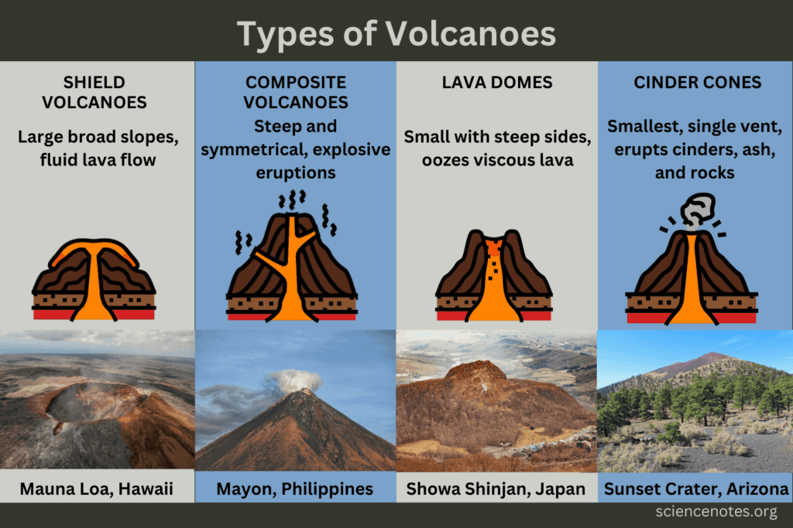

In "Understanding the Different Types of Volcanic Eruptions," you will gain insight into the fascinating world of volcanoes. From their formation at plate boundaries to the gradual creation of shield volcanoes, this article will explore the various eruption patterns and factors that contribute to their unique behavior. Discover the geographic distribution of volcanoes and the risks they pose to surrounding communities, as well as the benefits they provide through the enrichment of soil. By understanding volcanoes, we can better predict future activity and implement measures to mitigate potential hazards. Get ready to delve into the captivating world of volcanic eruptions and lava flows in this comprehensive guide.

This image is property of cdn.britannica.com.

## Classification of Volcanoes

Volcanoes can be classified based on various factors, including the frequency of eruptions, their structure, and their geographical location.

### Based on frequency of eruptions

Some volcanoes are known for their frequent eruptions, while others remain dormant for long periods of time. Volcanoes that have regular eruptions are referred to as "active volcanoes." These volcanoes often experience small, continuous eruptions, which release gases, ash, and lava. On the other hand, "dormant volcanoes" are those that have not erupted in a long time but have the potential to become active again in the future. Lastly, "extinct volcanoes" are those that have not erupted for thousands of years and are unlikely to erupt again.

### Based on structure

Volcanoes can also be classified based on their structure. Some volcanoes have a steep, conical shape and are referred to as "composite volcanoes" or "stratovolcanoes." These volcanoes are often characterized by their alternating layers of solidified lava, volcanic ash, and other materials. Another [type of volcano is the "shield](https://magmamatters.com/understanding-volcanic-formation-a-comprehensive-guide/ "Understanding Volcanic Formation: A Comprehensive Guide") volcano," which has a broad, gently sloping shape. This type of volcano is formed by the gradual accumulation of lava flows.

### Based on geography

Volcanoes are found in various geographical locations around the world. The "Ring of Fire" is a major volcanic belt that encircles the Pacific Ocean and is home to numerous active volcanoes. This region is characterized by intense tectonic activity, with tectonic plates colliding and sliding beneath one another. Other volcanic regions include the East African Rift, which stretches from Ethiopia to Mozambique, and the volcanic islands of Hawaii.

## Mechanisms of Volcanic Eruptions

Understanding the mechanisms of volcanic eruptions is crucial in predicting and mitigating their impacts. Several factors contribute to the eruption process, including tectonic plate boundaries, gas pressure, and the composition and viscosity of magma.

### Role of tectonic plate boundaries

Volcanic eruptions often occur along tectonic plate boundaries, where the Earth's crust is subject to intense geological activity. There are three main types of plate boundaries: divergent boundaries, convergent boundaries, and transform boundaries. Divergent boundaries, where plates move apart, often give rise to volcanic activity through the upwelling of magma from the mantle. Convergent boundaries, where plates collide, can result in volcanic eruptions as one tectonic plate subducts beneath another, melting the surrounding mantle and triggering volcanic activity. Transform boundaries, where plates slide past each other, may also experience volcanic eruptions due to the intense pressure and stress generated at these boundaries.

### Effects of gas pressure

Gas pressure plays a significant role in volcanic eruptions. When magma rises to the surface, gases dissolved in it are released due to decreasing pressure. This sudden release of gases can lead to explosive eruptions. The type and amount of gases present in the magma determine the explosivity of the eruption. Gases such as water vapor, [carbon dioxide](https://magmamatters.com/geothermal-energy-and-its-volcanic-origins/ "Geothermal Energy and Its Volcanic Origins"), and sulfur dioxide can cause magma to become more volatile, leading to more explosive eruptions.

### Influence of magma composition and viscosity

The composition and viscosity of magma also affect the eruption style of a volcano. Magma with high silica content is more viscous and tends to trap gases within it, resulting in explosive eruptions. On the other hand, magma with low silica content is less viscous and allows gases to escape more easily, leading to less explosive eruptions. The temperature of the magma also plays a role, with hotter magma being more fluid and less likely to result in explosive eruptions.

This image is property of sciencenotes.org.

## Strombolian Eruptions

Strombolian eruptions are a type of volcanic eruption characterized by relatively mild explosive activity. These eruptions are named after the Stromboli volcano in Italy, which has been erupting almost continuously for thousands of years.

### Characteristics of Strombolian eruptions

Strombolian eruptions are characterized by frequent, moderate-sized explosions. These explosions eject incandescent volcanic bombs, ash, and gas into the air. The explosions are typically rhythmic, occurring at regular intervals. The lava emitted during Strombolian eruptions is usually basaltic or andesitic in composition, which contributes to the relatively low viscosity of the magma. This low viscosity allows the gas bubbles within the magma to escape easily, resulting in mild explosive activity.

### Examples of Strombolian volcanoes

Apart from Stromboli, other volcanoes around the world have exhibited Strombolian eruption patterns. One such volcano is Mount Erebus in Antarctica, which is known for its frequent Strombolian eruptions. Another example is Karymsky Volcano in Russia, which has produced numerous Strombolian eruptions since its reactivation in the 20th century.

## Hawaiian Eruptions

Hawaiian eruptions are another type of volcanic eruption, characterized by continuous, relatively gentle lava flows. These eruptions are commonly associated with shield volcanoes in Hawaii.

### Defining features of Hawaiian eruptions

Hawaiian eruptions are known for their fluid basaltic lava, which allows the lava to flow freely and cover large areas. The lava often forms rivers or lakes of molten lava, creating stunning visual displays. These eruptions are typically non-explosive, as the low viscosity of the magma allows gases to escape easily. However, occasional explosive activity can occur if water interacts with the lava, resulting in steam-driven explosions.

### Examples of Hawaiian volcanoes

Hawaii is home to several shield volcanoes that have experienced Hawaiian eruptions. Kilauea, one of the world's most active volcanoes, has been erupting continuously since 1983. Mauna Loa, another prominent shield volcano in Hawaii, has a history of both Hawaiian and more explosive eruptions. The eruption patterns of these volcanoes showcase the unique characteristics of Hawaiian eruptions.

This image is property of www.visualcapitalist.com.

## Plinian Eruptions

Plinian eruptions are highly explosive volcanic eruptions named after the Roman writer Pliny the Younger, who witnessed the eruption of Mount Vesuvius in 79 AD.

### Typical manifestations of Plinian eruptions

Plinian eruptions are characterized by their explosive nature, sending volcanic ash, pumice, and gas high into the atmosphere. These eruptions often produce towering eruption columns that can reach several kilometers in height. The ash clouds generated during Plinian eruptions can travel long distances, posing a significant hazard to aviation and causing widespread ashfall. The viscosity of the magma in Plinian eruptions is usually high, resulting in a buildup of gas pressure within the volcano and explosive release during eruption.

### Noteworthy examples of Plinian volcanoes

Several volcanoes have exhibited Plinian eruption patterns throughout history. Mount Vesuvius, which famously buried the cities of Pompeii and Herculaneum, is one such volcano. Another example is Mount Pinatubo in the Philippines, which had a massive Plinian eruption in 1991. These eruptions serve as reminders of the devastating power and widespread impacts of Plinian eruptions.

## Phreatomagmatic Eruptions

Phreatomagmatic eruptions occur when magma interacts with water, resulting in explosive eruptions. These eruptions are driven by the rapid conversion of water into steam within the magma.

### What distinguishes phreatomagmatic eruptions

Phreatomagmatic eruptions are characterized by the interaction of magma and water. This can occur when magma comes into contact with groundwater or bodies of water such as lakes or oceans. The presence of water leads to the rapid expansion of steam within the magma, generating explosive activity. Phreatomagmatic eruptions often produce ash, volcanic bombs, and steam-driven explosions.

### Instances of phreatomagmatic volcanoes

One notable example of a phreatomagmatic volcano is Krakatoa, which experienced a catastrophic eruption in 1883. The eruption generated powerful explosions and tsunamis, causing widespread devastation. Another example is the Santorini volcano in Greece, which had a phreatomagmatic eruption around 3,600 years ago, resulting in the collapse of the volcano's caldera and the formation of the famous Santorini archipelago.

This image is property of www.nps.gov.

## Vulcanian Eruptions

Vulcanian eruptions are characterized by short, explosive bursts of volcanic activity. These eruptions are named after the Roman god of fire, Vulcan.

### Understanding Vulcanian eruption patterns

Vulcanian eruptions are caused by the buildup of gas pressure within a volcano. The high viscosity of the magma leads to the trapping of gases within the magma, resulting in explosive bursts of activity. These eruptions are typically short-lived and produce volcanic ash, pumice, and pyroclastic flows. The explosive nature of Vulcanian eruptions is often driven by the rapid decompression of magma as it reaches the surface.

### Volcanoes that have exhibited Vulcanian eruptions

Several volcanoes around the world have exhibited Vulcanian eruption patterns. One notable example is Mount St. Helens in the United States, which had a massive Vulcanian eruption in 1980. Another example is Mount Merapi in Indonesia, which has a history of Vulcanian eruptions. Studying volcanoes that have experienced Vulcanian eruptions provides valuable insights into the behavior and hazards associated with this type of eruption.

## Types of Volcanic Lava and Their Influences

Volcanic lava can vary in composition and flow characteristics, influencing the behavior and appearance of volcanic eruptions. Three common types of lava are aa lava flows, pahoehoe lava flows, and pillow lava flows.

### A'a lava flows

A'a lava flows are characterized by rough, clinkery surfaces. The term "a'a" comes from the Hawaiian language, reflecting the occurrence of these lava flows in Hawaii. A'a lava is usually high in viscosity, resulting in slow-moving, blocky lava flows. The rough, sharp texture of a'a lava is caused by the solidifying outer layer breaking into fragments as it advances. A'a lava flows can pose significant challenges to communities, as they are difficult to traverse and can cause extensive damage to infrastructure.

### Pahoehoe lava flows

Pahoehoe lava flows have a smooth, ropy surface and are often described as resembling molten wax. The term "pahoehoe" is also derived from the Hawaiian language. Pahoehoe lava is typically low in viscosity, allowing it to flow more easily and form smooth, undulating surface features. These lava flows can exhibit various textures, including twisted ropes, braids, and channels. Pahoehoe lava flows can advance more quickly than a'a lava flows, but they are less destructive due to their lower viscosity.

### Pillow lava flows

Pillow lava flows are unique formations that occur when lava erupts underwater or flows into bodies of water. The rapid cooling of the lava as it interacts with water causes it to solidify into pillow-shaped structures. These rounded, bulbous formations give pillow lava its name. Pillow lava flows can be found on the ocean floor as well as on land where volcanic activity has occurred underwater. Studying pillow lava flows provides insights into past volcanic activity and the interaction between lava and water.

This image is property of www.visualcapitalist.com.

## Hazards of Volcanic Eruptions

Volcanic eruptions can pose various hazards to both human populations and the environment. Understanding these hazards is crucial for developing effective mitigation strategies and ensuring the safety of communities living near active volcanoes.

### Explosion dangers

Explosive volcanic eruptions can pose immediate dangers to communities located near the volcano. The [pyroclastic flows generated during explosive eruptions can travel](https://magmamatters.com/the-environmental-impact-of-volcanic-eruptions-2/ "The Environmental Impact of Volcanic Eruptions") at high speeds, burying everything in their path. Ash clouds can also pose hazards to aviation, as volcanic ash can damage aircraft engines. Additionally, volcanic eruptions can produce lahars, which are fast-moving mudflows that can be triggered by heavy rainfall or the melting of snow and ice on the volcano's slopes.

### Lava flow hazards

Lava flows, particularly those with high viscosity, can pose hazards to communities in their path. Slow-moving, blocky lava flows like a'a lava flows can destroy buildings and infrastructure. Even faster-moving pahoehoe lava flows can cause damage and consume vegetation in their path. Communities located downslope from an active volcano must be prepared for potential lava flow hazards and have evacuation plans in place.

### Potential for climate impact

Volcanic eruptions can have a significant impact on the climate, particularly if they release large amounts of [sulfur dioxide](https://magmamatters.com/the-art-and-science-of-volcano-monitoring/ "The Art and Science of Volcano Monitoring") into the atmosphere. Sulfur dioxide can react with water vapor in the air to form sulfuric acid aerosols, which reflect sunlight and can lead to a temporary cooling effect on the Earth's surface. This phenomenon, known as "volcanic winter," can have global consequences, affecting weather patterns and agricultural productivity.

## Positive Impacts of Volcanic Activity

While volcanic eruptions can be destructive and pose hazards, they also have positive impacts on the surrounding environment and human society.

### Fertility benefits to surrounding soils

Volcanic eruptions release large amounts of minerals and nutrients into the surrounding soil. The ash and lava deposited during eruptions contain essential elements such as nitrogen, phosphorus, and potassium, which are vital for plant growth. Over time, the fertile soil created by volcanic activity can support lush vegetation and agriculture, providing communities with valuable resources.

### Geothermal energy production

Volcanic areas often have significant geothermal energy potential. The heat generated by volcanic activity can be harnessed to produce electricity and provide heating for nearby communities. Geothermal energy is a renewable and sustainable source of power that can help reduce reliance on fossil fuels and contribute to a cleaner energy future.

### Tourism potential

Volcanic landscapes attract tourists from around the world, offering unique opportunities for adventure and exploration. Volcano tourism provides economic benefits to local communities, supporting jobs in the hospitality, transportation, and tourism industries. Visitors can witness the awe-inspiring beauty of volcanic landscapes, explore lava caves, hike on volcanic slopes, and learn about the geological forces that shape our planet.

In conclusion, understanding the different types of volcanic eruptions, their causes, and their impacts is essential for assessing the risks associated with volcanoes and developing effective strategies for mitigating those risks. Whether it's the explosive Plinian eruptions, the gentle Hawaiian eruptions, or the rhythmic Strombolian eruptions, each type of eruption has its own unique characteristics and hazards. By studying volcanoes and their eruptions, we can further our understanding of these extraordinary natural phenomena and work towards better preparedness and resilience in the face of volcanic activity.

Related Posts: [Mitigating Risks: Forecasting Volcanic Activity in Prone Areas](https://magmamatters.com/mitigating-risks-forecasting-volcanic-activity-in-prone-areas/), [The Formation and Eruption Patterns of Volcanoes](https://magmamatters.com/the-formation-and-eruption-patterns-of-volcanoes-4/), [The Pyroclastic Phenomena of Pompeii: 7 Insights to Explore](https://magmamatters.com/the-pyroclastic-phenomena-of-pompeii-7-insights-to-explore/), [Tips for Capturing Volcano Pyroclastic Flow Photos](https://magmamatters.com/tips-for-capturing-volcano-pyroclastic-flow-photos/), [Understanding Volcanoes and Their Eruption Patterns](https://magmamatters.com/understanding-volcanoes-and-their-eruption-patterns/)
