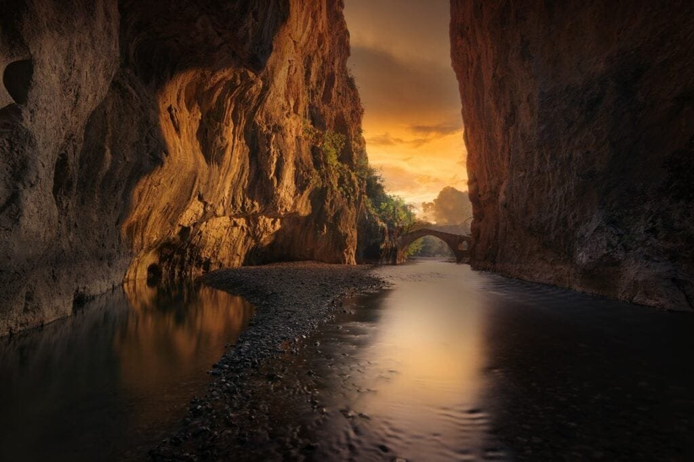
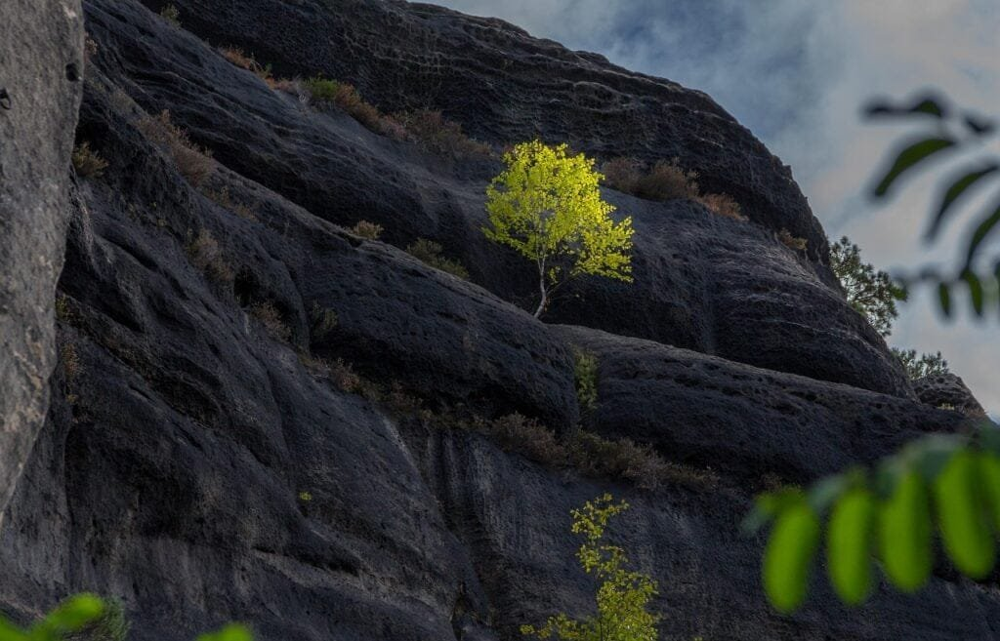

If you've ever been fascinated by the raw power and beauty of volcanoes, then understanding the different types of volcanoes is essential. Volcanoes are not just majestic mountains with fiery lava flowing down their slopes. They are dynamic features of the Earth's geology that can have a significant impact on our lives. From the explosive eruptions of stratovolcanoes to the gentle flow of lava from shield volcanoes, each type offers unique insights into the inner workings of our planet. By grasping the characteristics and distribution of these natural wonders, we can better prepare for potential disasters and harness the benefits they provide. So, let's delve into the fascinating world of volcanoes and discover the secrets they hold.

<iframe width="560" height="315" src="https://www.youtube.com/embed/cnKoTlUaqAs" frameborder="0" allow="accelerometer; autoplay; encrypted-media; gyroscope; picture-in-picture" allowfullscreen></iframe>

  

## Formation of Volcanoes

Volcanoes are formed when molten rock, gases, and debris escape to the earth's surface, resulting in eruptions of lava and ash. This volcanic activity occurs in various locations, including plate boundaries, hotspots under the earth's crust, and rift zones where tectonic plates are moving apart.

At plate boundaries, such as the notorious "Ring of Fire" encircling the Pacific Ocean, [volcanoes occur due to the intense seismic activity](https://magmamatters.com/the-art-and-science-of-volcano-monitoring/ "The Art and Science of Volcano Monitoring") resulting from the collision or separation of tectonic plates. The friction and pressure build-up in these zones cause the release of molten rock, gases, and debris, leading to volcanic eruptions.

Additionally, volcanoes can form over hotspots deep within the earth's mantle. Hotspots are areas where there is a concentration of heat, and magma rises to the surface, creating volcanic activity. This [type of volcano formation](https://magmamatters.com/understanding-volcanic-formation-a-comprehensive-guide/ "Understanding Volcanic Formation: A Comprehensive Guide") is evident in places like Hawaii, where shield volcanoes gradually form and erupt relatively gently over time.

Lastly, volcanoes can also occur in rift zones, where tectonic plates are moving apart. As the plates diverge, magma from the mantle can rise to fill the resulting gap, leading to volcanic eruptions in these areas.

## Types of Volcanoes

There are several distinct types of volcanoes, each with its own unique characteristics. These types include [cinder cone](https://magmamatters.com/the-birth-of-new-land-understanding-cinder-cones/) volcanoes, composite volcanoes, shield volcanoes, and lava domes.

Cinder cone volcanoes are characterized by their steep slopes and conical shape. They are usually composed of loose, fragmented volcanic material called cinders. Cinder cone volcanoes often have a single vent from which the eruption occurs, resulting in relatively short-lived eruptions.

Composite volcanoes, also known as stratovolcanoes, are tall and symmetrical with steep slopes. These volcanoes are built up by alternating layers of lava flows, ash, and other volcanic debris. Their eruptions can be explosive and violent due to the high viscosity of the magma.

Shield volcanoes, like those found in Hawaii, have gentle slopes and a broad, shield-like shape. These volcanoes are formed by the accumulation of fluid lava flows that spread out in all directions. Shield volcanoes typically have less explosive eruptions compared to other types.

Lava domes are formed when highly viscous magma is squeezed out of a volcano and forms a dome-shaped mound. These domes can grow slowly over time as the magma pushes upwards. Lava domes are often associated with explosive eruptions due to the pressure building up within the dome.

This image is property of pixabay.com.

## Volcanic Eruption Patterns

The patterns of volcanic eruptions can vary depending on factors such as lava viscosity and gas content.

Lava viscosity refers to the resistance of lava to flow. High-viscosity lava, such as that found in composite volcanoes, tends to trap gas bubbles, resulting in explosive eruptions. On the other hand, low-viscosity lava, like the one found in shield volcanoes, allows gas to escape more easily, resulting in less explosive eruptions characterized by continuous lava flows.

The gas content within the magma also plays a crucial role in eruption patterns. When magma contains a high concentration of gas, it can lead to explosive eruptions as the pressure builds up within the volcano. In contrast, magma with lower gas content is more likely to result in effusive eruptions characterized by the gentle release of lava.

Comparing violent and less explosive eruptions, violent eruptions are typically associated with composite volcanoes due to the high viscosity of their magma and the trapped gas bubbles. These eruptions can shoot large volumes of ash, rock fragments, and pyroclastic flows into the air, posing significant risks to nearby communities. In contrast, eruptions from shield volcanoes tend to be less explosive and more characterized by the steady flow of lava.

## The Ring of Fire

The "Ring of Fire" is a region encircling the Pacific Ocean where a large number of active volcanoes are located. This region is aptly named due to the high frequency of earthquakes and volcanic activity present.

Volcanoes within the Ring of Fire are situated atop tectonic plate boundaries, making them highly prone to volcanic eruptions. The movement and interaction of these plates result in significant seismic activity, leading to the formation of volcanoes in this area.

The frequency of volcanic eruptions within the Ring of Fire is notably high compared to other regions. The continual subduction and collision of tectonic plates generate intense pressure and friction, causing frequent volcanic activity. The explosive eruptions within the Ring of Fire have the potential to affect not only the nearby regions but also global climatic conditions.

Notable volcanoes within the Ring of Fire include Mount St. Helens in the United States, Mount Fuji in Japan, Mount Vesuvius in Italy, and Mount Pinatubo in the Philippines. These volcanoes have left a significant impact on their respective regions and have shaped the surrounding landscapes.

This image is property of pixabay.com.

## Volcanoes in Hawaii

Hawaii is home to some of the most prominent shield volcanoes in the world, thanks to its unique geology and location. These volcanoes, including Mauna Loa and Kilauea, have formed gradually over hotspots deep underground, resulting in the formation of vast volcanic landscapes.

The eruptions in Hawaii are distinctive due to their relatively low explosivity. Shield volcanoes typically produce lava flows that move down their gentle slopes rather than explosive eruptions seen in other types. The lava from these eruptions can be extremely hot and fluid, allowing it to travel significant distances before cooling and solidifying.

In recent years, the eruption of Kilauea volcano attracted worldwide attention. The eruption began in 2018, leading to the destruction of homes and the reshaping of the island's landscape. This event highlighted the dynamic nature of volcanoes and emphasized the need for ongoing monitoring and preparedness in volcanic regions.

## Geographic Distribution of Volcanoes Worldwide

Volcanoes can be found across different continents, reflecting the dynamic nature of our planet's geology. They are particularly concentrated in specific regions known as high-activity areas.

Volcanoes are distributed across all continents, although some regions have a higher concentration than others. The "Ring of Fire" in the Pacific Ocean is a prime example of this, but there are also active volcanoes in regions such as the Andes in South America, the Kamchatka Peninsula in Russia, and the East African Rift. These areas are known for their intense volcanic activity due to tectonic plate boundaries and hotspot locations.

Within these high-activity regions, several noteworthy or unique volcanoes stand out. Mount Etna in Italy is Europe's most active volcano, frequently erupting and shaping the landscape of Sicily. Mount Kilimanjaro, located in Tanzania, is a stratovolcano and the tallest peak in Africa. It is notable for its volcanic formations and glaciers, attracting hikers and adventurers from around the world.

This image is property of pixabay.com.

## Volcano-Generated Hazards

Volcanic eruptions can unleash a variety of hazards that pose significant risks to both human and natural environments. The following hazards can occur during volcanic activity:

1. Devastating Explosions: Volcanic explosions, especially those associated with composite volcanoes, can eject large amounts of ash, rock fragments, and pyroclastic flows. These materials can cause significant damage to buildings, infrastructure, and pose a threat to human life.
    
2. Lava Flows: The release of lava during volcanic eruptions can result in the destruction of vegetation, homes, and infrastructure in its path. The extreme heat and fluidity of lava make it extremely dangerous to anything in its proximity.
    
3. Ashfall and its Impact: Volcanic ash, consisting of fine glassy particles, can be carried by wind over long distances. When it accumulates on the ground, it can disrupt transportation, damage crops, and pose health risks to humans and animals when inhaled.
    
4. Toxic Gases: Volcanic eruptions can release toxic gases such as sulfur dioxide, carbon dioxide, and hydrogen sulfide. These gases, when trapped in low-lying areas, can displace oxygen and pose a significant threat to human and animal health.
    
5. Tsunamis and Landslides: Volcanic activity, particularly underwater eruptions or flank collapses, can trigger tsunamis. These massive ocean waves can cause devastation along coastlines. Additionally, volcanic eruptions can destabilize the surrounding slopes, leading to landslides and mudflows which further contribute to the destruction.
    

## Benefits of Volcanoes

While volcanic eruptions can cause destructive natural disasters, volcanic activity also brings several key benefits to the surrounding ecosystems and human societies.

1. Nutrient Supply to Soil: Volcanic ash deposited during eruptions is rich in minerals and nutrients. Over time, this ash breaks down and enriches the soil, providing essential nutrients for plant growth. Thus, volcanic regions often have highly fertile soil, supporting agriculture and vegetation.
    
2. Formation of New Land: Volcanic eruptions can lead to the formation of new land. Lava flows that cool and solidify over time build up the earth's surface, creating new land masses. This process has played a significant role in the formation and expansion of islands such as Hawaii.
    
3. Geothermal Energy: [Volcanic areas often possess a significant amount of geothermal energy](https://magmamatters.com/geothermal-energy-and-its-volcanic-origins/ "Geothermal Energy and Its Volcanic Origins"). Geothermal power plants harness this energy by utilizing the heat from volcanic activity to generate electricity and provide heating for nearby communities.
    
4. Tourism and Agriculture Potential: Volcanoes, with their stunning landscapes and unique geological formations, attract tourists from around the world. These tourists often contribute to the local economy, generating revenue and supporting jobs in the tourism industry. Additionally, volcanic regions are often ideal for growing certain crops due to the fertile soil and favorable climates provided by volcanic activity.
    

## Predicting Volcano Activity

Predicting volcanic eruptions can be challenging but is essential for mitigating risks and ensuring the safety of nearby communities. Several indicators can help scientists monitor and predict volcanic activity:

1. Seismic Activity: Monitoring the frequency and intensity of earthquakes near a volcano can provide valuable insights into the movement of magma beneath the surface. An increase in seismic activity can indicate the rise of magma and an impending eruption.
    
2. Gas Emissions: Measuring the composition and volume of gases released by a volcano can offer vital information about the state of the magma chamber. Changes in gas emissions, such as an increase in sulfur dioxide, can suggest an imminent eruption.
    
3. Ground Deformation: Monitoring changes in the shape of a volcano's surface can indicate the movement of magma and the potential for an eruption. Techniques such as GPS and satellite-based radar systems can detect even subtle changes in ground deformation.
    
4. Hydrologic Signals: Changes in the temperature, chemistry, or level of nearby water bodies, such as lakes or groundwater, can provide clues about volcanic activity. The interaction between hot magma and water can cause noticeable changes in hydrological systems.
    

By combining data from these various monitoring methods, scientists can develop models and forecasts to predict volcanic activity to a certain degree of accuracy. These predictions allow for early warning systems to be implemented, giving nearby communities time to evacuate and minimize the potential impact of eruptions.

## Volcano Eruption Survival Kit

Living near a volcano requires preparedness in case of an eruption. Having a well-equipped volcano eruption survival kit can make a significant difference in ensuring your safety and survival. Here are some essential items to include in your survival kit:

1. Protective Gear: Include items such as goggles, face masks, and gloves to protect your eyes, respiratory system, and skin from volcanic ash, gases, and heat.
    
2. Emergency Supplies: Pack enough food, water, and medication to sustain you and your family for at least 72 hours. Include a portable water filter or purification tablets to ensure a continuous supply of clean drinking water.
    
3. First Aid Kit: Include basic medical supplies such as bandages, antiseptic wipes, pain relievers, and any necessary prescription medications.
    
4. Battery-Powered Radio: In the event of power outages, a battery-powered radio can provide critical updates and instructions from local authorities.
    
5. Flashlights and Batteries: Ensure you have reliable light sources available for navigating in the dark during power outages or emergency situations.
    
6. Emergency Shelter: Pack lightweight tents, sleeping bags, blankets, or tarps that can provide temporary shelter in case you need to evacuate or find yourself stranded.
    
7. Personal Documents: Keep copies of important documents like identification cards, passports, insurance policies, and emergency contact information in a waterproof pouch.
    
8. Tools and Supplies: Include a multi-tool, duct tape, a whistle, and waterproof matches. These items can be useful in various emergency situations.
    

Planning for evacuation is crucial in volcanic regions. Identify evacuation routes, emergency shelters, and designated meeting points for your family. Stay informed about local evacuation plans and follow instructions from local authorities in the event of an eruption.

During an eruption, it is essential to stay safe and endure ashfall and gases. Stay indoors as much as possible, keeping windows and doors closed. If you need to venture outdoors, use protective gear and cover your nose and mouth with a damp cloth to reduce the inhalation of ash and gases.

In the event of a lava flow, it is crucial to avoid direct contact with the molten lava. Lava can reach extremely high temperatures and cause severe burns. Follow local emergency guidelines and stay away from areas where lava flows are occurring.

After an eruption, recovery efforts will be necessary. Be prepared to clean up ashfall, repair damage to your property, and support your community in rebuilding. Follow instructions from local authorities on the safe disposal of ash and debris.

Understanding the nature of volcanic eruptions, being prepared, and taking necessary precautions can help ensure your safety and mitigate the potential risks associated with living in volcanic regions.

