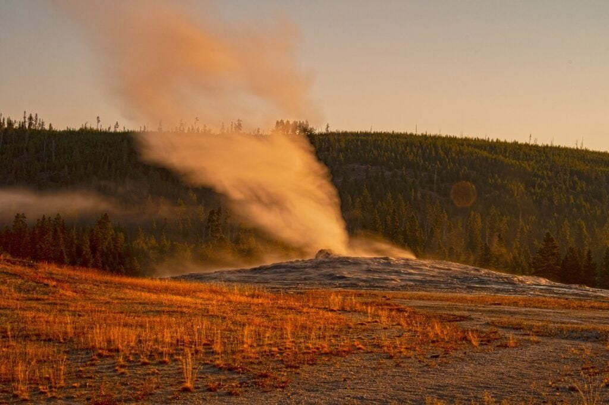

Are you curious about the economics of volcano-based geothermal energy? Volcanoes, with their underground heat and abundance of steam, have the potential to be a valuable source of renewable energy. This article will provide you with a deeper understanding of the subject, exploring the various types of volcanoes, their geographic distribution, eruption causes, hazards, and benefits. Armed with this knowledge, you can delve into the top 10 tips for understanding the economics of volcano-based geothermal energy. So, let's explore the fascinating world of volcanoes and the potential they hold for harnessing clean, sustainable energy.

This image is property of pixabay.com.

## Basics of Volcano-Based Geothermal Energy

Geothermal energy refers to the heat energy trapped beneath the Earth's surface that can be harnessed and converted into electricity. Volcano-based geothermal energy, as the name suggests, utilizes the heat generated by volcanic activity for this purpose.

The creation process of geothermal energy from [volcanoes](https://magmamatters.com/understanding-volcanic-formation-a-comprehensive-guide/ "Understanding Volcanic Formation: A Comprehensive Guide") involves the interaction of magma with underground water reservoirs. When magma rises to the surface during volcanic eruptions, it heats the surrounding water, forming underground reservoirs of steam and hot water. This trapped heat can then be tapped into to generate electricity.

## Factors Affecting the Production of Volcano-Based Geothermal Energy

Several factors influence the production of geothermal energy from volcanoes. The main factor is the temperature gradient, which determines the amount of heat available for conversion. The higher the temperature gradient, the more potential for generating electricity.

The geological structure of the region also plays a crucial role. The presence of permeable rocks and fractures allows for the movement of water and steam, making it easier to extract geothermal energy. Conversely, impermeable rocks can hinder the extraction process.

Another factor is the water recharge rate of the underground reservoirs. If the rate at which water is replenished is high, it allows for sustained energy extraction. However, if the recharge rate is low, it can lead to a depletion of the resources over time.

<iframe width="560" height="315" src="https://www.youtube.com/embed/Q_pX5ZzkRg4" frameborder="0" allow="accelerometer; autoplay; encrypted-media; gyroscope; picture-in-picture" allowfullscreen></iframe>

  

## Comparison Between Geothermal Energy and Other Renewable Energy Sources

Geothermal energy offers several advantages over other renewable energy sources. Unlike solar and wind energy, which are intermittent and dependent on weather conditions, geothermal energy is available 24/7. This makes it a reliable and consistent source of power.

When compared to fossil fuels, geothermal energy is much cleaner and environmentally friendly. It produces no greenhouse gas emissions or air pollutants during the electricity generation process, contributing to a significant reduction in carbon footprint.

Furthermore, geothermal energy is highly efficient as it converts a large percentage of the heat energy into electricity. This efficiency surpasses that of traditional power plants, making geothermal energy an attractive option for sustainable power generation.

## Geographic Distribution of Volcanoes and Geothermal Energy

Volcanic regions are best suited for the extraction of geothermal energy due to the abundance of heat generated by volcanic activity. These regions are often found along plate boundaries, hotspots, and rift zones.

The "Ring of Fire" is a well-known volcanic region encircling the Pacific Ocean. This area is highly active and experiences frequent volcanic eruptions. As a result, it possesses immense geothermal potential, making it a prime location for extracting volcanic-based geothermal energy.

Hotspots and rift zones are also important geothermal regions. Hotspots, such as those found in Hawaii, are locations beneath the Earth's surface where a column of hot magma rises. This underlying heat source can provide continuous geothermal energy.

Rift zones are areas where Earth's tectonic plates are moving apart, resulting in volcanic activity. These zones, like the East African Rift, contain numerous volcanoes that release large amounts of heat energy, making them ideal for geothermal energy extraction.

This image is property of pixabay.com.

## Technologies Employed in Extraction and Conversion of Geothermal Energy

Geothermal power stations are used to harness and convert geothermal energy into electricity. The three main types of geothermal power plants are dry steam, flash steam, and binary cycle.

Dry steam power plants utilize high-pressure steam directly from underground reservoirs to drive turbines and generate electricity. Flash steam power plants, on the other hand, separate hot water from the reservoirs into steam and liquid, using the high-pressure steam to drive turbines.

Binary cycle power plants are designed for lower temperature reservoirs. They utilize a heat exchanger to transfer heat from the geothermal fluid to a secondary fluid with a lower boiling point. The secondary fluid then generates steam to drive turbines and produce electricity.

Advancements in geothermal energy [technology](https://magmamatters.com/the-art-and-science-of-volcano-monitoring/ "The Art and Science of Volcano Monitoring") are continuously being made. Enhanced Geothermal Systems (EGS) are a promising new technology that involves creating artificial reservoirs by injecting water into hot rocks. This expands the potential for geothermal energy extraction to regions with lower naturally occurring heat reservoirs.

## Economic Evaluation of Volcano-Based Geothermal Energy

The cost factors involved in harnessing geothermal energy primarily depend on the depth and temperature of the reservoirs, as well as the technology employed for extraction. Initial exploration and drilling costs can be significant, but once a plant is operational, the cost of production becomes relatively low.

When compared to other energy sources, geothermal energy's production costs are competitive. It can even be cheaper than fossil fuel-based power plants in some cases. Additionally, geothermal energy is not subject to fluctuations in fuel prices, providing stability to the energy market.

The financial benefits inherent in exploiting geothermal energy are significant. The revenue generated from the sale of electricity can contribute to local economies and provide employment opportunities. Governments can also benefit from tax revenues and reduced dependence on imported fuels.

This image is property of pixabay.com.

## Role of Government Policies and Incentives

State and federal policies play a crucial role in supporting and promoting the growth of geothermal energy. Governments can provide financial incentives such as grants, tax credits, and loan guarantees to encourage investment in geothermal projects.

Feed-in tariffs, which guarantee a fixed price for geothermal electricity, incentivize the development of geothermal power plants. Governments can also facilitate the permitting and regulatory processes, making it easier for companies to establish geothermal projects.

Successful government interventions can be seen in countries like Iceland and New Zealand. Iceland has embraced geothermal energy as a primary source of electricity and heating, thanks to supportive policies and incentives. New Zealand has also harnessed its geothermal resources, becoming a global leader in geothermal energy generation.

## Environmental Impact of Geothermal Energy Extraction

Geothermal energy extraction does have some environmental impacts, but they are generally minimal compared to other energy sources. The drilling process can disrupt the local ecosystem, but measures can be taken to mitigate these impacts.

Geothermal power plants produce significantly lower emissions compared to fossil fuel-based power plants. The carbon footprint of geothermal energy is much lower, contributing to the reduction of greenhouse gas emissions. This makes geothermal energy a clean and sustainable alternative to traditional energy sources.

To minimize environmental impacts, geothermal projects can employ strategies such as re-injecting the geothermal fluid back into the reservoir, preventing the release of harmful chemicals. Proper monitoring and assessment of potential impacts are essential to ensure responsible geothermal energy extraction.

## Market Trends in Geothermal Energy

The market size for geothermal energy is steadily growing as countries recognize the value of renewable energy sources. The global geothermal energy market is estimated to reach billions of dollars in the coming years, driven by increasing demand for clean and sustainable energy.

Emerging markets for geothermal energy include regions with untapped geothermal potential, such as parts of Africa, Southeast Asia, and Central America. These regions have the opportunity to develop their geothermal resources and meet their energy needs sustainably.

Market trends in geothermal energy are influenced by factors such as government policies, technological advancements, and public awareness of [climate change](https://magmamatters.com/geothermal-energy-and-its-volcanic-origins/ "Geothermal Energy and Its Volcanic Origins"). As more countries commit to reducing carbon emissions, the demand for geothermal energy is expected to rise.

## Opportunities and Challenges in Geothermal Energy Industry

The geothermal industry presents significant opportunities for growth. As technology improves, geothermal resources once deemed unviable can now be economically and environmentally utilized. Expanding the capacity and reach of geothermal power plants can contribute to a more sustainable energy future.

However, several challenges need to be overcome. The initial high costs of exploration and drilling can deter investment. Geological uncertainties pose further risks in terms of resource availability. Addressing these challenges requires collaboration between governments, investors, and technology providers.

Technological advancements play a critical role in overcoming these challenges. Research and development in areas such as EGS, advanced drilling techniques, and resource assessment methods can lead to more efficient and cost-effective geothermal projects.

## Implication on Energy Security and Independence

Geothermal energy has significant implications for energy security, particularly for countries heavily dependent on imported fossil fuels. By utilizing their own geothermal resources, countries can reduce their reliance on foreign fuel sources, enhancing their energy security.

Geothermal energy also contributes to energy independence by diversifying the energy mix. As a domestic energy source, it helps to stabilize energy prices and reduce vulnerability to fluctuating global fuel markets. This stability benefits both consumers and national economies.

Furthermore, geothermal energy can provide a buffer against energy shortages during times of peak demand or supply disruptions. The continuous availability of geothermal power makes it a reliable source of electricity, ensuring a consistent power supply for various sectors.

## Case Studies of Economies Harnessing Volcano-Based Geothermal Energy

Several countries have successfully implemented volcano-based geothermal energy and reaped the benefits. Iceland is a prime example, utilizing its abundant geothermal resources to meet the majority of its electricity and heating needs. Geothermal energy has become a crucial part of Iceland's economy, supporting local industries and creating jobs.

The Philippines is another success story, with geothermal energy accounting for a significant portion of its power generation. The country has developed geothermal fields across multiple volcanic regions, harnessing the power of its natural resources to achieve energy independence and reduce carbon emissions.

Both countries serve as examples of how government support, favorable policies, and incentives can drive the successful adoption and implementation of geothermal energy.

Lessons learned from these countries include the importance of long-term planning, community engagement, and collaboration between the public and private sectors. Sharing best practices can help other economies harness the potential of volcano-based geothermal energy and achieve their energy goals.

