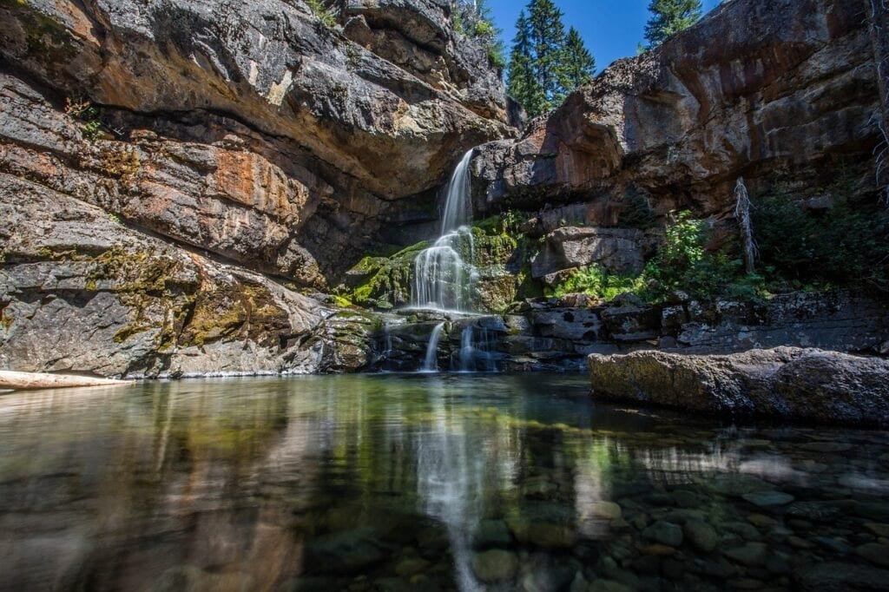

In "Understanding the Formation and Behavior of Volcanoes," you will explore the fascinating world of these geological phenomena. Volcanoes, formed through the release of molten rock, gases, and debris, can erupt with breathtaking displays of lava and ash. Their formation occurs at plate boundaries, hotspots within the earth's crust, or rift zones. From the explosive eruptions along the "Ring of Fire" to the gradual formation of shield volcanoes in Hawaii, each type of volcano has its own unique characteristics. By understanding the different eruption patterns, factors such as lava viscosity and gas content, and the potential hazards and benefits they bring, we can predict future activity and protect surrounding communities. Get ready to delve into the captivating history and features of these iconic volcanoes.

This image is property of pixabay.com.

## Formation of Volcanoes

Volcanoes form through a complex process involving the movement of tectonic plates and the release of molten rock, gases, and debris from the Earth's interior. This process is known as volcanic activity, and it results in the creation of spectacular geological formations that shape our planet's landscape.

### Process of volcano formation

Volcanoes are primarily formed at three types of settings: plate boundaries, hotspots, and rift zones. Plate boundaries are areas where tectonic plates collide, separate, or slide past each other. This movement creates the conditions for magma to rise to the surface and form volcanoes. Hotspots, on the other hand, are areas of intense volcanic activity that are not directly associated with plate boundaries. These hotspots are believed to be caused by a localized source of heat deep within the Earth's mantle. Finally, rift zones occur where tectonic plates are moving apart, leading to the formation of new crust and volcanic activity.

### Role of tectonic plates

Tectonic plates are large, rigid pieces of Earth's lithosphere that float on the semi-fluid asthenosphere beneath them. The movement of these plates is driven by various forces, including the upwelling of magma from the underlying mantle. When two plates collide, one plate may be forced beneath the other in a process known as subduction. This subduction creates immense pressure and heat, causing the melting of rock and the formation of magma chambers. Eventually, this magma rises to the surface, forming volcanoes.

### Impact of plate boundaries

Plate boundaries are crucial in the formation of volcanoes. When two plates move apart, a gap is created, allowing magma from the mantle to rise and fill the void. This leads to the formation of shield volcanoes and rift zones. On the other hand, when two plates collide, the subduction of one plate beneath the other creates intense pressure and heat, triggering volcanic activity. These types of volcanoes are known as composite volcanoes and are characterized by explosive eruptions.

### The concept of hotspots

Hotspots are areas of intense volcanic activity that are not directly associated with plate boundaries. Instead, they are thought to be caused by a localized source of heat deep within the Earth's mantle. As tectonic plates move over these hotspots, volcanic activity occurs. Hotspot volcanoes, such as those found in Hawaii, are known for their relatively calm and non-explosive eruptions. These volcanoes can form shield volcanoes, which are broad, gently sloping mountains.

## Types of Volcanoes

Volcanoes come in different shapes and sizes, each with its unique characteristics and eruption styles. [Understanding these different types of volcanoes](https://magmamatters.com/understanding-volcanic-formation-a-comprehensive-guide/ "Understanding Volcanic Formation: A Comprehensive Guide") provides insight into their formation and behavior.

### Shield volcanoes

Shield volcanoes are characterized by their broad, gently sloping sides and low profiles. They form over hotspots or in areas of extensive volcanic activity, such as the Hawaiian Islands. Shield volcanoes are built up by the accumulation of numerous layers of fluid lava flows that spread out in all directions from the central vent. These eruptions are typically non-explosive and result in the gradual growth of the volcano over time.

### Composite volcanoes

Composite volcanoes, also known as stratovolcanoes, are tall, steep-sided mountains that result from explosive eruptions. They are formed at convergent plate boundaries, where two tectonic plates collide, and one is forced beneath the other, causing intense pressure and melting of rock. Composite volcanoes are characterized by alternating layers of lava flows, ash, and pyroclastic materials. They can have violent and explosive eruptions due to the buildup of pressure caused by the thick and viscous magma.

### Cinder cone volcanoes

[Cinder cone](https://magmamatters.com/the-birth-of-new-land-understanding-cinder-cones/) volcanoes are the simplest and smallest type of volcano. They are formed by the accumulation of loose volcanic debris, such as cinders, ash, and scoria, around a single vent. Cinder cones are often found in volcanic fields and can be formed during a single eruption. They are typically short-lived and have relatively small eruptions that produce fire fountains and explosive bursts of gas and volcanic ash.

This image is property of pixabay.com.

## Geographic Distribution of Volcanoes

Volcanoes are not evenly distributed across the globe. Instead, they tend to cluster in certain regions, providing unique insights into our planet's tectonic activity and geological history.

### Distribution along the 'Ring of Fire'

The 'Ring of Fire' is a term used to describe a region encircling the Pacific Ocean that is highly prone to volcanic activity and earthquakes. It is home to a significant portion of the world's active volcanoes, including some of the most famous ones like Mount Fuji in Japan and Mount St. Helens in the United States. The 'Ring of Fire' is formed by the collision and subduction of several tectonic plates, leading to intense volcanic activity along their boundaries.

### Volcanoes in rift zones

Rift zones are areas where tectonic plates are moving apart, creating gaps in the Earth's crust. These gaps allow magma from the mantle to rise to the surface, resulting in the formation of volcanic activity. Rift zones can be found in various locations around the world, such as the East African Rift in Africa and the Mid-Atlantic Ridge. The volcanoes formed in these regions are often characterized by their elongated shapes and frequent volcanic eruptions.

### Isolated hotspot volcanoes

Hotspot volcanoes are not confined to plate boundaries or rift zones. Instead, they occur at isolated locations and are thought to be caused by localized sources of intense heat beneath the Earth's crust. Examples of isolated hotspot volcanoes include the Hawaiian Islands and Yellowstone National Park. These areas are known for their unique and diverse volcanic landscapes, which are the result of prolonged volcanic activity associated with deep-seated mantle plumes.

## Volcanic Eruptions

Volcanic eruptions are powerful geological events that release tremendous amounts of energy, heat, and materials from the Earth's interior. Understanding the mechanics of volcanic eruptions is essential for predicting and mitigating the associated hazards.

### Eruption mechanics

Volcanic eruptions occur when the pressure within a magma chamber exceeds the strength of the surrounding rocks, causing the magma to be forcefully expelled to the surface. The factors that determine the explosiveness of an eruption include the composition and viscosity of the magma, the amount of dissolved gases, and the physical characteristics of the volcano's vent. Explosive eruptions are often the result of thick and viscous magma that traps gases, leading to the buildup of pressure. Non-explosive eruptions, on the other hand, are characterized by fluid lava flows that can travel great distances from the vent.

### Variation in eruption styles

Volcanic eruptions can vary widely in their style and intensity. Some eruptions produce towering ash plumes, while others generate lava flows that slowly creep down the volcano's slopes. The style of eruption is influenced by factors such as the composition of the magma, the presence of volatile gases, and the shape of the volcanic vent. Explosive eruptions, such as those seen at composite volcanoes, are often characterized by the ejection of ash, pyroclastic flows, and volcanic bombs. In contrast, effusive eruptions, commonly observed at shield volcanoes, involve the relatively calm release of lava flows and lava fountains.

### Factors influencing eruption patterns

Several factors can influence the patterns and frequency of volcanic eruptions. The viscosity of the magma plays a crucial role in determining whether an eruption will be explosive or non-explosive. High-viscosity magma tends to trap gases, leading to the buildup of pressure and explosive eruptions. Conversely, low-viscosity magma allows gases to escape more easily, resulting in less explosive eruptions. Other factors that influence eruption patterns include the amount of magma available, the presence of fractures and weaknesses in the volcanic edifice, and the level of tectonic activity in the region.

This image is property of pixabay.com.

## Volcanic Hazards

Volcanic eruptions can pose significant hazards to both human populations and the surrounding environment. Understanding these hazards is essential for developing effective risk mitigation strategies.

### Lava flows

Lava flows are one of the most well-known volcanic hazards. These rivers of molten rock can travel at high speeds, destroying everything in their path. Although they typically move slowly, lava flows can be unpredictable and change direction, putting nearby communities and infrastructure at risk. The temperature of lava can reach several thousand degrees Fahrenheit, causing severe burns and resulting in the destruction of property.

### Ashfall

Volcanic ash is another hazardous byproduct of volcanic eruptions. Fine ash particles can be carried by wind over long distances, blanketing vast areas in a layer of fine dust. Volcanic ash is highly abrasive and can cause damage to buildings, vehicles, and agricultural crops. Breathing in ash can also pose significant health risks, particularly for individuals with respiratory problems. Ashfall can disrupt air travel, leading to the closure of airports and the cancellation of flights.

### Pyroclastic flows

Pyroclastic flows are dense, fast-moving currents of hot gas, ash, and other volcanic materials that race down the slopes of a volcano during an eruption. These flows can reach speeds of up to several hundred miles per hour and can travel several miles from their source. Pyroclastic flows are devastating and can cause widespread destruction, burying everything in their path. The high temperatures of pyroclastic flows can incinerate vegetation and cause severe burns to anyone caught in their path.

### Volcanic landslides and debris avalanches

During volcanic eruptions, the structural integrity of the volcanic edifice can be compromised, leading to landslides and debris avalanches. These mass movements can occur rapidly, burying surrounding areas and generating destructive waves if they reach bodies of water. Volcanic landslides and debris avalanches can cause significant damage to infrastructure and pose a considerable risk to human life.

## Human Interaction with Volcanoes

Throughout history, humans have been both fascinated and affected by volcanoes. As our understanding of these [natural phenomena](https://magmamatters.com/the-art-and-science-of-volcano-monitoring/ "The Art and Science of Volcano Monitoring") has grown, so too has our ability to mitigate the risks associated with volcanic activity.

### Risk mitigation strategies

To minimize the impact of volcanic eruptions, communities living in volcanic regions have developed various strategies to mitigate the associated risks. These strategies include the establishment of exclusion zones, the development of early warning systems, and the implementation of evacuation plans. By identifying high-risk areas and educating local populations about volcanic hazards, authorities can reduce the potential loss of life and property caused by volcanic eruptions.

### Volcano monitoring and prediction

Advancements in technology have significantly improved our ability to monitor and predict volcanic activity. Scientists employ a range of tools and techniques, such as seismometers, gas analyzers, and satellite imagery, to detect and monitor changes in volcanic behavior. By analyzing these data, scientists can identify patterns and potential signs of an impending eruption, allowing authorities to issue timely warnings and coordinate evacuation efforts. While predicting volcanic eruptions with 100% accuracy is still a challenge, continuous monitoring provides valuable information that helps mitigate the risks associated with volcanic activity.

### Impact of volcanoes on human settlements

Volcanic eruptions can have a profound impact on human settlements, both in terms of immediate destruction and long-term consequences. Volcanic eruptions can bury entire towns and villages under layers of lava, ash, and debris, rendering them uninhabitable. The destruction of infrastructure, such as roads and buildings, can disrupt transportation networks and hinder recovery efforts. Additionally, ashfall from volcanic eruptions can contaminate water supplies, damage agricultural crops, and impact air quality, affecting the overall quality of life for nearby communities.

## Positive Effects of Volcanoes

Although volcanic eruptions can cause devastation, they also have positive effects on the environment and human societies. These positive effects are a result of the unique properties of volcanic materials.

### Nutrient-rich volcanic soil

Volcanic eruptions enrich the soil surrounding volcanic regions by depositing nutrient-rich volcanic ash and pyroclastic materials. These materials increase soil fertility, providing essential nutrients for plant growth. Volcanic soil is highly prized by farmers and is often used for agriculture, leading to abundant crop yields and vibrant ecosystems.

### Generation of geothermal energy

Volcanoes are a natural source of geothermal energy. Geothermal energy is harnessed by utilizing the heat stored within the Earth's crust, often near active volcanic areas. Geothermal power plants use the heat from underground reservoirs to generate electricity and heat buildings. This renewable and sustainable energy source reduces reliance on fossil fuels and helps mitigate the impact of [climate change](https://magmamatters.com/geothermal-energy-and-its-volcanic-origins/ "Geothermal Energy and Its Volcanic Origins").

### Formation of natural resources

Volcanic activity plays a vital role in the formation of various natural resources. Mineral deposits, such as gold, silver, and copper, can be found in volcanic regions. Volcanic processes also contribute to the creation of gemstones, such as diamonds and opals. Additionally, volcanic eruptions can lead to the formation of new land, which can be valuable for land reclamation and ecosystem development.

## Iconic Volcanoes

Certain volcanoes throughout history have left an indelible mark on human civilization, either through their features, historical significance, or the impact of their eruptions. Examining these iconic volcanoes can provide valuable insights into the behavior and characteristics of volcanoes.

### Features and history of Mount Vesuvius

Mount Vesuvius is one of the most famous and iconic volcanoes in the world. Located near the city of Naples, Italy, it is notorious for its devastating eruption in AD 79, which buried the ancient Roman cities of Pompeii and Herculaneum. Mount Vesuvius is classified as a composite volcano and has a long history of eruptive activity. Today, it is closely monitored to minimize the risks to the surrounding population.

### Study of Krakatoa

Krakatoa, a volcanic island located in Indonesia, is known for one of the most powerful and destructive eruptions in history. The eruption of Krakatoa in 1883 resulted in a series of massive explosions and caused tsunamis that killed thousands of people. The eruption was so powerful that it generated shockwaves that circled the Earth multiple times. The study of Krakatoa has been instrumental in understanding the devastating effects of volcanic eruptions on a global scale.

### Implications of the eruption of Mount St. Helens

The eruption of Mount St. Helens in 1980 in the state of Washington, USA, was a significant event in the field of volcanology. The eruption resulted in the collapse of the volcano's northern flank, triggering a large landslide and a subsequent explosive eruption. This eruption provided valuable data for scientists studying volcanic behavior, as well as insights into the potential hazards posed by volcanic landslides. The recovery and subsequent monitoring of Mount St. Helens have also provided valuable information on the regeneration of ecosystems following a volcanic eruption.

## Volcanoes and Climate Change

Volcanoes play a complex role in the Earth's climate system. While their emissions contribute to greenhouse gas concentrations, large volcanic eruptions can also have short-term cooling effects on the planet.

### Role of volcanic gases in climate change

Volcanic eruptions release large amounts of gases, including carbon dioxide (CO2), sulfur dioxide (SO2), and water vapor, into the atmosphere. These gases, commonly known as volcanic emissions, can contribute to the greenhouse effect and, hence, climate change. However, the long-term impact of volcanic emissions on global warming is relatively small compared to human-induced emissions from burning fossil fuels.

### Impact of major eruptions on global temperatures

Although volcanic emissions can contribute to climate change, large volcanic eruptions can have a temporary cooling effect on the planet. When volcanic eruptions inject large quantities of sulfur dioxide into the stratosphere, the gas can react with water vapor to form tiny particles known as aerosols. These aerosols reflect sunlight back into space, reducing the amount of solar radiation reaching the Earth's surface and causing a cooling effect. Famous examples of this phenomenon include the 1991 eruption of Mount Pinatubo in the Philippines, which led to a temporary global cooling.

## Future of Volcanology

Advancements in technology and our understanding of volcanic processes continue to shape the future of volcanology. Ongoing research and new developments offer exciting opportunities for further exploration and risk assessment.

### Emerging technologies in volcano study

Technological advancements, such as improved satellite imagery, remote sensing technologies, and advanced modeling techniques, are revolutionizing the study of volcanoes. High-resolution satellite imagery allows scientists to monitor volcanic activity in real-time, providing valuable data for eruption prediction and monitoring. Remote sensing technologies, such as infrared cameras, provide insights into the behavior of volcanic plumes and gas emissions. Advanced modeling techniques help scientists better understand volcanic processes and improve eruption forecasting.

### Progress in prediction capabilities

While the prediction of volcanic eruptions is still challenging, progress continues to be made in this field. By analyzing data from multiple sources, including ground-based monitoring networks, satellite observations, and geochemical analyses, scientists can detect subtle changes in volcanic behavior that may indicate an impending eruption. Over time, the integration of various datasets and the development of sophisticated models may improve eruption prediction capabilities, enabling authorities to issue timely warnings and implement effective evacuation plans.

### Further understanding of volcanic behavior

The study of volcanoes allows scientists to gain a deeper understanding of Earth's geology, plate tectonics, and the processes that have shaped the planet over millions of years. Ongoing research into volcanic behavior, including the role of magma dynamics, the behavior of volcanic gases, and the impact of volcanic eruptions on the environment, will contribute to a more comprehensive understanding of these complex systems. This knowledge will aid in the development of effective strategies for volcanic hazard mitigation and inform decisions regarding human settlements in volcanic regions.

In conclusion, understanding the formation and behavior of volcanoes is essential for predicting eruptions, mitigating risks to human populations, and harnessing the positive effects of volcanic activity. Through the examination of the different types of volcanoes, their distribution, eruption styles, and associated hazards, we can expand our knowledge and appreciation of these awe-inspiring geological phenomena. Continued research and advancements in volcano study will enable us to further understand and explore the future of volcanic activity, ensuring the safety and well-being of communities near volcanic regions while unlocking the benefits that volcanoes provide.

