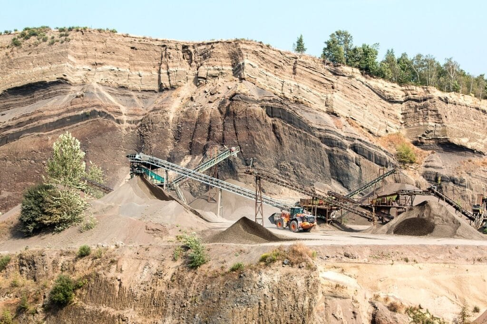

Cinder cone volcanoes, a type of volcano characterized by their steep and symmetrical cone shape, are formed when molten rock, gas, and debris are violently expelled from the earth's interior. These eruptions often result in the accumulation of loose fragments of volcanic rock, known as cinders, around the vent. Cinder cone volcanoes are typically found in areas where tectonic plates meet and are prone to frequent eruptions. The formation and eruption patterns of cinder cone volcanoes can vary depending on factors such as lava viscosity and gas content. By understanding these factors, scientists can gain valuable insights into the behavior of these volcanoes, allowing for more accurate predictions and better preparedness in the face of future eruptions.

  

## What are Cinder Cone Volcanoes?

### Definition of cinder cone volcanoes

Cinder cone volcanoes, also known as scoria cones, are the simplest and smallest form of volcanic landforms. They are characterized by their steep, cone-shaped hills that are made up of loose fragments of volcanic rock called cinders or scoria. These volcanic rocks are formed during explosive eruptions when gas-rich magma is ejected into the air and cools rapidly, solidifying into fragments that fall back to the ground. Cinder cone volcanoes typically have a symmetrical shape, with a circular or oval base and a steep slope that rises to a summit crater.

### Unique features of cinder cone volcanoes

One of the unique features of cinder cone volcanoes is their relatively small size. They are usually no more than a few hundred meters in height and have a relatively small footprint compared to other types of volcanoes. Another distinctive feature is the presence of a summit crater at the top of the cone, which is the vent through which volcanic eruptions occur. The crater can vary in size, but it is typically circular or oval-shaped and can be several tens of meters in diameter. Cinder cone volcanoes also tend to have a very steep slope, often exceeding 30 degrees, due to the loose nature of the cinders that form the cone. This makes them highly susceptible to erosion and collapse over time.

## Formation Process of Cinder Cone Volcanoes

### Initial eruption considerations

The formation of cinder cone volcanoes begins with an explosive eruption. This eruption occurs when magma, which is molten rock beneath the Earth's surface, rises to the surface and interacts with volatile gases, such as water vapor and carbon dioxide. The magma and gas mixture creates immense pressure, leading to a violent explosion that propels the magma into the air. During this explosive eruption, the gas-rich magma breaks into fragments, forming cinders or scoria. These cinders are usually small, porous, and lightweight, making them easily transportable by air currents.

### Formation of the cone

As the cinders are ejected into the air during the initial eruption, they fall back to the ground in a circular pattern around the vent. Over time, these accumulated cinders build up and form a cone-shaped hill, with the vent at the summit. The loose, fragmented nature of the cinders allows for a steep slope to develop, as the loose material easily collapses and settles into a conical shape. The cone continues to grow with successive eruptions, each layer of cinders adding to its height and volume.

### The role of tectonic plates and hotspot activity

The formation of cinder cone volcanoes is closely linked to the movement of tectonic plates and the activity of hotspots. Tectonic plates are huge slabs of the Earth's lithosphere that float on the semi-fluid asthenosphere below. The interaction between these plates creates areas of intense geologic activity, such as subduction zones and rift zones. In subduction zones, one tectonic plate converges and sinks below another, leading to the formation of explosive composite volcanoes. In rift zones, where tectonic plates are moving apart, the crust thins, allowing magma to rise to the surface and form cinder cone volcanoes.

Hotspots, on the other hand, are stationary regions of intense volcanic activity that are not directly associated with tectonic plate boundaries. Hotspots are thought to be caused by plumes of hot mantle material rising from deep within the Earth. As tectonic plates move across these stationary hotspots, volcanic activity occurs. Hawaii is a well-known example of a hotspot-related cinder cone volcano. The Hawaiian Islands were formed as the Pacific Plate moved over a hotspot, producing a chain of volcanic islands, with the youngest cinder cones being active on the Big Island of Hawaii.

## Overview of Magma and Lava Characteristics

### Role of magma in cinder cone formation

Magma plays a crucial role in the formation of cinder cone volcanoes. Magma is generated deep within the Earth's mantle and rises towards the surface due to differences in density and pressure. As magma ascends, it undergoes physical and chemical changes, including the entrainment of gas bubbles. The composition of the magma, specifically its gas content and viscosity, influences the eruptive style and the characteristics of the resulting cinder cone volcano.

### Properties of lava crucial to cone construction

When magma reaches the surface during an eruption, it is then called lava. The properties of the lava, particularly its viscosity and gas content, are essential in shaping the construction and stability of the cinder cone volcano. Viscosity refers to the resistance of a fluid to flow, and it is determined by the silica content of the lava. High-silica lava, such as rhyolite, has high viscosity and tends to flow slowly. On the other hand, low-silica lava, such as basalt, has low viscosity and flows more easily.

In the case of cinder cone volcanoes, the lava produced is typically basaltic, with low viscosity. This allows the lava to flow quickly and cover more area before solidifying. As the lava flows from the vent, it cools rapidly due to exposure to the air, forming a thin, solid crust. However, the lava underneath the solid crust continues to flow, creating lava tubes or channels that transport the still-molten lava away from the vent. These lava tubes can extend for several kilometers and contribute to the growth of the cinder cone.

This image is property of pixabay.com.

## Characteristics of Cinder Cone Eruptions

### Typical features of a cinder cone eruption

Cinder cone eruptions are characterized by their explosive nature and the ejection of cinders or scoria into the air. Unlike other types of volcanoes, such as shield volcanoes or composite volcanoes, cinder cones do not typically produce flowing lava. Instead, the lava fragments are ejected high into the air, propelled by the force of the explosive eruption. The cinders can travel significant distances before falling back to the ground around the vent, building up the cone shape.

During the eruption, a column of ash and gas may be visible above the vent. This ash column can rise several kilometers into the atmosphere, carried by the upward movement of gas and volcanic particles. As the ash column collapses, it can produce a pyroclastic flow, which is a dense, fast-moving cloud of hot gas, ash, and other volcanic material. These pyroclastic flows can be extremely dangerous and destructive, capable of traveling at high speeds and burying everything in their path.

### Influence of gas and magma viscosity on eruption style

The eruptive style of cinder cone volcanoes is influenced by the gas content and magma viscosity. High gas content in the magma leads to more explosive eruptions as the build-up of gas bubbles creates pressure and causes the magma to fragment into cinders or scoria. The viscosity of the magma also influences the eruptive style, as low-viscosity magma, like basalt, tends to flow easily and produce more effusive eruptions, whereas high-viscosity magma, like rhyolite, leads to more explosive eruptions.

The high gas content of cinder cone eruptions contributes to the explosive nature of these volcanoes. The gas content can range from a few to tens of percent by weight, creating significant pressure within the magma chamber. As the magma rises towards the surface, the decrease in pressure causes the gas bubbles to expand rapidly, shattering the magma into small fragments. These fragments are then ejected into the air as cinders, propelled by the force of the escaping gas.

## Types and Distribution of Cinder Cone Volcanoes

### Geographic distribution of cinder cones

Cinder cone volcanoes are found in various parts of the world, but they are most commonly associated with regions of recent or ongoing volcanic activity. They can be found along plate boundaries, such as the Cascadia subduction zone in the Pacific Northwest of the United States, as well as in areas with hotspot activity, such as the Hawaiian Islands. Furthermore, cinder cones can also be found in continental rift zones, such as the East African Rift.

The geographic distribution of cinder cones is often influenced by tectonic plate locations and patterns. As tectonic plates converge or diverge, volcanic activity can occur. In subduction zones, where one plate is forced beneath another, the melting of the descending plate creates volcanic activity, leading to the formation of cinder cone volcanoes. Similarly, in areas of hotspot activity, like those observed in Hawaii, the movement of tectonic plates over stationary hotspots generates volcanic eruptions and the formation of cinder cone volcanoes.

### Influence of tectonic plate locations and patterns on formation

The movement of tectonic plates and their interaction with one another play a significant role in the formation of cinder cone volcanoes. In subduction zones, where two tectonic plates converge, one plate sinks beneath the other, generating intense volcanic activity. This volcanic activity can result in the formation of composite volcanoes, which are characterized by their steep slopes and alternating layers of lava and volcanic ash. However, in some cases, cinder cone volcanoes can form as a result of more explosive eruptions during this subduction process.

In areas of hotspot activity, the movement of tectonic plates over stationary hotspots creates volcanic activity. Hotspots are thought to be areas of upwelling mantle material, which generates magma that rises to the surface, forming cinder cone volcanoes. The Hawaiian Islands are a prime example of hotspot-related cinder cone volcanoes. As the Pacific Plate moves northwestward over the Hawaiian hotspot, a chain of volcanic islands has formed, with the youngest and most active cinder cones found on the Big Island of Hawaii.

## Comparing Cinder Cones with Other Types of Volcanoes

### Comparison of formation processes

Cinder cone volcanoes have distinct formation processes that set them apart from other types of volcanoes. While composite volcanoes, also known as stratovolcanoes, are formed by alternating layers of lava and ash, cinder cones are primarily composed of loose fragments of volcanic rock called cinders or scoria. These cinders accumulate around the vent in a circular pattern and gradually build up to form a cone-shaped hill. The loose nature of the cinders allows for a steep slope, and the absence of flowing lava distinguishes cinder cones from shield volcanoes.

Shield volcanoes, on the other hand, are formed by low-viscosity lava that flows easily and covers large areas, creating a broad, shield-like shape. Unlike cinder cones, which are typically associated with explosive eruptions, shield volcanoes are characterized by effusive eruptions, where the lava flows gently out of the vent. This difference in eruption style is due to the difference in magma viscosity. The high gas content and low viscosity of cinder cone eruptions contribute to the explosive nature, while the low gas content and low viscosity of shield volcano eruptions allow for the lava to flow freely.

### Comparison of eruption styles

The eruption styles of cinder cone volcanoes, composite volcanoes, and shield volcanoes differ significantly in terms of explosivity, lava flow, and the types of volcanic materials produced. Cinder cone eruptions are generally characterized by their explosive nature, with the ejection of cinders or scoria into the air. The loose fragments are propelled by the force of gas escaping from the magma, reaching high altitudes before falling back to the ground and building up the cone. These eruptions are relatively short-lived and can occur sporadically over long periods of time.

Composite volcanoes, or stratovolcanoes, have a much more complex eruption style. They are characterized by alternating layers of lava and volcanic ash, resulting in a "composite" structure. These eruptions can be both explosive and effusive, with the potential for pyroclastic flows and the production of large amounts of volcanic ash. The eruptions of composite volcanoes tend to be more prolonged and can occur with varying degrees of explosivity, depending on the specific characteristics of the magma and the gas content.

Shield volcanoes, in contrast, are associated with effusive eruptions. The low viscosity of the lava allows it to flow easily and cover large areas, resulting in the characteristic broad, shield-like shape of these volcanoes. The eruptions of shield volcanoes are generally less explosive compared to cinder cones or composite volcanoes, with relatively slow-moving lava flows. However, shield volcanoes can still produce lava fountains, lava lakes, and lava tubes, which contribute to their dynamic nature.

### Comparison of environmental impacts

The environmental impacts of different types of volcanoes can vary depending on factors such as eruption style, frequency, and location. Cinder cone eruptions, although relatively small in scale compared to other types of volcanic eruptions, can still have environmental impacts. The explosive nature of cinder cone eruptions can result in the ejection and deposition of volcanic ash over large areas. This can lead to the disruption of air travel, damage to vegetation, and potential health hazards for humans and animals.

Composite volcanoes have the potential to produce highly explosive eruptions that can cause significant environmental impacts. The [pyroclastic flows associated with composite volcano eruptions](https://magmamatters.com/the-environmental-impact-of-volcanic-eruptions-2/ "The Environmental Impact of Volcanic Eruptions") can strip the landscape of vegetation and bury entire communities under layers of volcanic ash. The deposition of ash can also disrupt air quality, leading to respiratory problems for humans and wildlife. In addition, the release of volcanic gases during eruptions can contribute to air pollution and affect global climate patterns.

Shield volcanoes, due to their effusive and generally less explosive eruptions, have a lower environmental impact compared to cinder cones or composite volcanoes. The lava flows of shield volcanoes tend to move slowly and can often be diverted or controlled, minimizing the damage to surrounding areas. However, the lava can still engulf structures and block roads, posing a threat to nearby communities. High levels of volcanic gas emissions, such as sulfur dioxide, can also be released during shield volcano eruptions, contributing to air pollution and respiratory problems.

## Cinder Cone Volcanic Hazards

### Potential threats to human settlements

Cinder cone eruptions can pose various threats to human settlements located in their vicinity. The explosive nature of these eruptions means that cinders and volcanic ash can be ejected into the air and deposited over a wide area. This not only leads to the immediate danger of falling volcanic debris, which can cause injuries or damage property, but also creates long-term hazards.

The accumulation of volcanic ash can have significant impacts on infrastructure, such as buildings, roads, and utilities. Volcanic ash is highly abrasive and can cause damage to machinery and engines, leading to costly repairs. The weight of the ash can also cause roofs to collapse or weaken structures over time, posing a threat to the safety of residents. In addition, the fine particles of volcanic ash can infiltrate indoor spaces, affecting air quality and posing respiratory risks to inhabitants.

Another hazard associated with cinder cone eruptions is the release of volcanic gases. These gases, including [sulfur dioxide and hydrogen sulfide](https://magmamatters.com/understanding-volcanic-formation-a-comprehensive-guide/ "Understanding Volcanic Formation: A Comprehensive Guide"), can cause respiratory problems, eye irritation, and in extreme cases, asphyxiation. The volcanic gases can also interact with water vapor in the atmosphere to form acid rain, which can damage crops, forests, and bodies of water, further impacting human settlements in the surrounding area.

### Impacts on the environment

Cinder cone eruptions can have significant impacts on the environment, both locally and globally. Locally, the deposition of volcanic ash and cinders can have immediate effects on the surrounding ecosystems. The abrasive nature of the ash can damage plant tissue, including leaves and stems, and inhibit photosynthesis. This can lead to reduced primary productivity and affect the entire food chain, from plants to herbivores and predators.

Volcanic ash can also have long-term effects on soil fertility. While the ash contains valuable nutrients, such as phosphorus and potassium, it can also deplete essential nutrients, such as calcium and magnesium, and increase soil acidity. These changes in soil composition can impact plant growth, making it difficult for vegetation to thrive in the years following an eruption.

Globally, volcanic eruptions, including cinder cone eruptions, can have an impact on climate patterns. The release of volcanic gases, particularly sulfur dioxide, into the atmosphere can lead to the formation of sulfate aerosols. These aerosols reflect sunlight back into space, reducing the amount of solar radiation reaching the Earth's surface. This can result in a temporary cooling effect on the climate, which can have implications for weather patterns, agriculture, and ecosystems around the world.

### Case studies of notorious cinder cone eruptions

Several notable cinder cone eruptions throughout history have demonstrated the potential hazards and impacts associated with these volcanic events. One such eruption occurred in 1943 on the island of Paricutin in Mexico. The eruption began suddenly in a cornfield and continued for almost a decade, burying neighboring villages, farmland, and forests under layers of lava and volcanic ash. The eruption of Paricutin provided valuable insights into the formation and growth of cinder cone volcanoes, and it remains a significant case study for volcanologists.

Another notable cinder cone eruption occurred in 1969 in the Phlegrean Fields near Naples, Italy. The eruption of the Monte Nuovo cinder cone resulted in the displacement of thousands of residents, the destruction of infrastructure, and the formation of a new volcanic crater. This eruption highlighted the importance of monitoring volcanic activity and implementing effective evacuation measures to protect human settlements in volcanic regions.

The eruption of Mount St. Helens in Washington state, USA in 1980 is another notable case study of a cinder cone eruption. Although Mount St. Helens is often classified as a stratovolcano, the explosive eruption that occurred was similar in many ways to a cinder cone eruption. The eruption resulted in the collapse of the summit, the formation of a large ash cloud, pyroclastic flows, and the lateral blast that devastated a large area. This eruption demonstrated the devastating power of explosive volcanic eruptions and the importance of precautionary measures and emergency preparedness.

## Benefits of Cinder Cone Volcanoes

### The role of volcanic soil fertility in agriculture

One of the significant benefits of cinder cone volcanoes is their contribution to soil fertility. The volcanic ash and cinders, which comprise the cone, are rich in important nutrients such as nitrogen, phosphorus, and potassium. These nutrients are essential for plant growth and are often limited in other types of soil. When cinder cones erupt, they deposit a layer of ash and cinders on the surrounding land, enriching the soil and providing an abundant source of nutrients.

The fertile soils associated with cinder cone eruptions can have significant benefits for agriculture. Farmers often take advantage of these volcanic soils, known as andisols, to grow crops and plants. Andisols are known for their water retention capacity, ability to support root development, and high nutrient content. This makes them particularly suitable for cultivating crops such as coffee, grapes, and various fruits and vegetables. The volcanic soil fertility associated with cinder cone eruptions has played a crucial role in supporting agricultural practices in volcanic regions worldwide.

### Generation of geothermal energy

Cinder cone volcanoes can also contribute to the generation of renewable energy through geothermal resources. Geothermal energy is harnessed by tapping into the heat stored within the Earth's crust, often in the form of hot groundwater or steam. In areas with volcanic activity, such as those associated with cinder cone eruptions, the heat from the magma chamber or hotspots can be utilized to produce electricity and heat.

Geothermal power plants utilize the naturally occurring heat in the Earth to drive turbines, which then generate electricity. The hot fluids or steam from beneath the surface are extracted through wells and passed through turbines to produce power. The use of geothermal energy from cinder cone volcanic regions reduces reliance on fossil fuels, decreases greenhouse gas emissions, and provides a reliable source of renewable energy.

### Tourism and recreation opportunities

Cinder cone volcanoes often attract tourists and outdoor enthusiasts due to their unique features and accessibility. The relatively small size and distinctive cone shape make them visually appealing and easily identifiable. Many cinder cone volcanoes have well-developed trail systems, allowing visitors to hike to the summit and explore the volcanic landscape.

The volcanic environment surrounding cinder cones can also provide opportunities for various recreational activities. Volcanic areas often have vibrant ecosystems, with unique plant and animal species adapting to the harsh conditions. This makes them ideal for bird watching, wildlife observation, and nature photography. In addition, volcanic landscapes can offer opportunities for rock climbing, camping, and even skiing or snowboarding on the slopes of dormant cinder cones during winter months.

## Monitoring and Predicting Cinder Cone Activity

### Techniques for monitoring volcanic activity

Monitoring and predicting volcanic activity is vital for mitigating the risks associated with cinder cone eruptions. Numerous techniques and monitoring systems are used to provide insights into the behavior and changes occurring within volcanoes.

Seismic monitoring involves measuring the seismic waves produced by volcanic activity. Instruments called seismometers detect ground vibrations caused by volcanic earthquakes, explosions, and the movement of magma beneath the surface. Seismic data can help scientists understand the movement and behavior of magma and can provide early warning signs of impending eruptions.

Gas monitoring involves measuring the volcanic gases emitted from the vent. The composition and quantity of gases, such as [sulfur dioxide and carbon](https://magmamatters.com/the-art-and-science-of-volcano-monitoring/ "The Art and Science of Volcano Monitoring") dioxide, can provide valuable information about the state of the volcano. Changes in gas emissions can indicate increased magma movement or the potential for an eruption.

Remote sensing techniques, such as satellite imagery and infrared cameras, allow scientists to monitor changes in surface temperature, ground deformation, and the movement of ash and gas plumes. These techniques provide a broader perspective on volcanic activity and can be used to track changes over large areas.

Ground deformation monitoring involves measuring changes in the surface elevation or shape of a volcano. Instruments such as GPS and radar can detect subtle ground movements, which may indicate magma movement or the accumulation of pressure within the volcano.

### Predicting eruptions and mitigation strategies

While it is challenging to predict the exact timing and magnitude of an eruption, monitoring techniques can help scientists identify potential warning signs and mitigate the risks associated with cinder cone volcanoes.

By analyzing data from various monitoring techniques, scientists can look for patterns and changes that may indicate an impending eruption. An increase in seismic activity, changes in gas emissions, ground deformation, or changes in the shape of the volcano can all be indicators of an imminent eruption.

Once potential signs of an eruption are identified, emergency management agencies can implement evacuation plans and establish communication protocols to ensure the safety of nearby communities. Education and public awareness campaigns can also play a crucial role in informing residents about the potential hazards and necessary precautions during volcanic activity.

In addition to monitoring and emergency preparedness, ongoing research and collaboration among scientists, volcanologists, and government agencies are essential for improving our [understanding of cinder cone](https://magmamatters.com/the-birth-of-new-land-understanding-cinder-cones/) volcanoes and their behavior. By learning from past eruptions and integrating new technologies, scientists can continue to refine prediction models and develop more effective mitigation strategies.

## Cinder Cone Volcanoes and Climate Change

### Impact of cinder cone volcanoes on global climate

Cinder cone volcanoes, like other types of volcanoes, can have both short-term and long-term impacts on global climate. The eruption of cinder cones can release large quantities of volcanic gases and aerosols into the atmosphere, which can affect the Earth's energy balance and climate patterns.

During the explosive eruptions of cinder cone volcanoes, copious amounts of volcanic gases, such as sulfur dioxide and water vapor, are released. These gases can reach the stratosphere, where they can remain for an extended period of time. Sulfur dioxide reacts with water vapor to form sulfate aerosols, tiny particles that can scatter sunlight and reflect it back into space. This scattering of sunlight has a cooling effect on the Earth's surface, resulting in a temporary decrease in global temperatures.

The release of volcanic gases during cinder cone eruptions can also impact the composition of the atmosphere. Volcanic gases, including carbon dioxide and water vapor, are greenhouse gases that contribute to the Earth's natural greenhouse effect. While the atmospheric concentration of these gases from individual cinder cone eruptions is relatively small compared to human-induced emissions, the cumulative effect of volcanic activity over geological time scales can shape climate patterns.

### Volcanic eruptions and their role in the carbon cycle

Volcanic eruptions, including cinder cone eruptions, play a role in the global carbon cycle. The carbon cycle is the process by which carbon is exchanged between the atmosphere, oceans, land, and living organisms. [Volcanoes release carbon dioxide](https://magmamatters.com/geothermal-energy-and-its-volcanic-origins/ "Geothermal Energy and Its Volcanic Origins"), a greenhouse gas, into the atmosphere during eruptions.

While human activities are currently the primary driver of increased atmospheric carbon dioxide concentrations, volcanic emissions also contribute to the carbon cycle. The amount of carbon dioxide released by volcanic eruptions is relatively small compared to human activities, such as the burning of fossil fuels. However, over geological time scales, volcanic activity has played a significant role in the regulation of atmospheric carbon dioxide levels.

Volcanic eruptions release carbon dioxide stored in magma and rocks, as well as carbon stored in living organisms. This carbon can be taken up by plants and incorporated into the soil, or released directly into the atmosphere. Over time, volcanic emissions can influence the carbon cycle and contribute to the long-term regulation of the Earth's climate.

In conclusion, cinder cone volcanoes are unique and fascinating geological features that result from explosive eruptions and the accumulation of loose volcanic fragments. They form through a process that involves the initial eruption, the buildup of cinders, and the movement of tectonic plates or hotspot activity. Magma and lava characteristics, eruption styles, and environmental impacts vary between cinder cone volcanoes and other types of volcanoes. They can pose hazards to human settlements and the environment, but they also provide benefits such as fertile volcanic soil, geothermal energy, and tourism opportunities. Monitoring and predicting cinder cone activity are instrumental in mitigating risks, and volcanic eruptions can have both short-term and long-term impacts on global climate and the carbon cycle.

Related Posts: [Mitigating Risks: Forecasting Volcanic Activity in Prone Areas](https://magmamatters.com/mitigating-risks-forecasting-volcanic-activity-in-prone-areas/), [The Formation and Eruption Patterns of Volcanoes](https://magmamatters.com/the-formation-and-eruption-patterns-of-volcanoes-4/), [The Pyroclastic Phenomena of Pompeii: 7 Insights to Explore](https://magmamatters.com/the-pyroclastic-phenomena-of-pompeii-7-insights-to-explore/), [Tips for Capturing Volcano Pyroclastic Flow Photos](https://magmamatters.com/tips-for-capturing-volcano-pyroclastic-flow-photos/), [Understanding Volcanoes and Their Eruption Patterns](https://magmamatters.com/understanding-volcanoes-and-their-eruption-patterns/)
