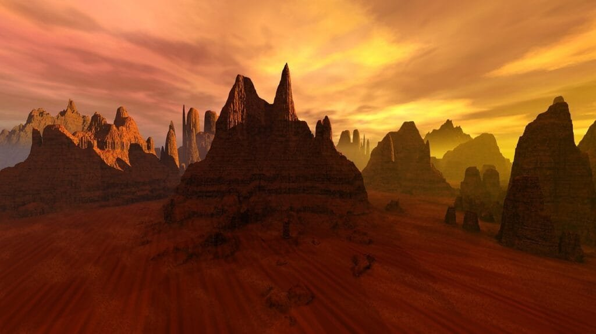

Have you ever wondered how volcanoes form and why they erupt? Well, it all starts deep beneath the Earth's surface, where molten rock, gases, and debris gather in a region called the mantle. This molten material, known as magma, can sometimes rise to the surface through cracks in the Earth's crust, resulting in volcanic eruptions. But what causes this magma to rise in the first place? The answer lies in mantle plumes, which are columns of hot rock that originate from the Earth's core and push through the mantle towards the surface. [Understanding the formation of mantle plumes](https://magmamatters.com/understanding-volcanic-formation-a-comprehensive-guide/ "Understanding Volcanic Formation: A Comprehensive Guide") and how they contribute to lava eruptions is crucial in predicting volcanic activity and safeguarding vulnerable communities. In this article, we will explore seven key insights into mantle plumes and lava formation, shedding light on the fascinating world of volcanoes.

This image is property of pixabay.com.

## The Earth's Interior and Tectonic Plates

### Understanding the structure of the Earth's interior

The Earth's interior is composed of several layers, each with its own unique properties. The outermost layer is called the crust, which is divided into continental and oceanic crust. Beneath the crust is the mantle, a thick layer of hot, solid rock. The core is at the center of the Earth and is divided into the outer core, which is molten, and the inner core, which is solid.

### Definition and role of tectonic plates

Tectonic plates are large pieces of the Earth's lithosphere that fit together like a jigsaw puzzle. These plates are constantly moving, albeit very slowly, and their interactions give rise to various geological phenomena, including earthquakes, volcanic activity, and the creation of mountain ranges. The Earth's lithosphere is divided into several major plates, such as the Eurasian Plate, North American Plate, and Pacific Plate.

### Interaction of tectonic plates

The interaction of tectonic plates occurs primarily at plate boundaries. There are three main types of plate boundaries: divergent boundaries, where plates move away from each other, convergent boundaries, where plates collide, and transform boundaries, where plates slide horizontally past each other. These interactions can lead to the formation of volcanoes, earthquakes, and the creation of new crust through seafloor spreading.

## Role of Mantle Plumes in Volcanic Activity

### Definition and structure of mantle plumes

Mantle plumes are columns of hot, buoyant rock that rise from the boundary between the Earth's core and mantle. They are believed to originate from the lower mantle and can extend all the way to the Earth's surface. Mantle plumes consist of hot, molten rock called magma, which is less dense than the surrounding material and therefore rises through the mantle.

### Formation of mantle plumes in the Earth's mantle

The exact mechanism of mantle plume formation is still a topic of scientific debate. One theory suggests that they are formed by the slow, continuous upward motion of hot material from the core-mantle boundary. Another theory proposes that mantle plumes are the result of narrow, cylindrical upwellings that penetrate the lower mantle.

### How mantle plumes contribute to volcanic activity

When a mantle plume reaches the Earth's surface, it can lead to the formation of a volcano. The hot magma within the mantle plume rises through the crust, causing a volcanic eruption. This eruption can result in the release of magma, gases, and ash into the atmosphere. Mantle plumes are responsible for some of the most well-known volcanic features on Earth, such as the Hawaiian Islands and the Yellowstone Caldera.

  

## Hotspots and Their Contribution to Volcano Formation

### Understanding hotspots and their location

Hotspots are areas of intense volcanic activity that are not explained by plate boundaries. They are believed to be caused by mantle plumes, which heat up the overlying crust and create a concentration of volcanic activity. Hotspots can be found both on land and in the ocean, and they are often associated with volcanic chains.

### How hotspots relate to mantle plumes

Hotspots and mantle plumes are closely related. Hotspots are thought to be the surface expression of mantle plumes. As a mantle plume rises through the mantle, it reaches the Earth's surface at a hotspot, resulting in volcanic activity. This volcanic activity can lead to the formation of islands, mountain ranges, or volcanic chains.

### Hotspots and the creation of volcanoes

Hotspots are responsible for the formation of many of the world's most iconic volcanoes. As the mantle plume reaches the Earth's surface, it melts the overlying crust, resulting in the formation of magma. This magma then rises to the surface, leading to volcanic eruptions. Over time, repeated volcanic activity can create large volcanoes, such as Mauna Loa in Hawaii or Mount Kilimanjaro in Tanzania.

## Types of Volcanoes and Their Formation Processes

### Introduction to shield volcanoes and how they form

Shield volcanoes are characterized by their broad, gently sloping sides and large size. They are formed by the gradual accumulation of fluid lava flows that spread outwards, creating a shield-like shape. Shield volcanoes typically have quiet eruptions with lava flowing slowly down their sides. They are commonly found on hotspots, like the Hawaiian Islands.

### Understanding stratovolcanoes and their formation process

Stratovolcanoes, also known as composite volcanoes, are tall and steep with a conical shape. They are formed by alternating layers of lava flows, pyroclastic deposits, and volcanic ash. Stratovolcanoes have explosive eruptions caused by the buildup of pressure from thick and sticky magma. They are commonly found at convergent plate boundaries, such as the Pacific Ring of Fire.

### Formation of cinder cones

[Cinder cones](https://magmamatters.com/the-birth-of-new-land-understanding-cinder-cones/) are the simplest and smallest type of volcano. They are formed by explosive eruptions that eject small pieces of volcanic material called cinders or scoria. These cinders accumulate around the vent, forming a circular or oval-shaped cone. Cinder cones typically have short-lived eruptions and are widely distributed across volcanic areas.

This image is property of pixabay.com.

## The Role of Lava in Volcano Formation

### The formation process of lava underneath the crust

Lava is formed when magma, which is molten rock, reaches the Earth's surface during a volcanic eruption. The magma rises through the crust and is then released as lava. The composition of lava can vary, with different types of magma producing different kinds of lava. Lava can be very hot and can reach temperatures of over 1,000 degrees Celsius.

### How lava contributes to the structure of a volcano

Lava plays a crucial [role in the formation and structure of a volcano](https://magmamatters.com/the-role-of-volcanoes-in-earths-carbon-cycle-5/ "The Role Of Volcanoes In Earth’s Carbon Cycle"). As lava flows out of the volcanic vent, it spreads outwards, gradually building up the sides of the volcano. Over time, repeated eruptions and the accumulation of lava flows create the characteristic shape of the volcano. The type of lava, whether it is fluid or viscous, influences the slope of the volcano's sides.

### Different types of lava and their effects on eruptions

There are two main types of lava: basaltic lava and andesitic lava. Basaltic lava is fluid and can flow easily, resulting in gentle eruptions and the formation of shield volcanoes. Andesitic lava, on the other hand, is more viscous and does not flow as easily. This type of lava can lead to explosive eruptions and the formation of stratovolcanoes. The composition and gas content of the lava also influence the explosiveness of volcanic eruptions.

## Eruption Patterns of Volcanoes

### Identifying eruption patterns of different volcano types

Volcanoes can display different eruption patterns based on their type and the characteristics of the magma. Shield volcanoes often have effusive eruptions, where lava flows steadily out of the volcano. Stratovolcanoes, on the other hand, tend to have explosive eruptions characterized by pyroclastic flows and ash clouds. Cinder cones typically have short-lived and relatively small eruptions.

### Factors influencing the eruption pattern

Several factors can influence the eruption pattern of a volcano. The composition and gas content of the magma play a significant role. Magma with high gas content is more likely to have explosive eruptions, while magma with low gas content tends to have effusive eruptions. The viscosity of the magma also affects the eruption pattern, with more viscous magma leading to explosive eruptions.

### Examples of different eruption patterns in real-life volcanoes

Real-life volcanoes provide numerous examples of different eruption patterns. For instance, Kilauea in Hawaii is a shield volcano that has been erupting continuously since 1983 with primarily effusive eruptions. In contrast, Mount St. Helens in the United States had a highly explosive eruption in 1980, resulting in the formation of a new crater and the release of pyroclastic flows.

This image is property of pixabay.com.

## Hazards of Volcanic Eruptions

### Short-term hazards of volcanic eruptions

Volcanic eruptions can pose several short-term hazards. These include pyroclastic flows, which are extremely hot and fast-moving clouds of [volcanic gases](https://magmamatters.com/the-art-and-science-of-volcano-monitoring/ "The Art and Science of Volcano Monitoring"), ash, and debris. [Pyroclastic flows can cause significant damage to both natural](https://magmamatters.com/the-environmental-impact-of-volcanic-eruptions-2/ "The Environmental Impact of Volcanic Eruptions") and built environments, as well as pose a threat to human life. Volcanic ash can also be hazardous, as it can disrupt air traffic, cause respiratory problems, and damage infrastructure.

### Long-term implications of volcanic activities

Volcanic activities can have long-term implications on the surrounding environment. Volcanic ash, when deposited on land, can enrich the soil with nutrients, making it fertile for agriculture. However, volcanic ash can also disrupt ecosystems and cause long-term damage to vegetation. Volcanic eruptions can alter landscapes, reshape coastlines, and even create new landmasses.

### Case studies of major volcanic disasters

There have been several major volcanic disasters throughout history that provide valuable insights into the hazards of volcanic eruptions. One notable example is the eruption of Mount Vesuvius in 79 AD, which buried the cities of Pompeii and Herculaneum under layers of ash and pyroclastic material. Another example is the eruption of Mount Pinatubo in the Philippines in 1991, which caused widespread destruction and resulted in the temporary cooling of global temperatures.

## Benefits of Volcanic Eruptions

### Nutrient enrichment of soil due to volcanic activity

One of the benefits of volcanic eruptions is the nutrient enrichment of the soil. When volcanic ash is deposited on land, it breaks down over time and releases essential nutrients like phosphorus and potassium. These nutrients are vital for plant growth and can greatly enhance agricultural productivity in volcanic regions. Volcanic soils are known for their fertility and are prized for agriculture.

### Volcanoes and landscape formation

Volcanoes play a crucial role in the formation of landscapes. Through repeated eruptions and the accumulation of lava flows, volcanoes can shape the Earth's surface, creating mountains, valleys, and islands. Volcanic landscapes can be strikingly beautiful and attract tourists from around the world. They also provide unique habitats for plant and animal species that have adapted to volcanic environments.

### The role of volcanoes in climate regulation

Volcanic eruptions can have both short-term and long-term impacts on the Earth's climate. In the short term, volcanic ash and gases can block sunlight, leading to a temporary cooling effect on global temperatures. This was observed after major volcanic eruptions such as Mount Pinatubo and Krakatoa. In the long term, [volcanic activity can release large amounts of carbon dioxide](https://magmamatters.com/geothermal-energy-and-its-volcanic-origins/ "Geothermal Energy and Its Volcanic Origins") into the atmosphere, contributing to global warming.

## Analyzing and Predicting Volcanic Activities

### Current methods for predicting volcanic eruptions

Scientists use various methods to analyze and predict volcanic activities. Monitoring techniques include seismology, which detects earthquakes associated with volcanic activity, and remote sensing, which uses satellites to track changes in volcanic gases and ground deformation. Ground-based instruments, such as gas analyzers and thermal cameras, are also used to gather data on volcanic behavior. These data are combined with historical records and geological studies to make predictions.

### Limitations in the predictability of volcanic activity

While significant advancements have been made in volcanic prediction, there are still limitations to the accuracy and precision of forecasts. Volcanic eruptions are complex and can be influenced by a multitude of factors, making it challenging to predict their exact timing and magnitude. Additionally, volcanic systems can undergo changes over time, further complicating the prediction process. Consequently, volcanic forecasting remains largely probabilistic rather than definitive.

### Future advancements in volcanic prediction technology

Continued research and technological advancements are expected to improve volcanic prediction in the future. Advancements in remote sensing technology, such as the deployment of more advanced satellites and drones, will provide more accurate and detailed monitoring of volcanic activity. Increased understanding of the physical processes occurring within volcanoes and the development of advanced computer models will enhance the ability to forecast eruptions. Collaborative efforts among scientists, engineers, and policymakers will be crucial in advancing volcanic prediction technology.

## Mitigation Strategies for Volcanic Risks

### Policies for land-use and settlement around volcanoes

To mitigate the risks associated with volcanic activity, policies for land-use and settlement around volcanoes are essential. These policies can include zoning regulations that limit development in high-risk areas, as well as the establishment of exclusion zones around active volcanoes. Building codes can also be implemented to ensure that structures in volcanic regions are designed to withstand volcanic hazards, such as ashfall and pyroclastic flows.

### Engineering solutions to mitigate volcanic risks

Engineered solutions can help mitigate volcanic risks and protect communities located near volcanoes. These solutions can include the construction of barriers or diversion channels to redirect potentially dangerous volcanic flows away from inhabited areas. Civil engineering techniques, such as stabilizing slopes and reinforcing structures, can also be employed to minimize the impact of volcanic hazards. Additionally, early warning systems can be implemented to provide timely alerts to vulnerable populations.

### Community preparedness strategies for volcanic disasters

Community preparedness is crucial in mitigating volcanic risks and reducing the impact of volcanic disasters. Public education and awareness programs can inform communities about the hazards associated with volcanic eruptions and the appropriate response measures. Emergency response plans should be developed and practiced regularly, including evacuation procedures and communication protocols. Building resilience within communities through partnerships, training, and resources is essential in effectively responding to volcanic emergencies.

In conclusion, understanding the formation of mantle plumes and lava eruptions can provide valuable insights into the dynamic nature of volcanoes and help mitigate the risks associated with volcanic activity. The Earth's interior, tectonic plates, and mantle plumes all play significant roles in volcanic eruptions. Different types of volcanoes, such as shield volcanoes and stratovolcanoes, have distinct formation processes and eruption patterns. While volcanic eruptions can pose hazards, they can also have benefits, such as enriching soil and shaping landscapes. Analyzing and predicting volcanic activities, as well as implementing mitigation strategies and community preparedness, are key in minimizing the impact of volcanic disasters. Further advancements in volcanic prediction technology and continued research will contribute to improved understanding and management of volcanic hazards.

Related Posts: [Mitigating Risks: Forecasting Volcanic Activity in Prone Areas](https://magmamatters.com/mitigating-risks-forecasting-volcanic-activity-in-prone-areas/), [The Formation and Eruption Patterns of Volcanoes](https://magmamatters.com/the-formation-and-eruption-patterns-of-volcanoes-4/), [The Pyroclastic Phenomena of Pompeii: 7 Insights to Explore](https://magmamatters.com/the-pyroclastic-phenomena-of-pompeii-7-insights-to-explore/), [Tips for Capturing Volcano Pyroclastic Flow Photos](https://magmamatters.com/tips-for-capturing-volcano-pyroclastic-flow-photos/), [Understanding Volcanoes and Their Eruption Patterns](https://magmamatters.com/understanding-volcanoes-and-their-eruption-patterns/)
