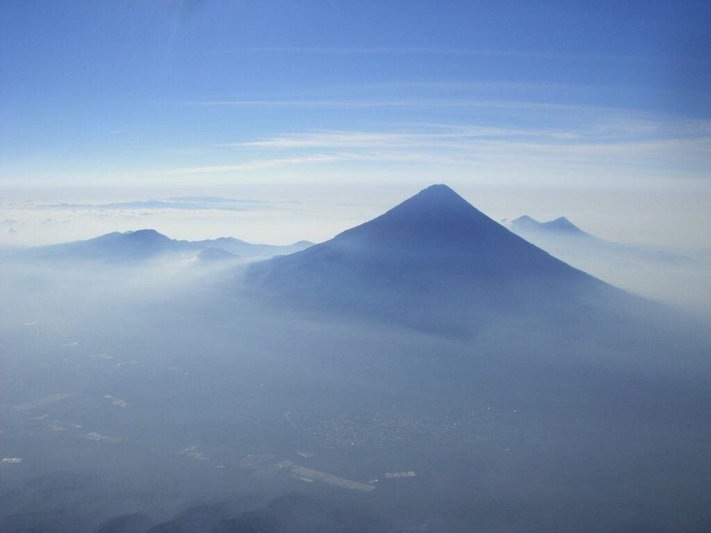

In this article, we will explore the fascinating world of stratovolcanoes and delve into the reasons behind their unique formation. Volcanoes are awe-inspiring natural wonders that can have a significant impact on our planet. By understanding the formation of stratovolcanoes, we can gain valuable insights into the forces at work beneath our feet. From the eruption causes to the hazards and benefits associated with these majestic structures, we will uncover the secrets behind their formation and explore why stratovolcanoes form the way they do. So, join us on this exciting journey as we unravel the mysteries of these magnificent volcanic marvels.

  

## Definition of Stratovolcanoes

Stratovolcanoes, also known as composite volcanoes, are a [type of volcano](https://magmamatters.com/understanding-volcanic-formation-a-comprehensive-guide/ "Understanding Volcanic Formation: A Comprehensive Guide") characterized by their steep slopes and symmetrical cone shape. They are formed by the eruption of viscous lava and pyroclastic materials, which build up in alternating layers over time. These layers consist of solidified lava, ash, and other volcanic debris, creating the distinctive stratified appearance. Stratovolcanoes are typically large and can reach heights of several thousand meters. They are known for their explosive eruptions and are considered one of the most dangerous types of volcanoes.

### Characteristics of Stratovolcanoes

Stratovolcanoes have several distinguishing characteristics. One of their defining features is their steep slopes, which are caused by the buildup of layers of hardened lava and pyroclastic materials. These layers create a symmetrical cone shape, with a prominent crater at the summit. The eruptions of stratovolcanoes are explosive due to the high viscosity of the magma, which traps gases and builds up pressure. This results in the ejection of ash, lava bombs, and pyroclastic flows during eruptions. Stratovolcanoes are also prone to secondary hazards such as lahars (mudflows) and landslides, which can be triggered by the melting of snow and ice on the volcano's slopes.

### Difference between Stratovolcanoes and other Models

Stratovolcanoes differ from other types of volcanoes, such as shield volcanoes and [cinder cones](https://magmamatters.com/the-birth-of-new-land-understanding-cinder-cones/), in several ways. While shield volcanoes have gentle slopes and are characterized by the eruption of fluid, basaltic lava, stratovolcanoes have steep slopes and erupt highly viscous lava. This difference in lava composition leads to divergent eruption styles, with shield volcanoes experiencing effusive eruptions and stratovolcanoes undergoing explosive eruptions. Additionally, cinder cones are much smaller in size and are formed by the ejection of pyroclastic materials, resulting in a simple, conical shape. In contrast, stratovolcanoes are much larger and more complex, with multiple layers of lava and volcanic debris contributing to their formation.

## Geographical Distribution of Stratovolcanoes

Stratovolcanoes are distributed worldwide but are most commonly found along subduction zones and in volcanic arcs, such as the "Ring of Fire" encircling the Pacific Ocean. This region is characterized by a high concentration of stratovolcanoes due to the tectonic activity associated with subduction, where one tectonic plate is forced beneath another. The subduction of oceanic plates beneath continental plates creates conditions favorable for the formation of stratovolcanoes. However, stratovolcanoes can also be found in other regions, such as the Andes in South America and the Cascades in North America, where tectonic plate boundaries and volcanic activity are present.

### Stratovolcanoes in Ring of Fire and other Regions

The "Ring of Fire" is a major area in the basin of the Pacific Ocean where a large number of earthquakes and volcanic eruptions occur. It is home to the majority of the world's stratovolcanoes, including famous examples such as Mount St. Helens in the United States and Mount Fuji in Japan. The intense tectonic activity in this region, resulting from the interaction of several tectonic plates, creates a favorable environment for the formation of stratovolcanoes. These volcanoes are important features of the landscape and attract both scientific interest and tourism.

### Tectonic Plate Boundaries and their Influence

Tectonic plate boundaries play a significant role in the formation and distribution of stratovolcanoes. Subduction zones, where one tectonic plate is forced beneath another, are particularly conducive to the formation of stratovolcanoes. In these regions, the sinking oceanic plate releases water, which lowers the melting point of the mantle, leading to the generation of magma. The magma rises through the overriding plate and erupts at the surface, forming stratovolcanoes. Convergent boundaries, where two tectonic plates collide, can also result in the formation of stratovolcanoes. The intense geological activity at plate boundaries creates the conditions necessary for the development of these volcanic structures.

## Formation of Stratovolcanoes

The formation of stratovolcanoes is a complex process that involves the interaction of various factors, including magma composition, tectonic plates, and volatile gases.

### Role of Magma

Magma, which is molten rock beneath the Earth's surface, plays a key role in the formation of stratovolcanoes. The composition of the magma, in terms of its silica content, determines its viscosity and explosivity. Stratovolcanoes are primarily formed by the eruption of viscous, silica-rich magma known as andesite. This magma has a higher gas content and lower temperature, making it more prone to explosive eruptions. The magma rises to the surface through fractures and weaknesses in the Earth's crust, eventually erupting and solidifying to form the layers of the volcano.

### Contribution of Tectonic Plates

Tectonic plates, the large pieces of the Earth's lithosphere, also contribute to the formation of stratovolcanoes. Subduction zones, where one tectonic plate is forced beneath another, are the primary settings for the development of stratovolcanoes. As the oceanic plate sinks into the mantle, it undergoes partial melting, resulting in the generation of magma. This magma, with its high silica content, rises through the overriding plate and erupts at the surface, building up the layers of the stratovolcano. The movement and interaction of tectonic plates play a crucial role in creating the conditions necessary for the formation of stratovolcanoes.

### Importance of Volatile Gases

Volatile gases, such as water vapor, [carbon dioxide](https://magmamatters.com/the-art-and-science-of-volcano-monitoring/ "The Art and Science of Volcano Monitoring"), and sulfur dioxide, also play a crucial role in the formation of stratovolcanoes. These gases are dissolved in the magma and are released during eruptions. The presence of volatile gases affects the eruption style and explosivity of the volcano. When magma is under high pressure, the gases remain dissolved and do not escape easily. However, when the pressure decreases during an eruption, the gases rapidly expand, leading to explosive volcanic activity. The release of volatile gases during eruptions contributes to the violent and explosive nature of stratovolcanoes.

### Building of Layers in Stratovolcanoes

The distinctive layering seen in stratovolcanoes is a result of the accumulation of lava, ash, and other volcanic debris over time. During explosive eruptions, the volcanic materials are ejected from the volcano and settle around the vent. The larger, heavier particles, such as lava bombs and pyroclastic flows, fall closer to the vent, creating lower layers of the volcano. The finer particles, such as ash and volcanic dust, are carried by the wind and can be deposited over considerable distances, contributing to the upper layers of the volcano. Over multiple eruptions, these alternating layers of solidified lava and volcanic debris build up, forming the characteristic stratified appearance of stratovolcanoes.

This image is property of pixabay.com.

## Eruption Patterns of Stratovolcanoes

Stratovolcanoes exhibit unique eruption patterns influenced by factors such as lava viscosity, gas content, and the volcano's history.

### Influence of Lava Viscosity

The viscosity, or thickness, of the magma plays a significant role in determining the eruption style of stratovolcanoes. Stratovolcanoes typically erupt andesitic magma, which is more viscous compared to the basaltic magma erupted by shield volcanoes. The high silica content of andesitic magma leads to a higher viscosity, making it more resistant to flow. During eruptions, the thick magma traps gases, creating a buildup of pressure. This can result in explosive eruptions characterized by the ejection of ash, lava bombs, and pyroclastic flows. The higher viscosity of the magma also contributes to the steep slopes of stratovolcanoes, as the lava does not flow far from the vent, but instead builds up in layers around the volcanic cone.

### Role of Gas Content

The gas content of the magma significantly influences the eruption behavior of stratovolcanoes. As magma rises towards the surface, the decreasing pressure causes dissolved gases, such as water vapor, carbon dioxide, and sulfur dioxide, to be released. The gas bubbles expand rapidly, propelling the magma and volcanic material upwards. The explosive eruptions of stratovolcanoes are a result of the rapid expansion of these gas bubbles. The presence of abundant volatiles, such as water vapor, can lead to violent eruptions, as the large volume of gas will cause a more explosive release. The gas content not only affects the explosivity but also influences the types of volcanic hazards associated with stratovolcanoes, such as the generation of pyroclastic flows and ash clouds.

### Patterns over Time

Stratovolcanoes often exhibit repetitive eruption patterns over long periods of time. These patterns can be characterized by periods of relative calm interrupted by explosive eruptions. During the dormant or quiescent phase, there is little to no volcanic activity, with the volcano appearing inactive. However, the volcano remains an active system, with magma still present beneath the surface. Periodically, pressure builds up within the volcano, leading to an explosive eruption. These eruptions can be highly destructive, ejecting volcanic material and posing significant hazards to surrounding areas. The recurring eruption patterns of stratovolcanoes highlight the importance of continual monitoring and assessment of volcanic activity to mitigate risks and protect nearby communities.

## Materials discharged during Eruptions

Stratovolcanoes produce a variety of materials during eruptions, including lava, ash, gases, and pyroclastic material.

### Lava and Ash Discharge

During eruptions, stratovolcanoes emit both lava and ash. Lava is molten rock that reaches the Earth's surface and flows down the volcano's slopes. The lava of stratovolcanoes is typically highly viscous and does not flow far from the vent. Instead, it accumulates near the summit and upper slopes, building up layers of solidified lava. Ash, on the other hand, consists of tiny volcanic glass fragments and rock particles. It is produced when the explosive eruption shatters the magma into small pieces. Ash can be carried by winds, forming cloud-like plumes that can travel great distances. The deposition of ash can have significant impacts on the surrounding environment, including the disruption of air traffic, contamination of water sources, and damage to crops and vegetation.

### Emission of Gases

Volatile gases are released during stratovolcano eruptions. These gases include water vapor, carbon dioxide, sulfur dioxide, and many others. The release of these gases can have various effects on the environment and surrounding communities. For example, water vapor and [carbon dioxide](https://magmamatters.com/geothermal-energy-and-its-volcanic-origins/ "Geothermal Energy and Its Volcanic Origins") are relatively harmless in small quantities but can contribute to the greenhouse effect and climate change when released in large volumes. Sulfur dioxide can react with water vapor and other atmospheric components to form sulfuric acid, leading to the production of acid rain. The emission of volcanic gases can also have immediate health impacts, especially for people living in close proximity to the volcano, as they can cause respiratory problems and eye irritation. Monitoring and evaluating gas emissions during eruptions are crucial for assessing the potential dangers posed by stratovolcanoes and protecting the health and well-being of nearby populations.

### Production of Pyroclastic Material

Pyroclastic material refers to a mixture of volcanic fragments, such as ash, rock fragments, and pumice, that are produced during explosive volcanic eruptions. Stratovolcanoes are particularly adept at generating pyroclastic flows, which are fast-moving avalanches of hot gas, ash, and rock. These flows can travel at high speeds and for considerable distances, causing widespread destruction and posing severe hazards to human settlements. Pyroclastic material can also be ejected into the air during an eruption, forming eruption columns and ash clouds. These ash clouds can drift with the wind, covering large areas and affecting air quality and visibility. The production of pyroclastic material during eruptions is a significant threat associated with stratovolcanoes and highlights the importance of monitoring and preparing for potential hazards.

## Hazards of Stratovolcano Eruptions

Stratovolcanoes pose various hazards during eruptions, including lava flows, pyroclastic flows, lahars (mudflows), and the release of airborne ash and gases.

### Lava Flows

Lava flows are one of the primary hazards associated with stratovolcano eruptions. The highly viscous lava erupted by stratovolcanoes does not flow as freely as the fluid lava of shield volcanoes. Instead, it tends to accumulate near the vent, building up layers of solidified lava around the volcanic cone. However, lava flows can still pose a threat to surrounding areas, particularly if communities are located downhill from the volcano. These flows can destroy infrastructure, vegetation, and wildlife, and can even engulf entire towns. The high temperatures of the lava can also cause fires and trigger secondary hazards such as landslides.

### Pyroclastic Flows

Pyroclastic flows are another significant hazard associated with stratovolcano eruptions. These flows are dense, fast-moving avalanches of hot gas, ash, and rock fragments, traveling at speeds of up to hundreds of kilometers per hour. Pyroclastic flows are extremely destructive and can incinerate everything in their path. They are capable of leveling entire landscapes, burying settlements, and causing widespread devastation. The intense heat of pyroclastic flows can cause severe burns and respiratory damage to anyone caught in their path. These flows can be triggered by the collapse of volcanic columns, the disintegration of lava domes, or the rapid release of gases during explosive eruptions.

### Lahars or Mudflows

Lahars, or mudflows, are a hazard specific to stratovolcanoes and can be triggered during or after eruptions. They occur when volcanic activity melts snow and ice on the slopes of the volcano, mixing with volcanic ash and debris to form a fast-moving torrent of mud. Lahars can travel long distances, following river valleys and drainage systems, and can cause extensive damage to infrastructure and settlements. They can bury houses, bridges, and roads, trapping and endangering people in their path. Lahars are particularly hazardous as they can occur unpredictably, even during periods of apparent volcanic inactivity, making them a constant threat to communities living near stratovolcanoes.

### Airborne Ash and Gases

During volcanic eruptions, stratovolcanoes release significant amounts of ash and gases into the atmosphere. Volcanic ash consists of fine glass-like particles that can be carried by winds over long distances. Ash clouds can disrupt air travel, causing the closure of airports and grounding of aircraft due to the risk of engine damage. The deposition of ash on the ground can pose a significant risk to human health, particularly for those with respiratory conditions. The inhalation of ash can cause irritations, breathing difficulties, and serious lung problems. The release of gases, such as sulfur dioxide, can also have immediate health impacts, including respiratory problems and eye irritation. The volcanic plumes associated with stratovolcano eruptions can have far-reaching effects on air quality, visibility, and local ecosystems.

## Benefits of Stratovolcanoes

While stratovolcanoes pose significant hazards, they also offer various benefits that contribute to the natural environment and human societies.

### Nutrient Rich Soil

The volcanic ash and fragmented rock ejected during stratovolcano eruptions break down into fine particles and form nutrient-rich soil known as volcanic soil or tephra. This volcanic soil is highly fertile and contains essential minerals and nutrients that support plant growth. The deposition of volcanic ash on surrounding landscapes enriches the soil, enhancing agricultural productivity and promoting the growth of diverse plant species. Volcanic soils have been highly valued in agriculture throughout history, as they can support the cultivation of crops and support the livelihoods of local communities.

### Generation of New Landforms

Stratovolcanoes play a significant role in shaping the Earth's surface and creating new landforms. The accumulation of lava and volcanic debris over time creates the characteristic cone-shaped structure of stratovolcanoes. The layers of solidified lava and volcanic materials build up, shaping the landscape and forming new landforms, such as volcanic cones, craters, and calderas. These landforms can provide unique habitats for a variety of plant and animal species, contributing to biodiversity and ecological diversity. The geological processes associated with stratovolcanoes are a testament to the dynamic nature of the Earth and its ability to generate and transform landforms over time.

### Geothermal Energy

Stratovolcanoes can also serve as a valuable source of geothermal energy. Geothermal energy is derived from the heat stored within the Earth's crust, which can be harnessed for power generation and heating purposes. Stratovolcanoes provide an ideal environment for the development of geothermal systems, as they have a high concentration of heat near the surface. Hot springs, geysers, and steam vents are common features associated with stratovolcanoes and serve as indicators of the presence of geothermal resources. By tapping into these resources, communities can access a sustainable and renewable source of energy, reducing their reliance on fossil fuels and contributing to the transition to a greener future.

## Monitoring Stratovolcano Activities

Given the potential hazards associated with stratovolcanoes, monitoring their activities is crucial for predicting eruptions, assessing risks to surrounding communities, and developing early warning systems.

### Predicting Eruptions

Monitoring the behavior of stratovolcanoes can provide valuable insights into potential eruptions. Volcanologists use various techniques to detect signs of volcanic activity, such as seismic monitoring, ground deformation measurements, and gas emissions analysis. Changes in the frequency and intensity of volcanic earthquakes, ground swelling or deformation, and the composition and emission rates of volcanic gases can be indicators of increased volcanic activity. By analyzing these monitoring data, scientists can make predictions about the likelihood and timing of future eruptions. This information is vital for issuing timely warnings, implementing evacuation plans, and ensuring the safety of nearby communities.

### Evaluating Risks to Communities

Understanding the risks posed by stratovolcano eruptions is essential for assessing the vulnerability of nearby communities. Volcanologists and geologists assess the potential hazards associated with eruptions, such as the likelihood of lava flows, pyroclastic flows, lahars, and ashfall. They consider factors such as the size and location of the volcano, the history of previous eruptions, and the population density of surrounding areas. By conducting risk assessments, scientists can identify areas at high risk and develop strategies to minimize the impact of volcanic hazards. This may involve land-use planning, the development of evacuation routes, and the establishment of emergency response plans to protect lives and property in the event of an eruption.

### Development of Early Warning Systems

Early warning systems play a crucial role in mitigating the impacts of stratovolcano eruptions. These systems rely on a combination of real-time monitoring data, mathematical modeling, and communication networks to provide advance notice of volcanic activity. By detecting changes in volcano behavior, such as increased seismicity or ground deformation, early warning systems can alert authorities and communities to the impending eruption, allowing for the implementation of evacuation plans and the mobilization of resources. These systems prioritize the safety of the population and aim to minimize the loss of life and property associated with volcanic eruptions. The development and implementation of effective early warning systems are vital for protecting communities living near stratovolcanoes.

## Famous Examples of Stratovolcanoes

Stratovolcanoes can be found around the world, with some of the most iconic and well-known examples showcasing their unique characteristics and geological history.

### Popocatépetl in Mexico

Popocatépetl is one of Mexico's most active and famous stratovolcanoes. Located in the Trans-Mexican Volcanic Belt, Popocatépetl stands at an elevation of 5,426 meters. It has a long history of eruption activity, with its most recent eruption occurring in 2019. Popocatépetl's eruptions often produce ash plumes, pyroclastic flows, and lahars, posing hazards to nearby communities. Due to its close proximity to Mexico City, which is home to millions of people, Popocatépetl is closely monitored, and early warning systems are in place to ensure the safety of the population.

### Fuji in Japan

Mount Fuji, also known as Fuji-san, is an iconic stratovolcano located on Honshu Island in Japan. It is one of the country's most recognizable landmarks and has been a cultural and spiritual symbol for centuries. Mount Fuji is currently classified as dormant, with its last eruption occurring in 1707. The volcano's distinctive conical shape and snow-capped summit make it a popular tourist destination, attracting millions of visitors each year. Mount Fuji has been designated as a UNESCO World Heritage Site and continues to captivate people with its aesthetic beauty and cultural significance.

### Mayon in the Philippines

Mayon Volcano is a prominent stratovolcano located in the province of Albay in the Philippines. It is renowned for its near-perfect symmetry and is often referred to as the "Perfect Cone." Mayon is one of the most active volcanoes in the Philippines and has had numerous eruptions throughout history. The volcano's eruptions are characterized by lava flows, pyroclastic flows, and ashfall, posing risks to surrounding communities. Despite the hazards, the breathtaking beauty of Mayon attracts adventurous hikers and nature enthusiasts, contributing to tourism in the region.

### Vesuvius in Italy

Mount Vesuvius is an infamous stratovolcano located near Naples, Italy. It is best known for its cataclysmic eruption in 79 AD that buried the ancient Roman cities of Pompeii and Herculaneum. The eruption of Mount Vesuvius was one of the most catastrophic volcanic events in history. Today, Vesuvius is classified as an active volcano and is closely monitored due to its proximity to densely populated areas. The region surrounding Vesuvius has a rich cultural and archaeological heritage, attracting tourists who are fascinated by the volcano's history and the preservation of ancient Roman ruins.

## Conservation and Tourism

Stratovolcanoes have a significant impact on both conservation efforts and tourism in their respective regions.

### Stratovolcanoes as Tourist Attractions

The dynamic nature and unique geological features of stratovolcanoes make them popular tourist attractions. Many visitors are drawn to the raw power and beauty of these volcanic structures. Hiking enthusiasts and nature lovers are often enticed by the challenge of climbing to the summit of a stratovolcano, where they can witness breathtaking panoramic views. Some stratovolcanoes, such as Mount Fuji in Japan, have spiritual and cultural significance, attracting pilgrims and tourists seeking a connection to history and tradition. Additionally, the presence of hot springs, geothermal activity, and other natural phenomena associated with stratovolcanoes provides opportunities for relaxation and wellness tourism.

### Conservation and Environment Protection of Stratovolcanoes

Conserving and protecting stratovolcanoes and their surrounding environments are of paramount importance to ensure their preservation and the sustainability of their ecological systems. Stratovolcanoes often support unique and sensitive ecosystems that are adapted to the volcanic environment. These ecosystems can include specialized plant species, rare animal habitats, and geothermal environments. Efforts are made to protect these ecosystems from human disturbances, such as illegal mining, logging, or habitat destruction. National parks and protected areas are established around stratovolcanoes to safeguard their natural and cultural heritage, allowing for sustainable tourism and research opportunities while maintaining the integrity of these volcanic landscapes.

In conclusion, stratovolcanoes are fascinating and powerful natural phenomena that have shaped the Earth's surface for millions of years. With their steep slopes, alternating layers of lava and volcanic debris, and explosive eruption patterns, stratovolcanoes offer both hazards and benefits to the environment and surrounding communities. By understanding their formation, monitoring their activities, and evaluating their risks, scientists can work towards predicting eruptions and mitigating the impacts of volcanic hazards. Stratovolcanoes also attract tourists, providing opportunities to appreciate the beauty and power of these geological wonders while promoting conservation and protecting their fragile ecosystems. Through careful management and conservation efforts, stratovolcanoes can continue to inspire awe and contribute to our understanding of the dynamic processes shaping our planet.

Related Posts: [Mitigating Risks: Forecasting Volcanic Activity in Prone Areas](https://magmamatters.com/mitigating-risks-forecasting-volcanic-activity-in-prone-areas/), [The Formation and Eruption Patterns of Volcanoes](https://magmamatters.com/the-formation-and-eruption-patterns-of-volcanoes-4/), [The Pyroclastic Phenomena of Pompeii: 7 Insights to Explore](https://magmamatters.com/the-pyroclastic-phenomena-of-pompeii-7-insights-to-explore/), [Tips for Capturing Volcano Pyroclastic Flow Photos](https://magmamatters.com/tips-for-capturing-volcano-pyroclastic-flow-photos/), [Understanding Volcanoes and Their Eruption Patterns](https://magmamatters.com/understanding-volcanoes-and-their-eruption-patterns/)
