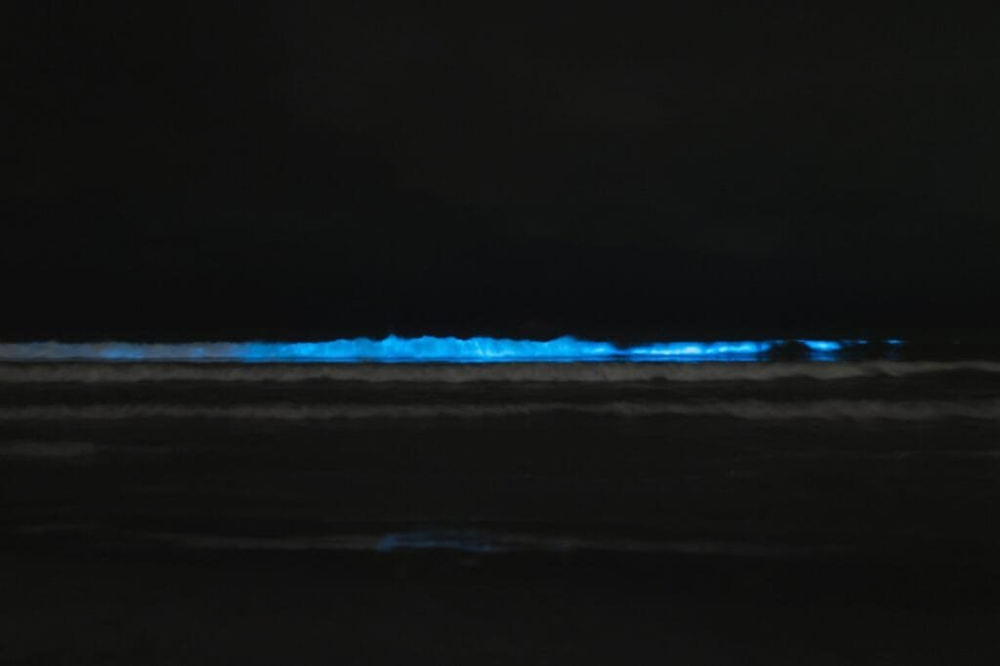
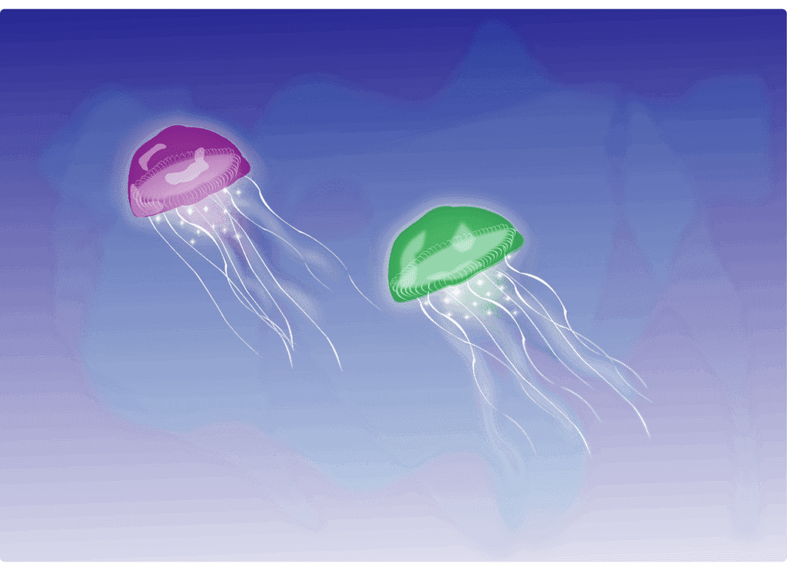
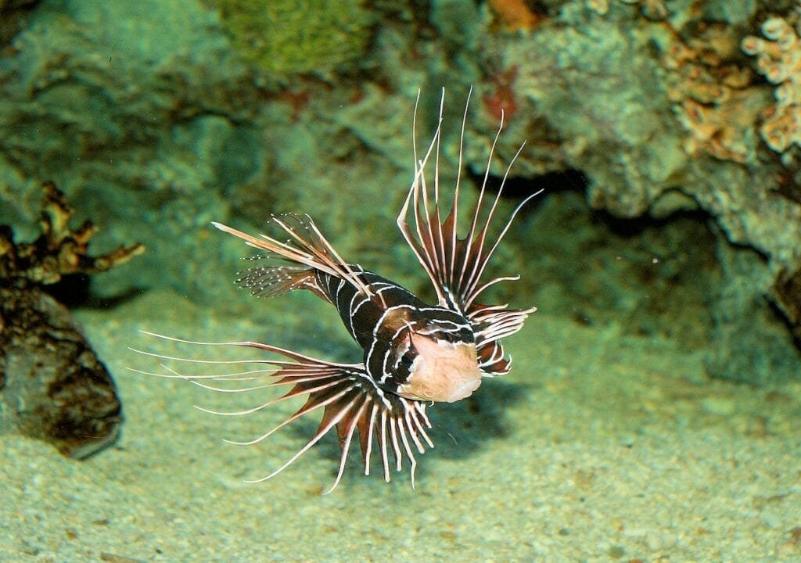

Have you ever wondered about the connection between submarine volcanoes and tsunamis? Submarine volcanoes, also known as underwater volcanoes, are formed when molten rock and gases escape to the surface of the Earth's oceans. These volcanic eruptions can cause massive waves known as tsunamis, which have the potential to wreak havoc on coastal communities. In this article, we will explore the link between submarine volcanoes and tsunamis, delving into the causes of these volcanic eruptions and the devastating consequences they can have. By understanding this connection, we can better prepare for and mitigate the risks associated with these natural disasters.

<iframe width="560" height="315" src="https://www.youtube.com/embed/qB0OEknXYd0" frameborder="0" allow="accelerometer; autoplay; encrypted-media; gyroscope; picture-in-picture" allowfullscreen></iframe>

  

## Fundamentals of Volcanoes

### Understanding how volcanoes form

Volcanoes are formed when molten rock, gases, and debris escape to the earth's surface, causing eruptions of lava and ash. The process starts deep within the Earth's mantle, where intense heat and pressure cause the rocks to melt and form magma. The magma, which is lighter than the surrounding rocks, rises towards the surface through cracks and fissures in the Earth's crust. As it reaches the surface, it erupts, releasing gases and creating volcanic eruptions.

### Where do volcanoes occur

Volcanoes occur at sites along plate boundaries, hotspots under the earth's crust, or rift zones where the earth's tectonic plates are moving apart. The majority of volcanoes are found in the "Ring of Fire," a horseshoe-shaped area encircling the Pacific Ocean. This region is highly active due to the convergence of several tectonic plate boundaries, resulting in numerous volcanic eruptions. Other volcanic regions include the Mid-Atlantic Ridge, which is a divergent plate boundary in the Atlantic Ocean, and hotspots like those found in Hawaii.

### Types of volcanic eruptions

Volcanoes display different types of eruptions depending on various factors such as lava viscosity and gas content. The three main types of volcanic eruptions are effusive, explosive, and phreatomagmatic.

Effusive eruptions occur when there is relatively low gas content in the magma, allowing the lava to flow steadily and produce lava flows. These eruptions are often characterized by relatively low levels of explosivity.

Explosive eruptions, on the other hand, occur when the magma has a high gas content, resulting in greater pressure build-up. As the pressure is released, the magma explodes violently, generating pyroclastic flows, ash clouds, and volcanic bombs. These eruptions can be highly destructive and pose significant risks to nearby communities.

Phreatomagmatic eruptions are caused by the interaction of water with magma. When water comes into contact with hot magma, it can rapidly turn into steam, leading to explosive eruptions. These eruptions often occur in volcanic regions near bodies of water, such as lakes or coastlines.

### Eruption patterns of different types of volcanoes

The eruption patterns of volcanoes can vary depending on their type. Shield volcanoes, which are broad and gently sloping, generally have effusive eruptions characterized by the steady flow of lava. These eruptions are less explosive and tend to occur for longer durations.

Stratovolcanoes, also known as composite volcanoes, have steeper slopes and alternating layers of ash, lava, and pyroclastic deposits. They often exhibit highly explosive eruptions due to the high gas content of their magma. These eruptions can release large quantities of ash and pyroclastic material, posing significant hazards to both local and global environments.

[Cinder cones](https://magmamatters.com/the-birth-of-new-land-understanding-cinder-cones/), the simplest type of volcano, have steep slopes and typically produce short-lived explosive eruptions. These eruptions are characterized by the ejection of volcanic bombs and ash clouds, often resulting in the formation of a crater at the summit.

Understanding the different eruption patterns of volcanoes is crucial for predicting future volcanic activity and mitigating the risks associated with volcanic eruptions.

## Impact of Volcanic Eruptions

### Risks and hazards associated with volcanic eruptions

Volcanic eruptions can pose numerous risks and hazards to both human populations and the environment. One of the primary hazards is the release of pyroclastic flows, which are fast-moving currents of hot gas, ash, and volcanic debris. These flows can travel at high speeds, destroying everything in their path and severely impacting nearby communities.

Another significant hazard is ashfall, which occurs when fine volcanic ash is emitted into the atmosphere and falls back to the ground. Ashfall can cause respiratory problems, damage crops, disrupt transportation, and contaminate water sources.

Volcanic eruptions can also produce volcanic gases, such as [sulfur dioxide and carbon](https://magmamatters.com/the-art-and-science-of-volcano-monitoring/ "The Art and Science of Volcano Monitoring") dioxide, which can have harmful effects on human health and the environment. These gases can cause respiratory issues, acid rain, and contribute to global climate change.

Additionally, volcanic eruptions can trigger secondary hazards, including lahars (mudflows), landslides, and tsunamis, which can cause widespread destruction and loss of life.

### Contributions of volcanic eruptions to soil and ecosystem

Despite the risks they pose, volcanic eruptions also play a significant role in shaping the Earth's environment. Volcanic ash, when deposited on land, can enrich the soil by providing essential minerals and nutrients. This ash, known as tephra, can act as a natural fertilizer, promoting the growth of plants and enhancing agricultural productivity in volcanic regions.

Volcanic eruptions can also create new landforms and habitats, which can support unique ecosystems. These environments often harbor specialized plant and animal species that have adapted to the harsh conditions created by volcanic activity.

### How volcanic eruptions affect climate

Volcanic eruptions can have both short-term and long-term effects on the Earth's climate. When volcanoes release large quantities of sulfur dioxide into the stratosphere, it reacts with water vapor to form sulfuric acid aerosols. These aerosols reflect sunlight back into space, causing a temporary cooling effect on the planet's surface. This cooling effect can last for several years, impacting global temperatures and precipitation patterns.

In the long term, [volcanic emissions of carbon dioxide](https://magmamatters.com/geothermal-energy-and-its-volcanic-origins/ "Geothermal Energy and Its Volcanic Origins"), a greenhouse gas, can contribute to global warming and climate change. However, the impact of volcanic carbon dioxide emissions is relatively small compared to human-induced emissions from activities like burning fossil fuels.

Understanding the complex relationship between volcanic eruptions and climate is essential for accurately predicting and modeling future climate change scenarios.

This image is property of pixabay.com.

## Fundamentals of Tsunamis

### Understanding tsunamis and their formation

Tsunamis are large ocean waves that are primarily caused by underwater disturbances such as earthquakes, volcanic eruptions, or landslides. When a submarine earthquake occurs, it can displace large volumes of water, generating powerful waves that propagate across the ocean.

The energy from these waves is spread over a wide area, resulting in a relatively small wave height in the open ocean. However, as the waves approach shallow coastal areas, they slow down and their energy becomes concentrated, causing them to increase in height. This process can lead to the devastating impact of tsunamis on coastal communities.

### Consequences of tsunamis

Tsunamis can have severe and far-reaching consequences for both human populations and the natural environment. The most immediate consequence of a tsunami is the potential loss of life and significant destruction of infrastructure in coastal areas. The immense force of the waves can destroy buildings, flood coastal regions, and sweep away anything in their path.

In addition to the immediate impacts, tsunamis can also have long-term effects on communities. The destruction of homes and infrastructure can lead to displacement, loss of livelihoods, and economic disruption. The environmental impacts can be equally devastating, including the destruction of coastal ecosystems, contamination of water sources, and the loss of marine biodiversity.

### Notable historical tsunamis

Throughout history, there have been several catastrophic tsunamis that have left a lasting impact on communities and shaped our understanding of these natural disasters. One notable example is the 2004 Indian Ocean tsunami, triggered by a massive undersea earthquake off the coast of Sumatra. This tsunami, one of the deadliest in recorded history, caused widespread devastation across several countries and resulted in the loss of hundreds of thousands of lives.

Another significant historical tsunami occurred in 2011, following the Tohoku earthquake off the coast of Japan. This tsunami reached heights of up to 40 meters (131 feet) and caused a nuclear disaster at the Fukushima Daiichi power plant, further compounding the tragedy.

These historical tsunamis highlight the importance of understanding the causes and impacts of these events in order to develop effective tsunami warning systems and mitigation strategies.

## Submarine Volcanoes: An Overview

### What are submarine volcanoes

Submarine volcanoes, also known as underwater volcanoes or seamounts, are volcanoes that form beneath the surface of the ocean. Unlike terrestrial volcanoes, which are located on land, submarine volcanoes are situated beneath the water, often at great depths.

These volcanoes can vary in size and shape, ranging from small seamounts to massive underwater mountain ranges. They share similarities with their terrestrial counterparts in terms of their formation and eruptive processes, but their unique environment presents distinct challenges and opportunities for scientific study.

### How do submarine volcanoes form

Submarine volcanoes form through similar processes as terrestrial volcanoes. They are typically associated with tectonic plate boundaries, where the Earth's crust is undergoing significant geological activity. The movement of tectonic plates can create weaknesses and fractures in the oceanic crust, allowing magma from the mantle to rise and form underwater volcanoes.

Submarine volcanoes can also form above hotspots, where plumes of hot mantle material rise towards the surface. As the hot material reaches the oceanic crust, it can generate volcanic activity and the formation of seamounts.

Over time, repeated eruptions and the accumulation of volcanic material can lead to the growth of underwater mountains. These seamounts can reach heights of several kilometers and become vital habitats for marine life.

### Submarine volcanoes' eruption patterns

The eruption patterns of submarine volcanoes can vary depending on various factors, including the composition of the magma, the availability of gases, and the depth at which the volcanic activity occurs.

In general, submarine volcanic eruptions are characterized by the release of lava and volcanic gases into the water. Unlike terrestrial eruptions, which often produce ash clouds and pyroclastic flows, submarine eruptions are mainly effusive, resulting in the gradual release of lava and the formation of underwater lava flows.

However, under certain conditions, explosive eruptions can also occur. When gas-rich magma reaches shallow depths, the rapid release of gases can lead to violent eruptions, generating ash clouds and pyroclastic flows.

Understanding the eruption patterns of submarine volcanoes is crucial for assessing the potential hazards they pose to marine ecosystems, as well as their influence on the formation of tsunamis.

This image is property of pixabay.com.

## Geography of Submarine Volcanoes

### Global distribution of submarine volcanoes

Submarine volcanoes are found in various locations around the world's oceans, forming extensive networks and contributing to the vast underwater landscape. They are most commonly found along tectonic plate boundaries, including divergent boundaries, where plates are moving apart, and convergent boundaries, where plates are colliding.

The Pacific Ocean is particularly rich in submarine volcanoes, thanks to its numerous convergent and divergent plate boundaries. The "Ring of Fire" encircling the Pacific Ocean is a hotbed of volcanic activity, with a high concentration of seamounts and underwater volcanic formations.

Other significant regions for submarine volcanoes include the Mid-Atlantic Ridge in the Atlantic Ocean, which is a divergent plate boundary, and the East Pacific Rise, a hotspot for underwater volcanic activity.

### Notable submarine volcanoes

The world's oceans are home to several notable submarine volcanoes, each contributing to the unique underwater landscapes and providing valuable insights into volcanic processes.

One such example is Axial Seamount, located off the coast of Oregon in the northeastern Pacific Ocean. Axial Seamount is one of the most active submarine volcanoes known, with frequent eruptions and hydrothermal activity. Its studies have yielded valuable scientific knowledge on the interactions between underwater volcanism and deep-sea ecosystems.

Another renowned submarine volcano is Tamu Massif, located in the northwest Pacific Ocean. It is one of the largest volcanoes on Earth, covering an area roughly equivalent to the state of New Mexico. Tamu Massif showcases the immense scale and power of underwater volcanic formations, demonstrating their significant contributions to the geology of our planet.

These notable submarine volcanoes, along with many others, continue to captivate scientists and provide a wealth of information on the formation and evolution of underwater volcanic systems.

## Impact of Submarine Volcanic Eruptions

### Immediate and long-term effects of submarine volcanic eruptions

Submarine volcanic eruptions can have both immediate and long-term effects on marine ecosystems and surrounding environments. When a submarine volcano erupts, it releases lava, volcanic gases, and ash into the surrounding water.

In the immediate aftermath of an eruption, the release of volcanic gases can lead to the formation of gas bubbles and plumes in the water column. These gas bubbles can significantly impact marine life, causing asphyxiation and death of organisms that come into direct contact with the gases.

The deposition of volcanic ash on the seafloor can also affect benthic communities, disrupting their habitats and potentially leading to changes in species composition and abundance.

Over the long term, however, submarine volcanic eruptions can bring benefits to marine ecosystems. The release of minerals and nutrients from the volcanic activity can enrich the surrounding water, stimulating primary production and leading to increased abundance of plankton and other organisms at the base of the food chain.

Moreover, the formation of underwater lava flows and seamounts can create new habitats for a wide range of marine species. These underwater volcanic formations often support diverse and unique ecosystems, including coral reefs, hydrothermal vents, and cold-water coral communities.

### Influence of submarine volcanic eruptions on ocean chemistry

Submarine volcanic eruptions can have a significant impact on ocean chemistry, altering the composition of seawater and affecting marine life.

The release of volcanic gases, particularly carbon dioxide, can contribute to the acidification of seawater. As carbon dioxide dissolves in seawater, it forms carbonic acid, which lowers the pH of the water. This acidification process can have detrimental effects on marine organisms, particularly those with calcium carbonate structures, such as corals and shellfish.

Additionally, submarine volcanic eruptions can introduce large quantities of minerals and nutrients into the water. These inputs of nutrients can promote the growth of phytoplankton and other primary producers, leading to increased productivity in the affected areas. This increased productivity can have cascading effects throughout the food chain, influencing the abundance and distribution of marine organisms.

Understanding the influence of submarine volcanic eruptions on ocean chemistry is critical for assessing their long-term impacts on marine ecosystems and developing strategies for conservation and management.

This image is property of pixabay.com.

## Link Between Submarine Volcanoes and Tsunamis

### How can submarine volcanic eruptions trigger tsunamis

Submarine volcanic eruptions have the potential to trigger tsunamis due to the rapid displacement of water caused by the eruption process. When a volcano erupts underwater, it can generate an enormous amount of energy that is transferred to the surrounding water.

The explosive release of volcanic gases and the collapse of volcanic materials into the ocean can cause a sudden displacement of water. This displacement sets in motion a series of waves that radiate outward from the eruption site, eventually reaching coastal areas and potentially causing a tsunami.

The size and destructive power of the resulting tsunami depend on various factors, including the magnitude of the eruption, the depth at which it occurs, and the morphology of the surrounding coastline.

### Historical instances of tsunamis caused by submarine volcanic eruptions

Throughout history, there have been several instances of tsunamis triggered by submarine volcanic eruptions. One notable example is the 1883 eruption of Krakatoa, a volcanic island in Indonesia. The eruption generated powerful tsunamis that struck coastal areas in the surrounding region, resulting in the loss of tens of thousands of lives.

Another significant event occurred in 2018 when an eruption at Anak Krakatau, the child volcano of Krakatoa, triggered a tsunami that struck the coast of Indonesia's Sunda Strait. This event demonstrated the ongoing hazard posed by submarine volcanic eruptions and their potential to cause catastrophic tsunamis.

Studying these historical instances provides valuable insights into the mechanisms of tsunamis triggered by submarine volcanic eruptions and underscores the importance of understanding the link between these phenomena for effective hazard assessment and risk mitigation.

## Prevention and Mitigation

### Predicting volcanic eruptions and tsunamis

Predicting volcanic eruptions and tsunamis, including those triggered by submarine volcanic activity, is a complex and challenging endeavor. However, advances in scientific understanding and monitoring technologies have improved our ability to forecast these natural disasters to some extent.

Volcanic eruptions can be predicted through the monitoring of various parameters, including seismic activity, ground deformation, gas emissions, and changes in thermal conditions. Volcanic observatories and monitoring networks around the world provide continuous surveillance of volcanic activity, enabling scientists to detect precursory signs and issue timely warnings to vulnerable communities.

Tsunamis generated by submarine volcanic eruptions can also be predicted through a combination of seismological and oceanographic monitoring. Seismic networks can detect underwater earthquakes and volcanic activity, providing important information on potential tsunami sources. Oceanographic sensors and buoys help monitor changes in water levels and detect tsunami waves as they propagate across the ocean, providing real-time data for early warning systems.

### Preventive measures for volcanic and tsunami disasters

Preventing volcanic and tsunami disasters requires a combination of preventive measures and effective emergency response strategies. Building resilience in vulnerable communities is crucial to minimizing the impact of these natural disasters.

Preventive measures include land-use planning, which involves identifying areas at risk from volcanic eruptions and tsunamis and implementing appropriate zoning regulations. This can help restrict or control human activities in high-risk areas, reducing exposure to hazards.

Early warning systems are also essential in mitigating the impact of volcanic eruptions and tsunamis. These systems rely on the rapid detection and communication of any imminent threat, enabling authorities to issue timely evacuation orders and for the public to take appropriate action. Education and public awareness campaigns play a vital role in ensuring that communities understand the risks and know how to respond to warnings effectively.

### Strategies for mitigation of volcanic and tsunami risks

Mitigating the risks associated with submarine volcanic eruptions and tsunamis requires a multi-faceted approach, involving a combination of engineering, policy, and education.

Engineered solutions can include the construction of coastal defenses, such as tsunami barriers or seawalls, to help protect vulnerable communities from the impact of tsunamis. Additional measures may include the implementation of early warning systems, improving infrastructure resilience, and the development of evacuation plans.

Policy measures are important for ensuring that appropriate regulations are in place to guide land-use planning and development in hazard-prone areas. This can help minimize exposure to volcanic eruptions and tsunamis, as well as facilitate effective emergency response and recovery efforts.

Education and public awareness campaigns are crucial for promoting a culture of safety and preparedness. These initiatives should aim to increase knowledge and understanding of volcanic and tsunami hazards, improve communication strategies, and encourage individuals and communities to take proactive measures to protect themselves.

## Significance of Studying this Link

### Scientific implications of studying the link between submarine volcanoes and tsunamis

Studying the link between submarine volcanoes and tsunamis has significant scientific implications, advancing our understanding of complex Earth processes and the interplay between geology and oceanography.

This research provides insights into the mechanisms of submarine volcanic eruptions and their potential to trigger tsunamis, improving our ability to predict these natural disasters and assess their associated risks. Understanding the physical processes involved in the generation and propagation of tsunamis contributes to the development of more accurate models and simulations, enhancing our capacity to mitigate future impacts.

Additionally, studying submarine volcanic activity and its influence on marine ecosystems contributes to our knowledge of biogeochemical cycles, hydrothermal systems, and the biodiversity of underwater environments. The unique habitats created by submarine volcanic eruptions host a wide array of organisms, many of which are adapted to extreme conditions. Exploring these ecosystems provides valuable insights into evolutionary processes and the potential for life beyond Earth.

### How this study benefits communities at risk

The study of the link between submarine volcanoes and tsunamis directly benefits communities at risk by improving our ability to assess and manage the associated hazards.

By understanding the factors that contribute to the formation of tsunamis and the triggers for submarine volcanic eruptions, scientists can work with local authorities and communities to develop effective early warning systems and evacuation plans. This can significantly reduce the loss of life and damage to infrastructure in the event of a volcanic eruption or tsunami.

Furthermore, studying the impact of submarine volcanic eruptions on marine ecosystems can inform conservation efforts and help protect the delicate balance of underwater biodiversity. By understanding the ecological value of these environments, communities can implement strategies to minimize human impacts and ensure sustainable management practices.

Overall, the study of the link between submarine volcanoes and tsunamis provides crucial knowledge and tools for communities at risk, enabling them to make informed decisions, mitigate risks, and build resilience in the face of these natural hazards.

## Future Research Directions

### Areas of potential further research

The link between submarine volcanoes and tsunamis continues to be an active area of research, with numerous avenues for future exploration. Some potential areas of further research include:

1. **Predictive modeling:** Developing more accurate models and simulations to predict the behavior of submarine volcanic eruptions and the resulting tsunamis. This can involve incorporating data from real-time monitoring networks and considering the influence of various eruption parameters.
    
2. **Impact on marine ecosystems:** Investigating the long-term effects of submarine volcanic eruptions on marine biodiversity, ecosystem dynamics, and biogeochemical cycles. This research can help us better understand the resilience of these ecosystems and inform conservation strategies.
    
3. **Underwater volcanic processes:** Further exploring the physical and chemical processes involved in submarine volcanic eruptions, such as gas seepage, magma-water interactions, and the formation of hydrothermal systems. This research can deepen our understanding of the underlying mechanisms and provide insights into similar processes occurring on other planets.
    

### Challenges and opportunities in studying the link of submarine volcanoes and tsunamis

Studying the link between submarine volcanoes and tsunamis presents several challenges but also provides exciting opportunities for scientific exploration.

One of the primary challenges is the remote and inaccessible nature of submarine volcanic environments. Conducting research in these underwater settings requires specialized equipment and expertise, making it logistically and technically demanding.

Another challenge lies in the inherent unpredictability of volcanic eruptions and tsunamis. These natural disasters can exhibit complex and dynamic behavior, making it difficult to directly observe and measure the processes involved.

However, advancements in technology, such as underwater robotics, remote sensing, and real-time monitoring systems, offer opportunities for overcoming these challenges. These tools enable researchers to collect valuable data in real time and provide insights into previously inaccessible environments.

Overall, studying the link between submarine volcanoes and tsunamis presents unique opportunities for interdisciplinary research and collaboration. By harnessing the knowledge and expertise of scientists from different fields, we can advance our understanding of these phenomena and enhance our ability to protect vulnerable communities.

