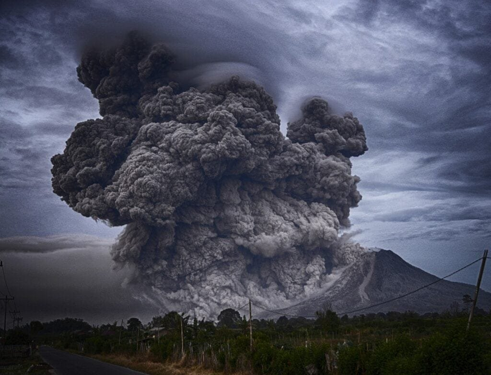

In "Understanding Volcanic Eruption Patterns and Their Impacts," you will gain a comprehensive understanding of volcanoes and their effects. Volcanoes, formed from molten rock, gases, and debris, erupt in various ways depending on factors such as lava viscosity and gas content. From the explosive eruptions seen in the "Ring of Fire" to the gradual eruptions of shield volcanoes in Hawaii, each type of volcano presents unique challenges and benefits. By exploring the geographical distribution, eruption causes, hazards, and benefits of volcanoes, you will be equipped to analyze these natural wonders more deeply. Understanding the patterns of volcanic activities over geological time scales is vital for predicting future eruptions and protecting vulnerable communities.

This image is property of pixabay.com.

## Understanding Volcanic Activities Through Geological Time Scales

### Definition of a Geological Time Scale

A geological time scale is a system used by geologists to divide the Earth's history into different intervals based on significant geological events. It provides a framework for understanding the sequence of past geological events and the relative timing of these events. By studying the geological time scale, scientists can determine the age of rocks, fossils, and various geological formations. This knowledge is crucial in [understanding volcanic](https://magmamatters.com/understanding-volcanic-formation-a-comprehensive-guide/ "Understanding Volcanic Formation: A Comprehensive Guide") activities throughout history and how they have shaped the Earth's landscape.

### Influence of Geological Time Scales on Volcanic Activities

The geological time scale is essential in understanding the patterns and processes of volcanic activities over time. It allows scientists to identify trends and correlations between volcanic eruptions and geological events such as plate tectonics, climate change, and the evolution of life. By studying volcanic activities present in different time periods, researchers can decipher the underlying causal factors, identify potential hazards, and make predictions about future volcanic activities. The geological time scale provides a historical context that helps us comprehend the long-term behavior of volcanoes and their impact on the Earth.

### Analyzing the Past Records of Volcanic Activities

One significant advantage of using the geological time scale to study volcanic activities is the ability to analyze past records. By examining volcanic rocks, ash layers, and other volcanic deposits, scientists can reconstruct the sequence and intensity of previous eruptions. This analysis provides valuable information about the duration, frequency, and explosiveness of volcanic activities over geological time. By comparing these records across different time periods, researchers gain insights into the factors that influence volcanic behavior, such as changes in magma viscosity, gas content, and tectonic activity. Understanding the past records of volcanic activities is crucial for predicting future eruptions and assessing potential volcanic hazards.

## Properties of Gases and Lava in Volcanic Eruptions

### Roles of Molten Rock or Magma

Molten rock, known as magma when it is beneath the Earth's surface, plays a crucial role in volcanic eruptions. It is primarily composed of silicate minerals, dissolved gases, and various elements. As magma rises towards the surface, it accumulates in magma chambers, generating immense pressure. When the pressure becomes too great to contain, the magma erupts through the volcanic vent, resulting in a volcanic eruption. The composition and physical properties of magma, such as viscosity, gas content, and temperature, determine the explosiveness and type of eruption.

### Functions of Volcanic Gases

Volcanic gases are another key component of volcanic eruptions. These gases, which include water vapor, carbon dioxide, sulfur dioxide, and hydrogen sulfide, are released from the magma during an eruption. The gas content of magma affects its viscosity, or ability to flow. Gases dissolved in magma can significantly increase its volume, causing explosive eruptions. Additionally, volcanic gases can have significant environmental impacts. For example, sulfur dioxide released during an eruption can lead to the formation of acid rain, affecting air quality and posing risks to human health.

### Influence of Magma Viscosity on the Explosiveness of Eruptions

Magma viscosity, or its resistance to flow, plays a crucial role in determining the explosiveness of volcanic eruptions. Viscosity is influenced by the composition of magma and its temperature. Magma with high silica content tends to be more viscous, while low-silica magma is more fluid. Viscous magma traps gas bubbles, preventing their escape and increasing pressure within the magma chamber. When the pressure becomes too great, the trapped gases forcefully propel the magma, leading to explosive eruptions. In contrast, less viscous magma allows gases to escape more easily, resulting in effusive eruptions characterized by the slow release of lava.

This image is property of pixabay.com.

## Types of Volcanoes

### Composite Volcanoes

Composite volcanoes, also known as stratovolcanoes, are tall, cone-shaped volcanoes built up by alternating layers of lava, ash, and other volcanic debris. These volcanoes are typically characterized by explosive eruptions due to the high viscosity of magma. Mount St. Helens and Mount Fuji are well-known examples of composite volcanoes. They are often found at convergent plate boundaries where subduction occurs, resulting in the melting of oceanic crust and the formation of explosive magma.

### Shield Volcanoes

Shield volcanoes have a broad, gently sloping shape resembling a warrior's shield. They are formed by the accumulation of low-viscosity basaltic lava, which spreads widely before solidifying. Shield volcanoes are typically associated with hotspots and can be immense in size. The Hawaiian Islands are composed of shield volcanoes, with Mauna Loa and Mauna Kea being prime examples. Unlike composite volcanoes, shield volcanoes have relatively less explosive eruptions due to the lower viscosity of their magma.

### Cinder Cone Volcanoes

[Cinder cone](https://magmamatters.com/the-birth-of-new-land-understanding-cinder-cones/) volcanoes are the simplest and smallest type of volcano. They are formed by explosive eruptions that eject volcanic cinders and magma fragments into the air, creating a cone-shaped hill. Cinder cone volcanoes often have a steepsided, conical shape and a central vent through which materials are expelled during eruptions. These volcanoes are typically short-lived and have relatively infrequent eruptions. The Parícutin volcano in Mexico is a famous example of a cinder cone volcano.

### Stratovolcanoes

Stratovolcanoes, also known as composite volcanoes or conical volcanoes, are tall and symmetrical volcanoes formed by alternating layers of lava and pyroclastic material. They are typically found at subduction zones, where one tectonic plate is subducting beneath another. Stratovolcanoes have steep sides and a central vent through which eruptions occur. Mount Vesuvius in Italy and Mount Rainier in the United States are well-known stratovolcanoes. Due to the high viscosity of their magma, stratovolcanoes often experience explosive eruptions.

### Differences and Similarities Among Various Volcanoes

While composite, shield, cinder cone, and stratovolcanoes have distinct characteristics, they are all formed by volcanic activities. They differ in terms of shape, size, and eruption patterns. Composite and stratovolcanoes are known for their explosive eruptions, often caused by the high viscosity of their magma. Shield volcanoes, on the other hand, have less explosive eruptions due to their lower-viscosity magma. Cinder cone volcanoes are generally characterized by smaller and less frequent eruptions. Despite their differences, all types of volcanoes provide valuable insights into the geological processes and behavior of these [natural phenomena](https://magmamatters.com/the-art-and-science-of-volcano-monitoring/ "The Art and Science of Volcano Monitoring").

## Volcanic Eruption Patterns

### Types of Eruption Patterns: Explosive vs Effusive

Volcanic eruptions can be categorized into two main patterns: explosive and effusive. Explosive eruptions are characterized by violent explosions and the ejection of ash, volcanic bombs, and pyroclastic flows. These eruptions occur when highly viscous magma, containing large amounts of gas, is trapped within the volcano. When the pressure becomes too great, the gas and magma explosively escape, leading to the formation of volcanic ash clouds and the deposition of pyroclastic material. In contrast, effusive eruptions involve the slow and steady release of lava through vents or fissures. These eruptions are typically associated with shield volcanoes and result in the gradual flow of lava, without explosive activity.

### Factors Affecting Eruption Patterns

Several factors can influence the eruption patterns of volcanoes. One key factor is the magma's viscosity, which determines its resistance to flow. High-viscosity magma tends to result in explosive eruptions, as the gas cannot escape easily from the thick magma. The gas buildup eventually leads to an explosive release of pressure. Another significant factor is the gas content of the magma. Higher gas content increases the likelihood of explosive eruptions. The composition of magma, including its silica content, also plays a role. Magma with higher silica content tends to have higher viscosity, resulting in more explosive eruptions. The type of volcano and its eruptive history can also influence eruption patterns.

### How Eruptions Vary Over Time

Eruptions can vary both in terms of intensity and frequency over time. The behavior of a volcano may change during different eruptive phases, ranging from quiet periods with no eruptions to periods of high activity. Volcanoes can have long periods of dormancy followed by sudden eruptions or exhibit more continuous eruptive activity. By studying the past eruptive history of volcanoes, scientists can identify patterns and better predict future volcanic activities. Monitoring volcanoes in real-time through seismic, gas, and ground deformation measurements provides further insights into the variations of eruption patterns and helps in evaluating potential volcanic hazards.

This image is property of pixabay.com.

## Geographical Distribution of Volcanoes

### Volcanoes at Plate Boundaries

Many volcanoes are located at plate boundaries, where tectonic plates interact. The most common type of plate boundary associated with volcanic activity is a convergent boundary, where one plate is forced beneath another. This process, known as subduction, causes the melting of the subducting plate, leading to the formation of magma and volcanic activity. The Pacific Ring of Fire, a major area in the Pacific Ocean where numerous volcanic eruptions occur, is primarily formed by subduction zones. Volcanoes can also be found at divergent plate boundaries, where plates move apart, allowing magma to rise to the surface and form new volcanic features.

### Volcanoes at Hot Spots

Hot spots are another geologically significant location for volcanoes. These are areas where magma rises from deep within the Earth's mantle, unrelated to plate boundaries. Hot spots are thought to be associated with mantle plumes, which are upwellings of abnormally hot rock. The Hawaiian Islands are a prime example of volcanoes formed by hot spots. As the Pacific Plate moves over a stationary hot spot, new volcanic islands are formed. Hot spot volcanoes tend to be shield volcanoes, characterized by low viscosity magma and less explosive eruptions.

### Volcanoes at Rift Zones

Volcanoes can also occur at rift zones, where the Earth's crust is being pulled apart, resulting in a series of fractures or fissures. Magma rises through these fissures and forms new volcanic features. The East African Rift Valley is an example of a rift zone with active volcanic activity. The process of rifting leads to the creation of new crust and the formation of volcanic mountains. Rift zone volcanoes often exhibit effusive eruptions, with relatively gentle lava flows compared to other types of volcanoes.

### Significance of the 'Ring of Fire'

The Ring of Fire, also known as the circum-Pacific belt, is a major area in the basin of the Pacific Ocean where a large number of earthquakes and volcanic eruptions occur. It is characterized by a continuous series of volcanic arcs, volcanic belts, and plate movements. The Ring of Fire encompasses the Pacific plate and several other tectonic plates, making it one of the most geologically active regions on Earth. Volcanoes along the Ring of Fire are associated with subduction zones and are known for their explosive nature. The understanding and study of the Ring of Fire provide crucial insights into volcanic activities and their impact on the surrounding regions.

## Causes of Volcanic Eruptions

### Role of Tectonic Activity

Tectonic activity, driven by the movement and interaction of tectonic plates, plays a significant role in volcanic eruptions. The majority of volcanic activity occurs at plate boundaries, where the earth's crust is subjected to intense pressure and stresses. Convergent plate boundaries, where one plate subducts beneath another, are particularly prone to volcanic activity. The subducting plate melts under the heat and pressure, generating magma that ultimately leads to volcanic eruptions. Divergent plate boundaries and rift zones, where plates move apart, also contribute to the formation of new volcanic features.

### Effects of Pressure Changes

Pressure changes within the Earth's crust can trigger volcanic eruptions. As magma rises towards the surface, it accumulates in magma chambers, exerting immense pressure on the overlying rocks. When the pressure becomes too great to contain, the magma forcefully escapes through volcanic vents, resulting in an eruption. Additionally, changes in tectonic stress and the release of gases dissolved in magma can cause pressure variations, leading to volcanic activity. Monitoring these pressure changes is crucial for understanding and predicting volcanic eruptions.

### Influence of the Earth's Mantle Composition

The composition of the Earth's mantle, the layer beneath the crust, also influences volcanic activity. The mantle is composed of rocks rich in iron and magnesium, which have different melting temperatures compared to the crust. When mantle rocks undergo partial melting due to changes in temperature and pressure, they generate magma that can rise to the surface and form volcanoes. The composition of the mantle can vary across different regions, resulting in variations in volcanic activity. The study of mantle composition provides valuable insights into the causes and behaviors of volcanic eruptions.

## Predicting Volcanic Activity

### Modern Technological Methods

Advancements in technology have significantly improved our ability to predict volcanic activity. Monitoring networks equipped with seismometers, gas analyzers, and ground deformation instruments allow scientists to detect precursory signals of volcanic eruptions. Seismic activity, such as increased earthquake frequency and intensity, can indicate the movement of magma beneath a volcano. Changes in gas emissions, such as an increase in sulfur dioxide, can also provide early warnings of volcanic unrest. Ground deformation measurements, conducted using GPS and satellite-based techniques, can identify changes in a volcano's shape or uplift, indicating magma accumulation and potential eruption.

### Historical Data and Statistics

Historical data and statistics play a crucial role in predicting volcanic activity. By studying past eruptions and their patterns, scientists can identify trends and correlations. They can analyze eruption frequency, duration, and volcanic explosivity index to assess the likelihood of future eruptions. Understanding the historical behavior of specific volcanoes provides valuable insights into their eruptive cycles and the potential hazards they pose. Combining historical data with real-time monitoring allows scientists to make more accurate predictions and issue timely warnings to communities at risk.

### Monitoring of Seismic Activity

Seismic monitoring is a fundamental method for predicting volcanic activity. By measuring and analyzing seismic waves generated by volcanic processes, scientists can gain insights into the movement of magma and identify potential eruption precursors. Volcanic earthquakes, which occur due to the movement of magma underground, can serve as early warning signs of impending eruptions. The location, frequency, and intensity of these earthquakes can help determine the level of volcanic unrest and the likelihood of an eruption. Continuous monitoring of seismic activity is critical for the accurate prediction of volcanic eruptions and the mitigation of associated hazards.

## Volcanic Hazards

### Potential for Disaster: Case Studies

Volcanic eruptions have the potential to cause significant disasters, affecting both humans and the environment. Throughout history, there have been numerous case studies highlighting the devastating impacts of volcanic eruptions. The eruption of Mount Vesuvius in 79 AD, which buried the cities of Pompeii and Herculaneum, is a prime example of the destructive power of volcanic eruptions. More recent eruptions, such as the 1991 eruption of Mount Pinatubo in the Philippines, resulted in widespread ashfall, pyroclastic flows, and lahars, causing the displacement of thousands of people and significant economic losses.

### Human Health Risks

Volcanic eruptions pose various health risks to communities living in proximity to volcanoes. The emission of volcanic gases, such as sulfur dioxide and hydrogen sulfide, can lead to respiratory problems, eye irritation, and exacerbate pre-existing health conditions. Volcanic ash, consisting of tiny particles of glass and rock, can cause respiratory issues and skin irritation. Prolonged exposure to volcanic ash can lead to long-term health problems, including silicosis. Pyroclastic flows and lahars, fast-moving mixtures of hot gas, ash, and water, can cause severe burns and injuries. Understanding these health risks is crucial for implementing preventive measures and safeguarding the well-being of communities living near volcanoes.

### Environmental Impact

Volcanic eruptions have a significant impact on the environment. The deposition of volcanic ash can affect agricultural lands, disrupting crop growth and damaging vegetation. Ashfall can also contaminate water sources, impacting aquatic ecosystems. The release of volcanic gases, such as sulfur dioxide, can contribute to air pollution and the formation of acid rain. This can have adverse effects on air quality, soil pH, and the health of plants and animals. Volcanic eruptions can also trigger lahars and mudflows, which can lead to the destruction of habitats, loss of biodiversity, and contamination of rivers and lakes. Understanding and mitigating the environmental impacts of volcanic eruptions are essential for preserving ecosystems and biodiversity.

## Benefits of Volcanic Eruptions

### Nutrient Rich Soil and Fertility

One of the benefits of volcanic eruptions is the creation of nutrient-rich soil. The ash and other volcanic debris deposited during eruptions contain minerals, such as potassium, phosphorus, and calcium, which are essential for plant growth. Over time, these minerals weather and break down, enriching the soil and providing the necessary nutrients for vegetation. Volcanic soils, known as andisols, are highly fertile and prized for their agricultural productivity. They support the growth of crops, such as coffee, cocoa, and various fruits, benefiting local economies and food production.

### Creation of New Landmasses

Volcanic eruptions contribute to the creation of new landmasses. Lava flows, when cooled and solidified, form new rock formations and landforms. Over time, repeated volcanic eruptions can build up layers of volcanic material, leading to the formation of volcanic islands or expanding existing landmasses. The Hawaiian Islands, formed by volcanic activity over millions of years, are a prime example of this process. The creation of new landmasses through volcanic eruptions provides opportunities for colonization, tourism, and the preservation of unique ecosystems.

### Generation of Geothermal Energy Resources

Volcanic eruptions also play a role in the generation of geothermal energy resources. Geothermal energy harnesses the heat stored beneath the Earth's surface to generate electricity and provide heating and cooling systems. Volcanic regions often have high geothermal potential due to the proximity of hot rocks and magma. Geothermal power plants utilize the natural heat energy from underground reservoirs, tapping into the Earth's natural resources without the need for combustion or the emission of greenhouse gases. The development of geothermal energy resources provides a sustainable and renewable energy alternative, reducing dependence on fossil fuels.

## Mitigating Risks and Community Preparedness

### Importance of Efficient Warning Systems

Efficient warning systems are crucial for mitigating risks associated with volcanic eruptions. Real-time monitoring of volcanic activity, combined with accurate eruption predictions, enables the timely issuance of warnings to communities at risk. Advanced technologies, such as satellite monitoring and remote sensing, can provide valuable information about volcanic behavior and help in the early detection of signs of unrest. These warning systems allow authorities to evacuate populations in endangered areas, implement emergency response plans, and minimize the potential loss of life and property. Regular drills, public education programs, and community engagement are essential components of an effective warning system.

### Community Education and Evacuation Plans

Community education and awareness play a vital role in preparing for volcanic eruptions. Educating residents living near volcanoes about the risks and hazards associated with volcanic activity helps them understand how to respond and protect themselves. Communities can be trained on evacuation procedures, including identifying safe zones and routes, assembling emergency supply kits, and implementing communication plans. It is important to involve communities in the development and testing of response plans to ensure their participation and readiness during volcanic emergencies. By empowering communities with knowledge and resources, the impacts of volcanic eruptions can be minimized.

### Land Use Policies and Building Regulations

Land use policies and building regulations are essential tools for mitigating the risks posed by volcanic eruptions. Zoning regulations can help identify areas prone to volcanic hazards and restrict or regulate construction in these high-risk zones. Building codes can be designed to incorporate volcanic hazard resilience, such as the use of durable materials and design features that withstand volcanic ashfall and ground deformation. Retrofitting existing structures to enhance their resilience to volcanic hazards is also a crucial step in minimizing potential damage. Implementing comprehensive land use policies and building regulations ensures that communities are better equipped to withstand the impacts of future volcanic eruptions.

In conclusion, understanding volcanic activities through [geological](https://magmamatters.com/geothermal-energy-and-its-volcanic-origins/ "Geothermal Energy and Its Volcanic Origins") time scales is crucial for comprehending the behavior and impacts of volcanoes. By studying past records, analyzing eruption patterns, and monitoring seismic activity, scientists can gain insights into the causes, patterns, and hazards associated with volcanic eruptions. This knowledge is instrumental in predicting volcanic activity, mitigating risks to communities, and harnessing the benefits that volcanoes offer. With efficient warning systems, community preparedness, and appropriate land use policies, the potentially devastating impacts of volcanic eruptions can be minimized, allowing us to coexist with these incredible natural phenomena.

