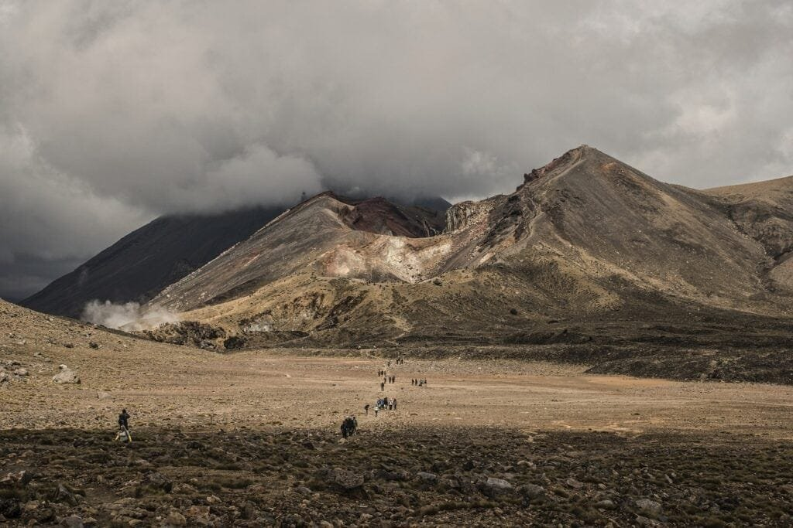

Volcanoes, the majestic and awe-inspiring forces of nature, hold secrets that are both fascinating and potentially catastrophic. From the molten rock that flows through their fiery veins to the billowing ash that blankets the sky, volcanoes create a spectacle unlike any other. In the vast expanse of the Pacific Ocean lies a region known as the "Ring of Fire," where volcanic activity is particularly prevalent. This article aims to delve into the world of volcanoes, specifically focusing on the hazards they pose and the environmental impact they have. By understanding the intricacies of these fiery giants, we can better anticipate their behavior and safeguard the communities they surround. So, grab your metaphorical hard hat and embark on a journey of discovery as we explore the captivating world of volcanic hazards in the Ring of Fire.

This image is property of pixabay.com.

## Definition and Overview of the Ring of Fire

The Ring of Fire is a major area in the basin of the Pacific Ocean where a large number of earthquakes and volcanic eruptions occur. It is a direct result of plate tectonics and the movement and collision of lithospheric plates. This area is known for its intense seismic activity, with about 90% of the world's earthquakes occurring within the Ring of Fire.

### Geographical location and extent of the Ring of Fire

The Ring of Fire spans a vast distance, encircling the Pacific Ocean. It stretches over 40,000 kilometers (25,000 miles) and includes several countries such as Japan, the Philippines, Indonesia, New Zealand, Chile, and the United States (including Alaska and Hawaii). It is a continuous series of oceanic trenches, volcanic arcs, volcanic belts, and plate movements.

### Significance in global tectonic activity and volcanic eruptions

The Ring of Fire is of immense importance in global tectonic activity and volcanic eruptions. The converging tectonic plates in this region create intense volcanic and seismic activity. The subduction of oceanic plates beneath continental plates leads to the formation of explosive volcanoes. The Pacific Plate, which is the largest tectonic plate, is responsible for much of the volcanic activity in this region.

### Number and types of volcanoes within the Ring of Fire

The Ring of Fire is home to over 75% of the world's active volcanoes. There are different types of volcanoes found within this region, including stratovolcanoes (composite volcanoes), shield volcanoes, and calderas. These volcanoes exhibit varying eruptive behaviors and have distinct characteristics depending on the type of magma they erupt.

## Formation of Volcanoes

### Process of volcanoes formation

Volcanoes are formed when molten rock called magma rises to the surface of the Earth. The process begins deep within the Earth's mantle, where heat and pressure cause rocks to melt and form magma chambers. As the magma rises, it may accumulate in chambers beneath the Earth's surface or find a pathway to the surface through cracks in the Earth's crust.

### Role of tectonic movements and hotspots in volcanoes formation

Tectonic movements play a crucial role in the formation of volcanoes. Volcanoes in the Ring of Fire are primarily formed at convergent plate boundaries, where one tectonic plate is forced beneath another in a process called subduction. The subducting plate releases water and other volatile substances, leading to the melting of the mantle above it and the formation of magma.

Hotspots also contribute to volcano formation, especially in regions like Hawaii. Hotspots are areas of increased heat in the mantle, often associated with plumes of hot rock rising from deep within the Earth. As the tectonic plate moves over the hotspot, magma is generated, leading to the formation of volcanic islands or seamounts.

### Differences in formation of volcanoes within and outside the Ring of Fire

The formation of volcanoes within and outside the Ring of Fire differs primarily in their tectonic settings. Volcanoes within the Ring of Fire are formed at plate boundaries, where subduction or convergence occurs. These volcanoes are typically explosive, with stratovolcanoes being the most common type. In contrast, volcanoes outside the Ring of Fire, such as those in Hawaii, are formed over hotspots and are characterized by more gentle eruptions, producing shield volcanoes.

This image is property of pixabay.com.

## Types of Volcanoes and their Characteristics

### Various types of volcanoes

There are several types of volcanoes, each with its distinct characteristics. The main types include stratovolcanoes, shield volcanoes, and calderas.

1. Stratovolcanoes (Composite Volcanoes): These volcanoes are tall and conical, composed of alternating layers of solidified lava, ash, and volcanic rocks. They are characterized by explosive eruptions due to the high viscosity of their magma.
    
2. Shield Volcanoes: Shield volcanoes have a broad, gently sloping profile and are formed by low viscosity lava that spreads out in thin layers. They have a more effusive eruption style, producing lava flows that can cover vast areas.
    
3. Calderas: Calderas are large, basin-shaped depressions that form when the summit of a volcano collapses following a massive eruption. They can be several kilometers in diameter and are often associated with highly explosive eruptions.
    

### Characteristic features of each type

Stratovolcanoes are known for their steep slopes and symmetrical cone shape. They often have a central vent and multiple subsidiary vents, allowing magma to reach the surface through various pathways. Shield volcanoes, on the other hand, have a broad, dome-like shape with gently sloping sides. They are primarily composed of low viscosity lava that flows easily across the landscape. Calderas are characterized by their large, bowl-shaped depressions, often surrounded by steep walls or a rim of uplifted rock.

### Distribution of different types of volcanoes within the Ring of Fire

Within the Ring of Fire, [stratovolcanoes are the most common type of volcano](https://magmamatters.com/understanding-volcanic-formation-a-comprehensive-guide/ "Understanding Volcanic Formation: A Comprehensive Guide"). They are typically found in subduction zones, where one tectonic plate is forced beneath another. Shield volcanoes are also present, particularly in volcanic hotspots like Hawaii and Iceland. Calderas can be found within the Ring of Fire as well, often associated with large explosive eruptions.

## Causes of Volcanic Eruptions

### Role of pressure buildup in eruptions

Volcanic eruptions are primarily caused by the buildup of pressure within a volcano's magma chamber. As molten rock rises to the surface, it encounters resistance from the overlying rock layers. The pressure continues to increase until it exceeds the confining strength of the rock, leading to an explosive release of gases, magma, and fragmented rock material.

### Impact of magma's viscosity and gas content on eruptions

Viscosity, or the resistance of magma to flow, plays a crucial role in eruption styles. High-viscosity magma, such as that found in stratovolcanoes, traps gases within it, leading to increased pressure buildup and explosive eruptions. In contrast, low-viscosity magma, like the one found in shield volcanoes, allows gases to escape more easily, resulting in effusive eruptions with less explosive force.

The gas content of magma also affects eruption behavior. Dissolved gases, primarily water vapor, [carbon dioxide](https://magmamatters.com/geothermal-energy-and-its-volcanic-origins/ "Geothermal Energy and Its Volcanic Origins"), and sulfur dioxide, become volatile as the magma reaches the surface. As pressure decreases during ascent, the gases rapidly expand, creating explosive eruptions. The specific gas content can vary depending on the magma's composition and the tectonic setting.

### Triggering mechanisms of eruptions in Ring of Fire volcanoes

Eruptions in Ring of Fire volcanoes can be triggered by various mechanisms. Subduction zones, where one tectonic plate is forced beneath another, are particularly prone to explosive eruptions. The subducting plate releases water and other volatile substances, causing the mantle above to partially melt and leading to the formation of magma chambers. These chambers can become pressurized over time, eventually triggering large-scale eruptions.

Hotspots, which result from plumes of hot rock rising from the deep mantle, also contribute to volcanic activity within the Ring of Fire. As the tectonic plate moves over the hotspot, magma is generated, leading to eruptions and the formation of volcanic islands or seamounts.

This image is property of pixabay.com.

## Major Volcanic Hazards

### Types of hazards stemming from volcanic eruptions

Volcanic eruptions can pose several hazards to both human populations and the environment. Some of the major hazards include:

1. Pyroclastic Flows: These are fast-moving, superheated clouds of gas, ash, and volcanic debris that can rush down the slopes of a volcano at high speeds, destroying everything in their path.
    
2. Volcanic Ashfall: During eruptions, explosive volcanoes can release large quantities of volcanic ash into the atmosphere. Ashfall can disrupt air travel, contaminate water sources, and pose health risks to humans and animals.
    
3. Lahars: Lahars are destructive mudflows that occur when volcanic ash and other debris mix with water, either from heavy rainfall or melting snow. They can travel long distances and devastate communities downstream.
    
4. Volcanic Gases: When volcanoes erupt, they release various gases, including [sulfur dioxide and carbon](https://magmamatters.com/the-art-and-science-of-volcano-monitoring/ "The Art and Science of Volcano Monitoring") dioxide. These gases can be toxic and pose serious health risks if inhaled in high concentrations.
    

### Factors determining the severity of a hazard

The severity of volcanic hazards depends on several factors, including the type of eruption, the volume and composition of magma, and the proximity of human populations to the volcano. Explosive eruptions with high ash content can cause severe impacts over large areas, while less explosive eruptions may have more localized effects. The presence of water, such as rivers or lakes, can also exacerbate hazards like lahars if volcanic activity triggers destabilization.

### Specific hazards associated with Ring of Fire volcanoes

Ring of Fire volcanoes are associated with a wide range of hazards due to their explosive nature. The stratovolcanoes in this region often produce pyroclastic flows and explosive eruptions that generate significant ashfall. The presence of large populations in countries surrounding the Pacific Ocean can put many people at risk. Additionally, the Ring of Fire is prone to triggering tsunamis during volcanic eruptions, which can cause immense coastal destruction and loss of life.

## Historical Significant Eruptions in the Ring of Fire

### Noted past eruptions and their impacts

The Ring of Fire has a long history of significant volcanic eruptions, some of which have had major impacts on human civilization. The eruption of Mount Vesuvius in 79 A.D. buried the Roman cities of Pompeii and Herculaneum under volcanic ash, preserving them for centuries and providing invaluable insights into ancient Roman life. The 1815 eruption of Mount Tambora in Indonesia is considered one of the most powerful eruptions in recorded history, causing a global climate anomaly known as the "Year Without a Summer." More recent eruptions, such as the 1991 eruption of Mount Pinatubo in the Philippines, caused large-scale evacuations and had a significant impact on regional climate.

### Pattern and frequency of significant eruptions

Significant eruptions within the Ring of Fire do not follow a set pattern or frequency. Instead, they occur sporadically and are often unpredictable. Some volcanoes may remain dormant for hundreds of years before experiencing a major eruption, while others may exhibit more frequent activity. Monitoring and understanding the behavior of individual volcanoes is crucial for predicting and mitigating the impacts of future eruptions.

### Lessons learned from past eruptions within the Ring of Fire

Past eruptions within the Ring of Fire have provided valuable lessons for both scientists and communities at risk. Improved monitoring technologies and predictive models have been developed to better understand volcanic activity and provide advance warning to nearby populations. Communities living near active volcanoes have also implemented evacuation plans and established shelters to ensure the safety of residents during eruptions. Furthermore, the impacts of past eruptions have highlighted the need for international cooperation in sharing knowledge and resources to support disaster response and recovery efforts.

## Influence of Volcanic Eruptions on Local and Global Climate

### Impact of volcanic ash and gases on atmospheric temperatures

Volcanic eruptions can have a significant influence on local and global climate. The release of ash and gases into the atmosphere can decrease incoming solar radiation, leading to a temporary cooling effect. Volcanic ash particles can remain suspended in the atmosphere for months or even years, scattering sunlight and reducing the amount of energy reaching the Earth's surface. Sulfur dioxide gas released during eruptions can oxidize in the stratosphere, forming aerosol particles that reflect solar radiation back into space.

### Role of volcanic eruptions in climate change

While volcanic eruptions can cause short-term cooling effects, they do not play a substantial role in long-term climate change. The release of greenhouse gases from volcanic eruptions, such as carbon dioxide, is relatively small compared to human activities. The gradual increase in atmospheric carbon dioxide due to human-induced activities, such as burning fossil fuels, has a much more significant impact on global climate change.

## Economic and Environmental Effects of Volcano Eruptions

### Effects of eruptions on local economies and industries

Volcanic eruptions can have substantial economic consequences for affected regions. The disruption caused by volcanic ash can lead to the closure of airports, grounding flights, and impacting tourism and travel-related industries. Ashfall can damage crops and livestock, resulting in agricultural losses, and ash-contaminated water can affect fishing industries. Additionally, the destruction of infrastructure and property during eruptions can cause long-term economic setbacks for communities.

### Environmental impact of volcanic eruptions

Volcanic eruptions can have both short-term and long-term environmental impacts. In the short term, the release of volcanic gases and ash can affect air quality, leading to respiratory problems and other health issues. The deposition of ash onto land and water bodies can disrupt ecosystems and damage vegetation. In the long term, volcanic eruptions can contribute to soil fertility as ash deposits provide essential nutrients for plant growth.

### Balance of volcanic benefits and hazards

While volcanic eruptions pose significant hazards, they also bring various benefits to the Earth. Volcanic activity plays a crucial role in the formation of new land, contributing to the creation of islands and shaping the Earth's topography. Volcanic soils are highly fertile and support agricultural productivity. Additionally, volcanic landscapes are often sought after for their natural beauty and tourism potential. Balancing these benefits with the potential hazards of volcanic eruptions requires effective risk management strategies and careful planning.

## Mitigation of Volcanic Risks

### Current methods for prediction of volcanic activity

Predicting volcanic activity is a complex task, as eruptions can occur with little warning. However, scientists employ various techniques to monitor and forecast volcanic eruptions. These methods include seismic monitoring, which detects earthquake activity associated with volcanic unrest, as well as ground deformation measurements to identify changes in the volcano's shape. Gas monitoring helps track changes in the composition and emission rates of volcanic gases, providing insights into magma movement and eruption likelihood. Additionally, thermal imaging and satellite-based remote sensing techniques can detect temperature variations indicative of volcanic activity.

### Technologies and strategies for disaster preparedness

Disaster preparedness is crucial in mitigating volcanic risks and ensuring the safety of nearby communities. Early warning systems, including sirens, text alerts, and community-based notification protocols, help provide timely alerts in the event of an impending eruption. Evacuation plans and emergency shelters are essential for protecting the population during eruptions, while infrastructure resilience measures can help minimize damage and facilitate rapid recovery post-eruption. Geological hazard maps, land-use planning regulations, and building codes that consider volcanic hazards are critical tools for reducing vulnerability to volcanic activity.

### Role of community education and evacuation planning in mitigating volcanic risks

Community education and evacuation planning play a vital role in mitigating volcanic risks. By [educating residents about the nature of volcanoes](https://magmamatters.com/the-environmental-impact-of-volcanic-eruptions-2/ "The Environmental Impact of Volcanic Eruptions") and the potential hazards they pose, communities can develop a greater understanding of the associated risks. This knowledge empowers individuals to make informed decisions during volcanic crises and increases their willingness to cooperate with evacuation procedures. Regular drills and exercises can improve emergency response capabilities and ensure efficient evacuations when necessary.

## Future Prospects for Volcanic Activity in the Ring of Fire

### Potential for future volcanic activity within the Ring of Fire

Given the continuous subduction of tectonic plates and the nature of the Ring of Fire as a highly active region, future volcanic activity within this area is expected. Volcanoes such as Mount St. Helens in the United States, Mount Fuji in Japan, and Taal Volcano in the Philippines continue to pose potential risks. Ongoing monitoring and research are crucial for gaining a better understanding of volcanic behavior and improving eruption forecasting capabilities.

### Anticipated challenges and opportunities in volcanic risk mitigation

Volcanic risk mitigation in the Ring of Fire faces various challenges and opportunities. The high population density and socio-economic diversity of the countries in this region present challenges in implementing comprehensive risk reduction strategies. Limited resources and competing priorities can hinder investment in monitoring infrastructure and emergency preparedness measures. However, advances in technology, international collaboration, and continuous community engagement provide opportunities to develop innovative solutions and enhance volcanic risk mitigation efforts.

### Emerging research trends in volcano science and risk management

As scientists continue to study volcanoes within the Ring of Fire, there are several emerging research trends in volcano science and risk management. This includes advancements in remote sensing techniques, such as satellite-based monitoring, which allows for frequent and detailed observations of volcanic activity. Improved modeling and data analysis techniques enable scientists to better understand volcanic processes and improve eruption forecasting. Additionally, interdisciplinary approaches combining geology, geophysics, chemistry, and social sciences are gaining prominence, facilitating a comprehensive understanding of volcanic hazards and enhancing risk management strategies.

Related Posts: [Mitigating Risks: Forecasting Volcanic Activity in Prone Areas](https://magmamatters.com/mitigating-risks-forecasting-volcanic-activity-in-prone-areas/), [The Formation and Eruption Patterns of Volcanoes](https://magmamatters.com/the-formation-and-eruption-patterns-of-volcanoes-4/), [The Pyroclastic Phenomena of Pompeii: 7 Insights to Explore](https://magmamatters.com/the-pyroclastic-phenomena-of-pompeii-7-insights-to-explore/), [Tips for Capturing Volcano Pyroclastic Flow Photos](https://magmamatters.com/tips-for-capturing-volcano-pyroclastic-flow-photos/), [Understanding Volcanoes and Their Eruption Patterns](https://magmamatters.com/understanding-volcanoes-and-their-eruption-patterns/)
