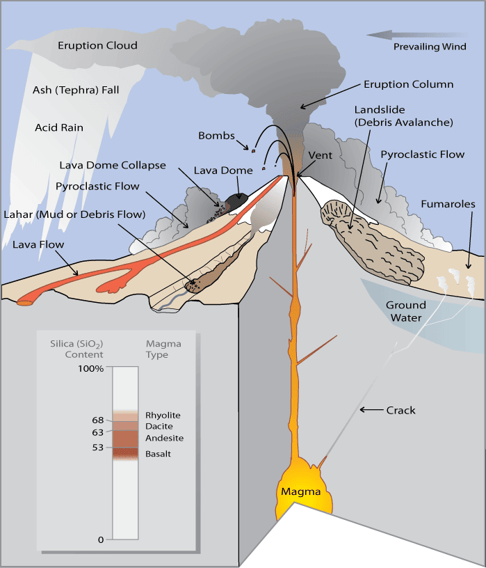
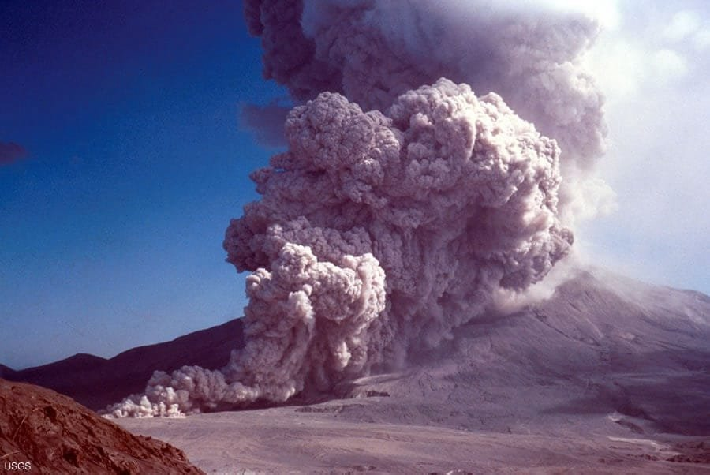
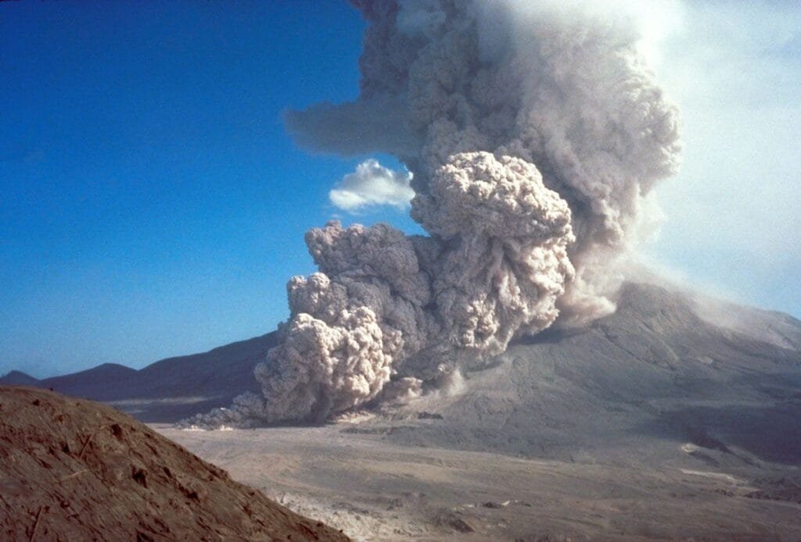

Volcanoes, awe-inspiring wonders of nature, have fascinated humans for centuries. From the towering peaks of the "Ring of Fire" to the lush shield volcanoes of Hawaii, these geological features hold both beauty and danger. In order to better understand the risks they pose, it is important to delve into the world of volcanic hazards, particularly the menacing potential of pyroclastic flows. These deadly eruptions, consisting of hot gases, ash, and rock fragments, can travel at incredibly high speeds, incinerating everything in their path. By comprehending the factors that contribute to volcanic hazards, scientists can help protect communities located near these natural wonders.

This image is property of images.nationalgeographic.org.

## Understanding Volcanoes: Formation and Function

Volcanoes are fascinating natural formations that have captured the human imagination for centuries. But have you ever wondered how volcanoes are formed? It all starts deep beneath the Earth's surface, where molten rock, known as magma, builds up in chambers. This magma is formed from the melting of rock due to extreme heat and pressure.

As the magma continues to rise, it eventually finds a way to escape to the Earth's surface, causing an eruption. When the magma reaches the surface, it becomes known as lava. Along with the lava, gases and debris are also released during the eruption. These gases include water vapor, [carbon dioxide](https://magmamatters.com/the-art-and-science-of-volcano-monitoring/ "The Art and Science of Volcano Monitoring"), sulfur dioxide, and other volatile substances.

Volcanoes can be found in different parts of the world, but they are most commonly located along plate boundaries and rift zones. Plate boundaries are the areas where tectonic plates, which make up the Earth's crust, meet and interact with each other. When these plates collide or move apart, they create stress and pressure that can lead to volcanic activity.

The Pacific Ocean is home to one of the most famous volcanic regions, known as the "Ring of Fire." This area encircles the Pacific Ocean and is where many of the world's most active volcanoes can be found. The Ring of Fire is a direct result of the intense tectonic activity occurring along plate boundaries.

Another type of volcanic activity occurs in what are known as hotspots. Hotspots are areas where molten rock rises from deep within the Earth's mantle, creating localized volcanic activity. These hotspots are not necessarily located along plate boundaries but can be found anywhere on the Earth's surface.

Volcanoes come in different shapes and sizes, and they can be classified into various types. One common [type of volcano is the shield](https://magmamatters.com/understanding-volcanic-formation-a-comprehensive-guide/ "Understanding Volcanic Formation: A Comprehensive Guide") volcano, like those found in Hawaii. Shield volcanoes have broad, gently sloping sides and are formed by layers of lava flowing out and spreading over a large area. These eruptions are relatively calm and not very explosive.

Composite volcanoes, on the other hand, are known for their steep slopes and explosive eruptions. These volcanoes are composed of alternating layers of lava, ash, and volcanic debris. They get their name from the composite nature of their formation, as they are built up from multiple eruptions over time.

There are also other types of volcanoes, such as [cinder cones](https://magmamatters.com/the-birth-of-new-land-understanding-cinder-cones/) and lava domes, each with its own unique characteristics. These different types of volcanoes can give us insights into the specific conditions and processes occurring beneath the Earth's surface.

The eruption patterns of volcanoes are influenced by two main factors: lava viscosity and gas content. The viscosity of lava refers to its resistance to flow. Lava with low viscosity, such as basaltic lava, flows quickly and can spread over large areas. Lava with high viscosity, such as rhyolitic lava, is much thicker and slower-moving.

The gas content within the magma also plays a role in eruption patterns. Gases trapped within the magma exert pressure as the magma rises to the surface. If the magma has a high gas content, it can lead to explosive eruptions, as the pressure becomes too great to contain.

Understanding these factors is crucial in predicting volcanic eruptions and assessing the associated hazards. By studying the viscosity and gas content of magma, scientists can make informed predictions about eruption patterns and the potential risks they pose.

Volcanoes play a significant role in shaping the Earth's surface and have both positive and negative impacts on our planet. On one hand, volcanic eruptions can be highly destructive, causing widespread damage to human lives and infrastructure. Pyroclastic flows, in particular, are one of the most dangerous hazards associated with volcanic activity.

## Understanding Pyroclastic Flows

Pyroclastic flows are fast-moving currents of hot gas, ash, and rock fragments that flow down the sides of a volcano during an eruption. These flows can reach speeds of over 100 kilometers per hour and travel long distances, making them extremely hazardous.

Pyroclastic flows are formed when explosive volcanic eruptions release large amounts of gas, ash, and rock fragments into the air. The force of the eruption propels these materials high into the atmosphere, creating a deadly mixture. As the eruption column collapses, the pyroclastic flow begins to move rapidly down the volcano slope.

The components of pyroclastic flows are what make them so dangerous. The hot gases within the flow can reach temperatures of up to 1,000 degrees Celsius, causing severe burns and heat-related injuries. The molten rock fragments, known as volcanic bombs, can range in size from small pebbles to large boulders and can cause significant damage upon impact.

Pyroclastic flows can travel at high speeds, reaching distances of tens of kilometers from their source. The exact speed and distance covered by a pyroclastic flow depend on various factors, such as the volume of material erupted, the steepness of the slope, and the terrain over which it travels.

The danger posed by pyroclastic flows is immense. These flows can sweep away anything in their path, including trees, buildings, and even entire communities. The destruction caused by pyroclastic flows can be catastrophic, with devastating consequences for human lives and infrastructure.

Throughout history, there have been numerous major incidents of devastation caused by pyroclastic flows. The eruption of Mount Vesuvius in 79 AD, which buried the cities of Pompeii and Herculaneum under layers of ash and pyroclastic material, is one of the most well-known examples. More recently, the eruption of Mount Pinatubo in the Philippines in 1991 produced pyroclastic flows that caused widespread destruction and loss of life.

The difficulty in escaping pyroclastic flows adds to their danger. Due to their high speeds and the unpredictability of their paths, it is often challenging for people to evacuate in time. The flow's heat and toxicity also make it unsafe for individuals to be caught in its path.

Given the devastating impact of pyroclastic flows, it is essential to focus on both prevention and preparedness to minimize the loss of life and damage caused by these hazardous volcanic phenomena.

This image is property of pubs.usgs.gov.

## Preventing Damage from Pyroclastic Flows

Preventing damage from pyroclastic flows requires a multi-faceted approach that involves both community preparedness and structural measures. Educating communities living near [volcanoes about the risks posed by pyroclastic flows](https://magmamatters.com/the-environmental-impact-of-volcanic-eruptions-2/ "The Environmental Impact of Volcanic Eruptions") is crucial in ensuring their safety.

Community preparedness starts with providing clear information about volcanic hazards and equipping residents with the knowledge and skills needed to respond effectively during an eruption. This includes understanding evacuation routes, knowing when and how to evacuate, and having emergency supplies readily available.

Early warning systems play a vital role in alerting communities to the imminent danger of pyroclastic flows. These systems use various monitoring techniques, such as seismographs, gas sensors, and thermal cameras, to detect volcanic activity and provide timely warnings. Evacuation drills should be conducted regularly to ensure that residents are familiar with the evacuation process and can respond quickly in a real emergency.

Structural measures are also important in protecting communities from pyroclastic flows. Designing buildings and infrastructure to withstand the impact of volcanic materials can help minimize damage and reduce the risk to human lives. This can include using materials that are resistant to heat and impact, as well as constructing buildings on elevated platforms or strong foundations.

In areas with a high risk of pyroclastic flows, land-use planning is critical. Restricting development in hazardous zones can prevent the construction of buildings and infrastructure in areas prone to volcanic activity. This can be accomplished through zoning regulations and building codes that take into account the potential risks posed by pyroclastic flows.

Policies that address the long-term risk of pyroclastic flows are also essential. This includes considering the potential impacts of climate change on volcanic activity and establishing mechanisms for ongoing monitoring and assessment. Governments should work closely with scientists and experts to develop comprehensive strategies for managing volcanic hazards and ensuring the safety of affected communities.

By combining community preparedness, structural measures, and effective policies, it is possible to minimize the damage caused by pyroclastic flows and protect the lives and livelihoods of those living near volcanoes.

## Prediction and Monitoring of Volcanoes

Predicting volcanic eruptions and monitoring volcanic activity is crucial in mitigating eruption hazards and minimizing the impact on surrounding communities. Scientists use various methods and technologies to monitor volcanoes and gather data that can help in predicting eruptions.

One of the primary methods used in volcanic prediction is seismic monitoring. Seismic instruments, known as seismographs, are used to measure and record ground movements caused by volcanic activity. By analyzing the frequency and intensity of these ground movements, scientists can gain insights into the behavior of the volcano and detect any changes that may indicate an imminent eruption.

Gas monitoring is another essential technique used in volcanic prediction. Volcanic gases, such as sulfur dioxide, carbon dioxide, and hydrogen sulfide, can provide valuable information about the activity happening beneath the surface. Monitoring the gas emissions from a volcano can help scientists track changes in volcanic activity and identify potential signs of an eruption.

Infrared cameras and satellite imaging are also used to monitor volcanoes. These tools can detect subtle changes in temperature and ground deformation, which may indicate volcanic activity. By analyzing these images over time, scientists can identify patterns and trends that can help in predicting eruptions.

While these methods and technologies have greatly improved our ability to predict volcanic eruptions, there are limitations to their accuracy. Volcanic activity is highly complex and can be influenced by various factors that are difficult to measure and predict. Additionally, volcanoes can exhibit different behavior patterns, and what works for one volcano may not work for another. This highlights the need for ongoing research and technological advancements in the field of volcanic prediction.

Monitoring volcanoes is not only essential for predicting eruptions but also for assessing the risks and hazards associated with volcanic activity. By continuously monitoring volcanoes, scientists can provide timely warnings to communities living in the vicinity and help them prepare for potential eruptions.

This image is property of geology.com.

## Volcanoes' Influence on Climate

Volcanic eruptions have the potential to have a significant impact on the Earth's climate. When a volcano erupts, it releases large amounts of gases and particles into the atmosphere, which can have both short-term and long-term effects on global temperature and climate patterns.

One of the most immediate impacts of volcanic eruptions is the injection of sulfur dioxide into the stratosphere. Sulfur dioxide combines with water vapor to form tiny droplets of sulfuric acid, which reflect sunlight back into space. This results in a cooling effect on the Earth's surface, leading to a temporary decrease in global temperatures.

The particles and gases released during volcanic eruptions can also affect the composition of the atmosphere. For example, volcanic emissions can lead to an increase in greenhouse gases, such as carbon dioxide and methane. These gases trap heat in the Earth's atmosphere, contributing to global warming and climate change.

Historic volcanic eruptions have had significant climatic effects. The eruption of Mount Tambora in 1815, for example, led to a decrease in global temperatures known as the "Year Without a Summer." This resulted in crop failures and widespread famine in many parts of the world.

In addition to the direct impact on climate, volcanic eruptions can also affect weather patterns. The large amounts of ash and particles released during an eruption can have short-term effects on precipitation and atmospheric circulation. Volcanic ash can block sunlight and reduce the amount of heat reaching the Earth's surface, leading to altered weather patterns.

The influence of volcanic eruptions on climate is a topic of ongoing research. Scientists are working to improve our understanding of the complex interactions between volcanoes and the atmosphere, and how these interactions can affect global climate patterns. This research is crucial for developing accurate climate models and predicting the long-term impacts of volcanic activity on our climate.

## Beneficial Effects of Volcanoes

While volcanic eruptions can cause significant damage and loss of life, volcanoes also have beneficial effects on the environment and human civilization. One of the most notable benefits is the fertility of soil around volcanoes.

Volcanic soil, also known as volcanic ash, is rich in minerals and nutrients. When volcanic ash is deposited on the land, it breaks down over time, releasing valuable nutrients into the soil. This fertile soil promotes plant growth and agricultural abundance, making volcanic regions ideal for farming.

Hawaii, for example, is known for its fertile volcanic soil, which supports a thriving agricultural industry. The rich volcanic ash allows farmers to grow a wide variety of crops and contributes to the state's food security.

In addition to soil fertility, volcanoes also provide a source of geothermal energy. Geothermal energy is heat energy extracted from the Earth's interior, and it can be harnessed for various purposes. Volcanic regions often have high geothermal energy potential, as the heat from volcanic activity can be utilized to generate electricity and provide heating and cooling for buildings.

Countries like Iceland and New Zealand have successfully tapped into their volcanic resources to develop geothermal power plants. These plants harness the energy from hot springs, geysers, and underground heat reservoirs, contributing to their energy independence and reducing reliance on fossil fuels.

Volcanic regions are also rich in minerals, which can be extracted and used for various purposes. Volcanic rocks, such as basalt and pumice, contain valuable minerals like iron, magnesium, and silica. These minerals are used in various industries, including construction, manufacturing, and agriculture.

Overall, the beneficial effects of volcanoes on soil fertility, geothermal energy, and mineral resources contribute to the economic development of volcanic regions. By harnessing these resources sustainably, we can take advantage of the natural bounty provided by volcanoes while minimizing the associated risks.

This image is property of cdn.britannica.com.

## Future of Volcanic Research

While our understanding of volcanoes has come a long way, there is still much to learn. The field of volcanic research continues to evolve, and there are many unanswered questions and areas for future exploration.

One of the key areas for future research is improving our ability to predict volcanic eruptions accurately. Despite significant advancements in volcanic monitoring and prediction techniques, there is still room for improvement. Scientists are working on developing more sophisticated models and technologies that can provide earlier and more accurate predictions of volcanic activity.

Technological developments, such as remote sensing and data analysis, are also playing a crucial role in advancing volcanic research. These tools allow scientists to analyze vast amounts of data and identify patterns and trends that were previously difficult to detect. As technology continues to advance, so too will our ability to understand and predict volcanic eruptions.

The implications of volcanic research go beyond disaster management. The study of [volcanoes also contributes to our understanding of climate science](https://magmamatters.com/geothermal-energy-and-its-volcanic-origins/ "Geothermal Energy and Its Volcanic Origins") and Earth's geological history. By examining the climatic effects of historic volcanic eruptions, scientists can gain insights into how our climate system functions and how it may respond to future changes.

As our knowledge of volcanoes grows, so too will our ability to mitigate their hazards and harness their benefits. By investing in research and technological advancements, we can better prepare for volcanic eruptions, protect vulnerable communities, and utilize the valuable resources provided by volcanoes.

In conclusion, understanding volcanoes is essential for comprehending the formation, function, and hazards associated with these powerful natural phenomena. From the formation of volcanoes through the escape of magma, gases, and debris to the impact of pyroclastic flows on human lives and infrastructure, there is much to learn. The geographical distribution of volcanoes, the various types of volcanic eruptions and their patterns, and the influence of volcanoes on climate and agriculture all contribute to our understanding of these dynamic features. While volcanoes can present significant hazards, they also offer benefits such as soil fertility, geothermal energy, and valuable minerals. Continued research and technological advancements will enhance our ability to predict volcanic activity, mitigate risks, and unlock the full potential of these fiery wonders of nature.

