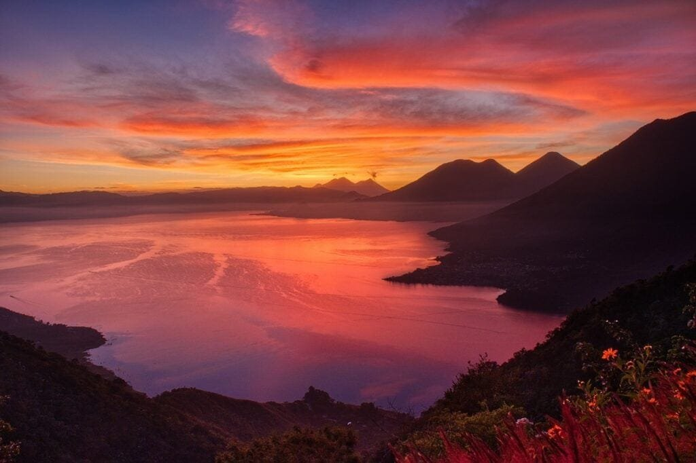

If you've ever been fascinated by volcanoes and the raw power they possess, then understanding how they are formed and the geological studies surrounding them is a must. Volcanoes are not simply random eruptions of molten rock and ash; they are complex geological phenomena that occur at specific locations along plate boundaries, hotspots under the Earth's crust, or areas where tectonic plates are moving apart. By studying the formation and behavior of volcanoes, scientists can gain invaluable insights into the Earth's inner workings, helping to predict future volcanic activity and mitigate the risks to surrounding communities. In this article, we will explore the different types of volcanoes, their geographic distribution, eruption causes, hazards, and benefits, all of which contribute to the fascinating field of geological studies.

This image is property of pixabay.com.

## Basics of Volcano Formation

Volcanoes are formed when molten rock, also known as magma, rises to the surface of the Earth. The underlying concept of magma formation lies in the movement of tectonic plates. These large slabs of Earth's crust are constantly moving, and when they collide or separate, it creates spaces where magma can form.

The movement of magma is a fascinating process. It begins deep within the Earth's mantle, where intense heat and pressure cause rocks to melt. This molten rock is less dense than the surrounding solid rock and therefore has a tendency to rise towards the surface. As it travels through the Earth's crust, the magma can solidify and form intrusive rock structures, like plutons and dikes.

However, when the magma reaches the surface, it erupts as molten rock and gases. This eruption is caused by the pressure buildup from the rising magma. The magma can be incredibly hot, reaching temperatures of up to 1,200 degrees Celsius (2,200 degrees Fahrenheit). The gases trapped within the magma, such as water vapor and carbon dioxide, expand rapidly as the pressure decreases, resulting in explosive eruptions.

The role of tectonic plates is crucial in the formation of volcanoes. Volcanoes are often found at plate boundaries, where two plates either collide or separate. At convergent plate boundaries, also known as subduction zones, one plate is forced beneath the other, creating intense heat and pressure that leads to magma formation. This process can form composite volcanoes, which are characterized by their steep slopes and explosive eruptions.

At divergent plate boundaries, where two plates move apart, magma can rise to the surface through cracks in the Earth's crust. This creates volcanic activity along rift zones, such as the East African Rift. Volcanic activity in these areas often results in shields volcanoes, which have gentle slopes and effusive eruptions.

[Understanding the basics of volcano formation](https://magmamatters.com/understanding-volcanic-formation-a-comprehensive-guide/ "Understanding Volcanic Formation: A Comprehensive Guide") provides a foundation for exploring the different types of volcanoes and their unique characteristics.

## Types of Volcanoes

There are several types of volcanoes, each with its own distinct characteristics.

Composite volcanoes, also known as stratovolcanoes, are one type. These volcanoes are tall and steep, with a concave shape caused by alternating layers of lava, ash, and volcanic debris. Composite volcanoes are associated with explosive eruptions due to the high viscosity of the magma. Some famous examples of composite volcanoes include Mount Fuji in Japan and Mount St. Helens in the United States.

Shield volcanoes, on the other hand, have a low-profile shape with gentle slopes. They are mainly composed of accumulated lava flows that spread out over a large area, resembling a warrior's shield. Shield volcanoes are characterized by their effusive eruptions, where magma flows easily due to its low viscosity. The Hawaiian Islands are a prime example of shield volcanoes, with Mauna Loa being one of the world's largest and most active shield volcanoes.

[Cinder cone](https://magmamatters.com/the-birth-of-new-land-understanding-cinder-cones/) volcanoes, as the name suggests, are formed by the accumulation of volcanic cinders or small fragments of solidified lava. These volcanoes are relatively small and have a conical shape. The eruptions of cinder cone volcanoes tend to be short-lived and explosive. Paricutin in Mexico is a well-known example of a cinder cone volcano.

Lava domes are another type of volcano, characterized by their steep-sided and dome-shaped appearance. They are formed by the slow extrusion of highly viscous lava from a vent. Lava domes can be found at the summit of composite volcanoes or as standalone features. Soufrière Hills volcano in Montserrat is an example of an active lava dome.

Understanding the different types of volcanoes helps us appreciate the diverse geological formations that exist on our planet.

<iframe width="560" height="315" src="https://www.youtube.com/embed/R_pDKyg5YKY" frameborder="0" allow="accelerometer; autoplay; encrypted-media; gyroscope; picture-in-picture" allowfullscreen></iframe>

  

## Geographical Distribution of Volcanoes

Volcanoes are not evenly distributed across the globe. They tend to occur in specific regions due to various geological processes.

Hotspots, areas of intense volcanic activity, are often associated with plumes of hot mantle material rising from deep within the Earth. These plumes can generate volcanic activity even in the middle of tectonic plates. The formation of hotspots is not yet fully understood, but they are believed to be caused by pockets of molten rock within the mantle. Some well-known hotspots include the Hawaiian Islands and the Yellowstone National Park in the United States.

Another significant area of volcanic activity is known as the "Ring of Fire." This term refers to a major belt of volcanic activity that encircles the Pacific Ocean. It is characterized by a large number of earthquakes and volcanic eruptions. The Ring of Fire is associated with the boundaries of several tectonic plates, including the Pacific Plate, the Nazca Plate, and the Philippine Sea Plate.

Volcanoes can also be found in rift zones, which are areas where the Earth's tectonic plates are moving apart. As the plates separate, magma rises to fill the gap, resulting in volcanic activity. The East African Rift, for example, is known for its numerous volcanoes, such as Mount Kilimanjaro and Mount Nyiragongo.

Isolated hotspots, similar to those found in Hawaii, can also be sources of volcanic activity. These hotspots are not directly associated with plate boundaries but instead occur in the middle of the tectonic plates. The Afar Triangle in Ethiopia is one such example, where the African, Arabian, and Somali plates are moving apart, resulting in volcanic activity.

Understanding the geographical distribution of volcanoes helps scientists study the Earth's tectonic activity and gain insights into the processes that shape our planet's surface.

## Volcanic Eruption Patterns

The pattern and behavior of volcanic eruptions are influenced by various factors, including lava viscosity and gas content.

Lava viscosity refers to how easily magma flows. The higher the viscosity, the more resistant the magma is to flow. Viscosity is primarily determined by the composition of the magma, specifically its silica content. Magma with high silica content is more viscous, while magma with low silica content is more fluid.

Explosive eruptions typically occur when magma has high viscosity. The gas content in the magma plays a crucial role in the explosiveness of volcanic eruptions. As magma rises to the surface, the decrease in pressure causes the dissolved gases to expand rapidly, leading to explosive eruptions. These eruptions can release a significant amount of volcanic ash, rocks, and gases into the atmosphere.

In contrast, effusive eruptions occur when magma has low viscosity. The low viscosity allows the magma to flow more easily, resulting in gentle eruptions characterized by the steady outpouring of lava. Effusive eruptions are typically less explosive and pose fewer immediate risks to surrounding areas. However, they can still cause significant damage and alter the surrounding landscape over time.

Volcanic eruption patterns are crucial in understanding the potential hazards associated with volcanic activity and are essential for monitoring and predicting volcanic eruptions.

This image is property of pixabay.com.

## Hazards Associated with Volcanic Eruptions

Volcanic eruptions can pose various hazards to both human populations and the environment. It is essential to understand these hazards to mitigate risks and develop effective disaster management strategies.

One of the most significant hazards associated with volcanic eruptions is the destruction caused by lava flows. Lava, the molten rock that erupts from volcanoes, can flow downhill, engulfing everything in its path. It can destroy buildings, infrastructure, and fertile farmlands, displacing communities and causing economic hardship. The speed and direction of lava flows can be unpredictable, adding to the challenges of evacuation and disaster response efforts.

Volcanic gases are another hazard that can have severe health implications. The gases released during volcanic eruptions include water vapor, carbon dioxide, sulfur dioxide, and hydrogen sulfide. These gases can be toxic and, depending on their concentration, can cause respiratory issues, eye irritation, and even death. Volcanic gases can also contribute to the formation of acid rain and lead to air pollution, affecting both local and regional environments.

Pyroclastic flows are fast-moving currents of hot gas, ash, and volcanic debris that can reach speeds of up to 700 kilometers per hour (435 miles per hour). These deadly flows can travel great distances from the volcano and pose a severe threat to life and property. Pyroclastic flows can devastate entire communities and leave behind a landscape covered in thick layers of ash and debris.

Ashfall is another hazard associated with volcanic eruptions. Volcanic ash, consisting of small rock fragments, glass shards, and minerals, can be carried by the wind and deposited over large areas. Ash can cause significant damage to crops, contaminate water supplies, and disrupt transportation and communication systems. Additionally, the weight of accumulated ash on rooftops can cause structures to collapse.

Lahars, or volcanic mudflows, are yet another threat. A lahar is formed when volcanic ash mixes with water, either from heavy rainfall, melting snow, or melting glaciers. These destructive mudflows can travel rapidly down valleys, carrying large boulders and debris, and can bury entire communities. Lahars are highly destructive and can cause long-term damage to the affected areas.

Volcanic eruptions can also trigger earthquakes. These volcanogenic earthquakes occur due to the movement of magma and the readjustment of the surrounding rock. The intensity and frequency of these earthquakes can vary, adding to the complexity of monitoring and predicting volcanic activity.

Understanding and mitigating the hazards associated with volcanic eruptions is critical for the safety and well-being of communities living in volcanic regions.

## Benefits of Volcanic Eruptions

Despite the potential hazards, volcanic eruptions also bring about various benefits that contribute to the Earth's environment and ecosystems.

One of the significant benefits of volcanic eruptions is the creation of fertile soils. Volcanic ash, rich in nutrients, is an excellent source of organic matter and essential minerals for plant growth. Over time, volcanic ash breaks down and weathers, enriching the soil and providing a fertile foundation for agriculture. Many volcanic regions, such as the Pacific Northwest in the United States and the fertile volcanic soils of the Mediterranean, are known for their high agricultural productivity.

Volcanic eruptions also play a vital role in the generation of geothermal energy. Geothermal energy utilizes the heat stored within the Earth to generate electricity or provide heating and cooling for buildings. Volcanic regions, particularly areas with active volcanoes, offer abundant geothermal resources that can be harnessed for clean and sustainable energy production. Countries such as Iceland and New Zealand have successfully tapped into their volcanic geothermal resources and have become leaders in geothermal energy production.

Furthermore, volcanic eruptions contribute to atmospheric changes. During explosive eruptions, large quantities of gases and fine ash particles are injected into the atmosphere. These particles can reflect sunlight and cause a temporary cooling effect on the Earth's surface. Volcanic eruptions can also release sulfur dioxide, which can combine with water vapor in the atmosphere to form sulfate aerosols. These aerosols can enhance the formation of clouds, leading to changes in regional and global climate patterns.

Understanding the benefits of volcanic eruptions helps us appreciate the complex interactions between [geological processes and the environment](https://magmamatters.com/geothermal-energy-and-its-volcanic-origins/ "Geothermal Energy and Its Volcanic Origins").

This image is property of pixabay.com.

## Volcanoes and Climate Change

Volcanic eruptions have played a significant role in shaping the Earth's climate throughout history. They can influence short-term and long-term climate patterns in various ways.

Large volcanic eruptions can release massive amounts of gases and particles into the atmosphere. The ejected particles, known as volcanic aerosols, can remain in the atmosphere for months to years. These aerosols can scatter and absorb sunlight, leading to a decrease in solar radiation reaching the Earth's surface. This cooling effect can result in a temporary decrease in global temperatures, known as volcanic winter.

In addition to the cooling effect, [volcanic gases such as sulfur dioxide](https://magmamatters.com/the-art-and-science-of-volcano-monitoring/ "The Art and Science of Volcano Monitoring") can interact with water vapor in the atmosphere to form sulfate aerosols. These sulfate aerosols can act as cloud condensation nuclei, increasing cloud formation and potentially affecting precipitation patterns. The impact of volcanic eruptions on precipitation can vary depending on the location and magnitude of the eruption.

Volcanic eruptions can also release greenhouse gases such as carbon dioxide and methane. However, the contribution of volcanoes to the overall greenhouse gas emissions is relatively small compared to human activities. Human-induced emissions from burning [fossil fuels and deforestation](https://magmamatters.com/the-role-of-volcanoes-in-earths-carbon-cycle-5/ "The Role Of Volcanoes In Earth’s Carbon Cycle") are the primary drivers of climate change.

While volcanic eruptions can have short-term cooling effects, they do not outweigh the long-term warming effects of human-induced greenhouse gas emissions. It is essential to continue reducing greenhouse gas emissions to mitigate the impacts of climate change.

Understanding the relationship between volcanic eruptions and climate change helps scientists study past climate variations and improve climate modeling techniques.

## Monitoring and Predicting Volcanic Activity

Monitoring and predicting volcanic eruptions are crucial for providing early warnings and reducing the risks associated with volcanic hazards. Several methods are used to monitor volcanic activity and track changes in a volcano's behavior.

One common method of volcanic monitoring is seismic monitoring. Volcanoes generate seismic waves as magma rises and fractures within the Earth's crust. By analyzing these seismic waves, scientists can detect and locate volcanic activity. Changes in the frequency and intensity of earthquakes can indicate increased volcanic activity.

Ground deformation monitoring is another important technique. By using GPS and satellite-based radar measurements, scientists can measure the slight changes in the shape of a volcano caused by the movement of magma. Monitoring ground deformation helps assess the level of volcanic activity and can indicate potential eruption precursors.

Gas monitoring plays a crucial role in detecting changes in volcanic activity. Volcanoes emit various gases during their dormant and active phases. Monitoring the concentration and composition of these gases, such as [sulfur dioxide and carbon](https://magmamatters.com/the-environmental-impact-of-volcanic-eruptions-2/ "The Environmental Impact of Volcanic Eruptions") dioxide, helps scientists track changes in volcanic activity. Increases in gas emissions can indicate rising magma and a higher risk of eruption.

Remote sensing techniques, such as thermal imaging and satellite monitoring, provide valuable insights into volcanic activity. Thermal cameras can detect changes in temperature on the volcano's surface, indicating the movement of magma beneath the surface. Satellite-based monitoring allows for the detection of volcanic ash plumes, changes in gas emissions, and ground deformation over a large area.

Despite significant advancements in monitoring techniques, predicting volcanic eruptions remains challenging. Volcanic systems are complex and can exhibit behaviors that are difficult to interpret accurately. Volcanoes can display periods of increased activity without eventually erupting, making it challenging to determine when an eruption will occur.

Nevertheless, early detection and continuous monitoring of volcanic activity are essential for providing timely warnings and ensuring the safety of nearby communities.

## Volcanic Landforms and Their Contribution to Geological Studies

Volcanic landforms provide invaluable information about Earth's geological history and the processes that shape the planet's surface.

Studying volcanic landforms helps scientists understand the geologic history of an area. By examining the layers of lava and volcanic ash, researchers can reconstruct past volcanic eruptions and determine the sequence of events that led to the formation of a volcanic landscape. This information is crucial for understanding the geological evolution of an area and the forces that have shaped it over time.

Volcanic landforms also play a significant role in mapping tectonic plates. Many volcanoes are found at plate boundaries, making them excellent indicators of tectonic activity. By analyzing the distribution and characteristics of volcanic landforms, scientists can gain insights into the movement and interaction of tectonic plates. This helps improve our understanding of plate tectonics and the forces driving them.

In addition to understanding geological history and tectonic activity, volcanic landforms contribute to paleoenvironmental studies. Volcanic deposits contain a wealth of information about past environments, climate, and ecosystems. By analyzing the composition of volcanic ash layers and the preserved organic material within them, scientists can reconstruct past environmental conditions. This allows for the study of past climate variations, vegetation patterns, and the impact of volcanic activity on ecosystems.

Volcanic landforms provide a window into Earth's past and are vital for unraveling the geological mysteries that shape our planet.

## Mitigating Risks and Disaster Management Strategies

Given the hazards associated with volcanic eruptions, it is crucial to develop effective disaster management strategies to mitigate risks and safeguard communities living in volcanic regions.

Preparedness measures are essential for minimizing the impacts of volcanic eruptions. This includes creating emergency response plans, establishing communication networks, and conducting regular drills and exercises. It is vital for communities to be aware of the potential hazards they face and to have a clear understanding of evacuation procedures and safety measures.

Risk communication plays a significant role in disaster management. Governments and scientific institutions need to communicate accurate and timely information to the public about volcanic activity, potential hazards, and evacuation procedures. Clear and accessible communication ensures that communities can make informed decisions and take necessary precautions in the event of an eruption.

Evacuation procedures should be well-planned and implemented to ensure the safety of the affected population. This includes identifying safe evacuation routes, establishing emergency shelters, and providing support services for those displaced by the eruption. Early warning systems, such as sirens, text messages, and mobile applications, can play a crucial role in alerting communities of impending volcanic hazards.

Post-eruption recovery actions are essential for helping communities recover and rebuild after a volcanic eruption. This includes providing support for displaced populations, assessing infrastructure damage, and restoring essential services such as water, electricity, and healthcare. Additionally, implementing long-term programs for sustainable development and economic recovery can help communities bounce back from the impacts of volcanic eruptions.

By implementing comprehensive disaster management strategies, communities can minimize the risks associated with volcanic eruptions and increase their resilience to future events.

In conclusion, understanding volcanoes and their various aspects, from formation to eruption patterns, hazards, and benefits, is vital for scientific research and public safety. Volcanic landforms contribute to geological studies, climate change research, and environmental studies. Through monitoring and predicting volcanic activity, risks can be mitigated, and early warnings can be provided. Effective disaster management strategies and communication play a crucial role in protecting communities living in volcanic regions. Volcanoes are not only natural wonders but also powerful geological phenomena that shape our planet and provide valuable insights into its history and future.

