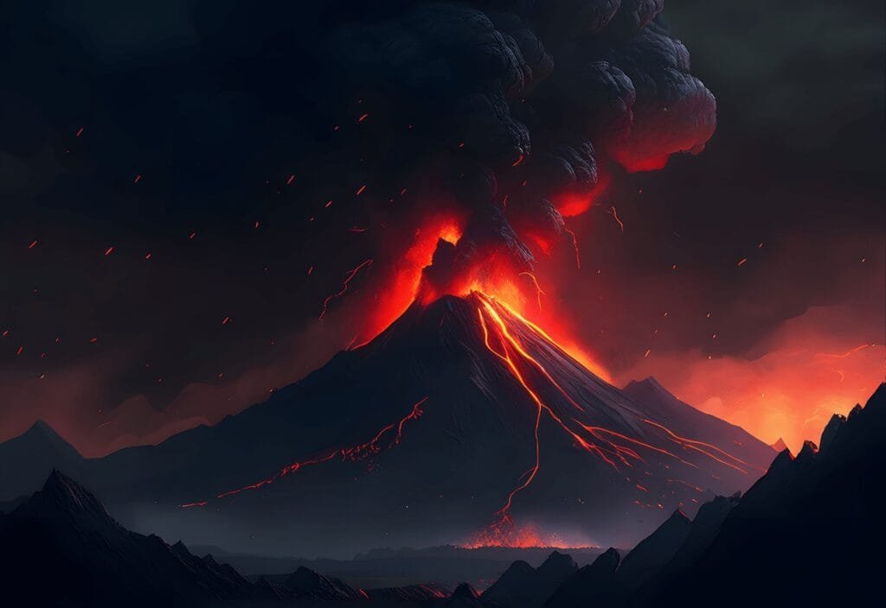
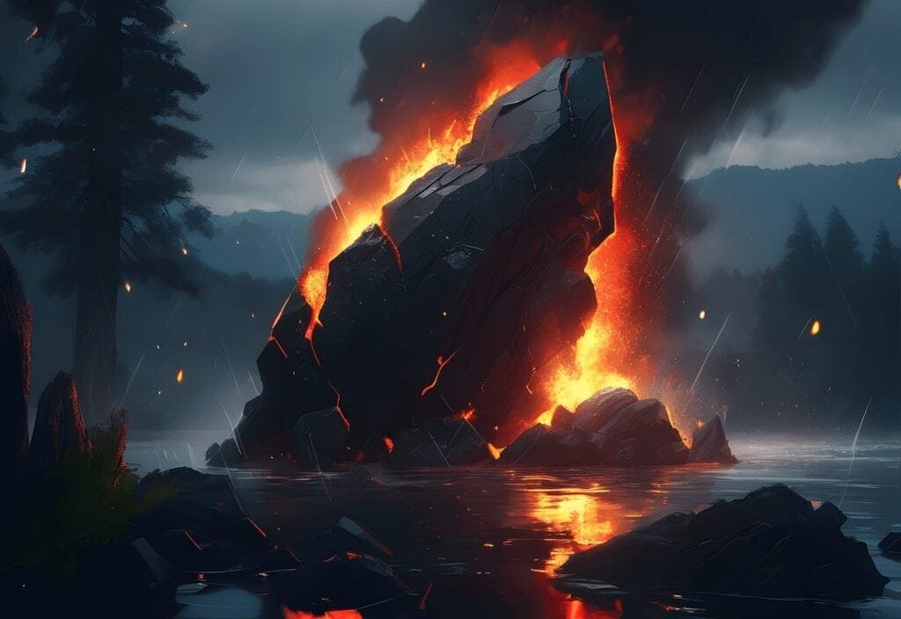
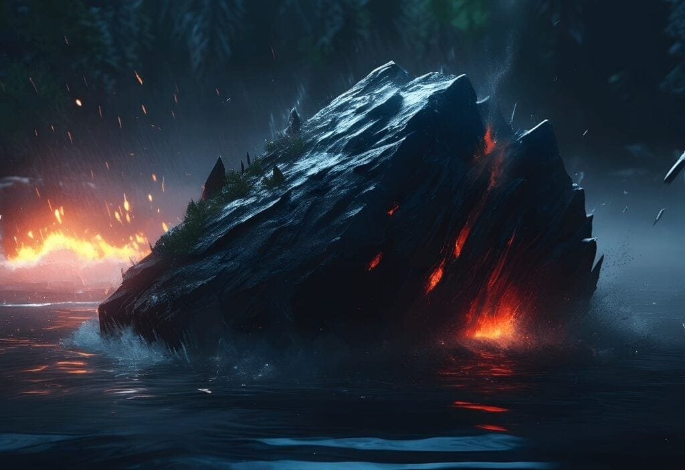

Volcanoes, those magnificent and sometimes terrifying natural phenomena, hold a great deal of mystery and fascination. From the explosive eruptions of the "Ring of Fire" to the gradual formation of shield volcanoes in Hawaii, the effects of volcanic activity on Earth's crust are diverse and significant. In order to fully grasp the impact of these eruptions, it is crucial to understand the different types of volcanoes, their distribution, and the causes and consequences of their eruptions. With this knowledge, scientists can predict future volcanic activity and communities can implement measures to mitigate the risks. In this article, we will explore 10 tips to help you analyze and comprehend the effect of volcanic activity on Earth's crust. So, let's dive into the fascinating world of volcanoes and uncover the secrets they hold!

<iframe width="560" height="315" src="https://www.youtube.com/embed/LQwZwKS9RPs" frameborder="0" allow="accelerometer; autoplay; encrypted-media; gyroscope; picture-in-picture" allowfullscreen></iframe>

  

## Understanding Volcano Formation

Volcanoes are formed when molten rock, gases, and debris escape to the Earth's surface, resulting in eruptions of lava and ash. This process occurs at various locations, including plate boundaries, hotspots, and rift zones. At plate boundaries, such as the "Ring of Fire" encircling the Pacific Ocean, volcanoes are situated where tectonic plates meet, making them prone to eruptions. Hotspots, which are areas of intense volcanic activity beneath the Earth's crust, give rise to shield volcanoes like those found in Hawaii. Finally, rift zones are regions where tectonic plates are moving apart, allowing magma to rise and form volcanoes.

## Analyzing Geographic Distribution of Volcanoes

Volcanoes are distributed globally, but their concentration varies in different regions. One prominent area with a high concentration of volcanoes is the Pacific Ocean's "Ring of Fire." This region, characterized by its circular shape, is known for frequent volcanic eruptions and tectonic activity. It stretches from the western coast of North and South America, across the Pacific Ocean, and to the eastern coast of Asia. Within the Pacific Ring of Fire, countries such as Japan, Indonesia, and the Philippines are particularly susceptible to volcanic eruptions.

In addition to the Ring of Fire, Hawaii is another location famous for its volcanic activity. The Hawaiian Islands are formed by the eruption of shield volcanoes. These volcanoes have broad, gently sloping sides and are built up over time by repeated lava flows. The hotspot underlying Hawaii consistently supplies molten rock, resulting in the formation of new volcanoes. The most well-known volcano in Hawaii is Kilauea, which has been erupting continuously since 1983.

This image is property of pixabay.com.

## Different Types of Volcanoes

Volcanoes can be classified into various types based on their characteristics and eruption style. Two significant [types of volcanoes are shield](https://magmamatters.com/understanding-volcanic-formation-a-comprehensive-guide/ "Understanding Volcanic Formation: A Comprehensive Guide") volcanoes and composite volcanoes (also known as stratovolcanoes).

Shield volcanoes, like those in Hawaii, are characterized by their broad, gently sloping sides. They are formed from low-viscosity lava that can flow quickly and cover large distances. The lava eruptions from shield volcanoes tend to be less explosive and more effusive in nature, resulting in the gradual buildup of the volcano over time.

Composite volcanoes, on the other hand, are steep-sided and symmetrical. They are composed of alternating layers of lava and ash, which give them their characteristic appearance. Composite volcanoes are associated with more explosive eruptions due to the high viscosity of the lava and the presence of gas bubbles trapped in the magma.

In addition to shield and composite volcanoes, there are other types of volcanoes, such as [cinder cones](https://magmamatters.com/the-birth-of-new-land-understanding-cinder-cones/), lava domes, submarine volcanoes, and super volcanoes. Cinder cones are the simplest form of volcanoes, formed by the accumulation of pyroclastic material. Lava domes are created when thick, viscous lava accumulates around a volcano's vent. Submarine volcanoes are located beneath the ocean's surface and can create new islands over time. Super volcanoes are rare but have the potential to cause catastrophic eruptions that can affect the global climate.

## Understanding Volcano Eruption Patterns

Volcano eruption patterns are determined by various factors, including the viscosity of the lava and the gas content within the magma. Lava viscosity refers to the resistance of lava to flow. High-viscosity lava, such as that found in composite volcanoes, is thick and sticky, resulting in explosive eruptions. In contrast, low-viscosity lava, like that from shield volcanoes, flows more easily, leading to effusive eruptions.

Gas content is another crucial factor in eruption patterns. When gas bubbles form within the magma, the pressure increases until it can no longer be contained, leading to an explosive eruption. The type and amount of gases, such as water vapor, [carbon dioxide](https://magmamatters.com/the-art-and-science-of-volcano-monitoring/ "The Art and Science of Volcano Monitoring"), and sulfur dioxide, influence the explosiveness of volcanic eruptions.

Explosive eruptions involve the sudden release of gas and magma, resulting in ash clouds, pyroclastic flows, and lava bombs. Effusive eruptions, on the other hand, involve the gradual release of low-viscosity lava, which flows through channels or erupts from fissures.

This image is property of pixabay.com.

## Effect of Eruption on the Earth's Crust

During a volcanic eruption, immediate physical changes occur in the surrounding environment. These changes include the release of ash, gas, and lava. Ash clouds can travel long distances and affect air quality, leading to respiratory problems and reduced visibility. Lava flows can destroy buildings, vegetation, and infrastructure, altering the landscape dramatically. Gas emissions from [volcanoes contribute to air pollution and can have harmful effects](https://magmamatters.com/the-environmental-impact-of-volcanic-eruptions-2/ "The Environmental Impact of Volcanic Eruptions") on both human health and the environment.

In the long term, volcanoes play a crucial role in shaping the Earth's crust. The repeated eruptions and accumulation of lava and ash over millions of years create mountains and islands. Volcanic activity contributes to the formation of new landmasses, such as the Hawaiian Islands. Over time, erosion and other geological processes continue to shape these volcanic features, creating diverse landscapes.

## Impact of Volcanic Activity on Climate

Volcanic eruptions have the potential to influence the global climate. When volcanoes erupt, they release large amounts of gases and aerosols into the atmosphere. These gases can include sulfur dioxide, water vapor, carbon dioxide, and others. Sulfur dioxide can react with water vapor in the atmosphere to form sulfate aerosols, which reflect sunlight back into space. This can result in a temporary cooling effect on the Earth's climate.

Historically, there have been significant volcanic eruptions that had a notable impact on the climate. One such event was the eruption of Mount Tambora in 1815, which led to the "Year Without a Summer" in 1816. The massive amount of sulfur dioxide released into the atmosphere caused global cooling, resulting in widespread crop failures and food shortages.

In addition to the cooling effect, [volcanoes can also release greenhouse gases such as carbon dioxide](https://magmamatters.com/geothermal-energy-and-its-volcanic-origins/ "Geothermal Energy and Its Volcanic Origins"). While the short-term impact of volcanic emissions on climate can be significant, the long-term effects of human-induced greenhouse gas emissions from activities such as burning fossil fuels are much greater.

This image is property of pixabay.com.

## Hazards Associated with Volcanoes

Volcanic eruptions can pose several hazards to both local and distant areas. One of the primary hazards is ashfall, which can blanket large areas, disrupting transportation, damaging crops, and impacting human health. Ash particles can be abrasive and cause respiratory problems when inhaled. Additionally, large ash clouds can disrupt air travel by clogging aircraft engines.

Pyroclastic flows are another dangerous hazard associated with volcanic eruptions. These fast-moving currents of hot gas, ash, and rock can travel down the volcano's slopes at high speeds, destroying everything in their path. Pyroclastic flows are extremely hazardous and can cause significant damage to infrastructure and result in severe injuries or fatalities.

Lahars, or volcanic mudflows, are yet another threat posed by volcanic activity. Lahars occur when volcanic ash or debris mixes with water, forming a dense slurry that flows downhill. Lahars can travel long distances and be highly destructive, engulfing communities and causing substantial property damage.

Due to these hazards, communities near volcanoes need to be well-prepared and have evacuation plans in place to mitigate the impact of potential eruptions. Early warning systems, volcano monitoring, and public education play crucial roles in minimizing the risks associated with volcanic activity.

## Benefits of Volcanic Activity

While volcanic eruptions can be devastating, they also offer some benefits to the surrounding areas. One notable benefit is the nutrient enrichment of soil. Volcanic ash is rich in minerals and can enhance soil fertility when deposited on land. This volcanic ash provides essential nutrients for plants, fostering robust agricultural productivity in volcanic regions.

Volcanic activity also plays a significant role in geothermal energy production. Geothermal power harnesses the natural heat stored beneath the Earth's surface, often close to active volcanoes. The heat from volcanic activity can be used to generate electricity and provide heating for nearby communities. Geothermal energy is a sustainable and renewable source of power that reduces reliance on fossil fuels.

Furthermore, volcanic materials, such as volcanic rock and ash, have practical applications in construction. Volcanic rock, known as basalt, is commonly used as a construction material for roads and buildings due to its strength and durability. Volcanic ash, when mixed with water and other materials, can form a type of cement called pozzolana, which has been used for thousands of years in construction.

## Predicting Volcanic Activity

Predicting volcanic eruptions is a challenging task but vital for mitigating risks and protecting communities. Several techniques are used to monitor volcanic activity and identify warning signs. One such technique is seismology, which involves monitoring seismic waves generated by volcanic activity. By analyzing the frequency and intensity of these waves, scientists can infer the movement of magma beneath the Earth's surface.

Other monitoring methods include measuring gas emissions, ground deformation, and changes in volcanic activity patterns. Gas emissions can indicate the movement of magma and changes in volcanic behavior. Ground deformation, such as swelling or sinking of the volcano's surface, can be an early indicator of volcanic unrest. By combining data from various monitoring techniques, scientists can make informed predictions about volcanic activity.

Volcano monitoring plays a crucial role in risk mitigation. Early detection of changes in volcanic behavior allows for the timely evacuation of nearby communities and the implementation of appropriate safety measures. However, it is important to note that predicting volcanic activity with absolute certainty is still a challenging task, and ongoing research and monitoring are necessary to improve prediction capabilities.

## Mitigating Volcanic Risks

Mitigating volcanic risks requires a comprehensive approach that involves various strategies and actions. One of the most essential elements is community preparedness. Communities living near active volcanoes need to be educated about the potential hazards and have evacuation plans in place. Regular drills and exercises can help ensure a timely and efficient response in the event of an eruption.

Government agencies and scientific institutions also play a crucial role in mitigating volcanic risks. They are responsible for monitoring volcanic activity, analyzing data, and issuing timely warnings and advisories to the public. Volcano observatories and research centers provide valuable information and resources to aid in risk assessment and response.

Furthermore, infrastructure planning and design should take into account the potential risks associated with volcanic activity. Buildings and critical infrastructure, such as hospitals and schools, should be designed to withstand ashfall and other volcanic hazards. Additionally, land-use planning should consider the potential impacts of volcanic eruptions to minimize exposure and vulnerability.

Success stories in volcanic risk mitigation can be found globally. One notable example is the Mount Pinatubo eruption in the Philippines in 1991. Due to extensive monitoring and public education efforts, the government was able to evacuate around 20,000 residents from the danger zone before the eruption. This successful evacuation saved many lives and is often regarded as a model for volcanic risk mitigation.

In conclusion, understanding volcanoes is essential for comprehending their formation, eruption patterns, impact on the Earth's crust, and associated hazards and benefits. Volcanic activity can have both immediate and long-term effects on the environment, climate, and human populations. Mitigating volcanic risks requires a combination of scientific research, volcano monitoring, community preparedness, and infrastructure planning. By continually studying and monitoring volcanoes, scientists and communities can work together to minimize the impact of volcanic eruptions and protect vulnerable areas.

