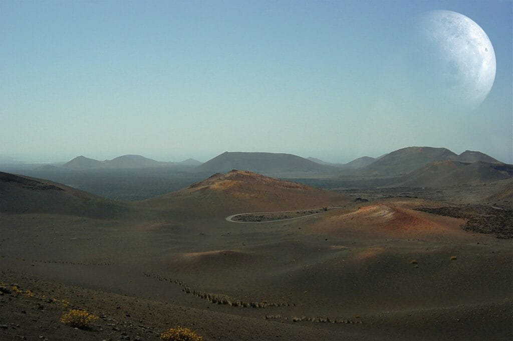

In "Understanding Volcanoes: A Comprehensive Guide to Pacific Ocean's Underwater Volcanoes," delve into the intriguing world of volcanoes that lie beneath the surface of the Pacific Ocean. Learn about the formation of volcanoes and the various factors that contribute to their eruptions. Discover the different types of volcanoes found in this region and how their eruption patterns can vary. Gain insight into the hazards and benefits associated with volcanic activity, as well as the crucial role of understanding volcanoes in predicting future eruptions and ensuring the safety of nearby communities. With these top tips, you will develop a comprehensive understanding of the fascinating underwater volcanoes that dwell in the vast Pacific Ocean.

This image is property of pixabay.com.

## Formation of Volcanoes

Volcanoes are geological features that form when molten rock, known as magma, rises to the Earth's surface. This process involves the movement of tectonic plates, which are large pieces of the Earth's crust that fit together like a giant jigsaw puzzle. When the plates interact, they can create areas of weakness where magma can escape. Once the magma reaches the surface, it is called lava, and it can erupt explosively or flow gently depending on its viscosity and gas content.

Molten rock, gases, and debris all play a crucial role in the formation of volcanoes. The magma is made up of melted minerals and rock fragments, and it is typically less dense than the surrounding solid rock. This allows it to rise towards the surface, often creating a vent or opening through which it can erupt. As the magma rises, it can also trap gases that were dissolved in the molten rock. These gases, such as water vapor, carbon dioxide, and sulfur dioxide, can contribute to explosive eruptions by creating pressure within the volcano.

Debris, including solid rock fragments and ash, can also be expelled during volcanic eruptions. These materials can be carried high into the atmosphere and deposited over large areas, causing widespread destruction and affecting global climate patterns. Volcanic debris can also build up around the vent, forming a cone-shaped mountain. Over time, this accumulation of material can create a volcano.

Understanding the interactions between tectonic plates is crucial in comprehending the formation of volcanoes. The Earth's lithosphere, which includes the crust and the uppermost part of the mantle, is divided into several large plates. These plates move and interact with each other along boundaries. There are three main types of plate boundaries: convergent, divergent, and transform. Convergent boundaries occur when two plates collide, and one plate is forced beneath the other in a process known as subduction. This subduction can lead to the formation of volcanic arcs, such as the "Ring of Fire" around the Pacific Ocean. Divergent boundaries occur when plates move apart, allowing magma from the mantle to rise and create new crust. This process can create underwater volcanoes along mid-ocean ridges. Transform boundaries occur when plates slide past each other horizontally, and they can also result in volcanic activity.

## Distribution of Volcanoes in the Pacific Ocean

The Pacific Ocean is home to a large number of volcanoes, many of which are located around the perimeter in a region known as the "Ring of Fire." This horseshoe-shaped belt of active volcanoes stretches from the western coast of North America to the eastern coast of Asia, including countries like Japan, the Philippines, Indonesia, and New Zealand. The "Ring of Fire" is associated with several convergent plate boundaries, where tectonic plates are colliding and subducting beneath one another.

Within the Pacific Ocean, there are also numerous underwater volcanoes. These volcanoes are located along mid-ocean ridges, which are underwater mountain ranges that form at divergent plate boundaries. As the plates move apart, magma rises to fill the gap, creating new crust and forming volcanoes. These underwater volcanoes are often referred to as seamounts and can be found throughout the Pacific Ocean.

Hotspots also play a significant role in the formation of underwater volcanoes. Hotspots are areas of intense volcanic activity that are believed to be caused by plumes of hot mantle material rising towards the surface. These plumes can melt through the overlying crust, creating a hotspot volcano. In the Pacific Ocean, the Hawaiian Islands are a prime example of hotspot volcanoes. The islands were formed as the Pacific Plate moved over a stationary hotspot, creating a chain of volcanoes that extends from the Big Island of Hawaii to the northwest.

<iframe width="560" height="315" src="https://www.youtube.com/embed/VNGUdObDoLk" frameborder="0" allow="accelerometer; autoplay; encrypted-media; gyroscope; picture-in-picture" allowfullscreen></iframe>

  

## Types of Underwater Volcanoes in the Pacific Ocean

Underwater volcanoes in the Pacific Ocean can be categorized into different types based on their shape and formation. The two primary types of underwater volcanoes are shield volcanoes and strato or composite volcanoes.

Shield volcanoes are named for their resemblance to a warrior's shield lying on the ground. They are broad and gently sloping with a low profile. Shield volcanoes are typically formed by repeated eruptions of low-viscosity lava, which flows easily and can cover large distances. These eruptions result in the gradual buildup of a wide and shallow volcano. The Hawaiian Islands are renowned for their shield volcanoes, with Mauna Loa and Kilauea being prime examples.

Strato or composite volcanoes, on the other hand, are characterized by their steep-sided, conical shape. These volcanoes are built up layer by layer through alternating eruptions of lava and ash. The lava flows are often more viscous, which means they do not flow as easily as the lava from shield volcanoes. This can cause the lava to trap gases and build up pressure within the volcano, leading to explosive eruptions. Mount St. Helens in Washington State is a famous example of a strato volcano.

Understanding the different types of underwater volcanoes is essential as it provides insights into their formation, eruption style, and potential hazards they may pose.

## Understanding Eruption Patterns of Underwater Volcanoes

Underwater volcanoes, like their terrestrial counterparts, can display a variety of eruption patterns. These patterns are influenced by several factors, including the viscosity of the lava and the gas content within the magma.

Lava viscosity refers to the resistance of the lava to flow. Lava with low viscosity, such as the lava produced by shield volcanoes, flows easily and can travel long distances before solidifying. This type of lava typically leads to effusive eruptions, where the lava flows steadily from the volcano without significant explosions. On the other hand, lava with high viscosity, such as the lava produced by strato volcanoes, does not flow as easily and tends to form thick, blocky flows. This type of lava often leads to explosive eruptions, where gas-rich magma can explode violently, sending ash and volcanic debris high into the atmosphere.

The gas content within the magma also plays a crucial role in eruption patterns. As magma rises towards the surface, the decrease in pressure causes dissolved gases to come out of solution and form bubbles. The presence of these gas bubbles can significantly impact the eruption style. If the gas bubbles are able to escape freely, the eruption is typically less explosive. However, if the gas bubbles become trapped within the magma, pressure can build up and lead to explosive eruptions.

Differentiating between effusive and explosive eruptions is important as it helps scientists and communities understand the potential hazards associated with underwater volcanic activity. Effusive eruptions generally pose less immediate danger, as the lava flows can be predicted and people can be evacuated from the area. However, explosive eruptions can be much more destructive, causing widespread damage and potential loss of life. Monitoring and understanding eruption patterns can assist in predicting the intensity and potential hazards of underwater volcanic eruptions.

This image is property of pixabay.com.

## Hazards Associated with Underwater Volcanic Eruptions

Underwater volcanic eruptions can pose significant hazards to both human populations and the surrounding marine ecosystem. Understanding these hazards is crucial for preparedness and mitigation efforts.

One of the primary dangers posed by underwater volcanic eruptions is the potential for tsunamis. When an explosive eruption occurs, the expulsion of large amounts of volcanic debris into the water can generate powerful shockwaves. These shockwaves can travel through the ocean, causing the displacement of water and resulting in the formation of a tsunami. Tsunamis can travel at high speeds and can cause widespread destruction when they reach shorelines. Communities near underwater volcanoes must be aware of the potential tsunami risk and have evacuation plans in place.

Underwater volcanic eruptions can also have a significant impact on the marine ecosystem. The release of toxic gases and chemicals into the water can harm or kill marine life, including fish, coral, and other organisms. Volcanic ash and debris can smother and bury underwater habitats, affecting the overall biodiversity and productivity of the ecosystem. Furthermore, changes in water temperature and chemistry caused by volcanic activity can also have long-term effects on marine life.

Despite the hazards they pose, underwater volcanic eruptions also have some benefits. These eruptions contribute to the cycling of nutrients in the ocean, as the volcanic ash contains essential minerals that can fertilize the water. This, in turn, can promote the growth of phytoplankton, the base of the marine food chain. Additionally, underwater volcanic eruptions can lead to the formation of new islands, expanding habitats for marine life and potentially creating unique ecosystems.

## Monitoring and Predicting Underwater Volcanic Activity

Monitoring underwater volcanic activity is crucial for predicting eruptions and mitigating the risks associated with volcanic hazards. Scientists use various techniques to monitor underwater volcanoes and gather data on their behavior.

Seismic activity monitoring is one of the primary methods used to predict volcanic eruptions. By measuring the seismic waves generated by volcanic activity, scientists can gain insights into the movement of magma beneath the surface. [Increased seismic activity](https://magmamatters.com/the-art-and-science-of-volcano-monitoring/ "The Art and Science of Volcano Monitoring"), as well as the presence of specific types of seismic waves, can indicate that an eruption is imminent. Monitoring [seismic activity is particularly important for submarine volcanoes](https://magmamatters.com/understanding-volcanic-formation-a-comprehensive-guide/ "Understanding Volcanic Formation: A Comprehensive Guide"), where visual observations are limited.

Technological advancements have significantly aided in the monitoring and prediction of underwater volcanic activity. Underwater observatories equipped with seismometers, pressure sensors, and cameras allow scientists to study volcanic activity in real-time. These observatories can be deployed near active underwater volcanoes and provide valuable data on eruption patterns and volcanic behavior. Remote sensing techniques, such as satellite imagery and sonar mapping, also enable scientists to monitor changes in the shape and size of underwater volcanoes.

The ability to monitor and predict underwater volcanic activity is crucial for mitigating the risks associated with volcanic eruptions. Early warning systems can provide communities with valuable time to evacuate and take necessary precautions. Continued advancements in technology and scientific research will further enhance our [understanding of underwater volcanoes](https://magmamatters.com/geothermal-energy-and-its-volcanic-origins/ "Geothermal Energy and Its Volcanic Origins") and improve our ability to monitor and predict volcanic activity.

This image is property of pixabay.com.

## Mitigating Risks Associated with Underwater Volcanoes

Mitigating the risks associated with underwater volcanoes requires a multi-faceted approach that encompasses emergency preparedness, infrastructure planning, and scientific research.

Emergency preparedness measures are essential for reducing the potential impact of underwater volcanic eruptions. Communities located near underwater volcanoes should have well-defined evacuation plans in place. These plans should consider the potential risks posed by volcanic activity, including the threat of tsunamis, and outline clear procedures for evacuation. Regular drills and public education programs can help ensure that local residents are aware of the risks and know what actions to take in the event of an eruption. Additionally, emergency responders should receive specialized training to handle the unique challenges posed by underwater volcanic hazards.

Infrastructure planning is also crucial for minimizing the hazards of underwater volcanoes. When designing marine routes, careful consideration should be given to areas near active underwater volcanoes to minimize the risk of ships encountering dangerous volcanic activity. Mapping the locations of underwater volcanoes and using this information to guide the placement of infrastructure such as underwater cables and pipelines can help reduce the potential for damage or disruption.

Scientific research plays a vital role in reducing the risks associated with underwater volcanoes. Continued study of these volcanoes enables scientists to better understand their behavior and predict eruptions more accurately. Collaborations between scientists and local communities can facilitate the sharing of knowledge and resources, leading to better preparedness and response efforts. Research into the impacts of underwater volcanic eruptions on the marine ecosystem can also guide conservation and restoration efforts.

Mitigating the risks associated with underwater volcanoes requires a comprehensive and collaborative approach, involving scientists, government agencies, and local communities. By combining emergency preparedness measures, infrastructure planning, and scientific research, the potential impact of underwater volcanic eruptions can be minimized, and the safety of surrounding communities can be improved.

## Famous Underwater Volcanoes in the Pacific Ocean and their Histories

The Pacific Ocean is home to several famous underwater volcanoes that have played significant roles in scientific research and have had a notable impact on local communities and marine life.

One of the most well-known underwater volcanoes is Axial Seamount, located off the coast of Oregon in the northeastern Pacific Ocean. Axial Seamount has been the focus of extensive study due to its frequent eruptions and the presence of a submarine volcano that is actively growing. In 2015, a significant eruption was observed at Axial Seamount, providing scientists with valuable data on the eruption process and its impact on the surrounding marine ecosystem. The eruption also led to the formation of a new underwater lava field and the potential colonization of the area by hydrothermal vent communities.

Another famous underwater volcano is Kavachi, located in the Solomon Islands in the southwestern Pacific Ocean. Kavachi is known for its highly active nature and frequent eruptions, which have been observed both above and below the water's surface. The eruptions at Kavachi have created temporary islands and produced large plumes of smoke and steam. These eruptions have attracted scientific expeditions, providing researchers with an opportunity to study the eruption process and the unique ecosystems that have formed around the volcano.

The history of famous underwater volcanoes in the Pacific Ocean is not limited to recent eruptions. Ancient volcanic activity has also left its mark on the region. One notable example is the Emperor Seamounts, a chain of underwater volcanoes located in the northwestern Pacific Ocean. This chain extends from the Hawaiian Islands to the Kuril Islands and includes several famous seamounts, such as Emperor Seamount, Meiji Seamount, and Shatsky Rise. The study of these seamounts has provided valuable insights into the geological history of the Pacific Ocean and the movement of tectonic plates.

Famous underwater volcanoes in the Pacific Ocean have not only contributed to scientific discoveries but have also had a significant impact on local communities and marine life. The eruption of Mount Pinatubo in the Philippines in 1991, although not an underwater volcano, caused widespread devastation and resulted in the loss of hundreds of lives. This eruption highlighted the need for effective monitoring and preparedness measures in volcanic regions.

## Future of Pacific Ocean's Underwater Volcanoes

The future of underwater volcanoes in the Pacific Ocean is a topic of ongoing research and speculation. While scientists cannot predict specific eruption events or their timing, they can study the current state of volcanic activity to gain insights into potential future occurrences.

Currently, scientists are actively monitoring underwater volcanoes to understand their behavior and identify patterns that may indicate future eruptions. By studying the seismic activity, gas emissions, and deformation of the volcanic edifices, researchers can gather data to develop models that may help predict future volcanic activity. These models, although not perfect, can provide valuable information about the likelihood and intensity of future eruptions.

The potential impacts of future underwater volcanic eruptions extend beyond the immediate hazards. Volcanic activity can have significant effects on climate, sea levels, and marine life. Volcanic ash and gases ejected into the atmosphere can reach high altitudes and spread over large areas, affecting global climate patterns. The release of greenhouse gases, such as carbon dioxide, during volcanic eruptions can contribute to climate change. Changes in sea levels can also occur as a result of volcanic activity, particularly if large volcanic islands are formed.

The future of Pacific Ocean's underwater volcanoes will continue to be shaped by scientific research and advancements in monitoring technology. As our understanding of volcanic behavior improves, so too will our ability to predict and mitigate the risks associated with these geological phenomena. Continued research into the impacts of volcanic eruptions on climate, marine life, and human populations will also provide valuable insights into the future of underwater volcanoes in the Pacific Ocean.

In conclusion, understanding the formation, distribution, types, eruption patterns, hazards, benefits, monitoring, and future of underwater volcanoes in the Pacific Ocean is essential for comprehending their significance in the geological, ecological, and human contexts. The Pacific Ocean's underwater volcanoes are a fascinating and dynamic part of our planet's natural systems. By studying and monitoring these volcanoes, we can gain insights into Earth's geological processes and work towards minimizing the risks they pose. Furthermore, continued research and collaboration will allow scientists and communities to better understand and prepare for the future of underwater volcanic activity in the Pacific Ocean.

