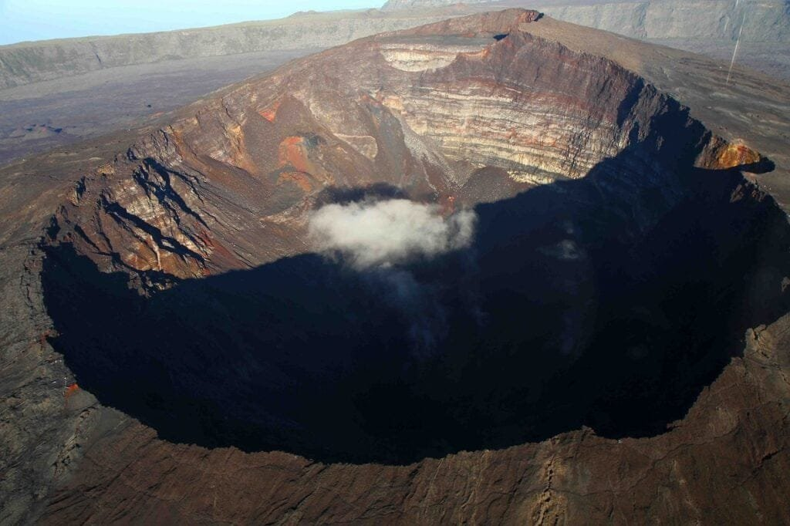

Volcanoes, those powerful forces of nature that can both awe and terrify us. They are not simply giant mountains with craters, but rather complex geological features that have the ability to shape the Earth's landscape. Understanding volcanoes is crucial for our safety and the well-being of communities living near them. From their different types and distribution around the world, to the causes of their eruptions and the hazards they pose, as well as the surprising benefits they bring, there is much to learn about these fascinating natural phenomena. By delving deeper into the topic, we can gain insights into volcanic eruption early warning systems and how they can help us anticipate and minimize the risks associated with volcanic activity.

This image is property of pixabay.com.

## Definition of a Volcano

### Basic definition of a volcano

A volcano is a geological feature that occurs when molten rock, gases, and debris escape to the earth's surface, resulting in a volcanic eruption. It is essentially a vent or opening in the earth's crust through which magma, volcanic ash, and gases are discharged. These eruptions can be explosive or effusive, depending on factors such as the viscosity of the erupting material and the amount of gas trapped within it.

### How volcanoes are formed

Volcanoes are formed through various processes that involve the movement and interaction of tectonic plates beneath the Earth's surface. There are three primary ways in which volcanoes can be formed:

1. **Plate Boundaries**: The majority of volcanoes are formed at plate boundaries, where two tectonic plates meet. This can occur at subduction zones, where one plate is forced beneath another, creating a volcanic arc. It can also occur at divergent plate boundaries, where plates move apart, allowing magma to rise and form new crust.
    
2. **Hotspots**: Some volcanoes are formed above mantle plumes, also known as hotspots. These are areas where hot magma rises from deep within the Earth's mantle, creating a localized source of volcanic activity. The Hawaiian Islands are a famous example of volcanoes formed above a hotspot.
    
3. **Rift Zones**: Rift zones occur when tectonic plates are moving apart, creating a linear series of cracks and fractures in the Earth's crust. Magma can then rise to fill these gaps, resulting in volcanic activity. The East African Rift Valley is an example of a rift zone where volcanoes are formed.
    

## Types of Volcanoes

### Stratovolcanoes or Composite Volcanoes

Stratovolcanoes, also known as composite volcanoes, are characterized by their steep, symmetrical cones and explosive eruptions. They are formed by alternating layers of lava flows, volcanic ash, and other pyroclastic materials. These eruptions result in a buildup of thick, viscous lava that can plug the volcano's vent, leading to explosive eruptions.

### Shield Volcanoes

Shield volcanoes have a broad, gently sloping cone shape that resembles a warrior's shield lying on the ground. They are formed by numerous eruptions of fluid lava that spread out in thin layers over a wide area. Shield volcanoes are typically associated with effusive eruptions, where lava flows steadily and does not generally explode.

### Cinder Cones

[Cinder cones](https://magmamatters.com/the-birth-of-new-land-understanding-cinder-cones/), also known as scoria cones, are small and conical-shaped volcanoes that usually form from a single, short-lived eruption. They are composed mainly of cinders, scoria, and other volcanic debris expelled from the vent. Cinder cones often have a bowl-shaped crater at the summit and are known for their explosive eruptions.

### Lava Domes

Lava domes, also called volcanic domes, are formed when highly viscous lava gradually accumulates and solidifies around a vent. They are characterized by their steep-sided, rounded shapes and can grow through repeated eruptions over an extended period. Lava domes are typically associated with slow-moving, sticky lava that doesn't flow far from the vent.

<iframe width="560" height="315" src="https://www.youtube.com/embed/VNGUdObDoLk" frameborder="0" allow="accelerometer; autoplay; encrypted-media; gyroscope; picture-in-picture" allowfullscreen></iframe>

  

## Geographical Distribution of Volcanoes

### Distribution in terms of tectonic plates boundaries

Volcanoes are distributed primarily along plate boundaries, where tectonic activity is most intense. The Pacific Ring of Fire is the most well-known example of this distribution, encompassing the Pacific Ocean and exhibiting a high concentration of volcanoes. Other zones of volcanic activity include the Mediterranean region, the Indonesian archipelago, and the mid-oceanic ridges.

### Hotspots under the earth's crust

Hotspots are areas beneath the Earth's crust where a column of hot magma rises from the mantle towards the surface. These hotspots are often fixed in place while the tectonic plates move, resulting in a chain of volcanoes forming over time. Famous hotspot examples include the Hawaiian Islands, Yellowstone National Park in the United States, and the Galapagos Islands.

### Rift zones

Rift zones are areas where tectonic plates are moving apart, typically forming linear depressions. Along these zones, magma can rise to fill the gaps, resulting in volcanic activity. The East African Rift Valley is a prominent example of a rift zone with active volcanoes, including Mount Kilimanjaro and Mount Nyiragongo.

### The 'Ring of Fire' phenomenon

The 'Ring of Fire' is a major area in the basin of the Pacific Ocean where numerous earthquakes and volcanic eruptions occur. It is associated with a nearly continuous series of oceanic trenches, volcanic arcs, volcanic belts, and plate movements. This ring encompasses several countries, including Japan, the Philippines, Indonesia, Chile, and the western coast of the United States.

## Common Causes of Volcanic Eruptions

### Tectonic plate movement

One of the primary causes of volcanic eruptions is the movement and interaction of tectonic plates. When plates converge or diverge, magma can be generated or reach the surface, leading to volcanic activity. Convergent plate boundaries, where one plate is subducted beneath another, often result in explosive eruptions due to the melting of the subducted plate.

### Pressure build-up due to accumulation of magma

Volcanic eruptions can also be triggered by the accumulation of magma beneath the Earth's surface. As magma rises and collects in a magma chamber, pressure builds until it overcomes the surrounding rocks' strength. The release of this pressure can result in a volcanic eruption, with the explosiveness determined by the magma's composition and gas content.

### Volcanic gas factor

The presence of volcanic gases, such as water vapor, carbon dioxide, sulfur dioxide, and hydrogen sulfide, plays a significant role in the eruption process. These gases can become dissolved in the magma, and as it rises to the surface, the decreasing pressure causes the gases to come out of solution, leading to a rapid expansion and explosive eruptions.

This image is property of pixabay.com.

## Hazards Associated with Volcanic Eruptions

### Lava flow

Lava flows pose a direct hazard to nearby communities and infrastructure. Depending on the viscosity of the lava, it can either move slowly, allowing people to evacuate, or flow more rapidly, engulfing everything in its path. Buildings, roads, and agricultural land can be destroyed by the relentless advance of lava, which can cause long-term damage to the affected areas.

### Ashfall and pyroclastic flows

Volcanic ashfall can spread over large areas, covering buildings, crops, and disrupting transportation and communication systems. Ash can also be hazardous when inhaled, causing respiratory problems and reducing visibility. Pyroclastic flows, on the other hand, are fast-moving, high-temperature currents of gas and rock fragments. These deadly flows can travel at high speeds, obliterating everything in their path and causing severe burns and asphyxiation.

### Lahars or mudflows

Lahars are rapidly flowing mixtures of volcanic debris and water that can be triggered by heavy rainfall, meltwater from snow and ice, or the collapse of volcanic edifices. They can travel long distances, burying communities and infrastructure, and can be highly destructive due to their ability to erode and carry away large volumes of material.

### Volcanic gases

[Volcanic gases](https://magmamatters.com/the-environmental-impact-of-volcanic-eruptions-2/ "The Environmental Impact of Volcanic Eruptions") released during eruptions can have detrimental effects on human health and the environment. Sulfur dioxide, when mixed with water vapor in the atmosphere, can form sulfuric acid, which can lead to acid rain. Volcanic gases can also contaminate the air, making it dangerous to breathe and causing respiratory problems.

### Tsunamis

In certain circumstances, volcanic eruptions can trigger tsunamis, which are large ocean waves. These tsunamis can result from the displacement of large volumes of water due to volcanic eruption, underwater landslides, or the collapse of volcanic island flanks. Tsunamis can cause extensive damage to coastal areas and pose a significant threat to human life.

## Benefits of Volcanoes

### Creation of fertile soils

Volcanic eruptions contribute to the creation of fertile soils, especially in areas surrounding active volcanoes. When lava and volcanic ash are deposited on the land, they provide essential nutrients and minerals that promote plant growth. This phenomenon has led to the cultivation of fertile farmland in volcanic regions worldwide, supporting agricultural productivity.

### Generation of geothermal energy

[Volcanic activity can harness the Earth's geothermal energy](https://magmamatters.com/geothermal-energy-and-its-volcanic-origins/ "Geothermal Energy and Its Volcanic Origins"), providing a source of power generation. Geothermal power plants utilize the heat from underground volcanic systems to produce electricity in an environmentally friendly manner. This renewable energy source has the potential to reduce dependence on fossil fuels and contribute to sustainable development.

### Mining opportunities

Volcanic regions often contain valuable mineral deposits, as the heat and pressure associated with volcanic activity can concentrate minerals in the Earth's crust. Volcanic eruptions can bring these minerals closer to the surface, making them more accessible for mining operations. Minerals such as gold, silver, copper, and sulfur are commonly found in volcanic regions.

### Tourism attraction

Volcanic landscapes and active volcanoes attract tourists from around the world. Many people are fascinated by the raw power and beauty of volcanic eruptions, as well as the unique geological features created by volcanic activity. Volcanic tourism provides economic benefits to local communities, generating income through tourism-related activities such as guided hikes, volcano tours, and educational programs.

This image is property of pixabay.com.

## Understanding Volcanic Activity and Eruption Patterns

### Studying seismic activity

Seismic activity, including earthquakes and volcanic tremors, provides critical information about the behavior of magma and the potential for volcanic eruptions. Monitoring seismic events can help scientists detect changes in the Earth's crust caused by rising magma, providing valuable insights into the volcanic activity's timing and potential hazards.

### Gas measurements

Measuring the composition and quantity of gases emitted by volcanoes is an essential tool for understanding volcanic activity. Monitoring stations located near volcanoes collect gas samples and measure parameters such as [sulfur dioxide](https://magmamatters.com/the-art-and-science-of-volcano-monitoring/ "The Art and Science of Volcano Monitoring") content, carbon dioxide concentration, and hydrogen sulfide levels. These measurements aid in tracking changes over time and can provide early indications of volcanic unrest.

### Monitoring ground deformation

Ground deformation monitoring involves measuring changes in the volcano's shape and surface elevation. Techniques such as GPS (Global Positioning System), satellite radar interferometry, and tiltmeters are used to track even subtle movements of the Earth's surface. By detecting ground deformation, scientists can infer the accumulation and movement of magma within the volcano, helping to predict eruptions.

### Satellite remote sensing

Satellite remote sensing allows scientists to monitor volcanic activity over vast areas. Satellites equipped with thermal sensors and gas detectors can detect changes in temperature and gas emissions associated with volcanic activity. This technology provides a broader perspective on volcanic events, enabling the monitoring of remote and inaccessible volcanoes.

## Mitigating Risks and Handling Volcanic Eruptions

### Evacuation plans

Developing comprehensive evacuation plans is crucial in areas prone to volcanic eruptions. Local communities need to be aware of the potential hazards and be prepared to evacuate safely and efficiently when necessary. Evacuation routes, designated shelters, and communication systems should be established to ensure the smooth flow of evacuees and minimize the risk to human life.

### Building design and location

Designing structures that can withstand volcanic hazards is essential in at-risk areas. Building codes should consider the potential impacts of volcanic ashfall, lava flows, and pyroclastic flows. Structures should be constructed to withstand the immense heat and pressure associated with eruptions. Additionally, careful consideration should be given to the location of critical infrastructure, avoiding areas susceptible to volcanic activity.

### Educating local communities

Educating local communities about volcanic hazards and how to respond to them is vital in reducing the risks associated with eruptions. Public awareness campaigns, educational programs, and drills can help communities understand the potential dangers and the necessary actions to take in the event of an eruption. This knowledge empowers individuals to protect themselves and make informed decisions.

### Government policies and disaster preparedness

Governments play a crucial role in mitigating volcanic risks by enacting policies and regulations that address volcanic hazards. This includes establishing monitoring systems, conducting research, and allocating resources for emergency response and disaster preparedness. Collaboration between different government agencies, scientific institutions, and local communities is essential for effective volcanic risk management.

## Role of Volcanic Eruption Early Warning Systems

### Role in predicting eruptions

Volcanic eruption early warning systems are designed to detect changes in volcanic activity and provide timely warnings to at-risk populations. By monitoring various volcanic parameters, such as seismic activity, gas emissions, and ground deformation, these systems can help scientists identify precursors to eruptions and increase the accuracy of eruption predictions.

### Technologies used in these systems

Volcanic eruption early warning systems rely on a combination of monitoring technologies to collect data on volcanic activity. This includes seismometers to record seismic events, gas analyzers to measure gas emissions, GPS receivers to monitor ground deformation, and remote sensing satellites to provide a broader perspective on volcanic activity. These technologies work together to provide a comprehensive understanding of volcanic behavior.

### Examples of successful early warning systems

Several countries have implemented successful volcanic eruption early warning systems. One notable example is Japan, which has a dense network of monitoring stations, including seismometers and gas analyzers, surrounding its active volcanoes. This system has allowed scientists to detect changes in volcanic activity and issue timely warnings, contributing to the effective evacuation of at-risk populations.

## Future Advances in Volcanology

### Advances in prediction methodologies

Future advances in volcanology may include the development of more accurate prediction methodologies. Scientists are continually researching and refining models that can better forecast volcanic eruptions. By incorporating a wider range of data sources, improving data analysis techniques, and advancing computer modeling capabilities, eruption predictions may become more precise and reliable.

### Improved understanding of magma reservoirs

Understanding the behavior of magma reservoirs deep within the Earth's crust is a crucial area of research in volcanology. By studying the composition, movement, and storage of magma, scientists can gain insights into eruption triggers and the development of volcanic systems. Advances in imaging techniques and sampling technologies may provide valuable information about these hidden reservoirs.

### Progress in remote sensing technologies

Remote sensing technologies, such as satellite monitoring and aerial drones, are continually advancing in their capabilities. These technologies provide valuable data on volcanic activity, even in remote and hazardous environments. Ongoing improvements in sensors, resolution, and data processing techniques may enhance our ability to monitor and analyze volcanic behavior, contributing to more effective volcanic risk management.

In conclusion, understanding volcanoes is crucial for predicting future activity and mitigating risks to surrounding communities. This article explored the various [types of volcanoes](https://magmamatters.com/understanding-volcanic-formation-a-comprehensive-guide/ "Understanding Volcanic Formation: A Comprehensive Guide"), their geographic distribution, causes of volcanic eruptions, associated hazards, and the benefits they bring. We also discussed how volcanic activity is studied, techniques used to warn of eruptions in advance, and potential future advances in the field of volcanology. By continuously studying and monitoring volcanoes, we can improve our ability to protect lives, infrastructure, and the environment from the impacts of volcanic eruptions.

