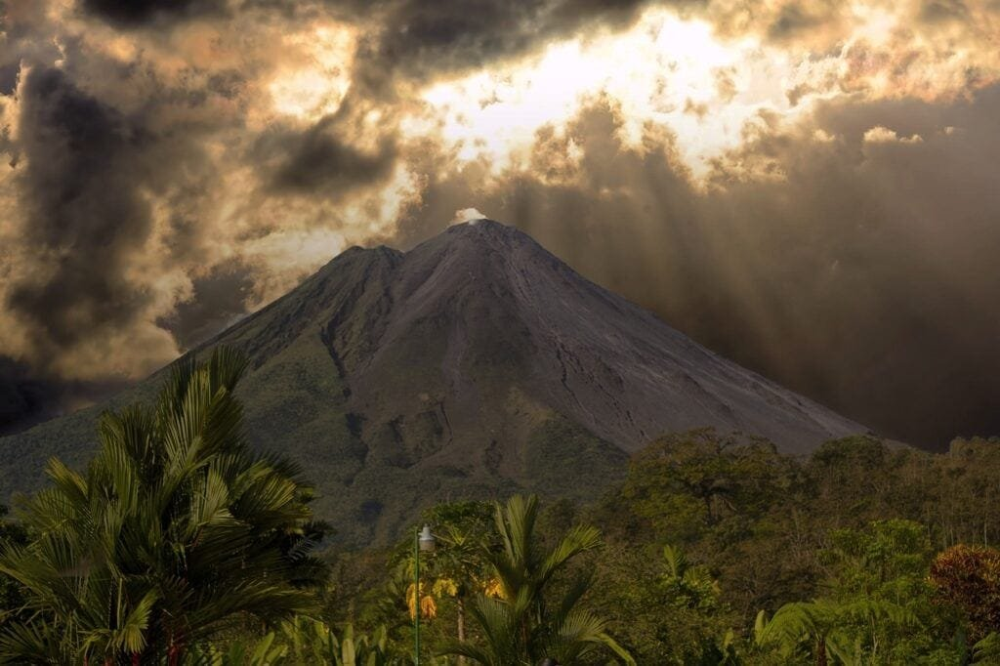

If you've ever been fascinated by the power and majesty of volcanoes, then this article is for you. "Understanding Volcanoes: Types, Distribution, Causes, Hazards, and Benefits" provides a comprehensive view of this geological phenomenon. From the formation of volcanoes to their eruption patterns and the hazards they pose, this article will give you a deeper understanding of these natural wonders. Whether you're interested in the different types of volcanoes or want to learn more about the benefits and risks associated with volcanic activity, this article is a must-read. So, grab a cup of coffee, sit back, and prepare to delve into the captivating world of volcanoes.

This image is property of pixabay.com.

## Understanding Volcanoes

Volcanoes are fascinating natural phenomena that have captured the imagination of humans for centuries. Whether you're a professional geologist or simply a curious traveler, understanding volcanoes is crucial for appreciating the immense power and beauty of these geological features. In this article, we will explore the different [types of volcanoes](https://magmamatters.com/understanding-volcanic-formation-a-comprehensive-guide/ "Understanding Volcanic Formation: A Comprehensive Guide"), how they are formed, important components of a volcano, their distribution around the world, causes of volcanic eruptions, hazards associated with volcanic activity, methods of predicting eruptions, ways to mitigate risks, and even the benefits that volcanoes bring to our planet. So, let's dive in and explore the fascinating world of volcanoes together!

### What are Volcanoes?

Volcanoes are vents or openings in the Earth's crust that allow molten rock, gases, and debris to escape to the surface. They can manifest as majestic mountains, gentle slopes, or even as fissures on the ground. Volcanic eruptions occur when pressure builds up within the Earth's interior, causing the release of lava, ash, and gases. These eruptions can range from gentle streams of lava to explosive blasts that can reshape the surrounding landscape. Volcanoes play a crucial role in shaping the Earth's geological and ecological systems and have both positive and negative impacts on our lives.

### How are Volcanoes Formed?

Volcanoes are primarily formed at sites along tectonic plate boundaries, hotspots, or rift zones. Tectonic plate boundaries are areas where the Earth's crust is either colliding (convergent boundary), moving apart (divergent boundary), or sliding past each other (transform boundary). In these regions, volcanic activity occurs due to the movement and interaction of these plates. Hotspots, on the other hand, are localized areas of intense heat deep within the Earth's mantle, which can generate volcanic activity even away from tectonic plate boundaries. Finally, rift zones are areas where tectonic plates are moving apart, creating openings that allow magma to rise to the surface.

### Important Components of a Volcano

To understand how volcanoes work, it is important to examine their internal structure and components. The main components of a volcano include the magma chamber, conduit, vent, crater, and volcanic cone. The magma chamber is the underground reservoir of molten rock, while the conduit is the pipe-like structure that connects the magma chamber to the surface. The vent is the opening through which volcanic material is expelled during eruptions, and the crater is the depression at the top of the volcano that often forms after a major eruption. The volcanic cone refers to the physical shape of the volcano, which can vary depending on the type of eruption and the composition of volcanic material.

## Types of Volcanoes

Volcanoes come in various shapes and sizes, each with its own unique characteristics. Here are the most common types of volcanoes found around the world:

### Shield Volcanoes

Shield volcanoes, named after their broad, gently sloping shape reminiscent of a warrior's shield, are the largest volcanoes on Earth. These volcanoes are characterized by their low viscosity lava flows, which result in the gradual buildup of layers over time. Shield volcanoes are commonly found in hotspots, such as the Hawaiian Islands. The famous Mauna Loa volcano in Hawaii is a prime example of a shield volcano.

### Composite (Stratovolcano) Volcanoes

Composite or stratovolcanoes are steep-sided and symmetrical cone-shaped volcanoes. They are composed of alternating layers of lava, ash, and debris, which are the result of both explosive and effusive eruptions. Stratovolcanoes have a higher viscosity lava, which causes the eruptions to be more explosive in nature. The notorious Mount St. Helens in the United States is a well-known composite volcano.

### Cinder Cone Volcanoes

[Cinder cone](https://magmamatters.com/the-birth-of-new-land-understanding-cinder-cones/) volcanoes are the simplest and smallest type of volcano. They are formed by the accumulation of cinders and other pyroclastic material near a vent. Cinder cone eruptions are typically short-lived and produce ash, cinders, and bombs. These volcanoes tend to be found in clusters, often adjacent to larger composite or shield volcanoes. One example of a cinder cone volcano is Parícutin in Mexico.

### Lava Domes

Lava domes are created when very viscous lava accumulates around a vent, resulting in a steep-sided and rounded mound. These domes can be formed during a single eruption or over an extended period of time. Lava domes are often associated with explosive eruptions and can be found in volcanic regions worldwide, such as Mount Unzen in Japan.

### Caldera

A caldera is a large, basin-shaped depression that forms when a volcano's summit collapses after a substantial eruption. Calderas can be several kilometers wide and often contain a lake or other bodies of water. These volcanic features are remnants of particularly large eruptions, such as the eruption of Yellowstone Caldera in the United States millions of years ago.

### Fissure Eruptions (Flood Basalt)

Fissure eruptions occur when magma escapes through cracks or fissures in the Earth's crust, resulting in the outpouring of vast amounts of lava. These eruptions can produce extensive lava flows that can cover extensive areas and form characteristic flat plains. Flood basalt eruptions are associated with hotspot activity and have occurred in various parts of the world over geological history.

This image is property of pixabay.com.

## Distribution of Volcanoes

Volcanoes are not evenly distributed around the world but instead occur in specific regions. The distribution of volcanoes can be attributed to two main factors: tectonic plate boundaries and hotspots.

### Volcanoes and Tectonic Plate Boundaries

One of the primary factors determining volcanic activity is the interaction between tectonic plates. Convergent plate boundaries, where plates collide, such as the Pacific Ring of Fire, are hotspots for volcanic activity. Here, volcanoes are formed due to subduction, as one tectonic plate is forced beneath another. Divergent plate boundaries, where plates move apart, also give rise to volcanic activity, as the separation creates openings for magma to rise to the surface. Transform boundaries, where plates slide past each other, can also produce volcanic activity, although it is less common.

### Volcanoes and Hotspots

Hotspots are another key factor in the distribution of volcanoes. Hotspots are stationary plumes of extreme heat within the Earth's mantle, independent of tectonic plate boundaries. The Hawaiian Islands are a prime example of hotspots, with the volcanic chain formed by the Pacific Plate moving over the hotspot for millions of years. As the plate moves, new volcanoes are formed while older ones become dormant. Other examples of hotspots include the Yellowstone hotspot in the United States and the Galápagos hotspot in the Pacific Ocean.

### Volcanoes in the 'Ring of Fire'

The Pacific Ring of Fire is a region known for its intense seismic activity and volcanic eruptions. It is a circular area encompassing the coasts surrounding the Pacific Ocean. This region is home to a majority of the world's active volcanoes and experiences frequent earthquakes. The Ring of Fire is caused by the movement and subduction of several tectonic plates, resulting in the volcanic activity prevalent in this area. Some countries within the Ring of Fire include Japan, the Philippines, Indonesia, and Chile, among others.

### Other Notable Volcanic Regions

While the Ring of Fire is undoubtedly the most well-known volcanic region, there are other notable areas around the world with active or dormant volcanoes. For example, the East African Rift, which stretches from Mozambique to Tajikistan, is an area with significant volcanic activity. The Mediterranean region, including Italy and Greece, is home to famous volcanoes like Mount Vesuvius and Santorini. Iceland is also renowned for its volcanic activity, with volcanoes like Eyjafjallajökull gaining international attention in recent years.

## Causes of Volcanic Eruptions

Volcanic eruptions are complex events that can have various triggers. Understanding the causes of volcanic eruptions is essential for predicting and mitigating their impacts. Here are the main factors that contribute to volcanic eruptions:

### Tectonic Plate Movement

Tectonic plate movement plays a significant role in triggering volcanic activity. Convergent plate boundaries, where two plates collide, often experience intense volcanic activity as one plate is subducted beneath another. The subducting plate melts, generating magma that rises to the surface, leading to volcanic eruptions. Divergent plate boundaries, where plates move apart, can also trigger volcanic activity as magma rises to fill the gap created by the separating plates.

### Increase in Magma Chamber Pressure

Volcanic eruptions can occur when the pressure in the magma chamber becomes too great to contain. This pressure can build up due to the accumulation of magma over time or from the injection of new magma into an already existing chamber. When the pressure exceeds the strength of the surrounding rock, the magma forcefully erupts through the conduit and vent, resulting in an explosive eruption.

### Role of Gas within Magma

Volcanic gases, such as water vapor, carbon dioxide, sulfur dioxide, and others, play a crucial role in volcanic eruptions. As magma rises to the surface, the decrease in pressure causes dissolved gases to come out of solution, forming gas bubbles within the magma. If these gas bubbles become trapped and cannot escape, the pressure within the magma chamber increases. When the pressure becomes too great, an explosive eruption can occur as the gas's rapid expansion propels the magma into the air.

### Lava Viscosity and its Impact on Eruption

The viscosity or thickness of lava is another essential factor in determining the nature of a volcanic eruption. Lava viscosity is influenced by several variables, including temperature, composition, and volatile content. If the lava is low in viscosity, meaning it flows easily, the eruption is more likely to be effusive, with lava steadily flowing out of the vent and forming lava flows. In contrast, high viscosity lava is sticky and does not flow as easily, leading to more explosive eruptions as gas bubbles become trapped within the lava, causing pressure to build until it is released explosively.

This image is property of pixabay.com.

## Hazards of Volcanic Eruptions

While volcanoes are awe-inspiring natural features, they also pose significant hazards to both human and natural environments. The hazards associated with volcanic eruptions can range from immediate, such as lava flows, to long-term, like the impact of ash on climate. It is essential to understand these hazards to ensure the safety and well-being of communities in volcanic regions. Here are some of the primary hazards posed by volcanic eruptions:

### Lava Flows

Lava flows are streams of molten rock that can engulf and destroy everything in their path. Although they move relatively slowly, usually a few kilometers per hour, they can cause extensive damage to homes, infrastructure, and agriculture. Lava flows can also alter the landscape, creating new landforms and diverting rivers and streams.

### Volcanic Ash and Other Pyroclastic Materials

During volcanic eruptions, the explosive release of gases and magma can produce volcanic ash and other pyroclastic materials. Volcanic ash is made up of fine particles of pulverized rock and glass, which can be carried by the wind for hundreds or even thousands of kilometers. Ashfall can have a range of impacts, from damaging crops and infrastructure to disrupting air and water transportation and posing respiratory risks to humans and animals. Pyroclastic flows, which are clouds of hot ash, gas, and rock fragments, are also highly destructive and can devastate everything in their path.

### Volcanic Gases

[Volcanic gases](https://magmamatters.com/the-environmental-impact-of-volcanic-eruptions-2/ "The Environmental Impact of Volcanic Eruptions") released during eruptions can have significant impacts on the environment and human health. These gases include sulfur dioxide, carbon dioxide, hydrogen sulfide, and others. Exposure to high concentrations of volcanic gas can lead to respiratory problems, headaches, eye irritation, and in extreme cases, even death. Volcanic gases can also contribute to air pollution and have a global impact on climate patterns.

### Post-Eruption Mudflows (Lahars)

Lahars, also known as volcanic mudflows, are a secondary hazard associated with volcanic eruptions. They occur when volcanic material, such as ash, rocks, and debris, mixes with water, creating a fast-moving and highly destructive flow. Lahars can be triggered by heavy rainfall, the melting of snow and ice, or the collapse of a volcanic dome. These mudflows can travel at high speeds, carrying with them large boulders and trees, and can cause extensive damage to infrastructure, including bridges and roads.

### Landslides and Avalanches

Volcanic eruptions can trigger landslides and avalanches, especially in steep volcanic terrain. The rapid movement of debris down the slopes can bury entire communities and cause significant damage. Landslides and avalanches can be triggered by the collapse of a volcanic cone, seismic activity, or heavy rainfall associated with the eruption.

### Tsunamis

Volcanic activity can also lead to the generation of tsunamis. These are large, powerful ocean waves caused by underwater volcanic eruptions or the collapse of volcanic edifices into the sea. Tsunamis can travel across the ocean and cause devastating damage to coastal areas, including flooding, destruction of infrastructure, and loss of life.

## Methods of Predicting Volcanic Eruptions

Predicting volcanic eruptions is a challenging task, but advancements in monitoring technology and scientific understanding have improved our ability to forecast volcanic activity. By closely monitoring various indicators, scientists can detect changes in a volcano's behavior and provide timely warnings to at-risk populations. Here are some methods used in the prediction of volcanic eruptions:

### Monitoring Ground Deformation

Ground deformation, commonly measured using GPS and satellite-based technologies, is an essential tool for monitoring volcanic activity. By tracking minute changes in the Earth's surface, scientists can detect the movement of magma beneath the volcano. Unusual patterns of ground deformation, including uplift or subsidence, can indicate the movement and accumulation of magma, providing valuable information for eruption forecasts.

### Seismic Activity Analysis

Seismic monitoring involves the measurement of earthquake activity and volcanic tremors. Volcanic tremors are continuous, low-frequency seismic vibrations caused by the movement of magma, gas, and other fluids within a volcano. Monitoring [seismic activity can help scientists understand](https://magmamatters.com/the-art-and-science-of-volcano-monitoring/ "The Art and Science of Volcano Monitoring") the movement of magma beneath the volcano and detect any changes that may indicate an impending eruption.

### Gas Emission Monitoring

Monitoring volcanic gas emissions can provide important insights into a volcano's behavior. By measuring the composition and concentration of gases released during an eruption, scientists can infer the state of the volcano's magmatic system. Increases in certain gases, such as sulfur dioxide, can suggest an imminent eruption. Gas emission monitoring can be done using ground-based sensors, remote sensing techniques, and aerial measurements.

### Geological Studies and Historical Patterns

Studying the geological history of a volcano can help scientists understand its eruption patterns and forecast future activity. By analyzing deposits from past eruptions, scientists can identify recurrent patterns and estimate the likelihood of similar events occurring in the future. Historical records and eyewitness accounts also provide valuable information to determine a volcano's eruption frequency and magnitude.

## Mitigating Risks from Volcanic Eruptions

While it is impossible to prevent volcanic eruptions, mitigating the risks associated with them is crucial to protecting vulnerable communities. By implementing appropriate measures and strategies, governments and communities can reduce the impacts of volcanic eruptions and ensure the safety of their populations. Here are some essential steps in mitigating volcanic risks:

### Community Education and Awareness

Education and awareness initiatives are vital for equipping communities with the knowledge and skills necessary to respond to volcanic hazards. Teaching residents about the signs and dangers of volcanic activity, evacuation procedures, and the appropriate use of protective equipment can empower them to make informed decisions during an eruption. Public outreach programs, educational materials, and community drills are effective tools for fostering preparedness.

### Volcanic Hazard Zoning

Volcanic hazard zoning involves dividing areas around a volcano into different zones based on the level of risk posed by various hazards. These zones, typically delineated as danger zones, caution zones, and safe zones, guide land-use planning, infrastructure development, and evacuation procedures. Hazard zoning ensures that high-risk areas are avoided or equipped with appropriate measures to minimize the potential impacts of volcanic eruptions.

### Evacuation and Emergency Responses

Developing robust evacuation plans and emergency response strategies is crucial for protecting lives and minimizing injuries during a volcanic eruption. Governments and communities must establish clear evacuation routes, safe shelters, and efficient communication systems to ensure the timely departure of residents from high-risk areas. Effective coordination among emergency services, such as search and rescue teams, medical personnel, and law enforcement, is also essential for a swift and organized response.

### Structural Design Consideration

Designing infrastructure and buildings in volcanic regions to withstand the effects of eruptions is a crucial aspect of risk mitigation. Constructing buildings with materials and designs that can withstand volcanic ash, lahars, and seismic activity can significantly reduce the damage caused by eruptions. Building codes and regulations should be updated to incorporate specific volcanic hazards, such as ashfall protection, structural reinforcement, and ventilation systems to prevent the accumulation of volcanic gases.

## Benefits of Volcanoes

While the hazards associated with volcanic eruptions are significant, volcanoes also provide several benefits that contribute to the Earth's geology, ecology, and even human society. Here are some of the positive aspects of volcanic activity:

### Contribution to Soil Fertility

Volcanic eruptions release large amounts of ash and other volcanic materials, which are rich in essential nutrients and minerals. Over time, these deposits weather and break down, creating fertile soils that are highly productive for agriculture. Many volcanic regions around the world, such as the volcanic soils of the Mediterranean or the volcanic ash plains of the Philippines, are renowned for their agricultural productivity.

### Creation of New Land

Through successive eruptions and the accumulation of volcanic material, volcanoes have the power to create new landforms and expand coastlines. Over time, volcanic activity can lead to the formation of islands, peninsulas, and even entire archipelagos. The Hawaiian Islands, for example, owe their existence to millions of years of volcanic activity, with each eruption contributing to the growth of new land.

### Geothermal Energy

[Volcanic regions are often associated with abundant geothermal energy](https://magmamatters.com/geothermal-energy-and-its-volcanic-origins/ "Geothermal Energy and Its Volcanic Origins") resources. Geothermal energy harnesses the heat stored within the Earth's crust to generate electricity and provide heating and cooling solutions. Volcanic areas with accessible geothermal resources, such as Iceland or New Zealand, can derive a substantial portion of their energy needs from this clean and renewable source.

### Tourism and Recreation

Volcanoes have long been a source of fascination for travelers and adventurers. Many volcanoes worldwide attract tourists who are eager to witness the raw power and beauty of these geological features. In addition to hiking, climbing, and exploring volcanic landscapes, volcanic regions often offer opportunities for other recreational activities, such as hot springs bathing, cave exploration, and wildlife observation.

### Mineral Resources

Volcanic activity can concentrate valuable mineral resources, making volcanic regions desirable for mining and resource extraction. Volcanic environments can host economically significant mineral deposits, such as gold, silver, copper, and other metals. The extraction and processing of these minerals contribute to local and global economies.

## Volcanic Hazards Impact on Tourism

Volcanoes, with their awe-inspiring displays of power and beauty, have long been a draw for tourists. The allure of "volcano tourism" attracts visitors from around the world, eager to witness the incredible forces of nature firsthand. However, volcanic eruptions also pose risks to tourism, affecting both local and global perspectives. Here are some ways volcanic hazards impact tourism:

### Impact on Local and Global Tourism

When a volcano erupts, tourism in the immediate vicinity of the volcano is typically affected. Evacuation orders, road closures, and disruption of services can lead to the temporary suspension of tourist activities. Locally, businesses that rely on tourism, such as hotels, restaurants, and transportation services, may experience a downturn in visitors, impacting their revenue and employment levels. Globally, the impact of volcanic hazards on tourism depends on the volcano's international fame and the level of media coverage. Eruptions that receive significant media attention can deter tourists from visiting the entire region, even if specific areas may not be directly affected by the eruption.

### Economic Consequences

The economic consequences of volcanic eruptions on tourism can be significant, especially in areas heavily reliant on tourism as a source of income. Closure of popular tourist sites, cancellation of bookings, and a decline in visitor numbers can result in financial losses for local businesses and governments. Loss of employment in the tourism sector can also have wide-ranging impacts on the local economy. Furthermore, the costs associated with rebuilding and repairing infrastructure damaged during eruptions can strain local budgets.

### Potential Health Risks for Tourists

Volcanic eruptions can pose health risks to tourists, depending on the proximity of their location to the eruption and the prevailing wind direction. Volcanic ash, gases, and other airborne particles can lead to respiratory issues, eye irritation, and skin problems. Exposure to volcanic gases, such as sulfur dioxide, can exacerbate respiratory conditions and cause discomfort or illness. To mitigate these risks, it is essential for tourists to heed warnings and advice from local authorities, utilize appropriate protective equipment, and stay informed about the latest eruption updates.

### The Allure of 'Volcano Tourism'

Despite the hazards, 'volcano tourism' continues to attract adventure seekers and nature enthusiasts who are captivated by the raw power and beauty of volcanic eruptions. For many, witnessing a volcanic eruption up close is a once-in-a-lifetime experience that exemplifies the awe-inspiring forces that shape our planet. Volcano tourism can contribute to local economies by generating revenue and employment opportunities. However, it is crucial for tourists to prioritize safety and adhere to guidelines provided by authorities to ensure a positive and safe experience for all.

## Case Studies of Notable Volcanic Eruptions

To deepen our understanding of volcanic eruptions, let's examine some notable case studies that highlight the devastating impacts and lessons learned from these events:

### Mount St. Helens, USA, 1980

The eruption of Mount St. Helens in Washington State in 1980 is one of the most well-known volcanic eruptions in recent history. The eruption resulted in the tragic loss of 57 lives and caused extensive damage to surrounding forests, infrastructure, and wildlife. Mount St. Helens serves as a powerful reminder of the destructive forces that volcanoes can unleash, and it has since become an important site for scientific research on volcanic activity.

### Mount Pinatubo, Philippines, 1991

The eruption of Mount Pinatubo in the Philippines in 1991 was one of the largest volcanic eruptions of the 20th century. This eruption sent a massive column of ash and gas into the atmosphere, causing global climate effects and resulting in the temporary cooling of the Earth's surface. The eruption had a significant impact on the local population, leading to the displacement of thousands of people and the loss of lives and livelihoods. The lessons learned from the Mount Pinatubo eruption have helped shape volcanic hazard management strategies in the Philippines and other volcanic regions.

### Eyjafjallajökull, Iceland, 2010

The eruption of Eyjafjallajökull in Iceland in 2010 captured worldwide attention due to its impact on air travel. The eruption ejected vast amounts of volcanic ash into the atmosphere, leading to the closure of airspace across Europe for several days. This disruption caused significant economic losses, affecting airlines, travel agencies, and tourism-dependent industries. The Eyjafjallajökull eruption highlighted the need for improved volcanic ash monitoring and risk assessments to minimize the impact on air transportation.

### Kilauea, Hawaii, ongoing eruptions since 1983

Kilauea, one of the world's most active volcanoes, has been erupting continuously since 1983. Over the years, this ongoing eruption has created new land, destroyed homes and infrastructure, and impacted local communities. The eruption of Kilauea in 2018 made headlines worldwide as it caused dramatic lava flows that engulfed entire neighborhoods and changed the landscape of the area. The ongoing eruptions of Kilauea serve as a reminder of the dynamic nature of volcanic activity and the need for constant monitoring and preparedness in volcanic regions.

### Mount Vesuvius, Italy, AD 79

The eruption of Mount Vesuvius in AD 79 is one of the most infamous volcanic eruptions in history. This catastrophic eruption buried the Roman cities of Pompeii and Herculaneum under a thick layer of volcanic ash and debris, preserving them remarkably well for future generations. The eruption resulted in the loss of thousands of lives and the destruction of entire communities. The archaeological excavation of these ancient cities provides valuable insights into life at the time and serves as a reminder of the raw power and unpredictability of volcanoes.

In conclusion, understanding volcanoes is essential for comprehending the forces that shape our planet and the risks and benefits associated with volcanic activity. From the different types of volcanoes to their distribution, causes of eruptions, hazards, methods of prediction, and ways to mitigate risks, there is much to learn about these remarkable geological features. By studying volcanoes and implementing appropriate measures, we can ensure the safety of communities living in volcanic regions and harness the benefits that volcanoes bring, such as fertile soils, geothermal energy, and opportunities for tourism and recreation. Let us continue to explore and appreciate the fascinating world of volcanoes while prioritizing safety and sustainability.

Related Posts: [Mitigating Risks: Forecasting Volcanic Activity in Prone Areas](https://magmamatters.com/mitigating-risks-forecasting-volcanic-activity-in-prone-areas/), [The Formation and Eruption Patterns of Volcanoes](https://magmamatters.com/the-formation-and-eruption-patterns-of-volcanoes-4/), [The Pyroclastic Phenomena of Pompeii: 7 Insights to Explore](https://magmamatters.com/the-pyroclastic-phenomena-of-pompeii-7-insights-to-explore/), [Tips for Capturing Volcano Pyroclastic Flow Photos](https://magmamatters.com/tips-for-capturing-volcano-pyroclastic-flow-photos/), [Understanding Volcanoes and Their Eruption Patterns](https://magmamatters.com/understanding-volcanoes-and-their-eruption-patterns/)
