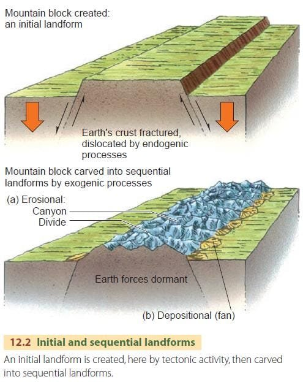
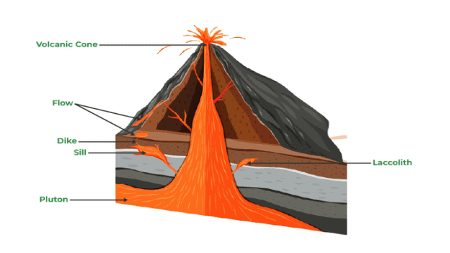
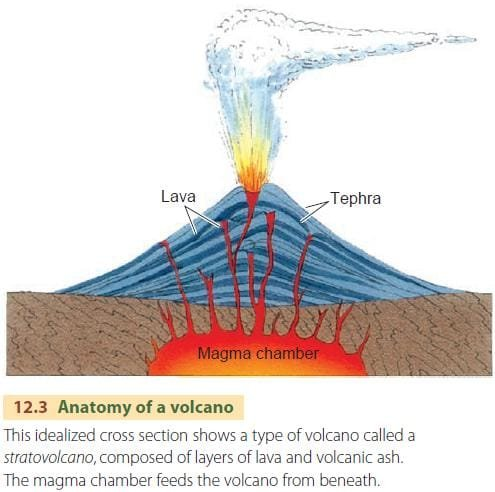
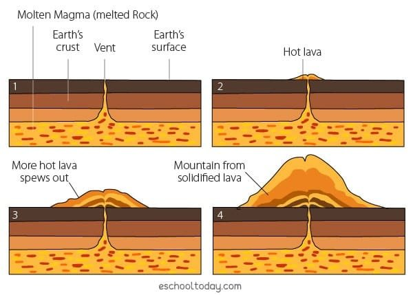
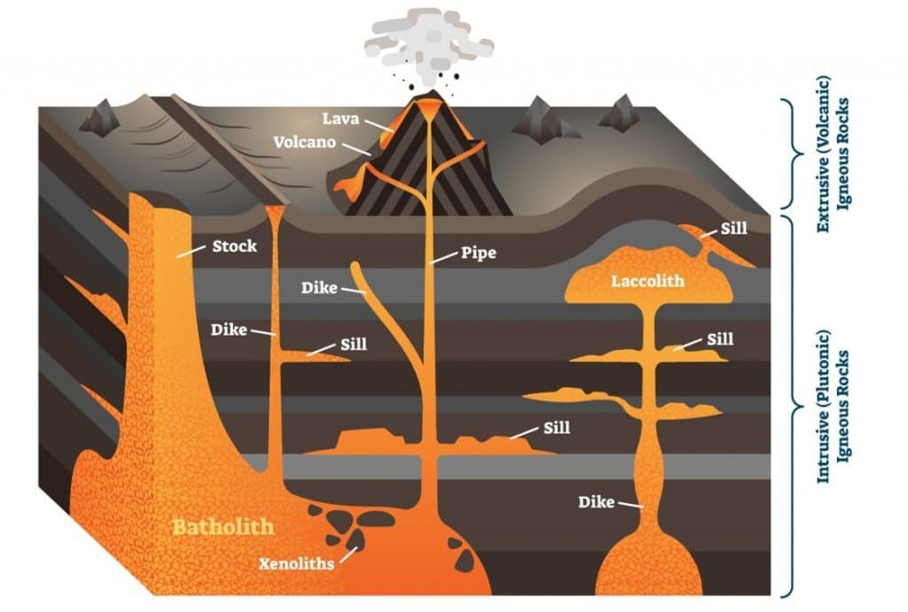

In "Unveiling the Formation of Volcanic Landforms," you will learn about the fascinating process through which volcanoes are created. Volcanoes are formed when molten rock, gases, and debris escape to the earth's surface, resulting in eruptions of lava and ash. They can occur at different locations, such as plate boundaries, hotspots under the earth's crust, or rift zones where tectonic plates are moving apart. This article will delve into the various types of volcanoes, their geographic distribution, eruption causes, and the hazards and benefits associated with volcanic activity. By understanding the formation of volcanic landforms, we can better predict future volcanic activity and safeguard the communities that surround them.

This image is property of geography.name.

## Understanding Volcanoes

[Volcanoes have been fascinating natural phenomena](https://magmamatters.com/the-art-and-science-of-volcano-monitoring/ "The Art and Science of Volcano Monitoring") for centuries, captivating scientists and adventurers alike. Their awe-inspiring eruptions and majestic landforms offer a glimpse into the powerful forces at work deep beneath our planet's surface. In this article, we will explore the different aspects of volcanoes, from their definition and demographics to the hazards they pose and the benefits they bring.

### Definition of Volcanoes

Before we delve into the details, let's start with the basics. [Volcanoes can be defined as geological](https://magmamatters.com/geothermal-energy-and-its-volcanic-origins/ "Geothermal Energy and Its Volcanic Origins") formations where molten rock, gases, and debris escape to the Earth's surface, resulting in eruptions of lava and ash. These eruptions can create a variety of landforms, leaving a lasting impact on the surrounding environment.

### Volcano Demographics

Volcanoes are not evenly distributed around the globe; instead, they tend to occur in specific regions. The geographical distribution of volcanoes provides valuable insights into their formation and activity. They are commonly found along plate boundaries, where tectonic plates either collide or move apart. Additionally, hotspots beneath the Earth's crust and rift zones, where plates are moving apart, are also hotspots for volcanic activity. One of the most famous volcanic regions is the "Ring of Fire," encircling the Pacific Ocean, where multiple plate boundaries intersect.

### Volcano Hazard Level

Understanding the hazard level of volcanoes is crucial for the safety and well-being of communities living near these geological wonders. Volcanoes can pose a wide range of hazards, including explosive eruptions, lava flows, pyroclastic flows, ashfall, and lahars (mudflows). The eruption style and the composition of magma play a significant role in determining the level of hazard a volcano presents. By assessing various factors such as eruption history and monitoring volcanic activity, scientists can estimate the potential risk and implement appropriate mitigation strategies.

## Types of Volcanoes

Volcanoes exhibit diverse shapes and characteristics, with each type having its own unique features. Let's take a closer look at some of the most common types [of volcanoes](https://magmamatters.com/understanding-volcanic-formation-a-comprehensive-guide/ "Understanding Volcanic Formation: A Comprehensive Guide"):

### Shield Volcanoes

Shield volcanoes, named for their resemblance to a warrior's shield lying on the ground, are broad and gently sloping with a low-angle profile. These volcanoes are mainly built by the accumulation of basaltic lava flows, which are relatively fluid and cover vast distances. Shield volcanoes are typically associated with effusive eruptions, where lava flows steadily and peacefully from the vent. They are often found in hotspot regions, such as the Hawaiian Islands.

### Stratovolcanoes: Cone-shaped Volcanoes

Stratovolcanoes, also known as composite volcanoes, are tall and conical in shape. They are characterized by alternating layers of hardened lava, volcanic ash, and other volcanic materials. These volcanoes are commonly associated with explosive eruptions, which occur when highly viscous magma traps gas bubbles, leading to pressure buildup. Famous examples of stratovolcanoes include Mount Fuji in Japan and Mount Rainier in the United States.

### Cinder Cone Volcanoes

Cinder cone volcanoes are the simplest and smallest type of volcano. They are often formed from explosive eruptions that eject volcanic fragments, such as cinders and ash, into the air. These fragments then fall back to the ground, accumulating around the vent and building a steep-sided cone shape. Cinder cone volcanoes are short-lived and can be found in various volcanic regions worldwide.

### Lava Dome Volcanoes

Lava dome volcanoes are formed by the extrusion of highly viscous lava, which piles up around the vent, creating a dome-like structure. Unlike explosive eruptions, lava dome eruptions are generally slow and can result in the gradual growth of the dome over time. The eruption of Mount Saint Helens in 1980 is a prime example of a lava dome volcano.

### Composite or Complex Volcanoes

Composite or complex volcanoes are a combination of different volcano types. They exhibit characteristics of both shield and stratovolcanoes, with broad basaltic slopes at the base and steeper, conical slopes higher up. Composite volcanoes often have a central crater or caldera surrounded by multiple vents and are found in various volcanic regions worldwide.

### Supervolcanoes

Supervolcanoes are extraordinary in scale and power, capable of producing massive eruptions that can significantly impact the Earth's climate and environment. These volcanic systems exhibit colossal magma chambers and have the potential to eject more than 1,000 cubic kilometers of material during a single eruption. The Yellowstone Caldera in the United States is an example of a supervolcano.

This image is property of i0.wp.com.

## Causes of Volcanic Eruptions

Volcanic eruptions are the result of various geological processes and factors. Let's explore the key causes behind these awe-inspiring events:

### Plate Tectonics

Plate tectonics plays a fundamental role in volcanic activity. Volcanoes often occur at plate boundaries, where tectonic plates interact. In subduction zones, where one plate is forced beneath another, intense heat and pressure cause the subducted plate to melt, forming magma. This magma then rises to the surface, leading to volcanic eruptions. Additionally, divergent plate boundaries, where plates move apart, can create rift zones where volcanic activity occurs.

### Formation of Magma

Magma, the molten rock within the Earth's mantle, is another crucial ingredient in volcanic eruptions. Magma forms when solid rock in the mantle melts due to increased temperature or changes in pressure. As the magma rises towards the surface, it can accumulate in underground chambers called magma chambers, providing a reservoir for future eruptions.

### Gas Pressure

Gas dissolved in magma can play a significant role in volcanic eruptions. When magma rises towards the surface, the decrease in pressure allows the gas to expand rapidly, creating bubbles. If the magma is highly viscous, these gas bubbles can become trapped, leading to an increase in pressure within the volcano. Eventually, the pressure can become too great, resulting in explosive eruptions.

### Rift Zones

Rift zones are regions where the Earth's lithosphere is actively stretching and moving apart. As the crust thins and breaks, magma from the mantle can rise to fill the resulting gaps, leading to volcanic activity. Rift zones are often associated with shield volcanoes, such as those found in Hawaii's Big Island.

### Mantle Plumes or Hotspots

Hotspots are areas deep within the Earth's mantle where abnormally hot plumes of magma rise towards the surface. These plumes can create long-lasting volcanic activity, even in the absence of tectonic plate boundaries. Well-known hotspot examples include the Hawaiian Islands, Iceland, and Yellowstone National Park.

## Components of a Volcano

To truly understand volcanoes, we must examine their various components. From the magma chamber beneath the surface to the volcanic cone and lava flow, each part contributes to the unique characteristics of a volcano. Here are the essential components of a volcano:

### Magma Chamber

The magma chamber is a large underground reservoir where magma accumulates. It serves as a crucial storage space for molten rock and plays a vital role in determining the amount and frequency of volcanic eruptions.

### Vent

The vent is the opening through which magma, gases, and volcanic ash are expelled during an eruption. It can range in size and shape, depending on the volcano type and the nature of the eruption.

### Crater or Caldera

The crater or caldera is a depression at the summit of a volcano, typically formed as a result of volcanic activity. Craters can vary in size, and calderas are much larger and often form after a significant eruption when the summit collapses.

### Volcanic Cone

The volcanic cone is the familiar cone-shaped structure we often associate with volcanoes. It is formed by the accumulation of volcanic materials, such as lava, ash, and pyroclastic materials, around the vent or crater.

### Lava Flow

Lava flows are streams of molten rock that pour out from a volcano during an eruption. These flows can vary in size and shape depending on the viscosity of the lava and the topography of the surrounding area.

### Tephra or Pyroclastic Materials

Tephra refers to all the solid materials ejected during a volcanic eruption, including volcanic ash, cinders, and larger volcanic bombs. Pyroclastic materials are the hot, fast-moving clouds of gas, ash, and rock fragments resulting from explosive eruptions.

This image is property of geography.name.

## Processes of Volcano Formation

Volcanoes go through a series of processes that shape their formation and evolution over time. Understanding these processes can help us grasp the complex life cycle of a volcano. Here are the main stages in the formation of a volcano:

### Formation of Magma Beneath the Crust

The formation of magma begins deep beneath the Earth's crust. As pressure and temperature increase, solid rocks in the mantle start to melt, forming a molten mixture of liquid rock, gases, and other materials.

### Rise of Magma through the Mantle and Crust

The buoyancy of magma causes it to rise through the mantle and crust. The magma can progress through various pathways, such as fractures and rift zones, as it ascends to shallower depths beneath the surface.

### Eruption and Formation of Volcanic Edifice

When the magma reaches the surface, it erupts from the vent, releasing gases, ash, and lava. Over time, repeated eruptions build up layers of volcanic materials, forming the characteristic edifice of the volcano. The size and shape of the volcano depend on the eruption style, the type of lava, and the frequency of eruptions.

### Dormancy and Erosion

After periods of intense volcanic activity, a volcano may enter a period of dormancy, where no eruptions occur. During this time, the volcano can undergo various processes of erosion, such as weathering and the action of wind, water, and ice. These processes gradually reshape the volcano's structure.

### Renewal of Activity

Volcanoes are not static features but rather dynamic and ever-changing. After a period of dormancy, a volcano can reactivate and resume its eruption cycle. Renewal of volcanic activity can occur due to changes in the tectonic setting, increased magma supply, or other geological factors.

## Geographical Distribution of Volcanoes

Volcanoes are unevenly distributed across the Earth's surface, occurring in specific regions along plate boundaries and hotspots. Understanding the geographical patterns of volcanoes can provide valuable insights into their formation and activity. Here are some key aspects of the geographical distribution of volcanoes:

### Distribution along Plate Boundaries

Volcanoes are commonly found at plate boundaries, where tectonic plates interact. The most notable examples are subduction zones, where one plate is forced beneath another. These subduction zones, such as the Pacific Ring of Fire, exhibit intense volcanic activity due to the melting of the subducted plate. Additionally, divergent plate boundaries, where plates move apart, can create rift zones with volcanic activity.

### Distribution at Hotspots

Hotspots are regions deep within the Earth's mantle where plumes of magma rise towards the surface. Hotspot volcanism can occur far away from plate boundaries and often leads to the formation of volcanic chains or clusters. Famous examples include the Hawaiian Islands and the Galapagos Islands.

### Volcanic Belts and Arcs

Volcanic belts and arcs are linear chains of volcanoes that follow the pattern of subduction zones. These chains can extend over vast distances and often feature multiple active volcanoes. Examples include the Andes Mountains in South America and the Cascade Range in North America.

### The 'Ring of Fire'

The "Ring of Fire" is a term used to describe the vast circum-Pacific region encompassing the Pacific Ocean. It is an area of intense volcanic and seismic activity, characterized by numerous active volcanoes and frequent earthquakes. The Ring of Fire is home to about 75% of the world's volcanoes, making it a hotbed for volcanic research and exploration.

This image is property of eschooltoday.com.

## Patterns of Volcanic Eruptions

Volcanic eruptions can display a wide range of patterns, varying in intensity, duration, and associated hazards. These eruption patterns are influenced by numerous factors, including the type of lava, the viscosity of magma, and the amount of gas trapped within it. Here are some common patterns of volcanic eruptions:

### Effusive Eruptions

Effusive eruptions are relatively gentle and characterized by the steady flow of lava from the vent. The lava typically has a low viscosity, allowing it to flow smoothly and cover vast distances. Effusive eruptions are often associated with shield volcanoes and can last for extended periods of time.

### Explosive Eruptions

Explosive eruptions are highly energetic and can release enormous amounts of ash, gas, and volcanic debris into the atmosphere. These eruptions occur when highly viscous magma traps gas bubbles, leading to a buildup of pressure that eventually results in an explosive release. Stratovolcanoes and composite volcanoes are well-known for their explosive eruptions.

### Subaqueous and Submarine Eruptions

Some volcanic eruptions occur beneath bodies of water, either partially or entirely. Subaqueous eruptions happen when magma interacts with groundwater or shallow lakes, creating steam-driven explosions and the formation of volcanic cones or maars. Submarine eruptions occur underwater and often generate new volcanic islands or seamounts.

### Variations due to Lava Viscosity and Gas Content

Lava viscosity and gas content play a crucial role in determining the eruptive behavior of a volcano. High-viscosity lava tends to form domes or plug the vent, leading to explosive eruptions. On the other hand, low-viscosity lava flows more easily and usually results in effusive eruptions. The amount of gas dissolved in magma can also influence eruption style, with increased gas content contributing to more explosive eruptions.

### Eruption Prediction

Predicting volcanic eruptions is a complex and challenging task that relies on various monitoring techniques and data analysis. Scientists monitor volcanic activity by measuring parameters such as volcanic gas emissions, ground deformation, and seismicity. By detecting changes in these parameters, experts can make informed predictions about the likelihood and intensity of future eruptions, helping to mitigate potential risks.

## Effects of Volcanic Eruptions

Volcanic eruptions can have significant impacts on both the [natural environment](https://magmamatters.com/the-environmental-impact-of-volcanic-eruptions-2/ "The Environmental Impact of Volcanic Eruptions") and human communities. While they can be devastating, these eruptions also bring benefits and play a crucial role in shaping our planet. Here are the main effects of volcanic eruptions:

### Hazards to Humans and Infrastructure

Volcanic eruptions can pose various hazards to human life and infrastructure. Pyroclastic flows, fast-moving clouds of gas and volcanic debris, can cause severe burns and lead to asphyxiation. Ashfall can disrupt air travel, damage machinery, and contaminate water sources. Lava flows can engulf buildings and infrastructure, and volcanic gases can have harmful effects on human health.

### Impacts on Climate

Volcanic eruptions can have a significant impact on the Earth's climate system. Volcanic ash and gases can reach the stratosphere, where they can reflect sunlight and lower global temperatures. Large-scale eruptions can inject substantial amounts of aerosols into the atmosphere, causing short-term cooling effects and altering weather patterns in the affected regions.

### Formation of New Landforms

Volcanic eruptions create unique landforms, shaping the Earth's surface over time. Lava flows, ash deposits, and pyroclastic materials can build up, forming new islands, mountains, and fertile plains. Over millions of years, volcanic activity can contribute to the formation of entire mountain ranges and volcanic plateaus.

### Enrichment of Soil

Volcanic eruptions can have positive effects on the environment by enriching the soil with valuable nutrients. Volcanic ash and pyroclastic materials are rich in minerals, such as potassium, phosphorus, and calcium, which can enhance soil fertility. This fertile soil can support agriculture and contribute to the growth of lush vegetation in volcanic regions.

This image is property of nittygrittyscience.com.

## Safety Measures and Mitigation Strategies

Given the potential hazards associated with volcanic eruptions, implementing safety measures and mitigation strategies is of utmost importance. Here are some key measures used to mitigate the risks posed by volcanoes:

### Monitoring and Prediction

Continuous monitoring of volcanic activity is crucial for understanding the behavior and potential of volcanoes. Scientists employ a range of techniques, including seismometers, gas emission measurements, and thermal imaging, to gather data and analyze volcanic processes. By closely monitoring volcanoes, experts can provide early warnings and make informed decisions to protect vulnerable communities.

### Effective Communication Plan

Establishing effective communication channels is paramount to ensure the timely dissemination of information during volcanic crises. Local authorities and scientific institutions need to work together to develop clear communication plans that include reliable warning systems, evacuation procedures, and education initiatives for communities living in volcanic hazard zones.

### Land Use Planning

Proper land use planning is essential to minimize the risk to human life and infrastructure in volcanic areas. Identifying and mapping volcanic hazard zones, considering factors such as lava flow paths, pyroclastic fall zones, and lahar-prone areas, can guide land use decisions, such as the placement of critical facilities and urban development restrictions.

### Engineering Solutions

Engineering solutions can help mitigate the impact of volcanic eruptions on infrastructure and human communities. Designing buildings and infrastructure that can withstand ashfall, implementing erosion control measures, and constructing volcanic debris diversion systems are some examples of engineering solutions that can decrease the vulnerability of areas prone to volcanic hazards.

## Case Studies of Significant Volcanic Landforms

To gain a deeper appreciation for the incredible diversity and power of volcanoes, let's explore some notable case studies of significant volcanic landforms:

### Mauna Loa, Hawaii

Mauna Loa, located on the Big Island of Hawaii, is one of the largest and most active shield volcanoes in the world. With an estimated age of approximately 700,000 years, Mauna Loa has shaped the landscape of the island and continues to erupt periodically. Its gentle slopes and effusive eruptions have provided valuable insights into the formation and behavior of shield volcanoes.

### Mount Vesuvius, Italy

Mount Vesuvius is famous for its historical significance and the devastating eruption in 79 AD, which destroyed the Roman cities of Pompeii and Herculaneum. This stratovolcano, located near Naples, Italy, poses a significant volcanic hazard due to its proximity to densely populated areas. Mount Vesuvius serves as a reminder of the long-lasting impacts that volcanic eruptions can have on human civilizations.

### Mount St. Helens, USA

Mount St. Helens, located in the state of Washington, USA, gained international attention during its catastrophic eruption in 1980. The eruption resulted in the loss of lives, destruction of vast areas, and dramatic changes to the volcano's shape. Mount St. Helens became a focal point for volcanic research, providing valuable insights into the dynamics of explosive eruptions and the subsequent recovery of ecosystems.

### Krakatoa, Indonesia

Krakatoa, a volcanic island located between Java and Sumatra in Indonesia, is notorious for its cataclysmic eruption in 1883. The explosion was one of the most powerful in recorded history, causing tsunamis, global climate changes, and producing a legendary "ring-shaped" cloud. The eruption of Krakatoa highlighted the far-reaching effects that volcanic activity can have, even on a global scale.

In conclusion, understanding volcanoes is crucial for predicting their behavior, mitigating risks to communities, and appreciating the extraordinary forces of nature at work. By exploring their various types, causes of eruptions, geographical distribution, and effects, we can gain a deeper perspective on these captivating natural phenomena. Volcanoes, with their awe-inspiring eruptions and unique landforms, offer an ongoing reminder of our planet's dynamic nature and the delicate balance between their hazards and benefits.

