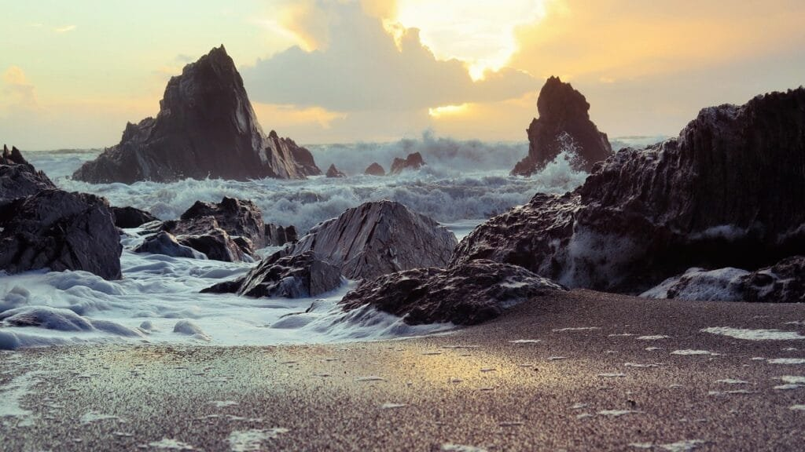
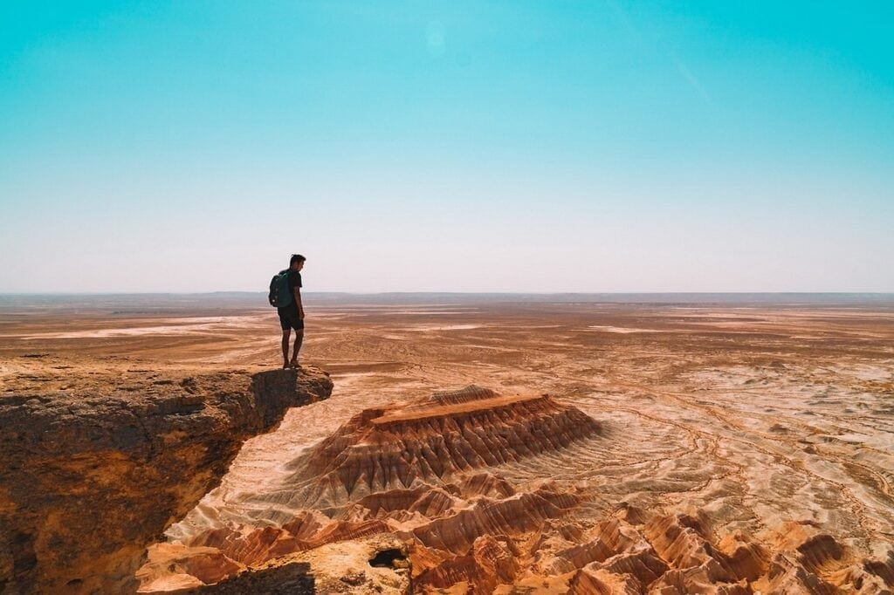

Imagine diving deep into the vast, mysterious depths of the ocean where a hidden world silently exists. Submarine volcanoes, with their explosive bursts of molten rock and ash, reveal the fiery nature of our planet's undersea landscape. From the depths of the Pacific Ocean's Ring of Fire to the secluded corners of the deep, these enigmatic volcanic wonders shape our planet in ways we are only beginning to understand. In this article, we will explore the secrets of submarine volcanoes, uncovering their locations, eruption patterns, and the impact they have on our planet. Get ready to embark on a fascinating journey into the heart of these underwater giants.

This image is property of pixabay.com.

## Understanding the Nature of Submarine Volcanoes

Submarine volcanoes, also known as underwater volcanoes, are fascinating geological features that form beneath the ocean's surface. They possess distinctive characteristics that set them apart from their terrestrial counterparts. Understanding the nature of submarine volcanoes is crucial for unraveling the mysteries of our planet's dynamic and ever-changing geology.

### Distinguishing features of submarine volcanoes

Submarine volcanoes have several distinguishing features that differentiate them from land-based volcanoes. One significant feature is their location beneath the ocean. These volcanoes can be found on the seafloor, often at great depths, where they release molten rock, gases, and debris into the surrounding water.

Another characteristic of submarine volcanoes is their unique shapes. Due to the influence of water pressure and the volcanic eruption dynamics, these volcanoes tend to form different shapes compared to their counterparts on land. They can appear as seamounts, underwater mountains, or even flat-topped plateaus known as guyots.

### Methods used to detect submarine volcanoes

Detecting submarine volcanoes presents a significant challenge due to their hidden nature beneath the vast expanse of the ocean. However, scientists have developed various methods to overcome this challenge and identify these submerged volcanic structures.

One commonly used technique is the use of sonar technology. By emitting sound waves and listening for their echoes, researchers can map the seafloor and identify potential submarine volcanoes. Another method involves analyzing the chemical composition of the water, searching for unique signatures of volcanic activity such as high concentrations of certain elements or gases.

### Formation process of submarine volcanoes

Submarine volcanoes are formed through a complex process that involves the interaction of tectonic plates and the underlying mantle. When tectonic plates diverge or converge, magma rises to the surface and forms underwater volcanoes. At divergent plate boundaries, where plates move apart, magma wells up to fill the gap, creating new ocean crust and forming submarine volcanoes. Conversely, at convergent plate boundaries, where plates collide, one plate is forced beneath the other, leading to the formation of volcanic arcs and trenches.

The eruption process of submarine volcanoes begins with the ascent of magma from the Earth's mantle. As the magma rises, it encounters seawater, causing rapid cooling and fragmentation. This interaction produces explosive eruptions characterized by the release of volcanic ash, steam, and gases. Over time, these eruptions build up the volcanic structure, eventually reaching the surface and forming islands or submarine mountains.

## Major Submarine Volcanoes Around the World

The world's oceans host a multitude of submarine volcanoes, each with its own unique characteristics and contributions to the geology of our planet. Identifying and studying these major submarine volcanoes provide valuable insights into Earth's tectonic activity and volcanic dynamics.

### Identification of significant submarine volcanoes

Scientists have identified several significant submarine volcanoes across the globe. The Pacific Ocean, particularly the "Ring of Fire," is known for its abundance of submarine volcanoes. Examples include Axial Seamount off the coast of Oregon, the Kavachi Volcano in the Solomon Islands, and the Kermadec Arc northeast of New Zealand. Other noteworthy submarine volcanic regions include the Mid-Atlantic Ridge, the Mariana Trench in the western Pacific Ocean, and the Pu'u 'O'o Vent off the coast of Hawaii.

### Geographical distribution of submarine volcanoes across the globe

Submarine volcanoes are not confined to specific regions but are distributed extensively across the world's oceans. They occur along major tectonic plate boundaries and hotspots, where volcanic activity is prevalent. The Pacific Ocean, with its geologically active Ring of Fire, is particularly rich in submarine volcanoes. However, these volcanic structures can also be found in other ocean basins, such as the Atlantic, Indian, and Arctic Oceans.

### Unique characteristics of different submarine volcanoes

Each submarine volcano possesses its own unique characteristics, shaped by factors such as magma composition, eruption frequency, and surrounding environmental conditions. Some submarine volcanoes are highly active, experiencing frequent eruptions and releasing large amounts of lava and gases. Others may be dormant or extinct, having ceased eruption activity and become home to diverse marine ecosystems.

Additionally, different types of submarine volcanoes exist, including seamounts, which are extinct underwater volcanoes that do not reach the ocean's surface, and submarine calderas, which are submerged volcanic craters formed by the collapse of the volcano's summit. These distinct characteristics contribute to the overall diversity and complexity of submarine volcanoes worldwide.

This image is property of pixabay.com.

## Tectonic Plates and Submarine Volcanoes

The relationship between tectonic plate movements and submarine volcano formation is a crucial aspect of understanding Earth's dynamic geology. Tectonic activity plays a significant role in influencing the distribution and characteristics of submarine volcanoes.

### Relationship between tectonic plate movements and submarine volcano formation

Submarine volcanoes are intimately linked to tectonic plate movements. When tectonic plates move apart at divergent plate boundaries, magma rises to fill the gap, resulting in the formation of new oceanic crust and submarine volcanoes. Conversely, at convergent plate boundaries, where plates collide, one plate is forced beneath the other in a process called subduction. Subduction zones are often associated with explosive volcanic activity, leading to the formation of volcanic arcs and trenches.

### Discussion on plate boundaries and hotspots

In addition to plate boundaries, hotspots are another significant factor in submarine volcano formation. Hotspots are areas of intense volcanic activity that occur far away from plate boundaries. These anomalies in the Earth's mantle generate a continuous upwelling of magma, resulting in the formation of volcanic hotspots.

Hotspot-related submarine volcanoes, such as those found in Hawaii, exhibit different characteristics from those formed at plate boundaries. They often produce less explosive eruptions and display a more steady and continuous lava flow. The Hawaiian Islands, for example, are a chain of shield volcanoes that owe their formation to the movement of the Pacific tectonic plate over a hotspot.

### Comparison between submarine volcanoes at plate boundaries and those at hotspots

Submarine volcanoes formed at plate boundaries and hotspots have distinct characteristics resulting from the different tectonic processes involved. Those formed at plate boundaries often exhibit explosive eruptions, as the interaction between tectonic plates and subducting crust generates intense heat and pressure. In contrast, hotspots create more effusive volcanism, with lava flows that can span great distances and form large shield volcanoes.

The differences between these two types of submarine volcanoes highlight the complex relationship between tectonic activity and volcanic dynamics. By studying and comparing these variations, scientists can gain valuable insights into the underlying geological mechanisms driving submarine volcano formation.

## Eruption Patterns of Submarine Volcanoes

The eruption patterns of submarine volcanoes offer a fascinating glimpse into the dynamics of underwater volcanic activity. These patterns are influenced by various factors and differ significantly from the eruption patterns of their land-based counterparts.

### Overview of submarine volcano eruption patterns

Submarine volcano eruptions can be broadly classified into two categories: explosive eruptions and effusive eruptions. Explosive eruptions are characterized by the sudden release of a large volume of gas and volcanic ash, resulting in violent explosions. This type of eruption can propel volcanic fragments and ash into the water column, creating plumes that can reach the ocean's surface.

Effusive eruptions, on the other hand, involve the steady release of lava, which flows out of the volcano and forms underwater lava flows. Effusive eruptions occur when the magma is relatively low in gas content, allowing it to flow more easily. These eruptions often create lava tubes and pillow lavas, unique geological formations commonly found in submarine volcanic environments.

### Factors affecting eruption patterns

Several factors influence the eruption patterns of submarine volcanoes. The composition and viscosity of the magma play a significant role in determining whether an eruption will be explosive or effusive. Magma with high gas content and high viscosity is more likely to produce explosive eruptions, while magma with low gas content and low viscosity tends to result in effusive eruptions.

Other factors, such as the depth of the water above the volcano and the geometry of the vent, also influence eruption patterns. Deeper water can increase the pressure on the magma, leading to more explosive eruptions. The shape and size of the vent can affect the way volcanic material is ejected, potentially influencing the eruption style.

### How submarine volcano eruptions differ from land-based volcano eruptions

Submarine volcano eruptions differ significantly from land-based volcano eruptions due to the presence of water. The water column exerts tremendous pressure on the magma, which can affect the eruption dynamics. The rapid cooling of magma upon contact with water can cause fragmentation, leading to the formation of volcanic ash and the release of gases. This process often results in explosive eruptions and the formation of characteristic eruption plumes.

Additionally, the water surrounding submarine volcanoes can act as a medium for the propagation of shockwaves generated by explosions, enhancing their destructive potential. The interaction between volcanic material and water can also lead to the formation of unique geological structures, such as pillow lavas and hydrothermal vents, which are not typically found in land-based volcanic environments.

Understanding these differences is crucial for accurately assessing the risks and hazards associated with submarine volcanic eruptions and their potential impacts on marine ecosystems and human activities.

This image is property of pixabay.com.

## The Role of Lava Viscosity and Gas Content in Submarine Volcanic Eruptions

Lava viscosity and gas content are two critical factors that influence the intensity and behavior of submarine volcanic eruptions. Understanding the role of these factors provides valuable insights into the dynamics of underwater volcanic activity.

### Understanding lava viscosity

Lava viscosity refers to the resistance of molten rock to flow. It is determined by factors such as temperature, chemical composition, and crystal content of the magma. Lava with high viscosity is thick and sticky, making it difficult to flow. In contrast, lava with low viscosity is runny and flows more easily.

Viscosity plays a significant role in determining the behavior of lava during an eruption. High-viscosity lava tends to trap gas bubbles, creating pressure that can lead to explosive eruptions as the gas bubbles expand and escape. Low-viscosity lava, with its ability to flow more freely, typically results in effusive eruptions characterized by the steady release of lava.

### Role of gas content in submarine volcanic eruptions

The gas content of magma plays a crucial role in submarine volcanic eruptions. Magma contains dissolved gases, typically consisting of water vapor, carbon dioxide, sulfur dioxide, and other volatiles. As magma rises towards the surface, the decreasing pressure causes the gas molecules to expand and form bubbles within the magma.

The ability of magma to retain or release gases is influenced by factors such as magma composition and pressure. Magma with a high gas content is more likely to produce explosive eruptions. The rapid ascent of magma and the subsequent decrease in pressure can cause the gas bubbles to expand rapidly, fragmenting the magma and leading to explosive bursts.

In contrast, magma with low gas content is more likely to produce effusive eruptions. With fewer gas bubbles present, the magma can flow more easily, resulting in the formation of lava flows and the gradual release of gases.

### Impacts of lava viscosity and gas content on eruption intensity

The viscosity and gas content of lava have significant implications for the intensity and behavior of submarine volcanic eruptions. High-viscosity lava with a high gas content is more prone to explosive eruptions. As the magma rises towards the surface, the pressure decrease causes the gas bubbles to expand rapidly, leading to violent explosions.

Explosive eruptions can have far-reaching consequences in underwater environments. They can generate eruption plumes that can reach the ocean's surface, dispersing volcanic ash, gas, and other materials over large areas. These explosions can also create pyroclastic flows, which are fast-moving currents of volcanic fragments, hot gases, and ash. These hazards pose a significant threat to marine life, ecosystems, and human activities in the vicinity of the eruption.

In contrast, lava with low viscosity and low gas content tends to produce effusive eruptions, characterized by the steady release of lava flows. While still potentially destructive, effusive eruptions typically do not generate the same level of explosive activity as their high-viscosity counterparts.

Understanding the interplay between lava viscosity, gas content, and eruption intensity is crucial for assessing the hazards and risks associated with submarine volcanic eruptions. It allows scientists and researchers to better predict the behavior of these dynamic volcanic environments and develop strategies to mitigate their potential impacts.

## Impacts of Submarine Volcanic Eruptions

Submarine volcanic eruptions can have a profound impact on marine life, ecosystems, and the geological processes that shape our planet. Exploring the consequences of these eruptions provides a deeper understanding of the far-reaching effects of underwater volcanic activity.

### Effects on marine life and ecosystems

Submarine volcanic eruptions can have both immediate and long-term effects on marine life and ecosystems. The release of volcanic gases, ash, and other materials during an eruption can lead to the depletion of oxygen levels in the water, posing a significant threat to marine organisms. The abrupt changes in water chemistry can also affect the pH levels, leading to ocean acidification and further endangering sensitive marine species.

However, submarine volcanic eruptions also contribute to the creation of unique habitats and support the establishment of vibrant ecosystems. Volcanic material ejected during eruptions can provide a source of nutrients for marine organisms, promoting the growth of phytoplankton and other primary producers. These flourishing ecosystems, in turn, attract a diverse array of marine life, including fish, coral reefs, and deep-sea creatures.

### Influence on sea temperature and chemistry

Submarine volcanic eruptions can have a profound influence on the surrounding sea temperature and chemistry. The release of hot magma and volcanic fluids can significantly raise the temperature of the water, altering the local marine environment. This sudden increase in temperature can have direct impacts on marine organisms, leading to stress, displacement, or even death.

Moreover, the release of volcanic gases, such as sulfur dioxide, can contribute to changes in atmospheric and oceanic chemistry. These gases can react with water vapor in the atmosphere, forming sulfuric acid and other compounds. When these compounds are deposited back into the ocean, they can impact the pH levels, adding to the process of ocean acidification.

### Potential contribution to the formation of new land masses

Submarine volcanic eruptions play a crucial role in the creation of new land masses. As volcanic material is deposited layer by layer over time, it can accumulate and eventually rise above sea level, forming new islands, archipelagos, and volcanic landforms. The Hawaiian Islands, for example, are a result of countless submarine volcanic eruptions over millions of years.

This ongoing process of volcanic activity and land formation contributes to the ever-evolving geography of our planet. It highlights the significance of submarine volcanoes as agents of change, shaping the land and sea in intricate and dynamic ways.

## Hazards Posed by Submarine Volcanoes

Submarine volcanoes pose numerous hazards and risks to human populations, marine ecosystems, and the infrastructure that supports maritime activities. Understanding these hazards is vital for ensuring the safety and well-being of coastal communities and those engaged in marine endeavors.

### Seismic activities associated with submarine volcanoes

Submarine [volcanoes are often associated with seismic activities](https://magmamatters.com/the-art-and-science-of-volcano-monitoring/ "The Art and Science of Volcano Monitoring"), including earthquakes and tremors. These seismic events can occur as a result of magma movements, tectonic plate interactions, or the collapse of volcanic structures. Seismic activities can trigger secondary hazards such as landslides, tsunamis, and underwater avalanches.

### Risk of triggering tsunamis

One of the most significant hazards presented by submarine volcanoes is the risk of triggering tsunamis. Volcanic eruptions can generate massive volumes of water and material, causing a sudden displacement of the ocean's surface. These displacements can propagate across the ocean, resulting in the formation of large and destructive tsunamis.

Tsunamis generated by submarine volcanic eruptions can travel long distances, posing a significant threat to coastal communities far from the eruption site. The devastating 1883 eruption of Krakatoa in Indonesia, for example, triggered a series of tsunamis that claimed thousands of lives and caused widespread damage to coastal areas.

### Threats to shipping and navigation

Submarine volcanoes can also pose a threat to shipping and navigation. The sudden emergence of volcanic islands or the formation of temporary shoals and sandbars can create navigational hazards for vessels, increasing the risk of collisions and grounding. Additionally, the release of volcanic ash and gases during eruptions can impair visibility, making maritime operations challenging and potentially dangerous.

Efforts to mitigate these hazards include the use of advanced monitoring technologies to detect signs of volcanic activity, improved mapping of the seafloor to identify potential hazards, and effective communication systems to disseminate timely warnings to affected areas. Understanding the risks associated with submarine volcanoes allows authorities and communities to implement appropriate measures to protect lives and infrastructure.

## Benefits of Submarine Volcanoes

While submarine volcanoes present numerous hazards, they also provide several benefits to the planet and its ecosystems. These benefits contribute to the intricate balance of Earth's natural systems and play a vital role in sustaining life both above and below the water's surface.

### Nutrient enrichment of the ocean

Submarine volcanic eruptions play a crucial role in nutrient enrichment of the ocean. The release of volcanic gases and materials introduces essential elements such as nitrogen, phosphorus, and iron into the marine environment. These nutrients, in turn, support the growth of phytoplankton and other primary producers, forming the base of the marine food chain.

The increased productivity resulting from submarine volcanic eruptions provides a vital food source for marine organisms, supporting fish populations, coral reefs, and other marine ecosystems. It also contributes to the overall health and stability of the ocean's ecosystem, ensuring the survival and well-being of countless species.

### Contribution to Earth's heat balance

Submarine volcanoes play a significant role in the Earth's heat balance. The release of heat from volcanic activity warms the surrounding oceanic waters. This process has important implications for ocean currents, influencing global climate patterns and weather systems.

The heating of the ocean through submarine volcanic activity can contribute to the creation and intensification of oceanic currents, such as the Gulf Stream and the Kuroshio Current. These currents play a crucial role in redistributing heat around the planet, impacting weather conditions and climate patterns on a global scale.

### Creation of valuable mineral deposits

Submarine volcanic eruptions can contribute to the formation of valuable mineral deposits. The release and accumulation of volcanic material, such as lava, ash, and hydrothermal fluids, can lead to the creation of mineral-rich environments. These environments can host deposits of minerals such as gold, silver, copper, and manganese, which have significant economic and industrial value.

Exploration and exploitation of these mineral deposits provide valuable resources for various industries, including mining, manufacturing, and technology. Furthermore, the study of submarine volcanic environments and their associated mineral deposits contributes to our understanding of geological processes and aids in the development of sustainable mining practices.

## Study and Exploration of Submarine Volcanoes

The study and exploration of submarine volcanoes are critical for advancing our understanding of Earth's geology and its dynamic processes. However, conducting research in underwater volcanic environments presents unique challenges that require specialized technologies and methodologies.

### Challenges in studying submarine volcanoes

Studying submarine volcanoes poses significant challenges due to their remote and inaccessible locations. The vast expanse of the ocean presents logistical difficulties in reaching and observing these submerged volcanic structures. The extreme pressures and temperatures at severe depths add another layer of complexity to scientific investigations.

Scientists face difficulties in collecting reliable and high-quality data, conducting in situ observations, and analyzing samples. Deploying instruments and sensors at great depths requires advanced technology and engineering expertise. However, despite these challenges, advancements in underwater exploration have enabled researchers to delve into the mysterious world of submarine volcanoes and unravel their secrets.

### Technologies used in exploration

Technological advancements have played a crucial role in the exploration of [submarine volcanoes](https://magmamatters.com/geothermal-energy-and-its-volcanic-origins/ "Geothermal Energy and Its Volcanic Origins"). Remotely operated vehicles (ROVs) and autonomous underwater vehicles (AUVs) are essential tools in conducting observations, collecting seafloor samples, and imaging volcanic features. These vehicles allow scientists to access the depths of the ocean with precision and gather data that would otherwise be challenging to obtain.

Sonar technology and multibeam bathymetry enable researchers to survey large areas of the seafloor and create detailed maps with high resolution. These maps provide valuable insights into the distribution and characteristics of submarine volcanoes. Additionally, seafloor observatories equipped with various sensors and instruments allow continuous monitoring of volcanic activity and the collection of real-time data.

### Significant discoveries and breakthroughs made through submarine volcano research

Research on submarine volcanoes has led to significant discoveries and breakthroughs in our understanding of Earth's geology and volcanic processes. Observations of submarine volcanic eruptions have provided valuable data on eruption dynamics, plume formation, and the relationship between magma properties and eruption styles.

Studies of hydrothermal vents associated with submarine volcanoes have revealed unique ecosystems teeming with vibrant and diverse life forms. These ecosystems, reliant on chemosynthesis rather than photosynthesis, have expanded our understanding of the potential for life in extreme environments and the origins of life on Earth.

The study of submarine volcanoes has also provided critical insights into the interplay between geological activity and climate. By understanding the role of volcanic eruptions in heat transfer and oceanic circulation, scientists have made significant advancements in climate modeling and the prediction of long-term climate variations.

## Future of Submarine Volcano Research

As technology continues to advance, the future of submarine volcano research holds great promise for further unraveling the secrets of these enigmatic geological features. By expanding our knowledge and applying innovative methodologies, we can gain a more comprehensive understanding of Earth's dynamic processes.

### Predicting future volcanic activity based on current understanding

Advances in data collection, monitoring systems, and predictive modeling have allowed scientists to make strides in forecasting and predicting volcanic activity. By analyzing trends, monitoring subtle changes in volcanic behavior, and using cutting-edge algorithms, researchers can develop models to estimate the likelihood and intensity of future eruptions.

Developing effective prediction models for submarine volcanic eruptions is crucial for mitigating risks to coastal populations and maritime activities. Continued research and advancements in technology will enhance our capability to anticipate these events and improve warning systems, saving lives, and minimizing economic and environmental impacts.

### Potential advancements in research technology

The future of submarine volcano research will likely see further advancements in technology and methodologies, enabling scientists to explore these submerged volcanic structures with greater accuracy and precision. Improved underwater mapping and imaging capabilities will provide higher resolution and more detailed images of submarine volcanoes, enhancing our understanding of their unique formations and eruption processes.

Additionally, advances in remote sensing and satellite technology will allow for the continuous monitoring of volcanic activity from space. This will provide valuable real-time data and observation capabilities for detecting early signs of volcanic unrest and facilitating timely warnings.

### Possible mitigation strategies for hazards posed by submarine volcanoes

As our understanding of submarine volcanoes deepens, efforts can be made to develop and implement mitigation strategies to minimize the risks and hazards associated with these underwater volcanic eruptions. Continual refinement of eruption prediction models, enhanced early warning systems, and improved communication networks will be vital in safeguarding vulnerable coastal populations and marine activities.

Collaboration between scientists, engineers, and policymakers can lead to the development of comprehensive contingency plans for areas prone to submarine volcanic eruptions. These plans may involve evacuation procedures, zoning regulations, and the establishment of international cooperation networks to ensure effective response and mitigation in the event of a volcanic crisis.

In conclusion, the study of submarine volcanoes continues to expand our knowledge of Earth's dynamic geology and its impact on our planet's ecosystems and climate. Through ongoing research, technological advancements, and international collaboration, scientists are poised to unravel the remaining mysteries of these hidden marvels. With a comprehensive understanding of submarine volcanoes, we can better predict future volcanic activity, mitigate risks, and harness the benefits these fascinating geological features provide.

