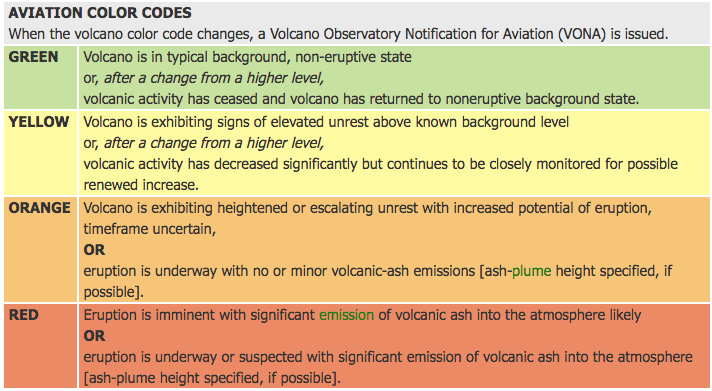
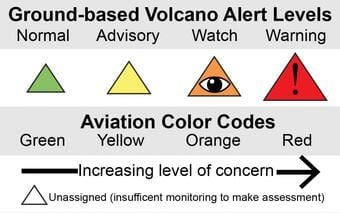
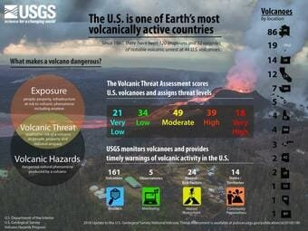
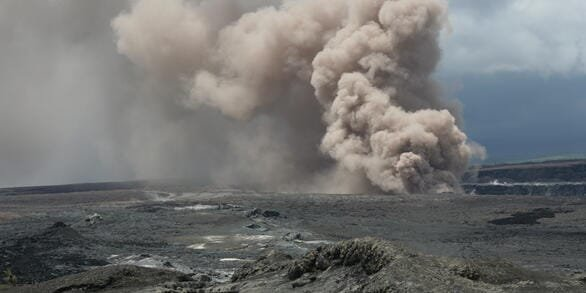
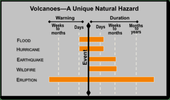

Looking to stay updated on the latest volcano activity? Look no further than the Volcano Hazards Program. This program provides comprehensive updates and notifications on volcano activity, including the current status of several prominent volcanoes such as Gareloi, Great Sitkin, Shishaldin, Kilauea, and Ahyi Seamount. The program utilizes a range of monitoring methods, including seismic sensors, web cameras, satellite data, and infrasound networks, to track volcanic activity and keep the public informed. In addition, the California Volcano Observatory and the Cascades Volcano Observatory provide reports on normal background earthquake activity and ground movement for monitored volcanoes in their respective regions. The Hawaiian Volcano Observatory also offers valuable information, reporting low to moderate rates of seismicity for Kilauea volcano, which is not currently erupting. Ground deformation and gas emissions are carefully monitored as well, serving as important indicators of volcanic activity. Stay informed and stay safe with the Volcano Hazards Program.

<iframe width="560" height="315" src="https://www.youtube.com/embed/Z-w_z9yobpE" frameborder="0" allow="accelerometer; autoplay; encrypted-media; gyroscope; picture-in-picture" allowfullscreen></iframe>

  

## Overview of The Volcano Hazards Program

The Volcano Hazards Program plays a crucial role in providing updates and notifications concerning volcano activity observed by various volcano observatories. With the aim of keeping the public informed and safe, this program collaborates with volcano observatories to continuously monitor and assess volcanic hazards. By monitoring a multitude of factors, such as seismic activity, ground deformation, and gas emissions, accurate and timely information is provided to help individuals and communities make informed decisions regarding volcanic threats.

## Purpose and function of The Volcano Hazards Program

The primary purpose of The Volcano Hazards Program is to mitigate the risks associated with volcanic activity. This is achieved through a multifaceted approach that involves monitoring, research, hazard assessments, and public outreach. By working closely with volcano observatories, the program is able to gather data and analyze it to determine the current status of monitored volcanoes. This information is crucial in order to provide accurate updates and notifications to the public, ensuring that they have the necessary information to make informed decisions and take appropriate actions.

## Collaboration with volcano observatories

The Volcano Hazards Program collaborates with volcano observatories around the world to gather data on volcanic activity. These observatories are responsible for monitoring specific volcanoes within their regions and providing timely information to The Volcano Hazards Program. By combining the expertise and resources of these observatories, a comprehensive and global perspective on volcanic hazards is attained. This collaborative approach allows for a more effective response to volcanic events, as it brings together the knowledge and experience of scientists and professionals from various regions.

## Volcano Status Updates and Notifications

The Volcano Hazards Program provides regular updates and notifications on the status of monitored volcanoes. These updates are essential in order to keep the public informed about any changes or potential hazards associated with volcanic activity. The frequency of these updates varies depending on the level of volcanic activity and the potential risks involved.

This image is property of d9-wret.s3.us-west-2.amazonaws.com.

## Frequency of updates and notifications

The frequency of updates and notifications depends on the level of volcanic activity and the potential risks to surrounding communities. In the case of an active volcano with ongoing eruptions, updates and notifications may be provided multiple times a day or even in real-time. However, for volcanoes that are currently dormant or have a low level of activity, updates may be less frequent, typically occurring on a weekly or monthly basis.

## How to receive updates and notifications

To receive updates and notifications from The Volcano Hazards Program, there are several channels available. The program utilizes various communication methods, including email subscriptions, social media platforms, and mobile applications. By signing up for these services, individuals can receive timely alerts and updates directly to their devices. Additionally, the program's website serves as a valuable resource, providing comprehensive information on volcanic activity, monitoring methods, and safety measures.

## Specific Volcano Status Descriptions

The Volcano Hazards Program provides detailed status descriptions for several monitored volcanoes. These descriptions give an overview of the current activity, potential hazards, and any ongoing monitoring efforts. Some of the volcanoes for which status descriptions are available include Gareloi, Great Sitkin, Shishaldin, Kilauea, and Ahyi Seamount.

## Current status of Gareloi volcano

At present, the Gareloi volcano is exhibiting low levels of activity. While there is no immediate threat of eruption, it is still being closely monitored by volcano observatories. This continuous monitoring allows for early detection of any changes in volcanic activity, ensuring that the appropriate authorities can issue timely warnings and advisories if necessary. It is important for residents and visitors in the vicinity to stay informed and heed any instructions or recommendations provided by local authorities.

This image is property of d9-wret.s3.us-west-2.amazonaws.com.

## Current status of Great Sitkin volcano

The Great Sitkin volcano is currently experiencing a heightened level of activity, which is being closely monitored by volcano observatories. This increased activity may indicate an elevated risk of eruption, and as a result, the public is advised to exercise caution and stay updated on the latest information and advisories. The Volcano Hazards Program is working closely with the observatories to monitor the volcano's activity, and any significant changes will be promptly communicated to the public. It is essential for individuals living near the Great Sitkin volcano to have a plan in place in case of a volcanic event and to be aware of evacuation routes and other safety measures.

## Current status of Shishaldin volcano

The Shishaldin volcano is currently experiencing a moderate level of activity. This ongoing activity is being closely monitored by the volcano observatories, and regular updates are provided to the public. While the current level of activity does not pose an immediate threat to surrounding areas, it is crucial for individuals in the vicinity to stay informed and prepared. Volcanic conditions can change rapidly, and being aware of any updates or advisories is vital for personal safety. The Volcano Hazards Program encourages residents and visitors to follow the instructions and recommendations of local authorities and to have a personal emergency plan in place.

## Current status of Kilauea volcano

The Kilauea volcano, located in Hawaii, is currently experiencing low levels of activity and is not erupting. The Hawaiian Volcano Observatory closely monitors the seismicity rates and other indicators of volcanic activity, providing regular updates on the volcano's status. While there is no immediate danger, it is crucial to remain vigilant and stay informed about any changes in volcanic activity. The Volcano Hazards Program advises residents and visitors to familiarize themselves with the appropriate safety measures and to be prepared in the event that volcanic activity increases.

## Current status of Ahyi Seamount

Ahyi Seamount, located in the western Pacific Ocean, is currently showing no signs of volcanic activity. The Volcano Hazards Program, in collaboration with the observatory responsible for monitoring the seamount, continuously monitors for any changes or potential hazards. While the current status indicates no immediate risk, it is important for individuals in the area to stay informed and follow the guidance provided by local authorities. By remaining aware of any updates or changes, individuals can be better prepared for potential volcanic events.

This image is property of d9-wret.s3.us-west-2.amazonaws.com.

## Monitoring Methods

The Volcano Hazards Program employs a range of monitoring methods to gather data and assess volcanic hazards. These methods include the use of seismic sensors, web cameras, satellite data, and infrasound networks. Through the integration of these different monitoring techniques, the program is able to gather a comprehensive and detailed understanding of volcanic activity.

## Use of seismic sensors in monitoring

Seismic sensors play a crucial role in monitoring volcanic activity. These sensors are strategically placed around volcanoes to detect and record any ground vibrations or seismic events. By analyzing the data collected from these sensors, scientists can gain valuable insights into the behavior and internal processes of volcanoes. Seismic activity is a key indicator of volcanic unrest and can help identify potential eruption precursors. The data gathered from seismic sensors is continuously monitored and analyzed by volcano observatories, enabling them to provide timely updates and notifications to the public.

## Use of web cameras in monitoring

Web cameras are an important tool in monitoring volcanic activity. These cameras are strategically placed near volcanoes to provide real-time visual observations of the eruptive activity. By continuously monitoring the live video feeds from these cameras, volcanic observatories can gather valuable information about the intensity and type of volcanic eruptions. Web cameras also allow scientists to visually assess the impact of volcanic activity on surrounding areas, including the emission of gases and ash plumes. The visual data captured by web cameras provides a valuable additional layer of information in assessing and understanding volcanic hazards.

## Use of satellite data in monitoring

Satellite data is another valuable tool used in monitoring volcanic activity. Satellites equipped with specialized sensors can detect various volcanic phenomena, such as thermal anomalies associated with lava flows or changes in gas emissions. By analyzing the satellite data, scientists can track the movement and extent of volcanic plumes, as well as identify potential hazards, such as lahars or pyroclastic flows. Satellite data provides a unique perspective on volcanic activity, allowing for a broader understanding of the behavior and impacts of volcanoes.

This image is property of d9-wret.s3.us-west-2.amazonaws.com.

## Use of infrasound networks in monitoring

Infrasound networks consist of multiple microbarometers strategically placed in different locations around a volcano. These instruments can detect low-frequency sound waves generated by volcanic eruptions that are outside the range of human hearing. By analyzing the data collected from the infrasound network, scientists can determine the intensity and direction of the volcanic explosions. This information is crucial in assessing the potential hazards associated with volcanic eruptions, such as ash fall or ballistic projectiles. Infrasound networks provide an additional layer of monitoring that enhances the accuracy and effectiveness of volcano hazard assessments.

## California Volcano Observatory Reports

The California Volcano Observatory plays a vital role in monitoring and assessing volcanic activity within the state. The observatory provides regular reports on background earthquake activity and ground movement for the monitored volcanoes in California. These reports serve as critical resources for scientists, emergency management agencies, and the public, as they provide valuable insights into the current conditions of the monitored volcanoes.

## Background earthquake activity for monitored volcanoes

The California Volcano Observatory closely monitors the seismic activity associated with the monitored volcanoes in California. Background earthquake activity refers to the regular seismic events that occur in and around volcanoes, even during periods of relative quiescence. By analyzing earthquake data, scientists can detect any changes or anomalies that may indicate an increase in volcanic activity. This data allows for a better understanding of volcanic processes and aids in the prediction and mitigation of potential hazards.

## Ground movement reports for monitored volcanoes

Ground movement reports are another important component of the California Volcano Observatory's updates. These reports provide information on any changes in ground deformation associated with the monitored volcanoes. Ground deformation can occur due to several factors, including magma movement or the release of volcanic gases. By monitoring and analyzing ground movement data, scientists can gain insights into the dynamic processes occurring beneath the Earth's surface. Ground movement reports are crucial in assessing the current state of monitored volcanoes and determining if any significant changes warrant further investigation or action.

This image is property of d9-wret.s3.us-west-2.amazonaws.com.

## Cascades Volcano Observatory Reports

The Cascades Volcano Observatory focuses on monitoring and assessing volcanic activity within the Cascade Range. The observatory provides regular reports on the background activity levels of the monitored volcanoes in this region. These reports serve as important references for scientists, emergency management agencies, and the public, contributing to a better understanding of the volcanic hazards in the Cascade Range.

## Background activity levels for monitored volcanoes

The background activity levels reported by the Cascades Volcano Observatory provide a baseline for assessing volcanic activity in the Cascade Range. These levels are based on a combination of data, including seismic activity, gas emissions, ground deformation, and visual observations. By comparing current observations to the established background levels, scientists can assess whether the volcanoes are experiencing an increase or decrease in activity. This information is crucial in determining the potential hazards associated with the monitored volcanoes and providing the public with accurate and timely updates.

## Hawaiian Volcano Observatory Reports

The Hawaiian Volcano Observatory is responsible for monitoring and assessing volcanic activity in Hawaii. The observatory provides regular reports on the seismicity rates and eruption status of Kilauea volcano, one of the most active volcanoes in the world.

## Seismicity rates for Kilauea volcano

The Hawaiian Volcano Observatory closely monitors the seismicity rates associated with Kilauea volcano. By analyzing seismic data, scientists can detect any changes or anomalies that may indicate an increase in volcanic activity. Seismicity rates provide valuable insights into the behavior of the volcano and help scientists understand the processes occurring beneath the Earth's surface. The information gathered from seismic monitoring informs the public on the current state of Kilauea volcano and aids in the assessment of potential hazards.

## Current eruption status for Kilauea volcano

The eruption status of Kilauea volcano is a key focus of the Hawaiian Volcano Observatory's reports. By continuously monitoring the volcano's activity, scientists can provide accurate and timely updates on its eruption status. As of the latest reports, Kilauea volcano is not currently erupting. However, it is crucial to remain vigilant and stay informed about any changes in volcanic activity. The observatory closely monitors the volcano's seismicity rates and conducts regular assessments to ensure the public's safety.

## Other Indicators of Volcanic Activity

Monitoring ground deformation and gas emissions are essential indicators of volcanic activity. These data help scientists assess the behavior and potential hazards associated with monitored volcanoes.

## Monitoring of ground deformation

Ground deformation refers to any changes in the shape or elevation of the Earth's surface near volcanoes. This deformation can occur due to magma movement, the release of volcanic gases, or other volcanic processes. By continuously monitoring and analyzing ground deformation data, scientists can gain insights into the underlying volcanic processes. These observations are crucial in assessing the current state of monitored volcanoes and determining if any significant changes warrant further investigation or action.

## Monitoring of gas emissions

Volcanoes release various gases, including [sulfur dioxide and carbon](https://magmamatters.com/the-art-and-science-of-volcano-monitoring/ "The Art and Science of Volcano Monitoring") dioxide, during periods of volcanic activity. These gas emissions serve as important indicators of volcanic unrest and can provide insights into the intensity and potential hazards associated with eruptions. By continuously monitoring and analyzing gas emission data, scientists can better understand the behavior of volcanoes and provide accurate assessments of potential hazards. Observations of gas emissions also contribute to the development of early warning systems, allowing for timely notifications to be issued to the public.

## Public Outreach and Education

The Volcano Hazards Program recognizes the importance of public outreach and education in promoting understanding and preparedness for volcanic events. The program provides valuable resources and information to help individuals and communities better comprehend volcanic hazards and take appropriate actions.

## What the public should know about volcanoes

The public should have a basic understanding of volcanoes to be better prepared for potential hazards. This includes knowledge about volcanic processes, types of eruptions, and potential hazards associated with volcanic activity. By educating the public on these topics, the Volcano Hazards Program aims to empower individuals to make informed decisions and take appropriate actions to protect themselves and their communities.

## How to prepare for a volcanic eruption

Preparation is key when it comes to volcanic eruptions. The Volcano Hazards Program emphasizes the importance of having a preparedness plan in place. This includes being aware of evacuation routes, assembling essential supplies like food and water, and having a communication plan to stay updated on the latest information. Additionally, individuals should familiarize themselves with the warning signs and evacuation procedures specific to their region. By taking these proactive steps, individuals can minimize the risks and potential impacts of volcanic eruptions.

## Post-eruption safety measures

After a volcanic eruption, it is crucial to prioritize safety measures. The Volcano Hazards Program provides guidance on post-eruption safety, including precautions such as avoiding areas with ashfall, wearing protective gear, and monitoring the air quality for potential health risks. Additionally, individuals should be aware of the potential for secondary hazards, such as lahars and landslides, which can occur in the aftermath of volcanic eruptions. By following these safety measures, individuals can mitigate the risks and ensure their well-being in the aftermath of volcanic events.

## Upcoming Technological Advancements

The Volcano Hazards Program is constantly striving to enhance monitoring methods and improve the frequency and accuracy of updates and notifications. Technological advancements play a crucial role in achieving these goals.

## Future improvements in monitoring methods

Advancements in technology are expected to enhance monitoring methods by providing more precise and real-time data. New sensor technologies may allow for improved detection and analysis of seismic activity, ground deformation, gas emissions, and other indicators of volcanic activity. Additionally, advancements in satellite technology can provide higher-resolution imagery, enabling scientists to gather more detailed information about volcanic processes. The Volcano Hazards Program is actively involved in research and development efforts to explore these advancements and implement them to enhance the monitoring capabilities.

## Influence of technology on the frequency and accuracy of updates and notifications

Technology has already played a significant role in improving the frequency and accuracy of updates and notifications from the Volcano Hazards Program. With the use of email subscriptions, social media platforms, and mobile applications, the program can reach a wider audience with real-time or near-real-time updates. This allows for more timely and accurate information dissemination to the public. As technology continues to advance, these methods are expected to become more refined, enabling the program to provide even quicker and more accurate updates and notifications. By harnessing the power of technology, the Volcano Hazards Program aims to maximize public safety and minimize the impacts of volcanic events.

In conclusion, The Volcano Hazards Program serves a vital role in monitoring and providing updates on volcanic activity to ensure public safety. By collaborating with volcano observatories, employing various monitoring methods, and utilizing technological advancements, the program delivers accurate and timely information to the public. Through public outreach and education, individuals and communities are empowered to understand volcanic hazards and take appropriate preparedness and safety measures. With ongoing advancements in technology and improvements in monitoring methods, the program continues to enhance the frequency and accuracy of updates and notifications, further enhancing public safety and resilience in the face of volcanic events.
