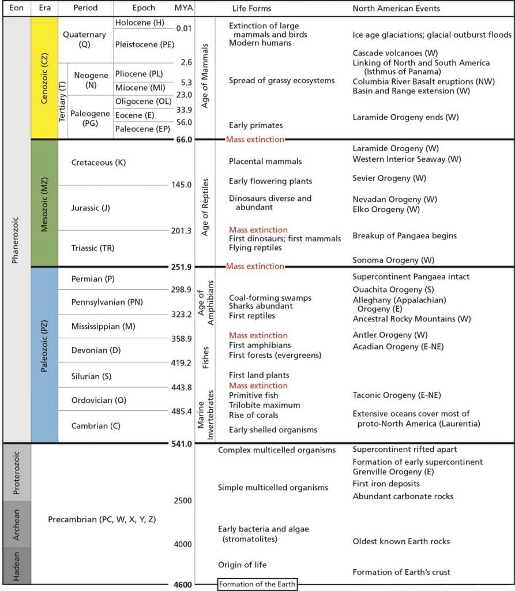

Volcanic eruptions have played a significant role in shaping the geological time scales of our planet. When molten rock, gases, and debris escape to the earth's surface, these eruptions can result in the formation of volcanic mountains. Volcanoes occur in various locations, such as along plate boundaries, hotspots under the earth's crust, or rift zones where tectonic plates are moving apart. They exhibit different eruption patterns depending on factors like lava viscosity and gas content. While volcanic eruptions can provide nutrients to soil, they also pose significant hazards to surrounding communities. Understanding the intricacies of volcanoes is crucial in predicting future volcanic activity and mitigating risks. By exploring the types of volcanoes, their distribution, eruption causes, hazards, and benefits, we can gain a deeper understanding of the profound impact that [volcanoes have on our geological](https://magmamatters.com/geothermal-energy-and-its-volcanic-origins/ "Geothermal Energy and Its Volcanic Origins") time scales. So, why exactly do volcanoes shape these time scales? Let's find out.

This image is property of www.universetoday.com.

## Understanding Volcanoes

Volcanoes, these powerful and awe-inspiring [natural phenomena](https://magmamatters.com/the-art-and-science-of-volcano-monitoring/ "The Art and Science of Volcano Monitoring"), have captivated human curiosity for centuries. In order to fully grasp their significance and impact, it is important to gain an understanding of their formation, types, geographic distribution, and the various factors that contribute to their eruption patterns.

### Formation of Volcanoes

Volcanoes are born from the depths of the Earth, where molten rock, gases, and debris, collectively known as magma, rise to the surface. This movement is driven by the intense heat and pressure exerted by the Earth's mantle. As the magma breaches the surface through vents and openings, volcanic eruptions occur, releasing lava and ash into the air.

### Types of Volcanoes

There are several types of volcanoes, each with its own distinct characteristics. Shield volcanoes, commonly found in places like Hawaii, are formed by the gradual accumulation of fluid lava flows, resulting in broad and gently sloping structures. Stratovolcanoes, on the other hand, are tall and steep-sided volcanoes composed of alternating layers of lava and pyroclastic material. Other types include [cinder cones](https://magmamatters.com/the-birth-of-new-land-understanding-cinder-cones/), which form from ejected lava fragments, and calderas, which result from the collapse of a volcano's summit following a massive eruption.

### Geographic Distribution of Volcanoes

Volcanoes are not evenly distributed across the globe. They tend to occur in specific regions, often associated with tectonic plate boundaries. The "Ring of Fire," encircling the Pacific Ocean, is a prime example of a volcanic hotspot. This area is prone to volcanic activity due to the convergence of several tectonic plates. Other volcanic regions include the Mid-Atlantic Ridge and the East African Rift Zone. Understanding the geographic distribution of volcanoes allows scientists to study and monitor potential eruption sites.

## Causes of Volcanic Eruptions

Understanding what triggers volcanic eruptions is crucial for assessing the potential hazards and risks associated with these natural phenomena. Volcanic eruptions can be influenced by tectonic plate movements, volcanic hot spots, and the presence of rift zones.

### Tectonic Plate Movements

One of the primary causes of volcanic eruptions is the movement of tectonic plates. When two tectonic plates converge, one is forced beneath the other, creating a subduction zone. As the descending plate sinks deeper into the mantle, it undergoes intense heat and pressure, causing melting and the generation of magma. This magma eventually rises to the surface, leading to volcanic activity.

### Volcanic Hot Spots

Volcanic hot spots are another significant factor in eruption causation. Hot spots are areas where plumes of hot mantle material rise towards the Earth's surface, independent of tectonic plate boundaries. This upwelling of hot material results in the formation of volcanic activity. Examples of volcanic hot spots include the Hawaiian Islands, the Yellowstone Caldera in the United States, and Iceland.

### Rift Zones and Volcanic Activity

Rift zones, where the Earth's tectonic plates are moving apart, can also be sites of volcanic activity. As the plates separate, magma rises to fill the void, creating a volcanic system along the rift. The East African Rift Zone is a well-known example of this type of volcanic activity. Rift zones can lead to the formation of new land as magma erupts and cools, gradually expanding the Earth's surface.

<iframe width="560" height="315" src="https://www.youtube.com/embed/rWp5ZpJAIAE" frameborder="0" allow="accelerometer; autoplay; encrypted-media; gyroscope; picture-in-picture" allowfullscreen></iframe>

  

## Patterns of Volcanic Eruptions

Volcanic eruptions can display various patterns, depending on factors such as the viscosity of the lava and the gas content within the magma. Understanding these patterns is crucial for predicting volcanic activity and implementing appropriate risk mitigation strategies.

### Factors Influencing Eruption Patterns

Several factors influence the patterns of volcanic eruptions. Lava viscosity plays a significant role, with more viscous lava leading to more explosive eruptions due to gas build-up. The gas content within the magma can also contribute to eruption patterns, as higher gas content can result in more violent explosions. Additionally, the presence of water, either from underground sources or interaction with nearby bodies of water, can lead to explosive phreatomagmatic eruptions.

### Different Types of Eruptions and Their Characteristics

Volcanic eruptions can manifest in various ways. Some eruptions produce explosive pyroclastic flows, which consist of a mixture of volcanic ash, rock fragments, and gases. These flows can devastate surrounding areas and pose a significant threat to human life and infrastructure. Other eruptions may be less explosive, resulting in the steady release of lava flows. These effusive eruptions can still cause damage but are generally less explosive than pyroclastic eruptions.

## Hazards of Volcanic Eruptions

While volcanoes have the potential to shape landscapes and provide benefits, they also pose significant hazards to human life, property, and the environment. Understanding these hazards is crucial for developing strategies to mitigate the risks associated with volcanic eruptions.

### Impact on Human Life and Property

Volcanic eruptions can have devastating effects on human life and property. Pyroclastic flows, ash fall, and volcanic gases are all hazards associated with volcanic eruptions that can cause immediate harm or long-term health issues. Additionally, the destruction caused by lava flows and the potential for lahars, which are destructive mudflows triggered by volcanic activity, can result in the displacement of communities and the destruction of infrastructure.

### Impact on Climate

Volcanic eruptions can have a significant impact on the climate, both locally and globally. The release of ash and sulfur dioxide into the atmosphere can cause a decrease in temperatures, as these particles reflect sunlight back into space. This cooling effect can last for months or even years, impacting agriculture, weather patterns, and ecosystems.

### Effect on Air Travel

Volcanic ash poses a significant risk to air travel. The fine particles can damage aircraft engines, leading to engine failure. In the past, volcanic ash clouds have caused the closure of airspace and the cancellation of flights in affected regions. Airports and airlines work closely with volcanic monitoring agencies to ensure the safety of air travel during volcanic eruptions.

This image is property of i0.wp.com.

## Benefits of Volcanic Eruptions

Despite the potential hazards, volcanic eruptions also bring about several benefits. These eruptions can enrich soil with nutrients, contribute to the formation of new land masses, and even boost the tourism industry.

### Enrichment of Soil with Nutrients

The ash produced during volcanic eruptions is rich in minerals and nutrients, such as potassium, phosphorus, and nitrogen. When this ash settles on the ground, it can enhance soil fertility and promote agricultural productivity. Volcanic soils, known as Andisols, are highly fertile and prized for their ability to support robust plant growth.

### Formation of New Land Masses

Volcanic eruptions can create entirely new land masses. As lava flows and cools, it solidifies, gradually forming new land. This process is particularly evident in volcanic island formations, such as the Hawaiian Islands. Over time, the accumulation of volcanic material can result in the creation of diverse and thriving ecosystems.

### Benefits to Tourism Industry

Volcanoes attract visitors from around the world, generating economic benefits for local communities. Volcanic landscapes, with their unique geology and stunning beauty, serve as popular tourist destinations. From hiking trails to hot springs, these areas offer a wide range of activities and experiences for visitors to enjoy.

## Volcanoes and Geological Time Scales

Volcanoes have played a pivotal role in shaping the Earth's geological history. By understanding their impact, scientists can use volcanoes as markers of geological time and gain valuable insights into the Earth's past.

### Role of Volcanic Eruptions in Shaping Geological History

[Volcanic eruptions have helped shape the Earth's geological](https://magmamatters.com/understanding-volcanic-formation-a-comprehensive-guide/ "Understanding Volcanic Formation: A Comprehensive Guide") history by contributing to the formation of land masses, influencing climate patterns, and leaving distinct geological records. The deposits left behind by volcanic eruptions can serve as a record of past volcanic activity and provide clues about the Earth's past environment and the changes it has undergone.

### Markers of Geological Time

Volcanic eruptions can act as important markers of geological time. By dating the rocks and deposits associated with volcanic activity using various dating techniques, scientists can establish a chronology of Earth's history. These markers provide insights into the timing of past geological events and help construct a comprehensive geological time scale.

This image is property of media.springernature.com.

## Understanding Geological Time Scales

To fully comprehend the significance of volcanic eruptions in shaping geological time scales, it is essential to understand the concept of geological time itself. Geological time scales are used to classify and organize Earth's history into distinct divisions and time intervals.

### Definition and Importance of Geological Time Scale

The geological time scale is a framework that allows scientists to divide and categorize Earth history into specific periods, epochs, and ages. By establishing a standardized system, researchers can communicate and interpret geological events and processes across different locations and time periods, fostering a better understanding of Earth's history and the processes that have shaped our planet.

### Divisions of Geological Time Scale

The geological time scale is divided into several divisions, each representing a different span of time. The largest division is the eon, which is further divided into eras. Eras are then subdivided into periods, which are further divided into epochs. This hierarchical structure allows for a detailed classification of Earth's history and provides a common language for scientists to discuss and study geological events. Notable divisions of the geological time scale include the Mesozoic Era, famous for the reign of the dinosaurs, and the Holocene Epoch, which represents the current period in Earth's history.

## Volcanic Eruption Dating Techniques

Determining the age of volcanic eruptions is essential for understanding their timing and correlation with other geological events. Scientists employ various dating techniques, such as radiometric dating, stratigraphic dating, and ice core dating, to establish the ages of volcanic eruptions accurately.

### Radiometric Dating

Radiometric dating is a commonly used technique to determine the age of volcanic rocks and minerals. This method relies on the decay of radioactive isotopes within the volcanic material. By measuring the ratio between parent and daughter isotopes, scientists can calculate the age of the volcanic deposit.

### Stratigraphic Dating

Stratigraphic dating involves examining the layers of rock within which volcanic deposits are found. By studying the relative position of volcanic ash layers within these rock beds, scientists can establish the sequence of eruption events and assign ages to each layer based on known ages of other adjacent layers.

### Ice Core Dating

Ice cores extracted from polar ice sheets and glaciers provide valuable information about past volcanic eruptions. Volcanic ash, gases, and other particles released during eruptions become trapped in the ice layers. By analyzing the chemical composition and layers of the ice core, scientists can establish a chronological record of past volcanic activity.

This image is property of ops-alaska.com.

## How Volcanic Eruptions Shape Geological Time Scales

Volcanic eruptions leave a lasting imprint on geological time scales, acting as critical markers of time and aiding in the correlation of geological events. By dating volcanic deposits and determining their ages accurately, scientists can gain insights into the timing and duration of past geological events.

### Volcanoes as Time Markers

Volcanic eruptions serve as distinctive time markers within the geological record. By identifying volcanic ash layers and volcanic deposits, scientists can correlate these markers across different regions and establish a chronological framework. These volcanic markers allow scientists to compare and sequence geological events and better understand the processes that have shaped the Earth throughout history.

### Correlation Between Volcanic Activity and Geologic Events

Studying volcanic eruptions and their correlation with other geological events can provide crucial insights into the Earth's history. Volcanic eruptions often coincide or contribute to significant geological events, such as mass extinctions or climate shifts. By analyzing the timing and magnitude of volcanic eruptions, scientists can infer connections between volcanic activity and other geological phenomena, advancing our understanding of Earth's complex history.

## Predicting Future Volcanic Activity

One of the primary goals of studying volcanoes is to predict and mitigate the potential hazards associated with future eruptions. Scientists employ various techniques and monitoring strategies to estimate the likelihood and characteristics of volcanic eruptions.

### Techniques for Predicting Volcanic Eruptions

Scientists use a combination of remote sensing, ground-based monitoring, and data analysis to predict volcanic eruptions. Monitoring techniques include measuring changes in volcanic gas emissions, ground deformation, and earthquake activity. Additionally, satellites and remote sensing technologies are used to detect changes in the shape and temperature of volcanoes, providing valuable data for eruption forecasting.

### Risk Mitigation Strategies for Volcanic Hazards

Predicting volcanic eruptions allows communities at risk to implement effective risk mitigation strategies. These strategies can include early warning systems, evacuation plans, and the implementation of safety measures, such as the construction of protective barriers and the development of volcano hazard maps. Public education and awareness programs also play a vital role in ensuring the safety and preparedness of communities living in volcanic regions.

In conclusion, understanding volcanoes is essential for comprehending their formation, eruption causes, patterns, hazards, and benefits. By studying the geological time scales shaped by volcanic activity, scientists gain valuable insights into the Earth's history and the processes that have shaped our planet. Through accurate dating techniques and monitoring strategies, we can predict future volcanic activity, mitigate risks, and ensure the safety of communities living in volcanic regions. Volcanoes continue to provide a captivating window into Earth's dynamic nature, fueling our curiosity and driving scientific exploration forward.

