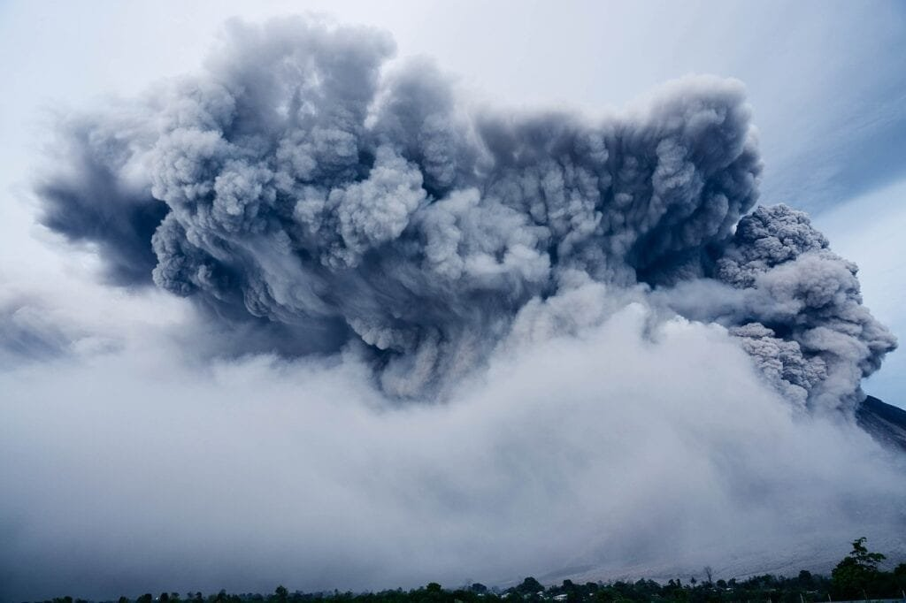

Discover the world beneath our feet and learn about the fascinating natural wonders known as volcanoes. From the powerful eruptions in the notorious "Ring of Fire" to the gradual formation of shield volcanoes in Hawaii, these geological marvels have both captivated and terrified humanity for centuries. In this article, we will delve into the diverse types of volcanoes, their distribution across the globe, the causes behind their eruptions, and the hazards they pose to surrounding communities. By understanding these volcanic forces, we can better prepare for and ensure the safety of those living in their proximity. Join us on this journey as we explore the intriguing world of active volcanoes and discover the measures in place to mitigate their potential risks.

This image is property of pixabay.com.

## Understanding Volcanoes

[Volcanoes are fascinating geological](https://magmamatters.com/geothermal-energy-and-its-volcanic-origins/ "Geothermal Energy and Its Volcanic Origins") features that have captivated human interest for centuries. Understanding the formation and characteristics of volcanoes is key to comprehending their behavior and the potential hazards they pose.

### The formation of volcanoes

Volcanoes are formed when molten rock, gases, and debris escape to the earth's surface, resulting in eruptions of lava and ash. These eruptions occur at sites along plate boundaries, hotspots under the earth's crust, or rift zones where the earth's tectonic plates are moving apart.

For example, the iconic "Ring of Fire," which encircles the Pacific Ocean, is home to numerous volcanoes due to its location atop spots where tectonic plates meet. These converging plate boundaries create intense geological activity, leading to frequent volcanic eruptions.

On the other hand, shield volcanoes, such as those found in Hawaii, form gradually over hotspots deep underground. These volcanoes experience less explosive eruptions and simply allow the molten lava to flow steadily over time.

### Different types of volcanoes and their characteristics

Volcanoes come in various shapes and sizes, each possessing unique characteristics. The three main [types of volcanoes are shield](https://magmamatters.com/understanding-volcanic-formation-a-comprehensive-guide/ "Understanding Volcanic Formation: A Comprehensive Guide") volcanoes, stratovolcanoes (composite volcanoes), and cinder cone volcanoes.

Shield volcanoes are broad and gently sloping, resembling a warrior's shield lying on the ground, hence their name. They are built up by numerous eruptions of fluid lava over time. These volcanoes tend to have non-explosive eruptions, allowing lava to flow freely, sometimes covering vast areas.

Stratovolcanoes, or composite volcanoes, are cone-shaped and composed of layers of hardened lava, ash, and volcanic debris. They have a steeper profile due to their explosive eruptions. These eruptions occur when the viscosity of the lava is higher, trapping gas bubbles, resulting in pressure buildup and explosive releases.

Cinder cone volcanoes are small, steep-sided, and symmetrical. They are formed by explosive eruptions that eject tephra, which solidifies into small volcanic fragments called cinders. These volcanoes typically have short and sporadic eruption periods.

### Geographic distribution of volcanoes

Volcanoes are distributed across the globe, but they are not evenly spread. The majority of volcanoes are concentrated along plate boundaries, especially in the "Ring of Fire" mentioned earlier. This belt stretches from the western coast of the Americas, across the Pacific Ocean, and along the eastern coast of Asia.

Other volcanic regions include the East African Rift, the Mediterranean region, the Caribbean, and the Island Arcs of Indonesia. Volcanoes can also be found underwater, forming seamounts and creating unique ecosystems deep beneath the ocean's surface.

Understanding the geographic distribution of [volcanoes plays a crucial role in assessing volcanic hazards](https://magmamatters.com/the-environmental-impact-of-volcanic-eruptions-2/ "The Environmental Impact of Volcanic Eruptions") and implementing appropriate safety measures in vulnerable regions.

## Understanding Eruptions

Volcanic eruptions are awe-inspiring and powerful natural phenomena. They are the result of complex interactions between a variety of factors, including the composition and viscosity of the lava, as well as the presence of gases.

### Causes of volcanic eruptions

Volcanic eruptions occur when the pressure within a volcano exceeds the strength of the surrounding rocks, allowing magma to forcefully reach the surface. Several factors can contribute to this pressure buildup, including the movement and collision of tectonic plates, the injection of fresh magma from deeper sources, or the release of accumulated volcanic gases.

Tectonic plate movements, which are responsible for the formation of most volcanoes, can create weak points in the earth's crust, allowing magma to rise and eventually erupt. Similarly, the injection of new magma into an existing magma chamber can increase pressure and lead to an eruption.

The presence of gases, such as water vapor, carbon dioxide, and sulfur dioxide, also plays a critical role. Rising magma carries these gases, which then accumulate within the volcanic system. As the pressure builds, the magma becomes more explosive, resulting in a more violent eruption.

### Different eruption patterns

Volcanic eruptions can vary widely in their behavior and intensity. Some eruptions are relatively calm and effusive, while others are explosively violent.

Effusive eruptions occur when low-viscosity lava flows steadily and quietly from the volcano's vent. These eruptions are typically associated with shield volcanoes and are characterized by the relatively gentle movement of lava over long distances.

Explosive eruptions, on the other hand, involve highly viscous lava that traps gas bubbles within it, creating a buildup of pressure. When the pressure is released, the resulting explosion can generate ash clouds, pyroclastic flows, and volcanic bombs. Stratovolcanoes and cinder cone volcanoes are more prone to explosive eruptions due to their composition.

The severity and duration of an eruption also depend on factors such as the volume of magma involved, the composition of the magma, and the presence of water. Studying these eruption patterns is essential for predicting the potential hazards associated with different volcanic events.

### How lava viscosity and gas content affect eruptions

Lava viscosity and gas content are key factors that determine the eruptive behavior of a volcano.

Lava viscosity refers to the resistance to flow, which is influenced by temperature, silica content, and gas content. High-viscosity lava is thick and sticky, making it difficult for gas bubbles to escape. This leads to pressure buildup within the magma chamber, resulting in explosive eruptions.

Conversely, low-viscosity lava allows gas bubbles to escape more easily, resulting in effusive eruptions that produce less explosive activity. The composition of the lava, particularly its silica content, also affects its viscosity. High-silica lava tends to be more viscous, while low-silica lava is more fluid.

The gas content within magma plays a critical role in eruption dynamics. As magma rises to the surface, reduced pressure allows dissolved gases to exsolve and form bubbles. If the magma is gas-rich, these bubbles can increase in size and number, leading to more explosive eruptions.

Understanding the relationship between lava viscosity, gas content, and eruption behavior is crucial for predicting the potential hazards associated with volcanic eruptions and implementing appropriate safety measures.

This image is property of pixabay.com.

## Hazards of Volcanic Eruptions

Volcanic eruptions can give rise to a wide range of hazards that pose significant risks to both human populations and the environment. These hazards can have physical, environmental, health, economic, and social impacts.

### Types of volcanic hazards

Volcanic hazards encompass a variety of dangers that can arise during and after an eruption. These hazards include:

1. Pyroclastic flows: Highly destructive and fast-moving currents of hot gas, ash, and rock fragments that flow down the sides of a volcano at high speeds. They pose a severe threat to anything in their path.
    
2. Lahars: Rapid movements of volcanic debris, such as ash, mud, and water, that flow downslope, often following river valleys. Lahars can travel long distances and cause significant damage to infrastructure and communities.
    
3. Ashfall: The deposition of volcanic ash over wide areas, which can disrupt transport, agriculture, and cause respiratory problems. Ash particles are fine and can be easily transported by wind.
    
4. Volcanic gases: Emissions of gases, such as [sulfur dioxide and carbon](https://magmamatters.com/the-art-and-science-of-volcano-monitoring/ "The Art and Science of Volcano Monitoring") dioxide, which can be toxic and pose health risks to humans and animals. The gases can also cause environmental damage, such as acid rain.
    
5. Volcanic bombs and projectiles: Solid fragments ejected during explosive eruptions that can cause damage to infrastructure and pose a risk to human safety.
    
6. Volcanic earthquakes: The seismic activity associated with volcanic eruptions, which can trigger landslides and further complicate rescue and evacuation efforts.
    

Understanding these hazards is crucial for implementing effective safety measures and managing the risks associated with volcanic eruptions.

### Physical and environmental impacts of eruptions

Volcanic eruptions have the potential to cause significant physical and environmental impacts. These impacts can include:

1. Destruction of infrastructure: Eruptions can result in the destruction of buildings, roads, bridges, and other critical infrastructure, making it difficult for affected communities to function.
    
2. Displacement of populations: Volcanic eruptions can force the evacuation and displacement of communities residing near the volcano. This displacement can have profound social and economic consequences for affected individuals and communities.
    
3. Loss of vegetation and agricultural land: Eruptions can bury fertile land under layers of ash, making it unsuitable for agriculture. This loss of agricultural land can have long-lasting effects on local economies and food security.
    
4. Damage to ecosystems: Volcanic eruptions can destroy or alter entire ecosystems, including forests, lakes, and rivers. The deposition of ash and toxic gases can have severe impacts on biodiversity and ecological processes.
    
5. Climate effects: Volcanic ash and gases released during eruptions can have short-term and long-term impacts on the climate. Ash particles can reflect sunlight, leading to a temporary cooling effect, while gases can contribute to global warming through the release of greenhouse gases.
    

Managing and mitigating these physical and environmental impacts requires proactive planning, preparedness, and effective disaster management strategies.

### Health hazards of volcanic eruptions

Volcanic eruptions pose various health hazards to individuals residing in close proximity to the volcano. These hazards include:

1. Respiratory problems: Volcanic ash consists of fine particles that can be easily inhaled. Prolonged exposure to ash can lead to respiratory issues, including coughing, difficulty breathing, and bronchitis.
    
2. Eye and skin irritation: Ash and acidic gases can irritate the eyes and skin, causing discomfort and potential allergic reactions.
    
3. Contamination of water sources: Volcanic eruptions can contaminate water sources, making them unsafe for consumption. This can lead to the spread of waterborne diseases and further exacerbate health risks.
    
4. Mental health impacts: The displacement and disruption caused by volcanic eruptions can have significant psychological impacts on affected individuals, resulting in stress, anxiety, and post-traumatic stress disorder (PTSD).
    

Efficient health response systems, including the provision of protective equipment, access to clean water and sanitation, and psychological support, are necessary to mitigate these health hazards.

### Economic and social impacts of eruptions

Volcanic eruptions can have profound economic and social consequences for affected regions. These impacts can include:

1. Loss of livelihoods: Agriculture, tourism, and other industries can suffer significant losses due to the destruction or disruption caused by volcanic eruptions. These economic setbacks can lead to unemployment and economic instability.
    
2. Disruption of transportation: Ashfall and associated hazards, such as lahars, can disrupt transportation networks, making it challenging to move goods and people. This disruption can have severe economic and social implications.
    
3. Disruption of education and social services: Volcanic eruptions often force the closure of schools, healthcare facilities, and other social services, leading to a disruption in the daily lives of affected individuals and communities.
    
4. Social unrest and migration: The socioeconomic impacts of volcanic eruptions can lead to social unrest and migration as affected populations seek better opportunities elsewhere.
    

Efforts to mitigate the economic and social impacts of volcanic eruptions include providing financial assistance, facilitating the recovery of affected industries, and supporting community-based initiatives for long-term resilience.

## Predicting Volcanic Eruptions

Predicting volcanic eruptions is a complex and challenging task, but advancements in technology and monitoring systems have significantly improved our ability to forecast volcanic activity.

### Methods and technologies used to predict eruptions

Scientists employ a range of methods and technologies to monitor volcanic activity and make predictions about future eruptions. These include:

1. Seismic monitoring: Seismometers are used to detect volcanic earthquakes and tremors, providing insights into the movement of magma beneath the surface.
    
2. Volcano deformation monitoring: Ground-based instruments such as GPS and tiltmeters are used to measure changes in the volcano's shape and deformation caused by the movement of magma.
    
3. Gas monitoring: Gas analyzers and remote sensing techniques are employed to measure the composition and output of volcanic gases. Changes in gas emissions can provide valuable information about the behavior of the volcano.
    
4. Thermal monitoring: Infrared cameras and satellite imagery can detect changes in temperature around the volcano, indicating the presence and movement of magma.
    
5. Geodetic monitoring: Using satellite-based geodetic techniques, such as Interferometric Synthetic Aperture Radar (InSAR), scientists can measure ground deformation over larger areas to detect volcanic activity.
    

### Accuracy and reliability of eruption predictions

Despite advancements in monitoring techniques, accurately predicting volcanic eruptions remains challenging. Volcanic systems are complex, and each volcano behaves differently, making it difficult to develop universal prediction models.

Predictions are often made based on patterns and trends observed during previous eruptions. By analyzing historical data and monitoring real-time volcanic activity, scientists can estimate the likelihood of an eruption and its potential intensity.

While the accuracy of eruption predictions varies, scientists have successfully made accurate short-term forecasts in some cases. These forecasts have allowed for timely evacuations and saved lives. Long-term predictions, however, are more uncertain and rely on factors that are difficult to predict accurately.

### Challenges in predicting eruptions

Predicting volcanic eruptions is hindered by various challenges, including:

1. Limited understanding of volcanic systems: Volcanic systems are incredibly complex, and scientists are still working to fully understand the processes that lead to eruptions. The lack of complete knowledge makes it challenging to accurately predict volcanic activity.
    
2. Variability between volcanoes: Each volcano has its unique characteristics, making it challenging to generalize eruption patterns and behavior. Factors such as the composition of magma, type of volcano, and local geology heavily influence eruption dynamics.
    
3. Monitoring limitations: Monitoring volcanoes can be difficult, especially in remote and inaccessible areas. Limited monitoring networks and technological constraints can impede the collection of comprehensive and real-time data.
    
4. Short forecasting windows: The time window for accurately predicting volcanic eruptions is often relatively short. Volcanic activity can change rapidly, making it challenging to provide timely warnings and implement necessary safety measures.
    

Overcoming these challenges requires ongoing research, collaboration between scientists and monitoring networks, and the continual development of new technologies and methodologies for volcano monitoring.

This image is property of pixabay.com.

## Safety Measures for Active Volcanoes

Ensuring the safety of communities living near active volcanoes requires a comprehensive approach that encompasses both proactive planning and effective response strategies.

### Evacuation planning and procedures

Developing evacuation plans and procedures is crucial for minimizing the risks associated with volcanic eruptions. Key elements of evacuation planning include:

1. Establishing evacuation zones: Identifying areas at risk and delineating evacuation zones based on the potential hazards posed by the volcano. These zones should be regularly reviewed and updated based on the latest scientific information.
    
2. Designating emergency shelters: Identifying safe locations that can serve as emergency shelters for evacuated populations. These shelters should be adequately equipped with basic necessities and have contingency plans in place for managing large-scale evacuations.
    
3. Creating communication channels: Establishing reliable communication channels to notify communities about evacuation orders and provide essential information during volcanic crises. This includes utilizing various media platforms, such as radio, television, social media, and emergency alert systems.
    
4. Conducting evacuation drills: Regularly conducting evacuation drills and exercises to familiarize residents with evacuation procedures and routes. This helps ensure a swift and orderly evacuation process during actual emergencies.
    

### Landform and geographic analysis for hazard assessment

Conducting landform and geographic analysis is vital in assessing and understanding volcanic hazards. Some key aspects of this analysis include:

1. Mapping volcanic hazards: Generating detailed hazard maps that identify areas prone to pyroclastic flows, lahars, ashfall, and other volcanic hazards. These maps provide valuable information for land-use planning and infrastructure development.
    
2. Analyzing topography and flow paths: Assessing the topography of the surrounding area and identifying potential flow paths for volcanic hazards. This analysis helps determine the likely direction and extent of lava flows, pyroclastic flows, and lahars.
    
3. Evaluating vulnerability and exposure: Assessing the vulnerability of communities, infrastructure, and ecosystems located within the hazard zones. This evaluation considers factors such as population density, critical facilities, and environmental sensitivity.
    

By conducting thorough landform and geographic analysis, authorities can make informed decisions regarding land-use restrictions, infrastructure development, and emergency response planning.

### Use of technology in safeguarding communities

Advancements in technology have revolutionized the way we monitor and respond to volcanic activity, significantly enhancing the safety of communities living near active volcanoes. Some key technologies used in safeguarding communities include:

1. Remote sensing and satellite monitoring: Satellite imagery and remote sensing techniques allow scientists to monitor volcanic activity from space. These technologies provide valuable data on gas emissions, thermal anomalies, and ground deformation.
    
2. Real-time monitoring systems: Continuous monitoring of volcanic activity using ground-based sensors and instruments allows for the real-time detection of changes. Early warning systems can be implemented to provide timely alerts to at-risk communities.
    
3. Geospatial data analysis: Combining geospatial data, such as satellite imagery, with advanced analytics techniques enables the identification of potential hazards and the development of risk assessment models.
    
4. Communication and information systems: Utilizing modern communication technologies, such as mobile applications and social media platforms, to disseminate information and emergency alerts to affected communities.
    

These technological advancements play a critical role in enhancing our understanding of volcanic activity, providing timely warnings, and aiding in the development of effective response strategies.

### Importance of public awareness and education

Public awareness and education are essential components of volcanic safety measures. It is vital for individuals living near active volcanoes to understand the potential hazards and know how to respond in case of an eruption. Key aspects of public awareness and education include:

1. Community engagement: Engaging with local communities and stakeholders to raise awareness about volcanic hazards and the importance of preparedness. This includes conducting community meetings, workshops, and educational campaigns.
    
2. Public information campaigns: Developing and disseminating educational materials, brochures, and videos that provide clear and concise information on volcanic activity, evacuation procedures, and safety measures.
    
3. School programs: Incorporating volcano education into school curricula to ensure that children are aware of the risks and know how to respond to volcanic emergencies. This can include interactive activities, field trips, and engaging educational resources.
    
4. Training and drills: Conducting regular training sessions and evacuation drills to familiarize the community with emergency procedures and enhance preparedness levels.
    

By promoting public awareness and education, communities can be better prepared to respond to volcanic emergencies and mitigate the potential impacts on their safety and well-being.

## Volcanic Disaster Management

Effective management of volcanic disasters requires the collaboration and coordination of various stakeholders, including government agencies, scientific institutions, emergency responders, and local communities.

### Roles of different stakeholders in disaster management

Different stakeholders play crucial roles in the management of volcanic disasters:

1. Government agencies: Government agencies are responsible for developing and implementing policies, regulations, and protocols for volcanic disaster management. They coordinate emergency response efforts, facilitate resource allocation, and ensure public safety.
    
2. Scientific institutions: Scientists and researchers contribute their expertise in monitoring volcanic activity, analyzing data, and providing accurate and timely information for decision-making. They also conduct research to improve prediction models and hazard assessments.
    
3. Emergency responders: Emergency response organizations, such as fire departments, police departments, and medical services, play a vital role in ensuring the safety and well-being of affected communities during volcanic emergencies. They provide immediate assistance, evacuation support, and medical care as required.
    
4. Local communities: The active involvement of local communities is critical in disaster management. Communities need to actively engage in preparedness initiatives, follow evacuation procedures when necessary, and support vulnerable members during emergencies.
    

By working together, these stakeholders can effectively respond to volcanic disasters, minimize the impacts on affected communities, and facilitate recovery and rebuilding efforts.

### Disaster recovery and rebuilding

Recovery and rebuilding efforts following volcanic disasters are complex and require well-coordinated plans. Key aspects of post-disaster recovery include:

1. Damage assessment: Assessing the extent of damage caused by the volcanic eruption to infrastructure, homes, and natural resources. This assessment helps in prioritizing recovery efforts and allocating resources effectively.
    
2. Infrastructure restoration: Repairing or reconstructing damaged infrastructure, including roads, bridges, utilities, and public facilities. This is crucial for restoring normalcy and improving the resilience of affected communities.
    
3. Socioeconomic recovery: Supporting affected individuals and businesses in resuming their livelihoods. This can involve providing financial assistance, access to credit, and facilitating the reopening of local industries.
    
4. Psychosocial support: Offering psychological support services to individuals and communities affected by the volcanic disaster. This includes counseling, therapy, and community-based initiatives to promote resilience and mental well-being.
    

A comprehensive and inclusive recovery plan is crucial to ensure that affected communities can rebuild their lives, improve their resilience, and be better prepared for any future volcanic events.

### Long-term measures for volcanic disaster management

Long-term measures for volcanic disaster management aim to enhance preparedness, mitigate risks, and build resilience within communities living near active volcanoes. These measures include:

1. Enhanced monitoring and early warning systems: Continually investing in monitoring technologies and systems to improve the accuracy and timeliness of eruption predictions. This allows for better preparedness and timely evacuation of at-risk populations.
    
2. Land-use planning and zoning: Ensuring that land-use regulations and zoning maps accurately reflect the hazards associated with volcanic activity. This reduces exposure to volcanic hazards and minimizes the risk for communities residing in vulnerable areas.
    
3. Education and public awareness: Sustaining educational programs and public awareness campaigns to ensure that individuals understand the risks, know the appropriate safety measures, and are prepared to respond during volcanic emergencies.
    
4. Research and innovation: Promoting research and innovation in volcanic studies to improve eruption prediction models, hazard assessments, and disaster management strategies. Constantly updating knowledge and practices is essential to mitigate the impacts of volcanic disasters effectively.
    

By implementing these long-term measures, communities can better manage volcanic risks, reduce vulnerabilities, and enhance their resilience to future volcanic events.

## Case Studies of Volcanic Eruptions

Examining past volcanic eruptions provides valuable insights into the management of volcanic hazards and the lessons learned from both successful and failed attempts.

### Successful and failed attempts in managing volcanic hazards

1. Mount Pinatubo, Philippines (1991): The eruption of Mount Pinatubo in 1991, which was accurately predicted by scientists, resulted in the successful evacuation of over 60,000 people. This timely response and effective communication prevented widespread casualties, despite the eruption being one of the most powerful of the 20th century.
    
2. Mount St. Helens, United States (1980): The eruption of Mount St. Helens in 1980, although resulting in significant loss of life, served as a valuable lesson in terms of disaster preparedness. The eruption prompted improvements in volcano monitoring systems, emergency response protocols, and public awareness campaigns.
    
3. Nevado del Ruiz, Colombia (1985): The eruption of Nevado del Ruiz in 1985 resulted in a devastating lahars, which buried several towns and caused thousands of deaths. This event highlighted the importance of effective communication and evacuation planning, as the lack of timely warnings led to significant loss of life.
    

Each of these case studies emphasizes the critical role of accurate and timely eruption predictions, effective communication, and proactive emergency response in mitigating the impacts of volcanic hazards.

### Lessons learned from past volcanic eruptions

Past volcanic eruptions have taught us valuable lessons about managing volcanic hazards:

1. The importance of robust monitoring systems: Investing in advanced monitoring systems and technologies is crucial for accurate and timely eruption predictions. Past eruptions have shown that early warnings are essential for successful evacuations and minimizing casualties.
    
2. Effective communication: Establishing robust communication channels and disseminating accurate information to the public are vital for ensuring swift and appropriate responses. Past eruptions have highlighted the need for timely alerts and clear instructions during volcanic emergencies.
    
3. Proactive land-use planning: Incorporating volcanic hazard assessments into land-use planning and zoning maps is critical for reducing exposure and vulnerabilities. Learning from past eruptions, authorities can implement restrictive zoning regulations to protect communities from volcanic hazards.
    
4. Continuous research and collaboration: Advancements in volcanic studies and ongoing research are essential for improving eruption prediction models, enhancing hazard assessments, and refining disaster management strategies. Collaboration between scientists, government agencies, and local communities is crucial for effective volcano monitoring and response.
    

By reflecting on past experiences and learning from both successful and failed attempts, communities can continually improve their preparedness and response capabilities for future volcanic hazards.

## Benefits of Volcanic Activity

While volcanic eruptions can be destructive, volcanic activity also brings forth various benefits that contribute to the earth's natural systems and human societies.

### Contribution of volcanoes to soil fertility

Volcanic eruptions release copious amounts of volcanic ash and lava, both of which play a significant role in soil fertility. The ash is rich in minerals and nutrients, acting as a natural fertilizer that enhances soil productivity. Volcanic soils, known as Andisols, are highly fertile and capable of supporting lush vegetation and agricultural activity.

The fertile soils provided by volcanic activity are particularly important in areas where agricultural land is scarce. Farmers can take advantage of these volcanic deposits to cultivate crops and ensure food security for local communities.

### Volcanic landforms as tourist attractions

Volcanic landforms, with their stunning and unique geological features, have become popular tourist destinations. Volcanoes such as Mount Fuji in Japan, Mauna Loa in Hawaii, and Mount Vesuvius in Italy attract thousands of visitors each year.

These volcanic landforms offer opportunities for eco-tourism, adventure activities, and educational experiences. Tourists can hike up to volcanic craters, explore lava fields, witness geothermal phenomena, or indulge in hot springs associated with volcanic activity. This tourism can contribute to local economies through job creation, revenue generation, and cultural exchange.

### Geothermal energy and other economic benefits from volcanoes

Volcanic activity provides significant economic benefits, particularly through the extraction of geothermal energy. Geothermal plants harness the heat stored within the earth's crust by tapping into volcanic reservoirs or hot rock formations. This renewable energy source is clean, reliable, and sustainable.

In addition to geothermal energy, volcanic regions often have valuable mineral deposits, including precious metals, gemstones, and geothermal resources, which can support mining and extraction industries. These economic activities contribute to local and national economies, creating job opportunities and fostering economic development.

The economic benefits derived from volcanic activity often complement the natural beauty and cultural heritage associated with these unique geologic features.

## The Future of Volcanic Hazard Management

Advancements in technology and ongoing research are paving the way for improved volcanic hazard management in the future.

### Potential advances in technology and methods

1. Enhanced monitoring systems: Continued advancements in monitoring technologies, such as improved satellite imagery, remote sensing techniques, and better integration of data, will enhance our ability to detect and interpret volcanic activity accurately.
    
2. Machine learning and artificial intelligence: Harnessing the power of machine learning and artificial intelligence algorithms can help analyze large volumes of data collected from volcanic monitoring systems. This analysis can improve eruption prediction models, identify precursory signals, and enhance the accuracy of early warning systems.
    
3. Improved eruption forecasting: Ongoing research into the underlying processes of volcanic eruptions, combined with data analysis techniques, will help refine eruption forecasting models. By gaining a deeper understanding of eruption triggers and patterns, scientists will be better equipped to predict the behavior of future volcanic events.
    
4. Enhanced communication systems: Innovations in communication technologies, such as real-time mobile alerts, social media integration, and advanced warning systems, will ensure faster and more effective dissemination of information to vulnerable communities.
    

### Possible changes in policies and regulations

The future of volcanic hazard management will likely see changes in policies and regulations to ensure the safety of communities and the environment:

1. Increased emphasis on risk reduction: Governments and disaster management agencies will place a greater focus on risk reduction and resilience-building measures. This includes stricter land-use planning regulations, improved infrastructure standards, and increased funding for hazard mitigation projects.
    
2. Regional collaboration and knowledge sharing: Encouraging collaboration and knowledge sharing between countries and institutions will facilitate the exchange of best practices, data, and expertise. This cooperation will enhance the understanding and management of volcanic hazards at a regional level.
    
3. Integrating indigenous knowledge: Recognizing and incorporating indigenous knowledge and traditional practices related to volcanic activity can provide valuable insights into predicting and managing volcanic hazards. Collaboration between scientists and local communities will ensure a holistic approach to volcanic hazard management.
    

The future of volcanic hazard management will be shaped by advancements in technology, improved understanding of volcanic processes, and a growing emphasis on proactive risk reduction strategies informed by scientific research and local knowledge.

## Active Volcanoes: Landform Guide

Understanding the key landform features of active volcanoes is crucial for identifying signs of potential volcanic activity and assessing associated hazards.

### Key landform features of active volcanoes

1. Volcanic craters: A depression at the summit or side of a volcano that often contains a vent through which volcanic material is ejected. Craters can vary in size and shape, ranging from small vents to large calderas.
    
2. Lava flows: Streams or rivers of molten rock that flow down the sides of a volcano during eruptions. Lava flows can solidify into hardened rock formations and create distinct landforms.
    
3. Volcanic cones: Conical or dome-shaped structures formed by the accumulation of erupted material, including lava, ash, and debris. These cones can be composed of different materials, such as cinders, tephra, or solidified lava.
    
4. Fumaroles and steam vents: Openings in the earth's crust through which volcanic gases are emitted. Fumaroles release gases, such as sulfur dioxide and hydrogen sulfide, while steam vents release water vapor.
    
5. Pyroclastic deposits: Layers of fragmented volcanic material, including ash, pumice, and rock fragments, deposited during explosive eruptions. These deposits can blanket the surrounding area and preserve evidence of past volcanic activity.
    

### How to identify signs of potential volcanic activity

Recognizing signs of potential volcanic activity is crucial for timely eruption prediction and issuing appropriate alerts. Some indicators include:

1. Increased seismic activity: An upsurge in volcanic earthquakes and tremors can suggest that magma is moving beneath the volcano. Monitoring seismic data can provide valuable insights into the internal activity of a volcano.
    
2. Ground deformation: Changes in the shape and elevation of a volcano, detected through ground-based instruments like GPS and tiltmeters, can indicate the movement and accumulation of magma beneath the surface.
    
3. Gas emissions: Detecting changes in the composition and quantity of volcanic gases can provide clues about the activity level of a volcano. Increases in gas emissions, particularly sulfur dioxide, may be indicative of potential unrest.
    
4. Thermal anomalies: Infrared cameras and satellite imagery can identify areas of increased surface temperature around a volcano. These anomalies may signal the intrusion or rise of magma.
    
5. Hydrothermal activity: Unusual changes in the activity of fumaroles, hot springs, and other hydrothermal features associated with a volcano can indicate shifting volcanic conditions.
    

Monitoring these signs and combining them with other geological and historical data can help experts identify potential volcanic activity and inform hazard assessments.

Understanding the key landform features and signs of potential volcanic activity is crucial for the accurate monitoring and assessment of active volcanoes. By analyzing the past, studying the present, and embracing technological advances, we can better prepare for the future and ensure the safety of communities living near these unpredictable natural wonders.

In conclusion, understanding volcanoes, their eruptions, associated hazards, prediction methods, and implementing safety measures is essential for mitigating risks and ensuring the safety of communities near active volcanoes. By combining scientific knowledge, technological advancements, and public awareness, we can minimize the impacts of volcanic disasters, harness the benefits of volcanic activity, and pave the way for a resilient future.

