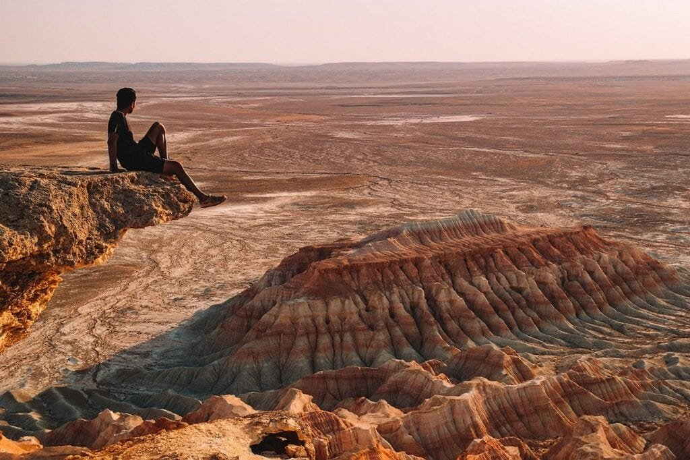

Volcanic eruptions, a natural phenomenon of immense power and destruction, have captivated the human imagination for centuries. These violent displays of nature occur when molten rock, known as magma, escapes from beneath the Earth's surface, often accompanied by gases and debris. While volcano eruptions occur at various locations, such as plate boundaries, hotspots, or rift zones, they share a common theme of releasing lava and ash into the surrounding environment. The consequences of volcanic eruptions can be both devastating and beneficial, from destructive natural disasters to the creation of nutrient-rich soil. By understanding the causes and patterns of volcanic eruptions, scientists can predict future activity and mitigate risks for the communities living in their shadow. In this article, we will delve into the various factors that contribute to volcanic eruptions, explore different types of volcanoes, and consider the potential hazards and benefits associated with these fiery mountains.

<iframe width="560" height="315" src="https://www.youtube.com/embed/LQwZwKS9RPs" frameborder="0" allow="accelerometer; autoplay; encrypted-media; gyroscope; picture-in-picture" allowfullscreen></iframe>

  

## Understanding Volcanoes

Volcanoes are fascinating natural phenomena that have captivated humans for centuries. In order to truly appreciate and comprehend these awe-inspiring forces of nature, it is important to have a solid understanding of what exactly a volcano is and the different types of volcanoes that exist.

### Definition and general overview of a volcano

A volcano is essentially a vent in the Earth's crust through which molten rock, volcanic gases, and debris escape to the surface. This material, known as magma, can come from deep within the Earth, where it is formed through the melting of rocks due to high temperatures and pressure. When the magma reaches the surface, it is called lava.

Volcanoes can take on various forms, ranging from small hills to towering mountains. They are characterized by their cone-shaped or domed structure, which is created through the accumulation of lava, ash, and other volcanic materials ejected during eruptions. Eruptions can be explosive or relatively calm, and the type of eruption depends on several factors, including the viscosity of the magma and the presence of gases.

### Difference between dormant, active and extinct volcanoes

Volcanoes can be classified into three main categories based on their level of activity: dormant, active, and extinct.

Dormant volcanoes are those that have not erupted in a long time but still have the potential to erupt again in the future. These volcanoes are considered to be in a temporary state of rest, and although they may not be showing any signs of activity, they are still geologically alive.

Active volcanoes, on the other hand, are those that have erupted recently or are currently showing signs of potential eruption. These [volcanoes are characterized by ongoing geological](https://magmamatters.com/geothermal-energy-and-its-volcanic-origins/ "Geothermal Energy and Its Volcanic Origins") activity, such as the release of volcanic gases or the formation of new vents.

Extinct volcanoes are those that are no longer expected to erupt again. These volcanoes have remained inactive for thousands of years and have undergone significant erosion, making it unlikely for any future eruptions to occur.

It is important to note that the classification of a volcano as dormant, active, or extinct can sometimes be subjective and may change over time as new information becomes available.

## Formation of Volcanoes

Understanding the formation of volcanoes requires knowledge of the Earth's tectonic plates and the role they play in shaping the planet's surface.

### Role of tectonic plates in volcano formation

The Earth's lithosphere is divided into several large plates that float on top of the semi-fluid asthenosphere. These tectonic plates are constantly moving, albeit very slowly, and interact with each other at their boundaries.

Volcanoes are primarily formed at these plate boundaries due to the movement and collision of these plates. There are three main types of plate boundaries: divergent boundaries, convergent boundaries, and transform boundaries.

At divergent boundaries, such as mid-ocean ridges, plates move apart from each other, creating gaps where magma from the mantle can rise and fill the void. This magma then solidifies and forms new crust, eventually leading to the formation of volcanic structures.

Convergent boundaries occur when plates collide with each other. In these cases, the denser plate is forced beneath the lighter plate, creating a subduction zone. As the subducting plate sinks into the mantle, it undergoes melting, generating magma that eventually rises through the Earth's crust, resulting in volcanic activity.

Transform boundaries, where plates slide past each other horizontally, are less likely to give rise to volcanic activity. However, in some instances, the friction and stress along these boundaries can lead to the formation of volcanic structures.

### Volcano formation at hotspots and rift zones

While plate boundaries are the primary locations for volcanic activity, volcanoes can also form at hotspots and rift zones.

Hotspots refer to areas in the Earth's mantle where plumes of abnormally hot material rise towards the surface. These plumes are thought to originate from deep within the mantle and can create a localized area of volcanic activity. As the tectonic plates move over these hotspots, they form a chain of volcanoes, with the youngest volcano situated above the hotspot and the older ones becoming progressively more eroded and distant from the hotspot.

Rift zones, on the other hand, occur when the Earth's tectonic plates move apart, creating a crack or fissure in the Earth's crust. Magma from the mantle can then rise to the surface along these rifts, leading to the formation of volcanic structures. Rift zones are commonly associated with underwater volcanic activity, giving rise to the formation of mid-ocean ridges and submarine volcanoes.

### Process of magma ascent and volcano formation

The formation of a volcano begins with the ascent of magma from the Earth's mantle to the surface. The exact mechanisms behind magma ascent are complex and influenced by several factors, such as the composition of the magma, the pressure within the magma chamber, and the structure of the surrounding rocks.

As magma rises, it encounters various layers of rock and minerals. If the magma is relatively runny, or low in viscosity, it can flow more easily through the cracks and fractures in the surrounding rocks, eventually reaching the surface and giving rise to effusive eruptions. In contrast, if the magma is highly viscous, or thick, it struggles to pass through the surrounding rocks and can become trapped, leading to explosive eruptions.

The formation of a volcano is a gradual process that takes place over thousands or even millions of years. As magma rises to the surface, it can accumulate and build up, forming a magma chamber beneath the Earth's crust. Over time, repeated eruptions deposit layers of lava, ash, and other volcanic materials, gradually shaping the volcano into its characteristic cone or dome-like structure.

This image is property of pixabay.com.

## Types of Volcanic Eruptions

Volcanic eruptions can vary greatly in terms of their intensity, duration, and the type of materials they produce. Understanding the different types of volcanic eruptions is essential for assessing the potential hazards associated with volcanic activity.

### Effusive eruptions and their characteristics

Effusive eruptions, also known as non-explosive eruptions, are characterized by the relatively gentle release of lava onto the surface. This type of eruption occurs when low-viscosity magma, typically basaltic in composition, reaches the surface and flows out of the volcano's vents.

During an effusive eruption, the lava flows slowly and steadily, often following existing channels or creating new ones. The lava can spread over a wide area, forming vast lava fields or lava flows. These eruptions are generally not accompanied by significant explosions or the release of large amounts of volcanic ash and gases.

Effusive eruptions can create new land and modify existing landscapes over time. Lava can cover vast areas, burying vegetation and structures in its path. However, due to the relatively slow movement of lava, people and animals usually have enough time to evacuate and avoid direct harm.

### Explosive eruptions and their characteristics

Explosive eruptions are the opposite of effusive eruptions and are characterized by the violent and rapid release of gases, ash, and other volcanic materials. This type of eruption occurs when highly viscous magma, typically rhyolitic or andesitic in composition, rises to the surface and encounters significant obstacles in its path.

The high viscosity of the magma leads to the build-up of pressure within the volcano's magma chamber. When this pressure becomes too great to contain, it causes an explosive eruption. The sudden release of pressure propels a mixture of magma, gases, and volcanic ash into the air, forming a towering eruption column.

Explosive eruptions can produce pyroclastic flows, which are fast-moving currents of hot gas, ash, and volcanic debris that hug the ground and can travel at speeds of several hundred kilometers per hour. These flows can be extremely dangerous, destroying everything in their path and causing widespread devastation.

The explosive nature of these eruptions can also result in the formation of volcanic plumes, which can reach high altitudes and spread ash and volcanic gases over large areas. Ashfall from explosive eruptions can pose serious health risks and cause significant damage to buildings, infrastructure, and agricultural lands.

### Factors influencing the type of eruption

Several factors influence the type of volcanic eruption that occurs, including the composition and viscosity of the magma, the presence of volatile gases, and the structure of the volcanic conduit.

Magma composition plays a crucial role in determining the type of eruption. Magma with low viscosity, such as basaltic magma, flows more easily and is more likely to result in effusive eruptions. In contrast, magma with high viscosity, such as rhyolitic magma, is more prone to explosive eruptions due to its ability to trap gases within it.

The presence of volatile gases, such as water vapor, carbon dioxide, and sulfur dioxide, also plays a significant role in determining the explosiveness of an eruption. As magma rises towards the surface, the decrease in pressure allows these gases to escape, causing the magma to expand rapidly. The rapid expansion of gases can lead to explosive eruptions, as seen in the case of volcanic plumes and pyroclastic flows.

Additionally, the structure of the volcanic conduit, which is the pathway through which magma travels from the magma chamber to the surface, can also influence the type of eruption. Narrow, constricted conduits can create conditions for explosive eruptions by increasing pressure and obstructing the flow of magma. In contrast, wider conduits provide more pathways for magma to escape, leading to less explosive eruptions.

Understanding these factors is crucial for accurately assessing volcanic hazards and developing strategies for mitigation and disaster preparedness.

## Types of Volcanoes

Volcanoes come in various shapes and sizes, each with its own unique characteristics and formation process. Understanding these different [types of volcanoes can provide insights into their geological history](https://magmamatters.com/understanding-volcanic-formation-a-comprehensive-guide/ "Understanding Volcanic Formation: A Comprehensive Guide") and behavior.

### Shield volcanoes and how they form

Shield volcanoes are large, broad volcanoes with gentle slopes and a dome-like shape, resembling a warrior's shield lying on the ground. They are characterized by their low-profile, wide base, and expansive summit crater.

Shield volcanoes are typically formed by the eruption of low-viscosity basaltic lava, which spreads out over large areas during an effusive eruption. The lava flows slowly and accumulates in layers, gradually building up the shield volcano over time. This continuous cycle of eruption and lava flow results in the gradual growth of the volcano and the formation of its characteristic shield-like shape.

These volcanoes are often associated with hotspots, such as the Hawaiian Islands, where a constant supply of magma from the mantle fuels their growth. Shield volcanoes are known for their relatively quiet and non-explosive eruptions. However, they can occasionally produce more explosive eruptions if there is a sudden release of trapped gases or a change in the magma composition.

### Composite volcanoes and their formation process

Composite volcanoes, also known as stratovolcanoes, are tall, steep-sided volcanoes with a cone-shaped structure. They are composed of alternating layers of lava, pyroclastic materials, and volcanic ash, giving them a stratified appearance.

Composite volcanoes form through a combination of explosive and effusive eruptions. The eruptions are typically more explosive than those of shield volcanoes, due to the higher viscosity of the magma involved. The explosive eruptions result in the ejection of volcanic ash and other materials, which then settle around the vent and contribute to the growth of the volcano.

Over time, the alternating layers of lava and volcanic materials build up, forming the characteristic cone shape of composite volcanoes. These volcanoes are commonly associated with subduction zones, where one tectonic plate is forced beneath another. The subducted plate provides a source of water and other volatile gases, leading to the formation of more explosive eruptions.

Composite volcanoes can have periods of relative inactivity in between eruptions, giving them a sense of dormancy. However, they are still considered active volcanoes, as they have the potential to erupt again in the future.

### Cinder cone volcanoes and their characteristics

Cinder cone volcanoes, also known as scoria cones, are small, steep-sided volcanoes with a conical shape. They are composed mainly of pyroclastic materials, such as cinder and volcanic ash, which are ejected during explosive eruptions.

Cinder cone volcanoes form through relatively short-lived eruptions that are characterized by the explosive ejection of volcanic material. During these eruptions, gases within the magma expand rapidly, propelling fragmented pieces of magma, known as cinders, into the air. The cinders then fall back to the ground and accumulate around the vent, building up the cone-shaped structure of the volcano.

Cinder cone volcanoes are typically formed from basaltic or andesitic magma, which has intermediate viscosity. These volcanoes are often found in volcanic fields, where multiple cinder cones can be clustered together. They tend to have a short lifespan, with eruptions lasting only a few months to a few years.

Compared to shield and composite volcanoes, cinder cone volcanoes are generally less significant in terms of their size and overall impact. However, they can still pose hazards to nearby communities and infrastructure during eruptive periods.

This image is property of pixabay.com.

## Causes of Volcanic Eruptions

Understanding the causes of volcanic eruptions is essential for predicting volcanic activity and assessing the associated hazards. Several factors contribute to the eruption of a volcano, including the viscosity and gas content of magma, tectonic plate movements, and the build-up and release of pressure within the volcano.

### Role of magma viscosity and gas content in eruptions

The viscosity, or resistance to flow, of magma plays a crucial role in determining the type and explosiveness of volcanic eruptions. Magma viscosity is primarily influenced by its composition, temperature, and volatile gas content.

Magma with low viscosity, such as basaltic magma, is relatively runny and flows more easily through cracks and fractures in the Earth's crust. This low-viscosity magma tends to produce effusive eruptions, characterized by the slow and steady flow of lava onto the surface.

In contrast, magma with high viscosity, such as rhyolitic or andesitic magma, is highly resistant to flow and struggles to pass through the surrounding rocks. The high viscosity of this magma can lead to a build-up of pressure within the volcano, resulting in explosive eruptions.

The gas content of magma also plays a significant role in volcanic eruptions. As magma rises towards the surface, the decrease in pressure allows dissolved gases, such as water vapor, carbon dioxide, and sulfur dioxide, to exsolve and form bubbles within the magma.

The rapid expansion of these gas bubbles can generate enough force to fragment the magma and propel it into the air during an eruption. The presence of gases in volcanic eruptions contributes to the explosive nature of certain eruptions, leading to the formation of volcanic plumes, pyroclastic flows, and other hazardous phenomena.

### How tectonic plate movements trigger eruptions

Tectonic plate movements play a crucial role in triggering volcanic eruptions by creating conditions that enable magma ascent and release.

At convergent plate boundaries, where one tectonic plate is forced beneath another, subduction zones are formed. In these areas, the subducted plate sinks into the mantle, undergoing melting due to the high temperatures and pressures deep within the Earth.

The magma generated by this process is less dense than the surrounding rocks, causing it to rise towards the surface. As the magma ascends, it can become trapped within the overlying plate, leading to the accumulation of magma and pressure within the volcano. Eventually, this pressure becomes too great to contain, resulting in explosive eruptions.

At divergent plate boundaries, where plates move apart from each other, magma from the mantle can rise and fill the void created by the separation of the plates. This upwelling of magma leads to the formation of new crust and volcanic activity. Although the eruptions at divergent plate boundaries are typically less explosive, they can still pose hazards to nearby communities and infrastructure.

While transform plate boundaries, where plates slide past each other horizontally, are less likely to give rise to volcanic activity, the friction and stress along these boundaries can sometimes lead to volcanic eruptions. The forces exerted during plate movements can create cracks and fractures in the Earth's crust, providing pathways for magma to rise and reach the surface.

### Effect of pressure build-up and release in volcanic eruptions

The build-up and release of pressure within a volcano are key factors in triggering volcanic eruptions. As magma rises towards the surface, it encounters increasing pressure from the overlying rocks and the weight of the magma column within the volcano.

The pressure exerted on the magma can lead to the formation of a magma chamber beneath the Earth's crust. This magma chamber acts as a reservoir, storing large quantities of magma and gases. The pressure within the chamber gradually increases as more magma is added and gases accumulate.

When the pressure within the magma chamber becomes too great to contain, it exceeds the strength of the overlying rocks, causing fractures and fissures to form. These fractures provide pathways for magma to escape and reach the surface, resulting in an eruption.

During an eruption, the rapid release of pressure causes the gas bubbles within the magma to expand, leading to the fragmentation of the magma into volcanic ash, cinders, and other pyroclastic materials. The force of the eruption propels these materials into the air, forming volcanic plumes and pyroclastic flows.

The release of pressure also allows the lava to flow more easily and reach the surface, resulting in effusive eruptions. The pressure release can also lead to the formation of secondary vents and fissures, which can create additional volcanic activity and hazards.

Understanding the role of pressure build-up and release is crucial for monitoring and predicting volcanic eruptions, as changes in pressure can indicate an increased likelihood of eruption.

## Geographic Distribution of Volcanoes

Volcanoes are not evenly distributed across the Earth's surface but instead occur in specific regions known for their volcanic activity. Understanding the geographic distribution of volcanoes provides insights into the underlying tectonic processes and helps identify areas that are prone to volcanic hazards.

### Volcanic hot spots and their global distribution

Volcanic hot spots are areas within the Earth's mantle where abnormally hot material, or mantle plumes, rise towards the surface. These mantle plumes are thought to originate from deep within the mantle and can produce volcanic activity when they intersect with the Earth's crust.

Hot spots are not linked to plate boundaries but instead represent localized areas of volcanic activity. The global distribution of hot spots is not random, and certain regions are known for their high concentration of volcanoes.

One prime example of a volcanic hot spot is found in the Hawaiian Islands in the Pacific Ocean. The Hawaiian Islands are situated atop a hot spot in the mantle, where a constant supply of magma fuels the growth of shield volcanoes. As the Pacific tectonic plate moves over the hot spot, a chain of volcanic islands is formed, with the youngest volcano situated above the hot spot and the older volcanoes becoming progressively more eroded and distant.

Other hot spots can be found in various locations around the world, including Iceland, the Galapagos Islands, and Yellowstone National Park in the United States. The global distribution of hot spots provides evidence for the dynamic nature of the Earth's mantle and the existence of localized areas of volcanic activity away from plate boundaries.

### Ring of Fire and its significance

The Ring of Fire is a major area in the basin of the Pacific Ocean that is highly prone to volcanic activity and earthquake occurrences. It is a direct result of the Pacific tectonic plate interacting with several surrounding plates.

The Ring of Fire is aptly named, as it forms a horseshoe-shaped ring around the Pacific Ocean, encompassing areas such as the coasts of South America, North America, eastern Asia, and Oceania. This region is known for its high concentration of active volcanoes and frequent seismic activity.

The presence of the Ring of Fire can be attributed to the subduction of several tectonic plates beneath the Pacific plate. The subduction of these plates creates a highly active zone, where the sinking plate melts in the mantle, generating magma that rises to the surface.

The volcanic activity along the Ring of Fire has significant implications for the affected regions. Frequent eruptions and earthquakes can pose hazards to nearby populations, infrastructure, and ecosystems. However, the volcanic activity also contributes to the creation of new land, the formation of mineral deposits, and the preservation of geothermal energy sources.

### Connection between tectonic plate boundaries and volcano locations

The geographic distribution of volcanoes is closely linked to the movement and interactions of tectonic plates. Volcanoes are predominantly found at plate boundaries, where the forces exerted during plate movements create conditions that enable magma ascent and eruption.

At convergent plate boundaries, where plates collide or move towards each other, one plate is usually forced beneath another in a process known as subduction. This subduction creates a zone of intense pressure and heat, leading to the melting of the subducted plate and the generation of magma. The rise of this magma towards the surface gives rise to volcanic activity and the formation of volcanic arcs, such as the Andes in South America or the Cascades in North America.

At divergent plate boundaries, where plates move apart from each other, magma from the mantle can rise and fill the void created by the separation of the plates. This upwelling of magma results in the formation of new crust and volcanic activity. Mid-ocean ridges, such as the Mid-Atlantic Ridge or the East Pacific Rise, are examples of volcanic activity associated with divergent plate boundaries.

Transform plate boundaries, where plates slide past each other horizontally, can also give rise to volcanic activity in certain circumstances. The friction and stress along these boundaries can create cracks and fractures in the Earth's crust, providing pathways for magma ascent and eruption.

The relationship between volcanoes and plate boundaries highlights the dynamic nature of the Earth's lithosphere and the ongoing forces that shape the planet's surface.

This image is property of pixabay.com.

## Hazards Associated with Volcanic Eruptions

Volcanic eruptions can unleash a wide range of hazards that can pose significant risks to both human and natural environments. Understanding these hazards is essential for implementing effective mitigation strategies and protecting vulnerable populations.

### Effects of volcanic ash on health and the environment

One of the most widely recognized hazards associated with volcanic eruptions is the release of volcanic ash into the atmosphere. Volcanic ash consists of tiny particles of pulverized rock and volcanic glass that are ejected during explosive eruptions.

Volcanic ash can have severe consequences for human health, as it is composed of abrasive and toxic particles. Inhaling volcanic ash can cause respiratory problems, such as coughing, shortness of breath, and irritation of the eyes and throat. Prolonged exposure to volcanic ash can lead to more serious health issues, including lung damage and respiratory illnesses.

The deposition of volcanic ash on the ground can also have far-reaching environmental impacts. Ashfall can bury vegetation, crops, and water bodies, disrupting ecosystems and agricultural practices. The weight of ash can cause roofs to collapse and damage infrastructure, such as power lines, transportation networks, and buildings. Additionally, the abrasive nature of ash can cause mechanical damage to machinery and engines.

Volcanic ash can also affect air travel by posing a serious threat to aircraft engines. The sharp particles in ash can cause significant damage to engine components, leading to engine failure and potentially catastrophic accidents. As a result, the presence of volcanic ash in the atmosphere can lead to the closure of airspace and the cancellation of flights, causing disruptions to travel and commerce.

### Lava flow and wildfire hazards

Lava flows are another hazardous phenomenon associated with volcanic eruptions. Lava flows occur when molten rock, known as lava, is released from a volcano and moves downslope. The speed and behavior of lava flows depend on several factors, including the viscosity of the lava and the slope of the terrain.

Although lava flows typically move relatively slowly, they can still pose risks to nearby communities and infrastructure. The extreme heat of the lava can cause fires, destroy vegetation, and damage buildings and infrastructure in its path. In some cases, lava can engulf entire neighborhoods, displacing populations and causing significant social and economic disruption.

Additionally, lava flows can impact water bodies, causing them to boil and release steam, which can result in explosive eruptions and other hazards. The addition of lava to water can also create new land through a process known as lava delta formation, where the lava cools and solidifies, extending the coastline and altering the local geography.

### Impact of pyroclastic flows and lahars on human and natural landscapes

Pyroclastic flows and lahars are two extremely hazardous phenomena associated with explosive volcanic eruptions. Pyroclastic flows are fast-moving currents of hot gas, ash, and volcanic debris that travel downhill at high speeds, hugging the ground. Lahars, on the other hand, are rapidly moving torrents of volcanic debris and water that flow along river valleys and can extend for many kilometers.

Pyroclastic flows and lahars can cause massive destruction and loss of life. These flows can travel at speeds of several hundred kilometers per hour, overwhelming everything in their path. The extreme heat and velocity of pyroclastic flows can cause instantaneous death and severe burns, even from a distance. Lahars can bury entire towns and farmland, destroy infrastructure, and contaminate water sources, leading to long-term consequences for affected communities.

Both [pyroclastic flows](https://magmamatters.com/the-environmental-impact-of-volcanic-eruptions-2/ "The Environmental Impact of Volcanic Eruptions") and lahars can be a significant risk for communities located near volcanoes. Building infrastructure, settlements, and agriculture in close proximity to volcanic areas increases the vulnerability to these hazards. It is crucial for policymakers, communities, and individuals to be aware of these risks and implement appropriate mitigation measures to reduce the potential impact.

## Benefits of Volcanic Eruptions

While volcanic eruptions can result in devastating natural disasters, they also play a vital role in shaping the Earth's landscapes and providing benefits to certain ecosystems and human communities.

### Role of volcanoes in soil enrichment

Volcanic eruptions can enrich soils with minerals and nutrients, providing fertile ground for plant growth. When volcanic ash and other volcanic materials settle on the ground, they break down and release important elements, such as potassium, phosphorus, and nitrogen, into the soil. These elements are essential for the development and growth of plants.

Areas affected by volcanic eruptions often exhibit increased agricultural productivity due to the nutrient-rich soils. Volcanic ash, in particular, has a high water-holding capacity, allowing crops to access moisture during dry periods. Farmers in volcanic regions often exploit these benefits by practicing agriculture on the fertile volcanic soils, resulting in high yields and increased food security.

### Volcanoes as a source of geothermal energy

Volcanic activity can also provide a valuable source of geothermal energy. Geothermal energy is produced by harnessing the heat from within the Earth for electricity generation and heating purposes.

Volcanic areas with high geothermal potential are often characterized by the presence of hot springs, fumaroles, and geysers. These features indicate the presence of hot rocks and fluids beneath the Earth's surface. By tapping into this geothermal reservoir, heat can be extracted and converted into usable energy.

Geothermal energy offers several advantages over traditional energy sources, including low carbon emissions, a continuous and reliable power supply, and minimal land use requirements. In volcanic regions, geothermal power plants can be built to harness the available energy, contributing to the diversification of a country's energy portfolio and reducing its dependence on fossil fuels.

Volcanic regions around the world, such as Iceland, New Zealand, and Costa Rica, have successfully harnessed geothermal energy to meet a significant portion of their energy needs, providing clean and sustainable power to their populations.

### Significance of volcanoes in creating new landscapes and islands

Volcanic activity plays a fundamental role in shaping the Earth's surface and creating new landscapes. As magma rises to the surface and solidifies, it forms new landforms that can range from small cinder cones to large shield volcanoes and calderas.

Volcanic islands are a prime example of the transformative power of volcanic eruptions. These islands are created when volcanic eruptions occur beneath the ocean's surface and build up over time, eventually breaking through the water and forming new land. Volcanic islands can provide valuable habitats for unique ecosystems and support diverse flora and fauna.

Volcanoes also contribute to the formation of other landforms, such as mountains, valleys, and canyons. The lava, ash, and other volcanic materials deposited by eruptions can accumulate and erode over time, shaping the surrounding landscape and creating unique geological features.

Studies of volcanic landscapes and islands provide valuable insights into the geological history of an area, helping scientists understand the processes that shape our planet.

## Volcano Monitoring and Eruption Prediction

Monitoring volcanoes is essential for understanding their behavior, predicting volcanic eruptions, and mitigating the risks associated with volcanic hazards. Advancements in technology and scientific understanding have enabled scientists to develop various methods for monitoring volcanoes in real-time.

### Current methods of volcano monitoring

Volcano monitoring involves the continuous observation of volcanic activity, including the monitoring of ground deformation, gas emissions, seismic activity, and thermal anomalies. These observations are crucial for detecting changes in volcano behavior that could indicate an increased likelihood of eruption.

Ground deformation is monitored using instruments such as GPS and tiltmeters, which measure changes in the shape and elevation of the volcano. These measurements can reveal the accumulation of magma beneath the volcano and provide insights into its potential for eruption.

Gas emissions are monitored using gas analyzers and remote sensing techniques. Volcanoes release various gases, including water vapor, sulfur dioxide, and carbon dioxide, which can act as precursors to eruptions. Changes in gas composition and emission rates can indicate an increased movement of magma and the potential for volcanic activity.

Seismic activity is monitored using networks of seismometers that detect vibrations and ground movements associated with volcanic activity. Changes in seismic activity, such as an increase in the number and intensity of earthquakes, can indicate the movement and ascent of magma within the volcano.

Thermal anomalies are monitored using infrared cameras and satellite-based sensors. These instruments can detect changes in temperature and heat emissions from the volcano, which can be indicative of volcanic activity.

### Eruption prediction and its accuracy

Despite significant advancements in volcano monitoring techniques, accurately predicting the timing and intensity of volcanic eruptions remains a major challenge for scientists. Volcanoes are complex systems with numerous variables, making it difficult to forecast their behavior with absolute certainty.

Eruption prediction relies on the interpretation of monitoring data and the identification of precursory signs that precede an eruption. Changes in ground deformation, gas emissions, seismic activity, and thermal anomalies can provide valuable clues about the state of a volcano. However, these signs are often ambiguous and can be associated with various volcanic processes, making it challenging to differentiate between normal volcanic activity and the onset of an eruption.

As a result, eruption predictions are usually expressed in terms of probabilities and likelihoods rather than specific dates and magnitudes. Scientists use statistical models and historical eruption data to estimate the probability of an eruption occurring within a certain time frame. These forecasts are continually updated and refined as new data becomes available, allowing for more accurate assessments of volcanic hazards.

While eruption prediction remains an imperfect science, ongoing research and technological advancements hold the promise of improving our understanding of volcanic behavior and providing more accurate forecasts in the future.

### Role of seismic activity in eruption prediction

[Seismic activity plays a crucial role in volcano monitoring](https://magmamatters.com/the-art-and-science-of-volcano-monitoring/ "The Art and Science of Volcano Monitoring") and eruption prediction. By detecting and analyzing seismic signals, scientists can gain insights into the movement and ascent of magma within the volcano.

Volcanic earthquakes are a common occurrence prior to and during volcanic eruptions. These earthquakes are caused by the fracturing of rocks as magma pushes its way towards the surface. By monitoring the frequency, magnitude, and location of these earthquakes, scientists can infer the movement of magma and the potential for an eruption.

Volcanic tremors, which are continuous seismic signals associated with the movement of fluids within the volcano, are another important indicator of volcanic activity. By analyzing the characteristics of these tremors, scientists can assess the changes in volcanic processes and the likelihood of an eruption.

Seismic data is often combined with other monitoring techniques, such as ground deformation and gas emissions, to provide a comprehensive understanding of volcano behavior. The integration of multiple datasets allows scientists to make more informed assessments of volcanic hazards and issue timely warnings to at-risk communities.

## Mitigation of Volcano Risks

Mitigating the risks associated with volcanic eruptions requires a multi-faceted approach that involves community preparedness, structural design strategies, and effective evacuation and recovery plans.

### Community preparedness for volcanic eruptions

Community preparedness is crucial for minimizing the impact of volcanic eruptions and ensuring the safety of residents in volcanic areas. Educating communities about the hazards associated with volcanic activity and providing them with the necessary knowledge and resources can significantly reduce the loss of life and property.

Public education programs should include information on the signs of volcanic activity, evacuation procedures, and the importance of following official warnings and instructions. It is essential for residents to be aware of the risks they face and to have a clear understanding of the actions they should take in the event of an eruption.

Early warning systems are also critical for community preparedness. These systems use real-time monitoring data to detect changes in volcanic activity and issue timely warnings to at-risk populations. Sirens, text message alerts, and radio broadcasts are commonly used to disseminate warnings and evacuation orders. It is important for communities to have well-established communication channels and emergency protocols to ensure that warnings reach the intended recipients.

Community drills and exercises can help familiarize residents with evacuation routes, emergency shelters, and response procedures. These drills allow residents to practice their response to a volcanic emergency and identify any weaknesses or areas that require improvement.

### Structural design strategies for volcanic regions

Designing structures to withstand the hazards associated with volcanic eruptions is crucial for minimizing damage and protecting the safety of inhabitants. Structural design strategies should take into account the specific hazards posed by volcanic activity, including volcanic ash, pyroclastic flows, and lahars.

Structures in volcanic areas should be built using materials that can withstand the corrosive effects of volcanic ash. Concrete, for example, is commonly used due to its durability and resistance to chemical degradation. Roof designs should be sloped and made from materials that can easily shed ash and prevent its accumulation, reducing the risk of collapses.

Structures located in close proximity to volcanoes should be designed to withstand the impact of volcanic projectiles, such as cinders and volcanic bombs. Reinforced structural elements, such as walls and roofs, can provide additional protection against these projectiles.

Building codes and regulations should incorporate specific requirements for structures in volcanic areas, taking into account the hazards associated with volcanic eruptions. Regular inspections of existing structures should be conducted to identify any weaknesses or deficiencies that could increase vulnerability to volcanic hazards.

### Evacuation and recovery plans in the event of a volcanic eruption

In the event of a volcanic eruption, timely evacuation is essential for protecting the lives of residents and minimizing the potential for casualties. Evacuation plans should be well-developed and tailored to the specific risks and characteristics of each volcanic area.

Evacuation routes and assembly points should be clearly marked and easily accessible, allowing residents to quickly and safely reach designated safe areas. Transportation and communication systems should be in place to facilitate the evacuation process and provide real-time information to residents.

Emergency shelters should be established in safe locations, equipped with necessary supplies and infrastructure to accommodate evacuated populations. These shelters should have provisions for specific needs, such as medical care and support for vulnerable populations.

Recovery plans are equally important for assisting communities in the aftermath of a volcanic eruption. These plans should focus on restoring basic services, such as water, sanitation, and healthcare, promoting economic recovery, and supporting affected communities in rebuilding their lives.

Recovery efforts should also include programs to mitigate the long-term impacts of volcanic eruptions, such as land rehabilitation, reforestation, and the promotion of sustainable livelihoods. This holistic approach to recovery can help mitigate the social, economic, and environmental impacts of volcanic eruptions and contribute to long-term resilience.

Mitigating the risks associated with volcanic eruptions requires a combination of scientific knowledge, community preparedness, and strategic planning. By understanding the hazards and implementing appropriate measures, it is possible to minimize the impact of volcanic activity and protect both human and natural environments.

