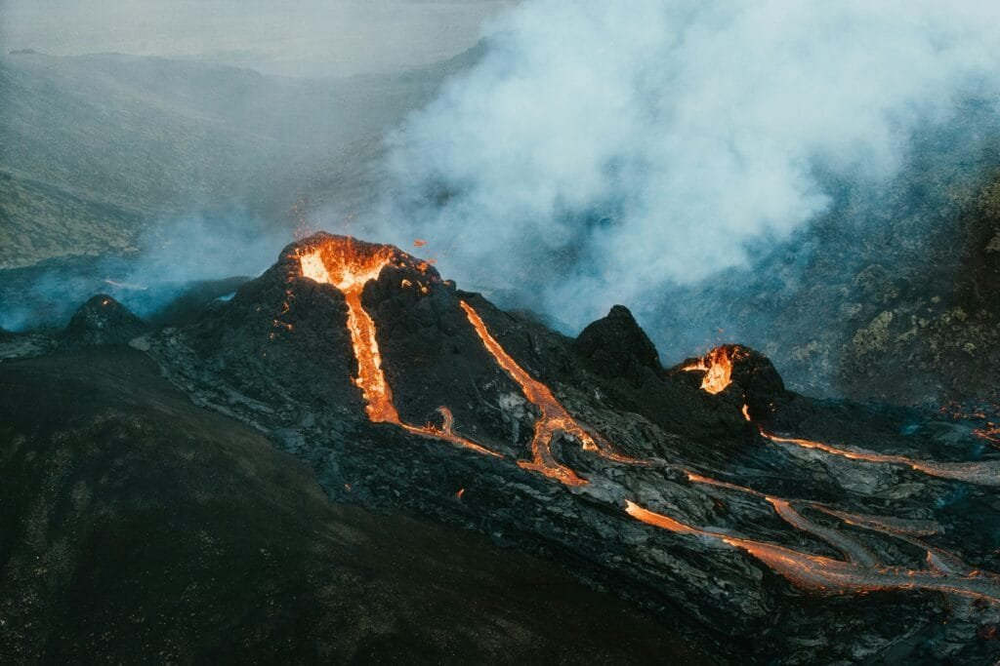

A subtle rumble beneath the icy surface of Eyjafjallajokull can stir thoughts of a slumbering giant, waiting to reveal its might.

As the molten core of this shield volcano intertwines with the glaciers above, a delicate dance ensues, shaping both destruction and allure.

The juxtaposition of chaos and tranquility in Eyjafjallajokull's volcanic symphony invites contemplation on the natural forces that sculpt our world, leaving observers curious about the hidden depths of this Icelandic marvel.

## Key Takeaways

- Eyjafjallajokull's explosive eruptions blend fury with beauty, showcasing unique geological features.
- Impactful disruptions in air travel and the environment followed the 2010 eruption, leading to improved monitoring systems.
- Eyjafjallajokull's landscapes offer a captivating mix of fire and ice, attracting tourists fascinated by volcanic activity.
- The volcano's guided tours provide safe exploration of its aftermath, appealing to nature enthusiasts seeking adventure.

## Eyjafjallajokull's Explosive Eruption

Eyjafjallajokull's explosive eruption in 2010, lasting approximately 6 days, brought widespread disruption due to a series of phreatomagmatic explosions triggered by [increased seismic activity](https://magmamatters.com/the-art-and-science-of-volcano-monitoring/ "The Art and Science of Volcano Monitoring"). The eruption of this shield volcano began with a series of small earthquakes, signaling the awakening of its fury. As seismic activity intensified, phreatomagmatic explosions ensued, propelling ash plumes as high as 7 miles into the atmosphere. Lava from the eruption cascaded through the Fimmvörduháls Pass, eventually reaching beneath the glacier summit, adding to the spectacle of nature's power.

The ash cloud generated by Eyjafjallajokull's eruption wreaked havoc on air travel safety across Europe. The fine particles dispersed by the volcano disrupted flight schedules, leading to widespread cancellations and airport closures. This event underscored the vulnerability of modern air travel systems to the whims of [nature and highlighted the critical need for enhanced volcano](https://magmamatters.com/the-environmental-impact-of-volcanic-eruptions-2/ "The Environmental Impact of Volcanic Eruptions") monitoring and ash detection capabilities. The eruption of Eyjafjallajokull served as a stark reminder of the importance of preparedness and swift response in the face of volcanic activity, emphasizing the ongoing battle between human infrastructure and the raw forces of the Earth.

## Geological Formation of Eyjafjallajokull

Formed through a series of repeated eruptions over time, the shield volcano known as Eyjafjallajokull displays distinctive geological characteristics that contribute to its unique structure and behavior. This shield volcano, unlike the steep-sided stratovolcanoes, has gentle sloping sides built up by successive lava flows and tephra deposits. The accumulation of these materials has created a broad, flat dome shape that's characteristic of shield volcanoes.

Eyjafjallajokull's geological formation plays a crucial role in its behavior. The volcano's composition primarily consists of basaltic lava flows, which contribute to its relatively less explosive eruptions compared to other volcano types. However, occasional explosive eruptions do occur, especially when magma interacts with ice and water, leading to steam-driven explosions.

The interaction between Eyjafjallajokull and the surrounding glaciers highlights the volcano's geological significance. The presence of glaciers on and around the volcano influences its activity and contributes to the unique landscapes that form as a result. This dynamic relationship between the shield volcano and the glaciers adds to the beauty and complexity of Eyjafjallajokull, making it a fascinating subject for geological study and appreciation.

## Impact on Air Travel and Environment

The eruption of Eyjafjallajokull in 2010 had far-reaching consequences on both air travel and the environment, with disruptions affecting a wide range of sectors. The volcanic eruption of Eyjafjallajökull [volcano](https://magmamatters.com/geothermal-energy-and-its-volcanic-origins/ "Geothermal Energy and Its Volcanic Origins") caused significant disruptions in air travel and had a profound impact on the environment. Here are some key points to consider:

- The volcanic ash cloud from Eyjafjallajokull reached heights of up to 7 miles into the atmosphere, creating a serious hazard for aircraft engines.
- The dispersal of ash particles over northern Europe by prevailing winds raised concerns about engine damage and passenger safety, leading to widespread flight cancellations and airport closures.
- The environmental impact of the eruption extended beyond aviation, affecting agriculture, causing increased glacier melting, and impacting soil fertility and local wildlife.

The eruption of Eyjafjallajokull underscored the vulnerabilities in air travel safety when faced with volcanic events. This event prompted significant improvements in volcano monitoring systems and fostered international cooperation to better prepare for and mitigate the impact of future volcanic eruptions. The collaboration among nations following this event has helped enhance the global response to volcanic threats, making air travel safer and more resilient in the face of such natural disasters.

## Beauty of Eyjafjallajokull's Landscapes

Amidst the contrasting elements of ice and fire, Eyjafjallajokull's landscapes reveal a mesmerizing blend of natural wonders. In Iceland, the beauty of Eyjafjallajokull lies in the harmonious coexistence of fire and ice. The volcanic eruptions have shaped the terrain, creating a captivating juxtaposition between the snow-capped peaks of glacial ice and the stark black lava fields and ash-covered slopes below.

Visitors to Eyjafjallajokull are treated to a visual feast as they witness the interplay of fire and ice in the striking landscapes. The surrounding area is a testament to the forces of nature, with lush greenery contrasting against the rugged volcanic terrain. The beauty of Eyjafjallajokull's landscapes is further enhanced by the presence of waterfalls, rivers, and unique [volcanic formations](https://magmamatters.com/understanding-volcanic-formation-a-comprehensive-guide/ "Understanding Volcanic Formation: A Comprehensive Guide") that dot the region.

The legacy of volcanic activity in Eyjafjallajokull is evident in the intricate landscapes it has sculpted over time. The remnants of past eruptions, combined with the ongoing geological processes, contribute to the allure of this Icelandic gem. As visitors explore the area, they're met with a tapestry of natural beauty that showcases the raw power and stunning aesthetics of a volcanic landscape shaped by fire and ice.

## Eyjafjallajokull: A Tourist Hotspot

Eyjafjallajokull has emerged as a prominent tourist hotspot following its 2010 eruption, attracting visitors eager to witness both its volcanic activity and stunning landscapes. The volcano's eruption in 2010 put Iceland on the map as a unique travel destination, drawing in travelers fascinated by volcanic phenomena. Guided tours offer a safe and educational experience for visitors interested in exploring Eyjafjallajokull up close, allowing them to see the aftermath of the eruption, including lava flows and ash-covered areas.

Tourists can visit the volcano to witness the aftermath of the 2010 eruption, including lava flows and ash-covered areas. Guided tours provide a safe and educational experience for visitors interested in exploring Eyjafjallajokull up close. Eyjafjallajokull's beauty and geological significance make it a must-see destination for nature enthusiasts and adventure seekers.

The allure of Eyjafjallajokull lies not only in its geological significance but also in the sense of adventure it offers to those who seek to witness the raw power of nature up close. The juxtaposition of destruction and beauty in the landscape creates a unique experience for travelers looking to immerse themselves in the wonders of Iceland's volcanic terrain.

## Conclusion

In conclusion, while Eyjafjallajokull's eruptions have caused chaos and disruption, they've also brought attention to Iceland's unique geological wonders. The beauty of its landscapes now draws in tourists seeking a firsthand view of nature's fury and beauty.

Despite the destructive power of this shield volcano, it has ironically become a hotspot for travelers eager to witness the stunning effects of its explosive eruptions. Eyjafjallajokull truly embodies the paradox of destruction and allure in the natural world.

Related Posts: [Global Eruption Tracker: Interactive Volcano Map](https://magmamatters.com/global-eruption-tracker-interactive-volcano-map/), [The 2022 Eruption of Mauna Loa: Unleashing Nature's Fury](https://magmamatters.com/the-2022-eruption-of-mauna-loa-unleashing-natures-fury/), [Shishaldin Volcano: Alaska's Restless Giant](https://magmamatters.com/shishaldin-volcano-alaskas-restless-giant/), [Alert and Watchful: Understanding the Recent Unrest at Shishaldin Volcano](https://magmamatters.com/alert-and-watchful-understanding-the-recent-unrest-at-shishaldin-volcano/), [Unveiling the Mysteries of Volcanoes](https://magmamatters.com/unveiling-the-mysteries-of-volcanoes/)
