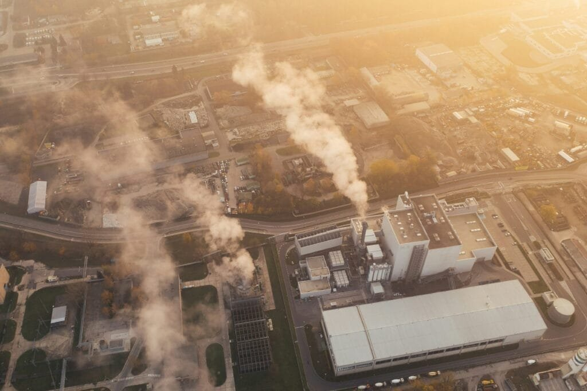

Many may not realize that sulfur dioxide, a byproduct of volcanic activity, plays a crucial role in predicting eruptions.

This unassuming gas, with its distinctive smell, acts as a silent sentinel, providing vital clues about what lies beneath the Earth's surface.

As scientists delve into the intricate relationship between sulfur dioxide emissions and volcanic behavior, a deeper understanding emerges, shedding light on the intricate mechanisms that govern these explosive events.

## Key Takeaways

- Monitoring sulfur dioxide levels is crucial for predicting volcanic eruptions accurately.
- Sulfur dioxide emissions serve as a vital indicator of impending volcanic activity.
- Understanding SO2 emission patterns enables effective eruption forecasting and risk mitigation.
- Analyzing sulfur dioxide data aids in forecasting eruptions and minimizing associated risks.

## Role of Sulfur Dioxide in Eruption Prediction

Regularly monitoring sulfur dioxide levels is essential for accurately predicting volcanic eruptions due to its direct correlation with magma movement and volcanic activity. Sulfur dioxide (SO2) emissions serve as a crucial indicator of impending volcanic eruptions, acting as an early warning system for scientists. By tracking changes in SO2 levels, researchers can monitor the gas's release from magma reservoirs beneath volcanoes, offering insights into the dynamics of volcanic activity. The increase in SO2 emissions signifies the movement of magma and the buildup of pressure within the volcano, signaling the potential for an eruption.

Understanding the patterns of SO2 emissions plays a vital role in forecasting volcanic eruptions and enabling the implementation of necessary evacuation measures to safeguard nearby communities. Volcano observatories rely on continuous monitoring of SO2 levels to assess volcanic unrest accurately. This data allows observatories to issue timely warnings, helping to mitigate the risks associated with volcanic eruptions. By closely monitoring sulfur dioxide emissions, scientists can enhance their ability to predict volcanic activity and protect lives and property from the devastating impacts of eruptions.

## Monitoring Sulfur Dioxide Levels

Monitoring sulfur dioxide levels is a critical practice in the field of volcanology, enabling the early detection of volcanic activity and the timely issuance of warnings to vulnerable populations. This monitoring involves the use of ground-based instruments like spectrometers, which can measure [sulfur dioxide concentrations in the vicinity of a volcano](https://magmamatters.com/understanding-volcanic-formation-a-comprehensive-guide/ "Understanding Volcanic Formation: A Comprehensive Guide"). Additionally, remote sensing techniques play a vital role in monitoring sulfur dioxide emissions, providing valuable data for assessing volcanic activity.

### 3 **Key Monitoring Methods**:

1. **Ground-Based Instruments:** Ground-based spectrometers are deployed near volcanoes to detect and quantify sulfur dioxide emissions accurately.
2. **Remote Sensing:** Remote sensing technologies, such as lidar and infrared sensors, are used to monitor sulfur dioxide plumes from a distance, offering a broader perspective on volcanic gas emissions.
3. **Satellite Monitoring:** Satellites equipped with sensors can track sulfur dioxide emissions on a global scale, aiding in the continuous monitoring of volcanic activity worldwide.

## Implications of Sulfur Dioxide Emissions

Detecting and analyzing sulfur dioxide emissions from [volcanic sources is crucial for understanding the environmental](https://magmamatters.com/geothermal-energy-and-its-volcanic-origins/ "Geothermal Energy and Its Volcanic Origins") and health impacts associated with these gases. Volcanic sulfur dioxide emissions significantly contribute to sulfate aerosols, impacting climate by reflecting sunlight and cooling the Earth. Moreover, these emissions are a primary source of acid rain, which can harm ecosystems and water bodies by altering soil pH levels and contaminating freshwater resources. The health hazards associated with sulfur dioxide include respiratory issues such as asthma exacerbation and other lung diseases.

In addition to volcanic emissions, human activities emit a substantial amount of sulfur dioxide annually, with pollution controls leading to decreasing trends. The monitoring of sulfur dioxide emissions, both from volcanoes and human sources, is essential for eruption forecasting and risk assessment. The U.S. Geological Survey plays a vital role in monitoring [volcanic gases like sulfur](https://magmamatters.com/the-role-of-volcanoes-in-earths-carbon-cycle-5/ "The Role Of Volcanoes In Earth’s Carbon Cycle") dioxide to provide valuable insights into volcano activity and potential eruptions. Satellite monitoring further enhances this effort by complementing ground-based measurements, aiding in the accurate assessment of sulfur dioxide emissions and their potential climate impact. Overall, understanding the implications of [sulfur dioxide](https://magmamatters.com/the-art-and-science-of-volcano-monitoring/ "The Art and Science of Volcano Monitoring") emissions is crucial for mitigating the environmental and health risks associated with these volcanic gases.

## Mitigating Hazards With Sulfur Dioxide Data

Utilizing comprehensive sulfur dioxide data aids in the effective mitigation of hazards associated with volcanic eruptions. Monitoring sulfur dioxide emissions is crucial for forecasting volcanic eruptions and understanding the potential risks they pose. By combining ground-based measurements with satellite data, scientists can obtain a comprehensive view of sulfur dioxide trends, enabling them to make informed decisions to protect both the environment and human health.

### Three Ways Sulfur Dioxide Data Helps in Mitigating Hazards:

1. **Early Warning Systems**: By monitoring sulfur dioxide emissions, early warning systems can be established to alert authorities and communities about potential volcanic eruptions. This proactive approach allows for timely evacuation plans and preparedness measures to be put in place, minimizing the impact of disasters.
2. **Environmental Impact Assessment**: Sulfur dioxide from volcanic emissions contributes significantly to the formation of sulfate aerosols, which can have adverse effects on both climate and health. By analyzing sulfur dioxide data, researchers can assess the environmental impact of volcanic activity and take steps to mitigate these effects.
3. **Long-Term Trend Analysis**: Consistency in sulfur dioxide data is essential for trend analysis and scientific research in volcano monitoring. By utilizing satellite data for sulfur dioxide monitoring over extended periods, scientists can identify patterns and changes in emissions, enhancing our understanding of volcanic activities and their potential long-term hazards.

## Case Studies of Sulfur Dioxide Signaling Eruptions

[Sulfur dioxide emissions from volcanoes](https://magmamatters.com/the-environmental-impact-of-volcanic-eruptions-2/ "The Environmental Impact of Volcanic Eruptions") have been pivotal in signaling impending eruptions in numerous case studies. By monitoring changes in sulfur dioxide levels, scientists can predict volcanic activity and potential hazards. The presence of sulfur dioxide serves as a precursor to volcanic eruptions, offering critical information for assessing risks. When there's an increase in sulfur dioxide emissions, it indicates magma movement and potential unrest within the volcano.

Analyzing sulfur dioxide data has proven instrumental in forecasting volcanic eruptions and mitigating associated risks. In the case of the 1989-1990 eruption of Redoubt Volcano in Alaska, significant increases in sulfur dioxide emissions preceded the eruption, providing an essential warning sign. Similarly, before the 1991 eruption of Mount Pinatubo in the Philippines, escalating sulfur dioxide levels indicated the movement of magma towards the surface, allowing authorities to evacuate nearby communities and minimize casualties.

These case studies highlight the importance of monitoring sulfur dioxide emissions in forecasting volcanic activity and mitigating eruption risks. By understanding the role of this volcanic gas, scientists can better prepare for potential eruptions and protect lives and property from the hazards they pose.

## Conclusion

In conclusion, sulfur dioxide plays a critical role in predicting volcanic eruptions by serving as a key indicator of impending activity. Monitoring SO2 levels is essential for issuing timely warnings and protecting vulnerable populations.

The environmental impact of SO2 emissions underscores the importance of understanding and mitigating associated hazards. Considering the potential risks and benefits, one must ask: How can we harness the power of sulfur dioxide data to safeguard lives and ecosystems from volcanic eruptions?

Related Posts: [Global Eruption Tracker: Interactive Volcano Map](https://magmamatters.com/global-eruption-tracker-interactive-volcano-map/), [The 2022 Eruption of Mauna Loa: Unleashing Nature's Fury](https://magmamatters.com/the-2022-eruption-of-mauna-loa-unleashing-natures-fury/), [Shishaldin Volcano: Alaska's Restless Giant](https://magmamatters.com/shishaldin-volcano-alaskas-restless-giant/), [Alert and Watchful: Understanding the Recent Unrest at Shishaldin Volcano](https://magmamatters.com/alert-and-watchful-understanding-the-recent-unrest-at-shishaldin-volcano/), [Unveiling the Mysteries of Volcanoes](https://magmamatters.com/unveiling-the-mysteries-of-volcanoes/)
