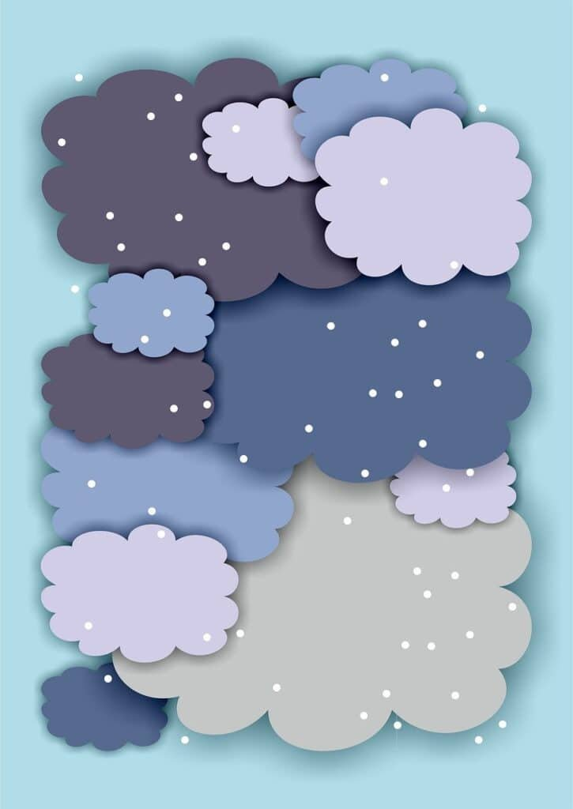
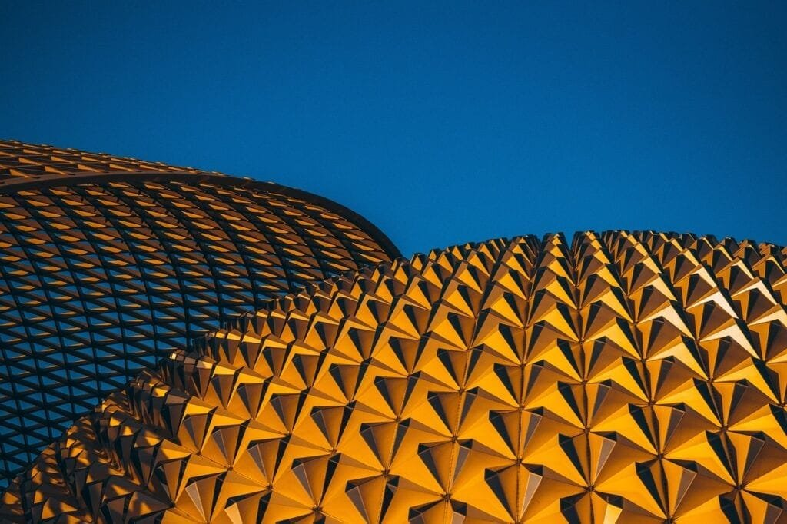
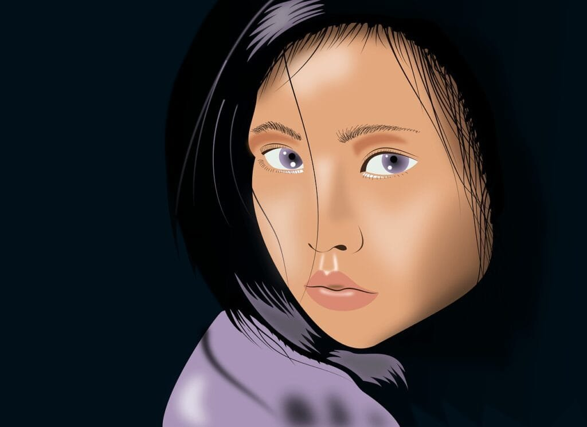

Imagine being transported into a world where volcanic eruptions are captured with breathtaking detail and precision. In this article, we will take you on a visual journey through the realm of contemporary digital art, where artists have skillfully portrayed the raw power and beauty of volcanoes. From explosive eruptions to serene landscapes dotted with lava flows, these jaw-dropping depictions will leave you in awe. So sit back, relax, and prepare to be amazed as we present to you the top 10 volcanic depictions in contemporary digital art.

<iframe width="560" height="315" src="https://www.youtube.com/embed/EzyoD19q1YQ" frameborder="0" allow="accelerometer; autoplay; encrypted-media; gyroscope; picture-in-picture" allowfullscreen></iframe>

  

## Lava Flow Illumination by Richard Davies

### Connection between the artist and the subject

In his artwork, "Lava Flow Illumination," Richard Davies showcases a deep connection with the subject of volcanic eruptions. Having grown up in an area surrounded by volcanoes, Davies developed a fascination with their raw power and beauty. This personal connection allows him to depict volcanic eruptions with a level of authenticity and emotional impact that resonates with viewers.

### Artistic techniques used to convey drama and intensity

Davies employs various artistic techniques to convey the drama and intensity of volcanic eruptions in "Lava Flow Illumination." Through his expert use of color, he creates vibrant and fiery tones that evoke a sense of heat and danger. The careful manipulation of light and shadow adds depth and dimension to the artwork, making the lava appear to glow from within. Additionally, the use of bold brushstrokes and dynamic composition enhances the sense of movement and chaos, capturing the turbulent energy of the eruption.

### Interpretation and unique element of this depiction

One unique element of "Lava Flow Illumination" is the way Davies incorporates the surrounding landscape into the artwork. By juxtaposing the raw power of the volcanic eruption with the peacefulness of the natural surroundings, Davies creates a striking contrast that highlights the destructive force of the volcano. This interpretation not only showcases the physical impact of the eruption but also invites viewers to contemplate the fragility and resilience of nature in the face of such cataclysmic events.

## Eruption from the Underworld by Rachel Rogers

### Background of Rachel Rogers

Rachel Rogers, the talented artist behind "Eruption from the Underworld," has always been captivated by the earth's geological wonders. Growing up near several active volcanoes, Rogers developed a deep appreciation for their awe-inspiring beauty. This fascination led her to pursue a career in art, where she could channel her passion for volcanoes into visually stunning creations.

### The creative process and motivation behind this piece

For "Eruption from the Underworld," Rogers drew inspiration from her firsthand experiences witnessing volcanic eruptions. She meticulously studied photographs and videos of eruptions, capturing the intricate details and nuances of the event. Rogers aimed to recreate the sense of excitement and fear that comes with witnessing such a powerful natural phenomenon. By combining her technical skills with her emotional connection to volcanoes, she was able to create a piece that truly captures the intensity and magnitude of an eruption.

### Viewers' reaction to Eruption from the Underworld

"Eruption from the Underworld" has received widespread acclaim from viewers and art critics alike. Many have praised Rogers' ability to translate the raw power of a volcanic eruption onto canvas. The vibrant colors and swirling brushstrokes create a sense of movement and energy that draws viewers into the artwork. Additionally, the juxtaposition of light and dark elements adds a level of drama and intensity to the piece. Overall, viewers are left in awe of the sheer force and beauty of nature as depicted in "Eruption from the Underworld."

This image is property of pixabay.com.

## The Fiery Wrath by Dylan Moore

### Moore's approach to symbolizing volcanic force

Dylan Moore's artwork, "The Fiery Wrath," showcases his unique approach to symbolizing volcanic force. Moore believes that [volcanoes represent the true power of nature](https://magmamatters.com/understanding-volcanic-formation-a-comprehensive-guide/ "Understanding Volcanic Formation: A Comprehensive Guide"), and he aims to capture this essence in his artwork. Through the use of bold and dynamic brushstrokes, he creates a sense of motion and energy. The fiery reds and oranges contrasted with deep blacks and grays symbolize the destructive force and intensity of volcanic eruptions.

### The meshing of traditional and digital art elements

"The Fiery Wrath" is an excellent example of Moore's skill in seamlessly blending traditional and digital art elements. He begins his creative process with traditional mediums such as painting and sketching to lay the foundation of the artwork. He then incorporates digital techniques to enhance the textures, colors, and overall composition. This fusion of traditional and digital art allows Moore to create a visually striking and immersive experience for the viewer.

### Effective ways this work promotes volcanic awareness

"The Fiery Wrath" effectively promotes volcanic awareness by evoking a visceral response from viewers. Through his bold and vivid depiction of volcanic eruptions, Moore highlights the destructive power of these [natural phenomena](https://magmamatters.com/the-art-and-science-of-volcano-monitoring/ "The Art and Science of Volcano Monitoring"). By drawing attention to the raw beauty and intensity of volcanoes, he raises awareness about the potential hazards they pose to surrounding communities. This awareness encourages viewers to educate themselves about volcanic activity and take necessary precautions to ensure their safety.

## Volcanic Nightscape by Cara Tremblay

### Tremblay's inspiration from real volcanoes

Cara Tremblay draws inspiration from real volcanoes to create her breathtaking artwork, "Volcanic Nightscape." She spends countless hours studying photographs, documentaries, and firsthand accounts of volcanic eruptions. This extensive research allows Tremblay to capture the essence and energy of these natural wonders in her artwork, infusing it with a sense of authenticity and realism.

### Strategic use of color and light

One of the standout features of "Volcanic Nightscape" is Tremblay's strategic use of color and light. By employing a rich and vibrant color palette, she effectively conveys the heat and intensity of a volcanic eruption. The careful manipulation of light and shadow adds depth and dimension to the artwork, creating a sense of realism. Through these artistic choices, Tremblay transports viewers to the heart of a volcanic eruption, immersing them in the raw power and beauty of nature.

### How the artwork reflects the artist's style

"Volcanic Nightscape" is a prime example of Cara Tremblay's signature style. Her artwork is characterized by its attention to detail and meticulous craftsmanship. Each brushstroke is deliberate and purposeful, resulting in a highly textured and layered composition. Tremblay's ability to capture the essence and [energy of volcanoes](https://magmamatters.com/geothermal-energy-and-its-volcanic-origins/ "Geothermal Energy and Its Volcanic Origins") while maintaining her unique artistic style is what sets her apart as an exceptional digital artist.

This image is property of pixabay.com.

## Magma Engulf by Leyla Aslanova

### Aslanova's engagement with volcanic energy

Leyla Aslanova's artwork, "Magma Engulf," demonstrates her deep engagement with volcanic energy. Aslanova believes that volcanic eruptions are a manifestation of raw power and energy, and she seeks to capture this intensity in her work. Through her art, she aims to evoke strong emotions and provoke contemplation about the forces of nature.

### The digital tools and techniques used

To create "Magma Engulf," Aslanova utilizes a range of digital tools and techniques. She begins by sketching and conceptualizing her ideas on a digital canvas. Aslanova then employs 3D modeling software and digital painting techniques to bring her vision to life. By combining these digital mediums, she is able to create a seamless and immersive artwork that conveys the destructive power and heat of volcanic eruptions.

### Influence of Eastern art philosophies on this piece

The influence of Eastern art philosophies is evident in "Magma Engulf." Aslanova draws inspiration from traditional Eastern art forms such as sumi-e painting and calligraphy to inform her artistic choices. The use of bold, flowing brushstrokes and the incorporation of negative space are reminiscent of these traditional art styles. Through this fusion of Eastern and digital art, Aslanova creates a striking and dynamic representation of volcanic energy.

## Mount Doom by James Eads

### Incorporation of folklore and mythology

In his artwork, "Mount Doom," James Eads incorporates elements of folklore and mythology surrounding volcanoes. Drawing inspiration from various cultural narratives, such as the volcanic eruptions in Greek mythology and the Mount Vesuvius eruption that buried Pompeii, Eads weaves together these stories to create a visually captivating and thought-provoking piece of art. By tapping into the rich history and symbolism associated with volcanoes, he invites viewers to contemplate the timeless power and significance of these natural phenomena.

### The blend of abstraction and realism

"Mount Doom" is a testament to Eads' skill in blending abstraction and realism seamlessly. He creates a dreamlike and ethereal world where the boundaries between reality and imagination blur. The use of vibrant colors and organic shapes gives the artwork an otherworldly feel, while the meticulously detailed depiction of the volcanic eruption adds a touch of realism. This juxtaposition of abstract and realistic elements creates a visually stunning and emotionally evocative artwork.

### Eads' personal connection to the depiction

Eads' personal connection to the depiction of volcanoes is evident in "Mount Doom." Having grown up near the Pacific Ring of Fire, he has witnessed firsthand the magnificent and sometimes destructive power of volcanic eruptions. This personal connection fuels his artistic expression, allowing him to capture the essence and energy of these natural phenomena in a way that resonates with viewers. Through his artwork, Eads invites viewers to tap into their own personal experiences and emotions when contemplating the power and beauty of volcanoes.

This image is property of pixabay.com.

## Sorrow Beneath the Surface by Amy Casey

### Casey's exploration of disaster and emotional turmoil

Amy Casey's artwork, "Sorrow Beneath the Surface," delves into the theme of disaster and emotional turmoil. Through her depiction of volcanic eruptions, she explores the chaos and devastation that comes with natural disasters. Casey's personal experiences with the aftermath of a volcanic eruption in her hometown influenced her artistic direction, and she seeks to convey the emotional impact and resilience of communities affected by such events.

### The emotional appeal of this rendering

"Sorrow Beneath the Surface" evokes a strong emotional response from viewers. The use of somber colors and expressive brushstrokes creates a sense of unease and melancholy. Casey's attention to detail, particularly in depicting the destruction caused by the eruption, adds a layer of realism that enhances the emotional impact of the artwork. Through her masterful technique and poignant subject matter, Casey invites viewers to empathize with the emotional toll of natural disasters.

### How Casey's other works relate to this depiction

"Sorrow Beneath the Surface" is part of a larger body of work by Amy Casey that explores themes of disaster and resilience. Casey's other works often depict scenes of destruction and chaos caused by various natural disasters. Through her art, she aims to shed light on the human experience of navigating these tumultuous events and finding hope and strength amidst the wreckage. "Sorrow Beneath the Surface" is a powerful addition to this body of work, further emphasizing Casey's dedication to exploring the emotional impact of disasters.

## Awakening the Titan by Jake Johnson

### Johnson's visualization of a volcano's magnitude

In "Awakening the Titan," Jake Johnson visualizes the magnitude and power of a volcano. Inspired by his travels to volcanic regions around the world, Johnson seeks to capture the awe and majesty of these natural wonders. Through his meticulous attention to detail and use of perspective, he conveys the sheer size and energy of volcanic eruptions, leaving viewers with a profound sense of wonder and reverence.

### Techniques used to convey awe and suspense

Johnson employs various techniques to convey a sense of awe and suspense in "Awakening the Titan." The use of dramatic lighting and contrasting colors creates a dynamic and striking composition. He strategically places elements such as human figures or architectural structures to provide scale and emphasize the immensity of the volcanic eruption. These techniques work together to evoke a range of emotions in viewers, from excitement and anticipation to fear and respect.

### Impact of this artwork in the digital art scene

"Awakening the Titan" has made a significant impact in the digital art scene, garnering attention and accolades from both critics and fellow artists. Johnson's ability to create a visually stunning and emotionally immersive experience has captivated audiences worldwide. Many digital artists have been inspired by his techniques and approach, leading to a newfound appreciation for the power of volcanic depictions in contemporary art. Through his innovative artwork, Johnson has helped push the boundaries of what is possible in the realm of digital art.

## The Silent Cry by Susanne Moe

### Moe's conveyance of the duality of volcanoes

Susanne Moe's artwork, "The Silent Cry," aims to convey the duality of volcanoes - both their destructive force and their silent beauty. Through her intricate and layered composition, Moe depicts the contrast between the fiery energy of the eruption and the calmness of the surrounding landscape. By portraying this dichotomy, she invites viewers to reflect on the complex and often paradoxical nature of natural disasters.

### The interplay of warm and cool hues

"The Silent Cry" is characterized by the interplay of warm and cool hues, further accentuating the duality of volcanoes. Moe expertly blends fiery reds and oranges with cool blues and purples to create a harmonious yet contrasting color palette. This intentional use of color evokes a sense of tension and balance, mirroring the contradictory nature of volcanic activity. Through this artistic choice, Moe conveys the emotional depth and complexity of volcanic eruptions.

### Audience reception of The Silent Cry

"The Silent Cry" has garnered a passionate and emotional response from audiences. Many viewers are drawn to the juxtaposition of conflicting elements in the artwork, finding solace and beauty in the midst of destruction. The intricate details and stunning use of color evoke a range of emotions, from awe and reverence to sadness and contemplation. Moe's ability to capture the essence of volcanoes in such a profound and thought-provoking manner has resonated with viewers and sparked conversations about the power and vulnerability of our natural world.

## Ignition Point by Lucas Kirsch

### The theme of spark and initiation in Kirsch's work

Lucas Kirsch explores the theme of spark and initiation in his artwork, "Ignition Point." Inspired by the transformative power of volcanic eruptions, Kirsch aims to capture the moment of ignition, where a small spark sets off a chain reaction that leads to a massive eruption. By focusing on this critical moment, Kirsch invites viewers to contemplate the catalysts that ignite change in their own lives.

### The use of 3D graphics and virtual reality elements

"Ignition Point" showcases Kirsch's proficiency in utilizing 3D graphics and virtual reality elements to enhance the viewer's experience. Through the use of three-dimensional modeling, Kirsch creates a dynamic and immersive artwork that allows viewers to explore the piece from different perspectives. The incorporation of virtual reality elements provides an additional layer of interactivity, enabling viewers to engage with the artwork on a deeper level. These digital tools and techniques create a visually stimulating and engaging experience for the audience.

### Kirsch's previous work experience influencing this depiction

Kirsch's previous work experience as a visual effects artist in the film industry has greatly influenced his depiction of volcanic eruptions in "Ignition Point." His expertise in creating realistic and visually stunning effects has translated seamlessly into his artwork. By drawing from his experiences working on blockbuster films, Kirsch brings a level of cinematic grandeur to his volcanic depictions. This unique perspective sets his artwork apart and contributes to the overall impact and appeal of "Ignition Point."

## Conclusion

The top 10 volcanic depictions in contemporary digital art showcased an array of artists' unique perspectives and techniques in capturing the raw power and beauty of volcanic eruptions. From Richard Davies' emotionally evocative "Lava Flow Illumination" to Susanne Moe's contemplative and dualistic "The Silent Cry," each artwork provided viewers with a glimpse into the awe-inspiring world of volcanoes. Through the skillful use of color, light, and composition, these artists successfully conveyed the drama, intensity, and emotional depth associated with these natural phenomena. Their artwork serves as a testament to the profound impact [nature](https://magmamatters.com/the-environmental-impact-of-volcanic-eruptions-2/ "The Environmental Impact of Volcanic Eruptions") has on human emotions and the importance of appreciating and preserving our planet's geological wonders.

