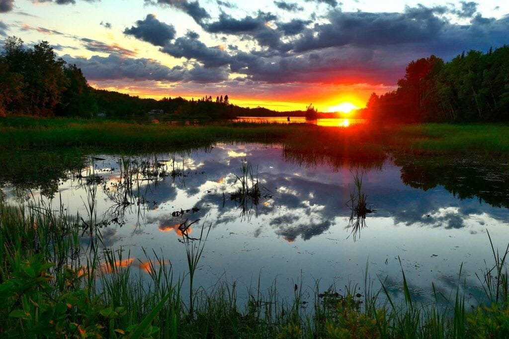
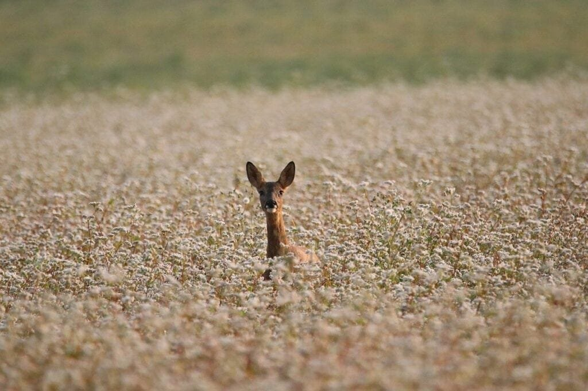

Are you ready for an adventure to explore the breathtaking biodiversity of Volcano National Park? From towering volcanoes to lush rainforests, this park is a treasure trove of unique and fascinating species. In this article, we will share with you 10 tips that will enhance your experience and help you discover the hidden wonders of this remarkable natural wonderland. Get ready to embark on a journey of discovery as you delve into the rich biodiversity of Volcano National Park.

<iframe width="560" height="315" src="https://www.youtube.com/embed/VzOrVND9VNE" frameborder="0" allow="accelerometer; autoplay; encrypted-media; gyroscope; picture-in-picture" allowfullscreen></iframe>

  

## Understanding Volcano National Park

Volcano National Park is a fascinating and unique destination that offers a wide range of experiences for nature lovers and adventure seekers alike. Before planning your visit, it's important to have a good understanding of the park's history, the types of volcanoes you'll encounter, the geographical terrain, and the unique ecological zones that make this park so special.

### A brief history of the park

Volcano National Park was established in \[insert year\] to protect the unique volcanic landscape and its diverse biodiversity. The park is located in \[insert location\], and it covers an area of \[insert size\]. Throughout its history, the park has played an important role in scientific research, providing valuable insights into the formation and behavior of volcanoes.

### Types of volcanoes in the park

Volcano National Park is home to various types of volcanoes, including \[insert types\]. Each type has its own distinctive characteristics and eruption patterns. By understanding the different types of volcanoes, you'll be able to appreciate the fascinating geological features found within the park.

### Understanding the geographical terrain

The geographical terrain of Volcano National Park is unlike anything you've ever seen before. The park's landscape is shaped by the volcanic activity that has occurred over millions of years. From rugged lava fields to lush rainforests, the park offers a diverse range of ecosystems to explore. By understanding the geographical terrain, you'll be better prepared for your visit and be able to make the most of your time in the park.

### Identifying the unique ecological zones

One of the most remarkable aspects of Volcano National Park is its diverse ecological zones. These zones are home to a wide variety of plant and animal species that have adapted to the volcanic environment. By identifying the unique ecological zones within the park, you'll be able to appreciate the incredible diversity of life that exists in this extraordinary place.

## Planning Your Visit

Now that you have a good understanding of Volcano National Park, it's time to plan your visit. There are a few things to consider before you go, including the best time of the year to visit, the essential gears you'll need for exploration, and the notable landmarks you won't want to miss.

### Best time of the year to visit

The best time to visit Volcano National Park depends on your personal preferences and what you hope to experience during your visit. \[Insert information about seasonal variations\]. By considering the time of year and the activities you're interested in, you can plan a visit that will maximize your enjoyment of the park.

### Essential gears for exploration

Exploring Volcano National Park requires the right gear to ensure your comfort and safety. Some essential items to pack include \[insert essential gears\]. By being prepared with the right gear, you'll be able to fully immerse yourself in the park's incredible landscapes and wildlife.

### Identifying notable landmarks

Volcano National Park is home to several notable landmarks that you won't want to miss. Some of these landmarks include \[insert landmark names\]. By identifying these landmarks, you can plan your visit to ensure you have enough time to explore and truly appreciate their unique features.

This image is property of pixabay.com.

## Flora of Volcano National Park

The flora of [Volcano National Park](https://magmamatters.com/geothermal-energy-and-its-volcanic-origins/ "Geothermal Energy and Its Volcanic Origins") is incredibly diverse and is a testament to the resilience of plant life in volcanic environments. From endemic plant species to the distinct tree species found in different forest habitats, there is so much to discover.

### Discovering endemic plant species

Volcano National Park is home to a range of endemic plant species that can only be found within its boundaries. These plants have adapted to the unique volcanic conditions and have developed unique characteristics that allow them to thrive. By taking the time to discover these endemic plant species, you'll gain a greater appreciation for the park's biodiversity.

### Understanding the adaptation of plants to volcanic zones

Plants in volcanic zones have evolved various strategies to survive and thrive in the harsh conditions. These adaptations include \[insert examples of plant adaptations\]. By understanding the adaptation of plants to volcanic zones, you'll gain a deeper understanding of the incredible resilience of nature.

### Exploring different forest habitats with their distinct tree species

Volcano National Park is home to a variety of forest habitats, each with its own distinct tree species. From the lush rainforests to the gnarled trees of the high-elevation forests, there is so much to explore. By taking the time to explore these different forest habitats, you'll gain a greater appreciation for the diversity of plant life within the park.

## Birdlife in the Park

The birdlife in Volcano National Park is a birdwatcher's paradise. With its unique ecological zones and diverse habitats, the park is home to a wide range of bird species. From endemic species to migratory birds, there is always something to see.

### Identifying unique bird species

Volcano National Park is home to several unique bird species that can be found nowhere else in the world. These birds have adapted to the volcanic environment and have developed distinct characteristics. By learning to identify these unique bird species, you'll be able to appreciate the park's avian diversity.

### Understanding bird migration patterns

Bird migration is a fascinating phenomenon, and Volcano National Park is an important stopover for many migratory birds. By understanding bird migration patterns, you'll gain a greater appreciation for the challenges that birds face during their long journeys.

### Bird watching best practices

When bird watching in Volcano National Park, it's important to follow some best practices to ensure the well-being of the birds and their habitats. Some best practices include \[insert bird watching best practices\]. By adopting these practices, you'll be able to enjoy bird watching while minimizing your impact on the birds and their environment.

This image is property of pixabay.com.

## Exploring the Aquatic Life

While Volcano National Park is famous for its volcanic landscapes, the park is also home to a surprising array of aquatic life. From pristine lakes to crystal-clear streams, there are plenty of opportunities to explore the park's aquatic ecosystems.

### Exploring surrounding bodies of water

Volcano National Park is surrounded by several bodies of water, including \[insert bodies of water\]. These bodies of water provide habitats for various aquatic species and offer opportunities for activities such as swimming and fishing. By exploring the surrounding bodies of water, you'll gain a greater appreciation for the interconnectedness of the park's ecosystems.

### Understanding aquatic life adapted to volcanic conditions

The aquatic life in Volcano National Park has adapted to the unique conditions created by volcanic activity. Some examples of aquatic life adapted to volcanic conditions include \[insert examples\]. By understanding how aquatic life has adapted, you'll gain a deeper appreciation for the resilience of nature.

### Identifying unique aquatic species

The bodies of water in Volcano National Park are home to several unique aquatic species. These species have evolved in isolation and have developed distinct characteristics. By identifying these unique aquatic species, you'll gain a greater understanding of the park's biodiversity.

## The Park's Mammals

While the volcanic landscapes of Volcano National Park may not seem like ideal habitats for mammals, the park is home to a surprising variety of mammal species. From small rodents to larger predators, there is always a chance to spot these elusive creatures.

### Identifying unique mammal species

Volcano National Park is home to several unique mammal species that have adapted to the volcanic environment. Some examples of these unique mammal species include \[insert examples\]. By learning to identify these unique mammal species, you'll be able to appreciate the park's mammalian diversity.

### Understanding mammalian adaptability to volcanic environments

Mammals in volcanic environments have evolved various adaptations to survive and thrive. These adaptations include \[insert examples of mammalian adaptations\]. By understanding the adaptability of mammals to volcanic environments, you'll gain a deeper appreciation for the resilience of nature.

### Night-time mammal spotting

Many mammals in Volcano National Park are nocturnal, meaning they are most active at night. Night-time mammal spotting offers a unique opportunity to observe these creatures in their natural habitat. By following best practices for night-time mammal spotting, you'll increase your chances of spotting these elusive creatures.

This image is property of pixabay.com.

## Reptiles and Amphibians of the Park

While often overshadowed by the park's volcanic landscapes, the reptiles and amphibians of Volcano National Park play a crucial role in the park's ecosystem. From rare reptile species to the adaptations of amphibians to volcanic zones, there is much to discover.

### Spotting rare reptile species

Volcano National Park is home to several rare reptile species that are found only in this unique ecosystem. \[Insert examples of rare reptile species\]. By keeping an eye out for these rare reptile species, you'll have the opportunity to witness the incredible biodiversity of the park.

### Understanding amphibian adaptation to volcanic zones

Amphibians in volcanic zones have evolved various adaptations to survive in these harsh environments. These adaptations include \[insert examples of amphibian adaptations\]. By understanding the adaptations of amphibians to volcanic zones, you'll gain a deeper appreciation for the incredible diversity of life in the park.

### Examining the role of reptiles and amphibians in the ecosystem

Reptiles and amphibians play a crucial role in the ecosystem of Volcano National Park. They help control populations of insects and other invertebrates and serve as an important food source for larger predators. By examining the role of reptiles and amphibians in the ecosystem, you'll gain a greater understanding of the interconnectedness of life within the park.

## Invertebrates of Volcano National Park

While often overlooked, the invertebrates of Volcano National Park are vital to the park's ecological balance. From unique insect species to the role of invertebrates in the food chain, there is much to discover about these small but important creatures.

### Identifying unique insect species

Volcano National Park is home to a wide variety of unique insect species, each with its own fascinating characteristics. From colorful butterflies to industrious ants, there is something to captivate everyone's interest. By identifying these unique insect species, you'll gain a greater appreciation for the incredible biodiversity of the park.

### Exploring the vital role of insects in the ecological balance

Insects play a vital role in maintaining the ecological balance of Volcano National Park. They help pollinate plants, break down organic matter, and provide a food source for other animals. By exploring the vital role of insects in the park's ecological balance, you'll gain a deeper understanding of the interconnectedness of life within the park.

### Discovering the role of invertebrates in the food chain

Invertebrates serve as an important link in the park's food chain, providing a food source for many other species. From spiders capturing insects to larger predators hunting invertebrates, the role of invertebrates in the food chain is essential. By discovering the role of invertebrates in the food chain, you'll gain a greater appreciation for the complex web of life within the park.

## Exploring Cryptogamic Flora

The cryptogamic flora of Volcano National Park may not be as eye-catching as the park's towering volcanoes, but they play a vital role in the park's ecosystem. From lichens to mosses, there is much to discover about these often overlooked organisms.

### Understanding the importance of lichens and mosses

Lichens and mosses may be small in size, but they play a crucial role in maintaining the park's ecological balance. They help stabilize volcanic soils, provide habitat for other organisms, and contribute to nutrient cycling. By understanding the importance of lichens and mosses, you'll gain a greater appreciation for the often overlooked aspects of the park's biodiversity.

### Spotting various cryptogamic species

Volcano National Park is home to a variety of cryptogamic species, each with its own unique characteristics. From crustose lichens to cushion mosses, there is much to discover about these fascinating organisms. By spotting various cryptogamic species, you'll gain a deeper understanding of the diversity of life within the park.

### Exploring the role of cryptogamic flora in the ecosystem

Cryptogamic flora plays a crucial role in the ecosystem of Volcano National Park. They help conserve water, reduce erosion, and provide a habitat for other organisms. By exploring the role of cryptogamic flora in the park's ecosystem, you'll gain a greater appreciation for the interconnectedness of life within the park.

## Preserving the Biodiversity of Volcano National Park

As visitors to Volcano National Park, it's important that we do our part to preserve its incredible biodiversity. By understanding the impact of human activities on biodiversity, following best practices during our visits, and getting involved in conservation efforts, we can help ensure the park's natural wonders are protected for future generations to enjoy.

### Understanding human impact on biodiversity

Human activities can have a significant impact on the biodiversity of Volcano National Park. Things like habitat destruction, pollution, and the introduction of invasive species can disrupt the delicate balance of the park's ecosystems. By understanding the impact of human activities on biodiversity, we can work towards minimizing these impacts and preserving the park's natural wonders.

### Best practices for minimizing impact during visits

When visiting Volcano National Park, there are several best practices we can follow to minimize our impact on the park's biodiversity. Some of these best practices include \[insert best practices\]. By adopting these practices, we can help ensure that the park's natural wonders remain intact for future generations.

### Getting involved in conservation efforts

There are several ways we can get involved in conservation efforts at Volcano National Park. This can include volunteering with local conservation organizations, participating in citizen science projects, or supporting initiatives that aim to protect the park's biodiversity. By getting involved in conservation efforts, we can make a meaningful difference in preserving the park's natural wonders.

In conclusion, Volcano National Park offers a wealth of opportunities for exploration and discovery. By understanding the park's history, its unique ecological zones, and the diversity of life within its boundaries, you'll be able to make the most of your visit. Remember to plan your visit accordingly, be mindful of the impact of human activities on the park's biodiversity, and consider getting involved in conservation efforts. With its stunning landscapes, diverse flora and fauna, and fascinating geological features, [Volcano National Park is a true natural](https://magmamatters.com/the-art-and-science-of-volcano-monitoring/ "The Art and Science of Volcano Monitoring") wonder that deserves our admiration and protection.

