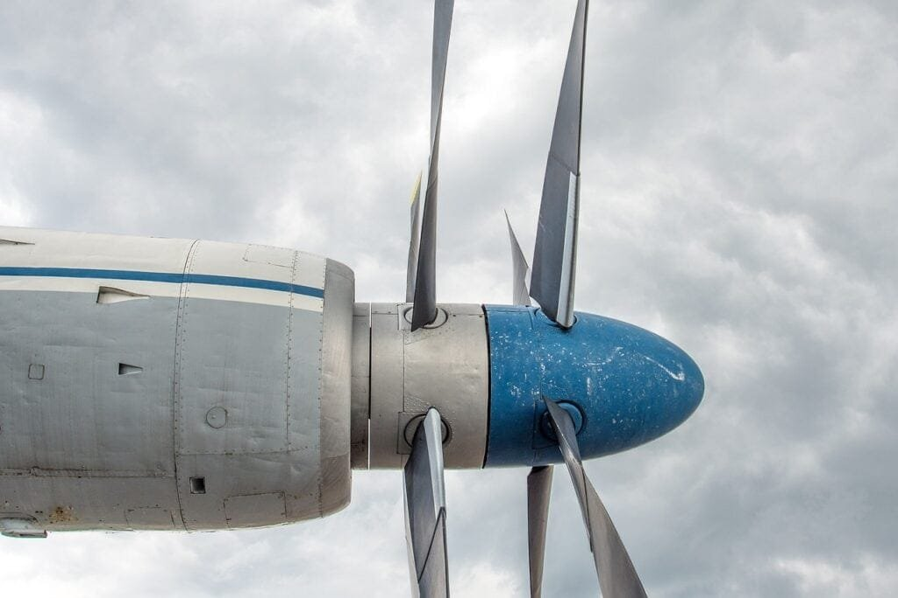

Imagine flying through the sky, enjoying the breathtaking views down below, when suddenly, your aircraft encounters a volcanic ash cloud. Sounds like a nightmare, right? Well, fear not! In this article, we will provide you with 10 invaluable tips on how to protect your aircraft from volcanic ash damage. From understanding the different types of volcanoes to mitigating the risks associated with eruptions, we've got you covered. So fasten your seatbelt and get ready to learn how to keep your aircraft safe and sound amidst the fiery fury of Mother [Nature](https://magmamatters.com/the-art-and-science-of-volcano-monitoring/ "The Art and Science of Volcano Monitoring").

<iframe width="560" height="315" src="https://www.youtube.com/embed/1iF1bQIj8fk" frameborder="0" allow="accelerometer; autoplay; encrypted-media; gyroscope; picture-in-picture" allowfullscreen></iframe>

  

## Understanding the Impact of Volcanic Ash on Aircraft

### Potential hazards of volcanic ash for aircraft systems

Volcanic ash poses significant risks to aircraft systems. When volcanic eruptions occur, they release ash particles into the atmosphere, which can cause severe damage to aircraft engines and vital components. The fine particles of volcanic ash can be carried by the wind over long distances, posing a threat to aircraft even when they are not in the immediate vicinity of the volcano. The abrasive [nature of volcanic](https://magmamatters.com/the-environmental-impact-of-volcanic-eruptions-2/ "The Environmental Impact of Volcanic Eruptions") ash can erode engine components, leading to engine failure. Additionally, the high temperatures within an aircraft engine can cause the ash particles to melt, forming a glassy substance that can block fuel nozzles and air intakes.

### Past emergencies involving aircraft and volcanic ash

The history of aviation is not without its share of emergencies caused by encounters with volcanic ash. In 1982, a British Airways flight experienced all four engines failing simultaneously after flying through an ash cloud from the eruption of Mount Galunggung in Indonesia. The aircraft managed to restart its engines and make an emergency landing, but not without enduring significant damage. Several other incidents since then have highlighted the dangers posed by volcanic ash, emphasizing the need for proper preparation and precautions when operating in areas prone to volcanic activity.

### Warning signs of volcanic ash encounters

To minimize the risks associated with volcanic ash encounters, it is crucial for pilots and airlines to familiarize themselves with the warning signs. These signs include visual cues such as noticeable changes in the color of the sky, the presence of dark or dense clouds with a distinct smell of sulfur, and lightning activity within the cloud. Additionally, pilots may also rely on data from weather radar systems that can detect the presence of ash clouds. By recognizing these warning signs, pilots can take appropriate actions to avoid volcanic ash encounters and ensure the safety of their aircraft and passengers.

## Staying Informed About Volcanic Activity

### Importance of real-time monitoring

Real-time monitoring of volcanic activity is essential for staying informed about potential volcanic ash hazards. Volcanic eruptions can occur with little to no warning, making it crucial to have a robust monitoring system in place. This involves the use of various tools and techniques, including seismic monitoring, gas emission measurements, and satellite observations. By continuously monitoring volcanic activity, meteorological centers can provide timely updates and warnings to aviation authorities and pilots, enabling them to make informed decisions regarding flight operations.

### Understanding the role of meteorological centers in delivering updates

Meteorological centers play a crucial role in collecting and analyzing data related to volcanic activity. These centers work closely with volcanic observatories, geophysical institutes, and other relevant organizations to gather comprehensive information on volcanic eruptions. Once the data is collected and analyzed, meteorologists provide updates to aviation authorities and pilots. These updates include information about the location and size of volcanic ash clouds, as well as the projected movement and dispersion of these clouds. By relying on the expertise of meteorological centers, pilots can make informed decisions to ensure the safety of their aircraft and passengers.

### Making use of relevant online resources and alerts

In addition to real-time monitoring, it is important for pilots and airlines to make use of relevant online resources and alerts. Several organizations and agencies provide valuable information about volcanic activity and its potential impact on aviation. Websites such as the International Civil Aviation Organization (ICAO) and the Volcanic Ash Advisory Centers (VAACs) offer comprehensive updates, maps, and forecasts related to volcanic ash hazards. Furthermore, pilots can subscribe to email alerts and notifications to receive timely information about volcanic activity in specific regions. By utilizing these resources, pilots can stay informed and make proactive decisions to avoid volcanic ash encounters.

This image is property of pixabay.com.

## Adhering Strictly to Aviation Safety Legislation

### Overview of legal requirements

Aviation safety legislation plays a vital role in ensuring the protection of aircraft from volcanic ash damage. Various aviation authorities, such as the Federal Aviation Administration (FAA) in the United States and the European Union Aviation Safety Agency (EASA) in Europe, have established specific regulations and guidelines to address volcanic ash hazards. These regulations include requirements for aircraft operators to conduct risk assessments, develop procedures for avoiding volcanic ash encounters, and adhere to specific flight restrictions during periods of volcanic activity. By complying with these legal requirements, airlines can minimize the risks associated with volcanic ash and prioritize the safety of their operations.

### Understanding NO FLY zones

During periods of volcanic activity, aviation authorities may designate certain areas as "NO FLY" zones to minimize the risks posed by volcanic ash. These zones are established based on the projected movement and dispersion of ash clouds, as well as the severity of the volcanic eruption. Pilots are strictly prohibited from entering these zones to ensure the safety of their aircraft and passengers. It is crucial for pilots to stay updated on the latest information regarding NO FLY zones and plan their routes accordingly. By adhering to these restrictions, pilots can avoid potentially hazardous encounters with volcanic ash.

### Benefitting from Restricted Airspace implemented during volcanic activity

In addition to NO FLY zones, aviation authorities may also implement restricted airspace during volcanic activity. Restricted airspace allows for controlled operations in areas where volcanic ash concentrations are lower, but still pose some level of risk. Pilots operating within these restricted areas must adhere to specific procedures and guidelines to ensure their safety. By utilizing restricted airspace, pilots can maintain some level of operational flexibility while minimizing the risks associated with volcanic ash encounters. Close collaboration between aviation authorities and pilots is crucial to effectively implement and navigate restricted airspace during volcanic events.

## Optimal Air Route Planning

### Re-routing as a preventive measure

When faced with the potential threat of encountering volcanic ash, re-routing becomes an essential preventive measure. By carefully analyzing meteorological data, ash cloud forecasts, and guidance from aviation authorities, pilots can plan alternative flight paths to avoid areas of volcanic activity and minimize the risk of ash encounters. This may involve redirecting the flight along pre-determined routes or altering the altitude of the aircraft to stay above or below ash clouds. Re-routing allows pilots to maintain the safety of their aircraft and passengers while still reaching their intended destinations.

### Implementing contingency plans

Contingency plans are crucial for ensuring the safety and efficiency of flight operations in the event of encountering volcanic ash. Airlines should develop robust contingency plans that outline the necessary steps to be taken when faced with a volcanic ash encounter. These plans should include procedures for communication between the flight crew and ground personnel, as well as guidelines for diverting to alternate airports if necessary. By implementing well-defined contingency plans, pilots can respond effectively to unexpected encounters with volcanic ash and minimize the potential risks.

### In-flight changes to flight paths to avoid volcanic ash

In some cases, pilots may need to make real-time adjustments to their flight paths to avoid volcanic ash encounters. This requires close communication with air traffic control, as well as continuous monitoring of meteorological updates and guidance from aviation authorities. Pilots may need to deviate from their planned route to steer clear of ash clouds, making real-time decisions to ensure the safety of their aircraft and passengers. By actively monitoring the situation and being prepared to make in-flight changes, pilots can navigate safely through potentially hazardous conditions and avoid encounters with volcanic ash.

This image is property of pixabay.com.

## Proactive Maintenance and Pre-Flight Checks

### Routine checks of aircraft for volcanic ash residue

Regular pre-flight checks and routine maintenance procedures are essential for detecting and managing any volcanic ash residue on aircraft. These checks involve thorough inspections of critical areas, such as the engines, air intakes, and fuel nozzles, to identify the presence of ash particles or the formation of glassy substances resulting from melted ash. Any signs of ash residue must be promptly addressed, and the affected areas cleaned or repaired to ensure the continued safe operation of the aircraft. By conducting these routine checks, airlines can maintain the airworthiness of their aircraft and minimize the risks associated with volcanic ash encounters.

### Importance of regular engine maintenance

Given the potential damage that volcanic ash can cause to aircraft engines, regular engine maintenance plays a vital role in protecting against ash-related issues. This includes regular inspections, cleaning procedures, and the monitoring of engine performance indicators. Special attention should be given to the engine blades, which are particularly susceptible to erosion and damage from abrasive ash particles. Regular maintenance practices, such as removing loose debris and ash residue, can help prevent issues before they escalate, ensuring the reliability and safety of aircraft engines. By prioritizing regular engine maintenance, airlines can proactively manage the impact of volcanic ash on their aircraft.

### Indicators of potential damage due to volcanic ash

Pilots and maintenance crews should be trained to recognize potential indicators of damage caused by volcanic ash. These indicators can include unusual engine performance, such as increased vibrations or fluctuations in engine parameters, as well as visual cues like a sudden increase in exhaust gas temperature or abnormal smoke emissions. Any signs of damage or performance deviations should be reported and thoroughly investigated by maintenance personnel. By actively monitoring and addressing these indicators, airlines can identify and prevent potential issues arising from volcanic ash encounters, enhancing the overall safety of their operations.

## Use of Onboard Satellite Technology

### Making the most of real-time reporting systems

Onboard satellite technology, such as the Automatic Dependent Surveillance–Broadcast (ADS-B) system, provides real-time reporting of aircraft position, altitude, and other crucial data. By utilizing this technology, pilots can receive up-to-date information about volcanic ash hazards directly in the cockpit. Real-time reporting systems allow pilots to adjust their flight paths or altitudes promptly to avoid potential encounters with volcanic ash. This technology, coupled with accurate meteorological data and guidance from aviation authorities, empowers pilots to make informed decisions and take proactive measures to protect their aircraft and passengers.

### Understanding the role of weather radars

Weather radars installed onboard aircraft are valuable tools for detecting and navigating around weather phenomena, including volcanic ash clouds. These radars emit radio waves that interact with precipitation particles, providing pilots with real-time information about the location and intensity of weather systems. By interpreting the radar data, pilots can identify and avoid areas potentially contaminated by volcanic ash. However, it is important to note that weather radars may not detect fine ash particles accurately, emphasizing the need for pilots to rely on a combination of resources and information when making decisions to avoid volcanic ash.

### Leveraging infrared sensors to detect ash clouds

Infrared sensors are another essential [technology that can aid in the detection of volcanic](https://magmamatters.com/geothermal-energy-and-its-volcanic-origins/ "Geothermal Energy and Its Volcanic Origins") ash clouds. These sensors can detect the thermal radiation emitted by volcanic ash particles, allowing pilots to identify the presence of ash even when it is not visible to the naked eye or traditional radar systems. By leveraging infrared sensors, pilots can enhance their ability to detect and avoid ash clouds, reducing the risks associated with volcanic ash encounters. The integration of advanced sensor technologies into aircraft systems further improves the overall safety of flight operations in volcanic areas.

This image is property of pixabay.com.

## Advanced Pilot Training and Preparedness

### Significance of simulating volcanic ash encounters

Advanced pilot training programs should include simulations of volcanic ash encounters to familiarize pilots with the challenges and potential risks posed by volcanic ash. These simulations can be conducted in flight simulators, recreating realistic scenarios that require pilots to make critical decisions and react appropriately. By providing pilots with the opportunity to practice and refine their skills in handling volcanic ash encounters, airlines can enhance their preparedness and ensure that pilots are equipped to make informed decisions that prioritize safety.

### Recognizing warning signs of volcanic ash encounters

Pilots should undergo training to recognize the warning signs of volcanic ash encounters. This includes understanding the visual cues associated with volcanic ash clouds, such as changes in sky color, distinct smells, and lightning activity. Training should also cover the interpretation of meteorological data and updates provided by meteorological centers and aviation authorities. By training pilots to recognize these warning signs, airlines can facilitate early detection of volcanic ash hazards and enable pilots to take appropriate actions to avoid encounters.

### Knowing actions to take when encounter is unavoidable

Despite the best efforts to avoid volcanic ash encounters, there may be instances when pilots cannot entirely avoid flying through a volcanic ash cloud. In such situations, it is crucial for pilots to be trained on the appropriate actions to take. This includes reducing the aircraft's speed to minimize the damage caused by ash ingestion, activating the engine anti-ice systems to prevent the formation of glassy substances, and notifying air traffic control about the encounter. By equipping pilots with the knowledge and skills to handle unavoidable encounters, airlines can effectively manage the potential risks associated with volcanic ash.

## Post-flight Inspection and Recovery Procedures

### Steps in conducting thorough post-flight inspections

After encountering volcanic ash, airlines must conduct thorough post-flight inspections to assess any potential damage to the aircraft. This involves close examination of critical areas, such as the engines, air intakes, and control surfaces, for the presence of ash residue or any related issues. Additionally, inspections should include a comprehensive review of engine performance data and visual inspections of the exterior surfaces. Prompt reporting of any damage or abnormalities is crucial to initiate appropriate maintenance actions and ensure the continued airworthiness of the aircraft.

### Identifying and managing ash induced damage

During post-flight inspections, it is essential to identify and manage any damage caused by volcanic ash. This can include erosion of engine components, clogging of air filters, or even structural damage to the aircraft. If any damage is detected, maintenance crews must follow specific repair and cleaning procedures outlined by aircraft manufacturers and maintenance manuals. Swift action is necessary to prevent further damage and to restore the affected areas to their optimal condition. By effectively managing ash-induced damage, airlines can minimize the impact on their operations and avoid potential safety risks.

### Long-term recovery procedures for aircraft affected by volcanic ash

In some cases, aircraft may require long-term recovery procedures following encounters with volcanic ash. This can involve extensive inspections, repair work, or even engine replacements depending on the severity of the damage. Airlines should collaborate closely with aircraft manufacturers and maintenance facilities to develop comprehensive recovery plans tailored to each specific case. These plans should prioritize safety and aim to restore the affected aircraft to a fully airworthy condition. By following established recovery procedures, airlines can effectively manage the long-term impact of volcanic ash encounters and ensure the continued safety of their operations.

## Exploring New Technologies and Protective Measures

### Innovations aimed at reducing ash cloud effects

Continued research and development efforts are focused on exploring innovative technologies aimed at reducing the effects of ash clouds on aircraft. This includes the development of specialized filters and barrier systems that can prevent ash particles from entering critical areas of the aircraft. Additionally, advancements in engine design and materials are being pursued to enhance resistance to ash ingestion and erosion. By investing in these technological advancements, airlines can further safeguard their aircraft and passengers from the potential hazards of volcanic ash encounters.

### Engine technologies designed for ash resistance

Engine manufacturers are continuously working on developing technologies that enhance the resistance of aircraft engines to volcanic ash. This includes improved blade coatings, alternative materials, and advanced filtration systems. These advancements aim to minimize the erosive impact of ash particles on engine components while maintaining optimal engine performance. By utilizing engines specifically designed for ash resistance, airlines can better protect their aircraft from the damaging effects of volcanic ash and ensure the reliability of their operations in volcanic areas.

### Investing in ash-protective coatings for aircraft components

Another area of focus in protecting aircraft from volcanic ash damage is the development of ash-protective coatings for various components. These coatings act as a barrier, preventing ash particles from adhering to critical surfaces, such as windshields, sensors, and airfoil sections. By investing in these coatings, airlines can minimize the risk of damage caused by ash, reduce maintenance requirements, and enhance the overall safety and longevity of their aircraft. Ongoing research and advancements in this field hold great potential for further improving the protection of aircraft from volcanic ash.

## Encouraging Global Cooperation and Research

### Sharing experiences and best practices

Global cooperation and the sharing of experiences and best practices are crucial for enhancing the understanding of volcanic ash impacts on aircraft. Airlines, aviation authorities, and research institutions must collaborate to exchange knowledge and lessons learned from volcanic ash encounters. This collaboration can lead to the development of improved procedures, technologies, and guidelines that enhance aviation safety in areas prone to volcanic activity. By actively participating in these cooperative efforts, stakeholders can contribute to a safer and more resilient aviation industry.

### Continued research on the impact of volcanic ash on aircraft

The impact of volcanic ash on aircraft is an ongoing area of research. Scientists, engineers, and aviation experts constantly strive to deepen their understanding of the behavior of volcanic ash particles and their effects on aircraft systems. This research involves laboratory experiments, field observations, and computer simulations, all aimed at improving prediction models and risk assessment methodologies. Continued research ensures that aviation safety guidelines and procedures remain up-to-date and effective in mitigating the risks associated with volcanic ash encounters.

### Supporting international volcanic ash monitoring networks

International volcanic ash monitoring networks play a pivotal role in providing accurate and timely information related to volcanic activity. Supporting these networks through financial contributions and sharing of resources enables the collection and dissemination of critical data regarding volcanic ash hazards. By actively participating in and supporting these efforts, airlines demonstrate their commitment to aviation safety and the protection of their aircraft and passengers. Cooperation and collaboration among international volcanic ash monitoring networks foster a collective approach to volcanic ash management and ensure the sharing of valuable information across borders.

In conclusion, understanding the impact of volcanic ash on aircraft and implementing effective measures to mitigate risks are crucial for aviation safety. By staying informed about volcanic activity, adhering strictly to aviation safety legislation, planning optimal air routes, conducting proactive maintenance and pre-flight checks, utilizing onboard satellite technology, providing advanced pilot training, and implementing thorough post-flight inspection and recovery procedures, airlines can protect their aircraft from volcanic ash damage and prioritize the safety of their operations. Furthermore, exploring new technologies and protective measures, encouraging global cooperation and research, and supporting international volcanic ash monitoring networks will contribute to the overall resilience of the aviation industry in the face of volcanic hazards.

