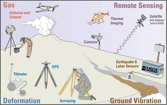
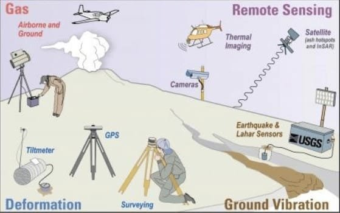

Are you fascinated by the power and unpredictability of volcanoes? Do you want to learn how scientists can predict volcanic activity and reduce the risks associated with eruptions? In this article, we will explore seven techniques that experts use to forecast volcanic activity. By understanding the signs and signals that indicate an impending eruption, scientists are able to provide early warnings and help protect communities living near volcanoes. From monitoring volcanic gases to studying seismic activity, these methods play a crucial role in keeping people safe and minimizing the damage caused by volcanic eruptions. So, let's dive into the world of [volcanic predictions and discover the fascinating science](https://magmamatters.com/geothermal-energy-and-its-volcanic-origins/ "Geothermal Energy and Its Volcanic Origins") behind it all.

<iframe width="560" height="315" src="https://www.youtube.com/embed/VvLZmY7cicM" frameborder="0" allow="accelerometer; autoplay; encrypted-media; gyroscope; picture-in-picture" allowfullscreen></iframe>

  

## Ground Deformation Tracking

Ground deformation tracking plays a crucial role in monitoring and predicting volcanic eruptions. This technique involves using satellite imagery to assess changes in the shape and elevation of the ground surrounding a volcano. By analyzing these deformations, scientists can gain insights into the movement of magma beneath the surface and the potential for an eruption.

Satellite imagery allows for the continuous monitoring of ground swelling or subsidence, providing valuable data that can help identify patterns and trends. By comparing images taken at different times, scientists can track the rate and direction of ground deformation, enabling them to make more accurate predictions about volcanic activity.

## Seismic Monitoring

Seismic monitoring is another effective method used to predict volcanic eruptions. By monitoring earthquake patterns, scientists can gather information about the movement of magma and identify precursors to an eruption. This technique involves the use of seismographs, which record ground vibrations caused by seismic activity.

Seismic monitoring allows scientists to distinguish between regular seismic activity and volcanic tremors. The unique patterns and characteristics of volcanic tremors help scientists identify when magma is moving beneath the surface. Real-time monitoring with seismographs provides valuable data that can be used to assess the likelihood of an eruption and issue timely warnings.

This image is property of d9-wret.s3.us-west-2.amazonaws.com.

## Gas Emissions Measurement

Tracking changes in gas emissions is a vital tool in predicting volcanic eruptions. Volcanoes release various gases, including [sulfur dioxide and carbon](https://magmamatters.com/the-art-and-science-of-volcano-monitoring/ "The Art and Science of Volcano Monitoring") dioxide, which can provide important clues about the state of the volcano. By continuously monitoring gas emissions, scientists can detect changes in concentration and ratios that may indicate an impending eruption.

Gas sensors are commonly used to measure and analyze gas emissions. These sensors can be installed in and around a volcano to gather data in real-time. Interpreting the variations in gas ratios helps scientists understand the volcanic processes occurring beneath the surface and can provide insight into eruption prediction.

## Thermal and Visual Monitoring

Thermal and visual monitoring techniques enable scientists to observe changes in temperature, lava flow, and volcanic emissions. Infrared cameras are used to capture heat signatures and track the movement of lava and other materials. By analyzing these thermal images, scientists can gather valuable information about volcanic activity.

Visual monitoring involves observing changes in the shape of the volcano and its emissions using cameras and telescopes. This method allows scientists to visually track the development of ash clouds and other volcanic phenomena. In combination with satellite imagery, visual monitoring provides a comprehensive view of the volcano's behavior.

This image is property of www.frontiersin.org.

## Geochemical Monitoring

Geochemical monitoring involves studying changes in the composition of gases and liquids expelled by a volcano. By collecting samples and analyzing their geochemical makeup, scientists can gain insights into the volcanic processes occurring beneath the surface. This data helps identify potential eruption triggers and provides valuable information for eruption prediction.

Assessing spatial and temporal variations in geochemistry is crucial for understanding volcanic behavior. By monitoring changes in gas and liquid compositions over time, scientists can detect shifts that may indicate an impending eruption. The interpretation of geochemical data plays a significant role in predicting volcanic activity and mitigating the associated risks.

## Hydrologic Monitoring

Hydrologic monitoring focuses on changes in local water systems near a volcano. This technique involves monitoring changes in water table levels, as well as observing temperature and chemical changes in nearby water bodies. The hydrological changes near a volcano can provide important clues about volcanic activity.

Monitoring water activity can help scientists identify potential volcanic hazards such as lahars, which are mudflows caused by volcanic eruptions. By correlating changes in water activity with possible volcanic activities, scientists can better understand the dynamics of the volcano and improve eruption prediction.

This image is property of fastercapital.com.

## Use of Historical Data and Physical Models

Historical data and physical models are essential tools for predicting volcanic activity. By studying past patterns of volcanic eruptions, scientists can identify recurring trends and develop models based on this information. Understanding how volcanoes have behaved in the past can provide valuable insights into their future behavior.

Developing and refining physical models based on historical data allows scientists to simulate potential eruptions and better understand the dynamics of volcanic systems. These models can help predict the behavior of different types [of volcanoes](https://magmamatters.com/understanding-volcanic-formation-a-comprehensive-guide/ "Understanding Volcanic Formation: A Comprehensive Guide") and inform emergency response plans.

## Utilization of Advanced Technology

The utilization of advanced technology has revolutionized volcanic activity prediction. Drones, for example, have become valuable tools for real-time observation of secluded or dangerous areas. They can capture high-resolution images and videos, providing scientists with up-to-date information about volcanic behavior.

Artificial Intelligence (AI) is also being incorporated into the analysis of volcanic data. AI algorithms can analyze large quantities of data quickly and identify patterns that may be missed by human observers. This technology improves prediction accuracy and allows for more proactive measures.

Satellite technology has greatly enhanced global monitoring capabilities. Satellites equipped with various sensors can capture data from different parts of the world, providing a comprehensive view of volcanic activity. This global perspective allows scientists to identify potential volcanic threats and issue appropriate warnings.

This image is property of assets.pnsn.org.

## Role of Volcano Observatories

Volcano observatories play a critical role in monitoring and predicting volcanic activity. These institutions collate data from various monitoring methods, including ground deformation, seismic activity, gas emission measurements, and more. By integrating data from multiple sources, scientists can gain a comprehensive understanding of volcanic behavior.

In addition to data analysis, volcano observatories play a vital role in communicating with local authorities for disaster preparedness. They provide regular updates on volcanic activity, issue warnings, and guide emergency response efforts. [Volcano observatories also play an important role in public education](https://magmamatters.com/the-environmental-impact-of-volcanic-eruptions-2/ "The Environmental Impact of Volcanic Eruptions") and engagement, raising awareness about potential volcanic threats and promoting disaster preparedness.

## Mitigation and Preparedness Strategies

In order to minimize the risks associated with volcanic eruptions, mitigation and preparedness strategies are crucial. Developing evacuation and emergency response plans is essential for ensuring the safety of surrounding communities. These plans should consider factors such as population density, transportation routes, and evacuation procedures.

Constructing protective structures, such as lava channels, can help divert the flow of lava away from densely populated areas. These structures can be designed to withstand extreme heat and pressure, providing a measure of protection against the destructive forces of volcanic eruptions.

Community education and engagement are essential components of disaster preparedness. By raising awareness about potential volcanic hazards and promoting safety measures, communities can better respond to volcanic threats. Public education programs, drills, and community engagement initiatives play a vital role in ensuring the readiness of individuals and communities in the face of volcanic eruptions.

In conclusion, understanding and predicting volcanic activity is essential for minimizing the risks posed by volcanic eruptions. Through techniques such as ground deformation tracking, seismic monitoring, gas emissions measurement, thermal and visual monitoring, geochemical monitoring, hydrologic monitoring, and the utilization of advanced technology, scientists can gather crucial data to inform eruption predictions. By analyzing historical data, developing physical models, and utilizing advanced technology, scientists can enhance their ability to forecast volcanic activity accurately. The role of volcano observatories, along with mitigation and preparedness strategies, further contribute to minimizing the impact of volcanic eruptions on surrounding communities. Through a combination of comprehensive monitoring and preparedness efforts, scientists and communities can work together to mitigate the risks and ensure the safety of those living in volcanic regions.

