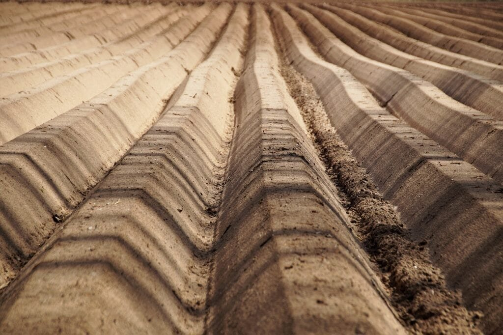
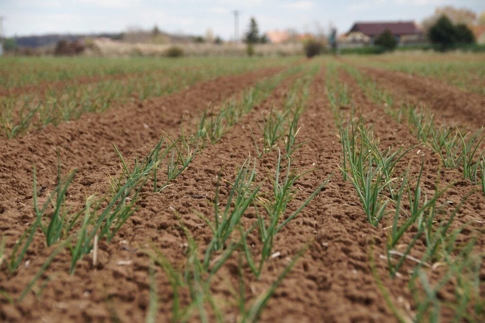

Are you looking for a natural and effective way to boost the fertility of your soil? Look no further than the power of volcanic ash! Volcanoes, with their eruptions of lava and ash, not only shape the earth's surface but also provide valuable nutrients to the soil. In this comprehensive guide, we will explore how volcanic ash can enhance your soil's fertility, resulting in healthier and more productive crops. From the various types of volcanoes to understanding their eruption patterns, we will delve into the science behind this natural phenomenon. So, get ready to discover the remarkable benefits of using volcanic ash to nourish your soil and unlock its full potential. Let's begin our journey to a more fruitful garden!

<iframe width="560" height="315" src="https://www.youtube.com/embed/4_bTmkpie2k" frameborder="0" allow="accelerometer; autoplay; encrypted-media; gyroscope; picture-in-picture" allowfullscreen></iframe>

  

## Understanding the Composition of Volcanic Ash

Volcanic ash is composed of various components that are ejected from a volcano during an eruption. These components include small fragments of pulverized rock, glass shards, mineral crystals, and gases. The exact composition of [volcanic ash can vary depending on the type of volcano](https://magmamatters.com/understanding-volcanic-formation-a-comprehensive-guide/ "Understanding Volcanic Formation: A Comprehensive Guide") and the specific eruption, but it is typically made up of a mixture of silica, aluminum, iron, calcium, sodium, and potassium.

## Explaining how mineral content in volcanic ash affects soil fertility

The mineral content of volcanic ash plays a crucial role in determining its impact on soil fertility. Volcanic ash is rich in essential elements such as calcium, magnesium, and potassium, which are vital for plant growth. These minerals are readily available for plants to absorb and use. Additionally, volcanic ash contains trace elements like iron and zinc, which are necessary for various metabolic processes in plants.

The high mineral content of volcanic ash contributes to its alkaline [nature](https://magmamatters.com/the-art-and-science-of-volcano-monitoring/ "The Art and Science of Volcano Monitoring"), raising the pH level of the soil. This can be beneficial for certain crops that thrive in alkaline soil conditions. However, excessive alkalinity can also pose challenges for certain plants that prefer more acidic soil. Therefore, it is important to consider the specific requirements of different crops when using volcanic ash as a soil amendment.

This image is property of pixabay.com.

## Analyzing the variations in volcanic ash composition across different volcano types

The composition of volcanic ash can vary significantly depending on the type of volcano from which it originates. Shield volcanoes, such as those found in Hawaii, tend to produce ash that is rich in iron and magnesium. Composite or stratovolcanoes, like Mount St. Helens, often release ash that is high in silica and aluminum. [Cinder cone](https://magmamatters.com/the-birth-of-new-land-understanding-cinder-cones/) volcanoes generally eject ash with a higher proportion of glass shards.

These variations in composition are due to differences in the magma that fuels the volcanic eruptions. Magma composition is influenced by factors such as the source rock, tectonic setting, and depth below the Earth's surface. Understanding the variations in volcanic ash composition can help researchers and farmers determine the most suitable ways to utilize it for soil fertility enhancement.

## Insights into the nutrient value of volcanic ash

Volcanic ash is not only a source of essential minerals for soil fertility but also provides plants with other important nutrients. During volcanic eruptions, gases such as sulfur [dioxide and carbon](https://magmamatters.com/geothermal-energy-and-its-volcanic-origins/ "Geothermal Energy and Its Volcanic Origins") dioxide are released. These gases, when dissolved in rainwater or moisture in the soil, can form acids that react with the volcanic ash minerals, making them more accessible to plants. This process, known as weathering, further increases the availability of nutrients like phosphorus, sulfur, and nitrogen.

The nutrient value of volcanic ash can vary depending on its age. Freshly erupted volcanic ash contains higher levels of soluble nutrients compared to older ash deposits. Over time, weathering and leaching can deplete these soluble nutrients, making aged volcanic ash less nutrient-rich. However, even aged volcanic ash can still contribute to soil fertility through its mineral content.

This image is property of pixabay.com.

## Geography and Types of Volcanoes

The geographical location of a volcano can have a significant impact on the composition of its ash. Volcanoes located along the "Ring of Fire" in the Pacific Ocean, where tectonic plates meet, tend to have more explosive eruptions and produce ash with higher silica content. This silica-rich ash has a greater potential to alter soil properties and affect crop growth.

There are several distinct types of volcanoes: shield volcanoes, composite volcanoes, cinder cone volcanoes, and others. Shield volcanoes, like those found in Hawaii, have broad, gently sloping sides and erupt relatively calmly, often producing fluid lava flows. Composite volcanoes, such as Mount St. Helens, are characterized by steep slopes and explosive eruptions. Cinder cone volcanoes are small, cone-shaped volcanoes that typically form from single eruptions and consist of loose, fragmented material.

The "Ring of Fire" is a region of intense volcanic activity, spanning the Pacific Ocean and encompassing a large number of volcanoes. The volcanic ash from these eruptions often enriches the surrounding soil, making it highly fertile. This has led to the development of agricultural practices that take advantage of the ash-rich soil, resulting in bountiful harvests.

## The Impacts of Volcanic Eruptions on Soil

Volcanic eruptions can have both short-term and long-term impacts on soil fertility. In the short term, the immediate deposition of volcanic ash can alter soil properties such as texture and structure. The fine particles of ash can improve the water-holding capacity of the soil, preventing excessive drying out during dry periods. However, excessive deposition of ash can cause soil compaction, making it difficult for roots to penetrate and resulting in decreased crop yields.

In the long term, the benefits of volcanic ash-infused soil become more apparent. As the ash weathers and breaks down over time, it releases nutrients into the soil, making them available for plants to absorb. This gradual release of nutrients provides a sustainable source of fertility, contributing to increased crop yields and improved soil health.

While volcanic ash can have numerous positive impacts on soil fertility, there are potential negative effects that need to be mitigated. Excessive amounts of ash deposition can lead to nutrient imbalances, especially if the ash is high in certain elements like potassium. Additionally, the abrasive nature of volcanic ash particles can cause damage to delicate plant tissues. It is important to carefully monitor and manage ash deposition to minimize these potential negative impacts.

This image is property of pixabay.com.

## The Process of Incorporating Volcanic Ash Into Soil

The incorporation of volcanic ash into soil occurs through natural processes such as weathering. Over time, rainfall and other environmental factors break down the ash particles, releasing nutrients and minerals. The weathering process also improves soil structure by enhancing aggregation and increasing the organic matter content. Microbial organisms, such as bacteria and fungi, play an essential role in breaking down organic matter and further enhancing nutrient availability.

In addition to natural processes, there are artificial methods of integrating volcanic ash into soil. Farmers can manually till the ash into the soil to ensure even distribution and maximize contact between the ash and plant roots. This method is particularly effective for small-scale gardening or agricultural practices. Alternatively, volcanic ash can be applied as a top dressing or mulch, gradually breaking down and releasing nutrients into the soil over time.

## Benefits of Volcanic Ash for Soil Fertility

Volcanic ash offers numerous benefits for enhancing soil fertility and promoting healthy plant growth. The high mineral content of ash provides plants with essential nutrients, promoting robust root development, and overall growth. The readily available nutrients in volcanic ash contribute to increased crop yields and improved crop quality.

The alkaline nature of volcanic ash can also benefit soil fertility by balancing soil pH. Some crops, such as potatoes and cabbage, prefer slightly alkaline soil, and volcanic ash can help create the ideal growing conditions. Additionally, volcanic ash improves soil structure by increasing its water-holding capacity and promoting better drainage. These improvements in soil structure enhance root penetration and nutrient uptake by plants.

## Effects on Different Crop Types

Volcanic ash can have varying effects on different crop types depending on their specific nutrient requirements and tolerance to soil conditions. Root vegetables and tubers, such as carrots and potatoes, generally benefit from the high mineral content of volcanic ash. The increased nutrient availability promotes healthy root development, resulting in larger and more flavorful produce.

Grain crops, such as wheat and corn, can also benefit from volcanic ash. The nutrient-rich ash enhances plant growth and helps increase grain yields. The improved soil structure resulting from volcanic ash incorporation promotes better root anchorage and access to water and nutrients.

Fruit trees and bushes, including apples and berries, can thrive in ash-enriched soil. The balanced pH and increased nutrient availability provided by volcanic ash contribute to healthy fruit development and improved flavors. However, it is important to carefully monitor the pH levels to ensure they remain within the optimal range for each crop.

## Utilizing Volcanic Ash in Home Gardens

For those interested in utilizing volcanic ash in their home gardens, sourcing the ash can be the first step. Volcanic ash deposits can sometimes be found near active or dormant volcanoes, particularly after eruptions. Local garden centers or agricultural suppliers may also stock volcanic ash as a soil amendment. It is important to ensure that the ash is free from any contaminants or harmful substances.

Integrating volcanic ash into home garden soil can be done through manual incorporation or top dressing. Simply mix the ash into the soil, ensuring that it is evenly distributed, or spread a layer of ash on top of the soil, gently working it in over time. This gradual incorporation allows the ash to slowly release nutrients into the soil, providing long-term benefits.

Some plants that thrive in ash-enriched soil include tomatoes, peppers, eggplants, and leafy greens such as lettuce and spinach. These crops benefit from the nutrient-rich nature of volcanic ash and the improved soil structure it provides. However, it is important to follow specific planting and care instructions for each plant to ensure their success in ash-enriched soil.

When handling and using volcanic ash, it is essential to take safety considerations into account. Wear protective gloves and a mask to prevent irritation or inhalation of the fine ash particles. Avoid touching your face or eyes while working with the ash, and wash thoroughly after handling it.

## Developing Sustainable Agricultural Practices with Volcanic Ash

The use of volcanic ash in agriculture not only enhances soil fertility but also promotes sustainable farming practices. By utilizing the natural abundance of nutrients in volcanic ash, farmers can reduce their reliance on synthetic fertilizers, minimizing potential harm to the environment. The gradual release of nutrients from volcanic ash provides a sustainable source of fertility, reducing the need for frequent applications of fertilizers.

Volcanic ash can also help mitigate certain environmental risks associated with agricultural practices. The improved soil structure resulting from ash incorporation promotes better water infiltration and reduces the risk of soil erosion. Additionally, the alkaline properties of volcanic ash can neutralize acidic soils, aiding in the reclamation of degraded lands.

Careful management of ash deposition and its integration into soil can further minimize potential environmental risks. By monitoring and controlling the amount of ash applied, farmers can prevent nutrient imbalances and excessive soil compaction. Regular soil testing can also help ensure proper nutrient management and prevent environmental pollution.

## Past Successes and Case Studies

Throughout history, various civilizations have recognized the benefits of volcanic ash for agriculture. The ancient Romans and Greeks traditionally used volcanic ash, known as "fertilis solum," to improve soil fertility and increase crop yields. The volcanic soils of Santorini in Greece and Vesuvius in Italy are still renowned for their exceptional productivity.

More recent studies and field trials have further demonstrated the positive impact of volcanic ash on soil fertility. Research conducted in volcanic regions like Iceland and Indonesia has shown significant increases in crop yields when volcanic ash is incorporated into the soil. These studies provide valuable insights into the potential of volcanic ash for sustainable agriculture.

Comparisons between regions with and without access to volcanic ash have highlighted the advantages of using this natural resource. Farming communities located near active or dormant volcanoes often enjoy higher crop yields and better soil health. By harnessing the benefits of volcanic ash, these communities have developed successful agricultural systems that have sustained their livelihoods for generations.

## Future Prospects for Volcanic Ash in Agriculture

As technology advances, new opportunities for utilizing volcanic ash in agriculture may emerge. Research into innovative methods of ash application and soil management can further enhance the benefits of volcanic ash for soil fertility. Controlled-release systems or nutrient-capturing techniques may be developed to optimize the efficiency of nutrient uptake by plants.

Predicting future trends in volcanic activity can help farmers anticipate potential impacts on soil fertility. By monitoring volcanic activity and its associated ash composition, researchers can provide valuable insights into the suitability of different regions for agriculture. This information can aid in land-use planning and help farmers make informed decisions regarding crop selection and management practices.

There is still ample opportunity for further research and exploration of volcanic ash's potential in agriculture. Investigating the effects of different ash compositions on specific crops, studying the long-term sustainability of volcanic ash use, and developing tailored management practices can contribute to the development of more efficient and environmentally friendly agricultural systems. As our understanding of volcanic ash continues to grow, so does the potential for harnessing its benefits in agriculture.

