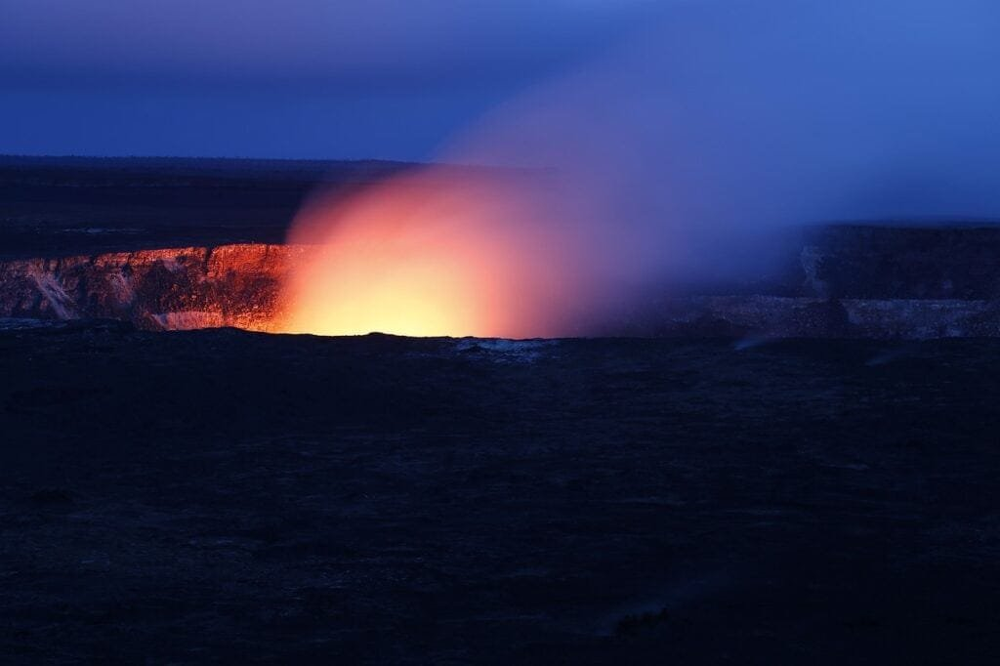

Get ready to embark on a comprehensive journey into the fascinating world of volcano features in national parks. Volcanoes, with their powerful eruptions of molten rock, gases, and debris, create awe-inspiring landscapes and hold the key to understanding Earth's dynamic processes. Whether you're marveling at the towering peaks of the "Ring of Fire" or exploring the gradual formation of shield volcanoes in Hawaii, this guide will provide you with valuable insight into the different types of volcanoes, their distribution, eruption causes, hazards, and benefits. By delving into this knowledge, you'll gain a deeper appreciation for these natural wonders and the role they play in shaping our planet. Get ready to uncover the secrets of volcano features in national parks.

# Understanding Volcano Formation

Volcanoes are incredible geological formations that result from the release of molten rock, gases, and debris from the Earth's interior to its surface. This process, known as volcanic eruptions, leads to the creation of majestic mountains and landscapes. To fully grasp the formation of volcanoes, it is essential to explore the underlying processes and factors that contribute to their development.

<iframe width="560" height="315" src="https://www.youtube.com/embed/Pfyx5bEZK80" frameborder="0" allow="accelerometer; autoplay; encrypted-media; gyroscope; picture-in-picture" allowfullscreen></iframe>

  

## Process of Volcano Formation

Volcano formation occurs primarily at three distinct locations: plate boundaries, hotspots, and rift zones. Plate boundaries, where tectonic plates meet and interact, are common sites for volcanoes. The movement and collision of these plates cause tremendous pressure and friction, leading to the release of magma through volcanic activity.

Hotspots are another crucial factor in volcano formation. These are areas deep beneath the Earth's crust where a significant amount of heat is generated. This immense heat creates a thermal anomaly, causing rocks to melt and form magma. Hotspots can remain stationary while the tectonic plates above move, resulting in a chain of volcanoes, such as the Hawaiian Islands.

Rift zones, where tectonic plates are spreading apart, also contribute to volcano formation. As the plates separate, magma rises to fill the gap. This process forms volcanoes along the rift, such as those found on the ocean floor.

## Role of Tectonic Plates in Volcano Formation

Tectonic plates play a crucial role in the formation of volcanoes. These massive plates, which make up the Earth's surface, are constantly in motion, albeit very slowly. When two plates collide, one plate is forced beneath the other, creating a subduction zone. This collision generates intense heat and pressure, leading to the melting of the Earth's mantle and the formation of magma. Eventually, this magma rises through cracks in the Earth's crust, forming a volcano.

In other instances, tectonic plates move apart, creating rift zones. As the plates separate, magma from the mantle rises to fill the gap, resulting in volcanic activity. The movement of tectonic plates plays a significant role in determining the location and characteristics of volcanoes around the world.

## Volcanic Hotspots

Volcanic hotspots are areas deep within the Earth's mantle where intense heat generates volcanic activity. These hotspots remain stationary while the tectonic plates above them move. Consequently, a chain of volcanoes forms, with the most active volcano situated above the hotspot. This chain gradually elongates as the plate moves, creating a trail of extinct volcanoes in its wake.

One of the most famous examples of a volcanic hotspot chain is found in the Hawaiian Islands. The Hawaiian hotspot has given rise to a series of shield volcanoes, characterized by their gently sloping sides and vast size. These shield volcanoes are created as magma travels upwards, erupting gently and steadily onto the surface. These volcanic hotspots, along with their associated volcanic chains, provide valuable insights into the formation and behavior of volcanoes.

# Types of Volcanoes

Volcanoes exhibit a wide range of shapes and sizes, each with its distinct characteristics. By understanding the different types of volcanoes, we gain insights into the geological forces at play and the potential risks associated with each type.

## Shield Volcanoes

Shield volcanoes, often found in hotspot regions, are known for their broad, gently sloping sides and enormous size. The name "shield volcano" comes from their resemblance to a warrior's shield laying flat on the ground. These volcanoes are formed when lava eruptions occur with low viscosity, allowing the magma to flow freely and travel long distances before solidifying.

The Hawaiian Islands, including Mauna Loa and Mauna Kea, are home to some of the world's most remarkable shield volcanoes. These volcanoes, formed over millions of years by the Hawaiian hotspot, have shaped the islands' unique topography and have become popular tourist destinations.

## Composite or Stratovolcanoes

Composite volcanoes, also known as stratovolcanoes, are characterized by their steep sides and tall peak. Unlike shield volcanoes, composite volcanoes are formed by alternating layers of lava and ash. The lava can be highly viscous, leading to explosive eruptions and the formation of ash clouds and pyroclastic flows.

The famous Mount Fuji in Japan and Mount St. Helens in the United States are examples of composite volcanoes. These awe-inspiring mountains, though beautiful, require caution due to their potential for violent eruptions.

## Cinder Cones

Cinder cones are the simplest and smallest type of volcano. They are usually formed by short, explosive eruptions, which eject fragmented pieces of lava, known as cinders. These cinders pile up around the vent, forming a symmetrical cone shape with steep sides.

Cinder cones are often found on the flanks of larger volcanoes or as standalone structures. While they may not reach the immense size of shield or composite volcanoes, they are still fascinating geological features.

This image is property of pixabay.com.

## Lava Domes

Lava domes are created when highly viscous lava accumulates around the vent, forming a rounded or bulbous mass. These domes are often associated with explosive eruptions and can grow slowly over time. Lava domes can be found within the crater of larger volcanoes or as standalone features.

One well-known example of a lava dome is the Soufrière Hills volcano in Montserrat. The growth of a lava dome within the volcano's crater has resulted in devastating pyroclastic flows and ashfall, emphasizing the potential hazards associated with these formations.

# Ring of Fire and Volcanoes

Numerous volcanoes are situated around the "Ring of Fire," a Pacific Ocean region known for its intense volcanic and seismic activity. Understanding the characteristics and distribution of volcanoes in this area provides essential insights into the volatile nature of our planet.

## Ring of Fire Description

The Ring of Fire is a vast area that encircles the Pacific Ocean, spanning approximately 40,000 kilometers. It is home to a significant portion of the world's active volcanoes and encompasses numerous tectonic plate boundaries. This region is known for its intense volcanic activity, earthquakes, and tectonic plate movements, making it a hotbed of geological phenomena.

## Distribution of Volcanoes around the Ring of Fire

Volcanoes around the Ring of Fire are primarily situated along subduction zones. These zones occur when one tectonic plate is forced beneath another, leading to the creation of intense heat and pressure. This subduction process causes the melting of the Earth's mantle, resulting in volcanic eruptions.

The Pacific Ring of Fire is home to iconic volcanoes such as Mount Fuji in Japan, Mount Rainier in the United States, and Mount Mayon in the Philippines. These volcanoes, among many others, are a testament to the active nature of the Earth's geology in this region.

## Role of Tectonic Plate Boundaries on Ring of Fire Volcanoes

Tectonic plate boundaries play a critical role in the formation and activity of volcanoes around the Ring of Fire. The subduction zones along these plate boundaries create ideal conditions for volcanic eruptions. As one tectonic plate is forced beneath another, it sinks into the Earth's mantle, where it melts and forms magma. This magma then rises to the surface, leading to volcanic activity.

In addition to subduction zones, the Ring of Fire also encompasses regions where tectonic plates are moving apart, creating rift zones. These rift zones have the potential to generate volcanic eruptions, contributing to the overall volcanic activity in the region.

Understanding the dynamic relationship between tectonic plate boundaries and [volcanoes](https://magmamatters.com/understanding-volcanic-formation-a-comprehensive-guide/ "Understanding Volcanic Formation: A Comprehensive Guide") is crucial for predicting and mitigating the risks associated with volcanic eruptions.

# Hawaii’s Shield Volcanoes

The volcanic islands of Hawaii are renowned for their spectacular shield volcanoes. These massive formations, shaped by millions of years of volcanic activity, offer unique insights into the geology and natural history of the islands.

## Formation of Hawaii’s Shield Volcanoes

Hawaii's shield volcanoes, such as Mauna Loa and Mauna Kea, are primarily formed by eruptions from the Hawaiian hotspot. As the Pacific Plate moves over the hotspot, successive volcanic eruptions create new islands, with each island becoming progressively older toward the northwest.

The Hawaiian Islands, as seen today, are the result of millions of years of volcanic activity. The eruptions from the hotspot have created a chain of shield volcanoes, each with its distinct features and characteristics.

## Unique Features of Hawaii’s Volcanoes

One of the fascinating aspects of Hawaii's shield volcanoes is their enormous size. These volcanoes are among the largest on Earth, with Mauna Loa standing as the world's largest shield volcano by volume. The gentle slopes and broad shape of the shield volcanoes make them visually striking and distinguishable from other volcano types.

In addition to their size, Hawaii's shield volcanoes also exhibit unique volcanic features. Lava tubes, formed by the flow of lava during eruptions, can be found throughout the islands. These tunnels offer a captivating glimpse into the underground world of volcanic activity.

This image is property of pixabay.com.

## Volcano National Park on Hawaii’s Big Island

One of the best opportunities to explore Hawaii's shield volcanoes is through a visit to Hawai'i Volcanoes National Park on the Big Island. This incredible park showcases the geological wonders of the Kīlauea and Mauna Loa volcanoes.

At the park, visitors can witness the raw power of volcanic activity by observing active lava flows, sulfurous vents, and other volcanic features. The park also offers numerous hiking trails, allowing visitors to explore the unique landscapes shaped by volcanic eruptions.

Hawai'i Volcanoes National Park serves as a testament to the ongoing volcanic activity in the region and provides a deeper understanding of the formation and behavior of shield volcanoes.

# Eruption Patterns

Volcanic eruptions are awe-inspiring natural phenomena that result from the release of magma, gases, and volcanic debris onto the Earth's surface. Understanding the various eruption patterns and the factors that influence them is crucial for predicting volcanic activity and mitigating potential risks.

## Eruption Types

Volcanic eruptions can be categorized into several distinct types, each characterized by its intensity, explosiveness, and the material ejected during the eruption.

- **Explosive Eruptions:** These eruptions occur when highly viscous magma, trapped gases, and volcanic ash are forcefully ejected from the volcano. The explosive nature of these eruptions can lead to the formation of [pyroclastic flows](https://magmamatters.com/the-environmental-impact-of-volcanic-eruptions-2/ "The Environmental Impact of Volcanic Eruptions") and the dispersal of volcanic ash over large areas. Composite volcanoes are known for their explosive eruptions.
    
- **Effusive Eruptions:** Effusive eruptions involve the gradual release of relatively fluid lava onto the surface. This lava flows slowly and steadily, forming broad lava fields and shield volcanoes. These eruptions are commonly seen in hotspot regions and are characteristic of shield volcanoes.
    
- **Phreatomagmatic Eruptions:** Phreatomagmatic eruptions occur when water interacts with magma, creating a highly explosive eruption. These eruptions can lead to the formation of volcanic ash, volcanic bombs, and the release of steam and volcanic gases.
    

Each eruption type presents unique hazards and consequences. By studying these eruption patterns, scientists can better understand the behavior of volcanoes and predict future volcanic activity.

## Factors Influencing Eruption Patterns

Several factors play a significant role in determining the eruption patterns of volcanoes.

- **Viscosity of magma:** The viscosity, or thickness, of magma influences the eruptive behavior. High-viscosity magma, such as andesite or rhyolite, tends to trap gases, leading to explosive eruptions. In contrast, low-viscosity magma, like basalt, flows more freely, resulting in effusive eruptions.
    
- **Gas content:** The presence of gases, primarily water vapor, carbon dioxide, and sulfur dioxide, within the magma significantly affects eruption patterns. Increasing gas content increases the explosiveness of an eruption. Gas pressure builds up within the volcano, eventually leading to a sudden release through explosive eruptions.
    
- **Composition of magma:** The chemical composition of magma can vary, with different elements and compounds influencing eruption patterns. Magma rich in silica tends to have a higher viscosity and can lead to explosive eruptions. Magma with lower silica content, such as basalt, typically results in more effusive eruptions.
    
- **Dissolved water content:** The amount of water dissolved in magma also influences eruption patterns. Water can lower the melting point of rocks and aid in the movement of magma. Excess water within a volcano can lead to phreatomagmatic eruptions.
    

Understanding these factors and their interaction is crucial for predicting volcanic eruption patterns and the potential risks associated with each eruption type.

## Eruption Predictions

Predicting volcanic eruptions is a challenging task that requires the careful monitoring of volcanic activity and the interpretation of various data and warning signs. Scientists employ a range of techniques and tools to monitor volcanoes and gather critical information to aid in eruption predictions.

- **Seismic Monitoring:** By analyzing seismic waves generated by volcanic activity, scientists can detect signs of an impending eruption. Unusual patterns or [increased seismic activity](https://magmamatters.com/the-art-and-science-of-volcano-monitoring/ "The Art and Science of Volcano Monitoring") can indicate movement of magma and changing conditions within a volcano.
    
- **Gas Monitoring:** Measuring the composition and abundance of gases emitted by a volcano can provide valuable insights into its behavior. Changes in gas emissions, such as an increase in sulfur dioxide levels, can be indicators of rising magma and potential eruption activity.
    
- **Ground Deformation Monitoring:** The use of satellite-based technologies, such as GPS or interferometric synthetic aperture radar (InSAR), allows scientists to measure changes in the shape or elevation of a volcano. These measurements can help identify the movement of magma beneath the surface.
    
- **Volcano Observatories:** Dedicated volcano observatories and research institutions play a crucial role in monitoring volcanic activity and issuing timely warnings. By maintaining a constant presence near active volcanoes, scientists can closely monitor any changes and provide valuable information to local authorities and communities.
    

While these monitoring techniques have significantly improved our ability to predict volcanic eruptions, accurately forecasting the timing and magnitude of an eruption remains challenging. Continued research and technological advancements in volcano monitoring offer hope for more reliable eruption predictions in the future.

# Hazards and Benefits of Volcanoes

Volcanic activity can have both destructive and constructive effects on the surrounding environment and human communities. Understanding the hazards posed by volcanoes and the benefits they provide can help in developing effective risk mitigation strategies and harnessing their potential.

## Volcanic Related Disasters

Volcanic eruptions can result in a wide range of hazards, posing significant risks to both the natural environment and human populations.

- **Pyroclastic Flows:** These fast-moving, superheated ash and gas clouds can reach speeds of several hundred kilometers per hour and devastate everything in their path. Pyroclastic flows are among the most deadly hazards associated with volcanic eruptions.
    
- **Lahars:** Lahars are volcanic mudflows that occur when volcanic ash and debris mix with water, either from rainfall or melting snow and ice. These mudflows can travel long distances and bury entire communities, causing extensive damage and loss of life.
    
- **Ashfall:** Volcanic ash, fine particles of pulverized rock, can blanket vast areas during an eruption. Besides suffocating vegetation and causing respiratory issues for humans and animals, ashfall can also disrupt transportation, contaminate water supplies, and damage infrastructure.
    
- **Lava Flows:** Though often slow-moving and predictable, lava flows can still cause significant destruction. They can engulf homes, infrastructure, and agricultural land, altering the landscape permanently.
    
- **Volcanic Gases:** Volcanic eruptions release a variety of gases, including sulfur dioxide, carbon dioxide, and hydrogen sulfide. These gases can be toxic, leading to severe respiratory problems for humans and animals.
    

It is crucial for communities near active volcanoes to understand these hazards and have comprehensive risk mitigation strategies in place to minimize the impact of volcanic disasters.

## Benefits of Volcanic Activities

Despite the hazards associated with volcanic activity, volcanoes also bring a range of benefits to the surrounding environment and human communities.

- **Fertile Soil:** Volcanic eruptions enrich the surrounding soil with minerals and nutrients, making it incredibly fertile for agriculture. Many volcanic regions, such as those in Hawaii and Italy, are known for their productive agricultural practices.
    
- [Geothermal Energy: Volcanic](https://magmamatters.com/geothermal-energy-and-its-volcanic-origins/ "Geothermal Energy and Its Volcanic Origins") activity provides a valuable source of geothermal energy. Geothermal power plants harness the heat stored within the Earth to generate electricity and heat homes, reducing reliance on fossil fuels.
    
- **Creation of New Land:** Volcanic eruptions can result in the formation of new landmasses, such as islands or lava deltas. These new land formations can provide habitats for unique flora and fauna and attract tourism, benefiting local economies.
    
- **Mineral Resources:** Volcanic activity can lead to the formation of valuable mineral deposits, including precious metals and gemstones. These resources can drive economic development and create employment opportunities for local communities.
    

Understanding the benefits of volcanic activities can help foster a balanced perspective and enable communities to harness these benefits while mitigating the associated risks.

This image is property of pixabay.com.

## Risk Mitigation Techniques

Minimizing the risks associated with volcanic eruptions requires the implementation of comprehensive risk mitigation strategies. These strategies aim to protect local populations, infrastructure, and the natural environment.

- **Early Warning Systems:** Developing and implementing early warning systems is crucial for providing timely information to communities at risk. These systems rely on real-time monitoring data to detect and predict volcanic activity, allowing people to evacuate and take necessary precautions.
    
- **Land-use Planning:** Careful land-use planning is essential for communities near active volcanoes. Identifying hazard zones and restricting development in high-risk areas can help prevent loss of life and property damage during eruptions.
    
- **Education and Awareness:** Educating communities about volcanic hazards, providing information on evacuation procedures, and raising awareness about the risks associated with volcanic activity are vital for ensuring the safety of individuals living in volcanic regions.
    
- **Volcano Monitoring:** Maintaining a robust volcano monitoring network is crucial for collecting data on volcanic activity. This data can inform eruption predictions, hazard assessments, and emergency response planning.
    
- **International Collaboration:** Volcanic activity often extends beyond national boundaries, necessitating international collaboration. Sharing data, knowledge, and resources among countries can enhance eruption predictions and foster a coordinated response during volcanic emergencies.
    

By implementing these risk mitigation techniques and constantly refining our understanding of volcanic processes, we can minimize the impact of volcanic disasters and foster the coexistence of human populations and volcanic environments.

# Volcanic Features in Yellowstone National Park

Yellowstone National Park, located mainly in the U.S. state of Wyoming, is a geological wonderland known for its unique geothermal features and volcanic activity. The park offers visitors the opportunity to witness the powerful forces that have shaped the landscape over millions of years.

## Geothermal Features and Volcanic Activity

Yellowstone National Park sits atop an active volcanic hotspot known as the Yellowstone Caldera. This caldera, formed by a massive volcanic eruption approximately 640,000 years ago, contains one of the world's most extensive hydrothermal areas.

The park is renowned for its numerous geysers, hot springs, mud pots, and steam vents, all showcasing the dynamic nature of the Earth's geothermal features. The geysers, most notably the iconic Old Faithful, erupt at regular intervals, ejecting hot water and steam into the air, providing a captivating spectacle for visitors.

## Yellowstone Caldera

The Yellowstone Caldera is a vast volcanic feature, measuring approximately 72 kilometers long and 56 kilometers wide. This caldera represents the remnants of past volcanic eruptions and is considered one of the largest supervolcanoes on Earth. Although dormant, the caldera is still geologically active, as evidenced by the park's geothermal features.

The volcanic activity within the Yellowstone Caldera has contributed to the park's unique geology, shaping its extraordinary landscapes and creating a vibrant ecosystem.

## Old Faithful Geyser and other Volcanic Landmarks

Perhaps the most famous geothermal feature within Yellowstone National Park is the Old Faithful geyser. This geyser, named for its regular eruptions, attracts millions of visitors each year. Old Faithful showcases the power and beauty of Yellowstone's volcanic activity, mesmerizing onlookers as it shoots boiling water and steam high into the air.

In addition to Old Faithful, numerous other geysers, such as the Grand Geyser and Castle Geyser, dot the landscape of Yellowstone. These geysers, each with its unique eruption patterns and characteristics, serve as a testament to the ongoing volcanic activity beneath the surface.

Yellowstone National Park's volcanic landmarks provide visitors with a glimpse into the immense power and beauty of Earth's geothermal features. The park's hydrothermal areas and the geological processes at work within its massive caldera make it a must-visit destination for those seeking to appreciate the wonders of our dynamic planet.

# St. Helens National Volcanic Monument

The eruption of Mount St. Helens in 1980 remains one of the most significant volcanic events in modern history. Today, the Mount St. Helens National Volcanic Monument serves as a living laboratory to study the impacts of volcanic activity and witness the remarkable recovery of a landscape devastated by eruption.

## 1980 Eruption of Mount St. Helens

On May 18, 1980, Mount St. Helens, located in the state of Washington, experienced a catastrophic eruption that drastically altered the surrounding landscape. The eruption resulted in the collapse of the volcano's north face and the release of tremendous amounts of volcanic ash, debris, and pyroclastic flows.

The eruption claimed the lives of 57 people and caused widespread destruction. The devastation caused by the eruption led to significant changes in environmental policies and the establishment of the Mount St. Helens National Volcanic Monument.

## Volcanic Features and Recovery of Mount St. Helens

Since the eruption, Mount St. Helens has become a focal point for scientific research and study on volcanic recovery. The monument offers a unique opportunity to witness the gradual regeneration and recolonization of an ecosystem after a volcanic event.

The landscape surrounding Mount St. Helens still bears the scars of the 1980 eruption. The Pumice Plain, a barren expanse of volcanic ash and debris, showcases the raw power of the eruption. However, over the years, life has returned to the area, with plants and animals recolonizing the devastated region.

Visitors to the Mount St. Helens National Volcanic Monument can witness firsthand the ongoing recovery of the landscape and gain a deeper appreciation for the resilience of nature.

## Visiting Mount St. Helens

Mount St. Helens is a popular destination for visitors interested in the geology and natural history of the Pacific Northwest. The Mount St. Helens National Volcanic Monument offers a range of experiences for all ages and interests.

Tourists can explore various visitor centers, such as the Johnston Ridge Observatory, which provides informative exhibits on the volcano's history, eruption, and ongoing research. Additionally, hiking trails allow visitors to experience the breathtaking views of the volcano and its surrounding landscape.

Whether observing the remarkable recovery of the landscape or learning about the forces that shape our planet, a visit to Mount St. Helens provides a unique opportunity to delve into the power and resilience of volcanic activity.

# Lassen Volcanic National Park

Located in Northern California, Lassen Volcanic National Park offers a glimpse into the fascinating geology and volcanic features of the region. The park showcases the remnants of past eruptions and provides visitors with a unique opportunity to witness volcanic activity up close.

## Volcanic Features of Lassen

Lassen Volcanic National Park boasts an array of volcanic features that are diverse and captivating. From volcanic peaks to hot springs, each geological formation tells a story of the park's turbulent volcanic past.

Lassen Peak, the park's namesake, stands as the largest plug dome volcano in the world. This majestic peak offers hiking opportunities and rewards visitors with stunning panoramic views of the surrounding landscapes.

Bumpass Hell, the park's largest hydrothermal area, showcases an otherworldly landscape of mud pots, steam vents, and boiling pools. Visitors can take a stroll along the boardwalks, marveling at the power and beauty of Lassen's geothermal features.

## Lassen Peak's Eruptions

The most famous eruption of Lassen Peak occurred in 1915, with a series of explosive eruptions lasting for over a year. These eruptions created a new crater and devastated the surrounding forests, leaving behind a barren landscape.

While Lassen Peak remains dormant, the eruptions of 1915 serve as a reminder of the region's volcanic activity and the potential for future eruptions.

## Hydrothermal Areas at Lassen

Lassen Volcanic National Park is home to several hydrothermal areas, where hot springs, fumaroles, and mud pots offer a glimpse into the geothermal activity beneath the surface.

One notable hydrothermal feature is Bumpass Hell, mentioned earlier. This expansive and dynamic area captivates visitors with its diverse geothermal features, as well as its vibrant colors and bubbling mud.

Other hydrothermal areas in the park, such as Sulphur Works and Little Hot Springs Valley, provide additional opportunities to witness the power of volcanic activity and the unique ecosystems that thrive in these extreme environments.

A visit to Lassen Volcanic National Park offers an educational and awe-inspiring journey through the region's volcanic history. From the towering peaks to the bubbling hot springs, the park's volcanic features never fail to leave a lasting impression on visitors.

# Crater Lake National Park

Crater Lake, located in Oregon, is one of the most iconic volcanic features in the United States. This stunning lake, nestled within the remains of a volcano, offers visitors a glimpse into the geological forces that have shaped the landscape over thousands of years.

## Formation of Crater Lake

Crater Lake owes its formation to the collapse of the ancient volcano Mount Mazama. Thousands of years ago, a massive eruption emptied the volcano's magma chamber, causing the summit to collapse inward. Over time, the collapsed caldera filled with rain and snowmelt, creating the deep, blue lake that exists today.

Crater Lake is the deepest lake in the United States and ranks as one of the clearest bodies of water in the world. Its pristine waters and rugged surroundings make it a natural wonder and a popular destination for tourists.

## Wizard Island and Mount Mazama

Within the caldera of Crater Lake lies Wizard Island, a cinder cone volcano that emerged from the lake's floor. Wizard Island showcases the raw power of volcanic activity and is a fascinating geological feature within the park.

Mount Mazama, the volcano responsible for the formation of Crater Lake, still holds a place of prominence within the park. Although the volcano no longer stands in its original form, its remnants serve as a reminder of the colossal volcanic forces that have shaped the region.

## Visiting Crater Lake and Its Volcanic Features

Crater Lake National Park offers visitors the opportunity to explore a landscape shaped by volcanic activity while immersing themselves in the park's natural beauty. From hiking trails that wind their way around the rim to boat tours that provide unique perspectives of the lake, the park offers a range of experiences suitable for all visitors.

Tourists can take in the breathtaking panoramic views from various overlooks, witnessing the interconnectedness between the lake and its volcanic surroundings. Through interpretive exhibits and ranger-led programs, visitors can also learn about the geological history of the park and the forces that created Crater Lake.

A journey to Crater Lake National Park promises a captivating experience, immersing visitors in the awe-inspiring beauty of one of nature's foremost volcanic creations.

In conclusion, understanding the formation, types, and characteristics of volcanoes provides us with invaluable insights into the dynamic nature of our planet. From the shield volcanoes of Hawaii to the geothermal wonders of Yellowstone National Park, each volcanic feature serves as a testament to the forces that have shaped our world. By studying these geologic marvels and implementing robust risk mitigation techniques, we can coexist with volcanoes and appreciate the beauty and power they embody. So grab your hiking boots and embark on a journey to witness the extraordinary volcano features found in national parks around the globe.

