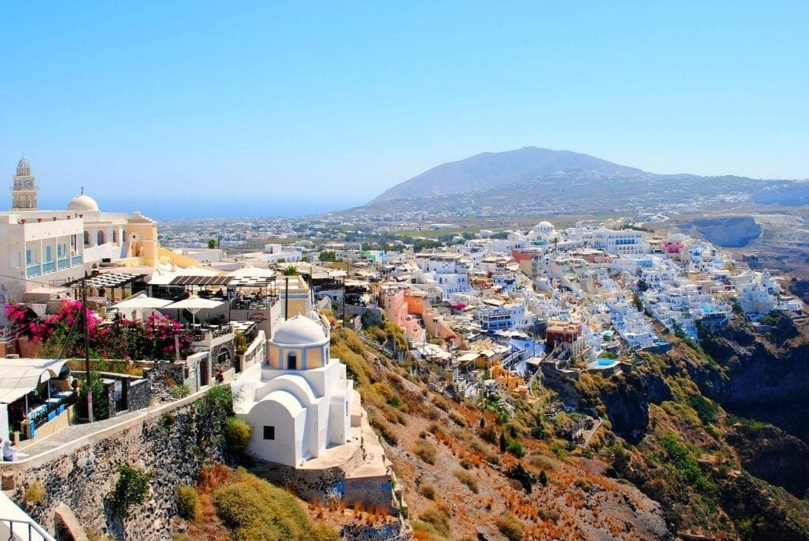
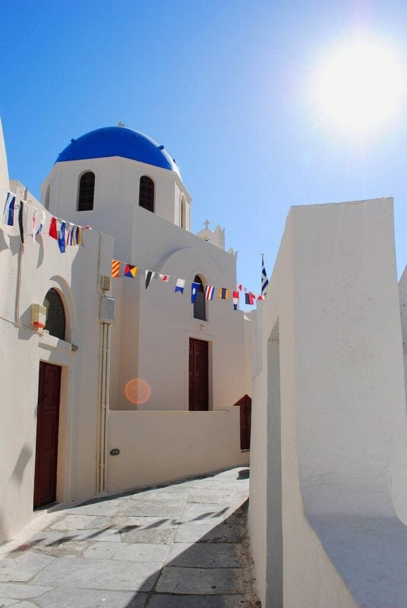
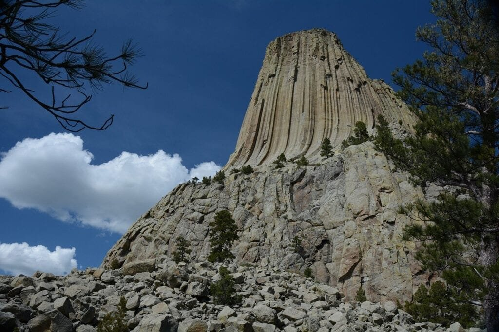

If you're someone who loves exploring nature's wonders and is fascinated by the raw power of volcanoes, then this guide to visiting tourist spots with dormant volcanoes is just for you. Volcanoes, formed by the escape of molten rock, gases, and debris from beneath the earth's surface, create breathtaking landscapes that captivate the imagination. From the explosive eruptions seen in the "Ring of Fire" to the serene shield volcanoes of Hawaii, each site offers a unique experience. In this guide, we will not only explore the different types of volcanoes and their distribution but also delve into the causes of volcanic eruptions, their hazards, and benefits. By understanding these incredible natural phenomena, you'll be equipped to enjoy your visit while appreciating the awe-inspiring forces at play. So grab your hiking boots and let's embark on a journey to explore these dormant volcanoes and the wonders they hold.

This image is property of pixabay.com.

## Understanding Volcanoes and Their Definition

### What are Volcanoes?

Volcanoes are natural geological formations that occur when molten rock, gases, and debris called magma escape to the Earth's surface, resulting in eruptions of lava and ash. These powerful eruptions can occur at various locations, including plate boundaries, hotspots under the Earth's crust, or rift zones where tectonic plates are moving apart. Volcanoes can have different shapes and sizes, ranging from towering mountains to underwater vents. They are not only fascinating [natural phenomena](https://magmamatters.com/the-art-and-science-of-volcano-monitoring/ "The Art and Science of Volcano Monitoring") but also play a crucial role in shaping the Earth's landscape.

### Difference between Dormant and Active Volcanoes

Volcanoes can be classified into different categories based on their activity levels. Two common classifications are dormant and active volcanoes. A dormant volcano is one that has not erupted for a significant period but could potentially erupt in the future. These volcanoes are in a temporary state of inactivity but can awaken and erupt when triggered by geological changes. On the other hand, an active volcano is one that has recently erupted or is currently showing signs of volcanic activity. Active volcanoes are more unpredictable and pose a higher risk to surrounding areas.

### Formation and Location of Volcanoes

Volcanoes are formed through complex geological processes. They can occur along plate boundaries, where tectonic plates intersect, causing magma to rise and reach the surface. The "Ring of Fire" encircling the Pacific Ocean is a prime example of a volcanic region, with numerous active volcanoes located along this seismic belt. Other volcanic formations, such as shield volcanoes, form gradually over hotspots deep underground. These hotspots create a constant supply of magma, resulting in the formation of volcanic islands like Hawaii.

## Significance of Visiting Dormant Volcanoes

### Cultural Relevance

Visiting dormant volcanoes can provide a unique cultural experience. Many volcanic regions have a rich history and cultural significance attached to these geological wonders. Volcanic landscapes often hold spiritual or mythological importance for local communities. Exploring these areas allows you to learn about the cultural heritage and beliefs associated with volcanoes. It offers a chance to connect with indigenous cultures and gain a deeper understanding of their traditions and customs.

### Spectacular Sightseeing

Dormant volcanoes offer breathtaking sights and scenic beauty that attract tourists from around the world. These volcanoes often have distinct features, such as craters, lava domes, and calderas, which create stunning landscapes. The contrast between the vibrant hues of volcanic rocks and the surrounding vegetation is a sight to behold. Whether it's the snow-capped peaks of Mount Kilimanjaro or the picturesque Santorini Caldera, dormant volcanoes provide awe-inspiring views that are a treat for nature enthusiasts and photographers alike.

### Educational Opportunity

Visiting dormant volcanoes is not only visually captivating but also presents an excellent opportunity for education. Volcanic regions serve as natural classrooms, allowing visitors to learn about various geological processes and the impact of volcanic activity on the Earth's ecosystem. Guided tours and interpretive centers provide valuable information about volcanic history, eruption mechanisms, and the role volcanoes play in shaping landscapes. Exploring these educational resources can broaden your knowledge and appreciation for the natural world.

This image is property of pixabay.com.

## Preparation Tips for Visiting Dormant Volcanoes

### Clothing and Gear

When preparing for a visit to dormant volcanoes, it is essential to consider the appropriate clothing and gear. Dressing in layers is advisable, as temperatures can vary significantly depending on the elevation and time of day. Comfortable hiking boots with good traction are necessary for navigating volcanic terrains. Additionally, carrying a backpack with essentials such as water, snacks, sunscreen, and insect repellent is highly recommended.

### Local Guides and Touring Groups

To make the most of your visit and ensure your safety, it is advisable to hire local guides or join touring groups. Local guides possess valuable knowledge about the region's history, geological features, and safety protocols. They can enhance your experience by sharing intriguing stories and pointing out unique aspects of the volcano. Touring groups not only provide a hassle-free experience but also offer the opportunity to meet fellow travelers and share memorable moments.

### Safety Measures

Safety should be a top priority when visiting dormant volcanoes. It is crucial to follow safety guidelines such as staying on designated paths and respecting any warning signs or barriers. Volcanic terrains can be unpredictable, with potential hazards like unstable ground, steep slopes, or toxic gases. Being mindful of your surroundings and adhering to safety instructions provided by guides or local authorities will help ensure a safe and enjoyable visit.

### Health Precautions

Visiting high-altitude dormant volcanoes may require taking certain health precautions. Altitude sickness can affect individuals who are not accustomed to higher elevations. It is advisable to consult a healthcare professional before the visit and take appropriate measures, such as acclimatizing gradually and staying hydrated. Additionally, some volcanic regions may have unique flora and fauna, so it is essential to be cautious of any potential allergies or risks associated with local wildlife.

## Dormant Volcanoes in North America

### Mount St. Helens, Washington, USA

Mount St. Helens in Washington state is one of the most iconic dormant volcanoes in North America. It gained worldwide recognition after its devastating eruption in 1980, which caused significant destruction and claimed several lives. Today, visitors can explore the Mount St. Helens National Volcanic Monument, which offers a range of educational exhibits and hiking trails that allow you to witness the aftermath of the eruption and the subsequent regrowth of the surrounding ecosystem.

### Mount Baker, Washington, USA

Located in the North Cascades of Washington state, Mount Baker is another notable dormant volcano in the region. Standing at an impressive height of 10,781 feet (3,286 meters), Mount Baker offers panoramic views of glacial landscapes and alpine meadows. The mountain is a popular destination for hiking, skiing, and mountaineering enthusiasts. Guided tours and climbing expeditions are available for those seeking a thrilling adventure in the presence of this majestic volcano.

### Mauna Kea, Hawaii, USA

While dormant, Mauna Kea volcano on the Big Island of Hawaii is a significant cultural and astronomical site. Standing at over 13,000 feet (4,000 meters) above sea level, it is the tallest volcano in Hawaii. Mauna Kea is sacred to the indigenous Hawaiian people and is home to numerous cultural and historical sites. Visitors can experience a unique blend of cultural heritage and stargazing opportunities, as Mauna Kea is renowned for its clear skies and world-class observatories.

This image is property of pixabay.com.

## Dormant Volcanoes in South America

### Cerro Azul, Galapagos Islands, Ecuador

Cerro Azul, located on Isabela Island in the Galapagos archipelago of Ecuador, is an intriguing dormant volcano worth exploring. Surrounded by unique flora and fauna, this volcanic site offers visitors the chance to witness fascinating geological formations and intriguing lava flows. The volcanic landscapes of Cerro Azul provide an unparalleled opportunity for nature lovers, birdwatchers, and [geology](https://magmamatters.com/geothermal-energy-and-its-volcanic-origins/ "Geothermal Energy and Its Volcanic Origins") enthusiasts to observe the remarkable biodiversity that thrives in this volcanic environment.

### Nevado del Tolima, Colombia

Nevado del Tolima, situated in the Colombian Andes, is a dormant stratovolcano renowned for its rugged beauty and challenging hikes. This majestic volcano offers breathtaking panoramas of glacial peaks, lush valleys, and alpine lakes. Adventurous hikers can embark on multi-day treks that lead to the summit, providing a true mountaineering experience surrounded by breathtaking scenery and the remnants of past volcanic activity.

### Ojos del Salado, Chile-Argentina Border

Ojos del Salado, located on the border between Chile and Argentina, is the highest volcano in the world, with its summit reaching an astounding 22,615 feet (6,893 meters) above sea level. This dormant volcano presents a thrilling adventure for experienced mountaineers, with its challenging altitude and rugged terrain. Climbing Ojos del Salado offers a unique opportunity to push personal limits and be rewarded with awe-inspiring views of the surrounding Andean landscapes.

## Dormant Volcanoes in Europe

### Santorini, Greece

Santorini, a volcanic island in the Aegean Sea, attracts visitors with its unique geology and stunning sunsets. The iconic caldera, formed by a massive volcanic eruption in ancient times, is a focal point for tourists. Exploring the charming villages perched on the volcanic cliffs and witnessing the whitewashed buildings against the backdrop of the azure sea is an unforgettable experience. Santorini's volcanic history and [geological marvels make it a must-visit destination for travelers](https://magmamatters.com/the-environmental-impact-of-volcanic-eruptions-2/ "The Environmental Impact of Volcanic Eruptions") seeking a blend of natural beauty and cultural heritage.

### Mount Vesuvius, Italy

Mount Vesuvius near Naples, Italy, is infamous for its catastrophic eruption in AD 79 that buried the ancient city of Pompeii under layers of volcanic ash. Today, visitors can hike to the summit of this dormant volcano and peer into its volcanic crater. The hike offers stunning panoramic views of the Naples Bay and the surrounding landscape. Exploring this historical and geological gem allows you to witness firsthand the destructive power of volcanic eruptions and their long-lasting impact on civilization.

### Ben Nevis, Scotland

Ben Nevis, located in the Scottish Highlands, is the highest mountain in the British Isles and an ancient dormant volcano. This majestic peak attracts hikers and mountaineers from around the world, offering a challenging ascent and rewarding views of the Scottish landscape. The surrounding area is home to diverse wildlife and captivating geological formations, providing a unique experience for outdoor enthusiasts and nature lovers.

## Dormant Volcanoes in Asia

### Mount Agung, Bali, Indonesia

Mount Agung, located on the stunning island of Bali in Indonesia, is not only a dormant volcano but also a revered spiritual site. It holds great significance in Balinese Hinduism and is home to the Pura Besakih, the largest and most important Balinese temple. Visitors can hike to the summit of Mount Agung, witnessing panoramic views of the island while immersing themselves in the spiritual energy that surrounds this sacred volcanic mountain.

### Mayon Volcano, Philippines

Mayon Volcano in the Philippines is known for its symmetrical cone shape and picturesque landscape. It is considered one of the most active volcanoes in the country, having erupted numerous times throughout history. While climbing to the summit is currently prohibited due to safety concerns, visitors can still marvel at its beauty from various vantage points or take part in guided tours that provide insights into the region's volcanic history and the impact of volcanic activity on the local communities.

### Sakurajima, Japan

Sakurajima, situated in Kagoshima Bay in Japan, is an active volcano that was once an island but is now connected to the mainland due to past volcanic activity. Despite its ongoing volcanic activity, guided tours and ferry trips allow visitors to witness the power and beauty of this majestic volcano from a safe distance. The surrounding area offers hot springs, panoramic viewpoints, and a unique opportunity to experience the coexistence of a flourishing city with the constant presence of volcanic activity.

## Dormant Volcanoes in Africa

### Mount Kilimanjaro, Tanzania

Mount Kilimanjaro in Tanzania is the highest mountain in Africa and one of the most famous dormant volcanoes in the world. Its snow-capped peaks and diverse ecosystems make it an iconic destination for adventure seekers and nature enthusiasts. Climbing Mount Kilimanjaro offers a life-changing experience, taking you through various climatic zones and granting you breathtaking views of the African savannah as you ascend towards the summit.

### Mount Kenya, Kenya

Mount Kenya, located in central Kenya, is the second-highest mountain in Africa and a UNESCO World Heritage Site. This dormant stratovolcano offers a range of hiking routes that cater to different fitness levels and preferences. Mount Kenya National Park is renowned for its unique alpine flora and stunning landscapes, including glacial valleys, tarns, and rugged peaks. Exploring Mount Kenya allows you to witness the remarkable biodiversity and rich cultural heritage of the region.

### Mount Cameroon, Cameroon

Mount Cameroon, situated on the west coast of Cameroon, is an active volcano that attracts adventurers and nature lovers alike. Its rugged beauty, dense rainforests, and diverse wildlife make it an ideal destination for hiking and wildlife spotting. The ascent to the summit takes you through various ecological zones, and the panoramic views from the top offer a rewarding experience. Mount Cameroon holds great cultural significance for the local communities, and visiting this volcano allows you to immerse yourself in the region's vibrant traditions and way of life.

## Dormant Volcanoes in Australia and Oceania

### Mount Wellington, Tasmania, Australia

Mount Wellington, overlooking the city of Hobart in Tasmania, Australia, is a dormant volcano with a distinctive alpine landscape. The summit offers stunning panoramic views of the city, surrounding forests, and the Tasmanian coastline. Mount Wellington is a popular destination for outdoor activities such as hiking, mountain biking, and rock climbing. Exploring the diverse flora and fauna of this volcanic mountain provides an immersive experience in the unique ecosystem of Tasmania.

### Mount Taranaki, New Zealand

Mount Taranaki, also known as Mount Egmont, is a dormant stratovolcano located on the west coast of New Zealand's North Island. This stunning volcano is characterized by its symmetrical cone shape and lush rainforest-clad slopes. Mount Taranaki is a popular destination for hiking, with a range of trails catering to different skill levels. The magnificent views from the summit encompass rugged coastline, verdant farmland, and the extraordinary beauty of Egmont National Park.

## Few Safety Points for Touring Dormant Volcanoes

### Following Guided Paths

When exploring dormant volcanoes, it is crucial to follow designated paths and trails. Venturing off the established routes can lead to dangerous situations, including encounters with unstable ground or potential exposure to hazardous gases. Stick to the prescribed paths to ensure your safety and minimize the impact on the volcanic environment.

### Staying Informed on Current Volcanic Activity

Before visiting dormant volcanoes, it is essential to check for any recent or ongoing volcanic activity. Volcanic behavior can change unpredictably, and even dormant volcanoes can show signs of unrest or awakening. Stay updated by monitoring local volcanic observatories or checking with local authorities to ensure that your visit aligns with safe conditions.

### Maintaining Respect for Sacred and Culturally Significant Sites

Many dormant volcanoes hold significant cultural and spiritual importance for local communities. It is important to respect any cultural protocols, customs, or restrictions associated with these sites. Be mindful of any sensitive areas or practices and abide by guidelines provided by local guides or authorities to ensure that you maintain the sanctity and authenticity of these locations.

### Preparing for Sudden Weather Changes and Altitude Sickness

Dormant volcanoes are often located in diverse and challenging environments, including high-altitude regions. Be prepared for sudden weather changes, such as temperature drops or storms, by carrying appropriate clothing and gear. Additionally, high elevations can pose a risk of altitude sickness, especially if you are not acclimatized. Take necessary precautions, such as gradual ascent and staying well-hydrated, to minimize the risk of altitude-related health issues.

Visiting tourist spots with dormant volcanoes offers a unique blend of natural beauty, cultural experiences, and educational opportunities. By understanding volcanoes and their significance, preparing adequately, and respecting safety guidelines, you can embark on unforgettable journeys to explore these captivating geological wonders. Whether you're captivated by the towering peaks of Mount Kilimanjaro or fascinated by the cultural heritage of Mount Vesuvius, dormant volcanoes provide a window into the Earth's dynamic and awe-inspiring geology. So, pack your bags, embark on an adventure, and witness the dormant power and majestic beauty of these volcanic wonders.

